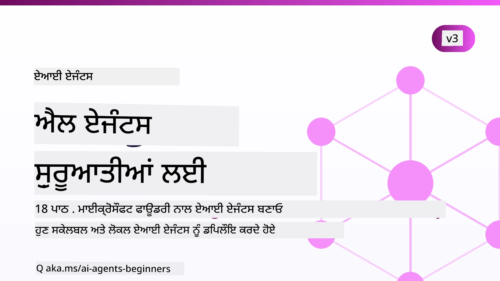

# ਬਿਗਿਨਰਜ਼ ਲਈ AI ਏਜੰਟ - ਇੱਕ ਕੋਰਸ



## ਇੱਕ ਕੋਰਸ ਜੋ ਤੁਹਾਨੂੰ AI ਏਜੰਟ ਬਣਾਉਣ ਲਈ ਜ਼ਰੂਰੀ ਸਾਰੀਆਂ ਜਾਣਕਾਰੀਆਂ ਸਿਖਾਉਂਦਾ ਹੈ

[](https://github.com/microsoft/ai-agents-for-beginners/blob/master/LICENSE?WT.mc_id=academic-105485-koreyst)
[](https://GitHub.com/microsoft/ai-agents-for-beginners/graphs/contributors/?WT.mc_id=academic-105485-koreyst)
[](https://GitHub.com/microsoft/ai-agents-for-beginners/issues/?WT.mc_id=academic-105485-koreyst)
[](https://GitHub.com/microsoft/ai-agents-for-beginners/pulls/?WT.mc_id=academic-105485-koreyst)
[](http://makeapullrequest.com?WT.mc_id=academic-105485-koreyst)

### 🌐 ਬਹੁ-ਭਾਸ਼ਾਈ ਸਮਰਥਨ

#### GitHub ਐਕਸ਼ਨ ਦੁਆਰਾ ਸਮਰਥਿਤ (ਆਟੋਮੈਟਿਕ ਅਤੈ ਸਦਾ ਅੱਪ-ਟੂ-ਡੇਟ)

<!-- CO-OP TRANSLATOR LANGUAGES TABLE START -->
[Arabic](../ar/README.md) | [Bengali](../bn/README.md) | [Bulgarian](../bg/README.md) | [Burmese (Myanmar)](../my/README.md) | [Chinese (Simplified)](../zh-CN/README.md) | [Chinese (Traditional, Hong Kong)](../zh-HK/README.md) | [Chinese (Traditional, Macau)](../zh-MO/README.md) | [Chinese (Traditional, Taiwan)](../zh-TW/README.md) | [Croatian](../hr/README.md) | [Czech](../cs/README.md) | [Danish](../da/README.md) | [Dutch](../nl/README.md) | [Estonian](../et/README.md) | [Finnish](../fi/README.md) | [French](../fr/README.md) | [German](../de/README.md) | [Greek](../el/README.md) | [Hebrew](../he/README.md) | [Hindi](../hi/README.md) | [Hungarian](../hu/README.md) | [Indonesian](../id/README.md) | [Italian](../it/README.md) | [Japanese](../ja/README.md) | [Kannada](../kn/README.md) | [Khmer](../km/README.md) | [Korean](../ko/README.md) | [Lithuanian](../lt/README.md) | [Malay](../ms/README.md) | [Malayalam](../ml/README.md) | [Marathi](../mr/README.md) | [Nepali](../ne/README.md) | [Nigerian Pidgin](../pcm/README.md) | [Norwegian](../no/README.md) | [Persian (Farsi)](../fa/README.md) | [Polish](../pl/README.md) | [Portuguese (Brazil)](../pt-BR/README.md) | [Portuguese (Portugal)](../pt-PT/README.md) | [Punjabi (Gurmukhi)](./README.md) | [Romanian](../ro/README.md) | [Russian](../ru/README.md) | [Serbian (Cyrillic)](../sr/README.md) | [Slovak](../sk/README.md) | [Slovenian](../sl/README.md) | [Spanish](../es/README.md) | [Swahili](../sw/README.md) | [Swedish](../sv/README.md) | [Tagalog (Filipino)](../tl/README.md) | [Tamil](../ta/README.md) | [Telugu](../te/README.md) | [Thai](../th/README.md) | [Turkish](../tr/README.md) | [Ukrainian](../uk/README.md) | [Urdu](../ur/README.md) | [Vietnamese](../vi/README.md)

> **ਕੀ ਤੁਹਾਨੂੰ ਲੋਕਲ ਕਲੋਨ ਕਰਨਾ ਪਹਿਲਾਂ ਪਸੰਦ ਹੈ?**
>
> ਇਸ ਰਿਪੋਜ਼ਿਟਰੀ ਵਿੱਚ 50+ ਭਾਸ਼ਾ ਦੇ ਅਨੁਵਾਦ ਸ਼ਾਮਲ ਹਨ ਜੋ ਡਾਊਨਲੋਡ ਸਾਈਜ਼ ਨੂੰ ਮਹੱਤਵਪੂਰਨ ਤੌਰ ਤੇ ਵਧਾਉਂਦੇ ਹਨ। ਅਨੁਵਾਦਾਂ ਦੇ ਬਗੈਰ ਕਲੋਨ ਕਰਨ ਲਈ, ਸਪੈਰਸ ਚੈਕਆਉਟ ਦੀ ਵਰਤੋਂ ਕਰੋ:
>
> **ਬੈਸ਼ / macOS / Linux:**
> ```bash
> git clone --filter=blob:none --sparse https://github.com/microsoft/ai-agents-for-beginners.git
> cd ai-agents-for-beginners
> git sparse-checkout set --no-cone '/*' '!translations' '!translated_images'
> ```
>
> **CMD (ਵਿੰਡੋਜ਼):**
> ```cmd
> git clone --filter=blob:none --sparse https://github.com/microsoft/ai-agents-for-beginners.git
> cd ai-agents-for-beginners
> git sparse-checkout set --no-cone "/*" "!translations" "!translated_images"
> ```
>
> ਇਹ ਤੁਹਾਨੂੰ ਕੋਰਸ ਪੂਰਾ ਕਰਨ ਲਈ ਜ਼ਰੂਰੀ ਸਾਰਾ ਕੁਝ ਤੇਜ਼ ਡਾਊਨਲੋਡ ਨਾਲ ਦਿੰਦਾ ਹੈ।
<!-- CO-OP TRANSLATOR LANGUAGES TABLE END -->

**ਜੇ ਤੁਸੀਂ ਹੋਰ ਅਨੁਵਾਦ ਭਾਸ਼ਾਵਾਂ ਲਈ ਸਮਰਥਨ ਚਾਹੁੰਦੇ ਹੋ, ਉਹ [ਇੱਥੇ](https://github.com/Azure/co-op-translator/blob/main/getting_started/supported-languages.md) ਸੂਚੀਬੱਧ ਹਨ।**

[](https://GitHub.com/microsoft/ai-agents-for-beginners/watchers/?WT.mc_id=academic-105485-koreyst)
[](https://GitHub.com/microsoft/ai-agents-for-beginners/network/?WT.mc_id=academic-105485-koreyst)
[](https://GitHub.com/microsoft/ai-agents-for-beginners/stargazers/?WT.mc_id=academic-105485-koreyst)

[](https://discord.com/invite/ATgtXmAS5D)


## 🌱 ਸ਼ੁਰੂਆਤ ਕਰਨਾ

ਇਸ ਕੋਰਸ ਵਿੱਚ AI ਏਜੰਟ ਬਣਾਉਣ ਦੇ ਮੂਲ ਅਸੂਲ ਸਿੱਖਾਏ ਜਾਂਦੇ ਹਨ। ਹਰ ਪਾਠ ਆਪਣਾ ਵਿਸ਼ਾ ਕਵਰ ਕਰਦਾ ਹੈ ਇਸ ਲਈ ਤੁਸੀਂ ਇੱਛਾ ਅਨੁਸਾਰ ਕਿਤੇ ਵੀ ਸ਼ੁਰੂ ਕਰ ਸਕਦੇ ਹੋ!

ਇਸ ਕੋਰਸ ਲਈ ਬਹੁ-ਭਾਸ਼ਾਈ ਸਮਰਥਨ ਉਪਲਬਧ ਹੈ। ਸਾਡੇ [ਉਪਲਬਧ ਭਾਸ਼ਾਵਾਂ ਇੱਥੇ](#-multi-language-support) ਵੇਖੋ।

ਜੇ ਇਹ ਤੁਹਾਡਾ ਪਹਿਲਾ ਵਾਰ ਜਨਰੇਟਿਵ AI ਮਾਡਲਾਂ ਨਾਲ ਬਣਾਉਣਾ ਹੈ ਤਾਂ ਸਾਡਾ [Beginners ਲਈ Generative AI](https://aka.ms/genai-beginners) ਕੋਰਸ ਵੇਖੋ, ਜਿਸ ਵਿੱਚ ਜਨਰਲ AI ਨਾਲ ਬਣਾਉਣ ਲਈ 21 ਪਾਠ ਹਨ।

ਇਸ ਰਿਪੋ ਨੂੰ [ਸਟਾਰ (🌟) ਕਰਨਾ ਨਾ ਭੁੱਲੋ](https://docs.github.com/en/get-started/exploring-projects-on-github/saving-repositories-with-stars?WT.mc_id=academic-105485-koreyst) ਅਤੇ ਕੋਡ ਚਲਾਉਣ ਲਈ [ਇਸ ਰਿਪੋ ਨੂੰ ਫੋਰਕ ਕਰੋ](https://github.com/microsoft/ai-agents-for-beginners/fork)।

### ਦੂਜੇ ਸਿੱਖਣ ਵਾਲਿਆਂ ਨਾਲ ਮਿਲੋ, ਆਪਣੇ ਪ੍ਰਸ਼ਨਾਂ ਦੇ ਜਵਾਬ ਲਵੋ

ਜੇ ਤੁਸੀਂ ਫਸ ਜਾਂਦੇ ਹੋ ਜਾਂ AI ਏਜੰਟ ਬਣਾਉਣ ਬਾਰੇ ਕੋਈ ਪ੍ਰਸ਼ਨ ਹੈ, ਤਾਂ ਸਾਡੇ Microsoft Foundry ਡਿਸਕਾਰਡ ਚੈਨਲ ਵਿਚ ਸ਼ਾਮਲ ਹੋਵੋ: [Microsoft Foundry Discord](https://aka.ms/ai-agents/discord)।

### ਤੁਹਾਨੂੰ ਕੀ ਚਾਹੀਦਾ ਹੈ

ਇਸ ਕੋਰਸ ਦਾ ਹਰ ਪਾਠ ਕੋਡ ਉਦਾਹਰਣਾਂ ਨਾਲ ਹੈ ਜੋ code_samples ਫੋਲਡਰ ਵਿੱਚ ਮਿਲ ਸਕਦੇ ਹਨ। ਤੁਸੀਂ ਆਪਣੀ ਨਕਲ ਬਣਾਉਣ ਲਈ [ਇਸ ਰਿਪੋ ਨੂੰ ਫੋਰਕ ਕਰ ਸਕਦੇ ਹੋ](https://github.com/microsoft/ai-agents-for-beginners/fork)।

ਇਹ ਕੋਡ ਉਦਾਹਰਣ Microsoft Agent Framework ਨੂੰ Microsoft Foundry Agent Service V2 ਨਾਲ ਵਰਤਦੇ ਹਨ:

- [Microsoft Foundry](https://aka.ms/ai-agents-beginners/ai-foundry) - Azure ਖਾਤਾ ਲੋੜੀਂਦਾ ਹੈ

ਇਸ ਕੋਰਸ ਵਿੱਚ निमਨ ਲਿਖੇ Microsoft ਦੇ AI Agent ਫਰੇਮਵਰਕ ਅਤੇ ਸੇਵਾਵਾਂ ਵਰਤੀਆਂ ਗਈਆਂ ਹਨ:

- [Microsoft Agent Framework (MAF)](https://aka.ms/ai-agents-beginners/agent-framework)
- [Microsoft Foundry Agent Service V2](https://aka.ms/ai-agents-beginners/ai-agent-service)

ਕੁਝ ਕੋਡ ਉਦਾਹਰਣ OpenAI-ਕੰਪੈਟੀਬਲ ਪ੍ਰੋਵਾਈਡਰਾਂ ਜਿਵੇਂ [MiniMax](https://platform.minimaxi.com/) ਨੂੰ ਵੀ ਸਮਰਥਨ ਦਿੰਦੇ ਹਨ, ਜੋ ਵੱਡੇ ਸੰਦਰਭ ਮਾਡਲ (ਅੱਪ ਟੂ 204K ਟੋਕਨ) ਮੁਹੱਈਆ ਕਰਾਉਂਦੇ ਹਨ। ਵੇਰਵੇ ਲਈ [ਕੋਰਸ ਸੈਟਅੱਪ](./00-course-setup/README.md) ਵੇਖੋ।

ਇਸ ਕੋਰਸ ਲਈ ਕੋਡ ਚਲਾਉਣ ਬਾਰੇ ਹੋਰ ਜਾਣਕਾਰੀ ਲਈ [ਕੋਰਸ ਸੈਟਅੱਪ](./00-course-setup/README.md) ਤੇ ਜਾਓ।

## 🙏 ਮਦਦ ਕਰਨਾ ਚਾਹੁੰਦੇ ਹੋ?

ਕੀ ਤੁਹਾਡੇ ਕੋਲ ਸੁਝਾਅ ਹਨ ਜਾਂ ਤੁਸੀਂ ਕੋਈ ਵਿਆਕਰਨ ਜਾਂ ਕੋਡ ਦੀਆਂ ਗਲਤੀਆਂ ਲੱਭੀਆਂ ਹਨ? [ਮੁੱਦਾ ਖੋਲ੍ਹੋ](https://github.com/microsoft/ai-agents-for-beginners/issues?WT.mc_id=academic-105485-koreyst) ਜਾਂ [ਪੁੱਲ ਰੀਕਵੇਸਟ ਬਣਾਓ](https://github.com/microsoft/ai-agents-for-beginners/pulls?WT.mc_id=academic-105485-koreyst)


## 📂 ਹਰ ਪਾਠ ਵਿੱਚ ਸ਼ਾਮਿਲ ਹਨ

- README ਵਿੱਚ ਲਿਖਤ ਪਾਠ ਅਤੇ ਛੋਟਾ ਵੀਡੀਓ
- Microsoft Agent Framework ਨਾਲ Python ਕੋਡ ਉਦਾਹਰਣਾਂ Microsoft Foundry ਨਾਲ
- ਸਿਖਾਈ ਦੇ ਲਈ ਵਾਧੂ ਸਾਧਨਾਂ ਦੇ ਲਿੰਕ


## 🗃️ ਪਾਠ

| **ਪਾਠ**                                   | **ਲਿਖਤ & ਕੋਡ**                                    | **ਵੀਡੀਓ**                                                  | **ਵਾਧੂ ਸਿੱਖਣ ਵਾਲਾ ਸਮੱਗਰੀ**                                                                     |
|----------------------------------------------|----------------------------------------------------|------------------------------------------------------------|----------------------------------------------------------------------------------------|
| AI ਏਜੰਟ ਅਤੇ ਏਜੰਟ ਉਪਯੋਗ ਮਾਮਲੇ ਦਾ ਪਰਿਚਯ       | [ਲਿੰਕ](./01-intro-to-ai-agents/README.md)          | [ਵੀਡੀਓ](https://youtu.be/3zgm60bXmQk?si=z8QygFvYQv-9WtO1)  | [ਲਿੰਕ](https://aka.ms/ai-agents-beginners/collection?WT.mc_id=academic-105485-koreyst) |
| AI ਏਜੰਟਿਕ ਫਰੇਮਵਰਕ ਦੀ ਖੋਜ                    | [ਲਿੰਕ](./02-explore-agentic-frameworks/README.md)  | [ਵੀਡੀਓ](https://youtu.be/ODwF-EZo_O8?si=Vawth4hzVaHv-u0H)  | [ਲਿੰਕ](https://aka.ms/ai-agents-beginners/collection?WT.mc_id=academic-105485-koreyst) |
| AI ਏਜੰਟਿਕ ਡਿਜ਼ਾਈਨ ਪੈਟਰਨ ਦੀ ਸਮਝ            | [ਲਿੰਕ](./03-agentic-design-patterns/README.md)     | [ਵੀਡੀਓ](https://youtu.be/m9lM8qqoOEA?si=BIzHwzstTPL8o9GF)  | [ਲਿੰਕ](https://aka.ms/ai-agents-beginners/collection?WT.mc_id=academic-105485-koreyst) |
| ਟੂਲ ਉਪਯੋਗ ਡਿਜ਼ਾਈਨ ਪੈਟਰਨ                   | [ਲਿੰਕ](./04-tool-use/README.md)                     | [ਵੀਡੀਓ](https://youtu.be/vieRiPRx-gI?si=2z6O2Xu2cu_Jz46N)  | [ਲਿੰਕ](https://aka.ms/ai-agents-beginners/collection?WT.mc_id=academic-105485-koreyst) |
| ਏਜੰਟਿਕ RAG                                  | [ਲਿੰਕ](./05-agentic-rag/README.md)                  | [ਵੀਡੀਓ](https://youtu.be/WcjAARvdL7I?si=gKPWsQpKiIlDH9A3)  | [ਲਿੰਕ](https://aka.ms/ai-agents-beginners/collection?WT.mc_id=academic-105485-koreyst) |
| ਭਰੋਸੇਯੋਗ AI ਏਜੰਟ ਬਣਾਉਣਾ                    | [ਲਿੰਕ](./06-building-trustworthy-agents/README.md) | [ਵੀਡੀਓ](https://youtu.be/iZKkMEGBCUQ?si=jZjpiMnGFOE9L8OK ) | [ਲਿੰਕ](https://aka.ms/ai-agents-beginners/collection?WT.mc_id=academic-105485-koreyst) |
| ਯੋਜਨਾ ਡਿਜ਼ਾਈਨ ਪੈਟਰਨ                        | [ਲਿੰਕ](./07-planning-design/README.md)              | [ਵੀਡੀਓ](https://youtu.be/kPfJ2BrBCMY?si=6SC_iv_E5-mzucnC)  | [ਲਿੰਕ](https://aka.ms/ai-agents-beginners/collection?WT.mc_id=academic-105485-koreyst) |
| ਬਹੁ-ਏਜੰਟ ਡਿਜ਼ਾਈਨ ਪੈਟਰਨ                    | [ਲਿੰਕ](./08-multi-agent/README.md)                  | [ਵੀਡੀਓ](https://youtu.be/V6HpE9hZEx0?si=rMgDhEu7wXo2uo6g)  | [ਲਿੰਕ](https://aka.ms/ai-agents-beginners/collection?WT.mc_id=academic-105485-koreyst) |

| ਮੈਟਾਕੋਗਨੀਸ਼ਨ ਡਿਜ਼ਾਈਨ ਪੈਟਰਨ                 | [Link](./09-metacognition/README.md)               | [Video](https://youtu.be/His9R6gw6Ec?si=8gck6vvdSNCt6OcF)  | [Link](https://aka.ms/ai-agents-beginners/collection?WT.mc_id=academic-105485-koreyst) |
| ਉਤਪਾਦਨ ਵਿੱਚ ਏਆਈ ਏਜੰਟ                      | [Link](./10-ai-agents-production/README.md)        | [Video](https://youtu.be/l4TP6IyJxmQ?si=31dnhexRo6yLRJDl)  | [Link](https://aka.ms/ai-agents-beginners/collection?WT.mc_id=academic-105485-koreyst) |
| ਏਜੈਂਟਿਕ ਪ੍ਰੋਟੋਕੋਲਾਂ ਦੀ ਵਰਤੋਂ (MCP, A2A ਅਤੇ NLWeb) | [Link](./11-agentic-protocols/README.md)           | [Video](https://youtu.be/X-Dh9R3Opn8)                                 | [Link](https://aka.ms/ai-agents-beginners/collection?WT.mc_id=academic-105485-koreyst) |
| ਏਆਈ ਏਜੰਟ ਲਈ ਸੰਦਰਭ ਇੰਜੀਨੀਅਰਿੰਗ            | [Link](./12-context-engineering/README.md)         | [Video](https://youtu.be/F5zqRV7gEag)                                 | [Link](https://aka.ms/ai-agents-beginners/collection?WT.mc_id=academic-105485-koreyst) |
| ਏਜੈਂਟਿਕ ਮੇਮੋਰੀ ਦਾ ਪ੍ਰਬੰਧਨ                      | [Link](./13-agent-memory/README.md)     |      [Video](https://youtu.be/QrYbHesIxpw?si=vZkVwKrQ4ieCcIPx)                                                      |                                                                                        |
| ਮਾਈਕਰੋਸੌਫਟ ਏਜੰਟ ਫਰੇਮਵਰਕ ਦੀ ਖੋਜ                         | [Link](./14-microsoft-agent-framework/README.md)                            |                                                            |                                                                                        |
| ਕੰਪਿਊਟਰ ਵਰਤੋਂ ਏਜੰਟ ਬਣਾਉਣਾ (CUA)           | [Link](./15-browser-use/README.md)     |                                                            | [Link](https://docs.browser-use.com/examples/templates/playwright-integration)         |
| ਸਕੇਲਯੋਗ ਏਜੰਟਾਂ ਦੀ ਤੈਨਾਤੀ                    | [Link](./16-deploying-scalable-agents/README.md) |                                                    | [Link](https://learn.microsoft.com/azure/ai-foundry/agents/overview)                   |
| ਸਥਾਨਕ ਏਆਈ ਏਜੰਟ ਬਣਾਉਣਾ                     | [Link](./17-creating-local-ai-agents/README.md)  |                                                    | [Link](https://learn.microsoft.com/azure/ai-foundry/foundry-local/)                    |
| ਏਆਈ ਏਜੰਟਾਂ ਦੀ ਸੁਰੱਖਿਆ                           | [Link](./18-securing-ai-agents/README.md)  |                                                            | [Link](https://aka.ms/ai-agents-beginners/collection?WT.mc_id=academic-105485-koreyst) |

## 🎒 ਹੋਰ ਕੋਰਸز

ਸਾਡੀ ਟੀਮ ਹੋਰ ਕੋਰਸ ਬਣਾਉਂਦੀ ਹੈ! ਇਨ੍ਹਾਂ ਨੂੰ ਚੈੱਕ ਕਰੋ:

<!-- CO-OP TRANSLATOR OTHER COURSES START -->
### ਲੰਗਚੇਂਨ
[](https://aka.ms/langchain4j-for-beginners)
[](https://aka.ms/langchainjs-for-beginners?WT.mc_id=m365-94501-dwahlin)
[](https://github.com/microsoft/langchain-for-beginners?WT.mc_id=m365-94501-dwahlin)
---

### ਐਜੂਰ / ਐਡਜ / MCP / ਏਜੰਟ
[](https://github.com/microsoft/AZD-for-beginners?WT.mc_id=academic-105485-koreyst)
[](https://github.com/microsoft/edgeai-for-beginners?WT.mc_id=academic-105485-koreyst)
[](https://github.com/microsoft/mcp-for-beginners?WT.mc_id=academic-105485-koreyst)
[](https://github.com/microsoft/ai-agents-for-beginners?WT.mc_id=academic-105485-koreyst)

---
 
### ਜਨਰੇਟਿਵ ਏਆਈ ਸੀਰੀਜ਼
[](https://github.com/microsoft/generative-ai-for-beginners?WT.mc_id=academic-105485-koreyst)
[-9333EA?style=for-the-badge&labelColor=E5E7EB&color=9333EA)](https://github.com/microsoft/Generative-AI-for-beginners-dotnet?WT.mc_id=academic-105485-koreyst)

[-C084FC?style=for-the-badge&labelColor=E5E7EB&color=C084FC)](https://github.com/microsoft/generative-ai-for-beginners-java?WT.mc_id=academic-105485-koreyst)
[-E879F9?style=for-the-badge&labelColor=E5E7EB&color=E879F9)](https://github.com/microsoft/generative-ai-with-javascript?WT.mc_id=academic-105485-koreyst)

---
 
### ਕੋਰ ਸਿੱਖਿਆ
[](https://aka.ms/ml-beginners?WT.mc_id=academic-105485-koreyst)
[](https://aka.ms/datascience-beginners?WT.mc_id=academic-105485-koreyst)
[](https://aka.ms/ai-beginners?WT.mc_id=academic-105485-koreyst)
[](https://github.com/microsoft/Security-101?WT.mc_id=academic-96948-sayoung)
[](https://aka.ms/webdev-beginners?WT.mc_id=academic-105485-koreyst)
[](https://aka.ms/iot-beginners?WT.mc_id=academic-105485-koreyst)
[](https://github.com/microsoft/xr-development-for-beginners?WT.mc_id=academic-105485-koreyst)

---
 
### ਕੋਪਾਇਲਟ ਸੀਰੀਜ਼
[](https://aka.ms/GitHubCopilotAI?WT.mc_id=academic-105485-koreyst)
[](https://github.com/microsoft/mastering-github-copilot-for-dotnet-csharp-developers?WT.mc_id=academic-105485-koreyst)
[](https://github.com/microsoft/CopilotAdventures?WT.mc_id=academic-105485-koreyst)
<!-- CO-OP TRANSLATOR OTHER COURSES END -->

## 🌟 ਕਮਿਊਨਿਟੀ ਧੰਨਵਾਦ

Agentic RAG ਨੂੰ ਦਰਸਾਉਂਦੇ ਮਹੱਤਵਪੂਰਨ ਕੋਡ ਸੈਂਪਲ ਭੇਟ ਕਰਨ ਲਈ [ਸ਼ਿਵਮ ਗੋਯਲ](https://www.linkedin.com/in/shivam2003/) ਦਾ ਧੰਨਵਾਦ। 

## ਯੋਗਦਾਨ ਦੇਣਾ

ਇਹ ਪ੍ਰੋਜੈਕਟ ਯੋਗਦਾਨ ਅਤੇ ਸੁਝਾਅ ਨੂੰ ਸਵਾਗਤ ਕਰਦਾ ਹੈ। ਬਹੁਤ ਸਾਰੇ ਯੋਗਦਾਨਾਂ ਲਈ ਤੁਹਾਨੂੰ ਇੱਕ
ਯੋਗਦਾਨਕਾਰ ਲਾਇਸੈਂਸ ਐਗਰੀਮੈਂਟ (CLA) ਨਾਲ ਸਹਿਮਤ ਹੋਣਾ ਲਾਜ਼ਮੀ ਹੈ, ਜਿਸ ਵਿੱਚ ਤਸਦੀਕ ਕੀਤੀ ਜਾਂਦੀ ਹੈ ਕਿ ਤੁਹਾਡੇ ਕੋਲ ਅਧਿਕਾਰ ਹਨ ਅਤੇ ਤੁਹਾਨੂੰ
ਅਸਲ ਵਿੱਚ ਸਾਡੇ ਯੋਗਦਾਨ ਨੂੰ ਵਰਤਣ ਦੇ ਅਧਿਕਾਰ ਪਾਉਣੀ ਹਨ। ਵਿਸਥਾਰ ਲਈ, <https://cla.opensource.microsoft.com> ਤੇ ਜਾਓ।

ਜਦੋਂ ਤੁਸੀਂ ਪੂਲ ਰਿਕਵੈਸਟ ਸਬਮਿਟ ਕਰਦੇ ਹੋ, ਤਾਂ ਇੱਕ CLA ਬੋਟ ਸਵੈਚਾਲਿਤ ਤੌਰ 'ਤੇ ਇਹ ਫੈਸਲਾ ਕਰੇਗਾ ਕਿ ਕੀ ਤੁਹਾਨੂੰ CLA ਦੇਣ ਦੀ ਲੋੜ ਹੈ
ਅਤੇ PR ਨੂੰ ਉਚਿਤ ਤਰੀਕੇ ਨਾਲ ਅਲੰਕ੍ਰਿਤ ਕਰੇਗਾ (ਜਿਵੇਂ ਕਿ ਸਥਿਤੀ ਜਾਂਚ, ਟਿੱਪਣੀ)। ਸਿਰਫ਼ ਬੋਟ ਵੱਲੋਂ ਦਿੱਤੇ ਨਿਰਦੇਸ਼ਾਂ ਦੀ ਪਾਲਣਾ ਕਰੋ।
ਤੁਸੀਂ ਸਾਡੀ CLA ਦੀ ਵਰਤੋਂ ਕਰਨ ਵਾਲੇ ਸਾਰੇ ਰਿਪੋਜ਼ ਵਿੱਚ ਇਹ ਸਿਰਫ ਇੱਕ ਵਾਰੀ ਕਰਨਾ ਪਵੇਗਾ।

ਇਸ ਪ੍ਰੋਜੈਕਟ ਨੇ [Microsoft Open Source Code of Conduct](https://opensource.microsoft.com/codeofconduct/) ਨੂਂ ਅਪਣਾ ਲਿਆ ਹੈ।
ਹੋਰ ਜਾਣਕਾਰੀ ਲਈ [Code of Conduct FAQ](https://opensource.microsoft.com/codeofconduct/faq/) ਵੇਖੋ ਜਾਂ
ਵਾਧੂ ਸਵਾਲਾਂ ਜਾਂ ਟਿੱਪਣੀਆਂ ਲਈ [opencode@microsoft.com](mailto:opencode@microsoft.com) ਨਾਲ ਸੰਪਰਕ ਕਰੋ।

## ਟਰੇਡਮਾਰਕ

ਇਸ ਪ੍ਰੋਜੈਕਟ ਵਿੱਚ ਪ੍ਰੋਜੈਕਟਾਂ, ਉਤਪਾਦਾਂ ਜਾਂ ਸੇਵਾਵਾਂ ਦੇ ਟਰੇਡਮਾਰਕ ਜਾਂ ਲੋਗੋ ਹੋ ਸਕਦੇ ਹਨ। Microsoft ਦੇ ਟਰੇਡਮਾਰਕ ਜਾਂ ਲੋਗੋ ਦੀ ਆਧਿਕਾਰਿਤ ਵਰਤੋਂ ਲਈ
ਸਬੰਧਤ ਪਾਬੰਧੀਆਂ ਅਤੇ
[Microsoft's Trademark & Brand Guidelines](https://www.microsoft.com/legal/intellectualproperty/trademarks/usage/general) ਦੀ ਪਾਲਣਾ ਕਰਨੀ ਜ਼ਰੂਰੀ ਹੈ।
Microsoft ਦੇ ਟਰੇਡਮਾਰਕ ਜਾਂ ਲੋਗੋ ਦੀ ਸੋਧੀ ਹੋਈ ਸੰස්ਕਰਣਾਂ ਵਿੱਚ ਵਰਤੋਂ ਕਿਸੇ ਕਿਸਮ ਦਾ ਭ੍ਰਮ ਨਾ ਪੈਦਾ ਕਰੇ ਜਾਂ Microsoft ਦੀ ਅਨੁਮਤੀ ਦਾ ਭਾਸ਼ਾ ਨਾ ਕਰੇ।
ਤੀਜੀ ਪੱਖੀ ਟਰੇਡਮਾਰਕ ਜਾਂ ਲੋਗੋ ਦੀ ਵਰਤੋਂ ਉਨ੍ਹਾਂ ਤੀਜੀਆਂ ਪੱਖੀਆਂ ਦੀਆਂ ਨੀਤੀਆਂ ਅਧੀਨ ਰਹੇਗੀ।

## ਸਹਾਇਤਾ ਪ੍ਰਾਪਤ ਕਰਨਾ


ਜੇ ਤੁਸੀਂ ਫਸ ਜਾਓ ਜਾਂ AI ਐਪ ਬਣਾਉਣ ਬਾਰੇ ਕੋਈ ਸਵਾਲ ਹੋਵੇ, ਤਾਂ ਜੁੜੋ:

[](https://aka.ms/foundry/discord)

ਜੇ ਤੁਹਾਡੇ ਕੋਲ ਉਤਪਾਦ ਫੀਡਬੈਕ ਜਾਂ ਬਣਾਉਣ ਦੌਰਾਨ ਕੋਈ ਗਲਤੀਆਂ ਹਨ ਤਾਂ ਇੱਥੇ ਜਾਓ:


[](https://aka.ms/foundry/forum)

---

<!-- CO-OP TRANSLATOR DISCLAIMER START -->
**ਅਸਵੀਕਾਰੋਪਣ**:
ਇਸ ਦਸਤਾਵੇਜ਼ ਦਾ ਅਨੁਵਾਦ ਏਆਈ ਅਨੁਵਾਦ ਸੇਵਾ [Co-op Translator](https://github.com/Azure/co-op-translator) ਦੀ ਵਰਤੋਂ ਕਰਕੇ ਕੀਤਾ ਗਿਆ ਹੈ। ਜਦੋਂ ਕਿ ਅਸੀਂ ਸਹੀਤਾਵਾਂ ਲਈ ਯਤਨਸ਼ੀਲ ਹਾਂ, ਕਿਰਪਾ ਕਰਕੇ ਧਿਆਨ ਰੱਖੋ ਕਿ ਸਵੈਚਾਲਿਤ ਅਨੁਵਾਦਾਂ ਵਿੱਚ ਗਲਤੀਆਂ ਜਾਂ ਅਸਮੱਤਿਆਵਾਂ ਹੋ ਸਕਦੀਆਂ ਹਨ। ਮੂਲ ਦਸਤਾਵੇਜ਼ ਆਪਣੀ ਮੂਲ ਭਾਸ਼ਾ ਵਿੱਚ ਅਧਿਕਾਰਕ ਸਰੋਤ ਮੰਨਿਆ ਜਾਣਾ ਚਾਹੀਦਾ ਹੈ। ਜਰੂਰੀ ਜਾਣਕਾਰੀ ਲਈ, ਪੇਸ਼ੇਵਰ ਮਨੁੱਖੀ ਅਨੁਵਾਦ ਦੀ ਸਿਫ਼ਾਰਸ਼ ਕੀਤੀ ਜਾਂਦੀ ਹੈ। ਅਸੀਂ ਇਸ ਅਨੁਵਾਦ ਦੇ ਉਪਯੋਗ ਤੋਂ ਪੈਦਾ ਹੋਣ ਵਾਲੀਆਂ ਕਿਸੇ ਵੀ ਗਲਤਫਹਿਮੀਆਂ ਜਾਂ ਗਲਤ ਵਿਆਖਿਆਵਾਂ ਲਈ ਜਵਾਬਦੇਹ ਨਹੀਂ ਹਾਂ।
<!-- CO-OP TRANSLATOR DISCLAIMER END -->