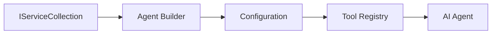

# 🎨 Agentic Design Patterns wit Azure OpenAI (Responses API) (.NET)

## 📋 Wetin You Go Learn

Dis example de show enterprise-grade design patterns wey dem dey use build intelligent agents wit Microsoft Agent Framework for .NET plus Azure OpenAI (Responses API) dem join. You go learn professional patterns and architectural ways wey go make agents ready for production, easy to maintain, and fit grow well.

### Enterprise Design Patterns

- 🏭 **Factory Pattern**: Standard way to create agent wit dependency injection
- 🔧 **Builder Pattern**: Fluent way to configure and set up agent
- 🧵 **Thread-Safe Patterns**: Manage conversation wey dey run at same time well well
- 📋 **Repository Pattern**: Arrange tools and capabilities well

## 🎯 .NET-Specific Architectural Benefits

### Enterprise Features

- **Strong Typing**: Check code during compile-time and get IntelliSense support
- **Dependency Injection**: Built-in DI container join well
- **Configuration Management**: IConfiguration and Options patterns
- **Async/Await**: Asynchronous programming wey get first-class support

### Production-Ready Patterns

- **Logging Integration**: ILogger and structured logging join
- **Health Checks**: Built-in monitoring and diagnostics
- **Configuration Validation**: Strong typing plus data annotations
- **Error Handling**: Arrange exceptions management well

## 🔧 Technical Architecture

### Core .NET Components

- **Microsoft.Extensions.AI**: One AI service abstraction
- **Microsoft.Agents.AI**: Enterprise agent orchestration framework
- **Azure OpenAI (Responses API)**: High-performance API client patterns
- **Configuration System**: appsettings.json and environment join together

### Design Pattern Implementation



## 🏗️ Enterprise Patterns Wey Dem Show

### 1. **Creational Patterns**

- **Agent Factory**: Center agent creation wit consistent configuration
- **Builder Pattern**: Fluent API for complex agent configuration
- **Singleton Pattern**: Share resources and manage configuration well
- **Dependency Injection**: Loose coupling and testability

### 2. **Behavioral Patterns**

- **Strategy Pattern**: Different tool execution styles fit swap
- **Command Pattern**: Wrap agent operations wit undo/redo
- **Observer Pattern**: Event-driven agent lifecycle management
- **Template Method**: Standard way to run agent workflow

### 3. **Structural Patterns**

- **Adapter Pattern**: Azure OpenAI (Responses API) integration layer
- **Decorator Pattern**: Add more power to agent capabilities
- **Facade Pattern**: Simplify how agent interact
- **Proxy Pattern**: Lazy loading and caching make performance better

## 📚 .NET Design Principles

### SOLID Principles

- **Single Responsibility**: Every part get only one main work
- **Open/Closed**: Fit add new things without change old ones
- **Liskov Substitution**: Use interface-based tools
- **Interface Segregation**: Focused and proper interfaces
- **Dependency Inversion**: Depend on abstract, no concrete

### Clean Architecture

- **Domain Layer**: Core agent and tool abstractions
- **Application Layer**: Agent orchestration and workflows
- **Infrastructure Layer**: Azure OpenAI (Responses API) join external services
- **Presentation Layer**: User interaction and how responses dem dey

## 🔒 Enterprise Considerations

### Security

- **Credential Management**: Secure API key handling wit IConfiguration
- **Input Validation**: Strong typing plus data annotation validation
- **Output Sanitization**: Secure how you process and filter responses
- **Audit Logging**: Track all operations well well

### Performance

- **Async Patterns**: Non-blocking I/O operations
- **Connection Pooling**: Manage HTTP clients efficiently
- **Caching**: Cache responses to boost performance
- **Resource Management**: Proper disposal and cleanup ways

### Scalability

- **Thread Safety**: Support multiple agent execution at the same time
- **Resource Pooling**: Use resources well well
- **Load Management**: Control rate and handle pressure well
- **Monitoring**: Performance metrics and health checks

## 🚀 Production Deployment

- **Configuration Management**: Environment-specific settings
- **Logging Strategy**: Structured logging with correlation IDs
- **Error Handling**: Global exception handling wit proper recovery
- **Monitoring**: Application insights and performance counters
- **Testing**: Unit tests, integration tests, and load test patterns

You ready build enterprise-grade intelligent agents wit .NET? Make we build something wey strong! 🏢✨

## 🚀 How To Start

### Wetin You Need First

- [.NET 10 SDK](https://dotnet.microsoft.com/download/dotnet/10.0) or pass am
- One [Azure subscription](https://azure.microsoft.com/free/) wey get Azure OpenAI resource and model deployment
- The [Azure CLI](https://learn.microsoft.com/cli/azure/install-azure-cli) — sign in wit `az login`

### Environment Variables Wey Dem Need

```bash
# zsh/bash
export AZURE_OPENAI_ENDPOINT=https://<your-resource>.openai.azure.com
export AZURE_OPENAI_DEPLOYMENT=gpt-4.1-mini
# Den sign in make AzureCliCredential fit get token
az login
```

```powershell
# PowerShell
$env:AZURE_OPENAI_ENDPOINT = "https://<your-resource>.openai.azure.com"
$env:AZURE_OPENAI_DEPLOYMENT = "gpt-4.1-mini"
# Den sign in so AzureCliCredential fit get token
az login
```

### Sample Code

To run dis code example,

```bash
# zsh/bash
chmod +x ./03-dotnet-agent-framework.cs
./03-dotnet-agent-framework.cs
```

Or if you dey use dotnet CLI:

```bash
dotnet run ./03-dotnet-agent-framework.cs
```

See [`03-dotnet-agent-framework.cs`](../../../../03-agentic-design-patterns/code_samples/03-dotnet-agent-framework.cs) for the full code.

```csharp
#!/usr/bin/dotnet run

#:package Microsoft.Extensions.AI@10.*
#:package Microsoft.Agents.AI.OpenAI@1.*-*
#:package Azure.AI.OpenAI@2.1.0
#:package Azure.Identity@1.13.1

using System.ComponentModel;

using Microsoft.Agents.AI;
using Microsoft.Extensions.AI;

using Azure.AI.OpenAI;
using Azure.Identity;

// Tool Function: Random Destination Generator
// This static method will be available to the agent as a callable tool
// The [Description] attribute helps the AI understand when to use this function
// This demonstrates how to create custom tools for AI agents
[Description("Provides a random vacation destination.")]
static string GetRandomDestination()
{
    // List of popular vacation destinations around the world
    // The agent will randomly select from these options
    var destinations = new List<string>
    {
        "Paris, France",
        "Tokyo, Japan",
        "New York City, USA",
        "Sydney, Australia",
        "Rome, Italy",
        "Barcelona, Spain",
        "Cape Town, South Africa",
        "Rio de Janeiro, Brazil",
        "Bangkok, Thailand",
        "Vancouver, Canada"
    };

    // Generate random index and return selected destination
    // Uses System.Random for simple random selection
    var random = new Random();
    int index = random.Next(destinations.Count);
    return destinations[index];
}

// Azure OpenAI with the Responses API (stable v1 endpoint). Sign in with `az login`.
var azureEndpoint = Environment.GetEnvironmentVariable("AZURE_OPENAI_ENDPOINT")
    ?? throw new InvalidOperationException("AZURE_OPENAI_ENDPOINT is not set.");
var deployment = Environment.GetEnvironmentVariable("AZURE_OPENAI_DEPLOYMENT") ?? "gpt-4.1-mini";

var azureClient = new AzureOpenAIClient(new Uri(azureEndpoint), new AzureCliCredential());

// Define Agent Identity and Comprehensive Instructions
// Agent name for identification and logging purposes
var AGENT_NAME = "TravelAgent";

// Detailed instructions that define the agent's personality, capabilities, and behavior
// This system prompt shapes how the agent responds and interacts with users
var AGENT_INSTRUCTIONS = """
You are a helpful AI Agent that can help plan vacations for customers.

Important: When users specify a destination, always plan for that location. Only suggest random destinations when the user hasn't specified a preference.

When the conversation begins, introduce yourself with this message:
"Hello! I'm your TravelAgent assistant. I can help plan vacations and suggest interesting destinations for you. Here are some things you can ask me:
1. Plan a day trip to a specific location
2. Suggest a random vacation destination
3. Find destinations with specific features (beaches, mountains, historical sites, etc.)
4. Plan an alternative trip if you don't like my first suggestion

What kind of trip would you like me to help you plan today?"

Always prioritize user preferences. If they mention a specific destination like "Bali" or "Paris," focus your planning on that location rather than suggesting alternatives.
""";

// Create AI Agent with Advanced Travel Planning Capabilities
// Get the Responses client for the deployment and create the AI agent
// Configure agent with name, detailed instructions, and available tools
// This demonstrates the .NET agent creation pattern with full configuration
AIAgent agent = azureClient
    .GetChatClient(deployment)
    .AsAIAgent(
        name: AGENT_NAME,
        instructions: AGENT_INSTRUCTIONS,
        tools: [AIFunctionFactory.Create(GetRandomDestination)]
    );

// Create New Conversation Session for Context Management
// Initialize a new conversation session to maintain context across multiple interactions
// Sessions enable the agent to remember previous exchanges and maintain conversational state
// This is essential for multi-turn conversations and contextual understanding
var session = await agent.CreateSessionAsync();

// Execute Agent: First Travel Planning Request
// Run the agent with an initial request that will likely trigger the random destination tool
// The agent will analyze the request, use the GetRandomDestination tool, and create an itinerary
// Using the session parameter maintains conversation context for subsequent interactions
await foreach (var update in agent.RunStreamingAsync("Plan me a day trip", session))
{
    await Task.Delay(10);
    Console.Write(update);
}

Console.WriteLine();

// Execute Agent: Follow-up Request with Context Awareness
// Demonstrate contextual conversation by referencing the previous response
// The agent remembers the previous destination suggestion and will provide an alternative
// This showcases the power of conversation sessions and contextual understanding in .NET agents
await foreach (var update in agent.RunStreamingAsync("I don't like that destination. Plan me another vacation.", session))
{
    await Task.Delay(10);
    Console.Write(update);
}
```

---

<!-- CO-OP TRANSLATOR DISCLAIMER START -->
**Disclaimer**:
Dis document don translate wit AI translation service [Co-op Translator](https://github.com/Azure/co-op-translator). Even tho we dey try make am correct, abeg make you know say automated translation fit get errors or mistakes. Di original document for dia own language na im be di correct source. For important info, make person wey sabi human translation do am. We no go responsible for any misunderstanding or wrong understanding wey fit happen because of dis translation.
<!-- CO-OP TRANSLATOR DISCLAIMER END -->