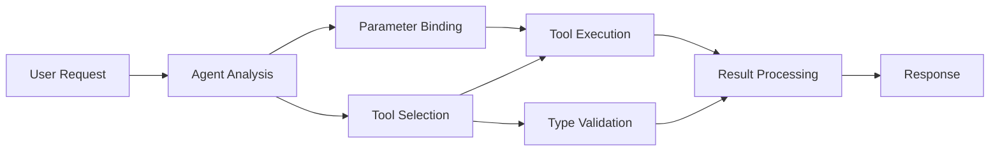

# 🛠️ Advanced Tool Use wit Azure OpenAI (Responses API) (.NET)

## 📋 Wetin You Go Learn

Dis notebook dey show how pipo fit integrate big-big tool dem wey use Microsoft Agent Framework for .NET wit Azure OpenAI (Responses API). You go sabi how to build better agent wey get many correct tools, plus how C# strong typing and .NET big-big features fit help you.

### Advanced Tool Palava Wey You Go Master

- 🔧 **Multi-Tool Setup**: How to build agent wey get many special tools
- 🎯 **Type-Safe Tool Running**: How C# dey check correct type before e run
- 📊 **Enterprise Tool Patterns**: How to design tool wey ready for production plus how to handle error well-well
- 🔗 **Tool Combination**: How to join tool dem for complicated business waka

## 🎯 Benefits of .NET Tool Setup

### Enterprise Tool Features

- **Compile-Time Check**: Strong typing make sure tool parameters correct
- **Dependency Injection**: IoC container dey help manage tool dem
- **Async/Await Patterns**: Tool run no go block system, plus e dey manage resources well
- **Structured Logging**: Logging dey inside to monitor tool run

### Production-Ready Patterns

- **Exception Handling**: Error management wey get typed exceptions
- **Resource Management**: Correct way to dispose and manage memory
- **Performance Monitoring**: Metrics and performance counters inside
- **Configuration Management**: Configuration wey get type-check plus validation

## 🔧 Technical Architecture

### Main .NET Tool Parts

- **Microsoft.Extensions.AI**: One-layer tool abstraction
- **Microsoft.Agents.AI**: Enterprise level tool control
- **Azure OpenAI (Responses API)**: High-performance API client with connection pooling

### How Tool Run Pipeline Be



## 🛠️ Tool Categories & Patterns

### 1. **Data Processing Tools**

- **Input Validation**: Strong typing wit data annotations
- **Transform Operations**: Type-safe data change and formatting
- **Business Logic**: Tools for domain-specific calculation and analysis
- **Output Formatting**: Structured way wey e go generate response

### 2. **Integration Tools** 

- **API Connectors**: RESTful service join wit HttpClient
- **Database Tools**: Entity Framework run join for data access
- **File Operations**: Safe file system work with validation
- **External Services**: Third-party service join pattern dem

### 3. **Utility Tools**

- **Text Processing**: String wahala and formatting utilities
- **Date/Time Operations**: Culture-aware date/time calculation
- **Mathematical Tools**: Precision calculation and statistical work
- **Validation Tools**: Business rule and data validation

Ready to build big-big enterprise-grade agents wit strong, type-safe tools for .NET? Make we architect pro-grade solution dem! 🏢⚡

## 🚀 How To Start

### Wetin You Go Need First

- [.NET 10 SDK](https://dotnet.microsoft.com/download/dotnet/10.0) or pass am
- Azure subscription wey get Azure OpenAI resource and model deployment
- The [Azure CLI](https://learn.microsoft.com/cli/azure/install-azure-cli) — login wit `az login`

### Environment Variables We Need

```bash
# zsh/bash
export AZURE_OPENAI_ENDPOINT=https://<your-resource>.openai.azure.com
export AZURE_OPENAI_DEPLOYMENT=gpt-5-mini
# Den sign in make AzureCliCredential fit get token
az login
```

```powershell
# PowerShell
$env:AZURE_OPENAI_ENDPOINT = "https://<your-resource>.openai.azure.com"
$env:AZURE_OPENAI_DEPLOYMENT = "gpt-5-mini"
# Den sign in make AzureCliCredential fit get token
az login
```

### Sample Code

To run the code example,

```bash
# zsh/bash
chmod +x ./04-dotnet-agent-framework.cs
./04-dotnet-agent-framework.cs
```

Or use dotnet CLI:

```bash
dotnet run ./04-dotnet-agent-framework.cs
```

See [`04-dotnet-agent-framework.cs`](../../../../04-tool-use/code_samples/04-dotnet-agent-framework.cs) for the full code.

```csharp
#!/usr/bin/dotnet run

#:package Microsoft.Extensions.AI@10.*
#:package Microsoft.Agents.AI.OpenAI@1.*-*
#:package Azure.AI.OpenAI@2.1.0
#:package Azure.Identity@1.13.1

using System.ComponentModel;

using Microsoft.Agents.AI;
using Microsoft.Extensions.AI;

using Azure.AI.OpenAI;
using Azure.Identity;

// Tool Function: Random Destination Generator
// This static method will be available to the agent as a callable tool
// The [Description] attribute helps the AI understand when to use this function
// This demonstrates how to create custom tools for AI agents
[Description("Provides a random vacation destination.")]
static string GetRandomDestination()
{
    // List of popular vacation destinations around the world
    // The agent will randomly select from these options
    var destinations = new List<string>
    {
        "Paris, France",
        "Tokyo, Japan",
        "New York City, USA",
        "Sydney, Australia",
        "Rome, Italy",
        "Barcelona, Spain",
        "Cape Town, South Africa",
        "Rio de Janeiro, Brazil",
        "Bangkok, Thailand",
        "Vancouver, Canada"
    };

    // Generate random index and return selected destination
    // Uses System.Random for simple random selection
    var random = new Random();
    int index = random.Next(destinations.Count);
    return destinations[index];
}

// Azure OpenAI with the Responses API (stable v1 endpoint). Sign in with `az login`.
var azureEndpoint = Environment.GetEnvironmentVariable("AZURE_OPENAI_ENDPOINT")
    ?? throw new InvalidOperationException("AZURE_OPENAI_ENDPOINT is not set.");
var deployment = Environment.GetEnvironmentVariable("AZURE_OPENAI_DEPLOYMENT") ?? "gpt-5-mini";

var azureClient = new AzureOpenAIClient(new Uri(azureEndpoint), new AzureCliCredential());

// Define Agent Identity and Comprehensive Instructions
// Agent name for identification and logging purposes
var AGENT_NAME = "TravelAgent";

// Detailed instructions that define the agent's personality, capabilities, and behavior
// This system prompt shapes how the agent responds and interacts with users
var AGENT_INSTRUCTIONS = """
You are a helpful AI Agent that can help plan vacations for customers.

Important: When users specify a destination, always plan for that location. Only suggest random destinations when the user hasn't specified a preference.

When the conversation begins, introduce yourself with this message:
"Hello! I'm your TravelAgent assistant. I can help plan vacations and suggest interesting destinations for you. Here are some things you can ask me:
1. Plan a day trip to a specific location
2. Suggest a random vacation destination
3. Find destinations with specific features (beaches, mountains, historical sites, etc.)
4. Plan an alternative trip if you don't like my first suggestion

What kind of trip would you like me to help you plan today?"

Always prioritize user preferences. If they mention a specific destination like "Bali" or "Paris," focus your planning on that location rather than suggesting alternatives.
""";

// Create AI Agent with Advanced Travel Planning Capabilities
// Get the Responses client for the deployment and create the AI agent
// Configure agent with name, detailed instructions, and available tools
// This demonstrates the .NET agent creation pattern with full configuration
AIAgent agent = azureClient
    .GetChatClient(deployment)
    .AsAIAgent(
        name: AGENT_NAME,
        instructions: AGENT_INSTRUCTIONS,
        tools: [AIFunctionFactory.Create(GetRandomDestination)]
    );

// Create New Conversation Session for Context Management
// Initialize a new conversation session to maintain context across multiple interactions
// Sessions enable the agent to remember previous exchanges and maintain conversational state
// This is essential for multi-turn conversations and contextual understanding
await using var session = await agent.CreateSessionAsync();

// Execute Agent: First Travel Planning Request
// Run the agent with an initial request that will likely trigger the random destination tool
// The agent will analyze the request, use the GetRandomDestination tool, and create an itinerary
// Using the session parameter maintains conversation context for subsequent interactions
await foreach (var update in agent.RunStreamingAsync("Plan me a day trip", session))
{
    await Task.Delay(10);
    Console.Write(update);
}

Console.WriteLine();

// Execute Agent: Follow-up Request with Context Awareness
// Demonstrate contextual conversation by referencing the previous response
// The agent remembers the previous destination suggestion and will provide an alternative
// This showcases the power of conversation sessions and contextual understanding in .NET agents
await foreach (var update in agent.RunStreamingAsync("I don't like that destination. Plan me another vacation.", session))
{
    await Task.Delay(10);
    Console.Write(update);
}
```

---

<!-- CO-OP TRANSLATOR DISCLAIMER START -->
**Disclaimer**:
Dis document don translate wit AI translation service [Co-op Translator](https://github.com/Azure/co-op-translator). Even tho we dey try make am correct, abeg make you know say automated translation fit get errors or mistakes. Di original document for dia own language na im be di correct source. For important info, make person wey sabi human translation do am. We no go responsible for any misunderstanding or wrong understanding wey fit happen because of dis translation.
<!-- CO-OP TRANSLATOR DISCLAIMER END -->