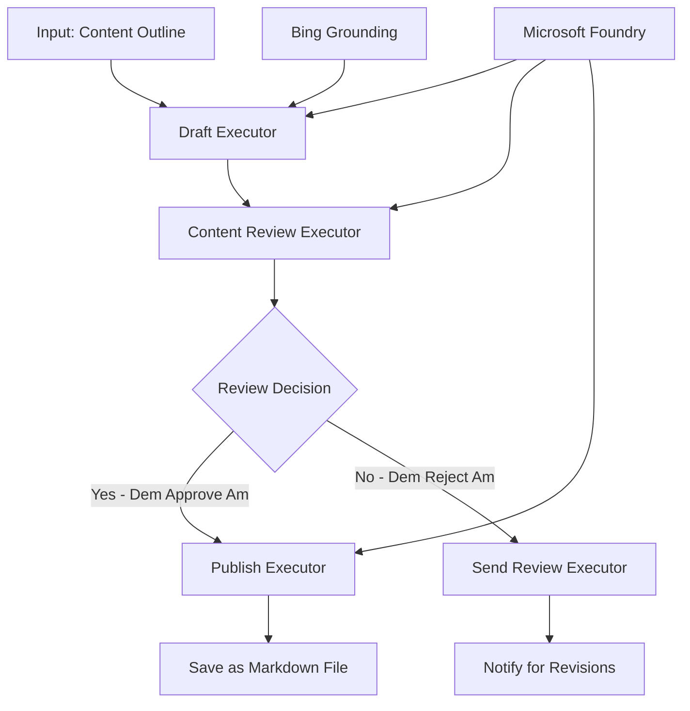

# 🔀 Conditional Agent Workflows wit Microsoft Foundry (.NET)

## 📋 Intelligent Decision-Based Workflow Tutorial

Dis notebook dey show **conditional workflow patterns** wit Microsoft Foundry an di Microsoft Agent Framework for .NET. You go learn how to build correct, decision-driven workflows wey go sabi tek processing based on AI analysis, business rules, an changing conditions for enterprise-grade automation.

## 🎯 Wetin You Go Take Learn

### 🧠 **Intelligent Decision Architecture**
- **Conditional Logic Implementation**: Build complex decision trees wit plenty branch points
- **AI-Powered Routing**: Use Microsoft Foundry models to make smart routing decisions
- **Dynamic Workflow Adaptation**: Change workflow behaviour based on runtime analysis an conditions
- **Enterprise Rule Integration**: Add business logic and compliance requirements inside workflows

### 🔀 **Advanced Conditional Patterns**
- **Multi-Criteria Decision Making**: Check plenti factors for routing decisions
- **Context-Aware Processing**: Make decisions based on the workflow context and history dem don gather
- **Adaptive Workflow Modification**: Change processing paths quickly based on real-time conditions
- **Rule Engine Integration**: Use strong business rule engines inside workflows

### 🏢 **Enterprise Conditional Applications**
- **Document Classification & Routing**: Automatically classify an route documents go correct workflows
- **Customer Service Triage**: Smart routing of customer questions go special handling teams
- **Compliance & Risk Processing**: Use different validation an review processes based on risk level
- **Quality Assurance Workflows**: Route content go correct review based on quality metrics

## ⚙️ Wetin You Need & Setup

### 📦 **Required NuGet Packages**

Advanced packages for conditional workflow processing:

```xml
<!-- Core AI Framework -->
<PackageReference Include="Microsoft.Extensions.AI" Version="9.9.0" />

<!-- Azure AI Agents with Persistent State -->
<PackageReference Include="Azure.AI.Agents.Persistent" Version="1.2.0-beta.5" />

<!-- Azure Identity and Utilities -->
<PackageReference Include="Azure.Identity" Version="1.15.0" />
<PackageReference Include="System.Linq.Async" Version="6.0.3" />
<PackageReference Include="DotNetEnv" Version="3.1.1" />

<!-- Local Workflow Framework References -->
<!-- Microsoft.Agents.Workflows.dll - Advanced workflow orchestration -->
<!-- Microsoft.Agents.AI.AzureAI.dll - Microsoft Foundry integration -->
<!-- Microsoft.Agents.AI.dll - Core agent abstractions -->
```

### 🔑 **Microsoft Foundry Configuration**

**Required Azure Resources:**
- Microsoft Foundry workspace wit conditional processing models
- Azure subscription wit correct compute quotas an permissions
- Deployed AI models for decision making an content analysis
- (Optional) Bing Search API connection for grounding

**Environment Configuration (.env file):**
```env
# Microsoft Foundry Configuration
AZURE_AI_PROJECT_ENDPOINT=https://your-project.cognitiveservices.azure.com/
BING_CONNECTION_ID=your-bing-connection-id
```

**Authentication Setup:**
```csharp
// Azure CLI or Managed Identity authentication
using Azure.Identity;
var credential = new AzureCliCredential();

// Load environment configuration
DotNetEnv.Env.Load("../../../.env");
```

### 🏗️ **Conditional Workflow Architecture**



**Key Components:**
- **Draft Executor**: AI agent wey dey create first content drafts from outlines
- **Content Review Executor**: AI agent wey dey check draft quality an compliance
- **Conditional Routing**: Decision logic wey dey route based on review results
- **Publish/Review Paths**: Different paths for approved an rejected content
- **State Management**: Maintains content an review context during workflow

## 🎨 **Conditional Workflow Design Patterns**

### 📋 **Content Production wit Quality Gates**
```
Outline → Draft Creation → Quality Review → {Approve: Publish | Reject: Revise}
```

### 🎯 **Risk-Based Document Processing**
```
Document → Risk Assessment → {Low: Standard | High: Enhanced Review}
```

### 🔍 **Intelligent Customer Service Routing**
```
Customer Query → Analysis → {Simple: FAQ Bot | Complex: Human Agent}
```

### 💼 **Compliance-Driven Workflows**
```
Content → Compliance Check → {Pass: Publish | Fail: Legal Review}
```

## 🏢 **Enterprise Conditional Benefits**

### 🎯 **Intelligent Automation**
- **Smart Decision Making**: AI powered routing decisions based on content analysis an context
- **Adaptive Processing**: Workflows wey automatically adjust based on conditions
- **Business Rule Enforcement**: Automatic application of complex business logic an policies
- **Context-Aware Routing**: Decisions based on full workflow history an gathered context

### 📈 **Operational Excellence**
- **Optimized Resource Allocation**: Route work to correct specialists an processes
- **Reduced Manual Intervention**: Automated decisions reduce human routing need
- **Faster Resolution Times**: Direct routing to proper expertise an processing powers
- **Consistent Application**: Equal application of business rules an decision criteria

### 🛡️ **Risk Management & Compliance**
- **Automated Risk Assessment**: AI powered evaluation of content an risk levels
- **Compliance Enforcement**: Automatic routing through regulatory processes
- **Security Protocol Application**: Strong security done based on risk assessment
- **Audit Trail Maintenance**: Total documentation of routing decisions an reasons

### 📊 **Analytics & Continuous Improvement**
- **Decision Analytics**: Track how good an correct routing decisions dey
- **Pattern Recognition**: Find trends an patterns for routing decisions over time
- **Performance Optimization**: Constantly improve decision criteria an routing efficiency
- **Business Intelligence**: Insights on content characteristics an processing needs

### 🔧 **Technical Excellence**
- **Persistent State Management**: Keep complex state throughout workflow run
- **Scalable Architecture**: Handle plenty volume conditional processing needs
- **Integration Capabilities**: Smooth integration wit existent business systems an processes
- **Monitoring & Observability**: Full tracking of workflow performance an decisions

Make we build intelligent, decision-driven enterprise workflows wit .NET! 🚀

## 💻 Running the Code

Complete implementation dey available for `04.dotnet-agent-framework-workflow-aifoundry-condition.cs`. Dis one dey show **content production workflow wit quality gates**:

### 🏗️ **Workflow Architecture**

```
Content Outline → Draft Creation → Quality Review → Conditional Routing:
                                                      ├─ Approved (>200 words) → Publish
                                                      └─ Rejected (<200 words) → Review Notification
```

**Agents wey dey the Workflow:**
1. **Evangelist Agent**: Dey create tutorial drafts from outlines wit Bing grounding
2. **Content Reviewer Agent**: Dey check draft quality (word count, completeness)
3. **Publisher Agent**: Dey save approved content as timestamped Markdown files

**Custom Executors:**
1. **DraftExecutor**: Orchestrates draft creation
2. **ContentReviewExecutor**: Dey do quality assessment
3. **PublishExecutor**: Dey handle approved content publication
4. **SendReviewExecutor**: Dey manage rejected content notifications

### 🚀 Running the Example

**Prerequisites:**
- Microsoft Foundry workspace wey dem don configure
- Azure CLI authentication (`az login`)
- (Optional) Bing Search connection for grounding

```bash
# Make di script fit run (Unix/Linux/macOS)
chmod +x 04.dotnet-agent-framework-workflow-aifoundry-condition.cs

# Run di conditional workflow
./04.dotnet-agent-framework-workflow-aifoundry-condition.cs
```

Or for Windows:
```powershell
dotnet run 04.dotnet-agent-framework-workflow-aifoundry-condition.cs
```

### 📝 Wetin You Go Expect

The workflow go:
1. **Create Agents**: Initialize three special Microsoft Foundry agents
2. **Generate Draft**: Evangelist agent create tutorial draft from outline
3. **Review Content**: Content Reviewer go check draft quality
4. **Conditional Routing**:
   - **If approved (>200 words)**: Publish executor go save as Markdown file
   - **If rejected (<200 words)**: Send review notification
5. **Display Results**: Show final workflow outcome

### 🔧 Customization Options

**Change Review Criteria:**
```csharp
const string ContentReviewerInstructions = @"
You are a content reviewer...
1. Check if content is more than 500 words (instead of 200)
2. Verify technical accuracy
3. Ensure proper formatting
...";
```

**Add More Conditional Paths:**
```csharp
var workflow = new WorkflowBuilder(draftExecutor)
    .AddEdge(draftExecutor, contentReviewerExecutor)
    .AddEdge(contentReviewerExecutor, publishExecutor, condition: GetCondition("Excellent"))
    .AddEdge(contentReviewerExecutor, editExecutor, condition: GetCondition("Good"))
    .AddEdge(contentReviewerExecutor, sendReviewerExecutor, condition: GetCondition("Poor"))
    .Build();
```

**Change Content Requirements:**
```csharp
string OUTLINE_Content = @"
# Your Custom Topic
## Section 1
https://your-reference-url
## Section 2
...
";
```

### 🎯 Real-World Applications

Dis conditional workflow pattern good for:
- **Content Management Systems**: Automated editorial workflows wit quality gates
- **Document Processing**: Route documents based on classification and compliance
- **Customer Support**: Smart ticket routing based on complexity an urgency
- **Legal Review**: Route contracts based on risk an value
- **HR Processes**: Route applications through correct screening workflows

### 🔍 Understanding Conditional Logic

**Condition Function:**
```csharp
public Func<object?, bool> GetCondition(string expectedResult) =>
    reviewResult => reviewResult is ReviewResult review && review.Result == expectedResult;
```

Dis function dey create predicate wey:
1. Check if di result type na `ReviewResult`
2. Compare `Result` property to di expected value
3. Return true/false to choose routing

**Workflow Edges wit Conditions:**
```csharp
.AddEdge(contentReviewerExecutor, publishExecutor, condition: GetCondition("Yes"))
.AddEdge(contentReviewerExecutor, sendReviewerExecutor, condition: GetCondition("No"))
```

### 📊 Advanced Features

**JSON Schema Validation:**
Di workflow go use JSON schemas to ensure responses dey structured:

```csharp
// Define response structure
public class ReviewResult
{
    [JsonPropertyName("review_result")]
    public string Result { get; set; } = string.Empty;
    
    [JsonPropertyName("reason")]
    public string Reason { get; set; } = string.Empty;
    
    [JsonPropertyName("draft_content")]
    public string DraftContent { get; set; } = string.Empty;
}

// Apply to agent
ResponseFormat = ChatResponseFormat.ForJsonSchema(
    AIJsonUtilities.CreateJsonSchema(typeof(ReviewResult)), 
    "ReviewResult", 
    "Review Result From DraftContent"
)
```

**Bing Grounding Integration:**
Evangelist agent dey use Bing grounding to get real-time info:

```csharp
var bingGroundingConfig = new BingGroundingSearchConfiguration(bing_conn_id);
BingGroundingToolDefinition bingGroundingTool = new(
    new BingGroundingSearchToolParameters([bingGroundingConfig])
);
```

Dis one make agent fit follow URLs for outline an gather current info.

### 🛡️ Error Handling

The workflow get strong error handling for rejected content:
- Review failures go trigger alternative path
- Notifications go give clear rejection reasons
- Content dey preserved for revise

### 🔄 Extending the Workflow

**Add Revision Loop:**
Create feedback loop wey go re-draft content automatically:

```csharp
.AddEdge(contentReviewerExecutor, publishExecutor, condition: GetCondition("Yes"))
.AddEdge(contentReviewerExecutor, draftExecutor, condition: GetCondition("No")) // Loop back
```

**Implement Multi-Level Review:**
Add plenty review stages wit different criteria:

```csharp
.AddEdge(draftExecutor, technicalReviewer)
.AddEdge(technicalReviewer, editorialReviewer, condition: GetCondition("TechPass"))
.AddEdge(editorialReviewer, publishExecutor, condition: GetCondition("EditPass"))
```

Dis conditional workflow pattern na di foundation for building complex, intelligent enterprise automation systems! 🚀

---

<!-- CO-OP TRANSLATOR DISCLAIMER START -->
**Disclaimer**:
Dis document don translate wit AI translation service [Co-op Translator](https://github.com/Azure/co-op-translator). Even tho we dey try make am correct, abeg make you know say automated translation fit get errors or mistakes. Di original document for dia own language na im be di correct source. For important info, make person wey sabi human translation do am. We no go responsible for any misunderstanding or wrong understanding wey fit happen because of dis translation.
<!-- CO-OP TRANSLATOR DISCLAIMER END -->