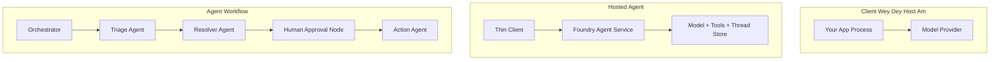
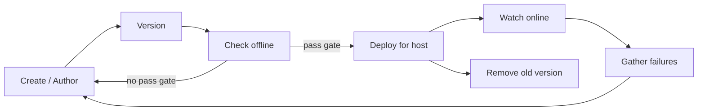
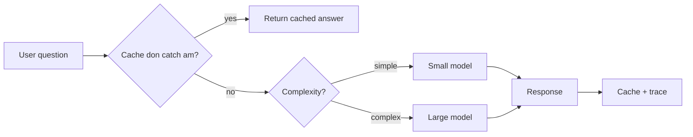
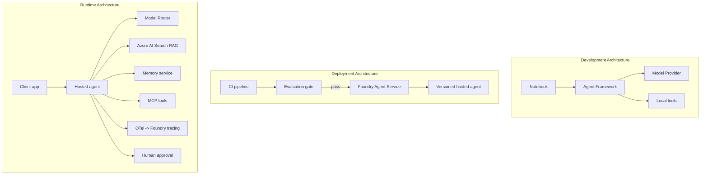

# Deploying Scalable Agents wit Microsoft Foundry


Up to dis point for di course, you don build agents wey dey run for your laptop, inside notebook, driven by `az login` and small environment variables. Na di correct way to learn be dat. But e no be di correct way to run agent wey thousands customers dey rely on for 3 a.m.

Dis lesson na about di gap between "e dey work for my machine" and "e dey work, steady and cheap, for production." We go close dat gap using **Microsoft Foundry** and di **Microsoft Foundry Agent Service**, and we go do am by building real customer support agent wey get tools, retrieval, memory, evaluation, and monitoring.

## Introduction

Dis lesson go cover:

- Di difference between **prototype agent** and **deployed agent**, and why di transition na mostly about everything *around* di model.
- **Deployment patterns** for agents: client-hosted, service-hosted (Hosted Agents), and workflow-orchestrated.
- Di **agent lifecycle** for Microsoft Foundry — create, version, deploy, evaluate, observe, retire.
- **Scaling strategies**: model routing, caching, concurrency, and stateless design.
- **Observability** wit OpenTelemetry and Foundry tracing.
- **Cost optimisation** through model selection, routing, and evaluation gates.
- **Enterprise considerations**: governance, human approval, and running MCP servers safely for production.

## Learning Goals

After you don finish dis lesson, you go sabi how to:

- Choose correct deployment pattern for any agent workload.
- Deploy agent to Microsoft Foundry Agent Service so e go be versioned, governed, and observable.
- Instrument agent for tracing and connect evaluation pipeline wey dey run before every release.
- Use model routing and caching to keep latency and cost for control at scale.
- Add human approval gate for high-risk actions and integrate MCP server for production-safe way.

## Prerequisites

Dis lesson assume say you don finish earlier lessons and you dey comfortable wit:

- Building agents wit [Microsoft Agent Framework](../14-microsoft-agent-framework/README.md) (Lesson 14).
- [Tool Use](../04-tool-use/README.md) (Lesson 4) and [Agentic RAG](../05-agentic-rag/README.md) (Lesson 5).
- [Agent Memory](../13-agent-memory/README.md) (Lesson 13) and [Agentic Protocols / MCP](../11-agentic-protocols/README.md) (Lesson 11).
- [Observability and Evaluation](../10-ai-agents-production/README.md) (Lesson 10) — dis lesson build straight on top.

You go also need:

- An **Azure subscription** and **Microsoft Foundry project** wey get at least one deployed chat model.
- Di **Azure CLI** authenticated (`az login`).
- Python 3.12+ and di packages for di repository [`requirements.txt`](../../../requirements.txt).

## From Prototype to Production: Wetin Actually Changes

Prototype agent and production agent share di same core loop — reason, call tools, respond. Wetin dey change na everything wey wrap dat loop. Di model fit be 20% of production agent; di rest 80% na di operational skeleton.

| Concern | Prototype | Production |
| --- | --- | --- |
| **Hosting** | Dey run for your notebook | Dey run as hosted service, versioned and rolled out |
| **Identity** | Your `az login` token | Managed identity wit scoped RBAC |
| **State** | In-memory, lost on restart | Externalised (thread store, memory service) |
| **Failure** | You dey see di traceback | Retries, fallbacks, dead-letter, alerts |
| **Cost** | "Na small cents" | Tracked per request, routed, cached, budgeted |
| **Quality** | You dey eyeball output | Evaluated automatically before every release |
| **Trust** | You dey approve every action | Policy + human-in-the-loop for risky actions |

Make you remember dis table. Every section below dey for one of these rows.

## Agent Deployment Patterns

Three patterns dey wey you go dey use, many times together.

### 1. Client-Hosted Agents

Di agent object dey inside *your* application process. Your code go call di model provider directly; di reasoning loop dey run inside your service. Na wetin every previous lesson don do.

- **Use am when** you need full control over di loop, custom middleware, or you dey embed di agent inside existing backend.
- **Trade-off**: you dey own scaling, state, and resilience yourself.

### 2. Hosted Agents (Foundry Agent Service)

Di agent dey *registered as resource* for Microsoft Foundry. Foundry na host for di reasoning loop, saves threads, dey enforce content safety and RBAC, and make agent visible for Foundry portal. Your app be thin client wey go create threads and read responses.

- **Use am when** you want durability, built-in observability, governance, and smaller operational surface area.
- **Trade-off**: less low-level control but get managed runtime.

### 3. Agent Workflows

Many agents (and tools) dey join inside graph with explicit control flow — sequential steps, branching, human approval nodes, and durable checkpoints wey fit pause and resume. Na di Microsoft Agent Framework **Workflows** capability applied for deployment scale.

- **Use am when** single task cover many specialised agents or need approval step for middle.
- **Trade-off**: many moving parts; need orchestration-level observability.



## The Agent Lifecycle on Microsoft Foundry

Deploying agent no be one-time `push`. Na loop, and e look like software release cycle because na wetin e be.



Di main idea wey we carry from [Lesson 10](../10-ai-agents-production/README.md): **offline evaluation na gate, no be afterthought.** New agent version no go release unless e pass your evaluation thresholds. Online observability go feed real-world failures back into your offline test set. Na di whole loop be dat.

## Scaling Strategies

Scaling agent different from scaling stateless web API, because every request fit trigger multiple expensive model and tool calls. Four techniques dey carry most load.

**Stateless request handling.** No keep per-user state for your process memory. Save conversation threads for Foundry thread store or memory service so any instance fit handle any request. Na dis dey allow you scale horizontally — add instances, no sticky sessions.

**Model routing.** No every request need your most capable (and most expensive) model. Route simple requests — intent classification, short factual answers — go small, fast model, keep large model for true reasoning. Foundry's **Model Router** fit do dis for you, or you fit build lightweight classifier yourself. You go build DIY version inside lab.

**Response caching.** Many support queries na near duplicates ("how I fit reset my password?"). Cache answers for common questions and serve dem without hitting model at all. Even small cache hit rate fit cut cost and latency well.

**Concurrency and backpressure.** Model providers get rate limits. Control your concurrency, use retries with exponential backoff, and fail gracefully (queued "we dey on am" response better pass 500).



## Observability in Production

If you no fit see am, you no fit operate am. As Lesson 10 explain, Microsoft Agent Framework dey emit **OpenTelemetry** traces naturally — every model call, tool invocation, orchestration step na span. For production, you export those spans go Microsoft Foundry (or any OTel-compatible backend) so you fit:

- Trace single customer complaint end-to-end across every model and tool call.
- Watch p50/p95 latency and cost per request as time dey go.
- Alert for error-rate spikes and cost anomalies before your users (or finance team) notice.

```python
from agent_framework.observability import get_tracer

tracer = get_tracer()

with tracer.start_as_current_span("support_request") as span:
    span.set_attribute("customer.tier", "enterprise")
    span.set_attribute("routed.model", "gpt-4.1-mini")
    # agent execution dey trace automatically inside dis span
```

Attributes like `customer.tier` and `routed.model` na wetin dey turn pile of traces into answerable question ("dem dey route too many enterprise customers go small model?").

## Cost Optimisation

Cost for production agents na tokens mostly. Three levers, by impact order:

1. **Right-size the model.** Small model wey pass your evaluation gate almost always cheaper than big one wey also pass. Use evaluation to *show* say small model dey good enough no be just default to biggest model because you dey careful.
2. **Route by complexity.** Like above — pay big-model price only for requests wey need big-model reasoning.
3. **Cache aggressively.** Cheapest model call na di one wey you no make at all.

Evaluation gates and cost control na same discipline from different sides: evaluation tell you *quality floor*, routing and caching keep your cost near dat floor.

## Enterprise Deployment Considerations

**Governance.** Hosted Agents dey inherit Foundry RBAC, content safety, and audit logging. Give every agent managed identity wit least privilege e need — read-only access to knowledge base, scoped access to ticketing API, nothing pass dat.

**Human-in-the-loop.** Some actions too serious to automate fully — like refund, account delete, escalate legal issues. Microsoft Agent Framework get **approval-required** tools: agent propose action, execution pause, human approve or reject, workflow continue. You don see dis primitive for [Lesson 6](../06-building-trustworthy-agents/README.md); now you go deploy am.

**MCP in production.** [MCP](../11-agentic-protocols/README.md) allow your agent use external tools through standard interface. For production, treat every MCP server as untrusted boundary: pin server version, run am with scoped identity, validate output, no ever expose secrets. MCP server na dependency, and dependencies get patched, audited, rate-limited.



Those three diagrams — development, deployment, runtime — na same agent for three life stages. Di lab wey go follow go guide you how to build am.

## Hands-On Lab: Production-Ready Customer Support Agent

Open [`code_samples/16-python-agent-framework.ipynb`](./code_samples/16-python-agent-framework.ipynb) and waka am well well. You go build **Contoso customer support agent** wit every production concern connect:

1. **Tool calling** — check order status and open support tickets.
2. **RAG** — answer policy questions from knowledge base (Azure AI Search, wit in-memory fallback so notebook fit run without Search resource).
3. **Memory** — remember customer across conversation turns.
4. **Model routing** — complexity classifier route each request to small or large model.
5. **Response caching** — repeated questions dey serve from cache.
6. **Human approval** — refunds pass threshold go pause for human sign-off.
7. **Evaluation pipeline** — small offline test set score agent and act as release gate.
8. **Observability** — OpenTelemetry tracing around every request.

### Walkthrough

Notebook organize am so that every production concern na self-contained, runnable section. Di heart na routing-plus-caching request handler:

```python
async def handle_support_request(query: str, customer_id: str) -> str:
    # 1. Serve from cache wen we fit.
    cached = response_cache.get(normalize(query))
    if cached:
        return cached

    # 2. Route by complexity to control di cost.
    model = "gpt-4.1-mini" if is_simple(query) else "gpt-4.1"

    # 3. Run di agent inside one trace span make e dey observant.
    with tracer.start_as_current_span("support_request") as span:
        span.set_attribute("routed.model", model)
        span.set_attribute("customer.id", customer_id)
        response = await support_agent.run(query, model=model)

    # 4. Cache am and return.
    response_cache.set(normalize(query), response.text)
    return response.text
```

Di evaluation gate wey guard release look like dis:

```python
async def evaluation_gate(agent, test_cases, threshold: float = 0.8) -> bool:
    passed = 0
    for case in test_cases:
        result = await agent.run(case["input"])
        if score_response(result.text, case["expected"]) >= 0.8:
            passed += 1
    pass_rate = passed / len(test_cases)
    print(f"Evaluation pass rate: {pass_rate:.0%} (gate: {threshold:.0%})")
    return pass_rate >= threshold  # make you deploy only if di gate pass
```

Read every line — notebook keep di primitives small so nothing hide behind framework call.

## Validating Deployed Agent wit Smoke Tests

Di evaluation gate wey I talk about before dey run *offline* against your agent object. Once agent deploy as Hosted Agent, you need one more, cheap check: **di deployed endpoint really dey answer?**

Deploying "successfully" na only proof say control plane accept di definition — e no mean agent dey respond. Missing dependency, bad model routing, or expired connection fit make green deployment wey no return anything. **Smoke test** go catch dis quick quick, on every deploy, without full evaluation cost.

Dis repository get ready-to-use smoke-test pipeline built on top of [AI Smoke Test](https://github.com/marketplace/actions/ai-smoke-test) GitHub Action:

- **Catalog** — [`tests/lesson-16-smoke-tests.json`](../../../tests/lesson-16-smoke-tests.json) get prompts and assertions for Contoso support agent (grounded policy answers, order lookup, stay on topic, multi-turn thread continuity). Catalogs for other lessons' agents dey beside am — see [`tests/README.md`](../tests/README.md).
- **Workflow** — [`.github/workflows/smoke-test.yml`](../../../.github/workflows/smoke-test.yml) dey login with Azure OIDC and POST each prompt go agent's Responses endpoint, fail job on any assertion miss.

```yaml
- name: Smoke-test hosted agent
  uses: JFolberth/ai-smoketest@v1
  with:
    project_endpoint: ${{ inputs.project_endpoint }}
    agent_name: ContosoSupportAgent
    tests_file: tests/lesson-16-smoke-tests.json
```


Run am from the **Actions** tab once your agent don dey deployed, supply your Foundry project endpoint and agent name. The federated identity need the **Azure AI User** role for Foundry project scope. Think of the layers like pyramid: smoke tests (fit reach and dey respond?) dey run for every deploy, offline evaluation (good enough to ship?) dey run before promotion, and online evaluation (how e dey perform for market?) dey run steady steady.

## Knowledge Check

Test your understanding before you waka go the assignment.

**1. Roughly how much of a production agent na "the model," and wetin be the rest?**

<details>
<summary>Answer</summary>

The model na the small part of the system — people dey talk say e be like 20%. The rest na the operational skeleton: hosting and versioning, identity and RBAC, externalised state, failure handling, cost tracking, evaluation, and human-in-the-loop controls. To move going production na mostly to build all the thing dem *around* the reasoning loop.
</details>

**2. When you go choose Hosted Agent over client-hosted agent?**

<details>
<summary>Answer</summary>

When you want managed runtime wey get built-in durability (threads wey fit continue later), observability, content safety, and RBAC, and you ready to lose some low-level control of the reasoning loop for less operational wahala. Client-hosted good when you need full control of the loop or you dey put the agent for inside backend wey already dey.
</details>

**3. Why make scalable agent dey stateless for im own process memory?**

<details>
<summary>Answer</summary>

So make any instance fit handle any request, dis na wetin allow horizontal scaling without sticky sessions. Per-user conversation state dey externalised to thread store or memory service. If state dey process memory, e go loss on restart and you no fit distribute load freely.
</details>

**4. Wetin model routing dey solve, and how e relate to evaluation?**

<details>
<summary>Answer</summary>

Routing dey send simple requests go small, cheap, fast model and reserve the big model for real reason work, dem dey control latency and cost. E relate to evaluation because evaluation na wetin *prove* say small model good enough for certain kind request — routing without evaluation na guess work.
</details>

**5. Wetin be "evaluation gate" and where e dey for lifecycle?**

<details>
<summary>Answer</summary>

Evaluation gate dey run offline test set on new agent version and e no go allow deployment if pass rate no reach threshold. E dey between "version" and "deploy" for lifecycle, e make quality na condition to release no be something you check after you don ship.
</details>

**6. Why MCP server suppose be untrusted boundary for production?**

<details>
<summary>Answer</summary>

Because na external dependency your agent dey call into. You suppose pin im version, run am with scoped identity, validate im outputs, rate-limit am, and no ever expose secrets to am — na the same discipline wey you use for any third-party dependency. Im outputs dey go your agent reasoning so unvalidated trust get security risk.
</details>

**7. Which one change get biggest impact for production agent cost, and why?**

<details>
<summary>Answer</summary>

Right-sizing the model — use the smallest model wey still dey pass your evaluation gate. Cost na tokens e dey dominated by, and small model wey reach the quality bar dey nearly always cheaper pass big one. Caching and routing go reduce cost more, but to choose the right base model get the biggest first-order effect.
</details>

**8. Wetin span attributes like `customer.tier` and `routed.model` dey do for observability?**

<details>
<summary>Answer</summary>

Dem dey turn raw traces to answerable business questions. Without attributes, na wall of spans; with dem, you fit ask "are enterprise customers dey routed to small model too often?" or "which model dey handle our slowest requests?" Attributes na how you slice telemetry by dimensions wey matter for your operation.
</details>

## Assignment

Carry the customer support agent from the lab make you strong am for one scenario: **subscription billing support agent for SaaS company.**

Your submission shud:

1. **Replace the tools** with billing ones: `get_subscription_status`, `get_invoice`, and `issue_credit` (credits above $50 need human approval).
2. **Add three RAG documents** wey cover the company's refund policy, billing cycle, and cancellation policy.
3. **Extend the evaluation set** to at least eight cases, including at least two wey *suppose* trigger human-approval path, confirm your evaluation gate pass or fail correctly.
4. **Add one cost report**: after you run ten mixed queries through the agent, print how many go small model, how many go the big model, and how many come from cache.

Write small paragraph (for markdown cell) wey explain the model-routing rule you choose and how you go validate am with real traffic. No be only one correct answer — dem dey check if the production concerns dey connected well together.

## Summary

For this lesson you move your agent from prototype go production with Microsoft Foundry:

- The jump to production na mostly the **operational skeleton** around the model — hosting, identity, state, failure handling, cost, quality, and trust.
- You learn the three **deployment patterns** — client-hosted, Hosted Agents, and Agent Workflows — and when each one fit.
- You waka through the **agent lifecycle**, where offline **evaluation act as release gate** and online observability dey feed failure back into the test set.
- You use **scaling strategies** — stateless design, model routing, caching, and bounded concurrency — and connect dem to **cost optimisation**.
- You wire **enterprise controls**: RBAC, human-in-the-loop approval, and production-safe MCP integration.
- You build **production-ready customer support agent** wey hold all these concerns together for runnable code.

The next lesson go do the opposite journey: instead of scaling agents go cloud, you go bring dem *down* onto one developer machine and run dem fully locally.

## Additional Resources

- <a href="https://learn.microsoft.com/azure/ai-foundry/what-is-azure-ai-foundry" target="_blank">Microsoft Foundry documentation</a>
- <a href="https://learn.microsoft.com/azure/ai-foundry/agents/overview" target="_blank">Microsoft Foundry Agent Service overview</a>
- <a href="https://aka.ms/ai-agents-beginners/agent-framework" target="_blank">Microsoft Agent Framework</a>
- <a href="https://learn.microsoft.com/azure/ai-foundry/concepts/model-router" target="_blank">Model Router for Microsoft Foundry</a>
- <a href="https://learn.microsoft.com/azure/search/search-what-is-azure-search" target="_blank">Azure AI Search</a>
- <a href="https://opentelemetry.io/" target="_blank">OpenTelemetry</a>
- <a href="https://github.com/marketplace/actions/ai-smoke-test" target="_blank">AI Smoke Test GitHub Action</a>
- <a href="https://modelcontextprotocol.io/" target="_blank">Model Context Protocol (MCP)</a>

## Previous Lesson

[Building Computer Use Agents (CUA)](../15-browser-use/README.md)

## Next Lesson

[Creating Local AI Agents](../17-creating-local-ai-agents/README.md)

---

<!-- CO-OP TRANSLATOR DISCLAIMER START -->
**Disclaimer**:
Dis document don translate wit AI translation service [Co-op Translator](https://github.com/Azure/co-op-translator). Even tho we dey try make am correct, abeg make you know say automated translation fit get errors or mistakes. Di original document for dia own language na im be di correct source. For important info, make person wey sabi human translation do am. We no go responsible for any misunderstanding or wrong understanding wey fit happen because of dis translation.
<!-- CO-OP TRANSLATOR DISCLAIMER END -->