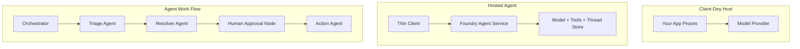
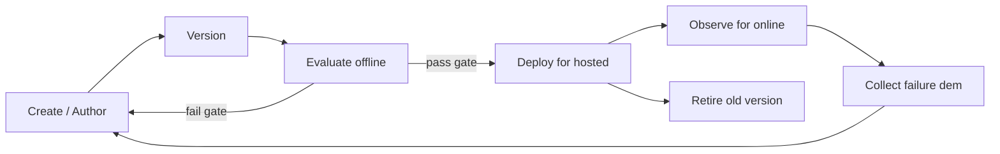
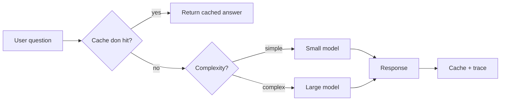
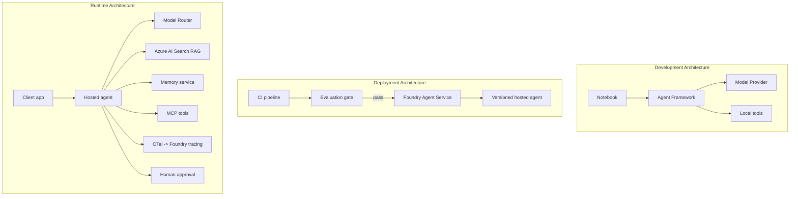

# Deploying Scalable Agents wit Microsoft Foundry


Up to dis point for di course you don build agents wey dey run for your laptop, inside notebook, wey `az login` and some environment variables dey control. Na di correct way to learn be dis. But e no be correct way to run agent wey thousand customers dey depend on for 3 a.m.

Dis lesson na about di gap wey dey "e dey work for my machine" and "e dey work, steady and cheap, for production." We go close dat gap wit **Microsoft Foundry** and **Microsoft Foundry Agent Service**, and we go build real customer support agent wey get tools, retrieval, memory, evaluation, and monitoring.

## Introduction

Dis lesson go cover:

- Di difference between **prototype agent** and **deployed agent**, and why di change concern mostly everything *around* di model.
- **Deployment patterns** for agents: client-hosted, service-hosted (Hosted Agents), and workflow-orchestrated.
- Di **agent lifecycle** for Microsoft Foundry — create, version, deploy, evaluate, observe, retire.
- **Scaling strategies**: model routing, caching, concurrency, and stateless design.
- **Observability** wit OpenTelemetry and Foundry tracing.
- **Cost optimisation** through model selection, routing, and evaluation gates.
- **Enterprise considerations**: governance, human approval, and running MCP servers safely for production.

## Learning Goals

After you finish dis lesson, you go sabi how to:

- Choose di correct deployment pattern for any agent workload.
- Deploy agent go Microsoft Foundry Agent Service so e go get version, governance, and observability.
- Instrument agent for tracing and wire up evaluation pipeline wey go run before every release.
- Apply model routing and caching to keep latency and cost under control when e plenty.
- Add human approval gate for high-risk actions and join MCP server for way wey safe for production.

## Prerequisites

Dis lesson assume say you don finish di other lessons and dem correct for:

- Building agents wit di [Microsoft Agent Framework](../14-microsoft-agent-framework/README.md) (Lesson 14).
- [Tool Use](../04-tool-use/README.md) (Lesson 4) and [Agentic RAG](../05-agentic-rag/README.md) (Lesson 5).
- [Agent Memory](../13-agent-memory/README.md) (Lesson 13) and [Agentic Protocols / MCP](../11-agentic-protocols/README.md) (Lesson 11).
- [Observability and Evaluation](../10-ai-agents-production/README.md) (Lesson 10) — dis lesson build straight on top am.

You go also need:

- **Azure subscription** and **Microsoft Foundry project** wey get at least one deployed chat model.
- **Azure CLI** wey don authenticate (`az login`).
- Python 3.12+ and di packages for di repository [`requirements.txt`](../../../requirements.txt).

## From Prototype to Production: Wetin Actually Changes

Prototype agent and production agent get di same core loop — think, call tools, respond. Wetin change na everything wey wrap dat loop. Model fit be like 20% of production agent; di other 80% na di operational skeleton.

| Concern | Prototype | Production |
| --- | --- | --- |
| **Hosting** | Runs inside your notebook | Runs as hosted service, versioned and rolled out |
| **Identity** | Your `az login` token | Managed identity wit scoped RBAC |
| **State** | For-memory, lost if restart | Externalised (thread store, memory service) |
| **Failure** | You dey see traceback | Retries, fallbacks, dead-letter, alerts |
| **Cost** | "Na small cents" | Tracked per request, routed, cached, budgeted |
| **Quality** | You dey eyeball output | Evaluated automatically before every release |
| **Trust** | You dey approve every action | Policy + human-in-the-loop for risky actions |

Keep dis table for mind. Every section below na one of dis rows.

## Agent Deployment Patterns

You go use three patterns, most times combined.

### 1. Client-Hosted Agents

Agent object dey inside *your* application process. Your code dey call model provider directly; reasoning loop dey your service. Na wetin every previous lesson do before.

- **Use am when** you need full control of di loop, custom middleware, or if you dey embed agent for existing backend.
- **Trade-off**: you dey handle scaling, state, and resilience yourself.

### 2. Hosted Agents (Foundry Agent Service)

Agent go *registered as resource* inside Microsoft Foundry. Foundry dey run reasoning loop, store threads, enforce content safety and RBAC, and show agent for Foundry portal. Your app become thin client wey dey create threads and read responses.

- **Use am when** you want durability, built-in observability, governance, and less operational surface area.
- **Trade-off**: less low-level control but you get managed runtime.

### 3. Agent Workflows

Multiple agents (and tools) join become graph with explicit control flow — sequential steps, branching, human approval nodes, and durable checkpoints wey fit pause and resume. Dis na Microsoft Agent Framework **Workflows** features wey dem apply for deployment scale.

- **Use am when** one task need many specialised agents or approval step for di middle.
- **Trade-off**: more moving parts; need orchestration-level observability.



## The Agent Lifecycle for Microsoft Foundry

Deploy agent no be one-time `push`. E be loop, and e resemble software release cycle cause na wetin e be.



Key idea, carry over from [Lesson 10](../10-ai-agents-production/README.md): **offline evaluation na gate, no be afterthought.** New agent version no go ship unless e clear your evaluation thresholds. Online observability dey feed real-world failures back into offline test set. Na di whole loop be dat.

## Scaling Strategies

Scaling agent different from scaling stateless web API, because each request fit trigger multiple expensive model and tool calls. Four methods dey carry most load.

**Stateless request handling.** No keep per-user state for your process memory. Keep conversation threads for Foundry thread store or memory service so any instance fit handle any request. Na dis one dey allow horizontal scaling — add instances, no sticky sessions.

**Model routing.** No every request need your most capable (and most expensive) model. Route simple request — intent classification, short factual answer — go small, fast model, reserve big model for serious reasoning. Foundry's **Model Router** fit help you do dis, or you fit build your own light classifier. You go build your own version for the lab.

**Response caching.** Many support questions na near-duplicates ("how I fit reset my password?"). Cache answers to common questions and serve dem without hitting model at all. Even modest cache hit rate fit reduce cost and latency seriously.

**Concurrency and backpressure.** Model providers get rate limits. Hold your concurrency, use retries with exponential backoff, and fail gracefully (queued "we dey on top am" response better than 500 error).



## Observability for Production

You no fit operate wetin you no fit see. As Lesson 10 cover, Microsoft Agent Framework dey emit **OpenTelemetry** traces naturally — every model call, tool invoke, and orchestration step become span. For production you export those spans to Microsoft Foundry (or any OTel-compatible backend) so you fit:

- Trace one customer complaint end-to-end across every model and tool call.
- Watch p50/p95 latency and request cost over time.
- Alert on error-rate spike and cost wey no normal before your users (or finance team) notice.

```python
from agent_framework.observability import get_tracer

tracer = get_tracer()

with tracer.start_as_current_span("support_request") as span:
    span.set_attribute("customer.tier", "enterprise")
    span.set_attribute("routed.model", "gpt-5-nano")
    # agent execution dey traced automatically inside dis span
```

Attributes like `customer.tier` and `routed.model` na wetin turn wall of traces to answerable questions ("Enterprise customers dey routed to small model too often?").

## Cost Optimisation

Cost for production agents na tokens be main thing. Three levers, by impact order:

1. **Right-size di model.** Small model wey pass your evaluation gate dey almost always cheaper than big model wey also pass. Use evaluation to *prove* small model good enough instead of just to default to biggest model just to dey safe.
2. **Route by complexity.** Like I talk before — pay big-model prices only for requests wey need big-model reasoning.
3. **Cache aggressively.** Cheapest model call na one wey you no ever make.

Evaluation gates and cost control na same discipline from two sides: evaluation talk you di *quality floor*, routing and caching keep cost near dat floor as possible.

## Enterprise Deployment Considerations

**Governance.** Hosted Agents inherit Foundry's RBAC, content safety, and audit logging. Give each agent managed identity wey get least privilege e need — read-only access to knowledge base, scoped access to ticketing API, no extra.

**Human-in-the-loop.** Some action dey too serious to automate — like refund, delete account, escalate to legal team. Microsoft Agent Framework support **approval-required** tools: agent propose action, execution pause, human fit approve or reject, then workflow continue. You don see dis primitive for [Lesson 6](../06-building-trustworthy-agents/README.md); now you dey deploy am.

**MCP for production.** [MCP](../11-agentic-protocols/README.md) allow your agent to use external tools via standard interface. For production, treat every MCP server as untrusted boundary: pin server version, run am wit scoped identity, validate outputs, neva expose secrets. MCP server na dependency, dependencies get patched, audited, and rate-limited.



Those three diagrams — development, deployment, runtime — na same agent for three life stages. Di lab wey follow go walk you through to build am.

## Hands-On Lab: Production-Ready Customer Support Agent

Open [`code_samples/16-python-agent-framework.ipynb`](./code_samples/16-python-agent-framework.ipynb) and run am fully. You go build **Contoso customer support agent** wit every production concern wired in:

1. **Tool calling** — check order status and open support tickets.
2. **RAG** — answer policy questions from knowledge base (Azure AI Search, including in-memory fallback so notebook fit run without Search resource).
3. **Memory** — remember customer across turns of di conversation.
4. **Model routing** — complexity classifier route each request to small or large model.
5. **Response caching** — repeated questions dey serve from cache.
6. **Human approval** — refunds above threshold dey pause for human sign-off.
7. **Evaluation pipeline** — small offline test set dey score di agent and act as release gate.
8. **Observability** — OpenTelemetry tracing for every request.

### Walkthrough

Notebook organized so each production concern na self-contained, runnable section. Di core na routing-plus-caching request handler:

```python
async def handle_support_request(query: str, customer_id: str) -> str:
    # 1. Serve from cache wen we fit.
    cached = response_cache.get(normalize(query))
    if cached:
        return cached

    # 2. Route by complexity to control cost.
    model = "gpt-5-nano" if is_simple(query) else "gpt-5-mini"

    # 3. Run di agent inside trace span for observability.
    with tracer.start_as_current_span("support_request") as span:
        span.set_attribute("routed.model", model)
        span.set_attribute("customer.id", customer_id)
        response = await support_agent.run(query, model=model)

    # 4. Cache and return.
    response_cache.set(normalize(query), response.text)
    return response.text
```

Di evaluation gate wey guard di release look like dis:

```python
async def evaluation_gate(agent, test_cases, threshold: float = 0.8) -> bool:
    passed = 0
    for case in test_cases:
        result = await agent.run(case["input"])
        if score_response(result.text, case["expected"]) >= 0.8:
            passed += 1
    pass_rate = passed / len(test_cases)
    print(f"Evaluation pass rate: {pass_rate:.0%} (gate: {threshold:.0%})")
    return pass_rate >= threshold  # na only if di gate pass u go deploy am
```

Read every line — di notebook keep primitives deliberately small so nothing dey hide behind framework call.

## Validating Deployed Agent wit Smoke Tests

Di evaluation gate wey I talk about before dey run *offline* against your agent object. Once agent don deployed as Hosted Agent, you need one more, even cheaper check: **di deployed endpoint really dey answer?**

Deploy "successfully" just prove say di control plane accept di definition — e no prove say agent dey respond. Missing dependency, wrong model routing, or expired connection fit make deployment green but no response dey come. **Smoke test** fit catch dis in seconds, for every deploy, no need full evaluation cost.

Dis repository come wit ready-to-use smoke-test pipeline wey built on top of [AI Smoke Test](https://github.com/marketplace/actions/ai-smoke-test) GitHub Action:

- **Catalog** — [`tests/lesson-16-smoke-tests.json`](../../../tests/lesson-16-smoke-tests.json) get prompts and assertions for Contoso support agent (grounded policy answers, order lookup, on-topic keeping, multi-turn thread continuity). Catalogs for other lessons' agents dey there too — check [`tests/README.md`](../tests/README.md).
- **Workflow** — [`.github/workflows/smoke-test.yml`](../../../.github/workflows/smoke-test.yml) dey login wit Azure OIDC and dey POST each prompt to agent's Responses endpoint, failing job if any assertion miss.

```yaml
- name: Smoke-test hosted agent
  uses: JFolberth/ai-smoketest@v1
  with:
    project_endpoint: ${{ inputs.project_endpoint }}
    agent_name: ContosoSupportAgent
    tests_file: tests/lesson-16-smoke-tests.json
```


Run am from the **Actions** tab wen your agent don deploy, provide your Foundry project endpoint and agent name. Di federated identity need di **Azure AI User** role for Foundry project scope. Think of di layers like pyramid: smoke tests (fit reach and dey respond?) dey run every time dem deploy, offline evaluation (sharp enough to ship?) dey run before promotion, and online evaluation (how e dey perform for jungle?) dey run steady steady.

## Knowledge Check

Test your understanding before you move to di assignment.

**1. Roughly how much production agent na "di model," and wetin be di rest?**

<details>
<summary>Answer</summary>

Di model na small part of di system — dem usually talk say e be around 20%. Di rest na di operational skeleton: hosting and versioning, identity and RBAC, externalised state, failure handling, cost tracking, evaluation, and human-in-the-loop controls. To move enter production na mainly to build everything *around* di reasoning loop.
</details>

**2. When you go prefer Hosted Agent pass client-hosted agent?**

<details>
<summary>Answer</summary>

When you want managed runtime wey get built-in durability (threads wey fit last and fit resume), observability, content safety, and RBAC, and you ready to give up some low-level control of di reasoning loop for less work to do for operations. Client-hosted dey better when you need full control over di loop or you dey put di agent inside existing backend.
</details>

**3. Why e important say scalable agent no get own process memory state?**

<details>
<summary>Answer</summary>

So any instance fit handle any request, and dis na wetin allow horizontal scaling without sticky sessions. Per-user conversation state dey store outside for thread store or memory service. If state dey inside process memory, you go lose am on restart and you no fit spread load freely.
</details>

**4. Wetin model routing solve and how e relate to evaluation?**

<details>
<summary>Answer</summary>

Routing dey send simple requests go small, cheap, fast model and dey keep big model for real reasoning, e dey control latency and cost too. E relate to evaluation because evaluation dey *prove* say small model sharp enough for certain requests — routing without evaluation na just guessing.
</details>

**5. Wetin be "evaluation gate" and where e dey for lifecycle?**

<details>
<summary>Answer</summary>

Evaluation gate na offline test wey dem run on new agent version and e go block deployment unless e pass threshold. E dey between "version" and "deploy" for lifecycle, e make quality be wetin you need before release instead of to check am after you don ship.
</details>

**6. Why MCP server suppose dey treated as untrusted boundary for production?**

<details>
<summary>Answer</summary>

Because na external dependency wey your agent dey call. Make you pin di version, run am with scoped identity, validate wetin e produce, rate-limit am, and no ever expose secrets to am — dis na same level of caution wey you dey use on any third-party tool. Di output dem go enter your agent reasoning so if you no validate trust, e fit cause security wahala.
</details>

**7. Which single change usually get biggest impact on production agent cost, and why?**

<details>
<summary>Answer</summary>

Right-sizing di model — to use di smallest model wey still pass your evaluation gate. Di cost na to tokens, and smaller model wey sharp reach quality fit cheaper pass bigger one. Caching and routing fit reduce cost more, but to choose correct base model get di biggest first-level effect.
</details>

**8. Wetin span attributes like `customer.tier` and `routed.model` dey do for observability?**

<details>
<summary>Answer</summary>

Dem dey turn raw traces into business questions wey fit get answer. Without attributes, na wall of spans you get; with am you fit ask "dem dey route enterprise customers too much go small model?" or "which model dey handle our slowest requests?" Attributes na how you fit slice telemetry by important dimensions for your work.
</details>

## Assignment

Take di customer support agent from di lab and make am strong for specific scenario: **subscription billing support agent for SaaS company.**

Your submission suppose:

1. **Replace di tools** with billing ones: `get_subscription_status`, `get_invoice`, and `issue_credit` (credits pass $50 need human approval).
2. **Add three RAG documents** wey cover di company's refund policy, billing cycle, and cancellation policy.
3. **Extend di evaluation set** to at least eight cases, include at least two wey *suppose* trigger human-approval path, and confirm your evaluation gate pass or fail well.
4. **Add one cost report**: after you run ten mixed queries through di agent, show how many go small model, how many go big model, and how many dem serve from cache.

Write short paragraph (for markdown cell) explain which model-routing rule you choose and how you go validate am with real traffic. No be only one correct answer — dem dey check if you sabi how production things connect well.

## Summary

For dis lesson you move agent from prototype go production with Microsoft Foundry:

- Di jump to production na mainly about di **operational skeleton** wey dey around di model — hosting, identity, state, failure handling, cost, quality, and trust.
- You learn three **deployment patterns** — client-hosted, Hosted Agents, and Agent Workflows — and when to use each.
- You waka through di **agent lifecycle**, where offline **evaluation act like release gate** and online observability dey feed failures back into di test set.
- You apply **scaling strategies** — stateless design, model routing, caching, and bounded concurrency — and connect dem to **cost optimisation**.
- You wire in **enterprise controls**: RBAC, human-in-the-loop approval, and production-safe MCP integration.
- You build **production-ready customer support agent** wey tie all dis things together for runnable code.

Di next lesson go take di opposite journey: instead of to scale agents up inside cloud, you go bring dem *down* to single developer machine and run dem fully local.

## Additional Resources

- <a href="https://learn.microsoft.com/azure/ai-foundry/what-is-azure-ai-foundry" target="_blank">Microsoft Foundry documentation</a>
- <a href="https://learn.microsoft.com/azure/ai-foundry/agents/overview" target="_blank">Microsoft Foundry Agent Service overview</a>
- <a href="https://aka.ms/ai-agents-beginners/agent-framework" target="_blank">Microsoft Agent Framework</a>
- <a href="https://learn.microsoft.com/azure/ai-foundry/concepts/model-router" target="_blank">Model Router in Microsoft Foundry</a>
- <a href="https://learn.microsoft.com/azure/search/search-what-is-azure-search" target="_blank">Azure AI Search</a>
- <a href="https://opentelemetry.io/" target="_blank">OpenTelemetry</a>
- <a href="https://github.com/marketplace/actions/ai-smoke-test" target="_blank">AI Smoke Test GitHub Action</a>
- <a href="https://modelcontextprotocol.io/" target="_blank">Model Context Protocol (MCP)</a>

## Previous Lesson

[Building Computer Use Agents (CUA)](../15-browser-use/README.md)

## Next Lesson

[Creating Local AI Agents](../17-creating-local-ai-agents/README.md)

---

<!-- CO-OP TRANSLATOR DISCLAIMER START -->
**Disclaimer**:
Dis document don translate wit AI translation service [Co-op Translator](https://github.com/Azure/co-op-translator). Even tho we dey try make am correct, abeg make you know say automated translation fit get errors or mistakes. Di original document for dia own language na im be di correct source. For important info, make person wey sabi human translation do am. We no go responsible for any misunderstanding or wrong understanding wey fit happen because of dis translation.
<!-- CO-OP TRANSLATOR DISCLAIMER END -->