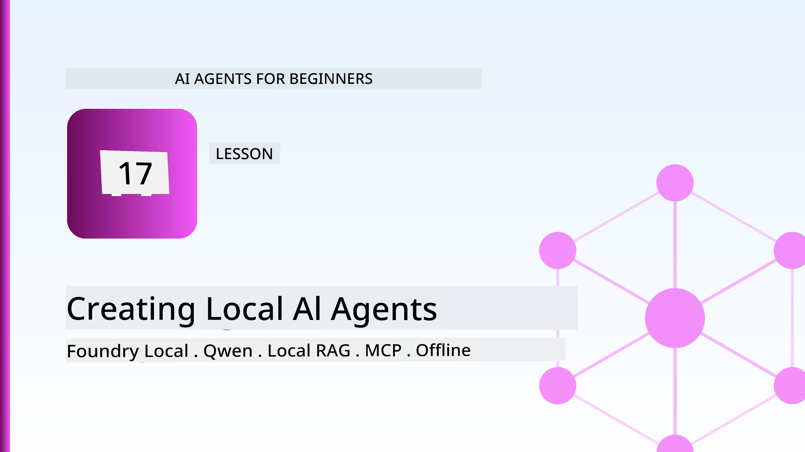
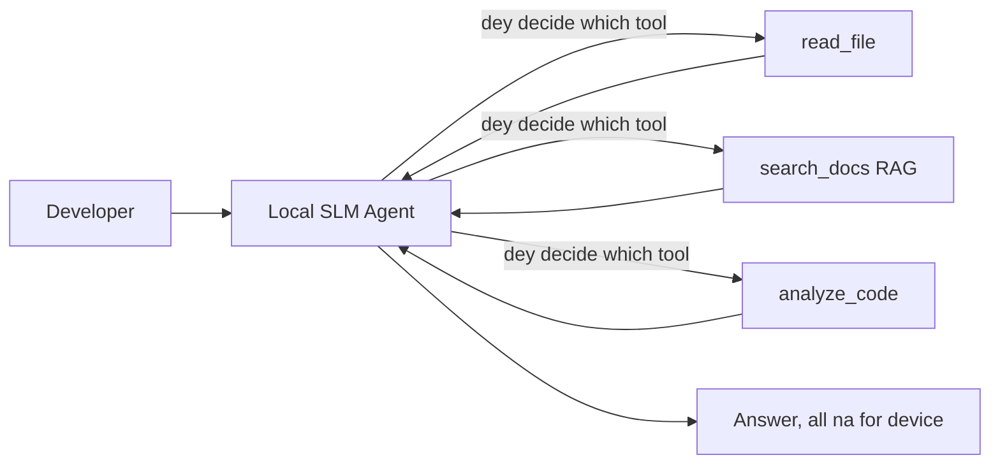
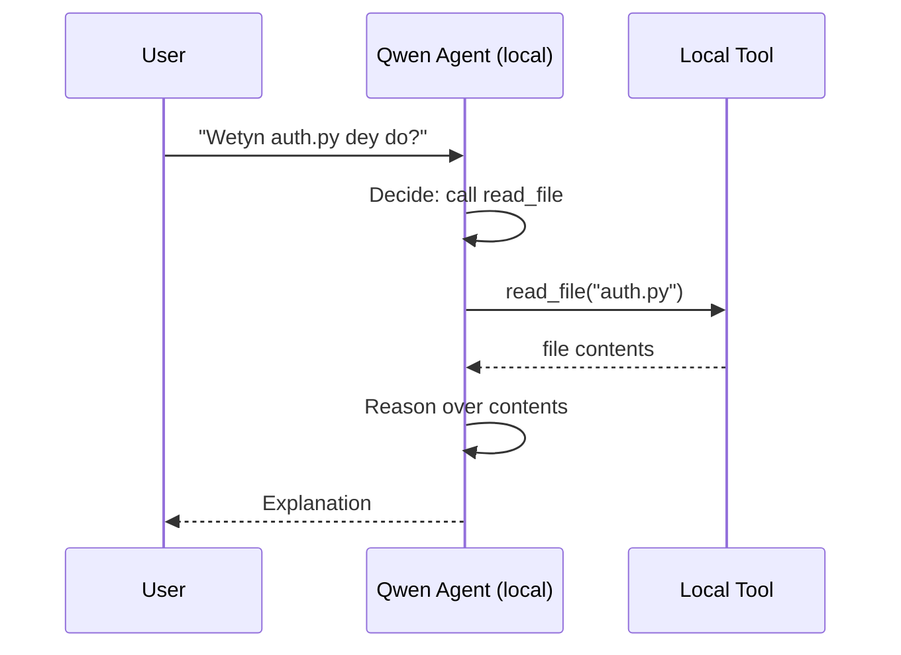
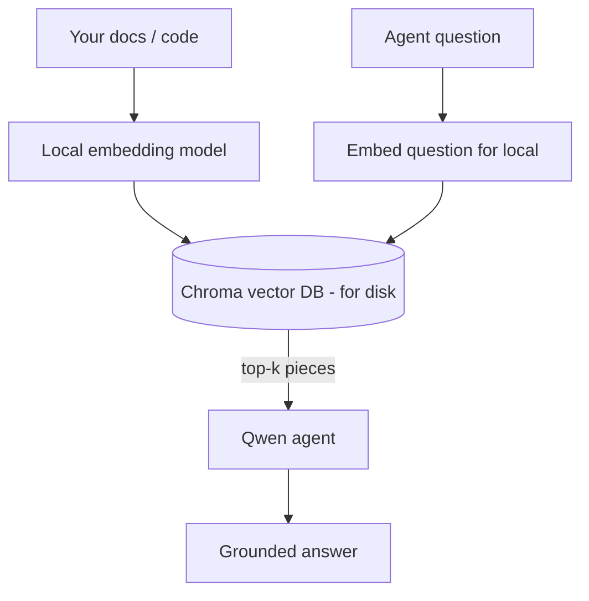
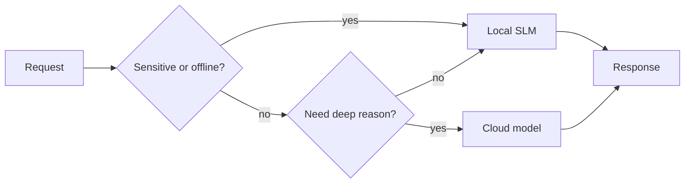

# Di way to Create Local AI Agents Using Microsoft Foundry Local and Qwen



Di lesson wey come before dis one increase agents go *up* inside cloud. Dis one go bring dem *down* for one machine only. By di time you finish, you go get working engineering assistant wey fit reason, call tools, read your files, and search your documentation — **no need to make one single cloud inference call.**

Why you go wan do like dis? Three reasons wey dem always show for real engineering work:

- **Privacy.** Code and documents no ever comot from di machine. No prompt, no snippet, no customer data dey waka pass di network boundary.
- **Cost.** Local inference no get per-token bill. You fit test am all day for price wey na electric cost be dat.
- **Offline.** For plane, for secured place, or when network down, di agent still dey work.

Di wahala be say you dey trade frontier cloud model for **Small Language Model (SLM)** wey dey run for your CPU, GPU, or NPU. Dis lesson na about how to build agents wey *good* for dat kain limitation, no be like say di limitation no dey.

## Introduction

Dis lesson go talk about:

- **Small Language Models (SLMs)** — wetin dem be, where dem sabi work well, and where dem no too sabi.
- **Microsoft Foundry Local** — runtime wey go download and serve models for device through **OpenAI-compatible API**.
- **Qwen function-calling models** — SLMs wey fit produce tools calls well well, na wetin fit make local *agents* possible (no na only local chat).
- **Local tools, local RAG, and local MCP** — to give agent power without cloud.
- **Hybrid patterns** — when to keep things local and when to use cloud.

## Learning Goals

After you finish dis lesson, you go sabi how to:

- Talk di trade-offs of SLMs and choose correct local-agent use cases.
- Serve one Qwen model locally with Foundry Local and connect to am through OpenAI-compatible endpoint.
- Build tool-calling agent wey dey run completely for your workstation.
- Add local RAG on top your own documents using local vector database (Chroma).
- Connect agent to local MCP server and reason about hybrid local/cloud design.

## Prerequisites

Dis lesson assume say you don finish di earlier lessons and you sabi:

- [Tool Use](../04-tool-use/README.md) (Lesson 4) and [Agentic RAG](../05-agentic-rag/README.md) (Lesson 5).
- [Agentic Protocols / MCP](../11-agentic-protocols/README.md) (Lesson 11).
- Di [Microsoft Agent Framework](../14-microsoft-agent-framework/README.md) (Lesson 14).

You go also need:

- Developer workstation. **8 GB RAM na minimum wey make sense**; 16 GB+ na beta. GPU or NPU dey help but no be must.
- **Microsoft Foundry Local** install finish (check di setup section below).
- Python 3.12+ and di packages for di repo [`requirements.txt`](../../../requirements.txt), plus `foundry-local-sdk`, `openai`, and `chromadb` for dis lesson.

## Small Language Models: Wetin Good For Local Work

Frontier cloud model get hundreds billions parameters and big data centre behind am. SLM get small small billions parameters and e for fit for laptop RAM. Dis difference dey set clear expectation.

**SLMs good for:**

- Structured, bounded task — classification, extraction, summarisation of known document.
- **Tool calling** — to sabi which function to call and wetin to call am with.
- Fast, cheap, private iteration on your own data.

**SLMs weak for:**

- Open-ended, multi-hop reasoning across big context.
- Broad world knowledge (dem never see plenty, and dem dey forget more).

Best strategy for local agents be say: **make SLM dey orchestrate, and make tools do heavy work.** Model no need to *know* your codebase — e need to sabi when to call `read_file` and `search_docs`. Na wetin SLM dey good for.



## Microsoft Foundry Local

**Microsoft Foundry Local** na light runtime wey go download, manage, and serve models fully on your machine. Wetin dey important for us be say e dey expose **OpenAI-compatible HTTP endpoint** — so OpenAI SDK and Microsoft Agent Framework's OpenAI client fit work with am by just changing `base_url`. Everything wey you learn about building agents fit transfer; only endpoint go change from cloud to `localhost`.

Foundry Local dey pick best model build for your hardware automatically — CPU build, CUDA/GPU build, or NPU build — so you no go need to hand-optimize per machine.

### Setup

Install Foundry Local (check di [documentation](https://learn.microsoft.com/azure/ai-foundry/foundry-local/) for your OS), then check say e dey work:

```bash
# Install (example; follow the docs for your platform)
winget install Microsoft.FoundryLocal      # Windows
# brew install microsoft/foundrylocal/foundrylocal   # macOS

# Download and run Qwen model, den start the local service
foundry model run qwen2.5-7b-instruct
foundry service status
```

Once service start, you get local OpenAI-compatible endpoint (usually `http://localhost:PORT/v1`). Notebook dey use `foundry-local-sdk` to find endpoint automatically, so you no need to hard-code port.

## Qwen Function Calling: Why E Important

Agent na agent if e fit call tools. Plenty SLM fit chat but dem dey produce wahala, bad tool call. **Qwen** models train for function calling and e dey produce well-formed tool-call structure steady — na wetin go turn local chat model to local *agent*.

Di workflow na di normal tool-calling loop wey you sabi, just say e dey run on-device:



## Local RAG

Documentation search na wetin local agents dey use shine. Instead of hoping say SLM remember your framework docs, you go embed those docs inside **local vector database** and make agent fit find correct chunks anytime e need am.

We dey use **Chroma**, embedded vector store wey run for process without server. Di whole pipeline na local: local embedding model → local vectors → local retrieval → local SLM.



Dis na di same Agentic RAG pattern from Lesson 5 — only change be say all components dey run for your machine.

## Local MCP Servers

[MCP](../11-agentic-protocols/README.md) na transport no be cloud service. MCP server fit run as local process on `stdio`, make tools open to your agent using standard protocol. Dis one make you fit reuse growing MCP server ecosystem — filesystem access, git operations, database queries — all offline.

Security stance different from cloud but still dey: local MCP server dey run with your user permissions, so limit wetin e fit touch (like one project directory no be your whole home folder) and treat outputs as inputs to validate.

## Hybrid Cloud-and-Local Patterns

Local-first no mean say na only local. Mature system dey route by sensitivity and difficulty:

| Situation | Where e go run |
| --- | --- |
| Sensitive code/data or offline | **Local SLM** |
| Simple, bounded task | **Local SLM** (cheap, fast) |
| Hard multi-hop reasoning on non-sensitive data | **Cloud model** |
| Everything, during outage | **Local SLM** (graceful degradation) |

Dis one resemble di **model routing** idea from Lesson 16 — except now one of di "models" na your own machine. Good design dey fallback to local when cloud no dey, so agent dey reduce in quality, no fail completely.



## Hands-On Lab: Local Engineering Assistant

Open [`code_samples/17-local-agent-foundry-local.ipynb`](./code_samples/17-local-agent-foundry-local.ipynb) and work through am. You go build **local engineering assistant** wey go run completely on your workstation and fit:

1. **Call tools** — via Qwen function call through Foundry Local.
2. **Do local file operations** — list and read files for project directory.
3. **Analyse code** — report basic metrics for source file.
4. **Search documentation** — local RAG on docs folder with Chroma.
5. **Use MCP** — connect to local MCP server (go skip gracefully if none dey configured).

No cloud inference dey used at all.

### Walkthrough

Agent go connect to Foundry Local using OpenAI-compatible endpoint, so agent code look almost the same as cloud lessons — only client change:

```python
from foundry_local import FoundryLocalManager
from openai import OpenAI

# Foundry Local dey find/download di model and e give us one local endpoint.
manager = FoundryLocalManager(\"qwen2.5-7b-instruct\")
client = OpenAI(base_url=manager.endpoint, api_key=manager.api_key)  # api_key na local placeholder.
```

Tools na normal Python functions scoped to project directory:

```python
def read_file(path: str) -> str:
    \"\"\"Read a file, but only inside the sandboxed project directory.\"\"\"
    full = (PROJECT_ROOT / path).resolve()
    if PROJECT_ROOT not in full.parents and full != PROJECT_ROOT:
        return \"Access denied: path is outside the project directory.\"
    return full.read_text(encoding=\"utf-8\")
```

Note sandy sandbox check — even locally, tool wey go read any path fit cause wahala. Notebook keep tools scoped to one project root.

## Knowledge Check

Test yourself before you move to assignment.

**1. Give two concrete reasons to run agent locally insted for cloud.**

<details>
<summary>Answer</summary>

Any two of: **privacy** (code and data no ever leave machine), **cost** (no per-token inference bill), and **offline capability** (e fit work without network — for plane, for secure place, or during outage). Regulatory/compliance wey no allow sending data off-device na big reason for privacy.
</details>

**2. Wetin di recommended division of work between SLM and e tools for local agent be, and why?**

<details>
<summary>Answer</summary>

Make SLM **orchestrate** (decide which tool to call and wetin to use as argument) and make **tools do heavy lifting** (read files, retrieve docs, compute results). SLM strong for bounded decisions like tool choice but weak for broad knowledge and long multi-hop reason, so depend on tools na im make am strong.
</details>

**3. Wetin make am possible to reuse cloud agent code with Foundry Local?**

<details>
<summary>Answer</summary>

Foundry Local dey expose **OpenAI-compatible HTTP endpoint**. OpenAI SDK and Agent Framework OpenAI client fit work with am just by changing `base_url` (using local placeholder API key). All other agent code no change.
</details>

**4. Why we use Qwen function-calling model and no just any other SLM?**

<details>
<summary>Answer</summary>

Because agent must produce reliable, well-formed **tool calls**. Plenty SLMs fit chat but dem go produce malformed or inconsistent tool calls. Qwen models dey train for function calling, e dey produce consistent tool calls, na wetin turn local chat model to working local agent.
</details>

**5. For local RAG pipeline, which components dey run for machine?**

<details>
<summary>Answer</summary>

All of dem: embedding model, vector database (Chroma, on disk), retrieval step, and SLM. Documents embed locally, store locally, retrieve locally, reason locally — no part touch cloud.
</details>

**6. Local MCP server dey run on your machine. That one make am automatically safe? Wetin you still fit do?**

<details>
<summary>Answer</summary>

No. Local MCP server dey run with your user permissions, so e fit reach anything wey you fit reach. Limit wetin e fit do (like one project directory no be everywhere for your home folder) and treat all e produce as inputs to check before you use am.
</details>

**7. Talk how sensible hybrid routing rule wey get local model go be.**

<details>
<summary>Answer</summary>

Send sensitive or offline requests go local SLM; send simple bounded task go local SLM for speed and cost; send hard multi-hop reasoning for non-sensitive data go cloud model; fallback to local SLM if cloud no dey make agent degrade gracefully no fail. Na di model routing (Lesson 16) but one model be your own machine.
</details>

**8. Wetin realistic minimum RAM e need to run local agent for dis lesson? Wetin more RAM fit help you do?**

<details>
<summary>Answer</summary>

About **8 GB** na minimum; 16 GB+ beta. More RAM fit make you run bigger, better models and keep more context memory. GPU or NPU fit speed inference but no mandatory — Foundry Local go choose CPU build if no accelerator dey.
</details>

## Assignment

Extend your local engineering assistant to become **local documentation reviewer** for small project of your choice (you fit use one of dis repo lesson folders).

Your task suppose be:

1. **Index real docs/code folder** inside Chroma (make sure at least five files).
2. **Add `find_todos` tool** wey go scan project for `TODO`/`FIXME` comments and return dem with file and line number — keep same sandbox check as `read_file`.

3. **Ask di agent tri kwestin** wey go make am kombin tool dem: one pure RAG kwestin, one wey go need to read spesifik file, and one wey go need find TODOs.
4. **Tok am time**: time each of di tri ansa dem and note dem down inside markdown cell. Talk if di latency dey okay for di workflow wey you wan use am.

Den write small paragraph on **wetin you go put for cloud and wetin you go keep local** for dis reviewer, and why. Di way dem go check you na if di local components dey connect well together and if your hybrid reasoning correct — no be di quality of di model dem.

## Summary

For dis lesson you build agent wey go run full inside your own machine:

- **SLMs** dey trade wide knowledge for privacy, cost, and offline operation — and dem dey shine when dem **orchestrate tools** instead make dem carry all knowledge by themselves.
- **Foundry Local** dey serve models inside device behind **OpenAI-compatible endpoint**, so your cloud agent code fit move with only one line change.
- **Qwen function-calling models** make local tool calling wey you fit trust — and so local *agents* — possible.
- **Local RAG** (Chroma) and **local MCP** dey give agent power without make am comot machine.
- **Hybrid patterns** dey allow you to route by sensibility and difficulty, with local as better fallback.

Dis one dey finish deployment chapter: Lesson 16 scale agents up inside Microsoft Foundry, and dis lesson scale dem down to one single workstation. Di next lesson go talk about how to keep deployed agents secure.

## Additional Resources

- <a href="https://learn.microsoft.com/azure/ai-foundry/foundry-local/" target="_blank">Microsoft Foundry Local documentation</a>
- <a href="https://learn.microsoft.com/azure/ai-foundry/what-is-azure-ai-foundry" target="_blank">Microsoft Foundry documentation</a>
- <a href="https://aka.ms/ai-agents-beginners/agent-framework" target="_blank">Microsoft Agent Framework</a>
- <a href="https://qwen.readthedocs.io/en/latest/framework/function_call.html" target="_blank">Qwen function calling documentation</a>
- <a href="https://modelcontextprotocol.io/" target="_blank">Model Context Protocol (MCP)</a>
- <a href="https://docs.trychroma.com/" target="_blank">Chroma vector database</a>

## Previous Lesson

[Deploying Scalable Agents](../16-deploying-scalable-agents/README.md)

## Next Lesson

[Securing AI Agents](../18-securing-ai-agents/README.md)

---

<!-- CO-OP TRANSLATOR DISCLAIMER START -->
**Disclaimer**:
Dis document don translate wit AI translation service [Co-op Translator](https://github.com/Azure/co-op-translator). Even tho we dey try make am correct, abeg make you know say automated translation fit get errors or mistakes. Di original document for dia own language na im be di correct source. For important info, make person wey sabi human translation do am. We no go responsible for any misunderstanding or wrong understanding wey fit happen because of dis translation.
<!-- CO-OP TRANSLATOR DISCLAIMER END -->