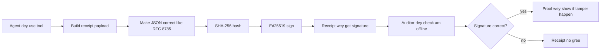
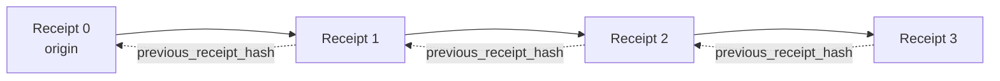

[Watch di lesson video: Securing AI Agents with Cryptographic Receipts](https://youtu.be/PLACEHOLDER_VIDEO_ID)

> _(Lesson video and thumbnail go add by di Microsoft content team after merge, to match di lesson 14 / 15 pattern.)_

# Securing AI Agents wit Cryptographic Receipts

## Introduction

Dis lesson go cover:

- Why audit trails for AI agents matter for compliance, debugging, and trust.
- Wetin be cryptographic receipt and how e different from unsigned log line.
- How to produce signed receipt for agent tool call for plain Python.
- How to verify receipt offline and detect tampering.
- How to chain receipts so that if you remove or reorder one e go break di chain.
- Wetin receipts prove and wetin dem no prove.

## Learning Goals

After you finish dis lesson, you go sabi how to:

- Identify di failure modes wey make cryptographic provenance important for agent actions.
- Produce Ed25519-signed receipt over a canonical JSON payload.
- Verify receipt independent using only di signer's public key.
- Detect tampering by re-running verification on modified receipt.
- Build hash-chained sequence of receipts and explain why di chain matter.
- Recognize di boundary between wetin receipts prove (attribution, integrity, ordering) and wetin dem no prove (correctness of action, soundness of policy).

## Di Problem: Your Agent's Audit Trail

Imagine say you don deploy AI agent for Contoso Travel. Di agent dey read customer request dem, call flights API to check options, and dey book seat for customer side. Last quarter, di agent process 50,000 bookings.

Today, one auditor come. Dem ask simple question: "Show me wetin your agent do."

You give dem your log files. Auditor see dem and ask di harder question: "How I go know say dem no edit di logs?"

Dis na di audit-trail problem. Most agent deployment today dey rely on:

- **Application logs**: na agent self dey write am, anybody wey get file-system access fit edit am.
- **Cloud logging services**: platform level tamper-evident but only if auditor trust di platform operator.
- **Database transaction logs**: good for database changes but no good for arbitrary tool calls.

None of these fit answer auditor question without auditor needing to trust person (you, your cloud provider, or your database vendor). For inside use, that trust dey acceptable. For regulated workloads (finance, healthcare, or anything wey get EU AI Act), e no dey acceptable.

Cryptographic receipts solve dis by making every agent action fit verify by itself. Auditor no need trust you. Dem only need your public key and di receipt.

## Wetin be Cryptographic Receipt?

Receipt na JSON object wey record wetin agent do, sign with digital signature.



Minimal receipt look like dis:

```json
{
  "type": "agent.tool_call.v1",
  "agent_id": "contoso-travel-bot",
  "tool_name": "lookup_flights",
  "tool_args_hash": "sha256:a3f9c1...",
  "result_hash": "sha256:7b2e1d...",
  "policy_id": "contoso-travel-policy-v3",
  "timestamp": "2026-04-25T14:30:00Z",
  "sequence": 47,
  "previous_receipt_hash": "sha256:9d4e6a...",
  "signature": {
    "alg": "EdDSA",
    "sig": "c5af83...",
    "public_key": "8f3b2c..."
  }
}
```

Three properties dey do di work:

1. **Di signature**. Di receipt sign by agent gateway using Ed25519 private key. Anybody wey get di public key fit verify di signature offline. If tamper with any field, di signature go invalid.

2. **Canonical encoding**. Before sign, receipt dey serialize using JSON Canonicalization Scheme (JCS, RFC 8785). Dis make sure say two different implement dey produce di same logical receipt and dem produce exact same bytes. Without canonicalization, different JSON serializers go give different signatures for di same content.

3. **Hash chaining**. Di `previous_receipt_hash` field link each receipt to di one wey come before am. If you remove or reorder receipt, e go break every receipt wey follow after am. Tampering go show for di chain even if individual signatures dem bypass.

Together, dis properties give three guarantees:

- **Attribution**: dis key sign dis content.
- **Integrity**: di content never change since sign.
- **Ordering**: dis receipt come after dat receipt for di chain.

## How to Produce a Receipt for Python

You no need special library to produce receipt. Cryptographic primitives dey widely available and di logic na just few dozen lines of Python.

Di hands-on exercises for `code_samples/18-signed-receipts.ipynb` go show di full flow. Di summary version:

```python
import json
import hashlib
import base64
from nacl import signing
from jcs import canonicalize  # RFC 8785 canonical JSON

def b64url_nopad(data: bytes) -> str:
    return base64.urlsafe_b64encode(data).decode("ascii").rstrip("=")

def sha256_canonical(obj) -> str:
    """SHA-256 of a Python object's JCS-canonical JSON form."""
    return f"sha256:{hashlib.sha256(canonicalize(obj)).hexdigest()}"

# Make or find una signing key (for production, keep am for key vault)
signing_key = signing.SigningKey.generate()
verify_key = signing_key.verify_key

# Build di receipt payload (no signature yet)
tool_args = {"origin": "SYD", "destination": "LAX"}
tool_result = [{"flight": "QF11", "price": 1850, "stops": 0}]

payload = {
    "type": "agent.tool_call.v1",
    "agent_id": "contoso-travel-bot",
    "tool_name": "lookup_flights",
    "tool_args_hash": sha256_canonical(tool_args),
    "result_hash": sha256_canonical(tool_result),
    "policy_id": "contoso-travel-policy-v3",
    "timestamp": "2026-04-25T14:30:00Z",
    "sequence": 0,
    "previous_receipt_hash": None,
}

# Canonicalize, hash, sign.
canonical_bytes = canonicalize(payload)
message_hash = hashlib.sha256(canonical_bytes).digest()
signature_bytes = signing_key.sign(message_hash).signature

# Attach one structured signature object.
receipt = {
    **payload,
    "signature": {
        "alg": "EdDSA",
        "sig": b64url_nopad(signature_bytes),
        "public_key": b64url_nopad(bytes(verify_key)),
    },
}
```

Dis na di whole signing pipeline. Exercises inside di notebook go show each step.

## How to Verify Receipt and Detect Tampering

Verification na di opposite operation:

```python
import base64
import hashlib
from nacl import signing
from nacl.exceptions import BadSignatureError
from jcs import canonicalize

def b64url_decode(s: str) -> bytes:
    padding = "=" * ((4 - len(s) % 4) % 4)
    return base64.urlsafe_b64decode(s + padding)

def verify_receipt(receipt: dict) -> bool:
    # Di signature na wan structured object: {"alg", "sig", "public_key"}.
    sig_obj = receipt.get("signature")
    if not sig_obj or sig_obj.get("alg") != "EdDSA":
        return False

    # Make di payload we dem actually sign again (everything except di signature).
    payload = {k: v for k, v in receipt.items() if k != "signature"}

    canonical_bytes = canonicalize(payload)
    message_hash = hashlib.sha256(canonical_bytes).digest()

    try:
        verify_key = signing.VerifyKey(b64url_decode(sig_obj["public_key"]))
        verify_key.verify(message_hash, b64url_decode(sig_obj["sig"]))
        return True
    except BadSignatureError:
        return False
```

Dis function go take receipt and return `True` if signature valid, `False` if no. No network call, no service dependency, no trust needed for any third party.

To see tampering detection, di notebook go show:

1. Produce valid receipt and confirm say e verify.
2. Modify one byte for `tool_args_hash` field.
3. Re-run verification and see say e fail.

Dis na practical demo say receipts na tamper-evident: any small change go break di signature.

## Chaining Receipts for Multi-Step Agents

One signed receipt protect one action. Chain of receipts protect whole sequence.



Each receipt record di hash of previous receipt. To remove receipt 2 without noise, attacker need to either:

- Modify receipt 3 `previous_receipt_hash` field (go break receipt 3 signature)
- OR forge new signature on modified receipt 3 (need di agent private key)

If private key dey hardware key vault and you publish public key wit each receipt, no attack fit happen without detection.

Di notebook go show:

1. Build chain of three receipts.
2. Verify say each receipt `previous_receipt_hash` match actual hash of previous receipt.
3. Tamper one receipt inside chain and see chain break for dat point.

Na so you fit produce audit trail wey external auditor fit verify without trusting you.

## Wetin Receipts Prove (and Wetin Dem No Prove)

Dis na di most important section for dis lesson. Receipts powerfull but dem get limit.

**Receipts prove three tins:**

1. **Attribution**: specific key sign specific payload.
2. **Integrity**: payload no change since sign.
3. **Ordering**: dis receipt come after dat receipt for di hash chain.

**Receipts no prove:**

1. **Correctness**: say agent action na di right action. Receipt fit sign wrong answer as clean as correct answer.
2. **Policy compliance**: say policy inside `policy_id` really evaluate or say e for allow dis action if check. Receipt only record wetin dem claim no wetin dem enforce.
3. **Identity beyond di key**: receipt talk say "dis key sign dis content". E no talk say "human authorize dis". To connect key to person or org need separate identity infrastructure (directory, public key registry, etc.).
4. **Truthfulness of inputs**: if agent get manipulated prompt and act on am, receipt faithfully record di action. Receipts dey downstream input validation, no be replacement for am.

Dis limit matter for two reasons:

- E tell you wetin receipts fit do: make agent behavior auditable and tamper-evident, even across organization boundaries.
- E also tell wetin other layers you still need: input validation (Lesson 6), policy enforcement (small talk below), identity infrastructure (outside dis lesson).

Common mistake na to think "we get receipts" mean "we dey governed." E no true. Receipts na foundation. Governance na system wey you build on top.

## Prove Say Human Approve Di Exact Action

Item 3 above deserve section on im own: action receipt talk "dis key sign dis content," no "human authorize dis." For high-risk actions (refunds, deletions, wire transfers), governance framework dey require dat missing statement, and e fit produce wit di same primitives wey you don learn for dis lesson.

Di next notebook `code_samples/human-authorization-receipts.ipynb` add second receipt type, `human.approval.v1`, for same envelope shape as lesson receipts (typed payload signed by Ed25519 over canonical SHA-256, with `signature` object outside signed bytes). Named approver sign **full canonical action and im digest** before execution; agent action receipt carry **same action digest** and `parent_approval_ref`, di `receipt_hash` of di approval, same convention as `previous_receipt_hash` for chain wey you build above. One `verify_chain` go check both artifacts under **separate pinned key registries** (approver keys vs agent keys), so code path shared but authorities no.

Di property wey dis buy, na this: *human approve dis exact action and agent do exactly dat approved action.* Notebook refusal fixtures na wetin make dis real no be just talk:

- classic set: tampering, confused deputy, replay, forged keys on either side, malformed input;
- **stale authority**: signature fit still verify but refuse cos policy version change, approver key rotate pid registry, or approval expire before execution;
- **digest substitution**: validly signed action receipt point to *real* approval wey bind *different* canonical action.

Each failure refuse with clear reason so auditor fit know if authority stale or if executed action change. Di rule for notebook na: signed approval no be authority alone. Authority dey only if both receipts still bind same canonical action at execution time. Co-signature path for same Internet-Draft wey dis lesson follow (`draft-farley-acta-signed-receipts`) na standards-track shape of dis pattern.

## Production References

Python code for dis lesson minimal on purpose so you fit read every line and understand wetin dey happen. For production, you get two options:

1. **Build direct on cryptographic primitives.** Di 50 lines wey you see above enough for many use cases. PyNaCl (Ed25519) and `jcs` package (canonical JSON) na well-maintained and audited libraries.

2. **Use production receipt library.** Some open-source projects implement same pattern with extra features (key rotation, batch verification, JWK Set distribution, integration with policy engines):
   - Receipt format wey dis lesson use follow IETF Internet-Draft ([`draft-farley-acta-signed-receipts`](https://datatracker.ietf.org/doc/draft-farley-acta-signed-receipts/), revision 02) wey dey standards process, with shared conformance suite ([agent-governance-testvectors](https://github.com/ScopeBlind/agent-governance-testvectors)) wey independent implementations use cross-verify for byte-identical canonical output.
   - Microsoft Agent Governance Toolkit combine receipts with Cedar-based policy decisions; check Tutorial 33 for full example.
   - `protect-mcp` (npm) and `@veritasacta/verify` (npm) packages provide Node-based receipt signing and offline verification; dem fit wrap any MCP server with tamper-evident audit trail, include held-for-co-sign flow wey paused action emit approval receipt bound to action digest (WebAuthn-backed for desktop flow), same approval-receipt pattern as human-authorization notebook above.
   - **[nobulex](https://github.com/arian-gogani/nobulex)** Python SDK (`pip install nobulex`) provide same Ed25519 + JCS signing pattern with LangChain and CrewAI, including published cross-validation test vectors and compliance mapping via [OWASP PR #2210](https://github.com/OWASP/CheatSheetSeries/pull/2210).

Decision whether to build your own or use library similar to choice of building your own JWT library or use tested one: both okay; library save time and reduce audit risk; building from scratch force you understand primitives. Dis lesson teach from-scratch so you get solid foundation for either choice.

## Knowledge Check

Test your understanding before you go practice exercise.

**1. Receipt sign wit agent private Ed25519 key. Auditor get only public key. Auditor fit verify receipt offline?**

<details>
<summary>Answer</summary>

Yes. Ed25519 verification need only public key and signed bytes. No network call, no service dependency. Dis na wetin make receipts useful for air-gapped, multi-org, or low-trust audit settings.
</details>

**2. Attacker modify `policy_id` field of receipt to claim say e govern by more permissive policy. Original signature cover original payload. Wetin happen for verification?**

<details>
<summary>Answer</summary>


Verification no gree work. Dem calculate signature for top di correct bytes dem of di original payload; if you change any field, e go change di correct bytes dem, weh go change di SHA-256 hash, weh go make di signature no gree again. Di attacker need di private key before e fit create fresh correct signature, but dem no get am.
</details>

**3. Why di receipt get `tool_args_hash` and `result_hash` instead of di raw arguments and result?**

<details>
<summary>Answer</summary>

Two reason. First, di receipt fit need to dey saved or sent for places weh to leak raw content (PII, business data) tight. Hashing dey keep di receipt small and di content private; auditor go check say di hash match one separate copy wit real content. Second, hashes get fixed size; receipt wit hashes no go big no matter how large di input and output be.
</details>

**4. Di `previous_receipt_hash` field dey join each receipt to di one before am. If attacker quietly commot receipt for middle of di chain, wetin go no valid again?**

<details>
<summary>Answer</summary>

All di receipts wey come after di one wey dem commot. Their `previous_receipt_hash` fields no go match di real chain again (because di receipt dem refer to no dey again, or di chain don point to different predecessor). If e wan hide di deletion, attacker go need sign every other later receipt again, and e need di private key to do that.
</details>

**5. Receipt verify correct. E mean say di agent action correct, true or follow policy?**

<details>
<summary>Answer</summary>

No. Valid receipt prove three tins: attribution (dis key sign dis content), integrity (content no change), and order (dis receipt happen after dat one). E no mean say action correct, policy wey dem mention for `policy_id` really check, or agent follow every rule. Receipts dey make agent behavior fit check, no dey mean say e correct. Dis na di most important lesson boundary.
</details>

## Practice Exercise

Open `code_samples/18-signed-receipts.ipynb` and complete all four sections:

1. **Section 1**: Sign your first receipt and verify am.
2. **Section 2**: Change the receipt small and watch how verification fail.
3. **Section 3**: Build chain of three receipts and check say the chain still dey valid.
4. **Section 4**: Use the pattern for agent wey you make wit Microsoft Agent Framework: put tool call inside receipt-signing, then check receipt separately.

**Stretch challenge 1:** add one more field wey you pick to the receipt schema (example, request ID for tracing), update di way you sign to include am, then confirm say receipt still verify well. After dat, change di field after sign and check say verification fail. Dis one go make you sabi how every byte for di canonical encoding dey affect di signature.

**Stretch challenge 2:** SHA-256 hash two of your receipts together (join their correct bytes for one order) then put di digest as new field on third receipt before you sign am. Check say all three receipts still dey valid. You don build one-step inclusion proof: anyone wey get third receipt fit prove say first two dey when e sign am, but dem no need show all di content. Na di pattern wey selective-disclosure receipts dey use well well (Merkle commitments, RFC 6962).

## Conclusion

Cryptographic receipts dey give AI agents audit trail wey be:

- **Fit verify by anybody:** anybody wey get public key fit verify, no need service.
- **Tamper-evident:** if you change anything signature no go valid.
- **Portable:** receipt na small JSON file; you fit keep am, send am, verify am anywhere.
- **Standards-aligned:** e build for Ed25519 (RFC 8032), JCS (RFC 8785), and SHA-256, all na common primitives.

Dem no fit replace input validation, policy, or identity system. Dem be foundation for dem. When you dey use agents for regulated work or multi-org workflow or place weh auditor no fit trust you, receipts na how you keep audit trail honest.

Di most important tin: receipts prove who talk wetin and when. E no mean say wetin dem talk na true or correct. Remember dis because e be difference between honest provenance system and one wey go mislead.

## Production Checklist

When you ready to move from dis lesson to deploy receipt-signed agents for real environment:

- [ ] **Move di signing key comot for developer laptop.** Use Azure Key Vault, AWS KMS, or hardware security module. Private key wey sign your receipts no suppose ever dey for source control or plaintext for machine.
- [ ] **Publish di public key for verification.** Auditors need am to verify offline. Standard na JWK Set for known URL (RFC 7517), e.g., `https://your-org.example.com/.well-known/agent-keys.json`.
- [ ] **Anchor di chain outside.** Sometimes, write latest chain head hash for transparency log (Sigstore Rekor, RFC 3161 timestamp authority, or internal system) weh outside party fit confirm "dis chain bin dey for dis time."
- [ ] **Store receipts wey no go change.** Use append-only blob storage (Azure Storage wit immutability policies, AWS S3 Object Lock) wey no go let insider rewrite history.
- [ ] **Decide how long to keep.** Many compliance require keep long time. Plan for growth (each receipt na ~500 bytes; agent wey make 10K calls/day fit make ~1.8 GB per year).
- [ ] **Document wetin receipts no cover.** Receipts prove attribution, integrity, order. Your runbook suppose tok clearly about extra controls (input validation, policy enforcement, rate limiting, identity infrastructure) wey work wit receipts for governance.

### You Need More Questions about Securing AI Agents?

Join di [Microsoft Foundry Discord](https://aka.ms/ai-agents/discord) to meet other learners, attend office hours, and get your AI Agents questions answer.

## After This Lesson

Dis lesson cover single-receipt signing and hash-chained sequences. Same process fit make many advanced patterns you go see as governance mature:

- **Selective disclosure.** When receipt fields independently commit (RFC 6962 Merkle tree style), you fit show some fields to specific auditors and prove others no change without showing dem. Good when same receipt need satisfy full audit (wey want everything) and data-minimization laws like GDPR (wey want auditor see only wetin necessary).
- **Receipt revocation.** If signing key leak, you need way to mark all receipts signed wit dat key not trust again from some time. Standard way: short-lived keys plus revoke list, or transparency log wit revocation.
- **Bilateral / split-signature receipts.** Some implementation split signed payload into pre-execution (`authorization_*`) and post-execution (`result_*`) wit independent signatures, useful when authorization decision and result come from different actors or times. E build on top of lesson receipt format.
- **Payload composition.** Receipt seal all bytes inside `result_hash`. Real payloads dey richer than one tool call: reasoning before decision (model prediction, options, evidence and completeness, risk, accountability, gate outcome) fit dey inside payload seal by one receipt. E keep receipt small but payload fit grow by domain.
- **Cross-implementation conformance.** Multiple independent implementations of same receipt format (Python, TypeScript, Rust, Go) dey verify with shared test vectors. If you build your own, you fit use published vectors check compatibility.
- **Post-quantum migration.** Ed25519 dey popular now but no quantum-proof. Receipt format fit use different algorithms: `signature.alg` fit carry `ML-DSA-65` (NIST post-quantum signature standard) when you wan move. Prepare for period wey receipts get dual sign.

## More Resources

- <a href="https://datatracker.ietf.org/doc/draft-farley-acta-signed-receipts/" target="_blank">IETF Internet-Draft: Signed Decision Receipts for Machine-to-Machine Access Control</a>
- <a href="https://learn.microsoft.com/azure/ai-studio/responsible-use-of-ai-overview" target="_blank">Responsible AI overview (Azure AI)</a>
- <a href="https://datatracker.ietf.org/doc/html/rfc8032" target="_blank">RFC 8032: Edwards-Curve Digital Signature Algorithm (EdDSA)</a>
- <a href="https://datatracker.ietf.org/doc/html/rfc8785" target="_blank">RFC 8785: JSON Canonicalization Scheme (JCS)</a>
- <a href="https://datatracker.ietf.org/doc/html/rfc6962" target="_blank">RFC 6962: Certificate Transparency</a> (Merkle-tree construction wey selective-disclosure receipts use)
- <a href="https://github.com/microsoft/agent-governance-toolkit/blob/main/docs/tutorials/33-offline-verifiable-receipts.md" target="_blank">Microsoft Agent Governance Toolkit, Tutorial 33: Offline-Verifiable Decision Receipts</a>
- <a href="https://github.com/ScopeBlind/agent-governance-testvectors" target="_blank">Cross-implementation conformance test vectors</a> for receipt format wey dis lesson use (Apache-2.0)
- <a href="https://pynacl.readthedocs.io/" target="_blank">PyNaCl documentation</a> (Ed25519 for Python)

## Previous Lesson

[Creating Local AI Agents](../17-creating-local-ai-agents/README.md)

---

<!-- CO-OP TRANSLATOR DISCLAIMER START -->
**Disclaimer**:
Dis document don translate wit AI translation service [Co-op Translator](https://github.com/Azure/co-op-translator). Even tho we dey try make am correct, abeg make you know say automated translation fit get errors or mistakes. Di original document for dia own language na im be di correct source. For important info, make person wey sabi human translation do am. We no go responsible for any misunderstanding or wrong understanding wey fit happen because of dis translation.
<!-- CO-OP TRANSLATOR DISCLAIMER END -->