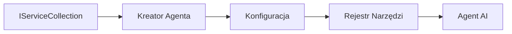

# 🎨 Agentowe Wzorce Projektowe z Azure OpenAI (Responses API) (.NET)

## 📋 Cele Nauki

Ten przykład demonstruje wzorce projektowe klasy korporacyjnej dla budowania inteligentnych agentów korzystających z Microsoft Agent Framework w .NET z integracją Azure OpenAI (Responses API). Nauczysz się profesjonalnych wzorców i podejść architektonicznych, które sprawiają, że agenci są gotowi do produkcji, łatwi w utrzymaniu i skalowalni.

### Wzorce Projektowe Klasy Korporacyjnej

- 🏭 **Wzorzec Fabryki**: Standardowe tworzenie agentów z wstrzykiwaniem zależności
- 🔧 **Wzorzec Budowniczego**: Płynna konfiguracja i ustawienia agenta
- 🧵 **Wzorce Bezpieczeństwa Wątków**: Równoczesne zarządzanie rozmowami
- 📋 **Wzorzec Repozytorium**: Zorganizowane zarządzanie narzędziami i możliwościami

## 🎯 Korzyści Architektoniczne Specyficzne dla .NET

### Funkcje klasy korporacyjnej

- **Silne Typowanie**: Walidacja podczas kompilacji i wsparcie IntelliSense
- **Wstrzykiwanie Zależności**: Wbudowana integracja z kontenerem DI
- **Zarządzanie Konfiguracją**: Wzorce IConfiguration i Options
- **Async/Await**: Pierwszorzędne wsparcie programowania asynchronicznego

### Wzorce Gotowe do Produkcji

- **Integracja Logowania**: Wsparcie ILogger i logowanie strukturalne
- **Kontrole Stanu Zdrowia**: Wbudowane monitorowanie i diagnostyka
- **Walidacja Konfiguracji**: Silne typowanie z adnotacjami danych
- **Obsługa Błędów**: Strukturalne zarządzanie wyjątkami

## 🔧 Architektura Techniczna

### Kluczowe Komponenty .NET

- **Microsoft.Extensions.AI**: Zunifikowane abstrakcje usług AI
- **Microsoft.Agents.AI**: Framework orkiestracji agentów klasy korporacyjnej
- **Azure OpenAI (Responses API)**: Wzorce klienta API o wysokiej wydajności
- **System Konfiguracji**: appsettings.json i integracja środowiskowa

### Implementacja Wzorców Projektowych



## 🏗️ Demonstracja Wzorców Klasy Korporacyjnej

### 1. **Wzorce Kretacyjne**

- **Fabryka Agentów**: Centralne tworzenie agentów ze spójną konfiguracją
- **Wzorzec Budowniczego**: Płynne API do złożonej konfiguracji agenta
- **Wzorzec Singleton**: Współdzielone zasoby i zarządzanie konfiguracją
- **Wstrzykiwanie Zależności**: Luźne powiązanie i testowalność

### 2. **Wzorce Behawioralne**

- **Wzorzec Strategii**: Zamienialne strategie wykonywania narzędzi
- **Wzorzec Komendy**: Enkapsulowane operacje agentów z obsługą cofania/ponawiania
- **Wzorzec Obserwatora**: Zarządzanie cyklem życia agenta sterowane zdarzeniami
- **Metoda Szablonowa**: Standardowe przepływy pracy wykonania agenta

### 3. **Wzorce Strukturalne**

- **Wzorzec Adaptera**: Warstwa integracyjna Azure OpenAI (Responses API)
- **Wzorzec Dekoratora**: Rozszerzanie zdolności agenta
- **Wzorzec Fasady**: Upraszczanie interfejsów interakcji z agentem
- **Wzorzec Proxy**: Lazy loading i cache’owanie dla wydajności

## 📚 Zasady Projektowania w .NET

### Zasady SOLID

- **Pojedyncza Odpowiedzialność**: Każdy komponent ma jedno jasne zadanie
- **Otwarte/Zamknięte**: Rozszerzalne bez modyfikacji
- **Zasada Podstawienia Liskov**: Implementacje narzędzi oparte na interfejsach
- **Segregacja Interfejsów**: Skoncentrowane, spójne interfejsy
- **Odwrócenie Zależności**: Zależność od abstrakcji, nie od konkretnych klas

### Czysta Architektura

- **Warstwa Domenowa**: Podstawowe abstrakcje agentów i narzędzi
- **Warstwa Aplikacji**: Orkiestracja agentów i przepływy pracy
- **Warstwa Infrastruktury**: Integracja Azure OpenAI (Responses API) i usługi zewnętrzne
- **Warstwa Prezentacji**: Interakcja użytkownika i formatowanie odpowiedzi

## 🔒 Rozważania Korporacyjne

### Bezpieczeństwo

- **Zarządzanie Poświadczeniami**: Bezpieczne obsługiwanie kluczy API z IConfiguration
- **Weryfikacja Danych Wejściowych**: Silne typowanie i walidacja adnotacji danych
- **Oczyszczanie Danych Wyjściowych**: Bezpieczne przetwarzanie i filtrowanie odpowiedzi
- **Rejestrowanie Audytu**: Kompleksowe śledzenie operacji

### Wydajność

- **Wzorce Asynchroniczne**: Operacje I/O bez blokowania
- **Pule Połączeń**: Efektywne zarządzanie klientami HTTP
- **Cache’owanie**: Buforowanie odpowiedzi dla lepszej wydajności
- **Zarządzanie Zasobami**: Właściwe wzorce zwalniania i czyszczenia

### Skalowalność

- **Bezpieczeństwo Wątków**: Wsparcie dla równoległego wykonywania agentów
- **Pule Zasobów**: Efektywne wykorzystanie zasobów
- **Zarządzanie Obciążeniem**: Ograniczanie tempa i obsługa przeciążenia
- **Monitorowanie**: Metryki wydajności i kontrole stanu zdrowia

## 🚀 Wdrożenie Produkcyjne

- **Zarządzanie Konfiguracją**: Ustawienia specyficzne dla środowiska
- **Strategia Logowania**: Logowanie strukturalne z identyfikatorami korelacji
- **Obsługa Błędów**: Globalna obsługa wyjątków z właściwym odzyskiwaniem
- **Monitorowanie**: Application Insights i liczniki wydajności
- **Testowanie**: Testy jednostkowe, integracyjne i obciążeniowe

Gotowy, by budować inteligentnych agentów klasy korporacyjnej z .NET? Zaprojektujmy coś solidnego! 🏢✨

## 🚀 Pierwsze Kroki

### Wymagania Wstępne

- [.NET 10 SDK](https://dotnet.microsoft.com/download/dotnet/10.0) lub wyższy
- Subskrypcja [Azure](https://azure.microsoft.com/free/) z zasobem Azure OpenAI i wdrożonym modelem
- [Azure CLI](https://learn.microsoft.com/cli/azure/install-azure-cli) — zaloguj się za pomocą `az login`

### Wymagane Zmienne Środowiskowe

```bash
# zsh/bash
export AZURE_OPENAI_ENDPOINT=https://<your-resource>.openai.azure.com
export AZURE_OPENAI_DEPLOYMENT=gpt-4.1-mini
# Następnie zaloguj się, aby AzureCliCredential mógł uzyskać token
az login
```

```powershell
# PowerShell
$env:AZURE_OPENAI_ENDPOINT = "https://<your-resource>.openai.azure.com"
$env:AZURE_OPENAI_DEPLOYMENT = "gpt-4.1-mini"
# Następnie zaloguj się, aby AzureCliCredential mógł uzyskać token
az login
```

### Przykładowy Kod

Aby uruchomić przykład kodu,

```bash
# zsh/bash
chmod +x ./03-dotnet-agent-framework.cs
./03-dotnet-agent-framework.cs
```

Lub używając dotnet CLI:

```bash
dotnet run ./03-dotnet-agent-framework.cs
```

Zobacz [`03-dotnet-agent-framework.cs`](../../../../03-agentic-design-patterns/code_samples/03-dotnet-agent-framework.cs) po pełny kod.

```csharp
#!/usr/bin/dotnet run

#:package Microsoft.Extensions.AI@10.*
#:package Microsoft.Agents.AI.OpenAI@1.*-*
#:package Azure.AI.OpenAI@2.1.0
#:package Azure.Identity@1.13.1

using System.ComponentModel;

using Microsoft.Agents.AI;
using Microsoft.Extensions.AI;

using Azure.AI.OpenAI;
using Azure.Identity;

// Tool Function: Random Destination Generator
// This static method will be available to the agent as a callable tool
// The [Description] attribute helps the AI understand when to use this function
// This demonstrates how to create custom tools for AI agents
[Description("Provides a random vacation destination.")]
static string GetRandomDestination()
{
    // List of popular vacation destinations around the world
    // The agent will randomly select from these options
    var destinations = new List<string>
    {
        "Paris, France",
        "Tokyo, Japan",
        "New York City, USA",
        "Sydney, Australia",
        "Rome, Italy",
        "Barcelona, Spain",
        "Cape Town, South Africa",
        "Rio de Janeiro, Brazil",
        "Bangkok, Thailand",
        "Vancouver, Canada"
    };

    // Generate random index and return selected destination
    // Uses System.Random for simple random selection
    var random = new Random();
    int index = random.Next(destinations.Count);
    return destinations[index];
}

// Azure OpenAI with the Responses API (stable v1 endpoint). Sign in with `az login`.
var azureEndpoint = Environment.GetEnvironmentVariable("AZURE_OPENAI_ENDPOINT")
    ?? throw new InvalidOperationException("AZURE_OPENAI_ENDPOINT is not set.");
var deployment = Environment.GetEnvironmentVariable("AZURE_OPENAI_DEPLOYMENT") ?? "gpt-4.1-mini";

var azureClient = new AzureOpenAIClient(new Uri(azureEndpoint), new AzureCliCredential());

// Define Agent Identity and Comprehensive Instructions
// Agent name for identification and logging purposes
var AGENT_NAME = "TravelAgent";

// Detailed instructions that define the agent's personality, capabilities, and behavior
// This system prompt shapes how the agent responds and interacts with users
var AGENT_INSTRUCTIONS = """
You are a helpful AI Agent that can help plan vacations for customers.

Important: When users specify a destination, always plan for that location. Only suggest random destinations when the user hasn't specified a preference.

When the conversation begins, introduce yourself with this message:
"Hello! I'm your TravelAgent assistant. I can help plan vacations and suggest interesting destinations for you. Here are some things you can ask me:
1. Plan a day trip to a specific location
2. Suggest a random vacation destination
3. Find destinations with specific features (beaches, mountains, historical sites, etc.)
4. Plan an alternative trip if you don't like my first suggestion

What kind of trip would you like me to help you plan today?"

Always prioritize user preferences. If they mention a specific destination like "Bali" or "Paris," focus your planning on that location rather than suggesting alternatives.
""";

// Create AI Agent with Advanced Travel Planning Capabilities
// Get the Responses client for the deployment and create the AI agent
// Configure agent with name, detailed instructions, and available tools
// This demonstrates the .NET agent creation pattern with full configuration
AIAgent agent = azureClient
    .GetChatClient(deployment)
    .AsAIAgent(
        name: AGENT_NAME,
        instructions: AGENT_INSTRUCTIONS,
        tools: [AIFunctionFactory.Create(GetRandomDestination)]
    );

// Create New Conversation Session for Context Management
// Initialize a new conversation session to maintain context across multiple interactions
// Sessions enable the agent to remember previous exchanges and maintain conversational state
// This is essential for multi-turn conversations and contextual understanding
var session = await agent.CreateSessionAsync();

// Execute Agent: First Travel Planning Request
// Run the agent with an initial request that will likely trigger the random destination tool
// The agent will analyze the request, use the GetRandomDestination tool, and create an itinerary
// Using the session parameter maintains conversation context for subsequent interactions
await foreach (var update in agent.RunStreamingAsync("Plan me a day trip", session))
{
    await Task.Delay(10);
    Console.Write(update);
}

Console.WriteLine();

// Execute Agent: Follow-up Request with Context Awareness
// Demonstrate contextual conversation by referencing the previous response
// The agent remembers the previous destination suggestion and will provide an alternative
// This showcases the power of conversation sessions and contextual understanding in .NET agents
await foreach (var update in agent.RunStreamingAsync("I don't like that destination. Plan me another vacation.", session))
{
    await Task.Delay(10);
    Console.Write(update);
}
```

---

<!-- CO-OP TRANSLATOR DISCLAIMER START -->
**Zastrzeżenie**:
Niniejszy dokument został przetłumaczony za pomocą usługi tłumaczenia AI [Co-op Translator](https://github.com/Azure/co-op-translator). Choć dążymy do dokładności, prosimy pamiętać, że automatyczne tłumaczenia mogą zawierać błędy lub niedokładności. Oryginalny dokument w jego języku źródłowym należy uznawać za autorytatywne źródło. W przypadku informacji krytycznych zalecane jest skorzystanie z profesjonalnego tłumaczenia wykonanego przez człowieka. Nie ponosimy odpowiedzialności za jakiekolwiek nieporozumienia lub błędne interpretacje wynikające z użycia tego tłumaczenia.
<!-- CO-OP TRANSLATOR DISCLAIMER END -->