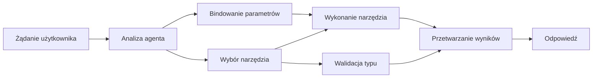

# 🛠️ Zaawansowane wykorzystanie narzędzi z Azure OpenAI (Responses API) (.NET)

## 📋 Cele nauki

Ten notatnik demonstruje wzorce integracji narzędzi na poziomie przedsiębiorstwa za pomocą Microsoft Agent Framework w .NET z Azure OpenAI (Responses API). Nauczysz się budować zaawansowanych agentów z wieloma wyspecjalizowanymi narzędziami, wykorzystując silne typowanie C# i funkcje przedsiębiorstwowe .NET.

### Zaawansowane możliwości narzędzi, które opanujesz

- 🔧 **Architektura wielonarzędziowa**: Budowa agentów z wieloma wyspecjalizowanymi możliwościami
- 🎯 **Bezpieczne typowanie przy wykonaniu narzędzi**: Wykorzystanie walidacji w czasie kompilacji C#
- 📊 **Wzorce narzędzi dla przedsiębiorstw**: Projektowanie narzędzi gotowych do produkcji i obsługa błędów
- 🔗 **Kompozycja narzędzi**: Łączenie narzędzi dla złożonych procesów biznesowych

## 🎯 Korzyści architektury narzędzi .NET

### Cechy narzędzi dla przedsiębiorstw

- **Walidacja w czasie kompilacji**: Silne typowanie zapewnia poprawność parametrów narzędzi
- **Wstrzykiwanie zależności**: Integracja kontenera IoC do zarządzania narzędziami
- **Wzorce async/await**: Wykonanie narzędzi bez blokowania z właściwym zarządzaniem zasobami
- **Strukturalne logowanie**: Wbudowana integracja logowania do monitorowania wykonania narzędzi

### Wzorce gotowe do produkcji

- **Obsługa wyjątków**: Kompleksowe zarządzanie błędami z typowanymi wyjątkami
- **Zarządzanie zasobami**: Właściwe wzorce utylizacji i zarządzanie pamięcią
- **Monitorowanie wydajności**: Wbudowane metryki i liczniki wydajności
- **Zarządzanie konfiguracją**: Bezpieczna typowo konfiguracja z walidacją

## 🔧 Architektura techniczna

### Podstawowe komponenty narzędzi .NET

- **Microsoft.Extensions.AI**: Ujednolicona warstwa abstrakcji narzędzi
- **Microsoft.Agents.AI**: Narzędzia do orkiestracji klasy przedsiębiorstwowej
- **Azure OpenAI (Responses API)**: Wydajny klient API z pulą połączeń

### Pipeline wykonania narzędzi



## 🛠️ Kategorie i wzorce narzędzi

### 1. **Narzędzia do przetwarzania danych**

- **Walidacja wejścia**: Silne typowanie z adnotacjami danych
- **Operacje transformacji**: Bezpieczna typowo konwersja i formatowanie danych
- **Logika biznesowa**: Narzędzia obliczeń i analiz specyficznych dla domeny
- **Formatowanie wyjścia**: Strukturalne generowanie odpowiedzi

### 2. **Narzędzia integracyjne**

- **Konektory API**: Integracja usług RESTful za pomocą HttpClient
- **Narzędzia baz danych**: Integracja Entity Framework do dostępu do danych
- **Operacje na plikach**: Bezpieczne operacje na systemie plików z walidacją
- **Usługi zewnętrzne**: Wzorce integracji usług firm trzecich

### 3. **Narzędzia użytkowe**

- **Przetwarzanie tekstu**: Narzędzia manipulacji i formatowania łańcuchów znaków
- **Operacje daty/czasu**: Obliczenia daty/czasu zależne od kultury
- **Narzędzia matematyczne**: Obliczenia precyzyjne i operacje statystyczne
- **Narzędzia walidacyjne**: Walidacja reguł biznesowych i weryfikacja danych

Gotowy, aby budować agentów klasy przedsiębiorstwa z potężnymi, bezpiecznymi typowo możliwościami narzędzi w .NET? Zaprojektujmy profesjonalne rozwiązania! 🏢⚡

## 🚀 Pierwsze kroki

### Wymagania wstępne

- [.NET 10 SDK](https://dotnet.microsoft.com/download/dotnet/10.0) lub wyższe
- Subskrypcja [Azure](https://azure.microsoft.com/free/) z zasobem Azure OpenAI i wdrożonym modelem
- Azure CLI ([https://learn.microsoft.com/cli/azure/install-azure-cli](https://learn.microsoft.com/cli/azure/install-azure-cli)) — zaloguj się przez `az login`

### Wymagane zmienne środowiskowe

```bash
# zsh/bash
export AZURE_OPENAI_ENDPOINT=https://<your-resource>.openai.azure.com
export AZURE_OPENAI_DEPLOYMENT=gpt-5-mini
# Następnie zaloguj się, aby AzureCliCredential mógł uzyskać token
az login
```

```powershell
# PowerShell
$env:AZURE_OPENAI_ENDPOINT = "https://<your-resource>.openai.azure.com"
$env:AZURE_OPENAI_DEPLOYMENT = "gpt-5-mini"
# Następnie zaloguj się, aby AzureCliCredential mógł uzyskać token
az login
```

### Przykładowy kod

Aby uruchomić przykład kodu,

```bash
# zsh/bash
chmod +x ./04-dotnet-agent-framework.cs
./04-dotnet-agent-framework.cs
```

Lub za pomocą CLI dotnet:

```bash
dotnet run ./04-dotnet-agent-framework.cs
```

Zobacz [`04-dotnet-agent-framework.cs`](../../../../04-tool-use/code_samples/04-dotnet-agent-framework.cs) dla kompletnego kodu.

```csharp
#!/usr/bin/dotnet run

#:package Microsoft.Extensions.AI@10.*
#:package Microsoft.Agents.AI.OpenAI@1.*-*
#:package Azure.AI.OpenAI@2.1.0
#:package Azure.Identity@1.13.1

using System.ComponentModel;

using Microsoft.Agents.AI;
using Microsoft.Extensions.AI;

using Azure.AI.OpenAI;
using Azure.Identity;

// Tool Function: Random Destination Generator
// This static method will be available to the agent as a callable tool
// The [Description] attribute helps the AI understand when to use this function
// This demonstrates how to create custom tools for AI agents
[Description("Provides a random vacation destination.")]
static string GetRandomDestination()
{
    // List of popular vacation destinations around the world
    // The agent will randomly select from these options
    var destinations = new List<string>
    {
        "Paris, France",
        "Tokyo, Japan",
        "New York City, USA",
        "Sydney, Australia",
        "Rome, Italy",
        "Barcelona, Spain",
        "Cape Town, South Africa",
        "Rio de Janeiro, Brazil",
        "Bangkok, Thailand",
        "Vancouver, Canada"
    };

    // Generate random index and return selected destination
    // Uses System.Random for simple random selection
    var random = new Random();
    int index = random.Next(destinations.Count);
    return destinations[index];
}

// Azure OpenAI with the Responses API (stable v1 endpoint). Sign in with `az login`.
var azureEndpoint = Environment.GetEnvironmentVariable("AZURE_OPENAI_ENDPOINT")
    ?? throw new InvalidOperationException("AZURE_OPENAI_ENDPOINT is not set.");
var deployment = Environment.GetEnvironmentVariable("AZURE_OPENAI_DEPLOYMENT") ?? "gpt-5-mini";

var azureClient = new AzureOpenAIClient(new Uri(azureEndpoint), new AzureCliCredential());

// Define Agent Identity and Comprehensive Instructions
// Agent name for identification and logging purposes
var AGENT_NAME = "TravelAgent";

// Detailed instructions that define the agent's personality, capabilities, and behavior
// This system prompt shapes how the agent responds and interacts with users
var AGENT_INSTRUCTIONS = """
You are a helpful AI Agent that can help plan vacations for customers.

Important: When users specify a destination, always plan for that location. Only suggest random destinations when the user hasn't specified a preference.

When the conversation begins, introduce yourself with this message:
"Hello! I'm your TravelAgent assistant. I can help plan vacations and suggest interesting destinations for you. Here are some things you can ask me:
1. Plan a day trip to a specific location
2. Suggest a random vacation destination
3. Find destinations with specific features (beaches, mountains, historical sites, etc.)
4. Plan an alternative trip if you don't like my first suggestion

What kind of trip would you like me to help you plan today?"

Always prioritize user preferences. If they mention a specific destination like "Bali" or "Paris," focus your planning on that location rather than suggesting alternatives.
""";

// Create AI Agent with Advanced Travel Planning Capabilities
// Get the Responses client for the deployment and create the AI agent
// Configure agent with name, detailed instructions, and available tools
// This demonstrates the .NET agent creation pattern with full configuration
AIAgent agent = azureClient
    .GetChatClient(deployment)
    .AsAIAgent(
        name: AGENT_NAME,
        instructions: AGENT_INSTRUCTIONS,
        tools: [AIFunctionFactory.Create(GetRandomDestination)]
    );

// Create New Conversation Session for Context Management
// Initialize a new conversation session to maintain context across multiple interactions
// Sessions enable the agent to remember previous exchanges and maintain conversational state
// This is essential for multi-turn conversations and contextual understanding
await using var session = await agent.CreateSessionAsync();

// Execute Agent: First Travel Planning Request
// Run the agent with an initial request that will likely trigger the random destination tool
// The agent will analyze the request, use the GetRandomDestination tool, and create an itinerary
// Using the session parameter maintains conversation context for subsequent interactions
await foreach (var update in agent.RunStreamingAsync("Plan me a day trip", session))
{
    await Task.Delay(10);
    Console.Write(update);
}

Console.WriteLine();

// Execute Agent: Follow-up Request with Context Awareness
// Demonstrate contextual conversation by referencing the previous response
// The agent remembers the previous destination suggestion and will provide an alternative
// This showcases the power of conversation sessions and contextual understanding in .NET agents
await foreach (var update in agent.RunStreamingAsync("I don't like that destination. Plan me another vacation.", session))
{
    await Task.Delay(10);
    Console.Write(update);
}
```

---

<!-- CO-OP TRANSLATOR DISCLAIMER START -->
**Zastrzeżenie**:
Niniejszy dokument został przetłumaczony za pomocą usługi tłumaczenia AI [Co-op Translator](https://github.com/Azure/co-op-translator). Choć dążymy do dokładności, prosimy pamiętać, że automatyczne tłumaczenia mogą zawierać błędy lub niedokładności. Oryginalny dokument w jego języku źródłowym należy uznawać za autorytatywne źródło. W przypadku informacji krytycznych zalecane jest skorzystanie z profesjonalnego tłumaczenia wykonanego przez człowieka. Nie ponosimy odpowiedzialności za jakiekolwiek nieporozumienia lub błędne interpretacje wynikające z użycia tego tłumaczenia.
<!-- CO-OP TRANSLATOR DISCLAIMER END -->