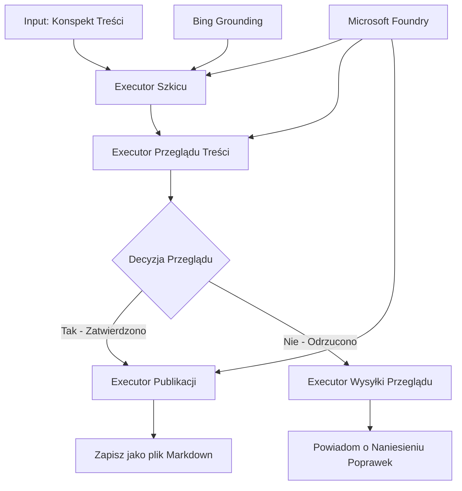

# 🔀 Warunkowe przepływy pracy Agentów z Microsoft Foundry (.NET)

## 📋 Samouczek Inteligentnych Przepływów Pracy Opartych na Decyzjach

Ten notatnik demonstruje **wzorce warunkowych przepływów pracy** z wykorzystaniem Microsoft Foundry i Microsoft Agent Framework dla .NET. Nauczysz się, jak budować zaawansowane, zależne od decyzji przepływy pracy, które inteligentnie kierują przetwarzaniem na podstawie analizy AI, reguł biznesowych i dynamicznych warunków w celu automatyzacji klasy korporacyjnej.

## 🎯 Cele Nauki

### 🧠 **Architektura Inteligentnych Decyzji**
- **Implementacja Logiki Warunkowej**: Budowa złożonych drzew decyzyjnych z wieloma punktami rozgałęzień
- **Routing Napędzany przez AI**: Wykorzystanie modeli Microsoft Foundry do podejmowania inteligentnych decyzji dotyczących trasowania
- **Dynamiczna Adaptacja Przepływu Pracy**: Modyfikacja zachowania przepływu na podstawie analizy w czasie wykonywania i warunków
- **Integracja Reguł Korporacyjnych**: Włączanie logiki biznesowej i wymagań zgodności do przepływów pracy

### 🔀 **Zaawansowane Wzorce Warunkowe**
- **Decyzje Wielokryterialne**: Ocena wielu czynników przy podejmowaniu decyzji o trasowaniu
- **Przetwarzanie świadome kontekstu**: Podejmowanie decyzji na podstawie zgromadzonego kontekstu i historii przepływu pracy
- **Adaptacyjne modyfikacje przepływu pracy**: Dynamiczne dostosowanie ścieżek przetwarzania w oparciu o warunki w czasie rzeczywistym
- **Integracja silnika reguł**: Implementacja zaawansowanych silników reguł biznesowych w przepływach pracy

### 🏢 **Warunkowe Zastosowania Korporacyjne**
- **Klasyfikacja i trasowanie dokumentów**: Automatyczna klasyfikacja i kierowanie dokumentów do odpowiednich przepływów pracy
- **Triage obsługi klientów**: Inteligentne kierowanie zapytań klientów do specjalistycznych zespołów
- **Przetwarzanie zgodności i ryzyka**: Zastosowanie różnych procesów walidacji i przeglądu w oparciu o ocenę ryzyka
- **Przepływy pracy kontroli jakości**: Kierowanie treści przez odpowiednie procesy przeglądu na podstawie metryk jakości

## ⚙️ Wymagania wstępne i konfiguracja

### 📦 **Wymagane pakiety NuGet**

Zaawansowane pakiety do przetwarzania warunkowych przepływów pracy:

```xml
<!-- Core AI Framework -->
<PackageReference Include="Microsoft.Extensions.AI" Version="9.9.0" />

<!-- Azure AI Agents with Persistent State -->
<PackageReference Include="Azure.AI.Agents.Persistent" Version="1.2.0-beta.5" />

<!-- Azure Identity and Utilities -->
<PackageReference Include="Azure.Identity" Version="1.15.0" />
<PackageReference Include="System.Linq.Async" Version="6.0.3" />
<PackageReference Include="DotNetEnv" Version="3.1.1" />

<!-- Local Workflow Framework References -->
<!-- Microsoft.Agents.Workflows.dll - Advanced workflow orchestration -->
<!-- Microsoft.Agents.AI.AzureAI.dll - Microsoft Foundry integration -->
<!-- Microsoft.Agents.AI.dll - Core agent abstractions -->
```

### 🔑 **Konfiguracja Microsoft Foundry**

**Wymagane zasoby Azure:**
- Workspace Microsoft Foundry z modelami przetwarzania warunkowego
- Subskrypcja Azure z odpowiednimi limitami obliczeniowymi i uprawnieniami
- Wdrożone modele AI do podejmowania decyzji i analizy treści
- (Opcjonalnie) połączenie Bing Search API dla funkcji podstawowych

**Konfiguracja środowiska (plik .env):**
```env
# Microsoft Foundry Configuration
AZURE_AI_PROJECT_ENDPOINT=https://your-project.cognitiveservices.azure.com/
BING_CONNECTION_ID=your-bing-connection-id
```

**Ustawienia uwierzytelniania:**
```csharp
// Azure CLI or Managed Identity authentication
using Azure.Identity;
var credential = new AzureCliCredential();

// Load environment configuration
DotNetEnv.Env.Load("../../../.env");
```

### 🏗️ **Architektura Warunkowego Przepływu Pracy**



**Kluczowe komponenty:**
- **Draft Executor**: Agent AI tworzący wstępne szkice z konspektów
- **Content Review Executor**: Agent AI oceniający jakość szkiców i zgodność
- **Conditional Routing**: Logika decyzyjna trasująca na podstawie wyników przeglądu
- **Ścieżki publikacji/przeglądu**: Oddzielne ścieżki przetwarzania dla zatwierdzonej vs odrzuconej treści
- **Zarządzanie stanem**: Utrzymuje kontekst treści i przeglądu przez cały przepływ pracy

## 🎨 **Wzorce projektowe warunkowych przepływów pracy**

### 📋 **Produkcja treści z bramkami jakości**
```
Outline → Draft Creation → Quality Review → {Approve: Publish | Reject: Revise}
```

### 🎯 **Przetwarzanie dokumentów oparte na ryzyku**
```
Document → Risk Assessment → {Low: Standard | High: Enhanced Review}
```

### 🔍 **Inteligentne skierowanie obsługi klienta**
```
Customer Query → Analysis → {Simple: FAQ Bot | Complex: Human Agent}
```

### 💼 **Przepływy pracy sterowane zgodnością**
```
Content → Compliance Check → {Pass: Publish | Fail: Legal Review}
```

## 🏢 **Korzyści warunkowych zastosowań korporacyjnych**

### 🎯 **Inteligentna automatyzacja**
- **Inteligentne podejmowanie decyzji**: Decyzje trasowania napędzane AI na podstawie analizy treści i kontekstu
- **Adaptacyjne przetwarzanie**: Przepływy pracy automatycznie dostosowujące się do zmieniających się warunków
- **Egzekwowanie reguł biznesowych**: Automatyczne stosowanie złożonej logiki biznesowej i polityk
- **Routing świadomy kontekstu**: Decyzje oparte na pełnej historii przepływu i zgromadzonym kontekście

### 📈 **Doskonalenie operacyjne**
- **Optymalizacja alokacji zasobów**: Kierowanie pracy do najbardziej odpowiednich specjalistów i procesów
- **Zmniejszenie interwencji manualnej**: Automatyczne podejmowanie decyzji minimalizuje potrzebę ludzkiego trasowania
- **Szybsze rozwiązywanie**: Bezpośredni routing do odpowiedniej wiedzy i możliwości przetwarzania
- **Spójna aplikacja**: Jednolite zastosowanie reguł biznesowych i kryteriów decyzji

### 🛡️ **Zarządzanie ryzykiem i zgodność**
- **Automatyczna ocena ryzyka**: Ocena poziomu ryzyka treści i sytuacji napędzana AI
- **Egzekwowanie zgodności**: Automatyczne kierowanie przez wymagane procesy regulacyjne
- **Zastosowanie protokołów bezpieczeństwa**: Wzmocnione środki bezpieczeństwa aplikowane według oceny ryzyka
- **Utrzymanie ścieżki audytu**: Kompleksowa dokumentacja decyzji trasowania i uzasadnień

### 📊 **Analizy i ciągłe doskonalenie**
- **Analiza decyzji**: Śledzenie skuteczności i dokładności decyzji trasowania
- **Rozpoznawanie wzorców**: Identyfikowanie trendów i wzorców decyzji trasowania z czasem
- **Optymalizacja wydajności**: Ciągłe ulepszanie kryteriów decyzyjnych i efektywności trasowania
- **Business Intelligence**: Wgląd w charakterystyki treści i wymagania przetwarzania

### 🔧 **Doskonalenie techniczne**
- **Trwałe zarządzanie stanem**: Utrzymanie złożonego stanu podczas realizacji przepływu pracy
- **Skalowalna architektura**: Obsługa wymagań przetwarzania warunkowego o wysokim wolumenie
- **Możliwości integracji**: Bezproblemowa integracja z istniejącymi systemami i procesami biznesowymi
- **Monitorowanie i obserwowalność**: Kompleksowe śledzenie wydajności przepływów pracy i decyzji

Zbudujmy inteligentne, zależne od decyzji przepływy pracy w przedsiębiorstwie z .NET! 🚀

## 💻 Uruchamianie kodu

Pełna implementacja jest dostępna w `04.dotnet-agent-framework-workflow-aifoundry-condition.cs`. Demonstruje ona **przepływ pracy produkcji treści z bramkami jakości**:

### 🏗️ **Architektura przepływu pracy**

```
Content Outline → Draft Creation → Quality Review → Conditional Routing:
                                                      ├─ Approved (>200 words) → Publish
                                                      └─ Rejected (<200 words) → Review Notification
```

**Agenci w przepływie pracy:**
1. **Agent Ewangelista**: Tworzy szkice tutoriali z konspektów z wykorzystaniem grounding Bing
2. **Agent recenzent treści**: Ocena jakości szkicu (liczba słów, kompletność)
3. **Agent wydawniczy**: Zapisuje zatwierdzoną treść jako pliki Markdown z sygnaturą czasową

**Własne wykonawcy:**
1. **DraftExecutor**: Orkiestruje tworzenie szkiców
2. **ContentReviewExecutor**: Przeprowadza ocenę jakości
3. **PublishExecutor**: Obsługuje publikację zatwierdzonej treści
4. **SendReviewExecutor**: Zarządza powiadomieniami o odrzuconej treści

### 🚀 Uruchamianie przykładu

**Wymagania wstępne:**
- Skonfigurowany workspace Microsoft Foundry
- Uwierzytelnianie Azure CLI (`az login`)
- (Opcjonalnie) połączenie Bing Search dla grounding

```bash
# Uczyń skrypt wykonywalnym (Unix/Linux/macOS)
chmod +x 04.dotnet-agent-framework-workflow-aifoundry-condition.cs

# Uruchom warunkowy przepływ pracy
./04.dotnet-agent-framework-workflow-aifoundry-condition.cs
```

Lub na Windows:
```powershell
dotnet run 04.dotnet-agent-framework-workflow-aifoundry-condition.cs
```

### 📝 Oczekiwany wynik

Przepływ pracy wykona:
1. **Utworzy agentów**: Zainicjalizuje trzech wyspecjalizowanych agentów Microsoft Foundry
2. **Wygeneruje szkic**: Agent ewangelista tworzy szkic tutorialu na podstawie konspektu
3. **Przejrzy treść**: Agent recenzent oceni jakość szkicu
4. **Warunkowe trasowanie**:
   - **Jeśli zatwierdzony (>200 słów)**: Wykonawca publikacji zapisuje jako plik Markdown
   - **Jeśli odrzucony (<200 słów)**: Wysyła powiadomienie recenzji
5. **Wyświetli wyniki**: Pokaże końcowy wynik przepływu pracy

### 🔧 Opcje dostosowania

**Modyfikacja kryteriów recenzji:**
```csharp
const string ContentReviewerInstructions = @"
You are a content reviewer...
1. Check if content is more than 500 words (instead of 200)
2. Verify technical accuracy
3. Ensure proper formatting
...";
```

**Dodaj więcej warunkowych ścieżek:**
```csharp
var workflow = new WorkflowBuilder(draftExecutor)
    .AddEdge(draftExecutor, contentReviewerExecutor)
    .AddEdge(contentReviewerExecutor, publishExecutor, condition: GetCondition("Excellent"))
    .AddEdge(contentReviewerExecutor, editExecutor, condition: GetCondition("Good"))
    .AddEdge(contentReviewerExecutor, sendReviewerExecutor, condition: GetCondition("Poor"))
    .Build();
```

**Zmień wymagania dotyczące treści:**
```csharp
string OUTLINE_Content = @"
# Your Custom Topic
## Section 1
https://your-reference-url
## Section 2
...
";
```

### 🎯 Zastosowania w rzeczywistym świecie

Ten wzorzec warunkowego przepływu pracy jest idealny dla:
- **Systemów zarządzania treścią**: Zautomatyzowane przepływy redakcyjne z bramkami jakości
- **Przetwarzania dokumentów**: Kierowanie dokumentów na podstawie klasyfikacji i zgodności
- **Wsparcia klienta**: Inteligentne trasowanie zgłoszeń według złożoności i pilności
- **Przeglądu prawnego**: Kierowanie umów według oceny ryzyka i wartości
- **Procesów HR**: Kierowanie aplikacji przez odpowiednie przepływy selekcji

### 🔍 Zrozumienie logiki warunkowej

**Funkcja warunkowa:**
```csharp
public Func<object?, bool> GetCondition(string expectedResult) =>
    reviewResult => reviewResult is ReviewResult review && review.Result == expectedResult;
```

Ta funkcja tworzy predykat, który:
1. Sprawdza, czy wynik jest typu `ReviewResult`
2. Porównuje właściwość `Result` z oczekiwaną wartością
3. Zwraca true/false do określenia trasowania

**Krawędzie przepływu pracy z warunkami:**
```csharp
.AddEdge(contentReviewerExecutor, publishExecutor, condition: GetCondition("Yes"))
.AddEdge(contentReviewerExecutor, sendReviewerExecutor, condition: GetCondition("No"))
```

### 📊 Zaawansowane funkcje

**Walidacja schematu JSON:**
Przepływ pracy wykorzystuje schematy JSON do zapewnienia uporządkowanych odpowiedzi:

```csharp
// Define response structure
public class ReviewResult
{
    [JsonPropertyName("review_result")]
    public string Result { get; set; } = string.Empty;
    
    [JsonPropertyName("reason")]
    public string Reason { get; set; } = string.Empty;
    
    [JsonPropertyName("draft_content")]
    public string DraftContent { get; set; } = string.Empty;
}

// Apply to agent
ResponseFormat = ChatResponseFormat.ForJsonSchema(
    AIJsonUtilities.CreateJsonSchema(typeof(ReviewResult)), 
    "ReviewResult", 
    "Review Result From DraftContent"
)
```

**Integracja grounding Bing:**
Agent ewangelista używa groundingu Bing, aby uzyskać dostęp do informacji w czasie rzeczywistym:

```csharp
var bingGroundingConfig = new BingGroundingSearchConfiguration(bing_conn_id);
BingGroundingToolDefinition bingGroundingTool = new(
    new BingGroundingSearchToolParameters([bingGroundingConfig])
);
```

Umożliwia to agentowi podążanie za URL-ami w konspekcie i pobieranie aktualnych informacji.

### 🛡️ Obsługa błędów

Przepływ pracy zawiera solidną obsługę błędów dla odrzuconej treści:
- Błędy recenzji wyzwalają alternatywną ścieżkę
- Powiadomienia dostarczają wyraźne powody odrzucenia
- Treść jest zachowywana do poprawy

### 🔄 Rozszerzanie przepływu pracy

**Dodaj pętlę rewizji:**
Stwórz pętlę sprzężenia zwrotnego, która automatycznie przepisywać będzie treść:

```csharp
.AddEdge(contentReviewerExecutor, publishExecutor, condition: GetCondition("Yes"))
.AddEdge(contentReviewerExecutor, draftExecutor, condition: GetCondition("No")) // Loop back
```

**Wdroż wielopoziomowy przegląd:**
Dodaj wiele etapów recenzji z różnymi kryteriami:

```csharp
.AddEdge(draftExecutor, technicalReviewer)
.AddEdge(technicalReviewer, editorialReviewer, condition: GetCondition("TechPass"))
.AddEdge(editorialReviewer, publishExecutor, condition: GetCondition("EditPass"))
```

Ten warunkowy wzorzec przepływu pracy stanowi podstawę do budowy zaawansowanych, inteligentnych systemów automatyzacji korporacyjnej! 🚀

---

<!-- CO-OP TRANSLATOR DISCLAIMER START -->
**Zastrzeżenie**:
Niniejszy dokument został przetłumaczony za pomocą usługi tłumaczenia AI [Co-op Translator](https://github.com/Azure/co-op-translator). Choć dążymy do dokładności, prosimy pamiętać, że automatyczne tłumaczenia mogą zawierać błędy lub niedokładności. Oryginalny dokument w jego języku źródłowym należy uznawać za autorytatywne źródło. W przypadku informacji krytycznych zalecane jest skorzystanie z profesjonalnego tłumaczenia wykonanego przez człowieka. Nie ponosimy odpowiedzialności za jakiekolwiek nieporozumienia lub błędne interpretacje wynikające z użycia tego tłumaczenia.
<!-- CO-OP TRANSLATOR DISCLAIMER END -->