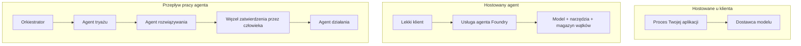
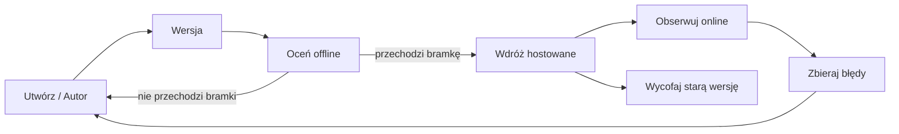
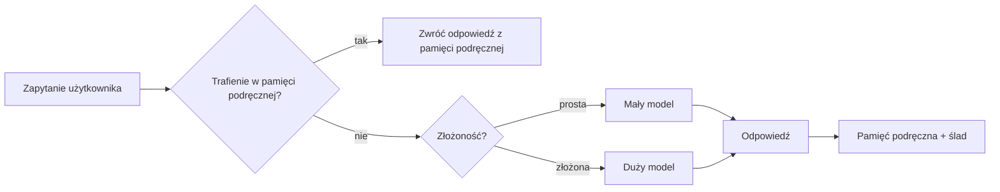
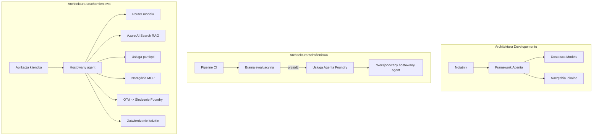

# Wdrażanie Skalowalnych Agentów z Microsoft Foundry


Do tego momentu w kursie budowałeś agentów działających na Twoim laptopie, w notatniku, sterowanych przez `az login` i kilka zmiennych środowiskowych. To dokładnie właściwy sposób, by się uczyć. Nie jest to jednak właściwy sposób, by prowadzić agenta, od którego o 3 w nocy zależą tysiące klientów.

Ta lekcja dotyczy luki pomiędzy "działa na moim komputerze" a "działa, niezawodnie i przystępnie cenowo, w produkcji." Zamykamy tę lukę za pomocą **Microsoft Foundry** i **Microsoft Foundry Agent Service**, budując prawdziwego agenta wsparcia klienta wyposażonego w narzędzia, wyszukiwanie, pamięć, ocenę i monitorowanie.

## Wprowadzenie

Ta lekcja obejmuje:

- Różnicę między **agentem prototypowym** a **agentem wdrożonym** oraz dlaczego przejście to głównie wszystko *dookoła* modelu.
- **Wzorce wdrożenia** agentów: hostowane przez klienta, hostowane jako usługa (Hosted Agents) oraz zorganizowane przez workflow.
- **Cykl życia agenta** w Microsoft Foundry — tworzenie, wersjonowanie, wdrażanie, ocena, obserwacja, wycofanie.
- **Strategie skalowania**: rutowanie modelu, buforowanie, równoczesność i projekt bezstanowy.
- **Obserwowalność** z OpenTelemetry i śledzeniem Foundry.
- **Optymalizacja kosztów** przez wybór modelu, rutowanie i bramki oceny.
- **Uwagi korporacyjne**: zarządzanie, zatwierdzanie przez człowieka i bezpieczne uruchamianie serwerów MCP w produkcji.

## Cele nauki

Po ukończeniu tej lekcji będziesz potrafił:

- Wybrać właściwy wzorzec wdrożenia dla danego obciążenia agenta.
- Wdrożyć agenta do Microsoft Foundry Agent Service, aby był wersjonowany, zarządzany i obserwowalny.
- Wymyślić instrumentację agenta do śledzenia i podłączyć pipeline oceny, uruchamiany przed każdą wersją.
- Zastosować rutowanie modelu i buforowanie, by kontrolować opóźnienia i koszty na dużą skalę.
- Dodać bramkę zatwierdzania przez człowieka dla działań wysokiego ryzyka i zintegrować serwer MCP w sposób bezpieczny dla produkcji.

## Wymagania wstępne

Ta lekcja zakłada, że ukończyłeś poprzednie lekcje i znasz się na:

- Budowaniu agentów z użyciem [Microsoft Agent Framework](../14-microsoft-agent-framework/README.md) (Lekcja 14).
- [Użycie narzędzi](../04-tool-use/README.md) (Lekcja 4) i [Agentic RAG](../05-agentic-rag/README.md) (Lekcja 5).
- [Pamięci agenta](../13-agent-memory/README.md) (Lekcja 13) i [Protokołów agentów / MCP](../11-agentic-protocols/README.md) (Lekcja 11).
- [Obserwowalności i oceny](../10-ai-agents-production/README.md) (Lekcja 10) — ta lekcja buduje bezpośrednio na niej.

Będziesz także potrzebować:

- **Subskrypcję Azure** i **projekt Microsoft Foundry** z przynajmniej jednym wdrożonym modelem czatu.
- Zalogowany CLI Azure (`az login`).
- Python 3.12+ i pakiety z repozytorium [`requirements.txt`](../../../requirements.txt).

## Od prototypu do produkcji: co właściwie się zmienia

Agent prototypowy i produkcyjny dzielą tę samą pętlę główną — rozumowanie, wywoływanie narzędzi, odpowiedź. Zmienia się wszystko otaczające tę pętlę. Model to może około 20% agenta produkcyjnego; pozostałe 80% to szkielet operacyjny.

| Aspekt | Prototyp | Produkcja |
| --- | --- | --- |
| **Hosting** | Działa w Twoim notatniku | Działa jako hostowana usługa, wersjonowana i wdrażana falami |
| **Tożsamość** | Twój token `az login` | Zarządzana tożsamość z wyznaczonym RBAC |
| **Stan** | W pamięci, tracony po restarcie | Zewnętrzny (magazyn wątków, serwis pamięci) |
| **Awaria** | Widoczny stack trace | Ponowienia, zapasowe działania, dead-letter, alerty |
| **Koszt** | "To kilka centów" | Monitorowany na żądanie, kierowany, buforowany, budżetowany |
| **Jakość** | Oceniasz wizualnie wynik | Automatyczna ocena przed każdą wersją |
| **Zaufanie** | Zatwierdzasz każdą akcję | Polityka + człowiek w pętli dla ryzykownych działań |

Pamiętaj o tej tabeli. Każda sekcja poniżej odpowiada jednemu z tych wierszy.

## Wzorce wdrożenia agentów

Są trzy wzorce, które będziesz używać, często w kombinacji.

### 1. Agenci hostowani przez klienta

Obiekt agenta znajduje się wewnątrz *Twojego* procesu aplikacji. Twój kod wywołuje bezpośrednio dostawcę modelu; pętla rozumowania działa w Twojej usłudze. Tak działała każda poprzednia lekcja.

- **Używaj, gdy** potrzebujesz pełnej kontroli nad pętlą, niestandardowego middleware lub osadzasz agenta w istniejącym backendzie.
- **Wady**: sam zarządzasz skalowaniem, stanem i odpornością.

### 2. Agenci hostowani (Foundry Agent Service)

Agent jest *zarejestrowany jako zasób* w Microsoft Foundry. Foundry hostuje pętlę rozumowania, przechowuje wątki, egzekwuje bezpieczeństwo treści i RBAC, oraz udostępnia agenta w portalu Foundry. Twoja aplikacja staje się cienkim klientem, tworzącym wątki i odczytującym odpowiedzi.

- **Używaj, gdy** cenisz trwałość, wbudowaną obserwowalność, zarządzanie i mniejszą powierzchnię operacyjną.
- **Wady**: mniej kontroli niskopoziomowej w zamian za zarządzane środowisko uruchomieniowe.

### 3. Workflow agentów

Wielu agentów (i narzędzi) łączy się w graf z wyraźnym przepływem sterowania — kroki sekwencyjne, rozgałęzienia, zatwierdzenia człowieka i trwałe punkty kontrolne, które mogą pauzować i wznawiać działanie. To funkcjonalność Microsoft Agent Framework **Workflows** zastosowana na skalę wdrożenia.

- **Używaj, gdy** jedno zadanie wymaga kilku specjalistycznych agentów lub kroku zatwierdzania w trakcie.
- **Wady**: więcej elementów ruchomych; potrzebna obserwowalność na poziomie orkiestracji.



## Cykl życia agenta w Microsoft Foundry

Wdrażanie agenta to nie jednorazowe `push`. To pętla, bardzo podobna do cyklu wydawniczego oprogramowania, bo dokładnie taka jest.



Kluczowa idea, znana z [Lekcji 10](../10-ai-agents-production/README.md): **ocena offline to bramka, nie dodatek.** Nowa wersja agenta nie jest wydana, jeśli nie przejdzie Twoich progów oceny. Obserwowalność online przekazuje na bieżąco błędy z realnego świata do zestawu testowego offline. To cała pętla.

## Strategie skalowania

Skalowanie agenta różni się od skalowania stateless API sieciowego, bo każde żądanie może wywołać wiele kosztownych wywołań modelu i narzędzi. Cztery techniki przejmują większość obciążenia.

**Obsługa żądań bezstanowa.** Nie trzymaj stanu per-użytkownik w pamięci procesu. Zanotuj wątki konwersacji w magazynie wątków Foundry lub serwisie pamięci, aby dowolna instancja mogła obsłużyć każde żądanie. To pozwala na skalowanie poziome — dodajesz instancje, brak sesji sticky.

**Rutowanie modeli.** Nie każde żądanie potrzebuje najpotężniejszego (i najdroższego) modelu. Proste żądania — klasyfikacja intencji, krótkie faktyczne odpowiedzi — kieruj do małego, szybkiego modelu, pozostawiając duży model do prawdziwego rozumowania. Foundry posiada **Model Router** do tego celu lub możesz sam wdrożyć lekki klasyfikator. W laboratorium zbudujesz wersję DIY.

**Buforowanie odpowiedzi.** Wiele zapytań wsparcia to niemal duplikaty ("jak zresetować hasło?"). Buforuj odpowiedzi na popularne pytania i serwuj je bez wywoływania modelu. Nawet umiarkowane trafienia w cache znacząco obniżają koszt i opóźnienia.

**Równoczesność i przeciążenia.** Dostawcy modeli mają limity szybkości. Ogranicz liczbę równoczesnych wywołań, używaj ponowień z wykładniczym opóźnieniem i obsługuj błędy łagodnie (odpowiedź w kolejce "pracujemy nad tym" jest lepsza niż 500).



## Obserwowalność w produkcji

Nie możesz zarządzać tym, czego nie widzisz. Jak omówiono w Lekcji 10, Microsoft Agent Framework natywnie generuje śledzenia **OpenTelemetry** — każde wywołanie modelu, narzędzia i krok orkiestracji staje się spanem. W produkcji eksportujesz spany do Microsoft Foundry (lub dowolnego backendu zgodnego z OTel), aby:

- Śledzić pojedynczą reklamację klienta od początku do końca we wszystkich wywołaniach modeli i narzędzi.
- Obserwować opóźnienia p50/p95 i koszt na żądanie w czasie.
- Ostrzegać o skokach błędów i anomaliach kosztów zanim zauważą je użytkownicy (lub dział finansowy).

```python
from agent_framework.observability import get_tracer

tracer = get_tracer()

with tracer.start_as_current_span("support_request") as span:
    span.set_attribute("customer.tier", "enterprise")
    span.set_attribute("routed.model", "gpt-4.1-mini")
    # wykonywanie agenta jest automatycznie śledzone wewnątrz tego zakresu
```

Atrybuty takie jak `customer.tier` i `routed.model` zmieniają gąszcz śledzeń w zadające pytania ("czy klienci korporacyjni są zbyt często kierowani do małego modelu?").

## Optymalizacja kosztów

Koszty agenta produkcyjnego dominują tokeny. Trzy dźwignie, w kolejności wpływu:

1. **Dopasuj model odpowiednio do potrzeb.** Mały model, który przejdzie Twoją bramkę oceny, jest niemal zawsze tańszy od dużego, który też ją przejdzie. Używaj oceny, by *udowodnić*, że mały model jest wystarczający zamiast domyślnie wybierać największy z obawy.
2. **Rutuj według złożoności.** Jak wyżej — płać ceny dużego modelu tylko za żądania wymagające rozumowania dużym modelem.
3. **Buforuj agresywnie.** Najtańsze wywołanie modelu to takie, którego nie wykonujesz.

Bramki oceny i kontrola kosztów to ta sama dyscyplina widziana z dwóch stron: ocena mówi Ci o *podstawowym poziomie jakości*, rutowanie i buforowanie utrzymują koszty *blisko poziomu*.

## Uwagi dotyczące wdrożeń korporacyjnych

**Zarządzanie.** Hosted Agents dziedziczą RBAC, bezpieczeństwo treści i audyt Foundry. Przydziel każdemu agentowi zarządzaną tożsamość z minimalnym potrzebnym uprawnieniem — tylko do odczytu bazy wiedzy, dostęp do API obsługi zgłoszeń z ograniczonym zakresem, nic więcej.

**Człowiek w pętli.** Niektóre akcje są zbyt poważne, by automatyzować je całkowicie — zwrot pieniędzy, usunięcie konta, eskalacja do działu prawnego. Microsoft Agent Framework obsługuje narzędzia wymagające zatwierdzenia: agent proponuje akcję, wykonanie pauzuje się, człowiek zatwierdza lub odrzuca, workflow wznawia się. Widziałeś to w podstawach w [Lekcji 6](../06-building-trustworthy-agents/README.md); tutaj wdrażasz.

**MCP w produkcji.** [MCP](../11-agentic-protocols/README.md) pozwala agentowi korzystać z zewnętrznych narzędzi przez standardowy interfejs. W produkcji traktuj każdy serwer MCP jako niezastrzeżoną granicę: przypnij wersję serwera, uruchamiaj z ograniczoną tożsamością, waliduj jego odpowiedzi i nigdy nie ujawniaj mu sekretów. Serwer MCP to zależność, a zależności się łatkuje, audytuje i ogranicza.



Te trzy diagramy — development, deployment, runtime — to ten sam agent na trzech etapach życia. Laboratorium, które następuje, przeprowadzi Cię przez jego budowę.

## Laboratorium praktyczne: Agent wsparcia klienta gotowy do produkcji

Otwórz [`code_samples/16-python-agent-framework.ipynb`](./code_samples/16-python-agent-framework.ipynb) i przepracuj go od początku do końca. Złożysz **agenta wsparcia klienta Contoso** ze wszystkimi uwzględnionymi aspektami produkcyjnymi:

1. **Wywoływanie narzędzi** — sprawdzanie statusu zamówienia i otwieranie zgłoszeń wsparcia.
2. **RAG** — odpowiadanie na pytania o politykę z bazy wiedzy (Azure AI Search, z pamięcią podręczną w pamięci, aby notatnik działał bez usługi Search).
3. **Pamięć** — zapamiętywanie klienta na przestrzeni wymian rozmowy.
4. **Rutowanie modeli** — klasyfikator złożoności kieruje każde żądanie do małego lub dużego modelu.
5. **Buforowanie odpowiedzi** — powtarzające się pytania są serwowane z pamięci podręcznej.
6. **Zatwierdzenie człowieka** — zwroty powyżej progu są pauzowane do zatwierdzenia.
7. **Pipeline oceny** — mały zestaw testów offline ocenia agenta i działa jako bramka wydania.
8. **Obserwowalność** — śledzenie OpenTelemetry wokół każdego żądania.

### Przejście krok po kroku

Notatnik jest zorganizowany tak, aby każdy aspekt produkcyjny był samodzielną, uruchamianą sekcją. Sercem jest handler żądań z kombinacją rutowania i buforowania:

```python
async def handle_support_request(query: str, customer_id: str) -> str:
    # 1. Serwuj z pamięci podręcznej, kiedy to możliwe.
    cached = response_cache.get(normalize(query))
    if cached:
        return cached

    # 2. Kieruj według złożoności, aby kontrolować koszt.
    model = "gpt-4.1-mini" if is_simple(query) else "gpt-4.1"

    # 3. Uruchom agenta wewnątrz zakresu śledzenia dla obserwowalności.
    with tracer.start_as_current_span("support_request") as span:
        span.set_attribute("routed.model", model)
        span.set_attribute("customer.id", customer_id)
        response = await support_agent.run(query, model=model)

    # 4. Buforuj i zwracaj.
    response_cache.set(normalize(query), response.text)
    return response.text
```

Bramkę oceny, która chroni wydanie, zobaczysz tu:

```python
async def evaluation_gate(agent, test_cases, threshold: float = 0.8) -> bool:
    passed = 0
    for case in test_cases:
        result = await agent.run(case["input"])
        if score_response(result.text, case["expected"]) >= 0.8:
            passed += 1
    pass_rate = passed / len(test_cases)
    print(f"Evaluation pass rate: {pass_rate:.0%} (gate: {threshold:.0%})")
    return pass_rate >= threshold  # wdrażaj tylko jeśli brama przejdzie
```

Przeczytaj każdą linię — notatnik celowo trzyma prymitywy małe, by nic nie było ukryte za wywołaniem frameworka.

## Walidacja wdrożonego agenta testami dymnymi

Powyższa bramka oceny działa *offline* na obiekcie agenta. Po wdrożeniu agenta jako Hosted Agent potrzebujesz jeszcze jednej, jeszcze tańszej weryfikacji: **czy wdrożony endpoint faktycznie odpowiada?**

Udane wdrożenie dowodzi tylko, że płaszczyzna kontrolna zaakceptowała definicję — nie dowodzi, że agent odpowiada. Brakująca zależność, złe rutowanie modelu lub wygasłe połączenie mogą zostawić zielone wdrożenie, które nic nie zwraca. **Test dymny** wykryje to w kilka sekund, przy każdym wdrożeniu, bez kosztów pełnej oceny.

To repozytorium zawiera gotową do użycia pipeline testów dymnych zbudowaną na podstawie akcji GitHub [AI Smoke Test](https://github.com/marketplace/actions/ai-smoke-test):

- **Katalog** — [`tests/lesson-16-smoke-tests.json`](../../../tests/lesson-16-smoke-tests.json) zawiera prompt i asercje dla agenta wsparcia Contoso (odpowiedzi polityczne oparte na wiedzy, sprawdzanie zamówień, utrzymanie tematu i ciągłość w wątkach wieloetapowych). Katalogi dla agentów innych lekcji znajdują się obok — zobacz [`tests/README.md`](../tests/README.md).
- **Workflow** — [`.github/workflows/smoke-test.yml`](../../../.github/workflows/smoke-test.yml) loguje się za pomocą Azure OIDC i wysyła każde pytanie do endpointu odpowiedzi agenta, przerywając zadanie przy każdej asercji niepowodzenia.

```yaml
- name: Smoke-test hosted agent
  uses: JFolberth/ai-smoketest@v1
  with:
    project_endpoint: ${{ inputs.project_endpoint }}
    agent_name: ContosoSupportAgent
    tests_file: tests/lesson-16-smoke-tests.json
```


Uruchom to z zakładki **Actions** po wdrożeniu agenta, podając punkt końcowy projektu Foundry oraz nazwę agenta. Tożsamość federacyjna potrzebuje roli **Azure AI User** w zakresie projektu Foundry. Pomyśl o warstwach jak o piramidzie: testy dymne (czy dostępny i odpowiada?) uruchamiane przy każdym wdrożeniu, ocena offline (czy wystarczająco dobra do wypuszczenia?) uruchamiana przed promocją, oraz ocena online (jak radzi sobie w praktyce?) wykonywana ciągle.

## Sprawdzenie wiedzy

Przetestuj swoje rozumienie przed przystąpieniem do zadania.

**1. Około jaką część produkcyjnego agenta stanowi „model”, a co to jest reszta?**

<details>
<summary>Odpowiedź</summary>

Model stanowi mniejszość systemu — często podaje się około 20%. Reszta to szkielet operacyjny: hosting i wersjonowanie, tożsamość i RBAC, zewnętrzny stan, obsługa błędów, śledzenie kosztów, ocena i kontrola z udziałem człowieka. Przejście do produkcji polega głównie na zbudowaniu wszystkiego *wokół* pętli rozumowania.
</details>

**2. Kiedy wybrałbyś Hosted Agent zamiast agenta działającego na kliencie?**

<details>
<summary>Odpowiedź</summary>

Gdy chcesz zarządzane środowisko uruchomieniowe z wbudowaną trwałością (wątki, które przetrwają i mogą wznowić działanie), obserwowalnością, bezpieczeństwem treści oraz RBAC, i jesteś gotów wymienić pewną kontrolę niskopoziomową nad pętlą rozumowania na mniejszą powierzchnię operacyjną. Agent na kliencie jest wskazany, gdy potrzebujesz pełnej kontroli nad pętlą lub wbudowujesz agenta we własny backend.
</details>

**3. Dlaczego skalowalny agent musi być bezstanowy w pamięci własnego procesu?**

<details>
<summary>Odpowiedź</summary>

Aby dowolna instancja mogła obsłużyć dowolne żądanie, co umożliwia poziome skalowanie bez przywiązanych sesji. Stan rozmowy per użytkownik jest zewnętrzny w sklepie wątków lub usłudze pamięci. Gdyby stan był w pamięci procesu, straciłbyś go po restarcie i nie mógłbyś swobodnie rozkładać obciążenia.
</details>

**4. Jaki problem rozwiązuje kierowanie (routing) modeli i jak się to wiąże z oceną?**

<details>
<summary>Odpowiedź</summary>

Kierowanie wysyła proste zapytania do małego, taniego, szybkiego modelu i zarezerwuje duży model do faktycznego rozumowania, kontrolując zarówno opóźnienia, jak i koszty. Wiąże się to z oceną, ponieważ ocena *dowodzi*, że mały model jest wystarczająco dobry dla określonej klasy zapytań — kierowanie bez oceny to zgadywanie.
</details>

**5. Co to jest „brama oceny” i gdzie się znajduje w cyklu życia?**

<details>
<summary>Odpowiedź</summary>

Brama oceny uruchamia zestaw testów offline dla nowej wersji agenta i blokuje wdrożenie, jeśli wskaźnik zaliczeń nie przekracza progu. Znajduje się pomiędzy „wersją” a „wdrożeniem” w cyklu życia, czyniąc jakość warunkiem wcześniejszym wydania zamiast czymś, co sprawdzasz po wypuszczeniu.
</details>

**6. Dlaczego serwer MCP powinien być traktowany jako niezastrzeżona granica w produkcji?**

<details>
<summary>Odpowiedź</summary>

Bo jest to zewnętrzne zależność, do której agent się odwołuje. Powinieneś przypiąć jego wersję, uruchamiać go z ograniczoną tożsamością, weryfikować jego wyniki, limitować szybkość i nigdy nie udostępniać mu sekretów — tak samo jak wobec każdej zależności zewnętrznej. Jego wyniki wnikają do rozumowania agenta, więc nieweryfikowane zaufanie to ryzyko bezpieczeństwa.
</details>

**7. Jaka pojedyncza zmiana zwykle ma największy wpływ na koszt agenta produkcyjnego i dlaczego?**

<details>
<summary>Odpowiedź</summary>

Odpowiednie dopasowanie rozmiaru modelu — użycie najmniejszego modelu, który nadal przechodzi Twoją bramę oceny. Koszty dominują tokeny, a mniejszy model spełniający standard jakości jest prawie zawsze tańszy niż większy. Buforowanie i kierowanie dodatkowo obniżają koszty, ale wybór właściwego modelu bazowego ma największy efekt pierwszego rzędu.
</details>

**8. Jaką rolę pełnią atrybuty spanu takie jak `customer.tier` i `routed.model` w obserwowalności?**

<details>
<summary>Odpowiedź</summary>

Zamieniają surowe ślady w pytania biznesowe, na które można odpowiedzieć. Bez atrybutów masz ścianę spanu; z nimi możesz zapytać „czy klienci enterprise są zbyt często kierowani do małego modelu?” lub „który model obsługuje nasze najwolniejsze zapytania?”. Atrybuty pozwalają segmentować telemetrię według wymiarów ważnych dla Twojej operacji.
</details>

## Zadanie

Weź agenta wsparcia klienta z laboratorium i zabezpiecz go dla konkretnego scenariusza: **agenta wsparcia rozliczeń subskrypcji dla firmy SaaS.**

Twoje zgłoszenie powinno:

1. **Zamienić narzędzia** na te związane z rozliczeniami: `get_subscription_status`, `get_invoice` oraz `issue_credit` (kredyty powyżej 50 dolarów wymagają zatwierdzenia przez człowieka).
2. **Dodać trzy dokumenty RAG** obejmujące politykę zwrotu firmy, cykl rozliczeniowy oraz politykę anulowania.
3. **Rozszerzyć zestaw oceny** do co najmniej ośmiu przypadków, w tym co najmniej dwa, które *powinny* uruchomić ścieżkę zatwierdzania przez człowieka, i potwierdzić prawidłowe przejście lub nieprzejście bramy oceny.
4. **Dodać jeden raport kosztów**: po wykonaniu dziesięciu mieszanych zapytań przez agenta wydrukuj ile trafiało do małego modelu, ile do dużego, a ile było obsłużone z pamięci podręcznej.

Napisz krótki akapit (w komórce markdown) wyjaśniający, którą regułę kierowania modelem wybrałeś i jak potwierdziłbyś ją rzeczywistym ruchem. Nie ma jednej poprawnej odpowiedzi — oceniane jest, czy punkty produkcyjne są spójnie powiązane.

## Podsumowanie

W tej lekcji przeniosłeś agenta z prototypu do produkcji z Microsoft Foundry:

- Skok do produkcji to głównie **szkielet operacyjny** wokół modelu — hosting, tożsamość, stan, obsługa błędów, koszty, jakość i zaufanie.
- Poznałeś trzy **wzorce wdrożeniowe** — client-hosted, Hosted Agents i Agent Workflows — oraz kiedy stosować który.
- Przeszedłeś przez **cykl życia agenta**, gdzie ocena offline **działa jako brama wydania**, a obserwowalność online zasila zestaw testów błędami.
- Zastosowałeś **strategie skalowania** — projekt bezstanowy, kierowanie modelem, buforowanie i ograniczona współbieżność — i połączyłeś je z **optymalizacją kosztów**.
- Włączyłeś **kontrole korporacyjne**: RBAC, zatwierdzenie przez człowieka oraz integrację MCP bezpieczną dla produkcji.
- Zbudowałeś **agenta wsparcia klienta gotowego do produkcji**, który łączy wszystkie te kwestie w działający kod.

Następna lekcja zaprowadzi cię w przeciwną stronę: zamiast skalowania agentów w chmurze, sprowadzisz ich *w dół* na pojedynczą maszynę deweloperską i uruchomisz całkowicie lokalnie.

## Dodatkowe zasoby

- <a href="https://learn.microsoft.com/azure/ai-foundry/what-is-azure-ai-foundry" target="_blank">Dokumentacja Microsoft Foundry</a>
- <a href="https://learn.microsoft.com/azure/ai-foundry/agents/overview" target="_blank">Przegląd usługi Microsoft Foundry Agent Service</a>
- <a href="https://aka.ms/ai-agents-beginners/agent-framework" target="_blank">Microsoft Agent Framework</a>
- <a href="https://learn.microsoft.com/azure/ai-foundry/concepts/model-router" target="_blank">Model Router w Microsoft Foundry</a>
- <a href="https://learn.microsoft.com/azure/search/search-what-is-azure-search" target="_blank">Azure AI Search</a>
- <a href="https://opentelemetry.io/" target="_blank">OpenTelemetry</a>
- <a href="https://github.com/marketplace/actions/ai-smoke-test" target="_blank">AI Smoke Test GitHub Action</a>
- <a href="https://modelcontextprotocol.io/" target="_blank">Model Context Protocol (MCP)</a>

## Poprzednia lekcja

[Budowanie agentów do użytku komputerowego (CUA)](../15-browser-use/README.md)

## Następna lekcja

[Tworzenie lokalnych agentów AI](../17-creating-local-ai-agents/README.md)

---

<!-- CO-OP TRANSLATOR DISCLAIMER START -->
**Zastrzeżenie**:
Niniejszy dokument został przetłumaczony za pomocą usługi tłumaczenia AI [Co-op Translator](https://github.com/Azure/co-op-translator). Choć dążymy do dokładności, prosimy pamiętać, że automatyczne tłumaczenia mogą zawierać błędy lub niedokładności. Oryginalny dokument w jego języku źródłowym należy uznawać za autorytatywne źródło. W przypadku informacji krytycznych zalecane jest skorzystanie z profesjonalnego tłumaczenia wykonanego przez człowieka. Nie ponosimy odpowiedzialności za jakiekolwiek nieporozumienia lub błędne interpretacje wynikające z użycia tego tłumaczenia.
<!-- CO-OP TRANSLATOR DISCLAIMER END -->