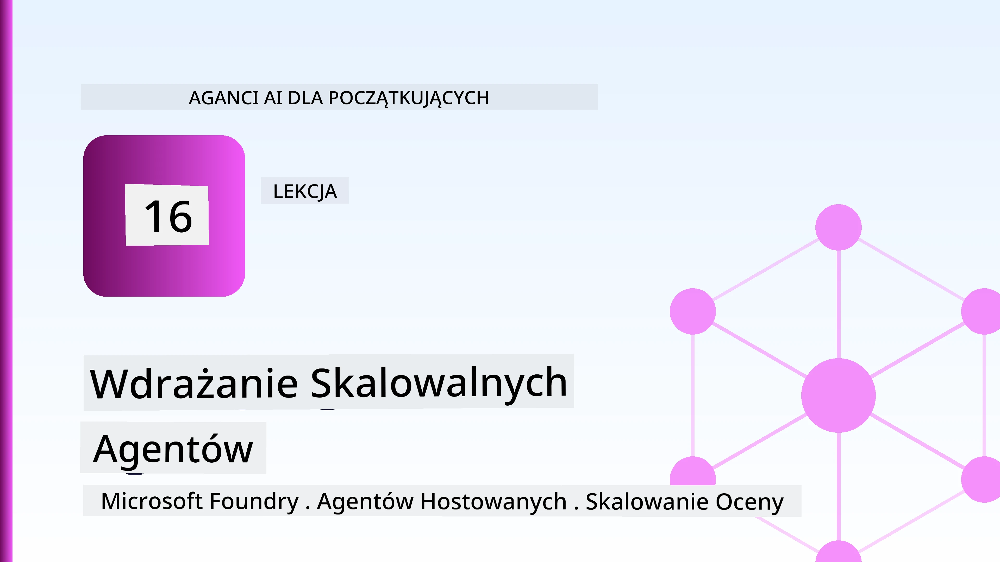
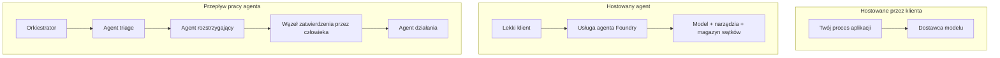
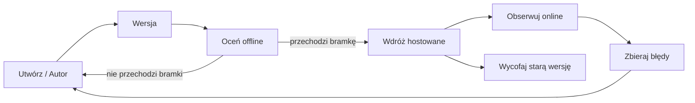
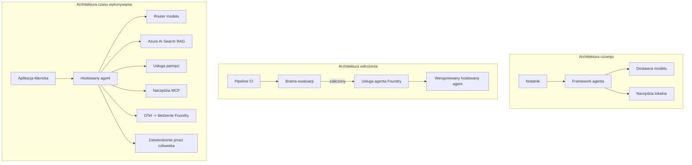

# Wdrażanie skalowalnych agentów z Microsoft Foundry



Do tego momentu w kursie tworzyłeś agentów działających na twoim laptopie, wewnątrz notatnika, uruchamianych przez `az login` i garść zmiennych środowiskowych. To dokładnie właściwy sposób na naukę. To nie jest właściwy sposób na uruchomienie agenta, od którego zależy tysiące klientów o 3 nad ranem.

Ta lekcja dotyczy luki między "działa na mojej maszynie" a "działa niezawodnie i ekonomicznie w produkcji". Zamykamy tę lukę używając **Microsoft Foundry** i **Microsoft Foundry Agent Service**, tworząc rzeczywistego agenta obsługi klienta, który ma narzędzia, wyszukiwanie, pamięć, ocenę i monitorowanie.

## Wprowadzenie

Ta lekcja obejmie:

- Różnicę między **agentem prototypowym** a **agentem wdrożonym** oraz dlaczego przejście dotyczy głównie wszystkiego *wokół* modelu.
- **Wzorce wdrożeń** agentów: obsługujący klient, usługa hostowana (Hosted Agents) oraz skoordynowane przepływy pracy.
- **Cykl życia agenta** w Microsoft Foundry — tworzenie, wersjonowanie, wdrażanie, ocena, obserwacja, wycofanie.
- **Strategie skalowania**: trasowanie modeli, cache’owanie, współbieżność oraz projektowanie bezstanowe.
- **Obserwowalność** z OpenTelemetry i śledzeniem Foundry.
- **Optymalizacja kosztów** przez wybór modelu, trasowanie i bramki ewaluacyjne.
- **Aspekty przedsiębiorcze**: zarządzanie, zatwierdzenia ludzkie oraz bezpieczne uruchamianie serwerów MCP w produkcji.

## Cele nauki

Po ukończeniu tej lekcji będziesz potrafił:

- Wybrać właściwy wzorzec wdrożenia dla danego obciążenia agenta.
- Wdrożyć agenta do Microsoft Foundry Agent Service tak, aby był wersjonowany, zarządzany i obserwowalny.
- Zaopatrzyć agenta w śledzenie i przygotować potok ewaluacji uruchamiany przed każdą wersją.
- Zastosować trasowanie modeli i cache’owanie, aby utrzymać opóźnienia i koszty pod kontrolą w skali.
- Dodać bramkę zatwierdzania ludzkiego dla działań wysokiego ryzyka oraz zintegrować serwer MCP w sposób bezpieczny w produkcji.

## Wymagania wstępne

Ta lekcja zakłada, że ukończyłeś wcześniejsze lekcje i czujesz się komfortowo z:

- Tworzeniem agentów z użyciem [Microsoft Agent Framework](../14-microsoft-agent-framework/README.md) (Lekcja 14).
- [Użyciem narzędzi](../04-tool-use/README.md) (Lekcja 4) i [Agentic RAG](../05-agentic-rag/README.md) (Lekcja 5).
- [Pamięcią agenta](../13-agent-memory/README.md) (Lekcja 13) oraz [Agentic Protocols / MCP](../11-agentic-protocols/README.md) (Lekcja 11).
- [Obserwowalnością i ewaluacją](../10-ai-agents-production/README.md) (Lekcja 10) — ta lekcja jest bezpośrednim rozwinięciem.

Będziesz również potrzebować:

- Subskrypcji **Azure** i projektu **Microsoft Foundry** z co najmniej jednym wdrożonym modelem czatu.
- Zalogowanego **Azure CLI** (`az login`).
- Pythona 3.12+ oraz pakietów z repozytorium [`requirements.txt`](../../../requirements.txt).

## Od prototypu do produkcji: co naprawdę się zmienia

Agent prototypowy i produkcyjny mają tę samą podstawową pętlę — rozumowanie, wywołanie narzędzi, odpowiedź. Zmienia się wszystko wokół tej pętli. Model to około 20% produkcyjnego agenta; pozostałe 80% to szkielet operacyjny.

| Aspekt | Prototyp | Produkcja |
| --- | --- | --- |
| **Hostowanie** | Działa w twoim notatniku | Działa jako usługa hostowana, wersjonowana i wdrażana |
| **Tożsamość** | Twój token `az login` | Zarządzana tożsamość z RBAC o ograniczonym zasięgu |
| **Stan** | Pamięć wewnętrzna, tracony po restarcie | Zewnętrzny (magazyn wątków, serwis pamięci) |
| **Awaria** | Widoczny traceback | Ponowienia, odzyskiwanie, dead-letter, alerty |
| **Koszt** | "To kilka centów" | Śledzony na żądanie, trasowany, cache’owany, budżetowany |
| **Jakość** | Oceniasz wzrokowo rezultat | Automatyczna ocena przed każdą wersją |
| **Zaufanie** | Zatwierdzasz każde działanie | Polityka + człowiek w pętli dla ryzykownych działań |

Zapamiętaj tę tabelę. Każda sekcja poniżej odpowiada jednemu z tych wierszy.

## Wzorce wdrożeń agenta

Istnieją trzy wzorce, których będziesz używać, często w kombinacji.

### 1. Agenci hostowani po stronie klienta

Obiekt agenta żyje wewnątrz *twojego* procesu aplikacji. Twój kod wywołuje dostawcę modelu bezpośrednio; pętla rozumowania działa w twojej usłudze. Tak robiliśmy to we wszystkich poprzednich lekcjach.

- **Używaj, gdy** potrzebujesz pełnej kontroli nad pętlą, własnego middleware lub osadzasz agenta wewnątrz istniejącego backendu.
- **Trade-off**: sam zarządzasz skalowaniem, stanem i odpornością.

### 2. Hostowani Agenci (Foundry Agent Service)

Agent jest *zarejestrowany jako zasób* w Microsoft Foundry. Foundry hostuje pętlę rozumowania, przechowuje wątki, wymusza bezpieczeństwo treści i RBAC, a także udostępnia agenta w portalu Foundry. Twoja aplikacja staje się cienkim klientem, który tworzy wątki i odczytuje odpowiedzi.

- **Używaj, gdy** chcesz trwałości, wbudowanej obserwowalności, zarządzania i mniejszej powierzchni operacyjnej.
- **Trade-off**: mniej kontroli niskiego poziomu w zamian za zarządzane środowisko uruchomieniowe.

### 3. Przepływy pracy agentów

Wiele agentów (i narzędzi) jest komponowanych w graf z explicytnym przepływem sterowania — kolejne kroki, rozgałęzienia, zatwierdzenia ludzkie i trwałe punkty kontrolne, które mogą się zatrzymać i wznowić. To jest funkcja **Workflows** Microsoft Agent Framework zastosowana na skalę wdrożenia.

- **Używaj, gdy** jedno zadanie obejmuje kilku wyspecjalizowanych agentów lub wymaga kroków zatwierdzających po drodze.
- **Trade-off**: więcej ruchomych części; potrzeba obserwowalności na poziomie orkiestracji.



## Cykl życia agenta na Microsoft Foundry

Wdrażanie agenta to nie jednorazowy `push`. To pętla i bardzo przypomina cykl wydawniczy oprogramowania, ponieważ dokładnie taki jest.



Kluczowa idea, przejęta z [Lekcji 10](../10-ai-agents-production/README.md): **ewaluacja offline jest bramką, a nie pomyłką z tyłu głowy.** Nowa wersja agenta nie jest wydana, chyba że spełni twoje progi ewaluacji. Online obserwowalność przepuszcza rzeczywiste błędy z powrotem do zestawu testowego offline. To jest cała pętla.

## Strategie skalowania

Skalowanie agenta różni się od skalowania bezstanowego API webowego, ponieważ każde żądanie może wywołać wiele kosztownych wywołań modeli i narzędzi. Cztery techniki dźwigają większość obciążenia.

**Obsługa bezstanowych żądań.** Nie przechowuj żadnego stanu użytkownika w pamięci procesu. Przechowuj wątki rozmów w magazynie wątków Foundry lub w serwisie pamięci, tak aby każda instancja mogła obsłużyć każde żądanie. To pozwala skalować horyzontalnie — dodajesz instancje, bez sesji przyklejonych.

**Trasowanie modelu.** Nie każde żądanie wymaga najbardziej zaawansowanego (i najdroższego) modelu. Kieruj proste żądania — klasyfikację intencji, krótkie odpowiedzi faktograficzne — do małego, szybkiego modelu, a duży zostaw na prawdziwe rozumowanie. Foundry ma **Model Router** do tego, lub możesz sam zaimplementować lekki klasyfikator. W laboratorium zbudujesz wersję DIY.

**Cache’owanie odpowiedzi.** Wiele zapytań wsparcia to niemal duplikaty ("jak zresetować hasło?"). Pamiętaj odpowiedzi na najczęstsze pytania i serwuj je bez wywoływania modelu wcale. Nawet umiarkowany współczynnik trafień cache znacząco redukuje koszt i opóźnienie.

**Współbieżność i backpressure.** Dostawcy modeli mają limity szybkości. Ograniczaj współbieżność, stosuj ponowienia z wykładniczym opóźnieniem i łagodnie obsługuj błędy (kolejkowana odpowiedź "pracujemy nad tym" jest lepsza niż błąd 500).


## Obserwowalność w produkcji

Nie możesz zarządzać tym, czego nie widzisz. Jak omówiono w Lekcji 10, Microsoft Agent Framework natywnie emituje ślady **OpenTelemetry** — każde wywołanie modelu, narzędzia i krok orkiestracji stają się segmentem. W produkcji eksportujesz te segmenty do Microsoft Foundry (lub dowolnego backendu kompatybilnego z OTel), aby móc:

- Śledzić pojedynczą skargę klienta od początku do końca przez każde wywołanie modelu i narzędzia.
- Obserwować p50/p95 latencje i koszty na żądanie w czasie.
- Alarmować o wzrostach błędów i anomaliach kosztów nim zauważą to użytkownicy (lub dział finansowy).

```python
from agent_framework.observability import get_tracer

tracer = get_tracer()

with tracer.start_as_current_span("support_request") as span:
    span.set_attribute("customer.tier", "enterprise")
    span.set_attribute("routed.model", "gpt-5-nano")
    # wykonanie agenta jest automatycznie śledzone w tym zakresie
```

Atrybuty takie jak `customer.tier` i `routed.model` zamieniają ścianę śladów w pytania z odpowiedziami ("czy klienci korporacyjni zbyt często są kierowani do małego modelu?").

## Optymalizacja kosztów

Koszty w agentach produkcyjnych dominują tokeny. Trzy dźwignie, według wpływu:

1. **Dobierz model odpowiednio do rozmiaru.** Mały model, który przechodzi bramkę ewaluacji, jest niemal zawsze tańszy niż duży, który również przechodzi. Używaj oceny do *udowodnienia*, że mały model jest wystarczający, zamiast domyślnie wybierać największy z ostrożności.
2. **Trasuj według złożoności.** Jak wyżej — płać ceny dużego modelu tylko za żądania wymagające rozumowania dużym modelem.
3. **Cache’uj agresywnie.** Najtańsze wywołanie modelu to takie, którego nigdy nie wykonujesz.

Bramki ewaluacji i kontrola kosztów to ta sama dyscyplina oglądana z dwóch stron: ewaluacja mówi ci o *podstawie jakości*, trasowanie i cache’owanie trzymają cię możliwie blisko *kosztu* tej podstawy.

## Aspekty wdrożenia w przedsiębiorstwie

**Zarządzanie.** Hosted Agents dziedziczą RBAC Foundry, bezpieczeństwo treści i logowanie audytu. Przydziel każdemu agentowi zarządzaną tożsamość z najmniejszym potrzebnym uprawnieniem — dostęp tylko do odczytu bazy wiedzy, ograniczony dostęp do API ticketów, nic więcej.

**Człowiek w pętli.** Niektóre działania są zbyt poważne, by je automatyzować całkowicie — zwrot pieniędzy, usunięcie konta, eskalacja do zespołu prawnego. Microsoft Agent Framework wspiera narzędzia wymagające zatwierdzenia: agent proponuje działanie, wykonywanie zatrzymuje się, człowiek zatwierdza lub odrzuca, a przepływ wznowiony. Widziałeś tę prymitywę w [Lekcji 6](../06-building-trustworthy-agents/README.md); tutaj ją wdrażasz.

**MCP w produkcji.** [MCP](../11-agentic-protocols/README.md) pozwala agentowi korzystać z zewnętrznych narzędzi przez standardowy interfejs. W produkcji traktuj każdy serwer MCP jako granicę nieufną: ustal wersję serwera, uruchom z ograniczoną tożsamością, weryfikuj wyjścia i nigdy nie udostępniaj mu sekretów. Serwer MCP to zależność, a zależności są patchowane, audytowane i limitowane.



Te trzy diagramy — rozwój, wdrożenie, czas działania — pokazują tego samego agenta na trzech etapach życia. Następne laboratorium poprowadzi cię przez budowę.

## Laboratorium praktyczne: Agent wsparcia klienta gotowy do produkcji

Otwórz [`code_samples/16-python-agent-framework.ipynb`](./code_samples/16-python-agent-framework.ipynb) i przejdź przez niego od początku do końca. Stworzysz **agenta wsparcia klienta Contoso** z wszelkimi elementami produkcyjnymi:

1. **Wywoływanie narzędzi** — sprawdzanie statusu zamówienia i otwieranie zgłoszeń wsparcia.
2. **RAG** — odpowiadanie na pytania dotyczące polityki z bazy wiedzy (Azure AI Search z pamięcią podręczną w pamięci, by notatnik działał bez zasobu Search).
3. **Pamięć** — pamiętanie klienta przez kolejne tury rozmowy.
4. **Trasowanie modelu** — klasyfikator złożoności kieruje każde żądanie do małego lub dużego modelu.
5. **Cache’owanie odpowiedzi** — powtarzające się pytania serwowane z cache.
6. **Zatwierdzanie ludzkie** — zwroty powyżej progu czekają na podpisanie przez człowieka.
7. **Potok ewaluacji** — mały zestaw testowy offline ocenia agenta i działa jako bramka wydania.
8. **Obserwowalność** — śledzenie OpenTelemetry wokół każdego żądania.

### Przegląd

Notatnik jest zorganizowany tak, że każda kwestia produkcyjna to samodzielna, wykonalna sekcja. Sercem jest obsługa żądań łącząca trasowanie i cache’owanie:

```python
async def handle_support_request(query: str, customer_id: str) -> str:
    # 1. Serwuj z pamięci podręcznej, gdy to możliwe.
    cached = response_cache.get(normalize(query))
    if cached:
        return cached

    # 2. Kieruj według złożoności, aby kontrolować koszty.
    model = "gpt-5-nano" if is_simple(query) else "gpt-5-mini"

    # 3. Uruchom agenta wewnątrz zakresu śledzenia dla obserwowalności.
    with tracer.start_as_current_span("support_request") as span:
        span.set_attribute("routed.model", model)
        span.set_attribute("customer.id", customer_id)
        response = await support_agent.run(query, model=model)

    # 4. Buforuj i zwracaj.
    response_cache.set(normalize(query), response.text)
    return response.text
```

Bramka ewaluacji strzegąca wydania wygląda tak:

```python
async def evaluation_gate(agent, test_cases, threshold: float = 0.8) -> bool:
    passed = 0
    for case in test_cases:
        result = await agent.run(case["input"])
        if score_response(result.text, case["expected"]) >= 0.8:
            passed += 1
    pass_rate = passed / len(test_cases)
    print(f"Evaluation pass rate: {pass_rate:.0%} (gate: {threshold:.0%})")
    return pass_rate >= threshold  # wdrażaj tylko, jeśli brama zostanie zaliczona
```

Przeczytaj każdy wiersz — notatnik celowo utrzymuje prymitywy małe, by nic nie było ukryte za wywołaniem frameworka.

## Walidacja wdrożonego agenta testami dymnymi

Bramka ewaluacji powyżej działa *offline* przeciwko twojemu obiektowi agenta. Po wdrożeniu jako Hosted Agent potrzebujesz jeszcze jednej, jeszcze tańszej kontroli: **czy wdrożony endpoint faktycznie odpowiada?**

„Pomyślne” wdrożenie tylko dowodzi, że płaszczyzna kontrolna zaakceptowała definicję — nie dowodzi, że agent odpowiada. Brakująca zależność, złe trasowanie modelu albo wygasłe połączenie mogą zostawić zielone wdrożenie, które nic nie zwraca. **Test dymny** wyłapuje to w ciągu sekund, przy każdym wdrożeniu, bez kosztów pełnej ewaluacji.

To repozytorium zawiera gotowy do użycia potok testów dymnych oparty na akcji GitHub [AI Smoke Test](https://github.com/marketplace/actions/ai-smoke-test):

- **Katalog** — [`tests/lesson-16-smoke-tests.json`](../../../tests/lesson-16-smoke-tests.json) zawiera podpowiedzi i asercje dla agenta wsparcia Contoso (fundamenty odpowiedzi na politykę, wyszukiwanie zamówienia, trzymanie się tematu i ciągłość wątków wielokrokowych). Katalogi agentów innych lekcji znajdują się tuż obok — zobacz [`tests/README.md`](../tests/README.md).
- **Przepływ pracy** — [`.github/workflows/smoke-test.yml`](../../../.github/workflows/smoke-test.yml) loguje się przez Azure OIDC i wysyła każde zapytanie do endpointu Responses agenta, przerywając zadanie przy każdej niezgodności asercji.

```yaml
- name: Smoke-test hosted agent
  uses: JFolberth/ai-smoketest@v1
  with:
    project_endpoint: ${{ inputs.project_endpoint }}
    agent_name: ContosoSupportAgent
    tests_file: tests/lesson-16-smoke-tests.json
```


Uruchom go z zakładki **Actions** po wdrożeniu agenta, podając punkt końcowy projektu Foundry oraz nazwę agenta. Tożsamość federowana musi mieć rolę **Azure AI User** w zakresie projektu Foundry. Pomyśl o warstwach jak o piramidzie: testy dymne (czy jest osiągalny i odpowiada?) uruchamiane są przy każdym wdrożeniu, ocena offline (czy jest wystarczająco dobra do wysłania?) uruchamia się przed promocją, a ocena online (jak radzi sobie w środowisku rzeczywistym?) działa ciągle.

## Sprawdzenie wiedzy

Przetestuj swoją wiedzę, zanim przejdziesz do zadania.

**1. Około jaką część produkcyjnego agenta stanowi "model", a co stanowi reszta?**

<details>
<summary>Odpowiedź</summary>

Model stanowi mniejszość w systemie — często podaje się, że około 20%. Resztę stanowi szkielet operacyjny: hosting i wersjonowanie, tożsamość i RBAC, zewnętrzny stan, obsługa błędów, śledzenie kosztów, ocena oraz kontrola z udziałem człowieka. Przejście do produkcji polega głównie na zbudowaniu wszystkiego *wokół* pętli rozumowania.
</details>

**2. Kiedy wybrałbyś Hosted Agent zamiast agenta hostowanego u klienta?**

<details>
<summary>Odpowiedź</summary>

Kiedy chcesz zarządzane środowisko wykonawcze z wbudowaną trwałością (wątki, które trwają i mogą się wznowić), obserwowalnością, bezpieczeństwem treści i RBAC, oraz jesteś gotów zrezygnować z pewnej kontroli niskiego poziomu nad pętlą rozumowania na rzecz mniejszego obszaru operacyjnego. Hostowanie u klienta jest lepsze, gdy potrzebujesz pełnej kontroli nad pętlą lub osadzasz agenta w istniejącym backendzie.
</details>

**3. Dlaczego skalowalny agent musi być bezstanowy w pamięci własnego procesu?**

<details>
<summary>Odpowiedź</summary>

Tak, aby dowolna instancja mogła obsłużyć dowolne żądanie, co umożliwia skalowanie horyzontalne bez sesji przyklejonych do instancji. Stan konwersacji na użytkownika jest zewnętrzny i przechowywany w magazynie wątków lub serwisie pamięci. Gdyby stan był w pamięci procesu, zostałby utracony po restarcie i nie można byłoby swobodnie rozdzielać obciążenia.
</details>

**4. Jakie problemy rozwiązuje routing modelu i jak odnosi się do oceny?**

<details>
<summary>Odpowiedź</summary>

Routing kieruje proste żądania do małego, taniego i szybkiego modelu, a duży model zarezerwowany jest do prawdziwego rozumowania, kontrolując zarówno opóźnienia, jak i koszty. Ma to związek z oceną, ponieważ ocena *udowadnia*, że mały model jest wystarczająco dobry dla danej klasy żądań — routing bez oceny to zgadywanie.
</details>

**5. Co to jest „brama oceny” i gdzie znajduje się w cyklu życia?**

<details>
<summary>Odpowiedź</summary>

Brama oceny uruchamia zestaw testów offline na nowej wersji agenta i blokuje wdrożenie, jeśli wskaźnik zaliczeń nie przekracza progu. Znajduje się pomiędzy „wersją” a „wdrożeniem” w cyklu życia, czyniąc jakość warunkiem wstępnym do wypuszczenia, zamiast czymś, co sprawdzasz po wysłaniu.
</details>

**6. Dlaczego serwer MCP powinien być traktowany jako nieufna granica w produkcji?**

<details>
<summary>Odpowiedź</summary>

Ponieważ jest to zewnętrzne zależne źródło, do którego odwołuje się twój agent. Powinieneś ustalić jego wersję, uruchamiać go z ograniczoną tożsamością, walidować jego wyniki, ograniczać liczność wywołań i nigdy nie ujawniać mu sekretów — tę samą dyscyplinę stosujesz do każdej zewnętrznej zależności. Jego wyniki wpływają na rozumowanie twojego agenta, więc niewalidowane zaufanie to ryzyko bezpieczeństwa.
</details>

**7. Jaka pojedyncza zmiana zwykle ma największy wpływ na koszt agenta produkcyjnego i dlaczego?**

<details>
<summary>Odpowiedź</summary>

Dobór odpowiedniego rozmiaru modelu — użycie najmniejszego modelu, który nadal przechodzi bramę oceny. Koszt dominują tokeny, a mniejszy model spełniający wymogi jakości jest niemal zawsze tańszy od większego. Buforowanie i routing dodatkowo obniżają koszty, ale wybór właściwego modelu bazowego ma największy efekt pierwszego rzędu.
</details>

**8. Jaką rolę pełnią atrybuty span takie jak `customer.tier` i `routed.model` w obserwowalności?**

<details>
<summary>Odpowiedź</summary>

Zamieniają surowe ślady w pytania biznesowe, na które da się odpowiedzieć. Bez atrybutów masz ścianę spanów; z nimi możesz zapytać „czy klienci korporacyjni są zbyt często kierowani do małego modelu?” lub „który model obsługuje nasze najwolniejsze żądania?” Atrybuty pozwalają dawkować telemetrię według wymiarów ważnych dla twojej operacji.
</details>

## Zadanie

Weź agenta wsparcia klienta z laboratorium i dostosuj go do konkretnego scenariusza: **agenta wsparcia rozliczeń subskrypcyjnych dla firmy SaaS.**

Twoje zgłoszenie powinno:

1. **Zamienić narzędzia** na związane z rozliczeniami: `get_subscription_status`, `get_invoice` oraz `issue_credit` (kredyty powyżej 50 USD wymagają zatwierdzenia przez człowieka).
2. **Dodać trzy dokumenty RAG** dotyczące polityki zwrotów firmy, cyklu rozliczeniowego oraz polityki anulowania.
3. **Rozszerzyć zestaw oceny** do co najmniej ośmiu przypadków, w tym przynajmniej dwóch, które *powinny* spowodować scieżkę zatwierdzenia przez człowieka, i potwierdzić, że brama oceny poprawnie dopuszcza lub odrzuca.
4. **Dodać jeden raport kosztów**: po wykonaniu dziesięciu mieszanych zapytań przez agenta, wydrukować, ile trafiło do małego modelu, ile do dużego, a ile obsłużono z pamięci podręcznej.

Napisz krótki akapit (w komórce markdown) wyjaśniający, którą regułę routingu modelu wybrałeś i jak zweryfikujesz ją na prawdziwym ruchu. Nie ma jednej poprawnej odpowiedzi — oceniane będzie, czy kwestie produkcyjne są spójnie ze sobą powiązane.

## Podsumowanie

W tej lekcji przeniosłeś agenta z prototypu do produkcji z użyciem Microsoft Foundry:

- Skok do produkcji to przede wszystkim **szkielet operacyjny** wokół modelu — hosting, tożsamość, stan, obsługa błędów, koszty, jakość i zaufanie.
- Poznałeś trzy **wzorce wdrożeniowe** — hostowanie u klienta, Hosted Agents oraz Agent Workflows — i kiedy każdy z nich się sprawdza.
- Przeszedłeś przez **cykl życia agenta**, gdzie offline **ocena działa jako brama wydania**, a obserwowalność online zwraca błędy do zestawu testowego.
- Zastosowałeś **strategie skalowania** — projektowanie bezstanowe, routing modelu, buforowanie i ograniczoną współbieżność — i połączyłeś je z **optymalizacją kosztów**.
- Włączyłeś **kontrole korporacyjne**: RBAC, zatwierdzenie przez człowieka, i integrację MCP bezpieczną w produkcji.
- Zbudowałeś **agenta wsparcia klienta gotowego do produkcji**, który spaja wszystkie te aspekty w działający kod.

Następna lekcja to droga odwrotna: zamiast skalować agentów w chmurze, przeniesiesz ich *na dół* na pojedynczą maszynę deweloperską i uruchomisz całkowicie lokalnie.

## Dodatkowe zasoby

- <a href="https://learn.microsoft.com/azure/ai-foundry/what-is-azure-ai-foundry" target="_blank">Dokumentacja Microsoft Foundry</a>
- <a href="https://learn.microsoft.com/azure/ai-foundry/agents/overview" target="_blank">Przegląd usługi Microsoft Foundry Agent</a>
- <a href="https://aka.ms/ai-agents-beginners/agent-framework" target="_blank">Microsoft Agent Framework</a>
- <a href="https://learn.microsoft.com/azure/ai-foundry/concepts/model-router" target="_blank">Model Router w Microsoft Foundry</a>
- <a href="https://learn.microsoft.com/azure/search/search-what-is-azure-search" target="_blank">Azure AI Search</a>
- <a href="https://opentelemetry.io/" target="_blank">OpenTelemetry</a>
- <a href="https://github.com/marketplace/actions/ai-smoke-test" target="_blank">AI Smoke Test GitHub Action</a>
- <a href="https://modelcontextprotocol.io/" target="_blank">Model Context Protocol (MCP)</a>

## Poprzednia lekcja

[Budowanie agentów do użycia komputera (CUA)](../15-browser-use/README.md)

## Następna lekcja

[Tworzenie lokalnych agentów AI](../17-creating-local-ai-agents/README.md)

---

<!-- CO-OP TRANSLATOR DISCLAIMER START -->
**Zastrzeżenie**:
Niniejszy dokument został przetłumaczony za pomocą usługi tłumaczenia AI [Co-op Translator](https://github.com/Azure/co-op-translator). Choć dążymy do dokładności, prosimy pamiętać, że automatyczne tłumaczenia mogą zawierać błędy lub niedokładności. Oryginalny dokument w jego języku źródłowym należy uznawać za autorytatywne źródło. W przypadku informacji krytycznych zalecane jest skorzystanie z profesjonalnego tłumaczenia wykonanego przez człowieka. Nie ponosimy odpowiedzialności za jakiekolwiek nieporozumienia lub błędne interpretacje wynikające z użycia tego tłumaczenia.
<!-- CO-OP TRANSLATOR DISCLAIMER END -->