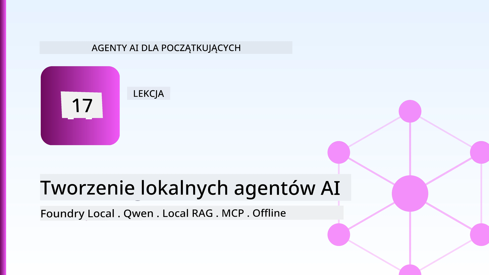
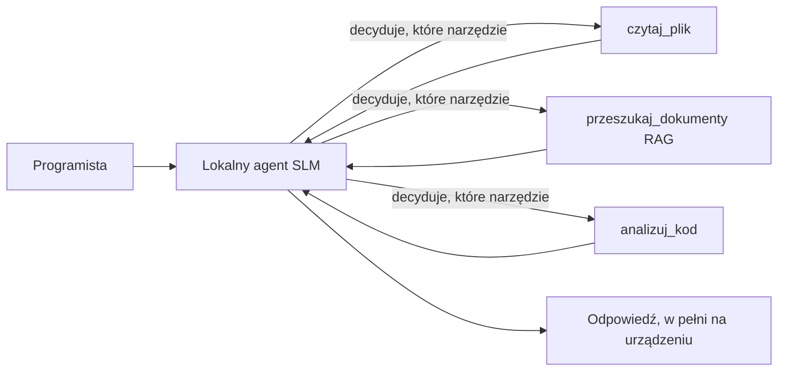
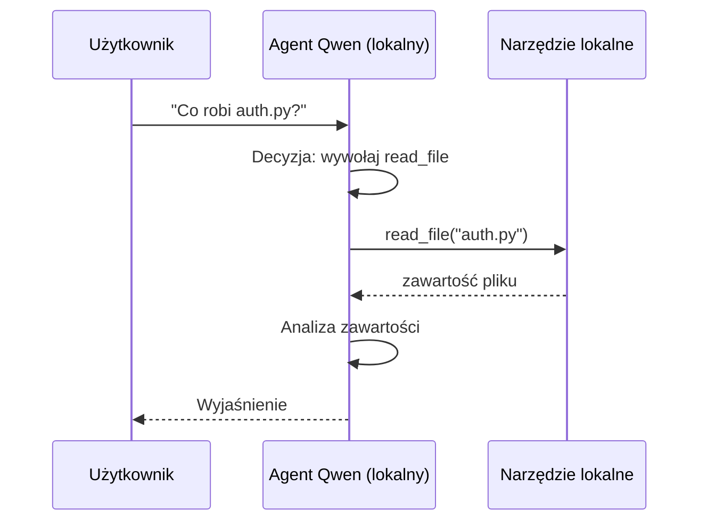
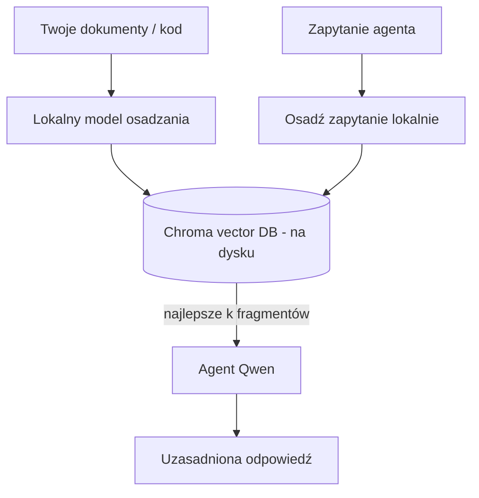
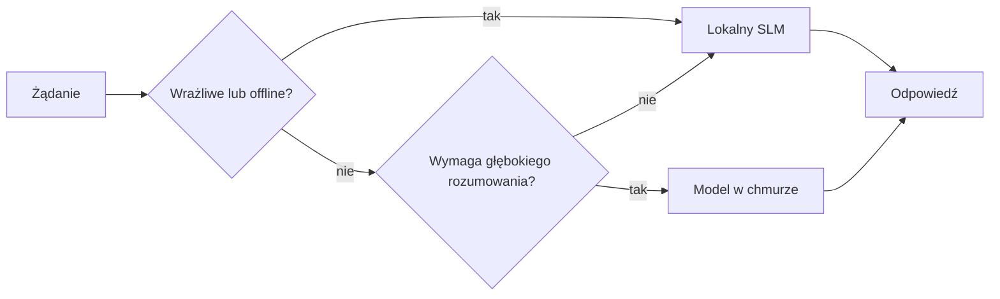

# Tworzenie lokalnych agentów AI za pomocą Microsoft Foundry Local i Qwen



Poprzednia lekcja skalowała agentów *do góry* w chmurze. Ta przenosi ich *w dół* na pojedynczą maszynę. Na koniec będziesz mieć działającego asystenta inżynierskiego, który rozumuje, wywołuje narzędzia, czyta twoje pliki i przeszukuje twoją dokumentację — **bez żadnego wywołania inferencji w chmurze.**

Dlaczego miałbyś tego chcieć? Trzy powody, które nieustannie pojawiają się w rzeczywistej pracy inżynierskiej:

- **Prywatność.** Kod i dokumenty nigdy nie opuszczają maszyny. Ani podpowiedź, ani fragment, ani dane klienta nie przekraczają granicy sieciowej.
- **Koszt.** Lokalna inferencja nie ma opłat za token. Możesz iterować cały dzień za cenę energii elektrycznej.
- **Tryb offline.** W samolocie, w bezpiecznym obiekcie albo podczas awarii agent nadal działa.

Jednak wymiana modelu frontier w chmurze na **Small Language Model (SLM)** działający na twoim CPU, GPU lub NPU oznacza ograniczenia. Ta lekcja opowiada o tworzeniu agentów, którzy są *dobrzy* w tych ograniczeniach, zamiast udawać, że ich nie ma.

## Wprowadzenie

Ta lekcja obejmie:

- **Small Language Models (SLM)** — czym są, gdzie się sprawdzają, a gdzie nie.
- **Microsoft Foundry Local** — środowisko uruchomieniowe, które pobiera i udostępnia modele na urządzeniu przez **API kompatybilne z OpenAI**.
- **Modele Qwen do wywoływania funkcji** — SLM, które niezawodnie generują wywołania narzędzi, co umożliwia lokalnych *agentów* (nie tylko lokalny chat).
- **Lokalne narzędzia, lokalny RAG i lokalny MCP** — dające agentowi możliwości bez chmury.
- **Wzorce hybrydowe** — kiedy trzymać się lokalnego środowiska, a kiedy sięgać do chmury.

## Cele nauki

Po zakończeniu tej lekcji będziesz potrafił:

- Wyjaśnić kompromisy SLM i wybrać odpowiednie przypadki użycia lokalnych agentów.
- Obsłużyć model Qwen lokalnie z Foundry Local i połączyć się z nim przez punkt końcowy kompatybilny z OpenAI.
- Zbudować agenta wywołującego narzędzia, działającego całkowicie na twoim komputerze.
- Dodać lokalny RAG na własnych dokumentach z użyciem lokalnej bazy wektorowej (Chroma).
- Połączyć agenta z lokalnym serwerem MCP i rozważyć hybrydowe projektowanie lokalne/chmurowe.

## Wymagania wstępne

Ta lekcja zakłada, że ukończyłeś wcześniejsze lekcje i znasz się na:

- [Korzystaniu z narzędzi](../04-tool-use/README.md) (Lekcja 4) i [Agentic RAG](../05-agentic-rag/README.md) (Lekcja 5).
- [Agentic Protocols / MCP](../11-agentic-protocols/README.md) (Lekcja 11).
- [Microsoft Agent Framework](../14-microsoft-agent-framework/README.md) (Lekcja 14).

Potrzebujesz też:

- Stanowisko deweloperskie. **8 GB RAM to realistyczne minimum**; 16 GB i więcej jest wygodne. Pomaga GPU lub NPU, ale nie jest wymagane.
- Zainstalowany **Microsoft Foundry Local** (patrz sekcja instalacji poniżej).
- Python 3.12+ oraz pakiety z repozytorium [`requirements.txt`](../../../requirements.txt), plus `foundry-local-sdk`, `openai` i `chromadb` na tę lekcję.

## Small Language Models: odpowiednie narzędzie do pracy lokalnej

Model frontier w chmurze ma setki miliardów parametrów i zaplecze w postaci centrum danych. SLM ma kilka miliardów parametrów i musi zmieścić się w pamięci RAM twojego laptopa. Ta różnica nakłada wyraźne oczekiwania.

**SLM dobrze radzą sobie z:**

- Zadaniami strukturalnymi i ograniczonymi — klasyfikacją, ekstrakcją, streszczaniem znanych dokumentów.
- **Wywoływaniem narzędzi** — decydowaniem, którą funkcję wywołać i z jakimi argumentami.
- Szybką, tanią i prywatną iteracją na własnych danych.

**SLM mają słabszą stronę w:**

- Nieograniczone rozumowanie wieloetapowe na dużym kontekście.
- Szeroką wiedzę o świecie (wiedzą mniej i szybciej zapominają).

Dlatego zwycięską strategią dla lokalnych agentów jest: **pozwól SLM orkiestruje, a narzędziom robić ciężką robotę.** Model nie musi *znać* twojego kodu — musi wiedzieć, kiedy wywołać `read_file` i `search_docs`. To idealnie gra do mocnych stron SLM.



## Microsoft Foundry Local

**Microsoft Foundry Local** to lekkie środowisko uruchomieniowe, które pobiera, zarządza i obsługuje modele całkowicie na twojej maszynie. Najważniejszą cechą dla nas jest to, że udostępnia **HTTP endpoint kompatybilny z OpenAI** — co oznacza, że SDK OpenAI i klient OpenAI z Microsoft Agent Framework działają z nim po prostu zmieniając `base_url`. Wszystko, czego nauczyłeś się o budowie agentów, przenosi się bezpośrednio; tylko punkt końcowy zmienia się z chmury na `localhost`.

Foundry Local dodatkowo automatycznie wybiera najlepszą wersję modelu dla twojego sprzętu — build CPU, CUDA/GPU lub NPU — więc nie musisz optymalizować ręcznie na każdej maszynie.

### Instalacja

Zainstaluj Foundry Local (zobacz [dokumentację](https://learn.microsoft.com/azure/ai-foundry/foundry-local/) dla swojego systemu operacyjnego), a potem sprawdź, czy działa:

```bash
# Zainstaluj (przykład; postępuj zgodnie z dokumentacją dla swojej platformy)
winget install Microsoft.FoundryLocal      # Windows
# brew install microsoft/foundrylocal/foundrylocal   # macOS

# Pobierz i uruchom model Qwen, a następnie rozpocznij lokalną usługę
foundry model run qwen2.5-7b-instruct
foundry service status
```

Po uruchomieniu usługi masz lokalny punkt końcowy kompatybilny z OpenAI (zwykle `http://localhost:PORT/v1`). Notebook używa `foundry-local-sdk` do automatycznego wykrywania punktu końcowego, więc nie musisz na sztywno wpisywać portu.

## Wywoływanie funkcji Qwen: dlaczego to ważne

Agent jest agentem tylko wtedy, gdy może wywoływać narzędzia. Wiele SLM potrafi prowadzić rozmowę, ale generują zawodną, źle sformatowaną strukturę wywołań narzędzi. Modele **Qwen** są trenowane do wywoływania funkcji i konsekwentnie emitują prawidłowo sformatowane wywołania — co dokładnie przekształca lokalny model czatu w lokalnego *agenta*.

Przepływ to standardowa pętla wywoływania narzędzi, którą już znasz, tyle że działająca lokalnie:



## Lokalny RAG

Przeszukiwanie dokumentacji to miejsce, gdzie lokalni agenci naprawdę się sprawdzają. Zamiast liczyć, że SLM zapamiętał dokumentację twojego frameworka, osadzasz te dokumenty w **lokalnej bazie wektorowej** i pozwalasz agentowi pobierać odpowiednie fragmenty na żądanie.

Używamy **Chromy**, wbudowanego magazynu wektorów działającego lokalnie, bez konieczności zarządzania serwerem. Pipeline jest całkowicie lokalny: lokalny model do osadzania → lokalne wektory → lokalne pobieranie → lokalny SLM.



To ten sam wzorzec Agentic RAG z Lekcji 5 — jedyna zmiana to fakt, że każdy komponent działa na twojej maszynie.

## Lokalne serwery MCP

[MCP](../11-agentic-protocols/README.md) to transport, a nie usługa w chmurze. Serwer MCP może działać jako lokalny proces na `stdio`, udostępniając narzędzia agentowi przez standardowy protokół. Pozwala to korzystać z rosnącego ekosystemu serwerów MCP — dostęp do systemu plików, operacje git, zapytania do bazy danych — całkowicie offline.

Poziom bezpieczeństwa różni się od chmury, ale nie jest zerowy: lokalny serwer MCP działa z uprawnieniami twojego użytkownika, więc ogranicz, do czego ma dostęp (np. katalog projektu zamiast całego katalogu domowego) i traktuj jego dane wyjściowe jako dane wejściowe do weryfikacji.

## Hybrydowe wzorce chmura-i-lokalne

Lokalność nie oznacza tylko lokalności. Dojrzałe systemy kierują ruch według wrażliwości i trudności:

| Sytuacja | Gdzie działa |
| --- | --- |
| Wrażliwy kod / dane, albo offline | **Lokalny SLM** |
| Proste, ograniczone zadanie | **Lokalny SLM** (tani, szybki) |
| Trudne wieloetapowe rozumowanie na niewrażliwych danych | **Model chmurowy** |
| Wszystko, podczas awarii | **Lokalny SLM** (łagodne pogorszenie jakości) |

To odzwierciedla ideę **sterowania modelem** z Lekcji 16 — z tą różnicą, że jednym z "modeli" jest teraz twoja własna maszyna. Solidny projekt przełącza na lokalny model, jeśli chmura stanie się niedostępna, więc agent nie przestaje działać, tylko pogarsza się stopniowo.



## Ćwiczenie praktyczne: lokalny asystent inżynierski

Otwórz [`code_samples/17-local-agent-foundry-local.ipynb`](./code_samples/17-local-agent-foundry-local.ipynb) i przejdź przez niego. Zbudujesz **lokalnego asystenta inżynierskiego**, który działa całkowicie na twoim stanowisku i potrafi:

1. **Wywoływać narzędzia** — przez wywoływanie funkcji Qwen przez Foundry Local.
2. **Wykonywać lokalne operacje na plikach** — wypisać i czytać pliki w katalogu projektu.
3. **Analizować kod** — raportować podstawowe metryki pliku źródłowego.
4. **Przeszukiwać dokumentację** — lokalny RAG na folderze dokumentacji z Chroma.
5. **Korzystać z MCP** — łączyć się z lokalnym serwerem MCP (z łagodnym pominięciem, jeśli nie jest skonfigurowany).

W żadnym momencie nie korzysta się z inferencji w chmurze.

### Przejście krok po kroku

Asystent łączy się z Foundry Local przez punkt końcowy kompatybilny z OpenAI, więc kod agenta wygląda niemal identycznie jak w lekcjach o chmurze — zmienia się tylko klient:

```python
from foundry_local import FoundryLocalManager
from openai import OpenAI

# Foundry Local wykrywa/pobiera model i udostępnia nam lokalny punkt końcowy.
manager = FoundryLocalManager(\"qwen2.5-7b-instruct\")
client = OpenAI(base_url=manager.endpoint, api_key=manager.api_key)  # api_key jest lokalnym symbolem zastępczym
```

Narzędzia to zwykłe funkcje Pythona ograniczone do folderu projektu:

```python
def read_file(path: str) -> str:
    \"\"\"Read a file, but only inside the sandboxed project directory.\"\"\"
    full = (PROJECT_ROOT / path).resolve()
    if PROJECT_ROOT not in full.parents and full != PROJECT_ROOT:
        return \"Access denied: path is outside the project directory.\"
    return full.read_text(encoding=\"utf-8\")
```

Zauważ sprawdzenie sandboxa — nawet lokalnie narzędzie czytające dowolne ścieżki to zagrożenie. Notebook trzyma każdy tool ograniczony do jednego folderu projektu.

## Sprawdzenie wiedzy

Sprawdź swoje zrozumienie przed przejściem do zadania.

**1. Podaj dwa konkretne powody, by uruchomić agenta lokalnie zamiast w chmurze.**

<details>
<summary>Odpowiedź</summary>

Dowolne dwa: **prywatność** (kod i dane nigdy nie opuszczają maszyny), **koszt** (brak opłat za tokenową inferencję), oraz **tryb offline** (działa bez sieci — w samolocie, w bezpiecznym obiekcie lub podczas awarii). Ograniczenia regulacyjne/zgodnościowe zabraniające przesyłania danych poza urządzenie często napędzają powód prywatności.
</details>

**2. Jaki jest zalecany podział pracy między SLM a narzędziami w lokalnym agencie i dlaczego?**

<details>
<summary>Odpowiedź</summary>

Pozwól SLM **orkiestrować** (decydować, które narzędzie wywołać i z jakimi argumentami), a **narzędziom wykonać ciężką pracę** (czytanie plików, pobieranie dokumentów, obliczenia). SLM dobrze radzą sobie z ograniczonymi decyzjami, np. wyborem narzędzia, ale gorzej z szeroką wiedzą i długim rozumowaniem wieloetapowym, więc poleganie na narzędziach gra do ich mocnych stron.
</details>

**3. Co umożliwia ponowne użycie kodu agenta chmurowego z Foundry Local?**

<details>
<summary>Odpowiedź</summary>

Foundry Local udostępnia **HTTP endpoint kompatybilny z OpenAI**. SDK OpenAI i klient OpenAI z Agent Framework działają z nim, zmieniając tylko `base_url` (i używając lokalnego klucza API placeholder). Wszystko inne w kodzie agenta pozostaje takie samo.
</details>

**4. Dlaczego używamy konkretnego modelu Qwen do wywoływania funkcji, a nie dowolnego SLM?**

<details>
<summary>Odpowiedź</summary>

Ponieważ agent musi generować wiarygodne, dobrze sformułowane **wywołania narzędzi**. Wiele SLM potrafi rozmawiać, ale generuje niepoprawne lub niespójne struktury wywołań narzędzi. Modele Qwen są trenowane do wywoływania funkcji i emitują spójne wywołania, co dokładnie zamienia lokalny model czatu w działającego lokalnego agenta.
</details>

**5. Które komponenty w pipeline lokalnego RAG działają na maszynie?**

<details>
<summary>Odpowiedź</summary>

Wszystkie: model do osadzania, baza wektorowa (Chroma, na dysku), krok pobierania oraz SLM. Dokumenty są osadzane lokalnie, przechowywane lokalnie, pobierane lokalnie i rozumowane przez lokalny model — żaden komponent nie korzysta z chmury.
</details>

**6. Lokalny serwer MCP działa na twojej maszynie. Czy to od razu czyni go bezpiecznym? Jakie środki ostrożności powinieneś zastosować?**

<details>
<summary>Odpowiedź</summary>

Nie. Lokalny serwer MCP działa z uprawnieniami twojego użytkownika, więc ma dostęp do wszystkiego, do czego masz dostęp ty. Ogranicz jego dostęp do tego, co potrzebuje (np. katalog projektu, a nie cały katalog domowy) i traktuj jego wyjścia jako dane wejściowe do walidacji przed podjęciem na ich podstawie działań.
</details>

**7. Opisz sensowne zasady hybrydowego sterowania modelem uwzględniające model lokalny.**

<details>
<summary>Odpowiedź</summary>

Kieruj wrażliwe lub offline zapytania do lokalnego SLM; proste zadania ograniczone do lokalnego SLM dla szybkości i kosztu; trudne, wieloetapowe rozumowanie na danych niewrażliwych do modelu chmurowego; a jeśli chmura jest niedostępna, przełącz się z powrotem na lokalny SLM, aby agent łagodnie pogarszał jakość zamiast się wyłączać. To sterowanie modelem (Lekcja 16) z lokalną maszyną jako jednym z modeli.
</details>

**8. Jaka jest realistyczna minimalna ilość RAM do uruchomienia lokalnego agenta w tej lekcji i co daje więcej RAM?**

<details>
<summary>Odpowiedź</summary>

Około **8 GB** to realistyczne minimum; 16 GB+ to komfort. Więcej RAM pozwala uruchomić większe, bardziej zdolne modele i utrzymać więcej kontekstu w pamięci. GPU lub NPU przyspiesza inferencję, ale nie jest wymagane — Foundry Local wybiera build CPU, gdy nie ma przyspieszacza.
</details>

## Zadanie

Rozszerz lokalnego asystenta inżynierskiego do **lokalnego recenzenta dokumentacji** dla małego wybranego przez siebie projektu (możesz użyć jednego z folderów lekcji z tego repozytorium).

Twoje rozwiązanie powinno:

1. **Zindeksować rzeczywisty folder z dokumentacją/kodem** do Chromy (co najmniej pięć plików).
2. **Dodać narzędzie `find_todos`** skanujące projekt pod kątem komentarzy `TODO`/`FIXME` i zwracające je z podaniem pliku i numeru linii — zachowując tę samą kontrolę sandboxa co `read_file`.

3. **Zadaj agentowi trzy pytania**, które zmuszą go do łączenia narzędzi: jedno czysto RAG, jedno wymagające przeczytania konkretnego pliku oraz jedno wymagające znalezienia TODO.
4. **Zmierz to**: zmierz czas każdej z trzech odpowiedzi i zanotuj go w komórce markdown. Skomentuj, czy opóźnienie jest akceptowalne dla twojego zamierzonego workflow.

Następnie napisz krótki akapit o **tym, co przeniósłbyś do chmury, a co zostawił lokalnie** dla tego recenzenta i dlaczego. Ocena będzie dotyczyć tego, czy lokalne komponenty są poprawnie połączone oraz czy twoje hybrydowe rozumowanie jest poprawne — a nie jakości modelu.

## Podsumowanie

W tej lekcji zbudowałeś agenta, który działa w całości na twoim własnym komputerze:

- **SLMy** poświęcają szerokość na rzecz prywatności, kosztów i pracy offline — i błyszczą, gdy **orkiestrują narzędzia**, zamiast przenosić całą wiedzę w sobie.
- **Foundry Local** udostępnia modele na urządzeniu za pomocą **punktu końcowego kompatybilnego z OpenAI**, więc twój kod agenta w chmurze przenosi się jedną linijką zmiany.
- **Modele wywołujące funkcje Qwen** umożliwiają niezawodne lokalne wywoływanie narzędzi — a przez to lokalnych *agentów*.
- **Lokalny RAG** (Chroma) i **lokalny MCP** dają agentowi możliwości bez opuszczania maszyny.
- **Hybrydowe wzorce** pozwalają na kierowanie zapytań według poufności i trudności, z lokalnym jako eleganckim zapasem.

To zamyka łuk wdrożenia: Lekcja 16 skalowała agentów do Microsoft Foundry, a ta lekcja je zeskalowała na pojedynczą stację roboczą. Następna lekcja poświęcona jest utrzymaniu bezpieczeństwa wdrożonych agentów.

## Dodatkowe zasoby

- <a href="https://learn.microsoft.com/azure/ai-foundry/foundry-local/" target="_blank">Dokumentacja Microsoft Foundry Local</a>
- <a href="https://learn.microsoft.com/azure/ai-foundry/what-is-azure-ai-foundry" target="_blank">Dokumentacja Microsoft Foundry</a>
- <a href="https://aka.ms/ai-agents-beginners/agent-framework" target="_blank">Microsoft Agent Framework</a>
- <a href="https://qwen.readthedocs.io/en/latest/framework/function_call.html" target="_blank">Dokumentacja wywoływania funkcji Qwen</a>
- <a href="https://modelcontextprotocol.io/" target="_blank">Model Context Protocol (MCP)</a>
- <a href="https://docs.trychroma.com/" target="_blank">Baza wektorowa Chroma</a>

## Poprzednia lekcja

[Deploying Scalable Agents](../16-deploying-scalable-agents/README.md)

## Następna lekcja

[Securing AI Agents](../18-securing-ai-agents/README.md)

---

<!-- CO-OP TRANSLATOR DISCLAIMER START -->
**Zastrzeżenie**:
Niniejszy dokument został przetłumaczony za pomocą usługi tłumaczenia AI [Co-op Translator](https://github.com/Azure/co-op-translator). Choć dążymy do dokładności, prosimy pamiętać, że automatyczne tłumaczenia mogą zawierać błędy lub niedokładności. Oryginalny dokument w jego języku źródłowym należy uznawać za autorytatywne źródło. W przypadku informacji krytycznych zalecane jest skorzystanie z profesjonalnego tłumaczenia wykonanego przez człowieka. Nie ponosimy odpowiedzialności za jakiekolwiek nieporozumienia lub błędne interpretacje wynikające z użycia tego tłumaczenia.
<!-- CO-OP TRANSLATOR DISCLAIMER END -->