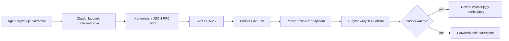
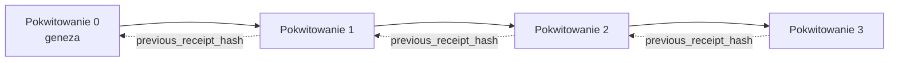

[Obejrzyj wideo z lekcji: Zabezpieczanie agentów AI za pomocą kryptograficznych pokwitowań](https://youtu.be/PLACEHOLDER_VIDEO_ID)

> _(Wideo z lekcji i miniaturka zostaną dodane przez zespół ds. zawartości Microsoft po scaleniu, zgodnie ze schematem lekcji 14 / 15.)_

# Zabezpieczanie agentów AI za pomocą kryptograficznych pokwitowań

## Wprowadzenie

W tej lekcji omówimy:

- Dlaczego ścieżki audytu dla agentów AI są ważne dla zgodności, debugowania i zaufania.
- Czym jest kryptograficzne pokwitowanie i czym różni się od niepodpisanej linii dziennika.
- Jak wygenerować podpisane pokwitowanie dla wywołania narzędzia agenta w zwykłym Pythonie.
- Jak zweryfikować pokwitowanie offline i wykryć manipulacje.
- Jak łączyć pokwitowania w łańcuch tak, aby usunięcie lub przestawienie jednego przerwało łańcuch.
- Co pokwitowania dowodzą, a czego wyraźnie nie dowodzą.

## Cele nauki

Po ukończeniu tej lekcji będziesz potrafił:

- Zidentyfikować tryby awarii, które motywują stosowanie kryptograficznego pochodzenia działań agenta.
- Wygenerować pokwitowanie podpisane Ed25519 dla kanonicznego ładunku JSON.
- Niezależnie zweryfikować pokwitowanie, używając tylko klucza publicznego podpisującego.
- Wykryć manipulacje, ponownie uruchamiając weryfikację na zmodyfikowanym pokwitowaniu.
- Zbudować sekwencję pokwitowań powiązanych łańcuchowo i wyjaśnić, dlaczego ten łańcuch jest istotny.
- Rozpoznać granicę między tym, co pokwitowania dowodzą (przypisanie, integralność, kolejność), a tym, czego nie dowodzą (poprawność działania, poprawność polityki).

## Problem: Ścieżka audytu Twojego agenta

Wyobraź sobie, że wdrożyłeś agenta AI dla Contoso Travel. Agent odczytuje prośby klientów, wywołuje interfejs API lotów, aby sprawdzić opcje, i rezerwuje miejsca w imieniu klienta. W ostatnim kwartale agent obsłużył 50 000 rezerwacji.

Dziś pojawia się audytor. Zadaje proste pytanie: "Pokaż mi, co zrobił Twój agent."

Wręczasz mu pliki dziennika. Audytor je przegląda i zadaje trudniejsze pytanie: "Skąd mam wiedzieć, że te dzienniki nie zostały zmienione?"

To jest problem ścieżki audytu. Większość dzisiejszych wdrożeń agentów opiera się na:

- **Dziennikach aplikacji**: tworzonych przez samego agenta, możliwych do edycji przez każdego, kto ma dostęp do systemu plików.
- **Usługach logowania w chmurze**: odpornych na manipulacje na poziomie platformy, ale tylko jeśli audytor ufa operatorowi platformy.
- **Dziennikach transakcji baz danych**: dobrze nadających się do zmian w bazie, ale nie do dowolnych wywołań narzędzi.

Żadne z nich nie potrafi odpowiedzieć na pytanie audytora bez zmuszania go do zaufania komuś (tobie, twojemu dostawcy chmury, dostawcy bazy danych). W zastosowaniach wewnętrznych takie zaufanie jest często akceptowalne. W przypadku obciążeń regulowanych (finanse, opieka zdrowotna, wszystko objęte europejską ustawą o AI) nie jest.

Kryptograficzne pokwitowania rozwiązują ten problem, umożliwiając niezależną weryfikację każdego działania agenta. Audytor nie musi ufać tobie. Potrzebuje tylko twojego klucza publicznego i samego pokwitowania.

## Co to jest kryptograficzne pokwitowanie?

Pokwitowanie to obiekt JSON rejestrujący, co agent zrobił, podpisany podpisem cyfrowym.



Minimalne pokwitowanie wygląda tak:

```json
{
  "type": "agent.tool_call.v1",
  "agent_id": "contoso-travel-bot",
  "tool_name": "lookup_flights",
  "tool_args_hash": "sha256:a3f9c1...",
  "result_hash": "sha256:7b2e1d...",
  "policy_id": "contoso-travel-policy-v3",
  "timestamp": "2026-04-25T14:30:00Z",
  "sequence": 47,
  "previous_receipt_hash": "sha256:9d4e6a...",
  "signature": {
    "alg": "EdDSA",
    "sig": "c5af83...",
    "public_key": "8f3b2c..."
  }
}
```

Trzy cechy sprawiają, że to działa:

1. **Podpis**. Pokwitowanie jest podpisane przez bramę agenta używając prywatnego klucza Ed25519. Każdy, kto ma odpowiedni klucz publiczny, może zweryfikować podpis offline. Każda modyfikacja jakiegokolwiek pola unieważnia podpis.

2. **Kanoniczne kodowanie**. Przed podpisaniem pokwitowanie jest serializowane za pomocą JSON Canonicalization Scheme (JCS, RFC 8785). Zapewnia to, że dwie implementacje generujące ten sam logiczny pokwitowanie dają identyczne bajtowo wyniki. Bez kanoniczności różni serializatorzy JSON wygenerowaliby różne podpisy dla tej samej zawartości.

3. **Łączenie za pomocą hasha**. Pole `previous_receipt_hash` łączy każde pokwitowanie z poprzednim. Usunięcie lub zmiana kolejności pokwitowania łamie każde pokwitowanie powstałe po nim. Manipulacja jest widoczna na poziomie łańcucha, nawet jeśli podpisy poszczególnych pokwitowań zostałyby obejściem.

Razem te cechy dają trzy gwarancje:

- **Przypisanie**: ten klucz podpisał tę zawartość.
- **Integralność**: zawartość nie zmieniła się od podpisania.
- **Kolejność**: to pokwitowanie przyszło po tamtym w łańcuchu.

## Tworzenie pokwitowania w Pythonie

Nie potrzebujesz specjalnej biblioteki do tworzenia pokwitowania. Prymitywy kryptograficzne są powszechnie dostępne, a logika to kilka dziesiątek linii Pythona.

Ćwiczenia praktyczne w `code_samples/18-signed-receipts.ipynb` przeprowadzają przez cały proces. Podsumowanie:

```python
import json
import hashlib
import base64
from nacl import signing
from jcs import canonicalize  # Kanoniczny JSON zgodny z RFC 8785

def b64url_nopad(data: bytes) -> str:
    return base64.urlsafe_b64encode(data).decode("ascii").rstrip("=")

def sha256_canonical(obj) -> str:
    """SHA-256 of a Python object's JCS-canonical JSON form."""
    return f"sha256:{hashlib.sha256(canonicalize(obj)).hexdigest()}"

# Wygeneruj lub załaduj klucz do podpisu (w produkcji przechowuj w skarbcu kluczy)
signing_key = signing.SigningKey.generate()
verify_key = signing_key.verify_key

# Zbuduj ładunek potwierdzenia (jeszcze bez podpisu)
tool_args = {"origin": "SYD", "destination": "LAX"}
tool_result = [{"flight": "QF11", "price": 1850, "stops": 0}]

payload = {
    "type": "agent.tool_call.v1",
    "agent_id": "contoso-travel-bot",
    "tool_name": "lookup_flights",
    "tool_args_hash": sha256_canonical(tool_args),
    "result_hash": sha256_canonical(tool_result),
    "policy_id": "contoso-travel-policy-v3",
    "timestamp": "2026-04-25T14:30:00Z",
    "sequence": 0,
    "previous_receipt_hash": None,
}

# Kanonizuj, haszuj, podpisz.
canonical_bytes = canonicalize(payload)
message_hash = hashlib.sha256(canonical_bytes).digest()
signature_bytes = signing_key.sign(message_hash).signature

# Dołącz uporządkowany obiekt podpisu.
receipt = {
    **payload,
    "signature": {
        "alg": "EdDSA",
        "sig": b64url_nopad(signature_bytes),
        "public_key": b64url_nopad(bytes(verify_key)),
    },
}
```

To cały pipeline podpisywania. Ćwiczenia w notatniku przeprowadzają przez każdy krok.

## Weryfikacja pokwitowania i wykrywanie manipulacji

Weryfikacja to operacja odwrotna:

```python
import base64
import hashlib
from nacl import signing
from nacl.exceptions import BadSignatureError
from jcs import canonicalize

def b64url_decode(s: str) -> bytes:
    padding = "=" * ((4 - len(s) % 4) % 4)
    return base64.urlsafe_b64decode(s + padding)

def verify_receipt(receipt: dict) -> bool:
    # Sygnatura jest obiektem strukturalnym: {"alg", "sig", "public_key"}.
    sig_obj = receipt.get("signature")
    if not sig_obj or sig_obj.get("alg") != "EdDSA":
        return False

    # Odtwórz ładunek, który został faktycznie podpisany (wszystko oprócz sygnatury).
    payload = {k: v for k, v in receipt.items() if k != "signature"}

    canonical_bytes = canonicalize(payload)
    message_hash = hashlib.sha256(canonical_bytes).digest()

    try:
        verify_key = signing.VerifyKey(b64url_decode(sig_obj["public_key"]))
        verify_key.verify(message_hash, b64url_decode(sig_obj["sig"]))
        return True
    except BadSignatureError:
        return False
```

Funkcja przyjmuje pokwitowanie i zwraca `True`, jeśli podpis jest ważny, `False` w przeciwnym razie. Bez wywołań sieciowych, bez zależności od usług, bez konieczności zaufania osobie trzeciej.

Aby zobaczyć działanie wykrywania manipulacji, notatnik pokazuje:

1. Wygenerowanie ważnego pokwitowania i potwierdzenie jego weryfikacji.
2. Modyfikację jednego bajtu pola `tool_args_hash`.
3. Ponowne uruchomienie weryfikacji i jej niepowodzenie.

To praktyczny dowód na to, że pokwitowania są odporne na manipulacje: każda zmiana, choćby najmniejsza, łamie podpis.

## Łączenie pokwitowań dla agentów wieloetapowych

Pojedyncze podpisane pokwitowanie chroni jedno działanie. Łańcuch pokwitowań chroni sekwencję.



Każde pokwitowanie zapisuje hash pokwitowania poprzedniego. Aby potajemnie usunąć pokwitowanie 2, atakujący musiałby:

- Zmodyfikować pole `previous_receipt_hash` pokwitowania 3 (to łamie podpis pokwitowania 3), LUB
- Sfałszować nowy podpis na zmodyfikowanym pokwitowaniu 3 (wymaga prywatnego klucza agenta).

Jeśli klucz prywatny jest w sprzętowym sejfie kluczy, a ty publikujesz klucz publiczny z każdym pokwitowaniem, żaden z tych ataków nie jest możliwy bez wykrycia.

Notatnik pokazuje:

1. Budowę łańcucha trzech pokwitowań.
2. Weryfikację, że `previous_receipt_hash` każdego pokwitowania odpowiada faktycznemu hashowi pokwitowania poprzedniego.
3. Manipulację jednym pokwitowaniem pośrodku i widok przerwania łańcucha dokładnie w tym miejscu.

W ten sposób tworzysz ścieżkę audytu, którą zewnętrzny audytor może zweryfikować bez konieczności zaufania tobie.

## Co pokwitowania dowodzą (a czego nie)

To najważniejsza część tej lekcji. Pokwitowania są potężne, ale ich moc jest ograniczona.

**Pokwitowania dowodzą trzech rzeczy:**

1. **Przypisanie**: konkretny klucz podpisał określony ładunek.
2. **Integralność**: ładunek nie zmienił się od momentu podpisania.
3. **Kolejność**: to pokwitowanie jest potem w łańcuchu niż tamto.

**Pokwitowania NIE dowodzą:**

1. **Poprawności**: że działanie agenta było właściwe. Pokwitowanie może podpisać zarówno właściwą, jak i błędną odpowiedź równie czysto.
2. **Zgodności z polityką**: że polityka odwołana przez `policy_id` została faktycznie oceniona lub że dopuściłaby to działanie, gdyby została sprawdzona. Pokwitowanie odnotowuje, co zostało zgłoszone, a nie co zostało wymuszone.
3. **Tożsamości poza kluczem**: pokwitowanie mówi "ten klucz podpisał tę zawartość". Nie mówi "ta osoba to zatwierdziła". Połączenie klucza z osobą lub organizacją wymaga odrębnej infrastruktury tożsamości (katalogu, rejestru kluczy publicznych itp.).
4. **Prawdziwości danych wejściowych**: jeśli agent otrzyma zmodyfikowany prompt i na niego zareaguje, pokwitowanie wiernie rejestruje to działanie. Pokwitowania są downstream od walidacji wejścia, a nie jej substytutem.

Ta granica jest istotna z dwóch powodów:

- Mówi, do czego pokwitowania są przydatne: do audytowalności i wykrywania manipulacji zachowań agenta, nawet poza granicami organizacji.
- Mówi, jakich dodatkowych warstw nadal potrzebujesz: walidacji wejścia (Lekcja 6), wymuszania polityki (krótko omówione niżej) i infrastruktury tożsamości (poza zakresem tej lekcji).

Częstym błędem jest założenie, że "mam pokwitowania" oznacza "mam zarządzanie." Tak nie jest. Pokwitowania są fundamentem. Zarządzanie to system, który z nich budujesz.

## Dowodzenie, że człowiek zatwierdził konkretne działanie

Punkt 3 powyżej zasługuje na osobną sekcję: pokwitowanie działania mówi "ten klucz podpisał tę zawartość", nigdy "człowiek to zatwierdził". Dla działań wysokiego ryzyka (zwroty, usunięcia, przelewy) ramy zarządzania coraz częściej wymagają dokładnie tego brakującego oświadczenia, a można je wygenerować za pomocą tych samych prymitywów, które zbudowałeś w tej lekcji.

Notatnik „code_samples/human-authorization-receipts.ipynb” dodaje drugi rodzaj pokwitowania, `human.approval.v1`, w tej samej formie koperty jak pokwitowania z lekcji (typowany ładunek podpisany Ed25519 po kanonicznym SHA-256, z obiektem `signature` na zewnątrz podpisanych bajtów). Nazwany zatwierdzający podpisuje **pełne kanoniczne działanie i jego skrót** przed wykonaniem; pokwitowanie działania agenta zawiera **ten sam skrót działania** oraz `parent_approval_ref`, czyli `receipt_hash` zatwierdzenia, w tej samej konwencji co `previous_receipt_hash` w łańcuchu powyżej. Jedna funkcja `verify_chain` obsługuje oba artefakty pod **oddzielnymi przypiętymi rejestrami kluczy** (klucze zatwierdzających vs klucze agentów), więc ścieżka kodu jest wspólna, ale autorytety nigdy.

Efekt, wyrażony precyzyjnie: *człowiek zatwierdził dokładnie to działanie, a agent wykonał dokładnie to zatwierdzone działanie.* W notatniku przypadki odrzuceń sprawiają, że właściwość jest rzeczywista, a nie tylko deklarowana:

- klasyczny zestaw: manipulacje, zdezorientowany zastępca, replay, podrobione klucze po obu stronach, błędne wejście;
- **przestarzałe uprawnienia**: podpis wciąż weryfikuje się, ale odrzucony, bo wersja polityki się zmieniła, klucz zatwierdzającego został usunięty z przypiętego rejestru lub zatwierdzenie wygasło przed wykonaniem;
- **podmiana skrótu**: poprawnie podpisane pokwitowanie działania wskazujące na *prawdziwe* zatwierdzenie, które wiąże się z *innym* kanonicznym działaniem.

Każda awaria odrzuca z odrębnym powodem, więc audytor czytający odrzucenie może rozpoznać, czy uprawnienia wygasły, czy działanie się zmieniło. Zasada nauczana przez notatnik: podpisane zatwierdzenie nie jest samo w sobie autorytetem. Autorytet istnieje tylko wtedy, gdy oba pokwitowania nadal wiążą się z tym samym kanonicznym działaniem w momencie wykonania. Ścieżka współpodpisu w tym samym projekcie Internet-Draft, który ta lekcja śledzi (`draft-farley-acta-signed-receipts`), jest oficjalnym wzorem tego schematu.

## Odniesienia produkcyjne

Kod Pythona z tej lekcji jest celowo zwięzły, abyś mógł przeczytać każdy wiersz i dokładnie zrozumieć, co się dzieje. W produkcji masz dwie opcje:

1. **Buduj bezpośrednio na prymitywach kryptograficznych.** 50 linii, które widziałeś powyżej, wystarczy dla wielu zastosowań. Biblioteki PyNaCl (Ed25519) i `jcs` (kanoniczny JSON) są dobrze utrzymane i audytowane.

2. **Użyj biblioteki produkcyjnej do pokwitowań.** Kilka projektów open-source implementuje ten sam wzór z dodatkowymi funkcjami (rotacja kluczy, weryfikacja masowa, dystrybucja zestawu JWK, integracja z silnikami polityk):
   - Format pokwitowań użyty w tej lekcji odpowiada IETF Internet-Draft ([`draft-farley-acta-signed-receipts`](https://datatracker.ietf.org/doc/draft-farley-acta-signed-receipts/), wersja 02) obecnie w procesie standaryzacji, z wspólnym zestawem testów zgodności ([agent-governance-testvectors](https://github.com/ScopeBlind/agent-governance-testvectors)) pozwalającym niezależnym implementacjom na wzajemną weryfikację identyczności bajtowej wyjścia kanonicznego.
   - Microsoft Agent Governance Toolkit łączy pokwitowania z decyzjami polityki opartymi na Cedar; zobacz Tutorial 33 w tym repozytorium dla przykładu end-to-end.
   - Pakiety `protect-mcp` (npm) i `@veritasacta/verify` (npm) dostarczają implementacji Node do podpisywania pokwitowań i weryfikacji offline, przeznaczone do opakowania dowolnego serwera MCP w odporną na manipulacje ścieżkę audytu, w tym przepływ hold-for-co-sign, gdzie wstrzymane działanie generuje pokwitowanie zatwierdzające związane ze skrótem działania (WebAuthn wspierany w trybie desktop), ten sam wzór pokwitowania zatwierdzenia jak w notatniku zatwierdzania przez człowieka powyżej.
   - Python SDK **[nobulex](https://github.com/arian-gogani/nobulex)** (`pip install nobulex`) zapewnia ten sam wzór podpisu Ed25519 + JCS w Pythonie z integracją LangChain i CrewAI, w tym opublikowanymi wektorami testowymi do walidacji krzyżowej i mapowaniem zgodności dostarczonym poprzez [OWASP PR #2210](https://github.com/OWASP/CheatSheetSeries/pull/2210).

Decyzja między tworzeniem własnego rozwiązania a użyciem biblioteki przypomina wybór między napisaniem własnej biblioteki JWT a użyciem przetestowanej: obie opcje są rozsądne; biblioteka oszczędza czas i zmniejsza powierzchnię audytu; własne rozwiązanie zmusza do zrozumienia każdego prymitywu. Ta lekcja uczy od podstaw, abyś miał fundament pod obie decyzje.

## Sprawdzenie wiedzy

Sprawdź swoje rozumienie przed przejściem do ćwiczenia praktycznego.

**1. Pokwitowanie jest podpisane prywatnym kluczem Ed25519 agenta. Audytor ma tylko klucz publiczny. Czy audytor może zweryfikować pokwitowanie offline?**

<details>
<summary>Odpowiedź</summary>

Tak. Weryfikacja Ed25519 wymaga tylko klucza publicznego i podpisanych bajtów. Bez wywołań sieciowych, bez zależności od usług. To cecha, która czyni pokwitowania przydatnymi w środowiskach odciętych od sieci, wieloorganizacyjnych lub o niskim poziomie zaufania.
</details>

**2. Atakujący modyfikuje pole `policy_id` pokwitowania, twierdząc, że było ono regulowane bardziej liberalną polityką. Podpis dotyczył oryginalnego ładunku. Co się dzieje podczas weryfikacji?**

<details>
<summary>Odpowiedź</summary>


Weryfikacja nie powiodła się. Podpis został obliczony na kanonicznych bajtach oryginalnej zawartości; zmiana jakiegokolwiek pola zmienia kanoniczne bajty, co zmienia hash SHA-256, a to powoduje unieważnienie podpisu. Atakujący potrzebowałby klucza prywatnego, aby wygenerować nowy ważny podpis, którego nie posiada.
</details>

**3. Dlaczego paragon zawiera `tool_args_hash` i `result_hash`, zamiast surowych argumentów i wyniku?**

<details>
<summary>Odpowiedź</summary>

Dwa powody. Po pierwsze, paragon może wymagać archiwizacji lub przesłania w środowiskach, gdzie ujawnienie surowej zawartości (dane PII, dane biznesowe) stanowi problem. Hashowanie utrzymuje paragon niewielkim i chroni zawartość; audytor weryfikuje, czy hash zgadza się z osobno przechowywaną kopią faktycznej zawartości. Po drugie, hashe mają stały rozmiar; paragon z hashami ma ograniczony rozmiar bez względu na wielkość wejść i wyjść.
</details>

**4. Pole `previous_receipt_hash` łączy każdy paragon z jego poprzednikiem. Co stanie się nieważne, jeśli atakujący potajemnie usunie paragon ze środka łańcucha?**

<details>
<summary>Odpowiedź</summary>

Każdy paragon, który wystąpił po usuniętym. Ich pola `previous_receipt_hash` nie będą się już zgadzać z faktycznym łańcuchem (ponieważ wskazywany paragon już nie istnieje lub łańcuch teraz wskazuje na innego poprzednika). Aby ukryć usunięcie, atakujący musiałby ponownie podpisać każdy późniejszy paragon, co wymaga klucza prywatnego.
</details>

**5. Paragon weryfikuje się poprawnie. Czy to dowód, że działanie agenta było poprawne, zgodne lub zgodne z polityką?**

<details>
<summary>Odpowiedź</summary>

Nie. Ważny paragon dowodzi trzech rzeczy: przypisania (ten klucz podpisał tę zawartość), integralności (zawartość nie została zmieniona) oraz kolejności (ten paragon pojawił się po tamtym paragonie). NIE dowodzi, że działanie było poprawne, że polityka wskazana w `policy_id` została faktycznie oceniona, ani że agent przestrzegał każdej reguły. Paragony czynią zachowanie agenta audytowalnym, niekoniecznie poprawnym. To najważniejsza granica w lekcji.
</details>

## Ćwiczenie praktyczne

Otwórz `code_samples/18-signed-receipts.ipynb` i ukończ wszystkie cztery sekcje:

1. **Sekcja 1**: Podpisz swój pierwszy paragon i zweryfikuj go.
2. **Sekcja 2**: Sfałszuj paragon i zaobserwuj, że weryfikacja nie powiodła się.
3. **Sekcja 3**: Zbuduj łańcuch trzech paragonów i sprawdź integralność łańcucha.
4. **Sekcja 4**: Zastosuj wzór do agenta zbudowanego w Microsoft Agent Framework: otocz wywołanie narzędzia podpisywaniem paragonu, następnie zweryfikuj paragon niezależnie.

**Wyzwanie dodatkowe 1:** rozszerz schemat paragonu o dodatkowe pole dowolnego wyboru (np. identyfikator żądania do śledzenia), zaktualizuj logikę kanonicznego podpisu, aby je uwzględnić, i potwierdź, że paragon nadal przechodzi weryfikację. Następnie zmodyfikuj pole po podpisaniu i potwierdź, że weryfikacja się nie powiodła. To wymusza zrozumienie, jak każdy bajt kodowania kanonicznego wpływa na podpis.

**Wyzwanie dodatkowe 2:** skróć dwie swoje paragony SHA-256 razem (połącz ich kanoniczne bajty w deterministycznej kolejności) i wstaw powstały skrót jako nowe pole w trzecim paragonie przed podpisaniem. Zweryfikuj, że wszystkie trzy paragony nadal przechodzą weryfikację. Właśnie zbudowałeś dowód włączenia w jednym kroku: każdy posiadający trzeci paragon może udowodnić, że pierwsze dwa istniały w momencie jego podpisania, bez konieczności ujawniania ich zawartości. To wzór, którego używają paragony z selektywnym ujawnianiem na dużą skalę (zob. Merkle commitments, RFC 6962).

## Podsumowanie

Kryptograficzne paragony dają agentom AI ślad audytu, który jest:

- **Niezależnie weryfikowalny**: dowolna strona mająca klucz publiczny może zweryfikować, bez zależności od usługi.
- **Odporny na fałszerstwa**: każda modyfikacja unieważnia podpis.
- **Przenośny**: paragon jest małym plikiem JSON; można go archiwizować, przesyłać i weryfikować gdziekolwiek.
- **Zgodny ze standardami**: oparty na Ed25519 (RFC 8032), JCS (RFC 8785) i SHA-256, wszystkie szeroko stosowane.

Nie zastępują walidacji wejścia, egzekwowania polityki ani infrastruktury tożsamości. Są podstawą dla tych warstw. Gdy wdrażasz agentów w regulowanych środowiskach, wieloorganizacyjnych przepływach pracy lub jakimkolwiek miejscu, gdzie przyszły audytor nie może zakładać Twojego zaufania, paragony uczciwie tworzą ślad audytowy.

Najważniejsza nauka: paragony dowodzą, kto co i kiedy powiedział. Nie dowodzą, że to, co powiedział, było prawdziwe lub słuszne. Trzymaj tę różnicę mocno. To odróżnia uczciwy system pochodzenia od wprowadzającego w błąd.

## Lista kontrolna produkcji

Gdy będziesz gotowy, by przejść z tej lekcji do wdrożenia agentów podpisujących paragony w realnym środowisku:

- [ ] **Przenieś klucz podpisu z laptopa dewelopera.** Użyj Azure Key Vault, AWS KMS lub modułu bezpieczeństwa sprzętowego. Klucz prywatny podpisujący Twoje paragony nigdy nie może znajdować się w kontroli wersji ani w postaci jawnej na maszynach aplikacji.
- [ ] **Opublikuj klucz publiczny do weryfikacji.** Audytorzy potrzebują go do weryfikacji offline. Standardowy wzór to zestaw JWK pod dobrze znanym adresem URL (RFC 7517), np. `https://twoja-organizacja.example.com/.well-known/agent-keys.json`.
- [ ] **Zakotwicz łańcuch zewnętrznie.** Okresowo zapisuj hash głowy łańcucha w dzienniku transparentności (Sigstore Rekor, RFC 3161 – usługa znaczników czasu lub drugi wewnętrzny system), aby strona zewnętrzna mogła potwierdzić "ten łańcuch istniał w tym czasie."
- [ ] **Przechowuj paragony niezmiennie.** Przechowywanie typu append-only (Azure Storage z politykami niezmienności, AWS S3 Object Lock) zapobiega wewnętrznym modyfikacjom historii na poziomie magazynu.
- [ ] **Zdecyduj o retencji.** Wiele przepisów wymaga wieloletniego przechowywania. Zaplanuj wzrost liczby paragonów (każdy ma ok. 500 bajtów; agent wykonujący 10 tys. wywołań dziennie generuje ~1,8 GB rocznie).
- [ ] **Udokumentuj, co paragony nie obejmują.** Paragony dowodzą przypisania, integralności i kolejności. Twój runbook powinien jednoznacznie wymieniać dodatkowe kontrole (walidacja wejścia, egzekwowanie polityki, ograniczanie szybkości, infrastruktura tożsamości), które działają obok paragonów w Twoim modelu zarządzania.

### Masz więcej pytań o zabezpieczanie agentów AI?

Dołącz do [Microsoft Foundry Discord](https://aka.ms/ai-agents/discord), aby spotkać się z innymi uczącymi się, uczestniczyć w godzinach konsultacji i uzyskać odpowiedzi na pytania dotyczące agentów AI.

## Poza tą lekcją

Ta lekcja obejmuje podpisywanie pojedynczego paragonu i sekwencje połączone hasłami. Te same prymitywy tworzą kilka bardziej zaawansowanych wzorców, które możesz spotkać, gdy Twoja postawa zarządzania dojrzeje:

- **Selektywne ujawnianie.** Gdy pola paragonu są niezależnie zobowiązane (Merkle tree w stylu RFC 6962), możesz ujawniać konkretne pola wybranym audytorom i udowodnić, że pozostałe się nie zmieniły bez ich odsłaniania. Przydatne, gdy ten sam paragon musi spełnić zarówno pełny audyt (który chce kompletności), jak i przepisy o minimalizacji danych, jak RODO (które chcą, by audytor widział jak najmniej).
- **Unieważnianie paragonów.** Jeśli klucz podpisu zostanie skompromitowany, potrzebujesz metody oznaczenia wszystkich paragonów podpisanych tym kluczem jako niewiarygodnych od określonego momentu. Standardowe wzory: krótkoterminowe klucze podpisujące plus opublikowana lista unieważnień albo dziennik transparentności z wpisami unieważniającymi.
- **Paragony z podwójnym / rozdzielonym podpisem.** Niektóre implementacje dzielą podpisaną zawartość na pre-wykonanie (`authorization_*`) i po-wykonaniu (`result_*`) z niezależnymi podpisami, użyteczne, gdy decyzja autoryzacji i obserwowany wynik są tworzone przez różnych aktorów lub w różnym czasie. To dodaje się do formatu paragonu omawianego w tej lekcji.
- **Kompozycja zawartości.** Paragon zabezpiecza dowolne bajty, które wstawisz w `result_hash`. Rzeczywiste zawartości często są bogatsze niż jeden wynik wywołania narzędzia: przemyślenia przed decyzją (predykcja modelu, rozważane opcje, dowody i ich kompletność, ocena ryzyka, łańcuch odpowiedzialności, wynik bramki) mogą być zawarte w payloadzie, zabezpieczone jednym paragonem. To utrzymuje format paragonu minimalnym, jednocześnie pozwalając schematom payloadu ewoluować w domenach.
- **Zgodność między implementacjami.** Kilka niezależnych implementacji tego samego formatu paragonu (Python, TypeScript, Rust, Go) waliduje poprawność na wspólnych przykładowych wektorach testowych. Jeśli budujesz własną implementację, walidacja względem opublikowanych wektorów potwierdza kompatybilność protokołu.
- **Migracja post-kwantowa.** Ed25519 jest dziś szeroko wdrożonym algorytmem, ale nie jest odporny na ataki kwantowe. Format paragonu jest elastyczny względem algorytmu: pole `signature.alg` może zawierać `ML-DSA-65` (standard NIST dla podpisów post-kwantowych), gdy zajdzie potrzeba migracji. Zaplanuj okres przejściowy, gdy paragony są podpisane podwójnie.

## Dodatkowe zasoby

- <a href="https://datatracker.ietf.org/doc/draft-farley-acta-signed-receipts/" target="_blank">IETF Internet-Draft: Signed Decision Receipts for Machine-to-Machine Access Control</a>
- <a href="https://learn.microsoft.com/azure/ai-studio/responsible-use-of-ai-overview" target="_blank">Przegląd odpowiedzialnego AI (Azure AI)</a>
- <a href="https://datatracker.ietf.org/doc/html/rfc8032" target="_blank">RFC 8032: Edwards-Curve Digital Signature Algorithm (EdDSA)</a>
- <a href="https://datatracker.ietf.org/doc/html/rfc8785" target="_blank">RFC 8785: JSON Canonicalization Scheme (JCS)</a>
- <a href="https://datatracker.ietf.org/doc/html/rfc6962" target="_blank">RFC 6962: Certificate Transparency</a> (konstrukcja drzewa Merkle używana przez paragony z selektywnym ujawnianiem)
- <a href="https://github.com/microsoft/agent-governance-toolkit/blob/main/docs/tutorials/33-offline-verifiable-receipts.md" target="_blank">Microsoft Agent Governance Toolkit, Tutorial 33: Offline-Verifiable Decision Receipts</a>
- <a href="https://github.com/ScopeBlind/agent-governance-testvectors" target="_blank">Wektory testowe zgodności między implementacjami</a> dla formatu paragonu z tej lekcji (Apache-2.0)
- <a href="https://pynacl.readthedocs.io/" target="_blank">Dokumentacja PyNaCl</a> (Ed25519 w Pythonie)

## Poprzednia lekcja

[Tworzenie lokalnych agentów AI](../17-creating-local-ai-agents/README.md)

---

<!-- CO-OP TRANSLATOR DISCLAIMER START -->
**Zastrzeżenie**:
Niniejszy dokument został przetłumaczony za pomocą usługi tłumaczenia AI [Co-op Translator](https://github.com/Azure/co-op-translator). Choć dążymy do dokładności, prosimy pamiętać, że automatyczne tłumaczenia mogą zawierać błędy lub niedokładności. Oryginalny dokument w jego języku źródłowym należy uznawać za autorytatywne źródło. W przypadku informacji krytycznych zalecane jest skorzystanie z profesjonalnego tłumaczenia wykonanego przez człowieka. Nie ponosimy odpowiedzialności za jakiekolwiek nieporozumienia lub błędne interpretacje wynikające z użycia tego tłumaczenia.
<!-- CO-OP TRANSLATOR DISCLAIMER END -->