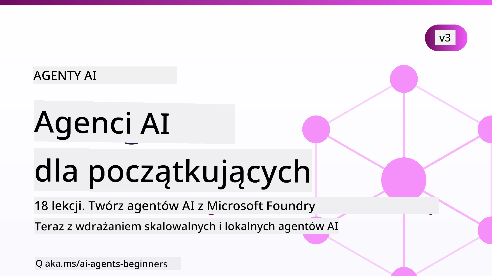

# Agenci AI dla początkujących - Kurs



## Kurs uczący wszystkiego, co musisz wiedzieć, aby zacząć budować agentów AI

[](https://github.com/microsoft/ai-agents-for-beginners/blob/master/LICENSE?WT.mc_id=academic-105485-koreyst)
[](https://GitHub.com/microsoft/ai-agents-for-beginners/graphs/contributors/?WT.mc_id=academic-105485-koreyst)
[](https://GitHub.com/microsoft/ai-agents-for-beginners/issues/?WT.mc_id=academic-105485-koreyst)
[](https://GitHub.com/microsoft/ai-agents-for-beginners/pulls/?WT.mc_id=academic-105485-koreyst)
[](http://makeapullrequest.com?WT.mc_id=academic-105485-koreyst)

### 🌐 Wsparcie wielojęzyczne

#### Wspierane przez GitHub Action (Automatyczne i zawsze aktualne)

<!-- CO-OP TRANSLATOR LANGUAGES TABLE START -->
[Arabski](../ar/README.md) | [Bengalski](../bn/README.md) | [Bułgarski](../bg/README.md) | [Birmański (Myanmar)](../my/README.md) | [Chiński (uproszczony)](../zh-CN/README.md) | [Chiński (tradycyjny, Hongkong)](../zh-HK/README.md) | [Chiński (tradycyjny, Makau)](../zh-MO/README.md) | [Chiński (tradycyjny, Tajwan)](../zh-TW/README.md) | [Chorwacki](../hr/README.md) | [Czeski](../cs/README.md) | [Duński](../da/README.md) | [Niderlandzki](../nl/README.md) | [Estoński](../et/README.md) | [Fiński](../fi/README.md) | [Francuski](../fr/README.md) | [Niemiecki](../de/README.md) | [Grecki](../el/README.md) | [Hebrajski](../he/README.md) | [Hindi](../hi/README.md) | [Węgierski](../hu/README.md) | [Indonezyjski](../id/README.md) | [Włoski](../it/README.md) | [Japoński](../ja/README.md) | [Kannada](../kn/README.md) | [Khmer](../km/README.md) | [Koreański](../ko/README.md) | [Litewski](../lt/README.md) | [Malajski](../ms/README.md) | [Malajalam](../ml/README.md) | [Marathi](../mr/README.md) | [Nepalski](../ne/README.md) | [Nigeryjski Pidgin](../pcm/README.md) | [Norweski](../no/README.md) | [Perski (Farsi)](../fa/README.md) | [Polski](./README.md) | [Portugalski (Brazylia)](../pt-BR/README.md) | [Portugalski (Portugalia)](../pt-PT/README.md) | [Pendżabski (Gurmukhi)](../pa/README.md) | [Rumuński](../ro/README.md) | [Rosyjski](../ru/README.md) | [Serbski (cyrylica)](../sr/README.md) | [Słowacki](../sk/README.md) | [Słoweński](../sl/README.md) | [Hiszpański](../es/README.md) | [Suahili](../sw/README.md) | [Szwedzki](../sv/README.md) | [Tagalog (Filipiński)](../tl/README.md) | [Tamilski](../ta/README.md) | [Telugu](../te/README.md) | [Tajski](../th/README.md) | [Turecki](../tr/README.md) | [Ukraiński](../uk/README.md) | [Urdu](../ur/README.md) | [Wietnamski](../vi/README.md)

> **Wolisz klonować lokalnie?**
>
> To repozytorium zawiera tłumaczenia na ponad 50 języków, co znacznie zwiększa rozmiar pobierania. Aby sklonować bez tłumaczeń, użyj sparse checkout:
>
> **Bash / macOS / Linux:**
> ```bash
> git clone --filter=blob:none --sparse https://github.com/microsoft/ai-agents-for-beginners.git
> cd ai-agents-for-beginners
> git sparse-checkout set --no-cone '/*' '!translations' '!translated_images'
> ```
>
> **CMD (Windows):**
> ```cmd
> git clone --filter=blob:none --sparse https://github.com/microsoft/ai-agents-for-beginners.git
> cd ai-agents-for-beginners
> git sparse-checkout set --no-cone "/*" "!translations" "!translated_images"
> ```
>
> Dzięki temu otrzymujesz wszystko, czego potrzebujesz, aby ukończyć kurs, z dużo szybszym pobieraniem.
<!-- CO-OP TRANSLATOR LANGUAGES TABLE END -->

**Jeśli chcesz, aby wspierane były dodatkowe języki tłumaczeń, znajdziesz je [tutaj](https://github.com/Azure/co-op-translator/blob/main/getting_started/supported-languages.md).**

[](https://GitHub.com/microsoft/ai-agents-for-beginners/watchers/?WT.mc_id=academic-105485-koreyst)
[](https://GitHub.com/microsoft/ai-agents-for-beginners/network/?WT.mc_id=academic-105485-koreyst)
[](https://GitHub.com/microsoft/ai-agents-for-beginners/stargazers/?WT.mc_id=academic-105485-koreyst)

[](https://discord.com/invite/ATgtXmAS5D)


## 🌱 Zacznij tutaj

Ten kurs zawiera lekcje obejmujące podstawy budowy agentów AI. Każda lekcja dotyczy własnego tematu, więc zacznij gdzie chcesz!

Ten kurs ma wsparcie wielojęzyczne. Zobacz nasze [dostępne języki tutaj](#-multi-language-support).

Jeśli to twój pierwszy raz z modelami generatywnej AI, zapoznaj się z naszym kursem [Generative AI For Beginners](https://aka.ms/genai-beginners), który zawiera 21 lekcji o budowie z GenAI.

Nie zapomnij [dać gwiazdki (🌟) temu repo](https://docs.github.com/en/get-started/exploring-projects-on-github/saving-repositories-with-stars?WT.mc_id=academic-105485-koreyst) oraz [forkować tego repo](https://github.com/microsoft/ai-agents-for-beginners/fork), aby uruchomić kod.

### Poznaj innych uczących się, uzyskaj odpowiedzi na swoje pytania

Jeśli utkniesz lub masz pytania dotyczące budowania agentów AI, dołącz do naszego dedykowanego kanału Discord w [Microsoft Foundry Discord](https://aka.ms/ai-agents/discord).

### Czego potrzebujesz

Każda lekcja w tym kursie zawiera przykłady kodu, które znajdziesz w folderze code_samples. Możesz [forkować to repo](https://github.com/microsoft/ai-agents-for-beginners/fork), aby utworzyć własną kopię.

Przykłady kodu w tych ćwiczeniach wykorzystują Microsoft Agent Framework z Microsoft Foundry Agent Service V2:

- [Microsoft Foundry](https://aka.ms/ai-agents-beginners/ai-foundry) - Wymagane konto Azure

Ten kurs korzysta z następujących frameworków i usług AI Agent od Microsoft:

- [Microsoft Agent Framework (MAF)](https://aka.ms/ai-agents-beginners/agent-framework)
- [Microsoft Foundry Agent Service V2](https://aka.ms/ai-agents-beginners/ai-agent-service)

Niektóre przykłady kodu obsługują również alternatywnych dostawców kompatybilnych z OpenAI, jak [MiniMax](https://platform.minimaxi.com/), który oferuje modele z dużym kontekstem (do 204 tys. tokenów). Zobacz [Konfigurację kursu](./00-course-setup/README.md) po szczegóły konfiguracji.

Aby uzyskać więcej informacji o uruchamianiu kodu do tego kursu, przejdź do [Konfiguracji kursu](./00-course-setup/README.md).

## 🙏 Chcesz pomóc?

Masz sugestie lub znalazłeś błędy w pisowni lub kodzie? [Załóż zgłoszenie](https://github.com/microsoft/ai-agents-for-beginners/issues?WT.mc_id=academic-105485-koreyst) lub [stwórz pull request](https://github.com/microsoft/ai-agents-for-beginners/pulls?WT.mc_id=academic-105485-koreyst)


## 📂 Każda lekcja zawiera

- Lekcję pisaną umieszczoną w README oraz krótki film
- Przykłady kodu Python używające Microsoft Agent Framework z Microsoft Foundry
- Linki do dodatkowych zasobów, by kontynuować naukę


## 🗃️ Lekcje

| **Lekcja**                                   | **Tekst i kod**                                    | **Film**                                                  | **Dodatkowa nauka**                                                                     |
|----------------------------------------------|----------------------------------------------------|------------------------------------------------------------|----------------------------------------------------------------------------------------|
| Wprowadzenie do agentów AI i zastosowań agentów | [Link](./01-intro-to-ai-agents/README.md)          | [Film](https://youtu.be/3zgm60bXmQk?si=z8QygFvYQv-9WtO1)  | [Link](https://aka.ms/ai-agents-beginners/collection?WT.mc_id=academic-105485-koreyst) |
| Eksploracja frameworków agentowych           | [Link](./02-explore-agentic-frameworks/README.md)  | [Film](https://youtu.be/ODwF-EZo_O8?si=Vawth4hzVaHv-u0H)  | [Link](https://aka.ms/ai-agents-beginners/collection?WT.mc_id=academic-105485-koreyst) |
| Zrozumienie wzorców projektowych agentów AI   | [Link](./03-agentic-design-patterns/README.md)     | [Film](https://youtu.be/m9lM8qqoOEA?si=BIzHwzstTPL8o9GF)  | [Link](https://aka.ms/ai-agents-beginners/collection?WT.mc_id=academic-105485-koreyst) |
| Wzorzec projektowy użycia narzędzi            | [Link](./04-tool-use/README.md)                    | [Film](https://youtu.be/vieRiPRx-gI?si=2z6O2Xu2cu_Jz46N)  | [Link](https://aka.ms/ai-agents-beginners/collection?WT.mc_id=academic-105485-koreyst) |
| Agentic RAG                                  | [Link](./05-agentic-rag/README.md)                 | [Film](https://youtu.be/WcjAARvdL7I?si=gKPWsQpKiIlDH9A3)  | [Link](https://aka.ms/ai-agents-beginners/collection?WT.mc_id=academic-105485-koreyst) |
| Budowanie godnych zaufania agentów AI           | [Link](./06-building-trustworthy-agents/README.md) | [Film](https://youtu.be/iZKkMEGBCUQ?si=jZjpiMnGFOE9L8OK ) | [Link](https://aka.ms/ai-agents-beginners/collection?WT.mc_id=academic-105485-koreyst) |
| Wzorzec projektowy planowania                   | [Link](./07-planning-design/README.md)             | [Film](https://youtu.be/kPfJ2BrBCMY?si=6SC_iv_E5-mzucnC)  | [Link](https://aka.ms/ai-agents-beginners/collection?WT.mc_id=academic-105485-koreyst) |
| Wzorzec projektowy multi-agentowy               | [Link](./08-multi-agent/README.md)                 | [Film](https://youtu.be/V6HpE9hZEx0?si=rMgDhEu7wXo2uo6g)  | [Link](https://aka.ms/ai-agents-beginners/collection?WT.mc_id=academic-105485-koreyst) |

| Wzorzec Projektowy Metapoznawczy                 | [Link](./09-metacognition/README.md)               | [Wideo](https://youtu.be/His9R6gw6Ec?si=8gck6vvdSNCt6OcF)  | [Link](https://aka.ms/ai-agents-beginners/collection?WT.mc_id=academic-105485-koreyst) |
| Agent AI w Produkcji                      | [Link](./10-ai-agents-production/README.md)        | [Wideo](https://youtu.be/l4TP6IyJxmQ?si=31dnhexRo6yLRJDl)  | [Link](https://aka.ms/ai-agents-beginners/collection?WT.mc_id=academic-105485-koreyst) |
| Korzystanie z Protokółów Agentowych (MCP, A2A i NLWeb) | [Link](./11-agentic-protocols/README.md)           | [Wideo](https://youtu.be/X-Dh9R3Opn8)                                 | [Link](https://aka.ms/ai-agents-beginners/collection?WT.mc_id=academic-105485-koreyst) |
| Inżynieria Kontekstu dla Agentów AI            | [Link](./12-context-engineering/README.md)         | [Wideo](https://youtu.be/F5zqRV7gEag)                                 | [Link](https://aka.ms/ai-agents-beginners/collection?WT.mc_id=academic-105485-koreyst) |
| Zarządzanie Pamięcią Agentową                      | [Link](./13-agent-memory/README.md)     |      [Wideo](https://youtu.be/QrYbHesIxpw?si=vZkVwKrQ4ieCcIPx)                                                      |                                                                                        |
| Eksploracja Microsoft Agent Framework                         | [Link](./14-microsoft-agent-framework/README.md)                            |                                                            |                                                                                        |
| Budowanie Agentów do Użytku Komputerowego (CUA)           | [Link](./15-browser-use/README.md)     |                                                            | [Link](https://docs.browser-use.com/examples/templates/playwright-integration)         |
| Wdrażanie Skalowalnych Agentów                    | [Link](./16-deploying-scalable-agents/README.md) |                                                    | [Link](https://learn.microsoft.com/azure/ai-foundry/agents/overview)                   |
| Tworzenie Lokalnych Agentów AI                     | [Link](./17-creating-local-ai-agents/README.md)  |                                                    | [Link](https://learn.microsoft.com/azure/ai-foundry/foundry-local/)                    |
| Zabezpieczanie Agentów AI                           | [Link](./18-securing-ai-agents/README.md)  |                                                            | [Link](https://aka.ms/ai-agents-beginners/collection?WT.mc_id=academic-105485-koreyst) |

## 🎒 Inne Kursy

Nasz zespół tworzy również inne kursy! Sprawdź:

<!-- CO-OP TRANSLATOR OTHER COURSES START -->
### LangChain
[](https://aka.ms/langchain4j-for-beginners)
[](https://aka.ms/langchainjs-for-beginners?WT.mc_id=m365-94501-dwahlin)
[](https://github.com/microsoft/langchain-for-beginners?WT.mc_id=m365-94501-dwahlin)
---

### Azure / Edge / MCP / Agenci
[](https://github.com/microsoft/AZD-for-beginners?WT.mc_id=academic-105485-koreyst)
[](https://github.com/microsoft/edgeai-for-beginners?WT.mc_id=academic-105485-koreyst)
[](https://github.com/microsoft/mcp-for-beginners?WT.mc_id=academic-105485-koreyst)
[](https://github.com/microsoft/ai-agents-for-beginners?WT.mc_id=academic-105485-koreyst)

---
 
### Seria Generative AI
[](https://github.com/microsoft/generative-ai-for-beginners?WT.mc_id=academic-105485-koreyst)
[-9333EA?style=for-the-badge&labelColor=E5E7EB&color=9333EA)](https://github.com/microsoft/Generative-AI-for-beginners-dotnet?WT.mc_id=academic-105485-koreyst)
[-C084FC?style=for-the-badge&labelColor=E5E7EB&color=C084FC)](https://github.com/microsoft/generative-ai-for-beginners-java?WT.mc_id=academic-105485-koreyst)
[-E879F9?style=for-the-badge&labelColor=E5E7EB&color=E879F9)](https://github.com/microsoft/generative-ai-with-javascript?WT.mc_id=academic-105485-koreyst)

---
 
### Podstawowe Nauczanie
[](https://aka.ms/ml-beginners?WT.mc_id=academic-105485-koreyst)
[](https://aka.ms/datascience-beginners?WT.mc_id=academic-105485-koreyst)
[](https://aka.ms/ai-beginners?WT.mc_id=academic-105485-koreyst)
[](https://github.com/microsoft/Security-101?WT.mc_id=academic-96948-sayoung)
[](https://aka.ms/webdev-beginners?WT.mc_id=academic-105485-koreyst)
[](https://aka.ms/iot-beginners?WT.mc_id=academic-105485-koreyst)
[](https://github.com/microsoft/xr-development-for-beginners?WT.mc_id=academic-105485-koreyst)

---
 
### Seria Copilot
[](https://aka.ms/GitHubCopilotAI?WT.mc_id=academic-105485-koreyst)
[](https://github.com/microsoft/mastering-github-copilot-for-dotnet-csharp-developers?WT.mc_id=academic-105485-koreyst)
[](https://github.com/microsoft/CopilotAdventures?WT.mc_id=academic-105485-koreyst)
<!-- CO-OP TRANSLATOR OTHER COURSES END -->

## 🌟 Podziękowania dla Społeczności

Podziękowania dla [Shivam Goyal](https://www.linkedin.com/in/shivam2003/) za wkład w ważne przykłady kodu demonstrujące Agentic RAG. 

## Wkład

Ten projekt zachęca do wkładów i sugestii. Większość wkładów wymaga zgody na
Umowę Licencyjną Współpracownika (CLA) oświadczającą, że masz prawo i rzeczywiście udzielasz nam
praw do korzystania z Twojego wkładu. Szczegóły znajdziesz na <https://cla.opensource.microsoft.com>.

Gdy prześlesz pull request, bot CLA automatycznie określi, czy musisz dostarczyć
CLA i odpowiednio oznaczy PR (np. status check, komentarz). Wystarczy postępować zgodnie z instrukcjami
dostarczonymi przez bota. Będziesz musiał to zrobić tylko raz niezależnie od liczby repozytoriów korzystających z naszego CLA.

Ten projekt przyjął [Microsoft Open Source Code of Conduct](https://opensource.microsoft.com/codeofconduct/).
Po więcej informacji zobacz [Code of Conduct FAQ](https://opensource.microsoft.com/codeofconduct/faq/) lub
skontaktuj się z [opencode@microsoft.com](mailto:opencode@microsoft.com) w razie dodatkowych pytań lub uwag.

## Znaki Towarowe

Ten projekt może zawierać znaki towarowe lub loga projektów, produktów lub usług. Autoryzowane użycie znaków towarowych Microsoft
podlega i musi przestrzegać
[Microsoft's Trademark & Brand Guidelines](https://www.microsoft.com/legal/intellectualproperty/trademarks/usage/general).
Użycie znaków towarowych lub logotypów Microsoft w zmodyfikowanych wersjach tego projektu nie może powodować zamieszania ani sugerować sponsorowania przez Microsoft.
Każde użycie znaków towarowych lub logotypów stron trzecich podlega politykom tych stron trzecich.

## Uzyskanie Pomocy


Jeśli utkniesz lub masz pytania dotyczące tworzenia aplikacji AI, dołącz do:

[](https://aka.ms/foundry/discord)

Jeśli masz opinię o produkcie lub błędy podczas tworzenia, odwiedź:

[](https://aka.ms/foundry/forum)

---

<!-- CO-OP TRANSLATOR DISCLAIMER START -->
**Zastrzeżenie**:
Niniejszy dokument został przetłumaczony za pomocą usługi tłumaczenia AI [Co-op Translator](https://github.com/Azure/co-op-translator). Choć dążymy do dokładności, prosimy pamiętać, że automatyczne tłumaczenia mogą zawierać błędy lub niedokładności. Oryginalny dokument w jego języku źródłowym należy uznawać za autorytatywne źródło. W przypadku informacji krytycznych zalecane jest skorzystanie z profesjonalnego tłumaczenia wykonanego przez człowieka. Nie ponosimy odpowiedzialności za jakiekolwiek nieporozumienia lub błędne interpretacje wynikające z użycia tego tłumaczenia.
<!-- CO-OP TRANSLATOR DISCLAIMER END -->