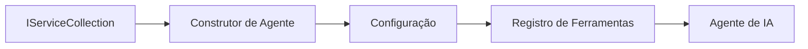

# 🎨 Padrões de Design Agentic com Azure OpenAI (Responses API) (.NET)

## 📋 Objetivos de Aprendizagem

Este exemplo demonstra padrões de design para empresas de alto nível para construir agentes inteligentes usando o Microsoft Agent Framework em .NET integrado com Azure OpenAI (Responses API). Você aprenderá padrões profissionais e abordagens arquitetônicas que tornam os agentes prontos para produção, fáceis de manter e escaláveis.

### Padrões Empresariais

- 🏭 **Factory Pattern**: Criação padronizada de agentes com injeção de dependência
- 🔧 **Builder Pattern**: Configuração e montagem fluente do agente
- 🧵 **Padrões Thread-Safe**: Gerenciamento concorrente de conversas
- 📋 **Repository Pattern**: Gerenciamento organizado de ferramentas e capacidades

## 🎯 Benefícios Arquiteturais Específicos do .NET

### Recursos Empresariais

- **Tipagem Forte**: Validação em tempo de compilação e suporte a IntelliSense
- **Injeção de Dependência**: Integração com contêiner DI embutido
- **Gerenciamento de Configuração**: Padrões IConfiguration e Options
- **Async/Await**: Suporte nativo e de primeira classe para programação assíncrona

### Padrões Prontos para Produção

- **Integração de Logging**: ILogger e suporte a logging estruturado
- **Health Checks**: Monitoramento e diagnóstico embutidos
- **Validação de Configuração**: Tipagem forte com anotações de dados
- **Tratamento de Erros**: Gerenciamento estruturado de exceções

## 🔧 Arquitetura Técnica

### Componentes Principais do .NET

- **Microsoft.Extensions.AI**: Abstrações unificadas de serviços de IA
- **Microsoft.Agents.AI**: Framework empresarial de orquestração de agentes
- **Azure OpenAI (Responses API)**: Padrões de cliente API de alto desempenho
- **Sistema de Configuração**: appsettings.json e integração com ambiente

### Implementação de Padrões de Design



## 🏗️ Padrões Empresariais Demonstrados

### 1. **Padrões Criacionais**

- **Agent Factory**: Criação centralizada de agentes com configuração consistente
- **Builder Pattern**: API fluente para configuração complexa de agentes
- **Singleton Pattern**: Recursos compartilhados e gerenciamento de configuração
- **Injeção de Dependência**: Baixo acoplamento e testabilidade

### 2. **Padrões Comportamentais**

- **Strategy Pattern**: Estratégias intercambiáveis para execução de ferramentas
- **Command Pattern**: Operações encapsuladas do agente com desfazer/refazer
- **Observer Pattern**: Gerenciamento do ciclo de vida do agente orientado a eventos
- **Template Method**: Fluxos de execução padronizados do agente

### 3. **Padrões Estruturais**

- **Adapter Pattern**: Camada de integração com Azure OpenAI (Responses API)
- **Decorator Pattern**: Aprimoramento das capacidades do agente
- **Facade Pattern**: Interfaces simplificadas de interação do agente
- **Proxy Pattern**: Carregamento preguiçoso e caching para desempenho

## 📚 Princípios de Design do .NET

### Princípios SOLID

- **Responsabilidade Única**: Cada componente tem um propósito claro
- **Aberto/Fechado**: Extensível sem modificações
- **Substituição de Liskov**: Implementações de ferramentas baseadas em interfaces
- **Segregação de Interface**: Interfaces focadas e coesas
- **Inversão de Dependência**: Depender de abstrações, não de concreções

### Arquitetura Limpa

- **Camada de Domínio**: Abstrações centrais de agentes e ferramentas
- **Camada de Aplicação**: Orquestração e fluxos de trabalho do agente
- **Camada de Infraestrutura**: Integração com Azure OpenAI (Responses API) e serviços externos
- **Camada de Apresentação**: Interação com o usuário e formatação de respostas

## 🔒 Considerações Empresariais

### Segurança

- **Gerenciamento de Credenciais**: Manuseio seguro de chaves API com IConfiguration
- **Validação de Entrada**: Tipagem forte e validação por anotações de dados
- **Sanitização de Saída**: Processamento e filtragem seguros das respostas
- **Logging de Auditoria**: Rastreabilidade abrangente das operações

### Desempenho

- **Padrões Async**: Operações de I/O não bloqueantes
- **Pooling de Conexões**: Gerenciamento eficiente do cliente HTTP
- **Caching**: Cache de respostas para melhor desempenho
- **Gerenciamento de Recursos**: Padrões corretos de descarte e limpeza

### Escalabilidade

- **Segurança de Thread**: Suporte à execução concorrente do agente
- **Pooling de Recursos**: Utilização eficiente de recursos
- **Gerenciamento de Carga**: Limitação de taxa e controle de pressão
- **Monitoramento**: Métricas de desempenho e health checks

## 🚀 Implantação em Produção

- **Gerenciamento de Configuração**: Configurações específicas do ambiente
- **Estratégia de Logging**: Logging estruturado com IDs de correlação
- **Tratamento de Erros**: Gerenciamento global de exceções com recuperação adequada
- **Monitoramento**: Insights da aplicação e contadores de desempenho
- **Testes**: Testes unitários, integração e padrões de teste de carga

Pronto para construir agentes inteligentes empresariais com .NET? Vamos arquitetar algo robusto! 🏢✨

## 🚀 Começando

### Pré-requisitos

- [.NET 10 SDK](https://dotnet.microsoft.com/download/dotnet/10.0) ou superior
- Uma [assinatura do Azure](https://azure.microsoft.com/free/) com um recurso Azure OpenAI e um modelo implantado
- O [Azure CLI](https://learn.microsoft.com/cli/azure/install-azure-cli) — faça login com `az login`

### Variáveis de Ambiente Necessárias

```bash
# zsh/bash
export AZURE_OPENAI_ENDPOINT=https://<your-resource>.openai.azure.com
export AZURE_OPENAI_DEPLOYMENT=gpt-4.1-mini
# Em seguida, faça login para que o AzureCliCredential possa obter um token
az login
```

```powershell
# PowerShell
$env:AZURE_OPENAI_ENDPOINT = "https://<your-resource>.openai.azure.com"
$env:AZURE_OPENAI_DEPLOYMENT = "gpt-4.1-mini"
# Em seguida, faça login para que o AzureCliCredential possa obter um token
az login
```

### Código de Exemplo

Para executar o exemplo de código,

```bash
# zsh/bash
chmod +x ./03-dotnet-agent-framework.cs
./03-dotnet-agent-framework.cs
```

Ou usando o CLI dotnet:

```bash
dotnet run ./03-dotnet-agent-framework.cs
```

Veja [`03-dotnet-agent-framework.cs`](../../../../03-agentic-design-patterns/code_samples/03-dotnet-agent-framework.cs) para o código completo.

```csharp
#!/usr/bin/dotnet run

#:package Microsoft.Extensions.AI@10.*
#:package Microsoft.Agents.AI.OpenAI@1.*-*
#:package Azure.AI.OpenAI@2.1.0
#:package Azure.Identity@1.13.1

using System.ComponentModel;

using Microsoft.Agents.AI;
using Microsoft.Extensions.AI;

using Azure.AI.OpenAI;
using Azure.Identity;

// Tool Function: Random Destination Generator
// This static method will be available to the agent as a callable tool
// The [Description] attribute helps the AI understand when to use this function
// This demonstrates how to create custom tools for AI agents
[Description("Provides a random vacation destination.")]
static string GetRandomDestination()
{
    // List of popular vacation destinations around the world
    // The agent will randomly select from these options
    var destinations = new List<string>
    {
        "Paris, France",
        "Tokyo, Japan",
        "New York City, USA",
        "Sydney, Australia",
        "Rome, Italy",
        "Barcelona, Spain",
        "Cape Town, South Africa",
        "Rio de Janeiro, Brazil",
        "Bangkok, Thailand",
        "Vancouver, Canada"
    };

    // Generate random index and return selected destination
    // Uses System.Random for simple random selection
    var random = new Random();
    int index = random.Next(destinations.Count);
    return destinations[index];
}

// Azure OpenAI with the Responses API (stable v1 endpoint). Sign in with `az login`.
var azureEndpoint = Environment.GetEnvironmentVariable("AZURE_OPENAI_ENDPOINT")
    ?? throw new InvalidOperationException("AZURE_OPENAI_ENDPOINT is not set.");
var deployment = Environment.GetEnvironmentVariable("AZURE_OPENAI_DEPLOYMENT") ?? "gpt-4.1-mini";

var azureClient = new AzureOpenAIClient(new Uri(azureEndpoint), new AzureCliCredential());

// Define Agent Identity and Comprehensive Instructions
// Agent name for identification and logging purposes
var AGENT_NAME = "TravelAgent";

// Detailed instructions that define the agent's personality, capabilities, and behavior
// This system prompt shapes how the agent responds and interacts with users
var AGENT_INSTRUCTIONS = """
You are a helpful AI Agent that can help plan vacations for customers.

Important: When users specify a destination, always plan for that location. Only suggest random destinations when the user hasn't specified a preference.

When the conversation begins, introduce yourself with this message:
"Hello! I'm your TravelAgent assistant. I can help plan vacations and suggest interesting destinations for you. Here are some things you can ask me:
1. Plan a day trip to a specific location
2. Suggest a random vacation destination
3. Find destinations with specific features (beaches, mountains, historical sites, etc.)
4. Plan an alternative trip if you don't like my first suggestion

What kind of trip would you like me to help you plan today?"

Always prioritize user preferences. If they mention a specific destination like "Bali" or "Paris," focus your planning on that location rather than suggesting alternatives.
""";

// Create AI Agent with Advanced Travel Planning Capabilities
// Get the Responses client for the deployment and create the AI agent
// Configure agent with name, detailed instructions, and available tools
// This demonstrates the .NET agent creation pattern with full configuration
AIAgent agent = azureClient
    .GetChatClient(deployment)
    .AsAIAgent(
        name: AGENT_NAME,
        instructions: AGENT_INSTRUCTIONS,
        tools: [AIFunctionFactory.Create(GetRandomDestination)]
    );

// Create New Conversation Session for Context Management
// Initialize a new conversation session to maintain context across multiple interactions
// Sessions enable the agent to remember previous exchanges and maintain conversational state
// This is essential for multi-turn conversations and contextual understanding
var session = await agent.CreateSessionAsync();

// Execute Agent: First Travel Planning Request
// Run the agent with an initial request that will likely trigger the random destination tool
// The agent will analyze the request, use the GetRandomDestination tool, and create an itinerary
// Using the session parameter maintains conversation context for subsequent interactions
await foreach (var update in agent.RunStreamingAsync("Plan me a day trip", session))
{
    await Task.Delay(10);
    Console.Write(update);
}

Console.WriteLine();

// Execute Agent: Follow-up Request with Context Awareness
// Demonstrate contextual conversation by referencing the previous response
// The agent remembers the previous destination suggestion and will provide an alternative
// This showcases the power of conversation sessions and contextual understanding in .NET agents
await foreach (var update in agent.RunStreamingAsync("I don't like that destination. Plan me another vacation.", session))
{
    await Task.Delay(10);
    Console.Write(update);
}
```

---

<!-- CO-OP TRANSLATOR DISCLAIMER START -->
**Aviso Legal**:
Este documento foi traduzido usando o serviço de tradução por IA [Co-op Translator](https://github.com/Azure/co-op-translator). Embora nos esforcemos pela precisão, por favor, esteja ciente de que traduções automatizadas podem conter erros ou imprecisões. O documento original em seu idioma nativo deve ser considerado a fonte autorizada. Para informações críticas, recomenda-se tradução profissional humana. Não nos responsabilizamos por quaisquer mal-entendidos ou interpretações incorretas decorrentes do uso desta tradução.
<!-- CO-OP TRANSLATOR DISCLAIMER END -->