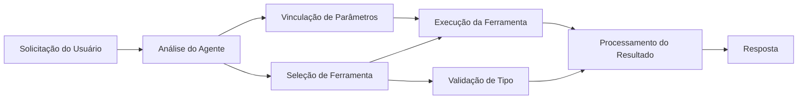

# 🛠️ Uso Avançado de Ferramentas com Azure OpenAI (Responses API) (.NET)

## 📋 Objetivos de Aprendizagem

Este notebook demonstra padrões de integração de ferramentas em nível empresarial usando o Microsoft Agent Framework em .NET com Azure OpenAI (Responses API). Você aprenderá a construir agentes sofisticados com múltiplas ferramentas especializadas, aproveitando a tipagem forte do C# e os recursos empresariais do .NET.

### Capacidades Avançadas de Ferramentas que Você Irá Dominar

- 🔧 **Arquitetura Multi-Ferramenta**: Construção de agentes com múltiplas capacidades especializadas
- 🎯 **Execução de Ferramentas com Segurança de Tipo**: Aproveitando a validação em tempo de compilação do C#
- 📊 **Padrões de Ferramentas Empresariais**: Design de ferramentas prontas para produção e tratamento de erros
- 🔗 **Composição de Ferramentas**: Combinando ferramentas para fluxos de trabalho complexos de negócios

## 🎯 Benefícios da Arquitetura de Ferramentas em .NET

### Recursos de Ferramentas Empresariais

- **Validação em Tempo de Compilação**: Tipagem forte garante a correção dos parâmetros das ferramentas
- **Injeção de Dependência**: Integração com contêiner IoC para gerenciamento de ferramentas
- **Padrões Async/Await**: Execução não bloqueante de ferramentas com gerenciamento adequado de recursos
- **Registro Estruturado**: Integração nativa de logging para monitoramento da execução das ferramentas

### Padrões Prontos para Produção

- **Tratamento de Exceções**: Gerenciamento abrangente de erros com exceções tipadas
- **Gerenciamento de Recursos**: Padrões adequados de descarte e gerenciamento de memória
- **Monitoramento de Performance**: Métricas integradas e contadores de desempenho
- **Gerenciamento de Configuração**: Configuração com segurança de tipo e validação

## 🔧 Arquitetura Técnica

### Componentes Centrais das Ferramentas .NET

- **Microsoft.Extensions.AI**: Camada de abstração unificada para ferramentas
- **Microsoft.Agents.AI**: Orquestração de ferramentas em nível empresarial
- **Azure OpenAI (Responses API)**: Cliente API de alto desempenho com pool de conexões

### Pipeline de Execução das Ferramentas



## 🛠️ Categorias & Padrões de Ferramentas

### 1. **Ferramentas de Processamento de Dados**

- **Validação de Entrada**: Tipagem forte com anotações de dados
- **Operações de Transformação**: Conversão e formatação de dados com segurança de tipo
- **Lógica de Negócios**: Ferramentas de cálculo e análise específicas do domínio
- **Formatação de Saída**: Geração estruturada de respostas

### 2. **Ferramentas de Integração** 

- **Conectores de API**: Integração de serviços RESTful com HttpClient
- **Ferramentas de Banco de Dados**: Integração com Entity Framework para acesso a dados
- **Operações com Arquivos**: Operações seguras no sistema de arquivos com validação
- **Serviços Externos**: Padrões de integração com serviços de terceiros

### 3. **Ferramentas Utilitárias**

- **Processamento de Texto**: Utilitários de manipulação e formatação de strings
- **Operações de Data/Hora**: Cálculos de data/hora sensíveis à cultura
- **Ferramentas Matemáticas**: Cálculos de precisão e operações estatísticas
- **Ferramentas de Validação**: Validação de regras de negócio e verificação de dados

Pronto para construir agentes em nível empresarial com ferramentas poderosas e seguras em termos de tipo em .NET? Vamos arquitetar algumas soluções profissionais! 🏢⚡

## 🚀 Começando

### Pré-requisitos

- [SDK .NET 10](https://dotnet.microsoft.com/download/dotnet/10.0) ou superior
- Uma [assinatura Azure](https://azure.microsoft.com/free/) com um recurso Azure OpenAI e uma implantação de modelo
- A [CLI do Azure](https://learn.microsoft.com/cli/azure/install-azure-cli) — faça login com `az login`

### Variáveis de Ambiente Necessárias

```bash
# zsh/bash
export AZURE_OPENAI_ENDPOINT=https://<your-resource>.openai.azure.com
export AZURE_OPENAI_DEPLOYMENT=gpt-5-mini
# Então faça login para que AzureCliCredential possa obter um token
az login
```

```powershell
# PowerShell
$env:AZURE_OPENAI_ENDPOINT = "https://<your-resource>.openai.azure.com"
$env:AZURE_OPENAI_DEPLOYMENT = "gpt-5-mini"
# Em seguida, faça login para que o AzureCliCredential possa obter um token
az login
```

### Código de Exemplo

Para executar o exemplo de código,

```bash
# zsh/bash
chmod +x ./04-dotnet-agent-framework.cs
./04-dotnet-agent-framework.cs
```

Ou usando a CLI dotnet:

```bash
dotnet run ./04-dotnet-agent-framework.cs
```

Veja [`04-dotnet-agent-framework.cs`](../../../../04-tool-use/code_samples/04-dotnet-agent-framework.cs) para o código completo.

```csharp
#!/usr/bin/dotnet run

#:package Microsoft.Extensions.AI@10.*
#:package Microsoft.Agents.AI.OpenAI@1.*-*
#:package Azure.AI.OpenAI@2.1.0
#:package Azure.Identity@1.13.1

using System.ComponentModel;

using Microsoft.Agents.AI;
using Microsoft.Extensions.AI;

using Azure.AI.OpenAI;
using Azure.Identity;

// Tool Function: Random Destination Generator
// This static method will be available to the agent as a callable tool
// The [Description] attribute helps the AI understand when to use this function
// This demonstrates how to create custom tools for AI agents
[Description("Provides a random vacation destination.")]
static string GetRandomDestination()
{
    // List of popular vacation destinations around the world
    // The agent will randomly select from these options
    var destinations = new List<string>
    {
        "Paris, France",
        "Tokyo, Japan",
        "New York City, USA",
        "Sydney, Australia",
        "Rome, Italy",
        "Barcelona, Spain",
        "Cape Town, South Africa",
        "Rio de Janeiro, Brazil",
        "Bangkok, Thailand",
        "Vancouver, Canada"
    };

    // Generate random index and return selected destination
    // Uses System.Random for simple random selection
    var random = new Random();
    int index = random.Next(destinations.Count);
    return destinations[index];
}

// Azure OpenAI with the Responses API (stable v1 endpoint). Sign in with `az login`.
var azureEndpoint = Environment.GetEnvironmentVariable("AZURE_OPENAI_ENDPOINT")
    ?? throw new InvalidOperationException("AZURE_OPENAI_ENDPOINT is not set.");
var deployment = Environment.GetEnvironmentVariable("AZURE_OPENAI_DEPLOYMENT") ?? "gpt-5-mini";

var azureClient = new AzureOpenAIClient(new Uri(azureEndpoint), new AzureCliCredential());

// Define Agent Identity and Comprehensive Instructions
// Agent name for identification and logging purposes
var AGENT_NAME = "TravelAgent";

// Detailed instructions that define the agent's personality, capabilities, and behavior
// This system prompt shapes how the agent responds and interacts with users
var AGENT_INSTRUCTIONS = """
You are a helpful AI Agent that can help plan vacations for customers.

Important: When users specify a destination, always plan for that location. Only suggest random destinations when the user hasn't specified a preference.

When the conversation begins, introduce yourself with this message:
"Hello! I'm your TravelAgent assistant. I can help plan vacations and suggest interesting destinations for you. Here are some things you can ask me:
1. Plan a day trip to a specific location
2. Suggest a random vacation destination
3. Find destinations with specific features (beaches, mountains, historical sites, etc.)
4. Plan an alternative trip if you don't like my first suggestion

What kind of trip would you like me to help you plan today?"

Always prioritize user preferences. If they mention a specific destination like "Bali" or "Paris," focus your planning on that location rather than suggesting alternatives.
""";

// Create AI Agent with Advanced Travel Planning Capabilities
// Get the Responses client for the deployment and create the AI agent
// Configure agent with name, detailed instructions, and available tools
// This demonstrates the .NET agent creation pattern with full configuration
AIAgent agent = azureClient
    .GetChatClient(deployment)
    .AsAIAgent(
        name: AGENT_NAME,
        instructions: AGENT_INSTRUCTIONS,
        tools: [AIFunctionFactory.Create(GetRandomDestination)]
    );

// Create New Conversation Session for Context Management
// Initialize a new conversation session to maintain context across multiple interactions
// Sessions enable the agent to remember previous exchanges and maintain conversational state
// This is essential for multi-turn conversations and contextual understanding
await using var session = await agent.CreateSessionAsync();

// Execute Agent: First Travel Planning Request
// Run the agent with an initial request that will likely trigger the random destination tool
// The agent will analyze the request, use the GetRandomDestination tool, and create an itinerary
// Using the session parameter maintains conversation context for subsequent interactions
await foreach (var update in agent.RunStreamingAsync("Plan me a day trip", session))
{
    await Task.Delay(10);
    Console.Write(update);
}

Console.WriteLine();

// Execute Agent: Follow-up Request with Context Awareness
// Demonstrate contextual conversation by referencing the previous response
// The agent remembers the previous destination suggestion and will provide an alternative
// This showcases the power of conversation sessions and contextual understanding in .NET agents
await foreach (var update in agent.RunStreamingAsync("I don't like that destination. Plan me another vacation.", session))
{
    await Task.Delay(10);
    Console.Write(update);
}
```

---

<!-- CO-OP TRANSLATOR DISCLAIMER START -->
**Aviso Legal**:
Este documento foi traduzido usando o serviço de tradução por IA [Co-op Translator](https://github.com/Azure/co-op-translator). Embora nos esforcemos pela precisão, por favor, esteja ciente de que traduções automatizadas podem conter erros ou imprecisões. O documento original em seu idioma nativo deve ser considerado a fonte autorizada. Para informações críticas, recomenda-se tradução profissional humana. Não nos responsabilizamos por quaisquer mal-entendidos ou interpretações incorretas decorrentes do uso desta tradução.
<!-- CO-OP TRANSLATOR DISCLAIMER END -->