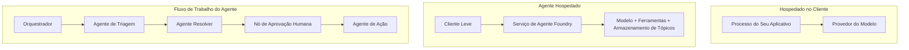
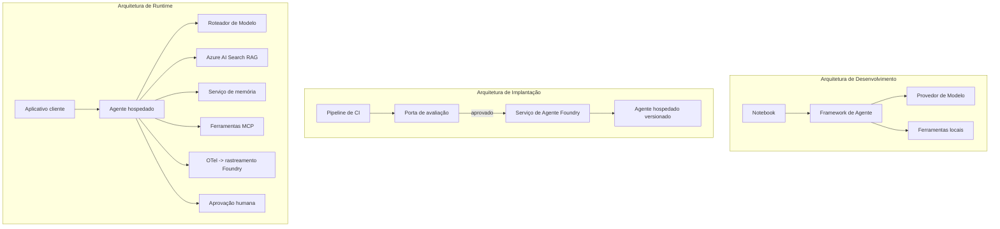

# Implantando Agentes Escaláveis com Microsoft Foundry


Até este ponto do curso, você construiu agentes que rodam no seu laptop, dentro de um notebook, acionados pelo `az login` e algumas variáveis de ambiente. Essa é exatamente a maneira certa de aprender. Não é a maneira certa de executar um agente do qual milhares de clientes dependem às 3 da manhã.

Esta lição aborda a lacuna entre "funciona na minha máquina" e "funciona, de forma confiável e acessível, em produção." Fechamos essa lacuna usando o **Microsoft Foundry** e o **Microsoft Foundry Agent Service**, e fazemos isso construindo um agente real de suporte ao cliente que possui ferramentas, recuperação, memória, avaliação e monitoramento.

## Introdução

Esta lição abordará:

- A diferença entre um **agente protótipo** e um **agente implantado**, e por que a transição envolve principalmente tudo *em torno* do modelo.
- **Padrões de implantação** para agentes: hospedados no cliente, hospedados como serviço (Agentes Hospedados) e orquestrados via fluxos de trabalho.
- O **ciclo de vida do agente** no Microsoft Foundry — criar, versionar, implantar, avaliar, observar, aposentar.
- **Estratégias de escalonamento**: roteamento de modelo, cache, concorrência e design sem estado.
- **Observabilidade** com OpenTelemetry e rastreamento Foundry.
- **Otimização de custos** por meio da seleção de modelo, roteamento e portões de avaliação.
- **Considerações empresariais**: governança, aprovação humana e execução segura de servidores MCP em produção.

## Objetivos de Aprendizagem

Após completar esta lição, você saberá como:

- Escolher o padrão de implantação correto para uma determinada carga de trabalho de agente.
- Implantar um agente no Microsoft Foundry Agent Service para que ele seja versionado, governado e observável.
- Instrumentar um agente para rastreamento e conectar um pipeline de avaliação que roda antes de cada lançamento.
- Aplicar roteamento e cache de modelos para manter a latência e os custos sob controle em escala.
- Adicionar um portão de aprovação humana para ações de alto risco e integrar um servidor MCP de maneira segura para produção.

## Pré-requisitos

Esta lição assume que você completou as lições anteriores e está confortável com:

- Construir agentes com o [Microsoft Agent Framework](../14-microsoft-agent-framework/README.md) (Lição 14).
- [Uso de Ferramentas](../04-tool-use/README.md) (Lição 4) e [Agentic RAG](../05-agentic-rag/README.md) (Lição 5).
- [Memória de Agente](../13-agent-memory/README.md) (Lição 13) e [Protocolos Agentic / MCP](../11-agentic-protocols/README.md) (Lição 11).
- [Observabilidade e Avaliação](../10-ai-agents-production/README.md) (Lição 10) — esta lição se baseia diretamente nela.

Você também precisará de:

- Uma **assinatura Azure** e um **projeto Microsoft Foundry** com pelo menos um modelo de chat implantado.
- A **CLI do Azure** autenticada (`az login`).
- Python 3.12+ e os pacotes no repositório [`requirements.txt`](../../../requirements.txt).

## Do Protótipo à Produção: O Que Realmente Muda

Um agente protótipo e um agente em produção compartilham o mesmo loop central — raciocinar, chamar ferramentas, responder. O que muda é tudo o que envolve esse loop. O modelo é talvez 20% de um agente em produção; os outros 80% são o esqueleto operacional.

| Preocupação | Protótipo | Produção |
| --- | --- | --- |
| **Hospedagem** | Roda no seu notebook | Roda como um serviço hospedado, versionado e implantado |
| **Identidade** | Seu token do `az login` | Identidade gerenciada com RBAC escopo |
| **Estado** | Na memória, perdido ao reiniciar | Externalizado (armazenamento de threads, serviço de memória) |
| **Falhas** | Você vê o rastreamento de erro | Retentativas, alternativas, lista de mensagens falhadas, alertas |
| **Custo** | "É alguns centavos" | Monitorado por solicitação, roteado, armazenado em cache, orçado |
| **Qualidade** | Você avalia visualmente a saída | Avaliado automaticamente antes de cada lançamento |
| **Confiança** | Você aprova toda ação | Política + humano no loop para ações de risco |

Mantenha esta tabela em mente. Cada seção abaixo corresponde a uma destas linhas.

## Padrões de Implantação de Agentes

Existem três padrões que você usará, frequentemente em combinação.

### 1. Agentes Hospedados no Cliente

O objeto agente vive dentro do processo *da sua* aplicação. Seu código chama diretamente o provedor do modelo; o loop de raciocínio roda no seu serviço. Isso é o que todas as lições anteriores fizeram.

- **Use quando** precisar de controle total sobre o loop, middleware customizado ou estiver incorporando o agente dentro de um backend existente.
- **Compromisso**: você assume o escalonamento, estado e resiliência.

### 2. Agentes Hospedados (Foundry Agent Service)

O agente é *registrado como um recurso* no Microsoft Foundry. O Foundry hospeda o loop de raciocínio, armazena as threads, impõe segurança de conteúdo e RBAC, e torna o agente visível no portal Foundry. Seu app se torna um cliente leve que cria threads e lê respostas.

- **Use quando** quiser durabilidade, observabilidade incorporada, governança e menor superfície operacional.
- **Compromisso**: menos controle de baixo nível em troca de um runtime gerenciado.

### 3. Fluxos de Trabalho de Agentes

Múltiplos agentes (e ferramentas) são compostos em um grafo com fluxo de controle explícito — etapas sequenciais, ramificações, nós de aprovação humana e checkpoints duráveis que podem pausar e retomar. Esta é a capacidade **Workflows** do Microsoft Agent Framework aplicada em escala de implantação.

- **Use quando** uma única tarefa abrange vários agentes especializados ou requer uma etapa de aprovação no meio.
- **Compromisso**: mais partes móveis; precisa de observabilidade em nível de orquestração.



## O Ciclo de Vida do Agente no Microsoft Foundry

Implantar um agente não é um `push` único. É um loop, e se parece muito com um ciclo de lançamento de software porque é exatamente isso.


A ideia central, trazida da [Lição 10](../10-ai-agents-production/README.md): **avaliação offline é um portão, não um pensamento posterior.** Uma nova versão do agente não é lançada a menos que ultrapasse seus limiares de avaliação. A observabilidade online então alimenta falhas do mundo real de volta ao seu conjunto de testes offline. Esse é o ciclo completo.

## Estratégias de Escalonamento

Escalar um agente é diferente de escalar uma API web sem estado, porque cada solicitação pode acionar múltiplas chamadas caras a modelos e ferramentas. Quatro técnicas carregam a maior parte da carga.

**Manipulação sem estado da solicitação.** Não mantenha estado por usuário na memória do seu processo. Persista conversas no armazenamento de threads do Foundry ou em um serviço de memória para que qualquer instância possa atender qualquer solicitação. Isso permite escalonamento horizontal — adicione instâncias, sem sessões fixas.


**Roteamento de modelo.** Nem toda solicitação precisa do seu modelo mais capaz (e mais caro). Direcione solicitações simples — classificação de intenção, respostas factuais curtas — para um modelo pequeno e rápido, e reserve o modelo grande para raciocínio genuíno. O **Model Router** do Foundry pode fazer isso por você, ou você pode implementar um classificador leve por conta própria. Você construirá a versão DIY no laboratório.

**Cache de resposta.** Muitas consultas de suporte são quase duplicatas ("como faço para redefinir minha senha?"). Armazene em cache respostas para perguntas comuns e as sirva sem acionar o modelo. Mesmo uma taxa modesta de acertos no cache reduz significativamente custo e latência.

**Concorrência e backpressure.** Provedores de modelo têm limites de taxa. Limite sua concorrência, use tentativas com recuo exponencial e falhe de forma graciosa (uma resposta enfileirada "estamos cuidando disso" é melhor que um 500).


## Observabilidade na Produção

Você não pode operar o que não consegue ver. Conforme abordado na Lição 10, o Microsoft Agent Framework emite rastreamentos **OpenTelemetry** nativamente — cada chamada de modelo, invocação de ferramenta e passo de orquestração se torna um span. Em produção, você exporta esses spans para o Microsoft Foundry (ou qualquer backend compatível com OTel) para que você possa:

- Rastrear uma única reclamação de cliente do início ao fim em todas as chamadas de modelo e ferramenta.
- Monitorar latências p50/p95 e custo por solicitação ao longo do tempo.
- Alertar sobre picos de taxa de erro e anomalias de custo antes que seus usuários (ou seu time financeiro) percebam.

```python
from agent_framework.observability import get_tracer

tracer = get_tracer()

with tracer.start_as_current_span("support_request") as span:
    span.set_attribute("customer.tier", "enterprise")
    span.set_attribute("routed.model", "gpt-5-nano")
    # a execução do agente é rastreada automaticamente dentro deste intervalo
```

Atributos como `customer.tier` e `routed.model` são o que transformam um muro de rastreamentos em perguntas respondíveis ("os clientes enterprise estão sendo roteados para o modelo pequeno com muita frequência?").

## Otimização de Custo

O custo em agentes de produção é dominado por tokens. Três alavancas, em ordem de impacto:

1. **Ajuste certo do modelo.** Um modelo pequeno que passa no seu critério de avaliação quase sempre é mais barato que um modelo grande que também passa. Use a avaliação para *comprovar* que o modelo pequeno é bom o suficiente, em vez de ir direto para o maior por precaução.
2. **Roteie por complexidade.** Como mencionado acima — pague preços de modelo grande apenas por solicitações que precisam do raciocínio do modelo grande.
3. **Cache de forma agressiva.** A chamada de modelo mais barata é aquela que você nunca faz.

Critérios de avaliação e controle de custo são a mesma disciplina vista de dois ângulos: avaliação informa o *piso de qualidade*, roteamento e cache mantêm você o mais próximo possível do *custo* desse piso.

## Considerações para Implantação Empresarial

**Governança.** Agentes hospedados herdam RBAC, segurança de conteúdo e logs de auditoria do Foundry. Dê a cada agente uma identidade gerenciada com o menor privilégio necessário — acesso somente leitura à base de conhecimento, acesso restrito à API de tickets, nada mais.

**Humano no loop.** Algumas ações são muito importantes para automatizar completamente — emitir um reembolso, deletar uma conta, escalar para uma equipe jurídica. O Microsoft Agent Framework suporta ferramentas com **aprovação obrigatória**: o agente propõe a ação, a execução pausa, um humano aprova ou rejeita, e o fluxo de trabalho continua. Você viu o primitivo na [Lição 6](../06-building-trustworthy-agents/README.md); aqui você o implanta.

**MCP em produção.** [MCP](../11-agentic-protocols/README.md) permite que seu agente consuma ferramentas externas por meio de uma interface padrão. Em produção, trate todo servidor MCP como uma fronteira não confiável: fixe a versão do servidor, execute-o com uma identidade restrita, valide suas saídas e nunca exponha segredos a ele. Um servidor MCP é uma dependência, e dependências são corrigidas, auditadas e limitadas em taxa.



Esses três diagramas — desenvolvimento, implantação, runtime — são o mesmo agente em três fases da sua vida. O laboratório a seguir guia você na construção dele.

## Laboratório Prático: Um Agente de Suporte ao Cliente Pronto para Produção

Abra [`code_samples/16-python-agent-framework.ipynb`](./code_samples/16-python-agent-framework.ipynb) e trabalhe-o do início ao fim. Você montará um **agente de suporte ao cliente Contoso** com todas as preocupações de produção integradas:

1. **Chamada de ferramenta** — consultar status de pedidos e abrir tickets de suporte.
2. **RAG** — responder perguntas de política a partir de uma base de conhecimento (Azure AI Search, com fallback em memória para rodar o notebook sem recurso Search).
3. **Memória** — lembrar do cliente ao longo das voltas da conversa.
4. **Roteamento de modelo** — um classificador de complexidade roteia cada solicitação para um modelo pequeno ou grande.
5. **Cache de resposta** — perguntas repetidas são atendidas a partir do cache.
6. **Aprovação humana** — reembolsos acima de um limite pausam para aprovação humana.
7. **Pipeline de avaliação** — um pequeno conjunto de testes offline pontua o agente e funciona como gate de liberação.
8. **Observabilidade** — rastreamento OpenTelemetry em todas as solicitações.

### Passo a passo

O notebook está organizado para que cada preocupação de produção seja uma seção autônoma e executável. O coração dele é o manipulador de solicitações de roteamento mais cache:

```python
async def handle_support_request(query: str, customer_id: str) -> str:
    # 1. Servir do cache quando possível.
    cached = response_cache.get(normalize(query))
    if cached:
        return cached

    # 2. Roteie pela complexidade para controlar o custo.
    model = "gpt-5-nano" if is_simple(query) else "gpt-5-mini"

    # 3. Execute o agente dentro de um intervalo de rastreamento para observabilidade.
    with tracer.start_as_current_span("support_request") as span:
        span.set_attribute("routed.model", model)
        span.set_attribute("customer.id", customer_id)
        response = await support_agent.run(query, model=model)

    # 4. Cache e retorne.
    response_cache.set(normalize(query), response.text)
    return response.text
```

O gate de avaliação que protege uma liberação fica assim:

```python
async def evaluation_gate(agent, test_cases, threshold: float = 0.8) -> bool:
    passed = 0
    for case in test_cases:
        result = await agent.run(case["input"])
        if score_response(result.text, case["expected"]) >= 0.8:
            passed += 1
    pass_rate = passed / len(test_cases)
    print(f"Evaluation pass rate: {pass_rate:.0%} (gate: {threshold:.0%})")
    return pass_rate >= threshold  # enviar apenas se o gate passar
```

Leia cada linha — o notebook mantém os primitivos deliberadamente pequenos para que nada fique oculto atrás de uma chamada de framework.

## Validando um Agente Implantado com Testes Smoke

O gate de avaliação acima roda *offline* contra seu objeto agente. Uma vez que o agente está implantado como Hosted Agent, você precisa de mais uma checagem, ainda mais barata: **o endpoint implantado está realmente respondendo?**

Implantar "com sucesso" apenas prova que o plano de controle aceitou a definição — não prova que o agente responde. Uma dependência ausente, roteamento de modelo ruim ou conexão expirada podem deixar uma implantação verde que não retorna nada. Um **teste smoke** detecta isso em segundos, a cada implantação, sem custo de avaliação completa.

Este repositório traz um pipeline de teste smoke pronto para uso, construído sobre a Action do GitHub [AI Smoke Test](https://github.com/marketplace/actions/ai-smoke-test):

- **Catálogo** — [`tests/lesson-16-smoke-tests.json`](../../../tests/lesson-16-smoke-tests.json) contém prompts e asserções para o agente de suporte Contoso (respostas fundamentadas em política, consulta de pedido, manter-se no tópico e continuidade de thread multivoltas). Catálogos para agentes de outras lições vivem ao lado — veja [`tests/README.md`](../tests/README.md).
- **Fluxo de trabalho** — [`.github/workflows/smoke-test.yml`](../../../.github/workflows/smoke-test.yml) faz login com Azure OIDC e envia via POST cada prompt para o endpoint Responses do agente, falhando no trabalho ao errar qualquer asserção.

```yaml
- name: Smoke-test hosted agent
  uses: JFolberth/ai-smoketest@v1
  with:
    project_endpoint: ${{ inputs.project_endpoint }}
    agent_name: ContosoSupportAgent
    tests_file: tests/lesson-16-smoke-tests.json
```


Execute a partir da guia **Actions** assim que seu agente estiver implantado, fornecendo o endpoint do projeto Foundry e o nome do agente. A identidade federada precisa da função **Azure AI User** no escopo do projeto Foundry. Pense nas camadas como uma pirâmide: testes básicos (acessível e respondendo?) são executados em toda implantação, avaliação offline (bom o suficiente para enviar?) é feita antes da promoção e avaliação online (como ele está se saindo no ambiente real?) ocorre continuamente.

## Verificação de Conhecimento

Teste seu entendimento antes de passar para a tarefa.

**1. Aproximadamente, quanto de um agente em produção é "o modelo" e o que é o restante?**

<details>
<summary>Resposta</summary>

O modelo é uma minoria do sistema — frequentemente citado como cerca de 20%. O restante é a estrutura operacional: hospedagem e versionamento, identidade e RBAC, estado externalizado, tratamento de falhas, rastreamento de custo, avaliação e controles com intervenção humana. Passar para a produção é principalmente sobre construir tudo *ao redor* do ciclo de raciocínio.
</details>

**2. Quando você escolheria um Agente Hospedado em vez de um agente hospedado no cliente?**

<details>
<summary>Resposta</summary>

Quando você deseja um ambiente gerenciado com durabilidade incorporada (threads que persistem e podem retomar), observabilidade, segurança de conteúdo e RBAC, e está disposto a trocar algum controle de baixo nível sobre o ciclo de raciocínio por uma área operacional menor. Hospedado no cliente é preferível quando você precisa de controle total sobre o ciclo ou está incorporando o agente em um backend existente.
</details>

**3. Por que um agente escalável deve ser sem estado em sua própria memória de processo?**

<details>
<summary>Resposta</summary>

Para que qualquer instância possa lidar com qualquer solicitação, o que permite escalonamento horizontal sem sessões fixas. O estado da conversa por usuário é externalizado para uma loja de threads ou serviço de memória. Se o estado residisse na memória de processo, você o perderia na reinicialização e não poderia distribuir a carga livremente.
</details>

**4. Que problema o roteamento de modelos resolve e como ele se relaciona com a avaliação?**

<details>
<summary>Resposta</summary>

O roteamento envia solicitações simples para um modelo pequeno, barato e rápido e reserva o modelo grande para raciocínios genuínos, controlando tanto a latência quanto o custo. Ele se relaciona com avaliação porque a avaliação é o que *prova* que o modelo pequeno é bom o suficiente para uma classe de solicitações — roteamento sem avaliação é um palpite.
</details>

**5. O que é um "portão de avaliação" e onde ele se situa no ciclo de vida?**

<details>
<summary>Resposta</summary>

Um portão de avaliação executa um conjunto de testes offline contra uma nova versão do agente e bloqueia a implantação a menos que a taxa de aprovação ultrapasse um limite. Ele se situa entre "versão" e "implantação" no ciclo de vida, tornando a qualidade uma pré-condição para lançamento em vez de algo checado após o envio.
</details>

**6. Por que um servidor MCP deve ser tratado como uma fronteira não confiável em produção?**

<details>
<summary>Resposta</summary>

Porque é uma dependência externa que seu agente chama. Você deve fixar sua versão, executá-lo com uma identidade limitada, validar suas saídas, limitar sua taxa de uso e nunca expor segredos a ele — a mesma disciplina aplicada a qualquer dependência de terceiros. Suas saídas entram no raciocínio do seu agente, então confiança não validada é um risco de segurança.
</details>

**7. Qual mudança única geralmente tem o maior impacto no custo do agente em produção e por quê?**

<details>
<summary>Resposta</summary>

Dimensionar corretamente o modelo — usar o menor modelo que ainda passe pelo seu portão de avaliação. O custo é dominado pelos tokens, e um modelo menor que atenda à qualidade quase sempre é mais barato que um maior. Cache e roteamento reduzem o custo ainda mais, mas escolher o modelo base certo tem o maior efeito de primeira ordem.
</details>

**8. Que papel atributos de span como `customer.tier` e `routed.model` desempenham na observabilidade?**

<details>
<summary>Resposta</summary>

Eles transformam rastreamentos brutos em perguntas comerciais respondíveis. Sem atributos, você tem um muro de spans; com eles, pode perguntar "os clientes corporativos estão sendo roteados para o modelo pequeno com muita frequência?" ou "qual modelo atende às nossas solicitações mais lentas?" Atributos são como você fatiar a telemetria pelas dimensões que importam para sua operação.
</details>

## Tarefa

Pegue o agente de suporte ao cliente do laboratório e fortaleça-o para um cenário específico: **um agente de suporte para faturamento de assinaturas para uma empresa SaaS.**

Sua submissão deve:

1. **Substituir as ferramentas** por aquelas relevantes para faturamento: `get_subscription_status`, `get_invoice` e `issue_credit` (créditos acima de $50 exigem aprovação humana).
2. **Adicionar três documentos RAG** cobrindo a política de reembolso da empresa, ciclo de faturamento e política de cancelamento.
3. **Estender o conjunto de avaliação** para pelo menos oito casos, incluindo pelo menos dois que *devem* acionar o caminho de aprovação humana, e confirmar que seu portão de avaliação passa ou falha corretamente.
4. **Adicionar um relatório de custo**: após executar dez consultas mistas pelo agente, imprimir quantas foram para o modelo pequeno, quantas para o modelo grande e quantas foram atendidas pelo cache.

Escreva um parágrafo curto (em uma célula markdown) explicando qual regra de roteamento de modelo você escolheu e como você a validaria com tráfego real. Não há uma resposta única correta — você será avaliado sobre se as preocupações de produção estão conectadas coerentemente.

## Resumo

Nesta lição você moveu um agente de protótipo para produção com Microsoft Foundry:

- A transição para produção é principalmente sobre o **esqueleto operacional** em torno do modelo — hospedagem, identidade, estado, tratamento de falhas, custo, qualidade e confiança.
- Você aprendeu os três **padrões de implantação** — hospedado no cliente, Agentes Hospedados e Fluxos de Trabalho de Agentes — e quando usar cada um.
- Você percorreu o **ciclo de vida do agente**, onde a **avaliação offline atua como um portão de liberação** e a observabilidade online retroalimenta falhas no conjunto de testes.
- Você aplicou **estratégias de escalonamento** — design sem estado, roteamento de modelos, cache e concorrência limitada — e conectou tudo à **otimização de custos**.
- Você integrou **controles empresariais**: RBAC, aprovação com intervenção humana e integração segura do MCP em produção.
- Você construiu um **agente de suporte ao cliente pronto para produção** que conecta todas essas preocupações em código executável.

A próxima lição faz a jornada oposta: em vez de escalar agentes para a nuvem, você os trará *para baixo* em uma máquina de desenvolvimento única e os executará inteiramente localmente.

## Recursos Adicionais

- <a href="https://learn.microsoft.com/azure/ai-foundry/what-is-azure-ai-foundry" target="_blank">Documentação do Microsoft Foundry</a>
- <a href="https://learn.microsoft.com/azure/ai-foundry/agents/overview" target="_blank">Visão geral do Serviço de Agentes do Microsoft Foundry</a>
- <a href="https://aka.ms/ai-agents-beginners/agent-framework" target="_blank">Microsoft Agent Framework</a>
- <a href="https://learn.microsoft.com/azure/ai-foundry/concepts/model-router" target="_blank">Roteador de Modelo no Microsoft Foundry</a>
- <a href="https://learn.microsoft.com/azure/search/search-what-is-azure-search" target="_blank">Azure AI Search</a>
- <a href="https://opentelemetry.io/" target="_blank">OpenTelemetry</a>
- <a href="https://github.com/marketplace/actions/ai-smoke-test" target="_blank">Ação AI Smoke Test no GitHub</a>
- <a href="https://modelcontextprotocol.io/" target="_blank">Protocolo de Contexto de Modelo (MCP)</a>

## Lição Anterior

[Construindo Agentes de Uso de Computador (CUA)](../15-browser-use/README.md)

## Próxima Lição

[Criando Agentes Locais de IA](../17-creating-local-ai-agents/README.md)

---

<!-- CO-OP TRANSLATOR DISCLAIMER START -->
**Aviso Legal**:
Este documento foi traduzido usando o serviço de tradução por IA [Co-op Translator](https://github.com/Azure/co-op-translator). Embora nos esforcemos pela precisão, por favor, esteja ciente de que traduções automatizadas podem conter erros ou imprecisões. O documento original em seu idioma nativo deve ser considerado a fonte autorizada. Para informações críticas, recomenda-se tradução profissional humana. Não nos responsabilizamos por quaisquer mal-entendidos ou interpretações incorretas decorrentes do uso desta tradução.
<!-- CO-OP TRANSLATOR DISCLAIMER END -->