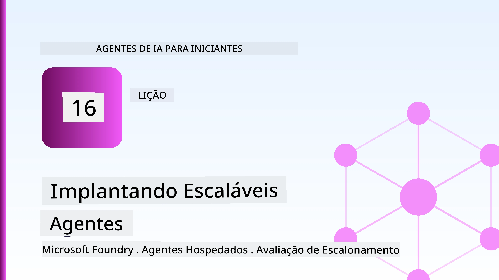
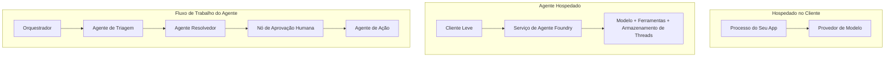
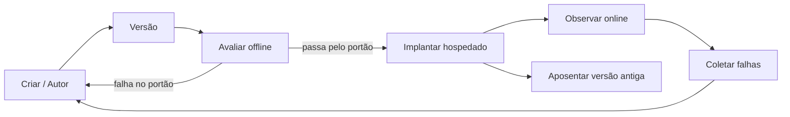
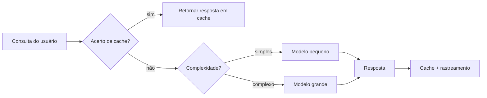
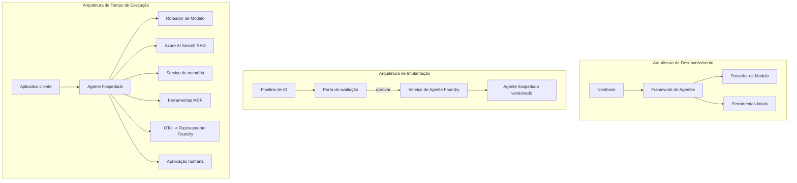

# Implantando Agentes Escaláveis com Microsoft Foundry



Até este ponto no curso, você construiu agentes que rodam no seu laptop, dentro de um notebook, acionados por `az login` e algumas variáveis de ambiente. Essa é exatamente a maneira correta de aprender. Não é a maneira correta de executar um agente do qual milhares de clientes dependem às 3 da manhã.

Esta lição trata da lacuna entre "funciona na minha máquina" e "funciona, de forma confiável e acessível, em produção." Fechamos essa lacuna usando o **Microsoft Foundry** e o **Microsoft Foundry Agent Service**, e fazemos isso construindo um agente real de suporte ao cliente que possui ferramentas, recuperação, memória, avaliação e monitoramento.

## Introdução

Esta lição abordará:

- A diferença entre um **agente protótipo** e um **agente implantado**, e por que a transição é principalmente sobre tudo *ao redor* do modelo.
- **Padrões de implantação** para agentes: hospedados no cliente, hospedados como serviço (Agentes Hospedados), e orquestrados por workflow.
- O **ciclo de vida do agente** no Microsoft Foundry — criar, versionar, implantar, avaliar, observar, aposentar.
- **Estratégias de escalabilidade**: roteamento de modelo, cache, concorrência, e design sem estado.
- **Observabilidade** com OpenTelemetry e rastreamento no Foundry.
- **Otimização de custos** por meio da seleção do modelo, roteamento e portões de avaliação.
- **Considerações empresariais**: governança, aprovação humana e execução segura dos servidores MCP em produção.

## Objetivos de Aprendizagem

Depois de completar esta lição, você saberá como:

- Escolher o padrão de implantação certo para um dado volume de trabalho do agente.
- Implantar um agente no Microsoft Foundry Agent Service para que ele seja versionado, governado e observável.
- Instrumentar um agente para rastreamento e conectar uma pipeline de avaliação que roda antes de cada lançamento.
- Aplicar roteamento de modelo e cache para manter a latência e custo sob controle em escala.
- Adicionar um portão de aprovação humana para ações de alto risco e integrar um servidor MCP de forma segura para produção.

## Pré-requisitos

Esta lição assume que você completou as lições anteriores e está confortável com:

- Construir agentes com o [Microsoft Agent Framework](../14-microsoft-agent-framework/README.md) (Lição 14).
- [Uso de Ferramentas](../04-tool-use/README.md) (Lição 4) e [Agentic RAG](../05-agentic-rag/README.md) (Lição 5).
- [Memória do Agente](../13-agent-memory/README.md) (Lição 13) e [Protocolos Agentes / MCP](../11-agentic-protocols/README.md) (Lição 11).
- [Observabilidade e Avaliação](../10-ai-agents-production/README.md) (Lição 10) — esta lição se baseia diretamente nela.

Você também precisará de:

- Uma **assinatura Azure** e um **projeto Microsoft Foundry** com pelo menos um modelo de chat implantado.
- O **Azure CLI** autenticado (`az login`).
- Python 3.12+ e os pacotes do repositório [`requirements.txt`](../../../requirements.txt).

## Do Protótipo à Produção: O Que Realmente Muda

Um agente protótipo e um agente em produção compartilham o mesmo loop principal — raciocinar, chamar ferramentas, responder. O que muda é tudo que está ao redor desse loop. O modelo representa talvez 20% de um agente em produção; os outros 80% são a estrutura operacional.

| Preocupação | Protótipo | Produção |
| --- | --- | --- |
| **Hospedagem** | Roda no seu notebook | Roda como serviço hospedado, versionado e distribuído |
| **Identidade** | Seu token `az login` | Identidade gerenciada com RBAC com escopo |
| **Estado** | Em memória, perdido na reinicialização | Externalizado (armazenamento de threads, serviço de memória) |
| **Falhas** | Você vê o traceback | Retentativas, fallback, dead-letter, alertas |
| **Custo** | "São alguns centavos" | Rastreado por requisição, roteado, cacheado, orçamentado |
| **Qualidade** | Você avalia visualmente a saída | Avaliado automaticamente antes de cada lançamento |
| **Confiança** | Você aprova cada ação | Política + humano no loop para ações arriscadas |

Tenha esta tabela em mente. Cada seção abaixo corresponde a uma dessas linhas.

## Padrões de Implantação de Agentes

Existem três padrões que você usará, muitas vezes em combinação.

### 1. Agentes Hospedados no Cliente

O objeto agente vive dentro do processo *da sua* aplicação. Seu código chama o provedor do modelo diretamente; o loop de raciocínio roda no seu serviço. Isso é o que cada lição anterior fez.

- **Use quando** você precisar de controle total sobre o loop, middleware personalizado, ou estiver incorporando o agente dentro de um backend existente.
- **Compromisso**: você mesmo gerencia a escalabilidade, estado e resiliência.

### 2. Agentes Hospedados (Foundry Agent Service)

O agente é *registrado como um recurso* no Microsoft Foundry. O Foundry hospeda o loop de raciocínio, armazena threads, aplica segurança de conteúdo e RBAC, e torna o agente visível no portal Foundry. Seu aplicativo se torna um cliente leve que cria threads e lê as respostas.

- **Use quando** você quiser durabilidade, observabilidade incorporada, governança e menos superfície operacional.
- **Compromisso**: menos controle de baixo nível em troca de um runtime gerenciado.

### 3. Workflows de Agentes

Múltiplos agentes (e ferramentas) são compostos em um grafo com fluxo de controle explícito — etapas sequenciais, ramificações, nós de aprovação humana e checkpoints duráveis que podem pausar e retomar. Esta é a capacidade **Workflows** do Microsoft Agent Framework aplicada em escala de implantação.

- **Use quando** uma única tarefa abrange vários agentes especializados ou requer uma etapa de aprovação no meio.
- **Compromisso**: mais partes móveis; precisa de observabilidade no nível da orquestração.



## Ciclo de Vida do Agente no Microsoft Foundry

Implantar um agente não é um `push` único. É um ciclo, e se parece muito com um ciclo de lançamento de software porque é exatamente isso.



A ideia chave, trazida da [Lição 10](../10-ai-agents-production/README.md): **a avaliação offline é um portão, não uma reflexão tardia.** Uma nova versão do agente não é lançada a menos que supere seus limites de avaliação. A observabilidade online então envia falhas do mundo real de volta para seu conjunto de testes offline. Esse é todo o ciclo.

## Estratégias de Escalabilidade

Escalar um agente é diferente de escalar uma API web sem estado, porque cada solicitação pode disparar múltiplas chamadas caras a modelos e ferramentas. Quatro técnicas carregam a maior parte da carga.

**Manipulação de requisição sem estado.** Não mantenha estado por usuário na memória do processo. Persista as threads de conversa na loja de threads do Foundry ou em um serviço de memória para que qualquer instância possa manipular qualquer requisição. Isso permite escalar horizontalmente — adicione instâncias, sem sessões fixas.

**Roteamento de modelo.** Nem toda requisição precisa do seu modelo mais capaz (e mais caro). Roteie requisições simples — classificação de intenção, respostas factuais curtas — para um modelo pequeno e rápido, e reserve o modelo grande para raciocínio genuíno. O **Model Router** do Foundry pode fazer isso por você, ou você pode implementar um classificador leve por conta própria. Você construirá a versão DIY no laboratório.

**Cache de respostas.** Muitas consultas de suporte são quase-dublês ("como redefino minha senha?"). Cache respostas a perguntas comuns e as sirva sem nem consultar o modelo. Mesmo uma taxa modesta de acertos no cache corta custo e latência significativamente.

**Concorrência e retropressão.** Provedores de modelo têm limites de taxa. Limite sua concorrência, use retentativas com backoff exponencial e falhe de forma graciosa (uma resposta enfileirada "estamos cuidando disso" é melhor que um erro 500).



## Observabilidade em Produção

Você não pode operar o que não vê. Como abordado na Lição 10, o Microsoft Agent Framework emite rastreamentos **OpenTelemetry** nativamente — cada chamada de modelo, invocação de ferramenta e passo de orquestração se torna uma span. Em produção, você exporta essas spans para o Microsoft Foundry (ou qualquer backend compatível com OTel) para que você possa:

- Rastrear uma reclamação de cliente fim a fim através de todas chamadas a modelos e ferramentas.
- Monitorar latência p50/p95 e custo por requisição ao longo do tempo.
- Alertar sobre picos na taxa de erro e anomalias de custo antes que seus usuários (ou seu time financeiro) notem.

```python
from agent_framework.observability import get_tracer

tracer = get_tracer()

with tracer.start_as_current_span("support_request") as span:
    span.set_attribute("customer.tier", "enterprise")
    span.set_attribute("routed.model", "gpt-4.1-mini")
    # a execução do agente é rastreada automaticamente dentro deste intervalo
```

Atributos como `customer.tier` e `routed.model` são o que transformam um muro de rastreamentos em perguntas respondíveis ("os clientes empresariais estão sendo roteados para o modelo pequeno com muita frequência?").

## Otimização de Custos

O custo em agentes de produção é dominado por tokens. Três alavancas, em ordem de impacto:

1. **Dimensionar corretamente o modelo.** Um modelo pequeno que passa seu portão de avaliação quase sempre é mais barato que um grande que também passa. Use avaliação para *provar* que o modelo pequeno é bom o suficiente, em vez de escolher o maior modelo por precaução.
2. **Roteamento por complexidade.** Como acima — pague preços de modelo grande apenas para requisições que precisam de raciocínio de modelo grande.
3. **Cache agressivamente.** A chamada mais barata ao modelo é aquela que você nunca faz.

Portões de avaliação e controle de custo são a mesma disciplina vista de dois ângulos: a avaliação diz o *piso de qualidade*, o roteamento e cache mantêm o custo o mais próximo possível desse *piso*.

## Considerações para Implantação Empresarial

**Governança.** Agentes Hospedados herdam RBAC, segurança de conteúdo e registro de auditoria do Foundry. Dê a cada agente uma identidade gerenciada com o menor privilégio necessário — acesso somente leitura à base de conhecimento, acesso com escopo à API de tickets, nada mais.

**Humano no loop.** Algumas ações são muito consequentes para automatizar diretamente — emitir reembolso, deletar conta, escalar para equipe jurídica. O Microsoft Agent Framework suporta ferramentas que necessitam **aprovação**: o agente propõe a ação, a execução pausa, um humano aprova ou rejeita, e o workflow retoma. Você viu o primitivo na [Lição 6](../06-building-trustworthy-agents/README.md); aqui você o implanta.

**MCP em produção.** [MCP](../11-agentic-protocols/README.md) permite que seu agente consuma ferramentas externas via uma interface padrão. Em produção, trate cada servidor MCP como um limite não confiável: fixe a versão do servidor, execute-o com identidade com escopo, valide suas saídas e nunca exponha segredos a ele. Um servidor MCP é uma dependência, e dependências são corrigidas, auditadas e limitadas.



Esses três diagramas — desenvolvimento, implantação, tempo de execução — são o mesmo agente em três estágios da sua vida. O laboratório a seguir guia você na construção dele.

## Laboratório Prático: Um Agente de Suporte ao Cliente Pronto para Produção

Abra [`code_samples/16-python-agent-framework.ipynb`](./code_samples/16-python-agent-framework.ipynb) e execute-o de ponta a ponta. Você montará um **agente de suporte ao cliente Contoso** com todas as preocupações de produção integradas:

1. **Chamada de ferramentas** — consultar status de pedidos e abrir tickets de suporte.
2. **RAG** — responder perguntas políticas de uma base de conhecimento (Azure AI Search, com fallback em memória para rodar o notebook sem recurso Search).
3. **Memória** — lembrar o cliente ao longo das interações da conversa.
4. **Roteamento de modelo** — um classificador de complexidade roteia cada requisição para modelo pequeno ou grande.
5. **Cache de resposta** — perguntas repetidas são servidas do cache.
6. **Aprovação humana** — reembolsos acima de um limite pausam para aprovação humana.
7. **Pipeline de avaliação** — um pequeno conjunto offline pontua o agente e atua como portão de lançamento.
8. **Observabilidade** — rastreamento OpenTelemetry em todas as requisições.

### Passo a passo

O notebook está organizado para que cada preocupação de produção seja uma seção auto-contida e executável. O coração é o manipulador de requisição com roteamento e cache:

```python
async def handle_support_request(query: str, customer_id: str) -> str:
    # 1. Servir a partir do cache quando possível.
    cached = response_cache.get(normalize(query))
    if cached:
        return cached

    # 2. Roteie pela complexidade para controlar o custo.
    model = "gpt-4.1-mini" if is_simple(query) else "gpt-4.1"

    # 3. Execute o agente dentro de um span de rastreamento para observabilidade.
    with tracer.start_as_current_span("support_request") as span:
        span.set_attribute("routed.model", model)
        span.set_attribute("customer.id", customer_id)
        response = await support_agent.run(query, model=model)

    # 4. Cache e retorno.
    response_cache.set(normalize(query), response.text)
    return response.text
```

O portão de avaliação que protege um lançamento é assim:

```python
async def evaluation_gate(agent, test_cases, threshold: float = 0.8) -> bool:
    passed = 0
    for case in test_cases:
        result = await agent.run(case["input"])
        if score_response(result.text, case["expected"]) >= 0.8:
            passed += 1
    pass_rate = passed / len(test_cases)
    print(f"Evaluation pass rate: {pass_rate:.0%} (gate: {threshold:.0%})")
    return pass_rate >= threshold  # implantar somente se o portão passar
```

Leia cada linha — o notebook mantém os primitivos deliberadamente pequenos para que nada fique oculto atrás de uma chamada de framework.

## Validando um Agente Implantado com Testes Smoke

O portão de avaliação acima roda *offline* contra seu objeto agente. Uma vez que o agente está implantado como Agente Hospedado, você precisa de mais uma checagem, ainda mais barata: **o endpoint implantado realmente está respondendo?**

Implantar "com sucesso" apenas prova que o plano de controle aceitou a definição — não prova que o agente responde. Uma dependência faltante, um roteamento de modelo ruim ou uma conexão expirada podem deixar uma implantação verde que não retorna nada. Um **teste smoke** detecta isso em segundos, a cada implantação, sem o custo de uma avaliação completa.

Este repositório fornece uma pipeline de teste smoke pronta para uso construída sobre a GitHub Action [AI Smoke Test](https://github.com/marketplace/actions/ai-smoke-test):

- **Catálogo** — [`tests/lesson-16-smoke-tests.json`](../../../tests/lesson-16-smoke-tests.json) contém prompts e asserções para o agente de suporte Contoso (respostas políticas fundamentadas, consulta de pedido, manter o tópico, e continuidade do thread em múltiplas interações). Catálogos para agentes de outras lições ficam ao lado — veja [`tests/README.md`](../tests/README.md).
- **Workflow** — [`.github/workflows/smoke-test.yml`](../../../.github/workflows/smoke-test.yml) faz login com Azure OIDC e envia cada prompt para o endpoint Responses do agente, falhando o job em qualquer asserção não satisfeita.

```yaml
- name: Smoke-test hosted agent
  uses: JFolberth/ai-smoketest@v1
  with:
    project_endpoint: ${{ inputs.project_endpoint }}
    agent_name: ContosoSupportAgent
    tests_file: tests/lesson-16-smoke-tests.json
```


Execute a partir da aba **Actions** uma vez que seu agente estiver implantado, fornecendo o endpoint do projeto Foundry e o nome do agente. A identidade federada precisa do papel **Azure AI User** no escopo do projeto Foundry. Pense nas camadas como uma pirâmide: testes básicos (alcançável e respondendo?) são executados a cada implantação, avaliação offline (bom o suficiente para liberar?) acontece antes da promoção e avaliação online (como está se saindo no ambiente real?) ocorre continuamente.

## Verificação de Conhecimento

Teste seu entendimento antes de passar para a tarefa.

**1. Aproximadamente qual a proporção de um agente em produção que é “o modelo” e o que é o restante?**

<details>
<summary>Resposta</summary>

O modelo é uma minoria do sistema — frequentemente citado como cerca de 20%. O restante é o esqueleto operacional: hospedagem e versionamento, identidade e RBAC, estado externalizado, tratamento de falhas, controle de custos, avaliação e controles com intervenção humana. Passar para produção é, na maior parte, sobre construir tudo *em torno* do ciclo de raciocínio.
</details>

**2. Quando escolher um Agente Hospedado em vez de um agente hospedado no cliente?**

<details>
<summary>Resposta</summary>

Quando você quer um ambiente gerenciado com durabilidade embutida (threads que persistem e podem retomar), observabilidade, segurança de conteúdo e RBAC, e está disposto a trocar algum controle de baixo nível do ciclo de raciocínio por uma menor área operacional. Agente hospedado no cliente é preferível quando você precisa de controle total do ciclo ou está incorporando o agente a um backend existente.
</details>

**3. Por que um agente escalável deve ser sem estado na memória do seu próprio processo?**

<details>
<summary>Resposta</summary>

Para que qualquer instância possa lidar com qualquer solicitação, o que permite escalabilidade horizontal sem sessões fixas. O estado da conversa por usuário é externalizado para uma loja de threads ou serviço de memória. Se o estado estivesse na memória do processo, ele seria perdido na reinicialização e você não poderia distribuir a carga livremente.
</details>

**4. Qual problema o roteamento de modelos resolve e como ele se relaciona com a avaliação?**

<details>
<summary>Resposta</summary>

O roteamento envia requisições simples para um modelo pequeno, barato e rápido e reserva o modelo grande para raciocínios genuínos, controlando latência e custo. Relaciona-se à avaliação porque esta *comprova* que o modelo pequeno é bom o suficiente para uma classe de requisições — roteamento sem avaliação é um palpite.
</details>

**5. O que é um "portão de avaliação" e onde ele fica no ciclo de vida?**

<details>
<summary>Resposta</summary>

Um portão de avaliação executa um conjunto de testes offline contra uma nova versão do agente e bloqueia a implantação a menos que a taxa de aprovação ultrapasse um limite. Ele fica entre "versão" e "implantação" no ciclo de vida, tornando a qualidade uma pré-condição para o lançamento, não algo que você verifica depois de enviar.
</details>

**6. Por que um servidor MCP deve ser tratado como um limite não confiável em produção?**

<details>
<summary>Resposta</summary>

Porque é uma dependência externa à qual seu agente faz chamadas. Você deve fixar sua versão, executá-lo com uma identidade limitada, validar suas saídas, limitar taxa e nunca expor segredos a ele — a mesma disciplina aplicada a qualquer dependência de terceiros. Suas saídas entram no raciocínio do seu agente, portanto confiança não validada é um risco de segurança.
</details>

**7. Qual mudança única geralmente tem maior impacto no custo do agente em produção, e por quê?**

<details>
<summary>Resposta</summary>

Ajustar o tamanho do modelo — usar o menor modelo que ainda passe no seu portão de avaliação. O custo é dominado por tokens, e um modelo menor que atenda o nível de qualidade quase sempre é mais barato que um maior. Caching e roteamento reduzem o custo ainda mais, mas escolher o modelo base adequado traz o maior efeito imediato.
</details>

**8. Que papel atributos de span como `customer.tier` e `routed.model` desempenham na observabilidade?**

<details>
<summary>Resposta</summary>

Eles transformam rastreamentos brutos em perguntas de negócio que podem ser respondidas. Sem atributos você tem um monte de spans; com eles, você pode perguntar "clientes corporativos estão sendo roteados para o modelo pequeno com frequência demais?" ou "qual modelo lida com nossas requisições mais lentas?" Atributos são como você fatiar a telemetria pelas dimensões que importam para sua operação.
</details>

## Tarefa

Pegue o agente de suporte ao cliente do laboratório e fortaleça-o para um cenário específico: **um agente de suporte de cobrança de assinaturas para uma empresa SaaS.**

Sua submissão deve:

1. **Substituir as ferramentas** por outras relevantes para cobrança: `get_subscription_status`, `get_invoice` e `issue_credit` (créditos acima de $50 requerem aprovação humana).
2. **Adicionar três documentos RAG** cobrindo a política de reembolso da empresa, ciclo de cobrança e política de cancelamento.
3. **Estender o conjunto de avaliação** para pelo menos oito casos, incluindo pelo menos dois que *devem* ativar o caminho de aprovação humana, e confirmar que o portão de avaliação passa ou falha corretamente.
4. **Adicionar um relatório de custo**: após rodar dez consultas variadas pelo agente, imprimir quantas foram para o modelo pequeno, quantas para o modelo grande e quantas foram atendidas do cache.

Escreva um pequeno parágrafo (em uma célula markdown) explicando qual regra de roteamento de modelo você escolheu e como validaria isso com tráfego real. Não há uma única resposta correta — você será avaliado se as preocupações de produção foram integradas de modo coerente.

## Resumo

Nesta lição você moveu um agente de protótipo para produção com Microsoft Foundry:

- O salto para produção é principalmente sobre o **esqueleto operacional** em torno do modelo — hospedagem, identidade, estado, tratamento de falhas, custo, qualidade e confiança.
- Você aprendeu os três **padrões de implantação** — hospedado no cliente, Agentes Hospedados e Workflows de Agente — e quando cada um é adequado.
- Você percorreu o **ciclo de vida do agente**, onde a avaliação offline **atua como um portão de liberação** e a observabilidade online retroalimenta falhas para o conjunto de testes.
- Você aplicou **estratégias de escalonamento** — design sem estado, roteamento de modelo, cache e concorrência limitada — e as conectou à **otimização de custos**.
- Você implementou **controles empresariais**: RBAC, aprovação humana no ciclo, e integração MCP segura para produção.
- Você construiu um **agente de suporte ao cliente pronto para produção** que liga todas essas preocupações juntas em código executável.

A próxima lição faz o percurso oposto: em vez de escalar agentes para a nuvem, você os trará *para baixo* numa única máquina de desenvolvedor e os executará totalmente localmente.

## Recursos Adicionais

- <a href="https://learn.microsoft.com/azure/ai-foundry/what-is-azure-ai-foundry" target="_blank">Documentação Microsoft Foundry</a>
- <a href="https://learn.microsoft.com/azure/ai-foundry/agents/overview" target="_blank">Visão geral do Serviço de Agentes Microsoft Foundry</a>
- <a href="https://aka.ms/ai-agents-beginners/agent-framework" target="_blank">Microsoft Agent Framework</a>
- <a href="https://learn.microsoft.com/azure/ai-foundry/concepts/model-router" target="_blank">Roteador de Modelos no Microsoft Foundry</a>
- <a href="https://learn.microsoft.com/azure/search/search-what-is-azure-search" target="_blank">Azure AI Search</a>
- <a href="https://opentelemetry.io/" target="_blank">OpenTelemetry</a>
- <a href="https://github.com/marketplace/actions/ai-smoke-test" target="_blank">GitHub Action AI Smoke Test</a>
- <a href="https://modelcontextprotocol.io/" target="_blank">Model Context Protocol (MCP)</a>

## Lição Anterior

[Construindo Agentes de Uso de Computador (CUA)](../15-browser-use/README.md)

## Próxima Lição

[Criando Agentes de IA Locais](../17-creating-local-ai-agents/README.md)

---

<!-- CO-OP TRANSLATOR DISCLAIMER START -->
**Aviso Legal**:
Este documento foi traduzido usando o serviço de tradução por IA [Co-op Translator](https://github.com/Azure/co-op-translator). Embora nos esforcemos pela precisão, por favor, esteja ciente de que traduções automatizadas podem conter erros ou imprecisões. O documento original em seu idioma nativo deve ser considerado a fonte autorizada. Para informações críticas, recomenda-se tradução profissional humana. Não nos responsabilizamos por quaisquer mal-entendidos ou interpretações incorretas decorrentes do uso desta tradução.
<!-- CO-OP TRANSLATOR DISCLAIMER END -->