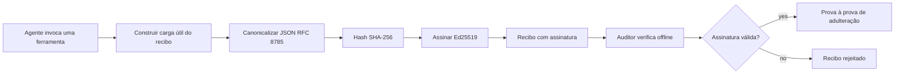
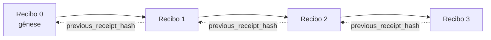

[Assista ao vídeo da lição: Protegendo Agentes de IA com Recibos Criptográficos](https://youtu.be/PLACEHOLDER_VIDEO_ID)

> _(Vídeo da lição e miniatura serão adicionados pela equipe de conteúdo da Microsoft após a mesclagem, seguindo o padrão das lições 14 / 15.)_

# Protegendo Agentes de IA com Recibos Criptográficos

## Introdução

Esta lição abordará:

- Por que trilhas de auditoria para agentes de IA são importantes para conformidade, depuração e confiança.
- O que é um recibo criptográfico e como ele difere de uma linha de log não assinada.
- Como produzir um recibo assinado para uma chamada de ferramenta de um agente em Python puro.
- Como verificar um recibo offline e detectar adulterações.
- Como encadear recibos para que a remoção ou reordenação de um quebre a cadeia.
- O que os recibos comprovam e o que explicitamente eles não comprovam.

## Objetivos de Aprendizagem

Após concluir esta lição, você saberá como:

- Identificar os modos de falha que motivam a proveniência criptográfica para ações de agentes.
- Produzir um recibo assinado Ed25519 sobre uma carga JSON canônica.
- Verificar um recibo independentemente usando apenas a chave pública do assinante.
- Detectar adulterações reexecutando a verificação em um recibo modificado.
- Construir uma sequência encadeada por hash de recibos e explicar por que essa cadeia é importante.
- Reconhecer o limite entre o que os recibos comprovam (atribuição, integridade, ordenação) e o que não comprovam (correção da ação, validade da política).

## O Problema: A Trilha de Auditoria do Seu Agente

Imagine que você tenha implementado um agente de IA para a Contoso Travel. O agente lê pedidos dos clientes, consulta uma API de voos para buscar opções e reserva assentos em nome do cliente. No último trimestre, o agente processou 50.000 reservas.

Hoje chega um auditor. Ele faz uma pergunta simples: "Mostre-me o que seu agente fez."

Você entrega seus arquivos de log. O auditor os examina e faz uma pergunta mais difícil: "Como posso saber que estes logs não foram editados?"

Este é o problema da trilha de auditoria. A maioria das implementações de agentes atualmente depende de:

- **Logs de aplicação**: escritos pelo próprio agente, editáveis por qualquer pessoa com acesso ao sistema de arquivos.
- **Serviços de registro em nuvem**: evidência de adulteração no nível da plataforma, mas somente se o auditor confiar no operador da plataforma.
- **Logs de transações de banco de dados**: adequados para mudanças no banco de dados, mas não para chamadas arbitrárias de ferramentas.

Nenhum desses pode responder à pergunta do auditor sem que ele tenha que confiar em alguém (você, seu provedor de nuvem, seu fornecedor de banco de dados). Para uso interno, essa confiança é geralmente aceitável. Para cargas reguladas (finanças, saúde, qualquer coisa sujeita à Lei de IA da UE), não é.

Recibos criptográficos resolvem isso tornando cada ação do agente independentemente verificável. O auditor não precisa confiar em você. Ele só precisa da sua chave pública e do próprio recibo.

## O Que é um Recibo Criptográfico?

Um recibo é um objeto JSON que registra o que um agente fez, assinado com uma assinatura digital.



Um recibo mínimo se parece com isto:

```json
{
  "type": "agent.tool_call.v1",
  "agent_id": "contoso-travel-bot",
  "tool_name": "lookup_flights",
  "tool_args_hash": "sha256:a3f9c1...",
  "result_hash": "sha256:7b2e1d...",
  "policy_id": "contoso-travel-policy-v3",
  "timestamp": "2026-04-25T14:30:00Z",
  "sequence": 47,
  "previous_receipt_hash": "sha256:9d4e6a...",
  "signature": {
    "alg": "EdDSA",
    "sig": "c5af83...",
    "public_key": "8f3b2c..."
  }
}
```

Três propriedades fazem o trabalho:

1. **A assinatura**. O recibo é assinado pelo gateway do agente usando uma chave privada Ed25519. Qualquer pessoa com a chave pública correspondente pode verificar a assinatura offline. Qualquer alteração em algum campo invalida a assinatura.

2. **Codificação canônica**. Antes de assinar, o recibo é serializado usando o Esquema de Canonicalização JSON (JCS, RFC 8785). Isso garante que duas implementações que produzem o mesmo recibo lógico gerem uma saída byte-idêntica. Sem canonização, diferentes serializadores JSON gerariam assinaturas diferentes para o mesmo conteúdo.

3. **Encadeamento por hash**. O campo `previous_receipt_hash` liga cada recibo ao anterior. Remover ou reordenar um recibo quebra todos os que vieram depois. A adulteração torna-se visível em nível de cadeia, mesmo se assinaturas individuais forem burladas.

Juntas, essas propriedades garantem três coisas:

- **Atribuição**: esta chave assinou este conteúdo.
- **Integridade**: o conteúdo não foi alterado desde a assinatura.
- **Ordenação**: este recibo veio depois daquele recibo na cadeia.

## Produzindo um Recibo em Python

Você não precisa de uma biblioteca especial para produzir um recibo. As primitivas criptográficas estão amplamente disponíveis e a lógica tem poucas dezenas de linhas em Python.

Os exercícios práticos em `code_samples/18-signed-receipts.ipynb` detalham o fluxo completo. A versão resumida:

```python
import json
import hashlib
import base64
from nacl import signing
from jcs import canonicalize  # JSON canônico RFC 8785

def b64url_nopad(data: bytes) -> str:
    return base64.urlsafe_b64encode(data).decode("ascii").rstrip("=")

def sha256_canonical(obj) -> str:
    """SHA-256 of a Python object's JCS-canonical JSON form."""
    return f"sha256:{hashlib.sha256(canonicalize(obj)).hexdigest()}"

# Gerar ou carregar uma chave de assinatura (em produção, armazenar em um cofre de chaves)
signing_key = signing.SigningKey.generate()
verify_key = signing_key.verify_key

# Construir o conteúdo do recibo (ainda sem assinatura)
tool_args = {"origin": "SYD", "destination": "LAX"}
tool_result = [{"flight": "QF11", "price": 1850, "stops": 0}]

payload = {
    "type": "agent.tool_call.v1",
    "agent_id": "contoso-travel-bot",
    "tool_name": "lookup_flights",
    "tool_args_hash": sha256_canonical(tool_args),
    "result_hash": sha256_canonical(tool_result),
    "policy_id": "contoso-travel-policy-v3",
    "timestamp": "2026-04-25T14:30:00Z",
    "sequence": 0,
    "previous_receipt_hash": None,
}

# Canonicalizar, gerar hash, assinar.
canonical_bytes = canonicalize(payload)
message_hash = hashlib.sha256(canonical_bytes).digest()
signature_bytes = signing_key.sign(message_hash).signature

# Anexar um objeto de assinatura estruturado.
receipt = {
    **payload,
    "signature": {
        "alg": "EdDSA",
        "sig": b64url_nopad(signature_bytes),
        "public_key": b64url_nopad(bytes(verify_key)),
    },
}
```

Esse é todo o pipeline de assinatura. Os exercícios no notebook explicam cada passo.

## Verificando um Recibo e Detectando Adulteração

A verificação é a operação inversa:

```python
import base64
import hashlib
from nacl import signing
from nacl.exceptions import BadSignatureError
from jcs import canonicalize

def b64url_decode(s: str) -> bytes:
    padding = "=" * ((4 - len(s) % 4) % 4)
    return base64.urlsafe_b64decode(s + padding)

def verify_receipt(receipt: dict) -> bool:
    # A assinatura é um objeto estruturado: {"alg", "sig", "public_key"}.
    sig_obj = receipt.get("signature")
    if not sig_obj or sig_obj.get("alg") != "EdDSA":
        return False

    # Reconstrua o conteúdo que foi realmente assinado (tudo exceto a assinatura).
    payload = {k: v for k, v in receipt.items() if k != "signature"}

    canonical_bytes = canonicalize(payload)
    message_hash = hashlib.sha256(canonical_bytes).digest()

    try:
        verify_key = signing.VerifyKey(b64url_decode(sig_obj["public_key"]))
        verify_key.verify(message_hash, b64url_decode(sig_obj["sig"]))
        return True
    except BadSignatureError:
        return False
```

Esta função recebe um recibo e retorna `True` se a assinatura for válida, `False` caso contrário. Sem chamadas de rede, sem dependência de serviço, sem necessidade de confiar em terceiros.

Para ver a detecção de adulteração em ação, o notebook guia por:

1. Produzir um recibo válido e confirmar que ele verifica.
2. Modificar um byte do campo `tool_args_hash`.
3. Reexecutar a verificação e observar a falha.

Esta é a demonstração prática de que recibos são evidência de adulteração: qualquer modificação, por menor que seja, quebra a assinatura.

## Encadeando Recibos para Agentes de Múltiplas Etapas

Um único recibo assinado protege uma ação. Uma cadeia de recibos protege uma sequência.



Cada recibo registra o hash do recibo anterior. Para remover silenciosamente o recibo 2, um atacante precisaria:

- Modificar o campo `previous_receipt_hash` do recibo 3 (quebrando a assinatura do recibo 3), OU
- Forjar uma nova assinatura num recibo 3 modificado (requer a chave privada do agente).

Se a chave privada estiver num cofre de hardware e você publicar a chave pública com cada recibo, nenhum desses ataques é viável sem ser detectado.

O notebook orienta:

1. Construir uma cadeia de três recibos.
2. Verificar que o campo `previous_receipt_hash` de cada recibo corresponde ao hash real do recibo anterior.
3. Adulterar um recibo no meio da cadeia e observar a quebra da cadeia exatamente nesse ponto.

Assim você produz uma trilha de auditoria que um auditor externo pode verificar sem precisar confiar em você.

## O Que os Recibos Comprovam (e o Que Não Comprovam)

Esta é a seção mais importante desta lição. Recibos são poderosos mas seu poder é limitado.

**Recibos comprovam três coisas:**

1. **Atribuição**: uma chave específica assinou uma carga útil específica.
2. **Integridade**: a carga útil não foi alterada desde a assinatura.
3. **Ordenação**: este recibo veio depois daquele na cadeia de hashes.

**Recibos NÃO comprovam:**

1. **Corretude**: que a ação do agente foi a ação correta. Um recibo pode ser assinado para uma resposta errada tão perfeitamente quanto para uma correta.
2. **Conformidade com a política**: que a política referida em `policy_id` foi realmente avaliada, ou que teria permitido esta ação se verificada. O recibo registra o que foi alegado, não o que foi imposto.
3. **Identidade além da chave**: o recibo diz "esta chave assinou este conteúdo." Não diz "este humano autorizou isto." Conectar uma chave a uma pessoa ou organização requer infraestrutura de identidade separada (um diretório, um registro de chave pública, etc.).
4. **Veracidade das entradas**: se o agente recebe um prompt manipulado e age sobre ele, o recibo registra a ação fielmente. Recibos são pós-validação de entrada, não substitutos dela.

Esse limite é importante por duas razões:

- Diz para que recibos são úteis: tornar o comportamento do agente auditável e evidenciar adulteração, mesmo através de limites organizacionais.
- Diz quais camadas adicionais ainda são necessárias: validação de entradas (Lição 6), aplicação de políticas (brevemente abordada abaixo), e infraestrutura de identidade (fora do escopo desta lição).

Um erro comum é assumir que "temos recibos" significa "estamos governados". Não significa. Recibos são uma base. Governança é o sistema que você constrói sobre ela.

## Comprovando que um Humano Aprovou a Ação Exata

O item 3 acima merece uma seção própria: um recibo de ação diz "esta chave assinou este conteúdo", nunca "um humano autorizou isto." Para ações de alto risco (reembolsos, exclusões, transferências bancárias), os frameworks de governança exigem cada vez mais exatamente essa declaração faltante, e ela pode ser produzida com as mesmas primitivas que você já construiu nesta lição.

O notebook complementar `code_samples/human-authorization-receipts.ipynb` adiciona um segundo tipo de recibo, `human.approval.v1`, na mesma forma de envelope dos recibos da lição (uma carga tipada assinada por Ed25519 sobre seu SHA-256 canônico, com o objeto `signature` fora dos bytes assinados). Um aprovador nomeado assina **a ação canônica completa e seu resumo** antes da execução; o recibo de ação do agente carrega o **mesmo resumo da ação** e uma `parent_approval_ref`, o `receipt_hash` da aprovação, a mesma convenção que `previous_receipt_hash` na cadeia que você construiu acima. Um único `verify_chain` percorre ambos artefatos sob **registros de chaves fixas separados** (chaves de aprovador versus chaves de agente), assim o caminho de código é compartilhado, mas as autoridades nunca são.

A propriedade que isso garante, exposta cuidadosamente: *o humano aprovou esta ação exata, e o agente executou exatamente essa ação aprovada.* As verificações de recusa no notebook são o que tornam essa propriedade real em vez de apenas afirmada:

- o conjunto clássico: adulteração, delegado confuso, replay, chaves forjadas de ambos os lados, entrada malformada;
- **autoridade expirada**: uma assinatura que ainda verifica, mas é recusada porque a versão da política mudou, a chave do aprovador foi rotacionada para fora do registro fixado, ou a aprovação expirou antes da execução;
- **substituição de resumo**: um recibo de ação validamente assinado apontando para uma aprovação *real* que vincula uma ação canônica *diferente*.

Cada falha é recusada com uma razão distinta, para que um auditor lendo uma recusa possa saber se a autoridade expirou ou se a ação executada mudou. A regra que o notebook ensina: uma aprovação assinada não é autoridade por si só. Autoridade existe apenas se ambos os recibos ainda vinculam à mesma ação canônica no momento da execução. O caminho da coassinatura no mesmo Internet-Draft que esta lição segue (`draft-farley-acta-signed-receipts`) é o formato padrão desse padrão.

## Referências para Produção

O código Python desta lição é intencionalmente mínimo para que você possa ler cada linha e entender exatamente o que está acontecendo. Na produção, você tem duas opções:

1. **Construir diretamente sobre as primitivas criptográficas.** As 50 linhas que você viu são suficientes para muitos casos de uso. PyNaCl (Ed25519) e o pacote `jcs` (JSON canônico) são bibliotecas bem mantidas e auditadas.

2. **Usar uma biblioteca de recibos para produção.** Vários projetos open-source implementam o mesmo padrão com recursos adicionais (rotação de chaves, verificação em lote, distribuição de Conjuntos JWK, integração com motores de política):
   - O formato de recibo usado nesta lição segue um Internet-Draft do IETF ([`draft-farley-acta-signed-receipts`](https://datatracker.ietf.org/doc/draft-farley-acta-signed-receipts/), revisão 02) atualmente em processo de padronização, com uma suíte de conformidade compartilhada ([agent-governance-testvectors](https://github.com/ScopeBlind/agent-governance-testvectors)) que implementações independentes cruzam-verificam para garantir saída canônica byte-idêntica.
   - O Microsoft Agent Governance Toolkit compõe recibos com decisões de políticas baseadas em Cedar; veja o Tutorial 33 nesse repositório para um exemplo completo.
   - Os pacotes `protect-mcp` (npm) e `@veritasacta/verify` (npm) fornecem uma implementação Node para assinatura de recibos e verificação offline, destinados a envolver qualquer servidor MCP com uma trilha de auditoria que evidencie adulteração, incluindo um fluxo de coassinatura em espera no qual uma ação pausada emite um recibo de aprovação vinculado ao resumo da ação (com suporte WebAuthn no fluxo desktop), o mesmo padrão de recibo de aprovação do notebook de autorização humana acima.
   - O SDK Python **[nobulex](https://github.com/arian-gogani/nobulex)** (`pip install nobulex`) oferece o mesmo padrão de assinatura Ed25519 + JCS em Python com integrações LangChain e CrewAI, incluindo vetores de teste de validação cruzada publicados e um mapeamento de conformidade contribuído via [OWASP PR #2210](https://github.com/OWASP/CheatSheetSeries/pull/2210).

A decisão entre implementar seu próprio código e usar uma biblioteca espelha a decisão entre escrever sua própria biblioteca JWT e usar uma testada: ambas são razoáveis; a biblioteca economiza tempo e reduz a superfície de auditoria; a abordagem do zero força você a entender cada primitiva. Esta lição ensina o caminho do zero para que você tenha a base para ambas as escolhas.

## Verificação de Conhecimento

Teste seu entendimento antes de avançar para o exercício prático.

**1. Um recibo é assinado com a chave privada Ed25519 do agente. O auditor tem apenas a chave pública. O auditor pode verificar o recibo offline?**

<details>
<summary>Resposta</summary>

Sim. A verificação Ed25519 requer apenas a chave pública e os bytes assinados. Sem chamadas de rede, sem dependência de serviço. Esta é a propriedade que torna os recibos úteis em ambientes isolados, de múltiplas organizações ou de baixa confiança.
</details>

**2. Um atacante modifica o campo `policy_id` de um recibo para alegar que foi governado por uma política mais permissiva. A assinatura foi feita sobre a carga original. O que acontece na verificação?**

<details>
<summary>Resposta</summary>


A verificação falha. A assinatura foi calculada sobre os bytes canônicos da carga útil original; modificar qualquer campo altera os bytes canônicos, o que altera o hash SHA-256, tornando a assinatura inválida. O atacante precisaria da chave privada para produzir uma nova assinatura válida, o que ele não possui.
</details>

**3. Por que o recibo inclui um `tool_args_hash` e `result_hash` em vez dos argumentos e resultado brutos?**

<details>
<summary>Resposta</summary>

Dois motivos. Primeiro, o recibo pode precisar ser arquivado ou transmitido em ambientes onde vazar o conteúdo bruto (PII, dados empresariais) é um problema. A aplicação do hash mantém o recibo pequeno e o conteúdo privado; o auditor verifica que o hash corresponde a uma cópia armazenada separadamente do conteúdo real. Segundo, os hashes têm tamanho fixo; um recibo com hashes tem tamanho limitado independentemente do quão grandes foram as entradas e saídas.
</details>

**4. O campo `previous_receipt_hash` vincula cada recibo ao seu predecessor. Se um atacante excluir silenciosamente um recibo do meio de uma cadeia, o que se torna inválido?**

<details>
<summary>Resposta</summary>

Todo recibo que vier depois do excluído. Seus campos `previous_receipt_hash` não correspondem mais à cadeia real (porque o recibo ao qual faziam referência não existe mais, ou a cadeia agora aponta para um predecessor diferente). Para esconder a exclusão, o atacante teria que re-assinar todos os recibos posteriores, o que requer a chave privada.
</details>

**5. Um recibo é verificado com sucesso. Isso prova que a ação do agente foi correta, sólida ou conforme a política?**

<details>
<summary>Resposta</summary>

Não. Um recibo válido prova três coisas: atribuição (esta chave assinou este conteúdo), integridade (o conteúdo não foi alterado) e ordenação (este recibo veio após aquele recibo). NÃO prova que a ação foi correta, que a política nomeada em `policy_id` foi realmente avaliada, ou que o agente seguiu todas as regras. Recibos tornam o comportamento do agente auditável, mas não necessariamente correto. Esta é a fronteira mais importante da lição.
</details>

## Exercício Prático

Abra `code_samples/18-signed-receipts.ipynb` e complete todas as quatro seções:

1. **Seção 1**: Assine seu primeiro recibo e o verifique.
2. **Seção 2**: Manipule o recibo e observe a falha na verificação.
3. **Seção 3**: Construa uma cadeia de três recibos e verifique a integridade da cadeia.
4. **Seção 4**: Aplique o padrão a um agente construído com o Microsoft Agent Framework: envolva uma chamada de ferramenta na assinatura do recibo, depois verifique o recibo de forma independente.

**Desafio extra 1:** estenda o esquema do recibo com um campo adicional de sua escolha (por exemplo, um ID de requisição para rastreamento), atualize a lógica de assinatura canônica para incluí-lo e confirme que o recibo ainda passa pela verificação. Depois modifique o campo após a assinatura e confirme que a verificação falha. Isso força a entender como cada byte da codificação canônica contribui para a assinatura.

**Desafio extra 2:** Faça o hash SHA-256 de dois de seus recibos juntos (concatene seus bytes canônicos em uma ordem determinística) e insira o digest resultante como um novo campo em um terceiro recibo antes de assinar. Verifique que os três recibos ainda passam pela verificação. Você acaba de construir uma prova de inclusão de um passo: qualquer um que tenha o terceiro recibo pode provar que os dois primeiros existiam no momento em que foi assinado, sem precisar revelar seus conteúdos. Este é o padrão usado em recibos de divulgação seletiva em grande escala (compromissos Merkle, RFC 6962).

## Conclusão

Recibos criptográficos dão aos agentes de IA uma trilha de auditoria que é:

- **Independentemente verificável**: qualquer parte com a chave pública pode verificar, sem dependência de serviço.
- **À prova de manipulação**: qualquer modificação invalida a assinatura.
- **Portátil**: um recibo é um pequeno arquivo JSON; pode ser arquivado, transmitido e verificado em qualquer lugar.
- **Alinhado a padrões**: baseado em Ed25519 (RFC 8032), JCS (RFC 8785), e SHA-256, todos primitivos amplamente utilizados.

Eles não substituem validação de entrada, aplicação de políticas ou infraestrutura de identidade. São a base para essas camadas. Quando você implanta agentes em cargas reguladas, fluxos entre múltiplas organizações, ou qualquer situação onde um auditor futuro não pode ser presumido confiar em você, recibos são como tornar a trilha de auditoria honesta.

A lição mais importante: recibos provam quem disse o quê e quando. Não provam que o que foi dito é verdade ou correto. Mantenha essa distinção firmemente. Essa é a diferença entre um sistema de proveniência honesto e um enganoso.

## Lista de Verificação para Produção

Quando estiver pronto para avançar desta lição para implantar agentes com recibos assinados em um ambiente real:

- [ ] **Mova a chave de assinatura para fora do laptop do desenvolvedor.** Use Azure Key Vault, AWS KMS ou um módulo de segurança de hardware. A chave privada que assina seus recibos nunca deve estar no controle de versão ou em texto simples nas máquinas de aplicação.
- [ ] **Publique a chave pública de verificação.** Auditores precisam dela para verificar offline. O padrão é um JWK Set num URL bem conhecido (RFC 7517), por exemplo, `https://your-org.example.com/.well-known/agent-keys.json`.
- [ ] **Ancore a cadeia externamente.** Periodicamente escreva o hash da ponta da cadeia mais recente num log de transparência (Sigstore Rekor, autoridade de timestamp RFC 3161, ou um segundo sistema interno) para que uma parte externa possa confirmar "esta cadeia existia neste momento."
- [ ] **Armazene recibos de forma imutável.** Armazenamento append-only (Azure Storage com políticas de imutabilidade, AWS S3 Object Lock) previne que um insider reescreva histórico na camada de armazenamento.
- [ ] **Decida sobre retenção.** Muitos regimes de conformidade exigem retenção multi-anual. Planeje o crescimento dos recibos (cada recibo tem ~500 bytes; um agente fazendo 10K chamadas por dia gera ~1.8 GB por ano).
- [ ] **Documente o que recibos não cobrem.** Recibos provam atribuição, integridade e ordenação. Seu runbook deve listar explicitamente quais controles adicionais (validação de entrada, aplicação de políticas, limitação de taxa, infraestrutura de identidade) acompanham os recibos na postura de governança.

### Tem Mais Perguntas sobre Segurança de Agentes de IA?

Junte-se ao [Microsoft Foundry Discord](https://aka.ms/ai-agents/discord) para encontrar outros aprendizes, participar de horas de atendimento e tirar suas dúvidas sobre Agentes de IA.

## Além Desta Lição

Esta lição cobre assinatura de recibo único e sequências em cadeia de hash. Os mesmos primitivos compõem vários padrões avançados que você pode encontrar conforme sua postura de governança amadurece:

- **Divulgação seletiva.** Quando os campos de um recibo são comprometidos independentemente (árvore Merkle estilo RFC 6962), você pode revelar campos específicos a auditores específicos e provar que os demais não mudaram sem expô-los. Útil quando o mesmo recibo deve satisfazer tanto uma auditoria abrangente (que quer completude) quanto regulamentações de minimização de dados como GDPR (que querem que o auditor veja o mínimo possível).
- **Revogação de recibos.** Se uma chave de assinatura é comprometida, você precisa de um meio para marcar todos os recibos assinados por essa chave como não confiáveis a partir de um ponto no tempo. Padrões comuns: chaves de assinatura de curta duração mais uma lista de revogação publicada, ou um log de transparência com entradas de revogação.
- **Recibos bilaterais / assinatura dividida.** Algumas implementações dividem a carga assinada em metade pré-execução (`authorization_*`) e metade pós-execução (`result_*`) com assinaturas independentes, útil quando a decisão de autorização e o resultado observado são produzidos por atores diferentes ou em momentos diferentes. Isso é um acréscimo composicional ao formato de recibo ensinado nesta lição.
- **Composição de carga útil.** Um recibo sela quaisquer bytes que você colocar em `result_hash`. Cargas no mundo real são frequentemente mais ricas que o resultado de uma única chamada de ferramenta: raciocínio pré-decisão (previsão de modelo, opções consideradas, evidência e sua completude, postura de risco, cadeia de responsabilidade, resultado do gate) podem estar dentro da carga útil, selados por um único recibo. Isso mantém o formato do recibo minimalista enquanto permite que esquemas de carga evoluam domínio por domínio.
- **Conformidade entre implementações.** Múltiplas implementações independentes do mesmo formato de recibo (Python, TypeScript, Rust, Go) se verificam cruzadamente contra vetores de teste compartilhados. Se você construir sua própria implementação, validar contra vetores publicados confirma compatibilidade de protocolo.
- **Migração pós-quântica.** Ed25519 é amplamente usado hoje, mas não é resistente a computação quântica. O formato do recibo é ágil quanto ao algoritmo: o campo `signature.alg` pode carregar `ML-DSA-65` (padrão NIST de assinatura pós-quântica) quando você precisar migrar. Planeje um período de transição em que os recibos sejam assinados duplamente.

## Recursos Adicionais

- <a href="https://datatracker.ietf.org/doc/draft-farley-acta-signed-receipts/" target="_blank">Rascunho IETF: Recibos de Decisão Assinados para Controle de Acesso Máquina-a-Máquina</a>
- <a href="https://learn.microsoft.com/azure/ai-studio/responsible-use-of-ai-overview" target="_blank">Visão geral de IA responsável (Azure AI)</a>
- <a href="https://datatracker.ietf.org/doc/html/rfc8032" target="_blank">RFC 8032: Algoritmo de Assinatura Digital de Curva Edwards (EdDSA)</a>
- <a href="https://datatracker.ietf.org/doc/html/rfc8785" target="_blank">RFC 8785: Esquema de Canonicalização JSON (JCS)</a>
- <a href="https://datatracker.ietf.org/doc/html/rfc6962" target="_blank">RFC 6962: Transparência de Certificados</a> (construção de árvore Merkle usada por recibos de divulgação seletiva)
- <a href="https://github.com/microsoft/agent-governance-toolkit/blob/main/docs/tutorials/33-offline-verifiable-receipts.md" target="_blank">Kit de Ferramentas de Governança de Agentes Microsoft, Tutorial 33: Recibos de Decisão Verificáveis Offline</a>
- <a href="https://github.com/ScopeBlind/agent-governance-testvectors" target="_blank">Vetores de teste de conformidade entre implementações</a> para o formato de recibo usado nesta lição (Apache-2.0)
- <a href="https://pynacl.readthedocs.io/" target="_blank">Documentação PyNaCl</a> (Ed25519 em Python)

## Lição Anterior

[Criando Agentes de IA Locais](../17-creating-local-ai-agents/README.md)

---

<!-- CO-OP TRANSLATOR DISCLAIMER START -->
**Aviso Legal**:
Este documento foi traduzido usando o serviço de tradução por IA [Co-op Translator](https://github.com/Azure/co-op-translator). Embora nos esforcemos pela precisão, por favor, esteja ciente de que traduções automatizadas podem conter erros ou imprecisões. O documento original em seu idioma nativo deve ser considerado a fonte autorizada. Para informações críticas, recomenda-se tradução profissional humana. Não nos responsabilizamos por quaisquer mal-entendidos ou interpretações incorretas decorrentes do uso desta tradução.
<!-- CO-OP TRANSLATOR DISCLAIMER END -->