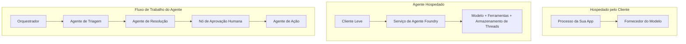
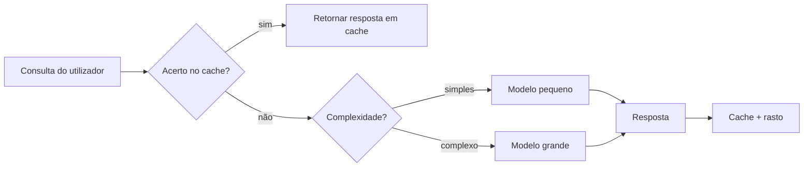
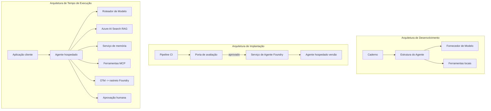

# Implementação de Agentes Escaláveis com Microsoft Foundry


Até este ponto no curso, criou agentes que correm no seu portátil, dentro de um notebook, acionados por `az login` e algumas variáveis de ambiente. Esta é exatamente a forma correta de aprender. Não é a forma correta de executar um agente do qual milhares de clientes dependem às 3 da manhã.

Esta lição trata da lacuna entre "funciona na minha máquina" e "funciona, de forma fiável e acessível, em produção." Fechamos essa lacuna usando o **Microsoft Foundry** e o **Microsoft Foundry Agent Service**, e fazemos isso construindo um agente de suporte ao cliente real que tem ferramentas, recuperação, memória, avaliação e monitorização.

## Introdução

Esta lição vai cobrir:

- A diferença entre um **agente protótipo** e um **agente implementado**, e porque a transição se foca principalmente em tudo o que está *à volta* do modelo.
- **Padrões de implementação** para agentes: alojados no cliente, como serviço (Hosted Agents) e orquestrados por fluxos de trabalho.
- O **ciclo de vida do agente** no Microsoft Foundry — criar, versionar, implementar, avaliar, observar, descontinuar.
- **Estratégias de escalabilidade**: encaminhamento de modelos, caching, concorrência e design sem estado.
- **Observabilidade** com OpenTelemetry e rastreamento Foundry.
- **Otimização de custos** através da seleção de modelos, encaminhamento e portas de avaliação.
- **Considerações empresariais**: governança, aprovação humana e execução segura de servidores MCP em produção.

## Objetivos de Aprendizagem

Depois de concluir esta lição, saberá como:

- Escolher o padrão de implementação adequado para uma dada carga de trabalho do agente.
- Implementar um agente no Microsoft Foundry Agent Service para que seja versionado, governado e observável.
- Instrumentar um agente para rastreamento e configurar uma pipeline de avaliação que corre antes de cada lançamento.
- Aplicar encaminhamento e caching de modelos para manter a latência e o custo sob controlo em escala.
- Adicionar uma porta de aprovação humana para ações de alto risco e integrar um servidor MCP de forma segura para produção.

## Pré-requisitos

Esta lição pressupõe que já completou as lições anteriores e está confortável com:

- Construção de agentes com o [Microsoft Agent Framework](../14-microsoft-agent-framework/README.md) (Lição 14).
- [Uso de Ferramentas](../04-tool-use/README.md) (Lição 4) e [RAG Agentic](../05-agentic-rag/README.md) (Lição 5).
- [Memória do Agente](../13-agent-memory/README.md) (Lição 13) e [Protocolos Agentic / MCP](../11-agentic-protocols/README.md) (Lição 11).
- [Observabilidade e Avaliação](../10-ai-agents-production/README.md) (Lição 10) — esta lição baseia-se diretamente nela.

Também precisará de:

- Uma **subscrição Azure** e um **projeto Microsoft Foundry** com pelo menos um modelo de chat implementado.
- O **Azure CLI** autenticado (`az login`).
- Python 3.12+ e os pacotes do repositório [`requirements.txt`](../../../requirements.txt).

## De Protótipo para Produção: O Que Realmente Muda

Um agente protótipo e um agente de produção partilham o mesmo ciclo central — raciocinar, usar ferramentas, responder. O que muda é tudo o que envolve esse ciclo. O modelo é talvez 20% de um agente de produção; os outros 80% é o esqueleto operacional.

| Preocupação | Protótipo | Produção |
| --- | --- | --- |
| **Alojamento** | Corre no seu notebook | Corre como um serviço hospedado, versionado e implantado |
| **Identidade** | O seu token `az login` | Identidade gerida com RBAC com escopo |
| **Estado** | Na memória, perdido ao reiniciar | Externalizado (armazenamento de threads, serviço de memória) |
| **Falha** | Vê o traceback | Retentativas, alternativas, fila de mensagens mortas, alertas |
| **Custo** | "São uns cêntimos" | Rastreado por pedido, encaminhado, em cache, orçamentado |
| **Qualidade** | Verifica visualmente a saída | Avaliado automaticamente antes de cada lançamento |
| **Confiança** | Aprova todas as ações | Política + intervenção humana para ações de risco |

Tenha esta tabela em mente. Cada seção abaixo corresponde a uma destas linhas.

## Padrões de Implementação de Agentes

Existem três padrões que usará, muitas vezes em combinação.

### 1. Agentes Alojados no Cliente

O objeto agente vive dentro do *seu* processo da aplicação. O seu código chama diretamente o fornecedor do modelo; o ciclo de raciocínio corre no seu serviço. Isto é o que todas as lições anteriores fizeram.

- **Use-o quando** precisar de controlo total sobre o ciclo, middleware personalizado, ou estiver a embutir o agente dentro de um backend existente.
- **Contras**: é responsável pela sua própria escalabilidade, estado e resiliência.

### 2. Agentes Hospedados (Foundry Agent Service)

O agente é *registado como um recurso* no Microsoft Foundry. O Foundry aloja o ciclo de raciocínio, armazena threads, aplica segurança de conteúdo e RBAC, e torna o agente visível no portal Foundry. A sua app torna-se um cliente leve que cria threads e lê respostas.

- **Use-o quando** quiser durabilidade, observabilidade integrada, governança e menos superfície operacional.
- **Contras**: menos controlo de baixo nível em troca de um runtime gerido.

### 3. Fluxos de Trabalho de Agentes

Vários agentes (e ferramentas) são compostos num grafo com fluxo de controlo explícito — passos sequenciais, ramificação, nós de aprovação humana e pontos de verificação duradouros que podem pausar e retomar. Esta é a capacidade **Workflows** do Microsoft Agent Framework aplicada em escala de implementação.

- **Use-o quando** uma tarefa única abrange vários agentes especializados ou requer um passo de aprovação no meio.
- **Contras**: mais peças em movimento; necessita de observabilidade ao nível da orquestração.



## O Ciclo de Vida do Agente no Microsoft Foundry

Implementar um agente não é um `push` único. É um ciclo, e parece muito com um ciclo de lançamento de software porque é exatamente isso.


A ideia-chave, mantida desde a [Lição 10](../10-ai-agents-production/README.md): **a avaliação offline é uma porta, não um pensamento secundário.** Uma nova versão de agente não é lançada a menos que ultrapasse os seus critérios de avaliação. A observabilidade em produção depois alimenta falhas do mundo real de volta no seu conjunto de testes offline. Esse é todo o ciclo.

## Estratégias de Escalabilidade

Escalar um agente é diferente de escalar uma API web sem estado, porque cada pedido pode desencadear várias chamadas caras a modelos e ferramentas. Quatro técnicas levam a maior parte da carga.

**Manuseamento de pedidos sem estado.** Não mantenha estado por utilizador na memória do processo. Persista os tópicos das conversas no armazenamento de threads do Foundry ou num serviço de memória para que qualquer instância possa tratar qualquer pedido. Isto permite escala horizontal — adicione instâncias, sem sessões permanentes.

**Encaminhamento de modelo.** Nem todo pedido precisa do seu modelo mais potente (e mais caro). Encaminhe pedidos simples — classificação de intenção, respostas factuais curtas — para um modelo pequeno e rápido, reservando o modelo grande para raciocínios genuínos. O **Model Router** do Foundry pode fazer isto por si, ou pode implementar um classificador leve você mesmo. Construirá a versão DIY no laboratório.

**Caching de respostas.** Muitas consultas de suporte são quase duplicados ("como é que redefino a minha palavra-passe?"). Armazene respostas a perguntas comuns em cache e sirva-as sem recorrer ao modelo. Mesmo uma taxa modesta de cache resulta em cortes significativos de custo e latência.

**Concorrência e pressão inversa.** Os fornecedores de modelos têm limites de taxa. Limite a sua concorrência, use retentativas com atraso exponencial e falhe graciosamente (uma resposta enfileirada "estamos a tratar disso" é melhor que um erro 500).



## Observabilidade em Produção

Não pode operar o que não consegue ver. Como coberto na Lição 10, o Microsoft Agent Framework emite rastreamentos **OpenTelemetry** nativamente — cada chamada a modelo, invocação de ferramenta e passo de orquestração torna-se um span. Em produção, exporta esses spans para o Microsoft Foundry (ou qualquer backend compatível com OTel) para poder:

- Rastrear uma reclamação de cliente do início ao fim através de cada chamada a modelo e ferramenta.
- Monitorizar a latência p50/p95 e o custo por pedido ao longo do tempo.
- Alertar sobre picos na taxa de erros e anomalias de custo antes dos seus utilizadores (ou equipa financeira) repararem.

```python
from agent_framework.observability import get_tracer

tracer = get_tracer()

with tracer.start_as_current_span("support_request") as span:
    span.set_attribute("customer.tier", "enterprise")
    span.set_attribute("routed.model", "gpt-5-nano")
    # a execução do agente é rastreada automaticamente dentro deste intervalo
```

Atributos como `customer.tier` e `routed.model` são o que transformam um muro de rastreamentos em perguntas respondíveis ("os clientes enterprise estão a ser frequentemente encaminhados para o modelo pequeno?").

## Otimização de Custos

O custo em agentes de produção é dominado por tokens. Três alavancas, por ordem de impacto:

1. **Dimensionar corretamente o modelo.** Um modelo pequeno que passa pela sua porta de avaliação é quase sempre mais barato que um modelo grande que também passa. Use a avaliação para *provar* que o modelo pequeno é suficientemente bom em vez de optar pelo maior apenas por precaução.
2. **Encaminhar por complexidade.** Como acima — pague preço de modelo grande apenas para pedidos que precisam de raciocínio de modelo grande.
3. **Cache agressivamente.** A chamada de modelo mais barata é aquela que nunca faz.

Portas de avaliação e controlo de custos são a mesma disciplina vista por dois ângulos: avaliação indica o *piso de qualidade*, e encaminhamento e caching mantém-no o mais próximo possível do *custo* desse piso.

## Considerações para Implementação Empresarial

**Governança.** Agentes Hospedados herdam o RBAC, segurança de conteúdo e registo de auditoria do Foundry. Dê a cada agente uma identidade gerida com o menor privilégio necessário — acesso somente leitura à base de conhecimento, acesso com escopo à API de tickets, nada mais.

**Intervenção humana.** Algumas ações são demasiado importantes para automatizar inteiramente — emitir um reembolso, eliminar uma conta, escalar para uma equipa jurídica. O Microsoft Agent Framework suporta ferramentas que precisam de **aprovação**: o agente propõe a ação, a execução pausa, um humano aprova ou rejeita, e o fluxo de trabalho retoma. Já viu o primitivo na [Lição 6](../06-building-trustworthy-agents/README.md); aqui implementa-o.

**MCP em produção.** [MCP](../11-agentic-protocols/README.md) permite que o seu agente consuma ferramentas externas através de uma interface padrão. Em produção, trate cada servidor MCP como uma fronteira não confiável: fixe a versão do servidor, execute-o com uma identidade com escopo, valide as suas saídas e nunca exponha segredos a ele. Um servidor MCP é uma dependência, e dependências são corrigidas, auditadas e limitadas em taxa.



Esses três diagramas — desenvolvimento, implementação, tempo de execução — são o mesmo agente em três fases da sua vida. O laboratório seguinte guia-o na sua construção.

## Laboratório Prático: Um Agente de Suporte ao Cliente Pronto para Produção

Abra [`code_samples/16-python-agent-framework.ipynb`](./code_samples/16-python-agent-framework.ipynb) e percorra-o do início ao fim. Vai montar um **agente de suporte ao cliente Contoso** com todas as preocupações de produção integradas:

1. **Chamada a ferramentas** — consulta o estado de encomendas e abre tickets de suporte.
2. **RAG** — responde a questões de política a partir de uma base de conhecimento (Azure AI Search, com fallback em memória para que o notebook funcione sem recurso Search).
3. **Memória** — lembra o cliente ao longo das trocas na conversa.
4. **Encaminhamento de modelo** — um classificador de complexidade encaminha cada pedido para um modelo pequeno ou grande.
5. **Cache de respostas** — perguntas repetidas são servidas a partir do cache.
6. **Aprovação humana** — reembolsos acima de um limiar pausam para aprovação humana.
7. **Pipeline de avaliação** — um conjunto pequeno de testes offline pontua o agente e atua como porta de lançamento.
8. **Observabilidade** — rastreio OpenTelemetry em volta de cada pedido.

### Passo a Passo

O notebook está organizado para que cada preocupação de produção seja uma seção autónoma e executável. O núcleo é o manipulador de pedidos com encaminhamento e caching:

```python
async def handle_support_request(query: str, customer_id: str) -> str:
    # 1. Servir a partir da cache sempre que possível.
    cached = response_cache.get(normalize(query))
    if cached:
        return cached

    # 2. Roteamento por complexidade para controlar o custo.
    model = "gpt-5-nano" if is_simple(query) else "gpt-5-mini"

    # 3. Executar o agente dentro de uma span de rastreio para observabilidade.
    with tracer.start_as_current_span("support_request") as span:
        span.set_attribute("routed.model", model)
        span.set_attribute("customer.id", customer_id)
        response = await support_agent.run(query, model=model)

    # 4. Cache e devolver.
    response_cache.set(normalize(query), response.text)
    return response.text
```

A porta de avaliação que protege um lançamento parece isto:

```python
async def evaluation_gate(agent, test_cases, threshold: float = 0.8) -> bool:
    passed = 0
    for case in test_cases:
        result = await agent.run(case["input"])
        if score_response(result.text, case["expected"]) >= 0.8:
            passed += 1
    pass_rate = passed / len(test_cases)
    print(f"Evaluation pass rate: {pass_rate:.0%} (gate: {threshold:.0%})")
    return pass_rate >= threshold  # só implantar se o portão passar
```

Leia cada linha — o notebook mantém os primitivos deliberadamente pequenos para que nada fique oculto numa chamada de framework.

## Validação de um Agente Implementado com Testes Simples

A porta de avaliação acima corre *offline* contra o seu objeto agente. Uma vez que o agente está implementado como Agente Hospedado, precisa de mais uma verificação, ainda mais barata: **o endpoint implementado está realmente a responder?**

Implementar "com sucesso" prova apenas que o plano de controlo aceitou a definição — não prova que o agente responde. Uma dependência em falta, um encaminhamento de modelo errado ou uma ligação expirada podem deixar uma implementação sinalizada como pronta que não retorna nada. Um **teste simples** apanha isso em segundos, em cada implementação, sem o custo de uma avaliação completa.

Este repositório inclui uma pipeline de testes simples pronta a usar construída com a GitHub Action [AI Smoke Test](https://github.com/marketplace/actions/ai-smoke-test):

- **Catálogo** — [`tests/lesson-16-smoke-tests.json`](../../../tests/lesson-16-smoke-tests.json) contém prompts e assertivas para o agente de suporte Contoso (respostas políticas fundamentadas, consulta de encomenda, manter-se no tópico e continuidade do tópico multi-turno). Catálogos para agentes de outras lições vivem ao lado — veja [`tests/README.md`](../tests/README.md).
- **Fluxo de trabalho** — [`.github/workflows/smoke-test.yml`](../../../.github/workflows/smoke-test.yml) autentica com Azure OIDC e faz POST de cada prompt para o endpoint Responses do agente, falhando o trabalho se alguma assertiva falhar.

```yaml
- name: Smoke-test hosted agent
  uses: JFolberth/ai-smoketest@v1
  with:
    project_endpoint: ${{ inputs.project_endpoint }}
    agent_name: ContosoSupportAgent
    tests_file: tests/lesson-16-smoke-tests.json
```


Execute-o a partir do separador **Ações** assim que o seu agente estiver implementado, fornecendo o endpoint do seu projeto Foundry e o nome do agente. A identidade federada precisa da função **Azure AI User** ao nível do âmbito do projeto Foundry. Pense nas camadas como uma pirâmide: testes de fumo (acessível e a responder?) executados em cada implementação, avaliação offline (bom o suficiente para lançar?) executada antes da promoção, e avaliação online (como está a correr "no terreno"?) executada continuamente.

## Verificação de Conhecimento

Teste a sua compreensão antes de avançar para a tarefa.

**1. Aproximadamente quanto de um agente de produção é "o modelo" e o que é o resto?**

<details>
<summary>Resposta</summary>

O modelo é uma minoria do sistema — frequentemente citado como cerca de 20%. O resto é o esqueleto operacional: alojamento e versionamento, identidade e RBAC, estado externalizado, gestão de falhas, rastreamento de custos, avaliação e controlos humanos no ciclo. Avançar para a produção é principalmente sobre construir tudo *à volta* do ciclo de raciocínio.
</details>

**2. Quando escolheria um Agente Hospedado em detrimento de um agente hospedado no cliente?**

<details>
<summary>Resposta</summary>

Quando quiser um ambiente de execução gerido com durabilidade incorporada (threads que persistem e podem retomar), observabilidade, segurança de conteúdo e RBAC, e estiver disposto a abdicar de algum controlo ao nível baixo do ciclo de raciocínio em troca de uma menor superfície operacional. O alojamento no cliente é preferível quando precisa de controlo total sobre o ciclo ou está a incorporar o agente num backend existente.
</details>

**3. Por que é que um agente escalável deve ser sem estado na memória do seu próprio processo?**

<details>
<summary>Resposta</summary>

Para que qualquer instância possa lidar com qualquer pedido, o que permite a escalabilidade horizontal sem sessões atreladas. O estado da conversa por utilizador é externalizado para um armazenamento de threads ou serviço de memória. Se o estado residisse na memória do processo, perderia essa informação ao reiniciar e não poderia distribuir a carga livremente.
</details>

**4. Que problema resolve o encaminhamento do modelo, e como se relaciona com a avaliação?**

<details>
<summary>Resposta</summary>

O encaminhamento envia pedidos simples para um modelo pequeno, barato e rápido e reserva o modelo grande para raciocínios genuínos, controlando tanto a latência como o custo. Relaciona-se com a avaliação porque é a avaliação que *comprova* que o modelo pequeno é suficientemente bom para uma classe de pedidos — encaminhar sem avaliação é um palpite.
</details>

**5. O que é um "portão de avaliação" e onde se situa no ciclo de vida?**

<details>
<summary>Resposta</summary>

Um portão de avaliação executa um conjunto de testes offline numa nova versão do agente e bloqueia a implementação a menos que a taxa de aprovação ultrapasse um limite. Situa-se entre "versão" e "implementação" no ciclo de vida, fazendo da qualidade uma pré-condição para a libertação em vez de algo que se verifica depois de lançar.
</details>

**6. Por que deve um servidor MCP ser tratado como uma fronteira não confiável em produção?**

<details>
<summary>Resposta</summary>

Porque é uma dependência externa a que o seu agente chama. Deve fixar a sua versão, executá-lo com uma identidade com âmbito restrito, validar as suas saídas, limitar a taxa, e nunca expor segredos a ele — a mesma disciplina aplicada a qualquer dependência de terceiros. As suas saídas alimentam o raciocínio do seu agente, por isso a confiança não validada é um risco de segurança.
</details>

**7. Qual a alteração única que normalmente tem maior impacto no custo do agente em produção, e porquê?**

<details>
<summary>Resposta</summary>

Ajustar o tamanho do modelo — usar o modelo mais pequeno que ainda passa o seu portão de avaliação. O custo é dominado por tokens, e um modelo mais pequeno que atenda ao nível de qualidade é quase sempre mais barato que um maior. A cache e o encaminhamento reduzem o custo ainda mais, mas escolher o modelo base adequado tem o maior efeito de primeira ordem.
</details>

**8. Que papel desempenham atributos de span como `customer.tier` e `routed.model` na observabilidade?**

<details>
<summary>Resposta</summary>

Eles transformam rastreios brutos em perguntas comerciais respondíveis. Sem atributos, tem uma parede de spans; com eles pode perguntar "os clientes empresariais estão a ser encaminhados para o modelo pequeno com muita frequência?" ou "qual modelo lida com os nossos pedidos mais lentos?" Os atributos são como fatiar a telemetria pelas dimensões que interessam para a sua operação.
</details>

## Tarefa

Pegue no agente de suporte ao cliente do laboratório e robusteça-o para um cenário específico: **um agente de suporte para faturação de subscrição para uma empresa SaaS.**

Deve submeter:

1. **Substituir as ferramentas** por aquelas relevantes para faturação: `get_subscription_status`, `get_invoice` e `issue_credit` (crédito acima de $50 requer aprovação humana).
2. **Adicionar três documentos RAG** cobrindo a política de reembolso da empresa, o ciclo de faturação e a política de cancelamento.
3. **Expandir o conjunto de avaliação** para pelo menos oito casos, incluindo pelo menos dois que *devem* acionar o caminho de aprovação humana, e confirmar que o portão de avaliação passou ou falhou corretamente.
4. **Adicionar um relatório de custos**: depois de executar dez consultas mistas através do agente, imprimir quantas foram para o modelo pequeno, quantas para o modelo grande e quantas foram servidas a partir do cache.

Escreva um parágrafo curto (numa célula markdown) explicando qual regra de encaminhamento de modelo escolheu e como a validaria com tráfego real. Não há uma única resposta correta — será avaliado se as preocupações de produção estão interligadas coerentemente.

## Resumo

Nesta lição, moveu um agente do protótipo para a produção com Microsoft Foundry:

- A passagem para a produção é principalmente sobre o **esqueleto operacional** à volta do modelo — alojamento, identidade, estado, gestão de falhas, custo, qualidade e confiança.
- Aprendeu os três **padrões de implementação** — alojado no cliente, Agentes Hospedados e Fluxos de Trabalho de Agente — e quando usar cada um.
- Percorreu o **ciclo de vida do agente**, onde a avaliação offline **atua como portão de lançamento** e a observabilidade online retroalimenta falhas para o conjunto de testes.
- Aplicou **estratégias de escalabilidade** — design sem estado, encaminhamento de modelo, cache e concorrência limitada — e ligou-as à **otimização de custos**.
- Conectou **controlos empresariais**: RBAC, aprovação humana e integração MCP segura para produção.
- Construíu um **agente de suporte ao cliente pronto para produção** que integra todas estas preocupações em código executável.

A próxima lição faz o percurso inverso: em vez de escalar agentes para a cloud, irá trazê-los *para baixo* para uma única máquina de desenvolvimento e executá-los totalmente localmente.

## Recursos Adicionais

- <a href="https://learn.microsoft.com/azure/ai-foundry/what-is-azure-ai-foundry" target="_blank">Documentação Microsoft Foundry</a>
- <a href="https://learn.microsoft.com/azure/ai-foundry/agents/overview" target="_blank">Visão geral do Serviço de Agentes Microsoft Foundry</a>
- <a href="https://aka.ms/ai-agents-beginners/agent-framework" target="_blank">Microsoft Agent Framework</a>
- <a href="https://learn.microsoft.com/azure/ai-foundry/concepts/model-router" target="_blank">Encaminhamento de Modelo no Microsoft Foundry</a>
- <a href="https://learn.microsoft.com/azure/search/search-what-is-azure-search" target="_blank">Azure AI Search</a>
- <a href="https://opentelemetry.io/" target="_blank">OpenTelemetry</a>
- <a href="https://github.com/marketplace/actions/ai-smoke-test" target="_blank">Ação GitHub AI Smoke Test</a>
- <a href="https://modelcontextprotocol.io/" target="_blank">Protocolo de Contexto de Modelo (MCP)</a>

## Lição Anterior

[Construir Agentes de Uso de Computador (CUA)](../15-browser-use/README.md)

## Próxima Lição

[Criar Agentes de IA Locais](../17-creating-local-ai-agents/README.md)

---

<!-- CO-OP TRANSLATOR DISCLAIMER START -->
**Aviso Legal**:
Este documento foi traduzido utilizando o serviço de tradução automática [Co-op Translator](https://github.com/Azure/co-op-translator). Embora nos esforcemos pela precisão, esteja ciente de que traduções automáticas podem conter erros ou imprecisões. O documento original na sua língua nativa deve ser considerado a fonte autorizada. Para informações críticas, recomenda-se tradução profissional humana. Não nos responsabilizamos por quaisquer mal-entendidos ou interpretações incorretas resultantes da utilização desta tradução.
<!-- CO-OP TRANSLATOR DISCLAIMER END -->