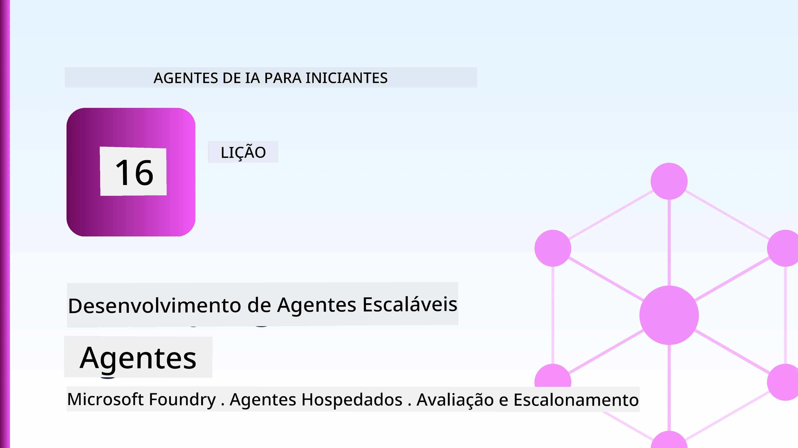
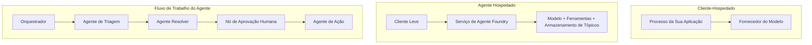
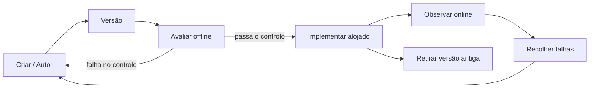
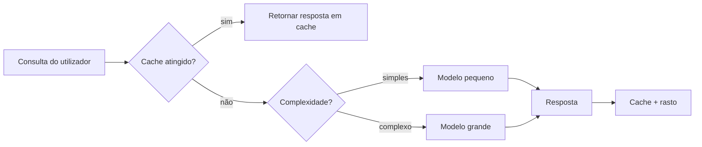
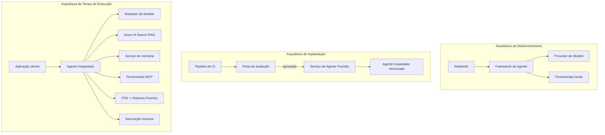

# Desplegar Agentes Escaláveis com Microsoft Foundry



Até este ponto no curso, criou agentes que correm no seu portátil, dentro de um notebook, comandados por `az login` e um punhado de variáveis de ambiente. Essa é exatamente a forma certa de aprender. Não é a forma certa de executar um agente do qual milhares de clientes dependem às 3 da manhã.

Esta lição aborda a lacuna entre "funciona na minha máquina" e "funciona, de forma fiável e acessível, em produção." Fechamos essa lacuna usando o **Microsoft Foundry** e o **Microsoft Foundry Agent Service**, e fazemos isso construindo um agente de suporte ao cliente real que tem ferramentas, recuperação, memória, avaliação e monitorização.

## Introdução

Esta lição cobrirá:

- A diferença entre um **agente protótipo** e um **agente implementado**, e porque a transição é principalmente sobre tudo *à volta* do modelo.
- **Padrões de implementação** para agentes: cliente-hospedado, serviço-hospedado (Agentes Hospedados), e orquestração de fluxo de trabalho.
- O **ciclo de vida do agente** no Microsoft Foundry — criar, versionar, implementar, avaliar, observar, aposentar.
- **Estratégias de escalabilidade**: encaminhamento de modelo, caching, concorrência e design sem estado.
- **Observabilidade** com OpenTelemetry e tracing do Foundry.
- **Otimização de custos** através da seleção do modelo, encaminhamento e portões de avaliação.
- **Considerações empresariais**: governação, aprovação humana, e execução segura de servidores MCP em produção.

## Objetivos de Aprendizagem

Após completar esta lição, saberá como:

- Escolher o padrão de implementação correto para uma carga de trabalho de agente dada.
- Implementar um agente no Microsoft Foundry Agent Service de modo que seja versionado, governado e observável.
- Instrumentar um agente para tracing e ligar um pipeline de avaliação que corre antes de cada lançamento.
- Aplicar encaminhamento de modelo e caching para manter a latência e o custo sob controlo em escala.
- Adicionar um portão de aprovação humana para ações de alto risco e integrar um servidor MCP de forma segura para produção.

## Pré-requisitos

Esta lição assume que completou as lições anteriores e que está confortável com:

- Construir agentes com o [Microsoft Agent Framework](../14-microsoft-agent-framework/README.md) (Lição 14).
- [Uso de Ferramentas](../04-tool-use/README.md) (Lição 4) e [Agentic RAG](../05-agentic-rag/README.md) (Lição 5).
- [Memória do Agente](../13-agent-memory/README.md) (Lição 13) e [Protocolos Agentes / MCP](../11-agentic-protocols/README.md) (Lição 11).
- [Observabilidade e Avaliação](../10-ai-agents-production/README.md) (Lição 10) — esta lição baseia-se diretamente nela.

Também vai precisar:

- Uma **subscrição Azure** e um **projeto Microsoft Foundry** com pelo menos um modelo de chat implementado.
- A **CLI Azure** autenticada (`az login`).
- Python 3.12+ e os pacotes no repositório [`requirements.txt`](../../../requirements.txt).

## Do Protótipo à Produção: O que Realmente Muda

Um agente protótipo e um agente de produção partilham o mesmo ciclo central — raciocinar, chamar ferramentas, responder. O que muda é tudo o que envolve esse ciclo. O modelo é talvez 20% de um agente de produção; os outros 80% são o esqueleto operacional.

| Preocupação | Protótipo | Produção |
| --- | --- | --- |
| **Hospedagem** | Corre no seu notebook | Corre como um serviço hospedado, versionado e distribuído |
| **Identidade** | O seu token `az login` | Identidade gerida com RBAC com escopo |
| **Estado** | Em memória, perdido na reinicialização | Externalizado (armazenamento de threads, serviço de memória) |
| **Falha** | Você vê o rastreamento do erro | Retentativas, alternativas, fila de erros, alertas |
| **Custo** | "É uns cêntimos" | Rastreado por pedido, encaminhado, armazenado em cache, orçamentado |
| **Qualidade** | Você avalia visualmente a saída | Avaliado automaticamente antes de cada lançamento |
| **Confiança** | Você aprova cada ação | Política + humano no ciclo para ações arriscadas |

Tenha esta tabela em mente. Cada secção abaixo corresponde a uma destas linhas.

## Padrões de Implementação de Agentes

Existem três padrões que vai usar, frequentemente em combinação.

### 1. Agentes Cliente-Hospedados

O objeto agente vive dentro do *processo* da sua aplicação. O seu código chama diretamente o provedor do modelo; o ciclo de raciocínio corre no seu serviço. Isto é o que cada lição anterior fez.

- **Utilize quando** precisar de controlo total sobre o ciclo, middleware personalizado, ou estiver a embutir o agente dentro de um backend existente.
- **Compromisso**: você é responsável pela escalabilidade, estado e resiliência.

### 2. Agentes Hospedados (Foundry Agent Service)

O agente está *registado como recurso* no Microsoft Foundry. O Foundry hospeda o ciclo de raciocínio, armazena threads, reforça segurança de conteúdo e RBAC, e torna o agente visível no portal do Foundry. A sua app torna-se um cliente leve que cria threads e lê respostas.

- **Utilize quando** deseja durabilidade, observabilidade integrada, governação e menos superfície operacional.
- **Compromisso**: menos controlo ao nível baixo em troca de um ambiente gerido.

### 3. Fluxos de Trabalho de Agente

Vários agentes (e ferramentas) são compostos num grafo com fluxo de controlo explícito — passos sequenciais, ramificações, nós de aprovação humana, e checkpoints duráveis que podem ser pausados e retomados. Esta é a capacidade **Workflows** do Microsoft Agent Framework aplicada em escala de implementação.

- **Utilize quando** uma única tarefa abrange diversos agentes especializados ou requer um passo de aprovação no meio.
- **Compromisso**: mais componentes móveis; necessita de observabilidade ao nível de orquestração.



## O Ciclo de Vida do Agente no Microsoft Foundry

Implementar um agente não é um `push` único. É um ciclo, e parece muito com um ciclo de lançamento de software porque é exatamente isso.



A ideia chave, trazida da [Lição 10](../10-ai-agents-production/README.md): **avaliação offline é um portão, não um pormenor.** Uma nova versão do agente não é lançada a menos que ultrapasse os seus limites de avaliação. A observabilidade online depois alimenta falhas do mundo real para o seu conjunto de testes offline. Esse é o ciclo completo.

## Estratégias de Escalabilidade

Escalar um agente é diferente de escalar uma API web sem estado, porque cada pedido pode desencadear múltiplas chamadas caras a modelos e ferramentas. Quatro técnicas assumem a maior carga.

**Manipulação de pedidos sem estado.** Não mantenha estado por utilizador na memória do seu processo. Persista os fios de conversa no armazenamento de threads do Foundry ou num serviço de memória para que qualquer instância possa atender qualquer pedido. É isto que permite escalar horizontalmente — adicione instâncias, sem sessões fixas.

**Encaminhamento de modelo.** Nem todos os pedidos precisam do seu modelo mais capaz (e mais caro). Encaminhe pedidos simples — classificação de intenção, respostas factuais curtas — para um modelo pequeno e rápido, e reserve o modelo grande para o raciocínio genuíno. O **Model Router** do Foundry pode fazer isso por si, ou pode implementar um classificador leve você mesmo. Construirá a versão DIY no laboratório.

**Cache de respostas.** Muitas consultas de suporte são quase duplicados ("como redefino a minha palavra-passe?"). Guarde respostas a perguntas comuns em cache e sirva-as sem aceder ao modelo. Mesmo uma taxa modesta de cache reduz significativamente custo e latência.

**Concorrência e pressão de retaguarda.** Provedores de modelos têm limites de taxa. Limite a sua concorrência, use retentativas com recuo exponencial, e falhe de forma elegante (uma resposta em fila "estamos a tratar disso" é melhor que um 500).



## Observabilidade em Produção

Não pode operar aquilo que não pode ver. Como coberto na Lição 10, o Microsoft Agent Framework emite rastreamentos **OpenTelemetry** nativamente — cada chamada ao modelo, invocação da ferramenta, e passo de orquestração torna-se um span. Em produção exporta esses spans para o Microsoft Foundry (ou qualquer backend compatível com OTel) para que possa:

- Rastrear uma única reclamação de cliente de ponta a ponta através de cada chamada a modelo e ferramenta.
- Monitorizar latência p50/p95 e custo por pedido ao longo do tempo.
- Alertar sobre picos de taxa de erro e anomalias de custo antes dos seus utilizadores (ou da sua equipa financeira) notarem.

```python
from agent_framework.observability import get_tracer

tracer = get_tracer()

with tracer.start_as_current_span("support_request") as span:
    span.set_attribute("customer.tier", "enterprise")
    span.set_attribute("routed.model", "gpt-4.1-mini")
    # a execução do agente é rastreada automaticamente dentro deste intervalo
```

Atributos como `customer.tier` e `routed.model` são o que transformam um muro de rastreamentos em perguntas respondíveis ("os clientes empresariais estão a ser encaminhados ao modelo pequeno com demasiada frequência?").

## Otimização de Custos

O custo em agentes de produção é dominado por tokens. Três alavancas, por ordem de impacto:

1. **Dimensionar corretamente o modelo.** Um modelo pequeno que passa o seu portão de avaliação é quase sempre mais barato que um grande que também passa. Use avaliação para *provar* que o modelo pequeno é suficientemente bom em vez de recorrer ao maior por precaução.
2. **Encaminhar por complexidade.** Como acima — pague preços de modelo grande apenas para pedidos que precisam de raciocínio de modelo grande.
3. **Cache agressivo.** A chamada de modelo mais barata é a que nunca faz.

Portões de avaliação e controlo de custos são a mesma disciplina vista a partir de dois ângulos: a avaliação diz-lhe o *piso de qualidade*, o encaminhamento e o caching mantêm o custo tão perto desse piso quanto possível.

## Considerações para Implementação Empresarial

**Governação.** Agentes Hospedados herdam o RBAC, segurança de conteúdo e registo de auditoria do Foundry. Dê a cada agente uma identidade gerida com o privilégio mínimo necessário — acesso somente leitura à base de conhecimento, acesso com escopo à API de tickets, nada mais.

**Humano no ciclo.** Algumas ações são demasiado importantes para automatizar completamente — emitir um reembolso, apagar uma conta, escalar para uma equipa jurídica. O Microsoft Agent Framework suporta ferramentas de **aprovação necessária**: o agente propõe a ação, a execução pausa, um humano aprova ou rejeita, e o fluxo de trabalho retoma. Viu o primitivo na [Lição 6](../06-building-trustworthy-agents/README.md); aqui implementa-o.

**MCP em produção.** [MCP](../11-agentic-protocols/README.md) permite que o seu agente consuma ferramentas externas através de uma interface padrão. Em produção, trate cada servidor MCP como uma fronteira não confiável: fixe a versão do servidor, execute-o com uma identidade com escopo, valide as suas saídas, e nunca exponha segredos a ele. Um servidor MCP é uma dependência, e dependências recebem patches, auditoria e limitação de taxa.



Esses três diagramas — desenvolvimento, implementação, tempo de execução — são o mesmo agente em três estágios da sua vida. O laboratório que se segue guia-o na construção.

## Laboratório Prático: Um Agente de Suporte ao Cliente Pronto para Produção

Abra [`code_samples/16-python-agent-framework.ipynb`](./code_samples/16-python-agent-framework.ipynb) e percorra-o de ponta a ponta. Vai montar um **agente de suporte ao cliente Contoso** com todas as preocupações de produção interligadas:

1. **Chamada de ferramentas** — consultar estado de encomenda e abrir tickets de suporte.
2. **RAG** — responder a perguntas políticas a partir de uma base de conhecimento (Azure AI Search, com uma fallback em memória para que o notebook corra sem recurso Search).
3. **Memória** — lembrar o cliente ao longo das voltas da conversa.
4. **Encaminhamento de modelo** — um classificador de complexidade encaminha cada pedido a um modelo pequeno ou grande.
5. **Cache de respostas** — perguntas repetidas são servidas do cache.
6. **Aprovação humana** — reembolsos acima de um limite pausam para aprovação humana.
7. **Pipeline de avaliação** — um pequeno conjunto de testes offline pontua o agente e atua como portão para lançamento.
8. **Observabilidade** — tracing OpenTelemetry em torno de cada pedido.

### Passo a Passo

O notebook está organizado para que cada preocupação de produção seja uma secção autónoma, executável. O coração está no manipulador de pedidos com encaminhamento mais caching:

```python
async def handle_support_request(query: str, customer_id: str) -> str:
    # 1. Servir a partir do cache sempre que possível.
    cached = response_cache.get(normalize(query))
    if cached:
        return cached

    # 2. Roteie por complexidade para controlar o custo.
    model = "gpt-4.1-mini" if is_simple(query) else "gpt-4.1"

    # 3. Execute o agente dentro de um intervalo de rastreio para observabilidade.
    with tracer.start_as_current_span("support_request") as span:
        span.set_attribute("routed.model", model)
        span.set_attribute("customer.id", customer_id)
        response = await support_agent.run(query, model=model)

    # 4. Cache e devolva.
    response_cache.set(normalize(query), response.text)
    return response.text
```

O portão de avaliação que protege um lançamento parece assim:

```python
async def evaluation_gate(agent, test_cases, threshold: float = 0.8) -> bool:
    passed = 0
    for case in test_cases:
        result = await agent.run(case["input"])
        if score_response(result.text, case["expected"]) >= 0.8:
            passed += 1
    pass_rate = passed / len(test_cases)
    print(f"Evaluation pass rate: {pass_rate:.0%} (gate: {threshold:.0%})")
    return pass_rate >= threshold  # apenas implantar se o portão passar
```

Leia cada linha — o notebook mantém os primitivos deliberadamente pequenos, para que nada fique escondido por trás de uma chamada de framework.

## Validar um Agente Implementado com Testes de Fumaça

O portão de avaliação acima é executado *offline* contra o seu objeto de agente. Depois de o agente estar implementado como Agente Hospedado, precisa de mais uma verificação, ainda mais económica: **o endpoint implementado está realmente a responder?**

Implementar com "sucesso" prova apenas que o plano de controlo aceitou a definição — não prova que o agente responde. Uma dependência em falta, um encaminhamento de modelo errado, ou uma ligação expirada podem deixar uma implementação verde que nada retorna. Um **teste de fumaça** apanha isso em segundos, em cada implementação, sem o custo de uma avaliação completa.

Este repositório fornece um pipeline de testes de fumaça pronto a usar, construído sobre a GitHub Action [AI Smoke Test](https://github.com/marketplace/actions/ai-smoke-test):

- **Catálogo** — [`tests/lesson-16-smoke-tests.json`](../../../tests/lesson-16-smoke-tests.json) contém prompts e asserções para o agente de suporte Contoso (respostas políticas fundamentadas, consulta de encomendas, manter o tópico, e continuidade de fios multi-volta). Catálogos para agentes de outras lições vivem ao lado dele — veja [`tests/README.md`](../tests/README.md).
- **Workflow** — [`.github/workflows/smoke-test.yml`](../../../.github/workflows/smoke-test.yml) inicia sessão com Azure OIDC e POSTa cada prompt para o endpoint Responses do agente, falhando a tarefa em qualquer falha de asserção.

```yaml
- name: Smoke-test hosted agent
  uses: JFolberth/ai-smoketest@v1
  with:
    project_endpoint: ${{ inputs.project_endpoint }}
    agent_name: ContosoSupportAgent
    tests_file: tests/lesson-16-smoke-tests.json
```


Execute-o a partir do separador **Actions** assim que o seu agente estiver implementado, fornecendo o endpoint do seu projeto Foundry e o nome do agente. A identidade federada precisa do papel **Azure AI User** no âmbito do projeto Foundry. Imagine as camadas como uma pirâmide: os testes básicos (acessível e a responder?) são executados em cada implementação, a avaliação offline (bom o suficiente para lançar?) é feita antes da promoção, e a avaliação online (como está a funcionar no ambiente real?) é contínua.

## Verificação de Conhecimento

Teste a sua compreensão antes de avançar para o exercício.

**1. Aproximadamente quanto de um agente de produção é "o modelo", e o que é o resto?**

<details>
<summary>Resposta</summary>

O modelo é uma minoria do sistema — muitas vezes citado como cerca de 20%. O resto é o esqueleto operacional: alojamento e versionamento, identidade e RBAC, estado externalizado, gestão de falhas, controlo de custos, avaliação e controlos de intervenção humana. Migrar para produção é principalmente construir tudo *à volta* do ciclo de raciocínio.
</details>

**2. Quando escolheria um Hosted Agent em vez de um agente alojado no cliente?**

<details>
<summary>Resposta</summary>

Quando desejar um ambiente gerido com durabilidade integrada (threads que persistem e podem retomar), observabilidade, segurança de conteúdo e RBAC, e está disposto a abdicar de algum controlo de baixo nível do ciclo de raciocínio para ter menos área operacional. O alojamento no cliente é preferível quando necessita de controlo total sobre o ciclo ou está a incorporar o agente num backend existente.
</details>

**3. Porque é que um agente escalável deve ser sem estado na memória do seu próprio processo?**

<details>
<summary>Resposta</summary>

Para que qualquer instância possa tratar qualquer pedido, o que permite a escalabilidade horizontal sem sessões persistentes. O estado da conversa por utilizador é externalizado para um armazenamento de threads ou serviço de memória. Se o estado estivesse na memória do processo, perderia ao reiniciar e não poderia distribuir a carga livremente.
</details>

**4. Que problema resolve o encaminhamento do modelo, e como se relaciona com a avaliação?**

<details>
<summary>Resposta</summary>

O encaminhamento envia pedidos simples para um modelo pequeno, barato e rápido e reserva o modelo grande para raciocínio genuíno, controlando a latência e o custo. Relaciona-se com a avaliação porque esta é o que *provavelmente* o modelo pequeno é suficientemente bom para uma categoria de pedidos — encaminhamento sem avaliação é um palpite.
</details>

**5. O que é um "portão de avaliação" e onde se situa no ciclo de vida?**

<details>
<summary>Resposta</summary>

Um portão de avaliação executa um conjunto de testes offline contra uma nova versão do agente e bloqueia a implementação a menos que a taxa de sucesso ultrapasse um limiar. Situa-se entre "versão" e "implementação" no ciclo de vida, fazendo da qualidade uma pré-condição para o lançamento em vez de algo a verificar após o envio.
</details>

**6. Porque deve um servidor MCP ser tratado como uma fronteira não confiável em produção?**

<details>
<summary>Resposta</summary>

Porque é uma dependência externa a que o seu agente acede. Deve fixar a versão, executá-lo com uma identidade de escopo restrito, validar as suas saídas, limitar o seu uso e nunca expor segredos — a mesma disciplina aplicada a qualquer dependência de terceiros. As suas saídas influenciam o raciocínio do agente, por isso confiar sem validação é um risco de segurança.
</details>

**7. Qual alteração única tem normalmente o maior impacto no custo de um agente em produção, e porquê?**

<details>
<summary>Resposta</summary>

Ajustar corretamente o tamanho do modelo — usar o menor modelo que ainda passa o seu portão de avaliação. O custo é dominado por tokens, e um modelo menor que cumpra o padrão de qualidade é quase sempre mais barato do que um maior. O caching e o encaminhamento reduzem ainda mais o custo, mas escolher o modelo base certo tem o maior efeito de primeira ordem.
</details>

**8. Que papel desempenham os atributos de span como `customer.tier` e `routed.model` na observabilidade?**

<details>
<summary>Resposta</summary>

Transformam rastos brutos em questões de negócio respondíveis. Sem atributos tem uma parede de spans; com eles pode perguntar "os clientes empresariais estão a ser encaminhados para o modelo pequeno demasiado frequentemente?" ou "qual modelo trata os nossos pedidos mais lentos?" Os atributos permitem segmentar a telemetria pelas dimensões que são importantes para a sua operação.
</details>

## Exercício

Pegue no agente de suporte ao cliente do laboratório e reforce-o para um cenário específico: **um agente de suporte para faturação de subscrições de uma empresa SaaS.**

A sua submissão deve:

1. **Substituir as ferramentas** por outras relevantes para faturação: `get_subscription_status`, `get_invoice`, e `issue_credit` (créditos acima de 50 $ requerem aprovação humana).
2. **Adicionar três documentos RAG** que cubram a política de reembolso da empresa, o ciclo de faturação e a política de cancelamento.
3. **Expandir o conjunto de avaliação** para pelo menos oito casos, incluindo pelo menos dois que *devem* ativar o caminho de aprovação humana, e confirmar que o seu portão de avaliação passa ou falha corretamente.
4. **Adicionar um relatório de custos**: depois de executar dez consultas mistas através do agente, mostrar quantas foram para o modelo pequeno, quantas para o modelo grande e quantas foram servidas a partir do cache.

Escreva um parágrafo curto (em uma célula markdown) explicando qual regra de encaminhamento de modelo escolheu e como a validaria com tráfego real. Não há uma resposta única correta — será avaliado pela coerência das preocupações de produção.

## Resumo

Nesta lição, moveu um agente de protótipo para produção com o Microsoft Foundry:

- A transição para produção consiste principalmente no **esqueleto operacional** em torno do modelo — alojamento, identidade, estado, gestão de falhas, custos, qualidade e confiança.
- Aprendeu os três **padrões de implementação** — cliente hospedado, Hosted Agents e Agent Workflows — e quando usar cada um.
- Acompanhou o **ciclo de vida do agente**, onde a avaliação offline **atua como portão de lançamento** e a observabilidade online alimenta falhas para o conjunto de testes.
- Aplicou **estratégias de escalabilidade** — desenho sem estado, encaminhamento de modelo, caching e concorrência limitada — e ligou-os à **otimização de custos**.
- Incorporou **controlos empresariais**: RBAC, aprovação humana manual e integração segura do MCP em produção.
- Construiu um **agente de suporte ao cliente pronto para produção** que une todas estas preocupações num código executável.

A próxima lição fará o caminho inverso: em vez de escalar agentes para a cloud, irá trazê-los *para baixo* para uma única máquina de desenvolvimento e executá-los totalmente localmente.

## Recursos Adicionais

- <a href="https://learn.microsoft.com/azure/ai-foundry/what-is-azure-ai-foundry" target="_blank">Documentação Microsoft Foundry</a>
- <a href="https://learn.microsoft.com/azure/ai-foundry/agents/overview" target="_blank">Visão geral do Serviço de Agentes Microsoft Foundry</a>
- <a href="https://aka.ms/ai-agents-beginners/agent-framework" target="_blank">Microsoft Agent Framework</a>
- <a href="https://learn.microsoft.com/azure/ai-foundry/concepts/model-router" target="_blank">Encaminhador de Modelo no Microsoft Foundry</a>
- <a href="https://learn.microsoft.com/azure/search/search-what-is-azure-search" target="_blank">Azure AI Search</a>
- <a href="https://opentelemetry.io/" target="_blank">OpenTelemetry</a>
- <a href="https://github.com/marketplace/actions/ai-smoke-test" target="_blank">Ação AI Smoke Test no GitHub</a>
- <a href="https://modelcontextprotocol.io/" target="_blank">Model Context Protocol (MCP)</a>

## Lição Anterior

[Construção de Agentes de Utilização de Computador (CUA)](../15-browser-use/README.md)

## Próxima Lição

[Criação de Agentes AI Locais](../17-creating-local-ai-agents/README.md)

---

<!-- CO-OP TRANSLATOR DISCLAIMER START -->
**Aviso Legal**:
Este documento foi traduzido utilizando o serviço de tradução automática [Co-op Translator](https://github.com/Azure/co-op-translator). Embora nos esforcemos pela precisão, esteja ciente de que traduções automáticas podem conter erros ou imprecisões. O documento original na sua língua nativa deve ser considerado a fonte autorizada. Para informações críticas, recomenda-se tradução profissional humana. Não nos responsabilizamos por quaisquer mal-entendidos ou interpretações incorretas resultantes da utilização desta tradução.
<!-- CO-OP TRANSLATOR DISCLAIMER END -->