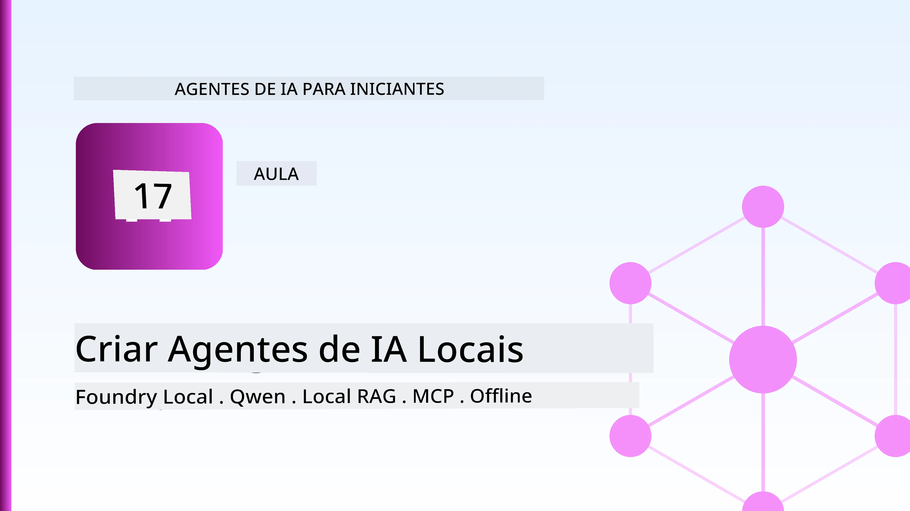
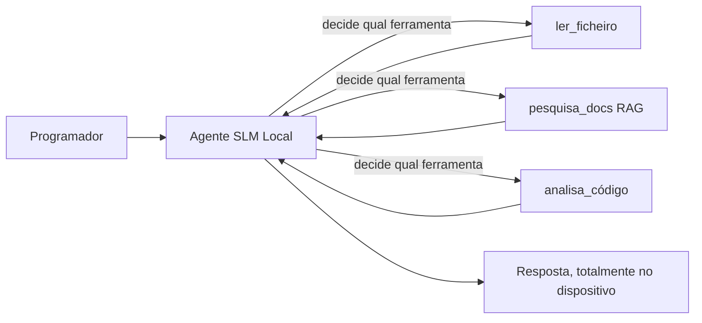
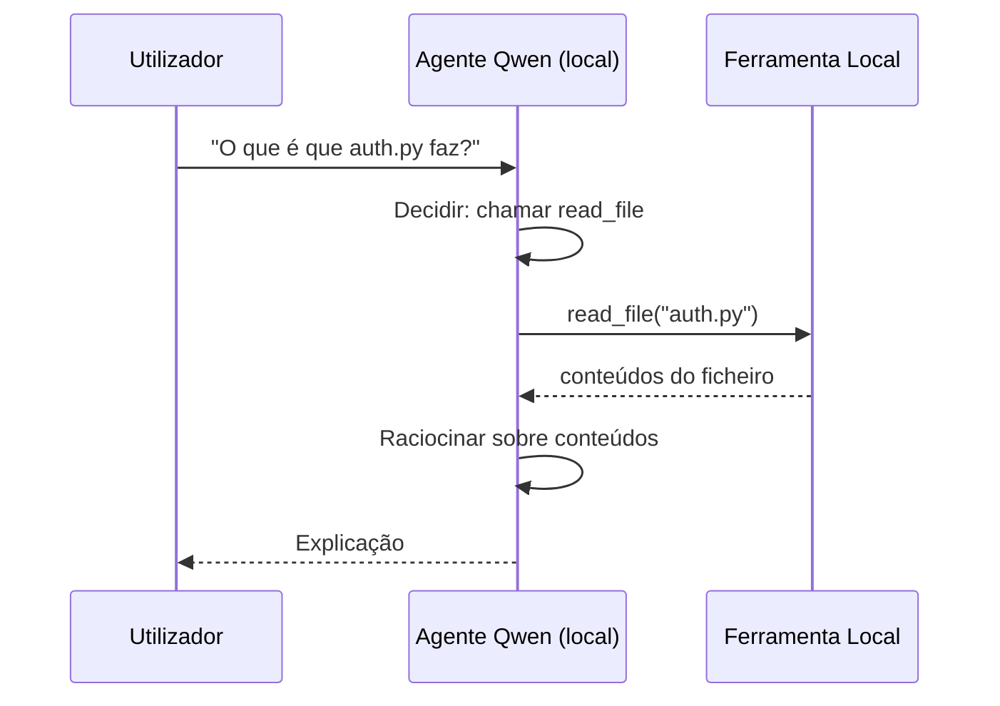
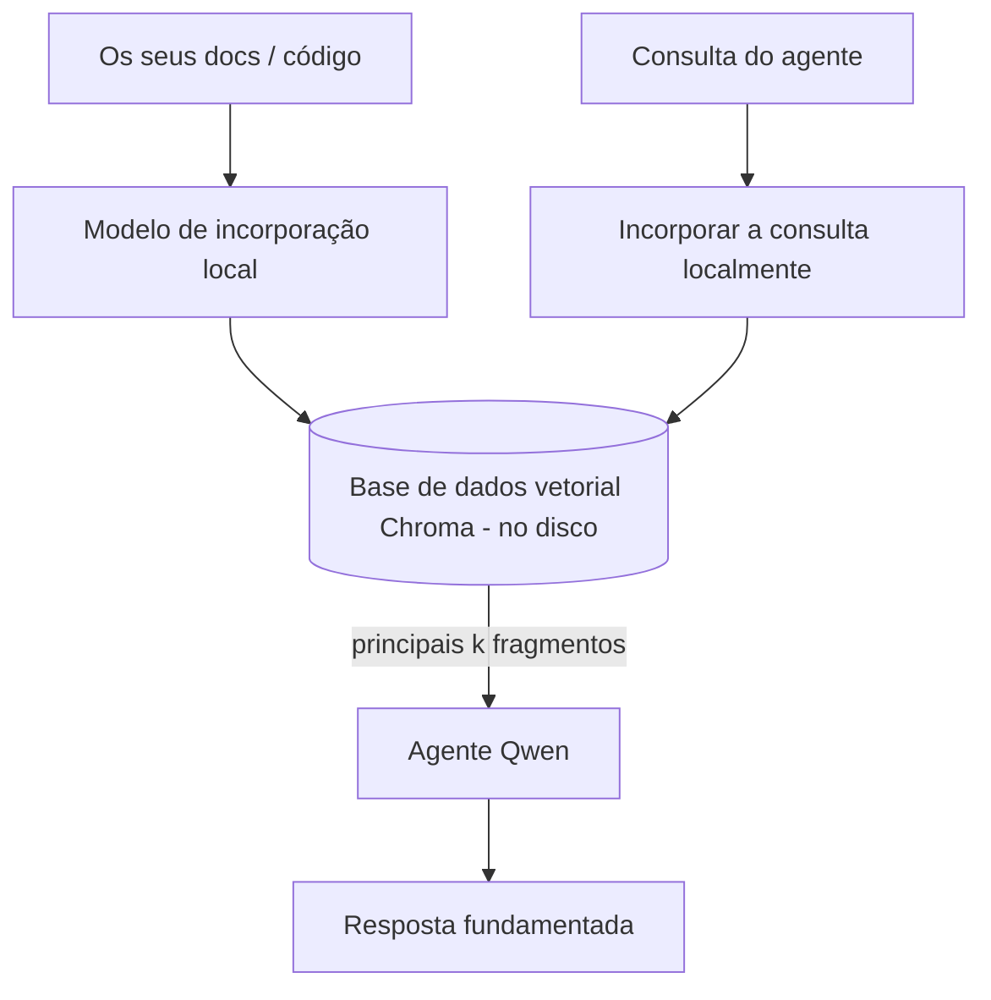
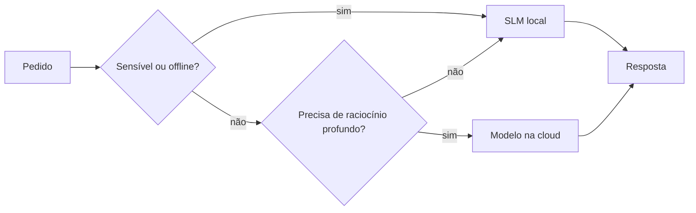

# Criar Agentes de IA Locais Usando Microsoft Foundry Local e Qwen



A lição anterior escalou agentes *para cima* na nuvem. Esta traz-nos *para baixo* para uma única máquina. No final, terá um assistente de engenharia funcional que raciocina, chama ferramentas, lê os seus ficheiros e pesquisa a sua documentação — **sem uma única chamada de inferência na nuvem.**

Por que razão quererá isso? Três razões que surgem constantemente no trabalho real de engenharia:

- **Privacidade.** O código e os documentos nunca saem da máquina. Nenhum prompt, nenhum excerto, nenhum dado do cliente atravessa a fronteira da rede.
- **Custo.** A inferência local não tem cobrança por token. Pode iterar o dia todo pelo preço da eletricidade.
- **Offline.** Num avião, numa instalação segura, ou durante uma interrupção, o agente continua a funcionar.

A contrapartida é que está a trocar um modelo de vanguarda na nuvem por um **Modelo de Linguagem Pequeno (SLM)** a correr no seu CPU, GPU, ou NPU. Esta lição trata de construir agentes que sejam *bons* dentro dessa restrição em vez de fingir que a restrição não existe.

## Introdução

Esta lição abordará:

- **Modelos de Linguagem Pequenos (SLMs)** — o que são, onde se destacam e onde não.
- **Microsoft Foundry Local** — um runtime que faz download e serve modelos localmente via uma **API compatível com OpenAI**.
- **Modelos Qwen de invocação de funções** — SLMs que produzem com fiabilidade chamadas a ferramentas, o que torna possível agentes locais *funcionais* (não apenas chat local).
- **Ferramentas locais, RAG local e MCP local** — dando capacidade ao agente sem a nuvem.
- **Padrões híbridos** — quando manter coisas locais e quando recorrer à nuvem.

## Objetivos de Aprendizagem

Após concluir esta lição, saberá como:

- Explicar os compromissos dos SLMs e escolher casos de uso apropriados para agentes locais.
- Servir um modelo Qwen localmente com Foundry Local e ligar-se a ele através do endpoint compatível com OpenAI.
- Construir um agente que chama ferramentas a correr inteiramente na sua estação de trabalho.
- Adicionar RAG local sobre os seus próprios documentos usando uma base de dados vetorial local (Chroma).
- Ligar o agente a um servidor MCP local e raciocinar sobre desenhos híbridos local/nuve.

## Pré-requisitos

Esta lição assume que completou as lições anteriores e está confortável com:

- [Uso de Ferramentas](../04-tool-use/README.md) (Lição 4) e [Agentic RAG](../05-agentic-rag/README.md) (Lição 5).
- [Protocolos Agénticos / MCP](../11-agentic-protocols/README.md) (Lição 11).
- O [Microsoft Agent Framework](../14-microsoft-agent-framework/README.md) (Lição 14).

Também precisará de:

- Uma estação de trabalho para desenvolvedor. **8 GB de RAM é um mínimo realista**; 16 GB+ é confortável. Um GPU ou NPU ajuda, mas não é obrigatório.
- **Microsoft Foundry Local** instalado (veja a seção de configuração abaixo).
- Python 3.12+ e os pacotes no repositório [`requirements.txt`](../../../requirements.txt), mais `foundry-local-sdk`, `openai`, e `chromadb` para esta lição.

## Modelos de Linguagem Pequenos: A Ferramenta Certa para Trabalho Local

Um modelo de vanguarda na nuvem tem centenas de milhares de milhões de parâmetros e um centro de dados por trás. Um SLM tem alguns milhares de milhões de parâmetros e tem que caber na RAM do seu portátil. Essa diferença define expectativas claras.

**Os SLMs são bons em:**

- Tarefas estruturadas e delimitadas — classificação, extração, sumarização de um documento conhecido.
- **Chamada de ferramentas** — decidir qual função chamar e com que argumentos.
- Iterações rápidas, baratas e privadas nos seus próprios dados.

**Os SLMs são mais fracos em:**

- Raciocínio aberto, multi-salto, sobre contexto extenso.
- Conhecimento amplo do mundo (viram menos e esquecem mais).

A estratégia vencedora para agentes locais é, portanto: **deixar o SLM orquestrar, e deixar as ferramentas fazer o trabalho pesado.** O modelo não precisa de *conhecer* a sua base de código — precisa de saber quando chamar `read_file` e `search_docs`. Isso joga diretamente para os pontos fortes de um SLM.



## Microsoft Foundry Local

**Microsoft Foundry Local** é um runtime leve que descarrega, gere e serve modelos inteiramente na sua máquina. A sua característica mais importante para nós é que expõe um **endpoint HTTP compatível com OpenAI** — o que significa que o SDK OpenAI e o cliente OpenAI do Microsoft Agent Framework funcionam com ele só mudando o `base_url`. Tudo o que aprendeu sobre construir agentes transfere-se diretamente; só o endpoint muda da nuvem para o `localhost`.

O Foundry Local também escolhe automaticamente a melhor compilação de um modelo para o seu hardware — compilação CPU, compilação CUDA/GPU, ou compilação NPU — para que não tenha que otimizar à mão por máquina.

### Configuração

Instale o Foundry Local (veja a [documentação](https://learn.microsoft.com/azure/ai-foundry/foundry-local/) para o seu SO), depois confirme que funciona:

```bash
# Instalar (exemplo; siga a documentação para a sua plataforma)
winget install Microsoft.FoundryLocal      # Windows
# brew install microsoft/foundrylocal/foundrylocal   # macOS

# Descarregue e execute um modelo Qwen, depois inicie o serviço local
foundry model run qwen2.5-7b-instruct
foundry service status
```

Uma vez que o serviço esteja a correr, tem um endpoint local compatível com OpenAI (tipicamente `http://localhost:PORT/v1`). O notebook usa o `foundry-local-sdk` para detectar o endpoint automaticamente, para não precisar de codificar a porta.

## Qwen Invocação de Funções: Por Que É Importante

Um agente só é agente se pode chamar ferramentas. Muitos SLMs conseguem conversar, mas produzem chamadas a ferramentas pouco fiáveis e mal formadas. Os modelos **Qwen** são treinados para invocação de funções e emitem estruturas de chamadas a ferramentas bem formadas de forma consistente — o que é exatamente o que transforma um modelo de chat local num *agente* local.

O fluxo é o ciclo padrão de chamada a ferramentas que já conhece, só que executado localmente:



## RAG Local

A pesquisa na documentação é onde os agentes locais ganham o seu valor. Em vez de esperar que o SLM tenha memorizado a documentação do seu framework, embede essa documentação numa **base de dados vetorial local** e deixe que o agente recupere os fragmentos relevantes sob demanda.

Usamos o **Chroma**, uma store vetorial embutida que corre em processo sem um servidor para gerir. O pipeline é inteiramente local: modelo de embedding local → vetores locais → recuperação local → SLM local.



Este é o mesmo padrão Agentic RAG da Lição 5 — a única mudança é que todos os componentes rodam na sua máquina.

## Servidores MCP Locais

[MCP](../11-agentic-protocols/README.md) é um transporte, não um serviço na nuvem. Um servidor MCP pode correr como processo local em `stdio`, expondo ferramentas ao seu agente através do protocolo padrão. Isto permite reutilizar o ecossistema crescente de servidores MCP — acesso a sistema de ficheiros, operações git, consultas a bases de dados — totalmente offline.

A postura de segurança é diferente da nuvem, mas não inexistente: um servidor MCP local ainda corre com as permissões do seu utilizador, por isso limite o que pode tocar (diretório de projeto, não a sua pasta pessoal toda) e trate as suas saídas como entradas a validar.

## Padrões Híbridos Nuvem-e-Local

Priorizar o local não significa apenas local. Sistemas maduros fazem roteamento por sensibilidade e dificuldade:

| Situação | Onde corre |
| --- | --- |
| Código/dados sensíveis, ou offline | **SLM local** |
| Tarefa simples e delimitada | **SLM local** (barato, rápido) |
| Raciocínio multi-salto difícil em dados não sensíveis | **Modelo na nuvem** |
| Tudo, durante uma falha | **SLM local** (degradação graciosa) |

Isto espelha a ideia de **roteamento de modelo** da Lição 16 — exceto que um dos "modelos" é agora a sua própria máquina. Um design robusto recua para local quando a nuvem está indisponível, de modo que o agente degrade em qualidade em vez de falhar completamente.



## Laboratório Prático: Um Assistente de Engenharia Local

Abra [`code_samples/17-local-agent-foundry-local.ipynb`](./code_samples/17-local-agent-foundry-local.ipynb) e percorra-o. Vai construir um **assistente de engenharia local** que corre inteiramente na sua estação de trabalho e pode:

1. **Chamar ferramentas** — via invocação de funções Qwen através do Foundry Local.
2. **Executar operações locais de ficheiros** — listar e ler ficheiros numa diretoria de projeto.
3. **Analisar código** — reportar métricas básicas num ficheiro fonte.
4. **Pesquisar documentação** — RAG local sobre uma pasta de documentação com Chroma.
5. **Usar MCP** — ligar-se a um servidor MCP local (com pulo gracioso se nenhum estiver configurado).

Nenhuma inferência na nuvem é usada em momento algum.

### Passo a Passo

O assistente liga-se ao Foundry Local pelo endpoint compatível com OpenAI, por isso o código do agente é quase idêntico às lições da nuvem — só o cliente muda:

```python
from foundry_local import FoundryLocalManager
from openai import OpenAI

# Foundry Local descobre/descarrega o modelo e fornece-nos um endpoint local.
manager = FoundryLocalManager(\"qwen2.5-7b-instruct\")
client = OpenAI(base_url=manager.endpoint, api_key=manager.api_key)  # api_key é um marcador local
```

As ferramentas são funções Python comuns direcionadas a uma diretoria de projeto:

```python
def read_file(path: str) -> str:
    \"\"\"Read a file, but only inside the sandboxed project directory.\"\"\"
    full = (PROJECT_ROOT / path).resolve()
    if PROJECT_ROOT not in full.parents and full != PROJECT_ROOT:
        return \"Access denied: path is outside the project directory.\"
    return full.read_text(encoding=\"utf-8\")
```

Note a verificação sandbox — mesmo localmente, uma ferramenta que lê caminhos arbitrários é um risco. O notebook mantém cada ferramenta limitada a uma única raiz de projeto.

## Verificação de Conhecimento

Teste a sua compreensão antes de avançar para o exercício.

**1. Dê duas razões concretas para correr um agente localmente em vez da nuvem.**

<details>
<summary>Resposta</summary>

Duas quaisquer: **privacidade** (código e dados nunca saem da máquina), **custo** (não há cobrança por inferência por token), e **capacidade offline** (funciona sem rede — num avião, numa instalação segura ou durante uma falha). Restrições regulatórias/compliance que proibem o envio de dados fora do dispositivo são um motivo comum da razão de privacidade.
</details>

**2. Qual é a divisão de tarefas recomendada entre um SLM e as suas ferramentas num agente local, e porquê?**

<details>
<summary>Resposta</summary>

Deixe o SLM **orquestrar** (decidir que ferramenta chamar e com que argumentos) e deixe as **ferramentas fazerem o trabalho pesado** (ler ficheiros, recuperar documentos, computar resultados). SLMs são fortes em decisões delimitadas como seleção de ferramenta, mas mais fracos em conhecimento amplo e raciocínio multi-salto longo, por isso apoiar-se nas ferramentas joga em favor dos seus pontos fortes.
</details>

**3. O que torna possível reutilizar código de agente de nuvem com Foundry Local?**

<details>
<summary>Resposta</summary>

O Foundry Local expõe um **endpoint HTTP compatível com OpenAI**. O SDK OpenAI e o cliente OpenAI do Agent Framework funcionam contra ele só mudando o `base_url` (e usando uma chave API placeholder local). Tudo o resto no código do agente mantém-se igual.
</details>

**4. Por que usamos especificamente um modelo Qwen de invocação de funções em vez de qualquer SLM?**

<details>
<summary>Resposta</summary>

Porque um agente deve produzir chamadas a ferramentas **fiáveis e bem formadas**. Muitos SLMs conseguem conversar, mas emitem estruturas de chamadas a ferramentas mal formadas ou inconsistentes. Os modelos Qwen são treinados para invocação de funções e produzem chamadas consistentes, o que transforma um modelo de chat local num agente local funcional.
</details>

**5. No pipeline RAG local, quais componentes correm na máquina?**

<details>
<summary>Resposta</summary>

Todos eles: o modelo de embedding, a base de dados vetorial (Chroma, em disco), a etapa de recuperação, e o SLM. Documentos são embedados localmente, armazenados localmente, recuperados localmente e raciocinados localmente — nenhum componente toca a nuvem.
</details>

**6. Um servidor MCP local corre na sua máquina. Isso torna-o automaticamente seguro? Que precaução deve ainda tomar?**

<details>
<summary>Resposta</summary>

Não. Um servidor MCP local corre com as permissões do seu utilizador, por isso pode tocar em tudo o que você pode. Limite-o ao necessário (por exemplo, uma única diretoria de projeto em vez da sua pasta pessoal toda) e trate as saídas como entradas a validar antes de agir sobre elas.
</details>

**7. Descreva uma regra sensata de roteamento híbrido que inclua um modelo local.**

<details>
<summary>Resposta</summary>

Roteie pedidos sensíveis ou offline para o SLM local; roteie tarefas simples e delimitadas para o SLM local por velocidade e custo; roteie raciocínio multi-salto difícil em dados não sensíveis para um modelo na nuvem; e recue para o SLM local se a nuvem estiver indisponível para que o agente degrade graciosamente em vez de falhar. Isto é roteamento de modelo (Lição 16) com a máquina local como um dos modelos.
</details>

**8. Qual é um valor realista mínimo de RAM para executar o agente local nesta lição, e o que obtém com mais RAM?**

<details>
<summary>Resposta</summary>

Cerca de **8 GB** é um mínimo realista; 16 GB+ é confortável. Mais RAM permite-lhe executar modelos maiores e mais capazes e manter mais contexto em memória. Um GPU ou NPU acelera a inferência, mas não é necessário — o Foundry Local seleciona uma build para CPU quando não há acelerador disponível.
</details>

## Exercício

Expanda o assistente de engenharia local para um **revisor de documentação local** para um pequeno projeto à sua escolha (use uma das pastas de lição deste repositório se quiser).

A sua submissão deve:

1. **Indexar uma pasta real de documentação/código** no Chroma (pelo menos cinco ficheiros).
2. **Adicionar uma ferramenta `find_todos`** que digitalize o projeto em busca de comentários `TODO`/`FIXME` e os retorne com ficheiro e número da linha — mantendo a mesma verificação sandbox que `read_file`.

3. **Faça ao agente três perguntas** que o obriguem a combinar ferramentas: uma pergunta puramente RAG, uma que exija a leitura de um ficheiro específico e outra que exija encontrar TODOs.
4. **Meça-o**: cronometre cada uma das três respostas e anote-as numa célula markdown. Comente se a latência é aceitável para o seu fluxo de trabalho pretendido.

Depois escreva um pequeno parágrafo sobre **o que moveria para a cloud e o que manteria localmente** para este revisor, e porquê. A avaliação baseia-se em saber se os componentes locais estão corretamente ligados e se o seu raciocínio híbrido é sólido — não na qualidade do modelo.

## Resumo

Nesta lição construiu um agente que corre inteiramente no seu próprio computador:

- **SLMs** trocam abrangência por privacidade, custo e operação offline — e brilham quando **orquestram ferramentas** em vez de conter todo o conhecimento por si próprios.
- **Foundry Local** serve modelos no dispositivo por trás de um **endpoint compatível com OpenAI**, para que o seu código de agente na cloud transfira com uma alteração de uma linha.
- **Modelos Qwen com chamadas de função** tornam possível a chamada fiável de ferramentas localmente — e por isso agentes *locais*.
- **RAG local** (Chroma) e **MCP local** dão capacidade ao agente sem sair da máquina.
- **Padrões híbridos** permitem roteamento por sensibilidade e dificuldade, com local como fallback elegante.

Isto completa o arco de deployment: a Lição 16 escalou agentes para o Microsoft Foundry, e esta lição escalou-os para baixo numa única estação de trabalho. A próxima lição aborda manter agentes implantados seguros.

## Recursos adicionais

- <a href="https://learn.microsoft.com/azure/ai-foundry/foundry-local/" target="_blank">Documentação Microsoft Foundry Local</a>
- <a href="https://learn.microsoft.com/azure/ai-foundry/what-is-azure-ai-foundry" target="_blank">Documentação Microsoft Foundry</a>
- <a href="https://aka.ms/ai-agents-beginners/agent-framework" target="_blank">Microsoft Agent Framework</a>
- <a href="https://qwen.readthedocs.io/en/latest/framework/function_call.html" target="_blank">Documentação de chamadas de função Qwen</a>
- <a href="https://modelcontextprotocol.io/" target="_blank">Model Context Protocol (MCP)</a>
- <a href="https://docs.trychroma.com/" target="_blank">Base de dados vetorial Chroma</a>

## Lição anterior

[Deploying Scalable Agents](../16-deploying-scalable-agents/README.md)

## Próxima lição

[Securing AI Agents](../18-securing-ai-agents/README.md)

---

<!-- CO-OP TRANSLATOR DISCLAIMER START -->
**Aviso Legal**:
Este documento foi traduzido utilizando o serviço de tradução automática [Co-op Translator](https://github.com/Azure/co-op-translator). Embora nos esforcemos pela precisão, esteja ciente de que traduções automáticas podem conter erros ou imprecisões. O documento original na sua língua nativa deve ser considerado a fonte autorizada. Para informações críticas, recomenda-se tradução profissional humana. Não nos responsabilizamos por quaisquer mal-entendidos ou interpretações incorretas resultantes da utilização desta tradução.
<!-- CO-OP TRANSLATOR DISCLAIMER END -->