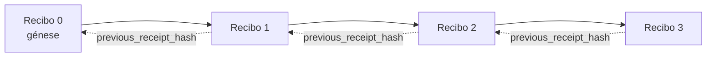

[Veja o vídeo da lição: Protegendo Agentes de IA com Recibos Criptográficos](https://youtu.be/PLACEHOLDER_VIDEO_ID)

> _(Vídeo da lição e miniatura a serem adicionados pela equipa de conteúdos da Microsoft após integração, seguindo o padrão das lições 14 / 15.)_

# Protegendo Agentes de IA com Recibos Criptográficos

## Introdução

Esta lição irá abordar:

- Porque é que as trilhas de auditoria para agentes de IA são importantes para conformidade, depuração e confiança.
- O que é um recibo criptográfico e como se diferencia de uma linha de log não assinada.
- Como produzir um recibo assinado para a chamada de uma ferramenta do agente em Python puro.
- Como verificar um recibo offline e detetar adulterações.
- Como encadear recibos de forma que remover ou reordenar um quebre a cadeia.
- O que os recibos provam e o que explicitamente não provam.

## Objetivos de Aprendizagem

Após completar esta lição, saberá como:

- Identificar os modos de falha que motivam a proveniência criptográfica para ações do agente.
- Produzir um recibo assinado com Ed25519 sobre um payload JSON canónico.
- Verificar um recibo de forma independente usando apenas a chave pública do signatário.
- Detetar adulterações ao reexecutar a verificação num recibo modificado.
- Construir uma sequência de recibos encadeados por hash e explicar porque a cadeia é importante.
- Reconhecer o limite entre o que os recibos provam (atribuição, integridade, ordenação) e o que não provam (correcção da ação, validade da política).

## O Problema: A Trilha de Auditoria do Seu Agente

Imagine que implementou um agente de IA para a Contoso Travel. O agente lê pedidos dos clientes, chama uma API de voos para procurar opções e reserva lugares em nome do cliente. No último trimestre, o agente processou 50.000 reservas.

Hoje chega um auditor. Ele faz uma pergunta simples: "Mostre-me o que o seu agente fez."

Você entrega os seus ficheiros de log. O auditor olha para eles e faz a pergunta mais difícil: "Como posso saber que estes logs não foram editados?"

Este é o problema da trilha de auditoria. A maioria das implementações de agentes hoje em dia depende de:

- **Logs de aplicação**: escritos pelo próprio agente, editáveis por qualquer pessoa com acesso ao sistema de ficheiros.
- **Serviços de logging na cloud**: à prova de adulteração ao nível da plataforma, mas apenas se o auditor confiar no operador da plataforma.
- **Logs de transações de bases de dados**: adequados para alterações em bases de dados, mas não para chamadas arbitrárias de ferramentas.

Nenhum destes consegue responder à pergunta do auditor sem exigir que ele confie em alguém (você, o seu fornecedor de cloud, o fornecedor da sua base de dados). Para uso interno, essa confiança é muitas vezes aceitável. Para cargas de trabalho regulamentadas (finanças, saúde, qualquer coisa sujeita ao AI Act da UE), não é.

Os recibos criptográficos resolvem isto tornando cada ação do agente verificável de forma independente. O auditor não precisa de confiar em si. Só precisa da chave pública e do próprio recibo.

## O Que é um Recibo Criptográfico?

Um recibo é um objeto JSON que regista o que um agente fez, assinado com uma assinatura digital.


Um recibo mínimo é assim:

```json
{
  "type": "agent.tool_call.v1",
  "agent_id": "contoso-travel-bot",
  "tool_name": "lookup_flights",
  "tool_args_hash": "sha256:a3f9c1...",
  "result_hash": "sha256:7b2e1d...",
  "policy_id": "contoso-travel-policy-v3",
  "timestamp": "2026-04-25T14:30:00Z",
  "sequence": 47,
  "previous_receipt_hash": "sha256:9d4e6a...",
  "signature": {
    "alg": "EdDSA",
    "sig": "c5af83...",
    "public_key": "8f3b2c..."
  }
}
```

Três propriedades estão a fazer o trabalho:

1. **A assinatura**. O recibo é assinado pelo gateway do agente usando uma chave privada Ed25519. Quem tiver a chave pública correspondente pode verificar a assinatura offline. Adulterar qualquer campo invalida a assinatura.

2. **Codificação canónica**. Antes de assinar, o recibo é serializado usando o Esquema de Canonicalização JSON (JCS, RFC 8785). Isto garante que duas implementações que produzem o mesmo recibo lógico produzem uma saída byte-idêntica. Sem canonização, diferentes serializadores JSON originariam assinaturas diferentes para o mesmo conteúdo.

3. **Encadeamento por hash**. O campo `previous_receipt_hash` liga cada recibo ao anterior. Remover ou reordenar um recibo quebra cada recibo que veio depois dele. A adulteração torna-se visível a nível da cadeia mesmo que se ignorem assinaturas individuais.

Em conjunto, estas propriedades fornecem três garantias:

- **Atribuição**: esta chave assinou este conteúdo.
- **Integridade**: o conteúdo não mudou desde a assinatura.
- **Ordenação**: este recibo veio depois daquele recibo na cadeia.

## Produzir um Recibo em Python

Não precisa de uma biblioteca especial para produzir um recibo. As primitivas criptográficas são amplamente disponíveis e a lógica são algumas dezenas de linhas em Python.

Os exercícios práticos em `code_samples/18-signed-receipts.ipynb` percorrem o fluxo completo. A versão resumida:

```python
import json
import hashlib
import base64
from nacl import signing
from jcs import canonicalize  # JSON canónico segundo a RFC 8785

def b64url_nopad(data: bytes) -> str:
    return base64.urlsafe_b64encode(data).decode("ascii").rstrip("=")

def sha256_canonical(obj) -> str:
    """SHA-256 of a Python object's JCS-canonical JSON form."""
    return f"sha256:{hashlib.sha256(canonicalize(obj)).hexdigest()}"

# Gerar ou carregar uma chave de assinatura (em produção, armazenar num cofre de chaves)
signing_key = signing.SigningKey.generate()
verify_key = signing_key.verify_key

# Construir o payload do recibo (ainda sem assinatura)
tool_args = {"origin": "SYD", "destination": "LAX"}
tool_result = [{"flight": "QF11", "price": 1850, "stops": 0}]

payload = {
    "type": "agent.tool_call.v1",
    "agent_id": "contoso-travel-bot",
    "tool_name": "lookup_flights",
    "tool_args_hash": sha256_canonical(tool_args),
    "result_hash": sha256_canonical(tool_result),
    "policy_id": "contoso-travel-policy-v3",
    "timestamp": "2026-04-25T14:30:00Z",
    "sequence": 0,
    "previous_receipt_hash": None,
}

# Canonicalizar, hash, assinar.
canonical_bytes = canonicalize(payload)
message_hash = hashlib.sha256(canonical_bytes).digest()
signature_bytes = signing_key.sign(message_hash).signature

# Anexar um objeto de assinatura estruturado.
receipt = {
    **payload,
    "signature": {
        "alg": "EdDSA",
        "sig": b64url_nopad(signature_bytes),
        "public_key": b64url_nopad(bytes(verify_key)),
    },
}
```

Esse é todo o pipeline de assinatura. Os exercícios no notebook explicam cada passo.

## Verificar um Recibo e Detetar Adulteração

A verificação é a operação inversa:

```python
import base64
import hashlib
from nacl import signing
from nacl.exceptions import BadSignatureError
from jcs import canonicalize

def b64url_decode(s: str) -> bytes:
    padding = "=" * ((4 - len(s) % 4) % 4)
    return base64.urlsafe_b64decode(s + padding)

def verify_receipt(receipt: dict) -> bool:
    # A assinatura é um objeto estruturado: {"alg", "sig", "public_key"}.
    sig_obj = receipt.get("signature")
    if not sig_obj or sig_obj.get("alg") != "EdDSA":
        return False

    # Reconstrua o conteúdo que foi realmente assinado (tudo excepto a assinatura).
    payload = {k: v for k, v in receipt.items() if k != "signature"}

    canonical_bytes = canonicalize(payload)
    message_hash = hashlib.sha256(canonical_bytes).digest()

    try:
        verify_key = signing.VerifyKey(b64url_decode(sig_obj["public_key"]))
        verify_key.verify(message_hash, b64url_decode(sig_obj["sig"]))
        return True
    except BadSignatureError:
        return False
```

Esta função recebe um recibo e retorna `True` se a assinatura for válida, `False` caso contrário. Sem chamada de rede, sem dependência de serviço, sem necessidade de confiar em terceiros.

Para ver a detecção de adulterações em ação, o notebook percorre:

1. Produzir um recibo válido e confirmar que ele verifica.
2. Modificar um byte do campo `tool_args_hash`.
3. Reexecutar a verificação e ver que ela falha.

Esta é a demonstração prática que os recibos evidenciam adulteração: qualquer modificação, por menor que seja, rompe a assinatura.

## Encadear Recibos para Agentes com Múltiplos Passos

Um único recibo assinado protege uma ação. Uma cadeia de recibos protege uma sequência.



Cada recibo regista o hash do recibo anterior. Para remover silenciosamente o recibo 2, um atacante teria de:

- Modificar o campo `previous_receipt_hash` do recibo 3 (quebra a assinatura do recibo 3), OU
- Forjar uma nova assinatura num recibo 3 modificado (requer a chave privada do agente).

Se a chave privada estiver num cofre de chaves hardware e você publicar a chave pública com cada recibo, nenhum destes ataques é possível sem ser detetado.

O notebook percorre:

1. Construir uma cadeia de três recibos.
2. Verificar que o `previous_receipt_hash` de cada recibo corresponde ao hash real do recibo anterior.
3. Adulterar um recibo no meio e ver a cadeia quebrar exatamente nesse ponto.

É assim que produz uma trilha de auditoria que um auditor externo pode verificar sem confiar em si.

## O Que os Recibos Provam (e o Que Não Provam)

Esta é a secção mais importante desta lição. Os recibos são poderosos, mas o seu poder é limitado.

**Os recibos provam três coisas:**

1. **Atribuição**: uma chave específica assinou um payload específico.
2. **Integridade**: o payload não mudou desde a assinatura.
3. **Ordenação**: este recibo veio depois daquele na cadeia de hash.

**Os recibos NÃO provam:**

1. **Correcção**: que a ação do agente foi a ação correta. Um recibo pode ser assinado para uma resposta errada tão limpidamente como para uma correta.
2. **Conformidade com a política**: que a política referida em `policy_id` foi realmente avaliada ou que teria permitido esta ação se verificada. O recibo regista o que foi alegado, não o que foi aplicado.
3. **Identidade para além da chave**: o recibo diz "esta chave assinou este conteúdo." Não diz "este humano autorizou isto." Ligar uma chave a uma pessoa ou organização requer infraestrutura de identidade separada (um diretório, um registo de chaves públicas, etc.).
4. **Verdade dos inputs**: se o agente recebe um prompt manipulado e age com base nele, o recibo regista a ação fielmente. Os recibos são a jusante da validação de inputs, não um substituto para ela.

Este limite importa por duas razões:

- Diz-lhe para que os recibos são úteis: tornar o comportamento do agente auditável e à prova de adulterações, mesmo entre fronteiras organizacionais.
- Diz-lhe que camadas adicionais ainda precisa: validação de inputs (Lição 6), aplicação de políticas (coberta brevemente abaixo) e infraestrutura de identidade (fora do âmbito desta lição).

Um erro comum é assumir que "temos recibos" significa "estamos regulados." Não significa. Recibos são uma base. Regulação é o sistema que constrói por cima.

## Provar que um Humano aprovou a Ação Exata

O ponto 3 acima merece uma secção própria: um recibo de ação diz "esta chave assinou este conteúdo," nunca "um humano autorizou isto." Para ações de alto risco (reembolsos, eliminações, transferências bancárias), estruturas de governação cada vez mais exigem exactamente essa declaração em falta, e é produzível com as mesmas primitivas que já construiu nesta lição.

O notebook complementar `code_samples/human-authorization-receipts.ipynb` acrescenta um segundo tipo de recibo, `human.approval.v1`, na mesma estrutura de envelope que os recibos da lição (um payload tipado assinado por Ed25519 sobre o seu SHA-256 canónico, com o objeto `signature` fora dos bytes assinados). Um aprovador nomeado assina a **ação canónica completa e o seu resumo** antes da execução; o recibo de ação do agente carrega o **mesmo resumo da ação** e um `parent_approval_ref`, o `receipt_hash` da aprovação, a mesma convenção que `previous_receipt_hash` na cadeia construída acima. Uma função `verify_chain` percorre ambos os artefactos em **registos de chaves fixos separados** (chaves dos aprovadores vs chaves dos agentes), portanto o caminho do código é partilhado mas as autoridades nunca são.

A propriedade adquirida, expressa cuidadosamente: *o humano aprovou esta ação exata, e o agente executou exatamente essa ação aprovada.* Os exemplos de recusa no notebook é que tornam a propriedade real em vez de afirmada:

- o conjunto clássico: adulteração, delegado confuso, replay, chaves forjadas em ambos os lados, input malformado;
- **autoridade obsoleta**: uma assinatura que ainda verifica, recusada na mesma porque a versão da política mudou, a chave do aprovador foi retirada do registo fixo, ou a aprovação expirou antes da execução;
- **substituição de resumo**: um recibo de ação válido assinado dirigido a uma *aprovação real* que liga a uma *ação canónica diferente*.

Cada falha recusa com um motivo distinto, para que um auditor lendo uma recusa possa saber se a autoridade ficou obsoleta ou se a ação executada mudou. A regra que o notebook ensina: uma aprovação assinada não é autoridade por si só. A autoridade existe apenas se ambos os recibos ainda ligam à mesma ação canónica no momento da execução. O caminho da cosignatura no mesmo Internet-Draft que esta lição segue (`draft-farley-acta-signed-receipts`) é a forma padrão deste padrão.

## Referências para Produção

O código Python nesta lição é intencionalmente minimalista para que possa ler cada linha e entender exatamente o que está a acontecer. Em produção, tem duas opções:

1. **Construir diretamente sobre as primitivas criptográficas.** As 50 linhas que viu acima são suficientes para muitos casos de uso. PyNaCl (Ed25519) e o pacote `jcs` (JSON canónico) são bibliotecas bem mantidas e auditadas.

2. **Usar uma biblioteca de recebos para produção.** Vários projetos open-source implementam o mesmo padrão com funcionalidades adicionais (rotação de chaves, verificação em lote, distribuição de conjuntos JWK, integração com motores de políticas):
   - O formato do recibo usado nesta lição segue um Internet-Draft do IETF ([`draft-farley-acta-signed-receipts`](https://datatracker.ietf.org/doc/draft-farley-acta-signed-receipts/), revisão 02) atualmente no processo de normalização, com uma suíte de conformidade partilhada ([agent-governance-testvectors](https://github.com/ScopeBlind/agent-governance-testvectors)) que implementações independentes verificam mutuamente para saída canónica byte-idêntica.
   - O Microsoft Agent Governance Toolkit compõe recibos com decisões de política baseadas em Cedar; veja o Tutorial 33 nesse repositório para um exemplo completo.
   - Os pacotes `protect-mcp` (npm) e `@veritasacta/verify` (npm) fornecem uma implementação Node de assinatura e verificação offline de recibos, destinada a empacotar qualquer servidor MCP com uma trilha de auditoria à prova de adulteração, incluindo um fluxo em que uma ação em pausa emite um recibo de aprovação ligado ao resumo da ação (suportado por WebAuthn no fluxo desktop), o mesmo padrão de recibo de aprovação do notebook de autorização humana acima.
   - O SDK Python **[nobulex](https://github.com/arian-gogani/nobulex)** (`pip install nobulex`) fornece o mesmo padrão de assinatura Ed25519 + JCS em Python com integrações LangChain e CrewAI, incluindo vetores de teste publicados para validação cruzada e um mapeamento de conformidade contribuído através do [OWASP PR #2210](https://github.com/OWASP/CheatSheetSeries/pull/2210).

A decisão entre construir o seu próprio ou usar uma biblioteca espelha a decisão entre escrever a sua própria biblioteca JWT e usar uma testada: ambos são razoáveis; a biblioteca poupa tempo e reduz a superfície de auditoria; a abordagem do zero obriga a entender cada primitiva. Esta lição ensina o caminho do zero para que tenha a base para qualquer escolha.

## Verificação de Conhecimentos

Teste a sua compreensão antes de passar para o exercício prático.

**1. Um recibo é assinado com a chave privada Ed25519 do agente. O auditor tem apenas a chave pública. Pode o auditor verificar o recibo offline?**

<details>
<summary>Resposta</summary>

Sim. A verificação Ed25519 requer apenas a chave pública e os bytes assinados. Sem chamada de rede, sem dependência de serviços. Esta é a propriedade que torna os recibos úteis em contextos air-gapped, multi-organização ou de baixa confiança para auditoria.
</details>

**2. Um atacante modifica o campo `policy_id` de um recibo para alegar que estava regido por uma política mais permissiva. A assinatura foi feita sobre o payload original. O que acontece durante a verificação?**

<details>
<summary>Resposta</summary>


A verificação falha. A assinatura foi calculada sobre os bytes canónicos da carga original; modificar qualquer campo altera os bytes canónicos, o que altera o hash SHA-256, tornando a assinatura inválida. O atacante precisaria da chave privada para produzir uma assinatura válida nova, que não possui.
</details>

**3. Porque é que o recibo inclui um `tool_args_hash` e `result_hash` em vez dos argumentos e resultado brutos?**

<details>
<summary>Resposta</summary>

Dois motivos. Primeiro, o recibo pode precisar ser arquivado ou transmitido em ambientes onde a exposição do conteúdo bruto (PII, dados empresariais) é um problema. O hashing mantém o recibo pequeno e o conteúdo privado; o auditor verifica que o hash corresponde a uma cópia armazenada separadamente do conteúdo real. Segundo, os hashes têm tamanho fixo; um recibo com hashes tem um tamanho limitado independentemente do tamanho das entradas e saídas.
</details>

**4. O campo `previous_receipt_hash` liga cada recibo ao seu predecessor. Se um atacante eliminar silenciosamente um recibo do meio da cadeia, o que se torna inválido?**

<details>
<summary>Resposta</summary>

Todos os recibos que vieram depois do eliminado. Os seus campos `previous_receipt_hash` deixam de corresponder à cadeia real (porque o recibo a que faziam referência deixou de existir ou a cadeia agora aponta para um predecessor diferente). Para esconder a eliminação, o atacante teria de re-assinar todos os recibos posteriores, o que requer a chave privada.
</details>

**5. Um recibo é verificado com sucesso. Isso prova que a ação do agente foi correta, válida ou conforme a política?**

<details>
<summary>Resposta</summary>

Não. Um recibo válido prova três coisas: atribuição (esta chave assinou este conteúdo), integridade (o conteúdo não foi alterado) e ordenação (este recibo veio depois daquele recibo). NÃO prova que a ação foi correta, que a política nomeada em `policy_id` foi efetivamente avaliada ou que o agente seguiu todas as regras. Os recibos tornam o comportamento do agente auditável, não necessariamente correto. Esta é a fronteira mais importante da lição.
</details>

## Exercício Prático

Abra `code_samples/18-signed-receipts.ipynb` e complete todas as quatro secções:

1. **Secção 1**: Assine o seu primeiro recibo e verifique-o.
2. **Secção 2**: Manipule o recibo e observe a falha de verificação.
3. **Secção 3**: Construa uma cadeia de três recibos e verifique a integridade da cadeia.
4. **Secção 4**: Aplique o padrão a um agente construído com o Microsoft Agent Framework: envolva uma chamada de ferramenta na assinatura do recibo e depois verifique o recibo independentemente.

**Desafio adicional 1:** estenda o esquema do recibo com um campo adicional à sua escolha (por exemplo, um ID de pedido para rastreio), atualize a lógica clássica de assinatura para incluí-lo e confirme que o recibo ainda completa o ciclo de verificação. Depois modifique o campo após a assinatura e confirme que a verificação falha. Isto obriga a entender como cada byte da codificação canónica contribui para a assinatura.

**Desafio adicional 2:** faça o hash SHA-256 de dois dos seus recibos juntos (concatene os seus bytes canónicos numa ordem determinística) e incorpore o digest resultante como um novo campo num terceiro recibo antes de o assinar. Verifique que os três recibos ainda completam o ciclo. Acabou de construir uma prova de inclusão num só passo: qualquer pessoa com o terceiro recibo pode provar que os dois primeiros existiam à data da sua assinatura, sem precisar revelar o seu conteúdo. Este é o padrão que os recibos de divulgação seletiva usam em larga escala (compromissos de Merkle, RFC 6962).

## Conclusão

Recibos criptográficos dão aos agentes de IA um trilho de auditoria que é:

- **Independente de verificação**: qualquer parte com a chave pública pode verificar, sem dependência de serviço.
- **A prova de manipulação**: qualquer modificação invalida a assinatura.
- **Portátil**: um recibo é um pequeno ficheiro JSON; pode ser arquivado, transmitido e verificado em qualquer lugar.
- **Alinhado com padrões**: construído sobre Ed25519 (RFC 8032), JCS (RFC 8785) e SHA-256, todos primitivos amplamente usados.

Não são um substituto para validação de entrada, aplicação de políticas ou infraestrutura de identidade. São a base para essas camadas. Quando estiver a implementar agentes em cargas de trabalho reguladas, fluxos de trabalho multi-organização ou qualquer ambiente onde não se possa assumir que um auditor futuro confie em si, os recibos são a forma de garantir um trilho de auditoria honesto.

A lição mais importante: os recibos provam quem disse o quê e quando. Não provam que o que foi dito é verdade ou está correto. Tenha essa distinção bem presente. É a diferença entre um sistema de proveniência honesto e um enganador.

## Lista de Verificação para Produção

Quando estiver pronto para avançar desta lição para implementar agentes assinados com recibos num ambiente real:

- [ ] **Mova a chave de assinatura para fora do portátil do desenvolvedor.** Use Azure Key Vault, AWS KMS ou um módulo de segurança hardware. A chave privada que assina os seus recibos nunca deve estar no controlo de versão ou em texto plano nas máquinas da aplicação.
- [ ] **Publique a chave pública de verificação.** Os auditores precisam dela para verificar offline. O padrão é um JWK Set num URL conhecido (RFC 7517), por exemplo, `https://your-org.example.com/.well-known/agent-keys.json`.
- [ ] **Ancore a cadeia externamente.** Periodicamente grave o hash da cabeça da cadeia num registo de transparência (Sigstore Rekor, autoridade de tempo RFC 3161, ou um segundo sistema interno) para que terceiros possam confirmar "esta cadeia existia a esta data."
- [ ] **Armazene os recibos de forma imutável.** Armazenamento de blob só acrescenta (Azure Storage com políticas de imutabilidade, AWS S3 Object Lock) impede alterações retroativas da história numa camada de armazenamento.
- [ ] **Decida sobre a retenção.** Muitos regimes de conformidade exigem retenção multi-anual. Planeie o crescimento dos recibos (cada recibo tem ~500 bytes; um agente que faz 10K chamadas por dia gera ~1.8 GB por ano).
- [ ] **Documente o que os recibos não cobrem.** Recibos provam atribuição, integridade e ordenação. O seu manual deve listar explicitamente quais controles adicionais (validação de entrada, aplicação de políticas, limitação de taxa, infraestrutura de identidade) coexistem com recibos na sua postura de governação.

### Tem mais perguntas sobre a segurança dos agentes de IA?

Junte-se ao [Microsoft Foundry Discord](https://aka.ms/ai-agents/discord) para encontrar outros aprendizes, participar em horas de atendimento e obter respostas às suas perguntas sobre agentes de IA.

## Para além desta lição

Esta lição cobre assinatura de recibos únicos e sequências encadeadas por hash. Os mesmos primitivos compõem vários padrões mais avançados que poderá encontrar à medida que a sua postura de governação evolui:

- **Divulgação seletiva.** Quando os campos de um recibo são comprometidos independentemente (árvore de Merkle ao estilo RFC 6962), pode revelar campos específicos a auditores específicos e provar que o resto permanece inalterado sem expô-los. Útil quando um mesmo recibo tem de satisfazer uma auditoria abrangente (que requer completude) e regulamentos de minimização de dados como o RGPD (que querem que o auditor veja o mínimo possível).
- **Revogação de recibos.** Se uma chave de assinatura é comprometida, precisa de um método para marcar todos os recibos assinados por essa chave como não confiáveis a partir de um momento. Padrões comuns: chaves de assinatura de curta duração mais uma lista de revogação publicada, ou registo de transparência com entradas de revogação.
- **Recibos bilaterais / com assinatura dividida.** Algumas implementações dividem a carga assinada em meias pré-execução (`authorization_*`) e pós-execução (`result_*`) com assinaturas independentes, útil quando a decisão de autorização e o resultado observado são produzidos por atores diferentes ou em momentos diferentes. Isto adiciona-se ao formato do recibo ensinado nesta lição.
- **Composição da carga.** Um recibo sela quaisquer bytes colocados em `result_hash`. Cargas reais são tipicamente mais ricas do que um único resultado de chamada de ferramenta: raciocínio pré-decisão (previsão de modelo, opções consideradas, evidências e sua completude, postura de risco, cadeia de responsabilidade, resultado do gate) podem estar dentro da carga, selados por um único recibo. Isto mantém o formato do recibo minimalista enquanto permite evolução dos esquemas das cargas por domínio.
- **Conformidade entre implementações.** Múltiplas implementações independentes do mesmo formato de recibo (Python, TypeScript, Rust, Go) verificam-se mutuamente contra vetores de teste partilhados. Se construir a sua própria implementação, validar contra vetores publicados confirma compatibilidade em rede.
- **Migração pós-quântica.** Ed25519 está amplamente usado hoje mas não é resistente a ataques quânticos. O formato do recibo é ágil a nível de algoritmo: o campo `signature.alg` pode conter `ML-DSA-65` (o padrão NIST para assinatura pós-quântica) quando precisar de migrar. Planeie um período de transição em que os recibos são assinados em duplicado.

## Recursos Adicionais

- <a href="https://datatracker.ietf.org/doc/draft-farley-acta-signed-receipts/" target="_blank">IETF Internet-Draft: Recibos de Decisão Assinados para Controlo de Acesso Máquina-a-Máquina</a>
- <a href="https://learn.microsoft.com/azure/ai-studio/responsible-use-of-ai-overview" target="_blank">Visão geral da IA responsável (Azure AI)</a>
- <a href="https://datatracker.ietf.org/doc/html/rfc8032" target="_blank">RFC 8032: Algoritmo de Assinatura Digital Edwards-Curve (EdDSA)</a>
- <a href="https://datatracker.ietf.org/doc/html/rfc8785" target="_blank">RFC 8785: Esquema de Canonicalização JSON (JCS)</a>
- <a href="https://datatracker.ietf.org/doc/html/rfc6962" target="_blank">RFC 6962: Transparência de Certificado</a> (construção de árvore de Merkle usada por recibos de divulgação seletiva)
- <a href="https://github.com/microsoft/agent-governance-toolkit/blob/main/docs/tutorials/33-offline-verifiable-receipts.md" target="_blank">Microsoft Agent Governance Toolkit, Tutorial 33: Recibos de Decisão Verificáveis Offline</a>
- <a href="https://github.com/ScopeBlind/agent-governance-testvectors" target="_blank">Vetores de teste de conformidade entre implementações</a> para o formato de recibo usado nesta lição (Apache-2.0)
- <a href="https://pynacl.readthedocs.io/" target="_blank">Documentação PyNaCl</a> (Ed25519 em Python)

## Lição Anterior

[Criar Agentes de IA Locais](../17-creating-local-ai-agents/README.md)

---

<!-- CO-OP TRANSLATOR DISCLAIMER START -->
**Aviso Legal**:
Este documento foi traduzido utilizando o serviço de tradução automática [Co-op Translator](https://github.com/Azure/co-op-translator). Embora nos esforcemos pela precisão, esteja ciente de que traduções automáticas podem conter erros ou imprecisões. O documento original na sua língua nativa deve ser considerado a fonte autorizada. Para informações críticas, recomenda-se tradução profissional humana. Não nos responsabilizamos por quaisquer mal-entendidos ou interpretações incorretas resultantes da utilização desta tradução.
<!-- CO-OP TRANSLATOR DISCLAIMER END -->