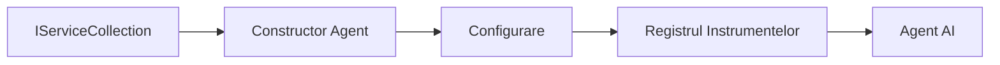

# 🎨 Patternuri de Design Agentice cu Azure OpenAI (Responses API) (.NET)

## 📋 Obiective de Învățare

Acest exemplu demonstrează patternuri de design de nivel enterprise pentru construirea agenților inteligenți folosind Microsoft Agent Framework în .NET cu integrarea Azure OpenAI (Responses API). Veți învăța patternuri profesionale și abordări arhitecturale care fac agenții pregătiți pentru producție, ușor de întreținut și scalabili.

### Patternuri de Design Enterprise

- 🏭 **Factory Pattern**: Crearea standardizată a agenților cu injecție de dependențe
- 🔧 **Builder Pattern**: Configurare și setare fluentă a agenților
- 🧵 **Patternuri Thread-Safe**: Management concurent al conversațiilor
- 📋 **Repository Pattern**: Management organizat al uneltelor și capabilităților

## 🎯 Beneficii Arhitecturale Specifice .NET

### Caracteristici Enterprise

- **Tipizare Puternică**: Validare la compilare și suport IntelliSense
- **Injecție de Dependențe**: Integrare container DI încorporat
- **Managementul Configurației**: Modelele IConfiguration și Options
- **Async/Await**: Suport de primă clasă pentru programare asincronă

### Patternuri Pregătite pentru Producție

- **Integrare Logging**: Suport ILogger și logging structurat
- **Health Checks**: Monitorizare și diagnosticare încorporată
- **Validarea Configurației**: Tipizare puternică cu adnotări de date
- **Gestionarea Erorilor**: Management structurat al excepțiilor

## 🔧 Arhitectură Tehnică

### Componente de Bază .NET

- **Microsoft.Extensions.AI**: Abstracții unificate pentru servicii AI
- **Microsoft.Agents.AI**: Framework de orchestrare enterprise pentru agenți
- **Azure OpenAI (Responses API)**: Patternuri client API de înaltă performanță
- **Sistem de Configurație**: appsettings.json și integrare mediului

### Implementarea Patternurilor de Design



## 🏗️ Patternuri Enterprise Demonstrate

### 1. **Patternuri Creationale**

- **Agent Factory**: Crearea centralizată a agenților cu configurare consistentă
- **Builder Pattern**: API fluent pentru configurare complexă a agenților
- **Singleton Pattern**: Resurse partajate și managementul configurației
- **Injecție de Dependențe**: Decuplare slabă și testabilitate

### 2. **Patternuri Comportamentale**

- **Strategy Pattern**: Strategii interschimbabile pentru execuția uneltelor
- **Command Pattern**: Operații încapsulate ale agenților cu undo/redo
- **Observer Pattern**: Management event-driven al ciclului de viață al agentului
- **Template Method**: Fluxuri de lucru standardizate pentru execuția agenților

### 3. **Patternuri Structurale**

- **Adapter Pattern**: Strat de integrare Azure OpenAI (Responses API)
- **Decorator Pattern**: Îmbunătățirea capabilităților agentului
- **Facade Pattern**: Interfețe simplificate pentru interacțiunea cu agenții
- **Proxy Pattern**: Încărcare leneșă și caching pentru performanță

## 📚 Principii de Design .NET

### Principiile SOLID

- **Responsabilitate Unică**: Fiecare componentă are un scop clar
- **Deschis/Închis**: Extensibil fără modificare
- **Substituția Liskov**: Implementări bazate pe interfețe ale uneltelor
- **Segregarea Interfeței**: Interfețe concentrate și coezive
- **Inversiunea Dependenței**: Dependă de abstracții, nu de concrete

### Arhitectură Curată

- **Stratul Domeniu**: Abstracții de bază ale agentului și uneltelor
- **Stratul Aplicație**: Orchestrarea agenților și fluxuri de lucru
- **Stratul Infrastructură**: Integrare Azure OpenAI (Responses API) și servicii externe
- **Stratul Prezentare**: Interacțiunea cu utilizatorul și formatarea răspunsului

## 🔒 Considerații Enterprise

### Securitate

- **Management acreditări**: Gestionare sigură a cheilor API cu IConfiguration
- **Validare Input**: Tipizare puternică și validare adnotări de date
- **Sanitizarea Output**: Procesare și filtrare securizată a răspunsurilor
- **Audit Logging**: Urmărire completă a operațiunilor

### Performanță

- **Patternuri Async**: Operații I/O neblocate
- **Pooling Conexiuni**: Management eficient al clientului HTTP
- **Caching**: Cache pentru răspunsuri pentru performanță îmbunătățită
- **Managementul Resurselor**: Patternuri corecte de eliminare și curățare

### Scalabilitate

- **Siguranță Thread**: Suport concurent pentru execuția agenților
- **Pooling Resurse**: Utilizare eficientă a resurselor
- **Managementul Sarcinii**: Limitare rată și gestionare presiune inversă
- **Monitorizare**: Metrici de performanță și verificări de sănătate

## 🚀 Implementare în Producție

- **Management Configurație**: Setări specifice mediului
- **Strategie Logging**: Logging structurat cu ID-uri de corelare
- **Gestionarea Erorilor**: Gestionare globală a excepțiilor cu recuperare adecvată
- **Monitorizare**: Application Insights și contoare de performanță
- **Testare**: Teste unitare, teste de integrare și patternuri de testare la încărcare

Gata să construiți agenți inteligenți de nivel enterprise cu .NET? Hai să arhitecturăm ceva robust! 🏢✨

## 🚀 Începutul

### Cerințe Prealabile

- [SDK .NET 10](https://dotnet.microsoft.com/download/dotnet/10.0) sau versiune superioară
- Un [abonament Azure](https://azure.microsoft.com/free/) cu o resursă Azure OpenAI și o implementare model
- Azure CLI-ul [Azure CLI](https://learn.microsoft.com/cli/azure/install-azure-cli) — autentificare cu `az login`

### Variabile de Mediu Necesare

```bash
# zsh/bash
export AZURE_OPENAI_ENDPOINT=https://<your-resource>.openai.azure.com
export AZURE_OPENAI_DEPLOYMENT=gpt-4.1-mini
# Apoi autentificați-vă pentru ca AzureCliCredential să poată obține un token
az login
```

```powershell
# PowerShell
$env:AZURE_OPENAI_ENDPOINT = "https://<your-resource>.openai.azure.com"
$env:AZURE_OPENAI_DEPLOYMENT = "gpt-4.1-mini"
# Apoi autentificați-vă pentru ca AzureCliCredential să poată obține un token
az login
```

### Cod Exemplu

Pentru a rula exemplul de cod,

```bash
# zsh/bash
chmod +x ./03-dotnet-agent-framework.cs
./03-dotnet-agent-framework.cs
```

Sau folosind CLI-ul dotnet:

```bash
dotnet run ./03-dotnet-agent-framework.cs
```

Vezi [`03-dotnet-agent-framework.cs`](../../../../03-agentic-design-patterns/code_samples/03-dotnet-agent-framework.cs) pentru codul complet.

```csharp
#!/usr/bin/dotnet run

#:package Microsoft.Extensions.AI@10.*
#:package Microsoft.Agents.AI.OpenAI@1.*-*
#:package Azure.AI.OpenAI@2.1.0
#:package Azure.Identity@1.13.1

using System.ComponentModel;

using Microsoft.Agents.AI;
using Microsoft.Extensions.AI;

using Azure.AI.OpenAI;
using Azure.Identity;

// Tool Function: Random Destination Generator
// This static method will be available to the agent as a callable tool
// The [Description] attribute helps the AI understand when to use this function
// This demonstrates how to create custom tools for AI agents
[Description("Provides a random vacation destination.")]
static string GetRandomDestination()
{
    // List of popular vacation destinations around the world
    // The agent will randomly select from these options
    var destinations = new List<string>
    {
        "Paris, France",
        "Tokyo, Japan",
        "New York City, USA",
        "Sydney, Australia",
        "Rome, Italy",
        "Barcelona, Spain",
        "Cape Town, South Africa",
        "Rio de Janeiro, Brazil",
        "Bangkok, Thailand",
        "Vancouver, Canada"
    };

    // Generate random index and return selected destination
    // Uses System.Random for simple random selection
    var random = new Random();
    int index = random.Next(destinations.Count);
    return destinations[index];
}

// Azure OpenAI with the Responses API (stable v1 endpoint). Sign in with `az login`.
var azureEndpoint = Environment.GetEnvironmentVariable("AZURE_OPENAI_ENDPOINT")
    ?? throw new InvalidOperationException("AZURE_OPENAI_ENDPOINT is not set.");
var deployment = Environment.GetEnvironmentVariable("AZURE_OPENAI_DEPLOYMENT") ?? "gpt-4.1-mini";

var azureClient = new AzureOpenAIClient(new Uri(azureEndpoint), new AzureCliCredential());

// Define Agent Identity and Comprehensive Instructions
// Agent name for identification and logging purposes
var AGENT_NAME = "TravelAgent";

// Detailed instructions that define the agent's personality, capabilities, and behavior
// This system prompt shapes how the agent responds and interacts with users
var AGENT_INSTRUCTIONS = """
You are a helpful AI Agent that can help plan vacations for customers.

Important: When users specify a destination, always plan for that location. Only suggest random destinations when the user hasn't specified a preference.

When the conversation begins, introduce yourself with this message:
"Hello! I'm your TravelAgent assistant. I can help plan vacations and suggest interesting destinations for you. Here are some things you can ask me:
1. Plan a day trip to a specific location
2. Suggest a random vacation destination
3. Find destinations with specific features (beaches, mountains, historical sites, etc.)
4. Plan an alternative trip if you don't like my first suggestion

What kind of trip would you like me to help you plan today?"

Always prioritize user preferences. If they mention a specific destination like "Bali" or "Paris," focus your planning on that location rather than suggesting alternatives.
""";

// Create AI Agent with Advanced Travel Planning Capabilities
// Get the Responses client for the deployment and create the AI agent
// Configure agent with name, detailed instructions, and available tools
// This demonstrates the .NET agent creation pattern with full configuration
AIAgent agent = azureClient
    .GetChatClient(deployment)
    .AsAIAgent(
        name: AGENT_NAME,
        instructions: AGENT_INSTRUCTIONS,
        tools: [AIFunctionFactory.Create(GetRandomDestination)]
    );

// Create New Conversation Session for Context Management
// Initialize a new conversation session to maintain context across multiple interactions
// Sessions enable the agent to remember previous exchanges and maintain conversational state
// This is essential for multi-turn conversations and contextual understanding
var session = await agent.CreateSessionAsync();

// Execute Agent: First Travel Planning Request
// Run the agent with an initial request that will likely trigger the random destination tool
// The agent will analyze the request, use the GetRandomDestination tool, and create an itinerary
// Using the session parameter maintains conversation context for subsequent interactions
await foreach (var update in agent.RunStreamingAsync("Plan me a day trip", session))
{
    await Task.Delay(10);
    Console.Write(update);
}

Console.WriteLine();

// Execute Agent: Follow-up Request with Context Awareness
// Demonstrate contextual conversation by referencing the previous response
// The agent remembers the previous destination suggestion and will provide an alternative
// This showcases the power of conversation sessions and contextual understanding in .NET agents
await foreach (var update in agent.RunStreamingAsync("I don't like that destination. Plan me another vacation.", session))
{
    await Task.Delay(10);
    Console.Write(update);
}
```

---

<!-- CO-OP TRANSLATOR DISCLAIMER START -->
**Declinare a responsabilității**:
Acest document a fost tradus folosind serviciul de traducere AI [Co-op Translator](https://github.com/Azure/co-op-translator). În timp ce ne străduim pentru acuratețe, vă rugăm să rețineți că traducerile automate pot conține erori sau inexactități. Documentul original în limba sa nativă trebuie considerat sursa autorizată. Pentru informații critice, se recomandă traducerea profesională realizată de un om. Nu ne asumăm responsabilitatea pentru eventualele neînțelegeri sau interpretări greșite care decurg din utilizarea acestei traduceri.
<!-- CO-OP TRANSLATOR DISCLAIMER END -->