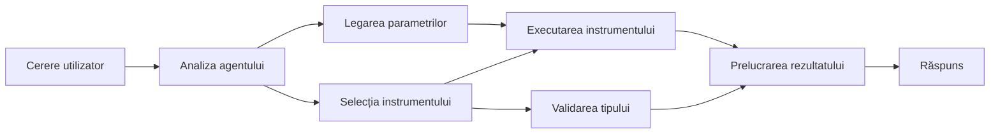

# 🛠️ Utilizarea avansată a uneltelor cu Azure OpenAI (Responses API) (.NET)

## 📋 Obiective de învățare

Acest notebook demonstrează modele de integrare a uneltelor la nivel enterprise folosind Microsoft Agent Framework în .NET cu Azure OpenAI (Responses API). Veți învăța să construiți agenți sofisticați cu multiple unelte specializate, valorificând tiparea puternică a limbajului C# și funcționalitățile enterprise ale .NET.

### Capacități avansate ale uneltelor pe care le veți stăpâni

- 🔧 **Arhitectură multi-unealtă**: Construirea agenților cu multiple capacități specializate
- 🎯 **Executare tip-safe a uneltelor**: Folosirea validării la compilare în C#
- 📊 **Modele enterprise de unealtă**: Design și gestionare a erorilor gata de producție
- 🔗 **Compoziția uneltelor**: Combinarea uneltelor pentru fluxuri de lucru complexe de business

## 🎯 Beneficiile arhitecturii .NET pentru unelte

### Funcționalități enterprise ale uneltelor

- **Validare la compilare**: Tipare puternice asigură corectitudinea parametrilor uneltelor
- **Injecție de dependențe**: Integrare cu container IoC pentru gestionarea uneltelor
- **Pattern-uri Async/Await**: Executare neblocantă a uneltelor cu gestionarea corespunzătoare a resurselor
- **Jurnalizare structurată**: Integrare încorporată pentru monitorizarea execuției uneltelor

### Modele gata de producție

- **Gestionarea excepțiilor**: Management complet al erorilor cu excepții tipate
- **Gestionarea resurselor**: Modele corecte de eliminare și managementul memoriei
- **Monitorizarea performanței**: Metrici și contoare de performanță încorporate
- **Managementul configurației**: Configurație tip-safe cu validare

## 🔧 Arhitectura tehnică

### Componentele principale ale uneltelor .NET

- **Microsoft.Extensions.AI**: Strat unificat de abstractizare a uneltelor
- **Microsoft.Agents.AI**: Orchestrare la nivel enterprise a uneltelor
- **Azure OpenAI (Responses API)**: Client API de înaltă performanță cu pooling de conexiuni

### Pipeline-ul de execuție al uneltelor



## 🛠️ Categorii și modele de unelte

### 1. **Unelte pentru procesarea datelor**

- **Validarea intrărilor**: Tipare puternice cu adnotări de date
- **Operații de transformare**: Conversie și formatare de date tip-safe
- **Logică de business**: Unelte de calcul și analiză specifice domeniului
- **Formatarea ieșirilor**: Generarea structurată a răspunsurilor

### 2. **Unelte de integrare**

- **Conectori API**: Integrare servicii RESTful cu HttpClient
- **Unelte pentru baze de date**: Integrare Entity Framework pentru accesul la date
- **Operații pe fișiere**: Operații securizate pe sistemul de fișiere cu validare
- **Servicii externe**: Modele de integrare a serviciilor terțe

### 3. **Unelte utilitare**

- **Prelucrarea textului**: Utilitare pentru manipulare și formatare stringuri
- **Operații Data/Ora**: Calculuri ce țin cont de cultură pentru date/ore
- **Unelte matematice**: Calcule de precizie și operații statistice
- **Unelte de validare**: Validarea regulilor de business și verificarea datelor

Gata să construiți agenți la nivel enterprise cu capabilități puternice, tip-safe în .NET? Hai să arhitectăm soluții profesionale! 🏢⚡

## 🚀 Începeți

### Cerințe preliminare

- [.NET 10 SDK](https://dotnet.microsoft.com/download/dotnet/10.0) sau mai nou
- Un [abonament Azure](https://azure.microsoft.com/free/) cu o resursă Azure OpenAI și o implementare de model
- [Azure CLI](https://learn.microsoft.com/cli/azure/install-azure-cli) — autentificați-vă cu `az login`

### Variabile de mediu necesare

```bash
# zsh/bash
export AZURE_OPENAI_ENDPOINT=https://<your-resource>.openai.azure.com
export AZURE_OPENAI_DEPLOYMENT=gpt-5-mini
# Apoi autentifică-te pentru ca AzureCliCredential să poată obține un token
az login
```

```powershell
# PowerShell
$env:AZURE_OPENAI_ENDPOINT = "https://<your-resource>.openai.azure.com"
$env:AZURE_OPENAI_DEPLOYMENT = "gpt-5-mini"
# Apoi autentificați-vă pentru ca AzureCliCredential să poată obține un token
az login
```

### Cod exemplu

Pentru a rula exemplul de cod,

```bash
# zsh/bash
chmod +x ./04-dotnet-agent-framework.cs
./04-dotnet-agent-framework.cs
```

Sau folosind dotnet CLI:

```bash
dotnet run ./04-dotnet-agent-framework.cs
```

Vezi [`04-dotnet-agent-framework.cs`](../../../../04-tool-use/code_samples/04-dotnet-agent-framework.cs) pentru codul complet.

```csharp
#!/usr/bin/dotnet run

#:package Microsoft.Extensions.AI@10.*
#:package Microsoft.Agents.AI.OpenAI@1.*-*
#:package Azure.AI.OpenAI@2.1.0
#:package Azure.Identity@1.13.1

using System.ComponentModel;

using Microsoft.Agents.AI;
using Microsoft.Extensions.AI;

using Azure.AI.OpenAI;
using Azure.Identity;

// Tool Function: Random Destination Generator
// This static method will be available to the agent as a callable tool
// The [Description] attribute helps the AI understand when to use this function
// This demonstrates how to create custom tools for AI agents
[Description("Provides a random vacation destination.")]
static string GetRandomDestination()
{
    // List of popular vacation destinations around the world
    // The agent will randomly select from these options
    var destinations = new List<string>
    {
        "Paris, France",
        "Tokyo, Japan",
        "New York City, USA",
        "Sydney, Australia",
        "Rome, Italy",
        "Barcelona, Spain",
        "Cape Town, South Africa",
        "Rio de Janeiro, Brazil",
        "Bangkok, Thailand",
        "Vancouver, Canada"
    };

    // Generate random index and return selected destination
    // Uses System.Random for simple random selection
    var random = new Random();
    int index = random.Next(destinations.Count);
    return destinations[index];
}

// Azure OpenAI with the Responses API (stable v1 endpoint). Sign in with `az login`.
var azureEndpoint = Environment.GetEnvironmentVariable("AZURE_OPENAI_ENDPOINT")
    ?? throw new InvalidOperationException("AZURE_OPENAI_ENDPOINT is not set.");
var deployment = Environment.GetEnvironmentVariable("AZURE_OPENAI_DEPLOYMENT") ?? "gpt-5-mini";

var azureClient = new AzureOpenAIClient(new Uri(azureEndpoint), new AzureCliCredential());

// Define Agent Identity and Comprehensive Instructions
// Agent name for identification and logging purposes
var AGENT_NAME = "TravelAgent";

// Detailed instructions that define the agent's personality, capabilities, and behavior
// This system prompt shapes how the agent responds and interacts with users
var AGENT_INSTRUCTIONS = """
You are a helpful AI Agent that can help plan vacations for customers.

Important: When users specify a destination, always plan for that location. Only suggest random destinations when the user hasn't specified a preference.

When the conversation begins, introduce yourself with this message:
"Hello! I'm your TravelAgent assistant. I can help plan vacations and suggest interesting destinations for you. Here are some things you can ask me:
1. Plan a day trip to a specific location
2. Suggest a random vacation destination
3. Find destinations with specific features (beaches, mountains, historical sites, etc.)
4. Plan an alternative trip if you don't like my first suggestion

What kind of trip would you like me to help you plan today?"

Always prioritize user preferences. If they mention a specific destination like "Bali" or "Paris," focus your planning on that location rather than suggesting alternatives.
""";

// Create AI Agent with Advanced Travel Planning Capabilities
// Get the Responses client for the deployment and create the AI agent
// Configure agent with name, detailed instructions, and available tools
// This demonstrates the .NET agent creation pattern with full configuration
AIAgent agent = azureClient
    .GetChatClient(deployment)
    .AsAIAgent(
        name: AGENT_NAME,
        instructions: AGENT_INSTRUCTIONS,
        tools: [AIFunctionFactory.Create(GetRandomDestination)]
    );

// Create New Conversation Session for Context Management
// Initialize a new conversation session to maintain context across multiple interactions
// Sessions enable the agent to remember previous exchanges and maintain conversational state
// This is essential for multi-turn conversations and contextual understanding
await using var session = await agent.CreateSessionAsync();

// Execute Agent: First Travel Planning Request
// Run the agent with an initial request that will likely trigger the random destination tool
// The agent will analyze the request, use the GetRandomDestination tool, and create an itinerary
// Using the session parameter maintains conversation context for subsequent interactions
await foreach (var update in agent.RunStreamingAsync("Plan me a day trip", session))
{
    await Task.Delay(10);
    Console.Write(update);
}

Console.WriteLine();

// Execute Agent: Follow-up Request with Context Awareness
// Demonstrate contextual conversation by referencing the previous response
// The agent remembers the previous destination suggestion and will provide an alternative
// This showcases the power of conversation sessions and contextual understanding in .NET agents
await foreach (var update in agent.RunStreamingAsync("I don't like that destination. Plan me another vacation.", session))
{
    await Task.Delay(10);
    Console.Write(update);
}
```

---

<!-- CO-OP TRANSLATOR DISCLAIMER START -->
**Declinare a responsabilității**:
Acest document a fost tradus folosind serviciul de traducere AI [Co-op Translator](https://github.com/Azure/co-op-translator). În timp ce ne străduim pentru acuratețe, vă rugăm să rețineți că traducerile automate pot conține erori sau inexactități. Documentul original în limba sa nativă trebuie considerat sursa autorizată. Pentru informații critice, se recomandă traducerea profesională realizată de un om. Nu ne asumăm responsabilitatea pentru eventualele neînțelegeri sau interpretări greșite care decurg din utilizarea acestei traduceri.
<!-- CO-OP TRANSLATOR DISCLAIMER END -->