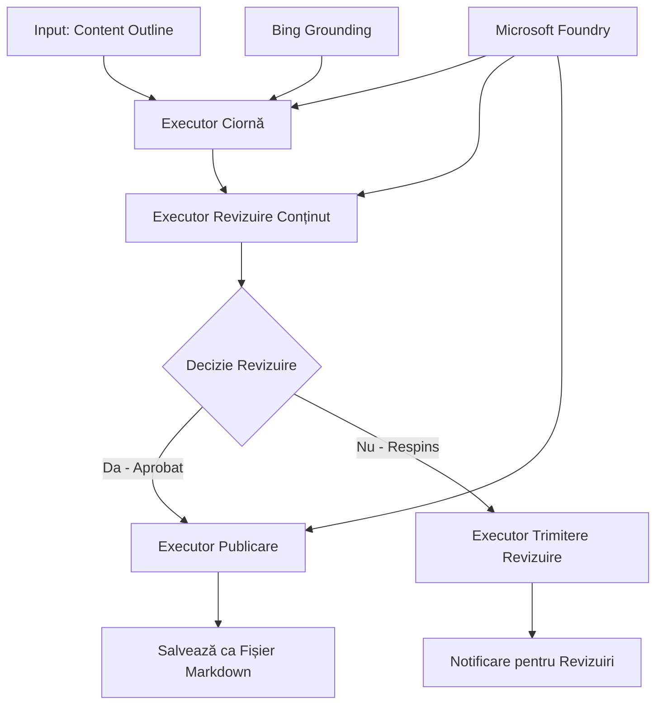

# 🔀 Fluxuri de lucru condiționate pentru agenți cu Microsoft Foundry (.NET)

## 📋 Tutorial despre fluxuri de lucru inteligente bazate pe decizii

Acest notebook demonstrează **modele de fluxuri de lucru condiționate** folosind Microsoft Foundry și Microsoft Agent Framework pentru .NET. Vei învăța cum să construiești fluxuri de lucru sofisticate, conduse de decizii, care direcționează inteligent procesarea bazată pe analiza AI, reguli de afaceri și condiții dinamice pentru automatizare la nivel enterprise.

## 🎯 Obiectivele de învățare

### 🧠 **Arhitectură inteligentă de luare a deciziilor**
- **Implementarea logicii condiționate**: Construirea unor arbori de decizie complecși cu multiple puncte de ramificare
- **Direcționare susținută de AI**: Folosirea modelelor Microsoft Foundry pentru a lua decizii inteligente de rutare
- **Adaptarea dinamică a fluxului de lucru**: Modificarea comportamentului fluxului de lucru pe baza analizei și condițiilor la rulare
- **Integrarea regulilor enterprise**: Incorporarea logicii de afaceri și a cerințelor de conformitate în fluxuri de lucru

### 🔀 **Modele condiționate avansate**
- **Luarea deciziilor multi-criteriu**: Evaluarea mai multor factori pentru deciziile de rutare
- **Procesare conștientă de context**: Luarea deciziilor bazate pe contextul și istoricul acumulat al fluxului de lucru
- **Modificarea adaptivă a fluxului de lucru**: Ajustarea dinamică a căilor de procesare bazată pe condiții în timp real
- **Integrarea motoarelor de reguli**: Implementarea unor motoare sofisticate de reguli de afaceri în fluxuri de lucru

### 🏢 **Aplicații condiționate enterprise**
- **Clasificare și rutare documente**: Clasificarea și rutarea automată a documentelor către fluxuri de lucru potrivite
- **Triaj servicii clienți**: Rutare inteligentă a solicitărilor clienților către echipe specializate
- **Procesare conformitate și risc**: Aplicarea unor procese diferite de validare și revizuire bazate pe evaluarea riscului
- **Fluxuri de lucru asigurarea calității**: Rutarea conținutului prin procese adecvate de revizuire pe baza metricilor de calitate

## ⚙️ Cerințe și configurare

### 📦 **Pachete NuGet necesare**

Pachete avansate pentru procesarea fluxurilor de lucru condiționate:

```xml
<!-- Core AI Framework -->
<PackageReference Include="Microsoft.Extensions.AI" Version="9.9.0" />

<!-- Azure AI Agents with Persistent State -->
<PackageReference Include="Azure.AI.Agents.Persistent" Version="1.2.0-beta.5" />

<!-- Azure Identity and Utilities -->
<PackageReference Include="Azure.Identity" Version="1.15.0" />
<PackageReference Include="System.Linq.Async" Version="6.0.3" />
<PackageReference Include="DotNetEnv" Version="3.1.1" />

<!-- Local Workflow Framework References -->
<!-- Microsoft.Agents.Workflows.dll - Advanced workflow orchestration -->
<!-- Microsoft.Agents.AI.AzureAI.dll - Microsoft Foundry integration -->
<!-- Microsoft.Agents.AI.dll - Core agent abstractions -->
```

### 🔑 **Configurare Microsoft Foundry**

**Resurse Azure necesare:**
- Spațiu de lucru Microsoft Foundry cu modele pentru procesare condiționată
- Abonament Azure cu cote și permisiuni corespunzătoare
- Modele AI implementate pentru luarea deciziilor și analiza conținutului
- (Opțional) Conexiune API Bing Search pentru capacități de fundamentare

**Configurare mediu (.env):**
```env
# Microsoft Foundry Configuration
AZURE_AI_PROJECT_ENDPOINT=https://your-project.cognitiveservices.azure.com/
BING_CONNECTION_ID=your-bing-connection-id
```

**Configurare autentificare:**
```csharp
// Azure CLI or Managed Identity authentication
using Azure.Identity;
var credential = new AzureCliCredential();

// Load environment configuration
DotNetEnv.Env.Load("../../../.env");
```

### 🏗️ **Arhitectura fluxului de lucru condiționat**



**Componente cheie:**
- **Draft Executor**: Agent AI care creează schițe inițiale de conținut din schițe sumare
- **Content Review Executor**: Agent AI care evaluează calitatea și conformitatea schițelor
- **Rutare condiționată**: Logică decizională care direcționează pe baza rezultatelor revizuirii
- **Căi publicare/revizuire**: Cai separate de procesare pentru conținut aprobat versus respins
- **Managementul stării**: Menține contextul conținutului și revizuirii pe întreaga durată a fluxului de lucru

## 🎨 **Modele de design pentru fluxuri de lucru condiționate**

### 📋 **Producție conținut cu bariere de calitate**
```
Outline → Draft Creation → Quality Review → {Approve: Publish | Reject: Revise}
```

### 🎯 **Procesare documente bazată pe risc**
```
Document → Risk Assessment → {Low: Standard | High: Enhanced Review}
```

### 🔍 **Rutare inteligentă pentru serviciul clienți**
```
Customer Query → Analysis → {Simple: FAQ Bot | Complex: Human Agent}
```

### 💼 **Fluxuri de lucru centrate pe conformitate**
```
Content → Compliance Check → {Pass: Publish | Fail: Legal Review}
```

## 🏢 **Beneficii condiționate enterprise**

### 🎯 **Automatizare inteligentă**
- **Luare decizii inteligente**: Decizii de rutare bazate pe AI, pe analiza conținutului și context
- **Procesare adaptivă**: Fluxuri de lucru care se ajustează automat conform condițiilor schimbătoare
- **Aplicarea regulilor de afaceri**: Aplicare automată a logicii de afaceri și politicilor complexe
- **Rutare conștientă de context**: Decizii bazate pe istoricul complet și contextul acumulat al fluxului de lucru

### 📈 **Excelență operațională**
- **Alocare optimizată a resurselor**: Rutarea muncii către specialiști și procese cele mai potrivite
- **Intervenție manuală redusă**: Decizii automatizate care minimizează necesitatea rutărilor umane
- **Timpuri mai rapide de rezolvare**: Rutare directă către expertiza și capacitățile potrivite
- **Aplicare consistentă**: Aplicarea uniformă a regulilor de afaceri și criteriilor decizionale

### 🛡️ **Managementul riscului și conformitate**
- **Evaluare automată a riscului**: Evaluare bazată pe AI a conținutului și nivelurilor de risc ale situației
- **Aplicarea conformității**: Rutare automată prin procesele de reglementare necesare
- **Aplicarea protocoalelor de securitate**: Măsuri de securitate îmbunătățite aplicate conform evaluării riscului
- **Menținerea urmei de audit**: Documentare completă a deciziilor și motivelor din rutare

### 📊 **Analitică și îmbunătățire continuă**
- **Analiza deciziilor**: Urmărește eficiența și acuratețea deciziilor de rutare
- **Recunoașterea tiparelor**: Identificarea tendințelor și tiparelor din deciziile de rutare în timp
- **Optimizarea performanței**: Îmbunătățirea continuă a criteriilor de decizie și eficienței rutării
- **Inteligență de afaceri**: Perspective asupra caracteristicilor conținutului și cerințelor de procesare

### 🔧 **Excelență tehnică**
- **Management persistent al stării**: Menținerea stării complexe pe durata execuției fluxului de lucru
- **Arhitectură scalabilă**: Gestionarea cerințelor de procesare condiționată de volum mare
- **Capabilități de integrare**: Integrare fluidă cu sistemele și procesele de afaceri existente
- **Monitorizare și observabilitate**: Urmărire cuprinzătoare a performanței și deciziilor fluxului de lucru

Haideți să construim fluxuri de lucru enterprise inteligente, conduse de decizii, cu .NET! 🚀

## 💻 Executarea codului

Implementarea completă este disponibilă în `04.dotnet-agent-framework-workflow-aifoundry-condition.cs`. Aceasta demonstrează un **flux de lucru pentru producția de conținut cu bariere de calitate**:

### 🏗️ **Arhitectura fluxului de lucru**

```
Content Outline → Draft Creation → Quality Review → Conditional Routing:
                                                      ├─ Approved (>200 words) → Publish
                                                      └─ Rejected (<200 words) → Review Notification
```

**Agenții din fluxul de lucru:**
1. **Agent Evangelist**: Creează schițe de tutorial din schițe sumare cu fundamentare Bing
2. **Agent Content Reviewer**: Evaluează calitatea schiței (număr cuvinte, completitudine)
3. **Agent Publisher**: Salvează conținutul aprobat ca fișiere Markdown cu marcaj temporal

**Executori personalizați:**
1. **DraftExecutor**: Orchetrează crearea schițelor
2. **ContentReviewExecutor**: Realizează evaluarea calității
3. **PublishExecutor**: Gestionează publicarea conținutului aprobat
4. **SendReviewExecutor**: Gestionează notificările pentru conținutul respins

### 🚀 Executarea exemplului

**Cerințe prealabile:**
- Spațiu de lucru Microsoft Foundry configurat
- Autentificare Azure CLI (`az login`)
- (Opțional) Conexiune Bing Search pentru fundamentare

```bash
# Faceți scriptul executabil (Unix/Linux/macOS)
chmod +x 04.dotnet-agent-framework-workflow-aifoundry-condition.cs

# Rulați fluxul de lucru condiționat
./04.dotnet-agent-framework-workflow-aifoundry-condition.cs
```

Sau pe Windows:
```powershell
dotnet run 04.dotnet-agent-framework-workflow-aifoundry-condition.cs
```

### 📝 Rezultatul așteptat

Fluxul de lucru va:
1. **Crea agenți**: Inițializează trei agenți Microsoft Foundry specializați
2. **Generează schiță**: Agentul Evangelist creează schița tutorialului din schiță sumară
3. **Revizuiește conținutul**: Agentul Content Reviewer evaluează calitatea schiței
4. **Rutare condiționată**:
   - **Dacă este aprobată (>200 cuvinte)**: Executorul de publicare salvează ca fișier Markdown
   - **Dacă este respinsă (<200 cuvinte)**: Se trimite notificare de revizuire
5. **Afișează rezultatele**: Arată rezultatul final al fluxului de lucru

### 🔧 Opțiuni de personalizare

**Modifică criteriile de revizuire:**
```csharp
const string ContentReviewerInstructions = @"
You are a content reviewer...
1. Check if content is more than 500 words (instead of 200)
2. Verify technical accuracy
3. Ensure proper formatting
...";
```

**Adaugă căi condiționate suplimentare:**
```csharp
var workflow = new WorkflowBuilder(draftExecutor)
    .AddEdge(draftExecutor, contentReviewerExecutor)
    .AddEdge(contentReviewerExecutor, publishExecutor, condition: GetCondition("Excellent"))
    .AddEdge(contentReviewerExecutor, editExecutor, condition: GetCondition("Good"))
    .AddEdge(contentReviewerExecutor, sendReviewerExecutor, condition: GetCondition("Poor"))
    .Build();
```

**Schimbă cerințele de conținut:**
```csharp
string OUTLINE_Content = @"
# Your Custom Topic
## Section 1
https://your-reference-url
## Section 2
...
";
```

### 🎯 Aplicații din lumea reală

Acest model de flux condiționat este ideal pentru:
- **Sisteme de management al conținutului**: Fluxuri editoriale automate cu bariere de calitate
- **Procesarea documentelor**: Rutarea documentelor bazată pe clasificare și conformitate
- **Suport clienți**: Rutare inteligentă a tichetelor în funcție de complexitate și urgență
- **Revizuire juridică**: Rutarea contractelor bazată pe evaluarea riscului și valoare
- **Procese HR**: Rutarea aplicațiilor prin fluxuri de selecție adecvate

### 🔍 Înțelegerea logicii condiționate

**Funcția de condiție:**
```csharp
public Func<object?, bool> GetCondition(string expectedResult) =>
    reviewResult => reviewResult is ReviewResult review && review.Result == expectedResult;
```

Această funcție creează un predicat care:
1. Verifică dacă rezultatul este de tip `ReviewResult`
2. Compară proprietatea `Result` cu valoarea așteptată
3. Returnează adevărat/fals pentru a determina rutarea

**Muchii în fluxul de lucru cu condiții:**
```csharp
.AddEdge(contentReviewerExecutor, publishExecutor, condition: GetCondition("Yes"))
.AddEdge(contentReviewerExecutor, sendReviewerExecutor, condition: GetCondition("No"))
```

### 📊 Caracteristici avansate

**Validarea schemelor JSON:**
Fluxul de lucru folosește scheme JSON pentru a asigura răspunsuri structurate:

```csharp
// Define response structure
public class ReviewResult
{
    [JsonPropertyName("review_result")]
    public string Result { get; set; } = string.Empty;
    
    [JsonPropertyName("reason")]
    public string Reason { get; set; } = string.Empty;
    
    [JsonPropertyName("draft_content")]
    public string DraftContent { get; set; } = string.Empty;
}

// Apply to agent
ResponseFormat = ChatResponseFormat.ForJsonSchema(
    AIJsonUtilities.CreateJsonSchema(typeof(ReviewResult)), 
    "ReviewResult", 
    "Review Result From DraftContent"
)
```

**Integrarea fundamentării Bing:**
Agentul Evangelist folosește fundamentare Bing pentru a accesa informații în timp real:

```csharp
var bingGroundingConfig = new BingGroundingSearchConfiguration(bing_conn_id);
BingGroundingToolDefinition bingGroundingTool = new(
    new BingGroundingSearchToolParameters([bingGroundingConfig])
);
```

Aceasta permite agentului să urmărească URL-uri din schiță și să extragă informații actuale.

### 🛡️ Gestionarea erorilor

Fluxul de lucru include gestionare robustă a erorilor pentru conținutul respins:
- Eșecurile la revizuire declanșează calea alternativă
- Notificările oferă motive clare de respingere
- Conținutul este păstrat pentru revizuire

### 🔄 Extinderea fluxului de lucru

**Adaugă un ciclu de revizuire:**
Creează o buclă de feedback care re-scrie conținutul automat:

```csharp
.AddEdge(contentReviewerExecutor, publishExecutor, condition: GetCondition("Yes"))
.AddEdge(contentReviewerExecutor, draftExecutor, condition: GetCondition("No")) // Loop back
```

**Implementarea revizuirii multi-nivel:**
Adaugă mai multe etape de revizuire cu criterii diferite:

```csharp
.AddEdge(draftExecutor, technicalReviewer)
.AddEdge(technicalReviewer, editorialReviewer, condition: GetCondition("TechPass"))
.AddEdge(editorialReviewer, publishExecutor, condition: GetCondition("EditPass"))
```

Acest model condiționat de flux de lucru oferă fundația pentru construirea unor sisteme sofisticate, inteligente de automatizare enterprise! 🚀

---

<!-- CO-OP TRANSLATOR DISCLAIMER START -->
**Declinare a responsabilității**:
Acest document a fost tradus folosind serviciul de traducere AI [Co-op Translator](https://github.com/Azure/co-op-translator). În timp ce ne străduim pentru acuratețe, vă rugăm să rețineți că traducerile automate pot conține erori sau inexactități. Documentul original în limba sa nativă trebuie considerat sursa autorizată. Pentru informații critice, se recomandă traducerea profesională realizată de un om. Nu ne asumăm responsabilitatea pentru eventualele neînțelegeri sau interpretări greșite care decurg din utilizarea acestei traduceri.
<!-- CO-OP TRANSLATOR DISCLAIMER END -->