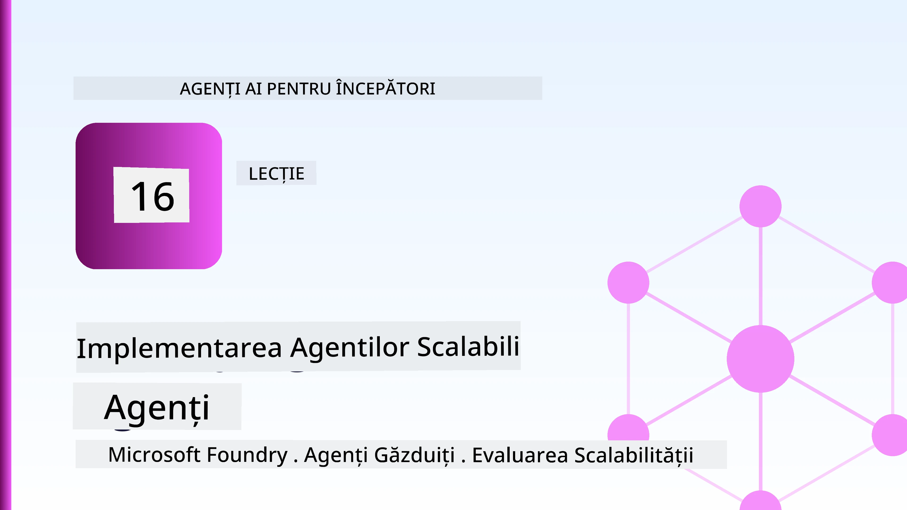
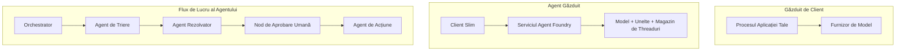
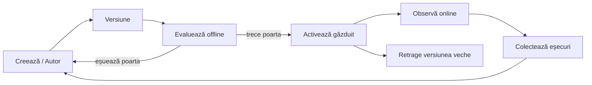
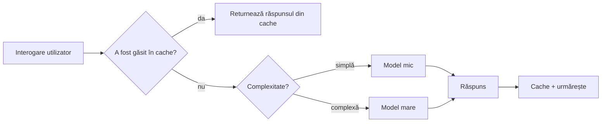
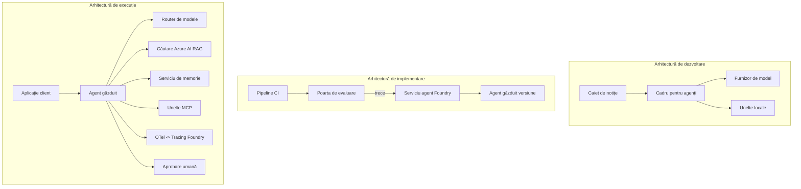

# Implementarea agenților scalabili cu Microsoft Foundry



Până în acest moment al cursului ați construit agenți care rulează pe laptopul dvs., în interiorul unui notebook, controlați prin `az login` și câteva variabile de mediu. Aceasta este exact modalitatea corectă de a învăța. Nu este modalitatea corectă de a rula un agent de care mii de clienți depind la ora 3 dimineața.

Această lecție vorbește despre diferența dintre „funcționează pe calculatorul meu” și „funcționează, fiabil și accesibil, în producție.” Închidem acest decalaj folosind **Microsoft Foundry** și **Microsoft Foundry Agent Service**, și o facem construind un agent real de suport clienți care are instrumente, mecanisme de recuperare, memorie, evaluare și monitorizare.

## Introducere

Această lecție va acoperi:

- Diferența dintre un **agent prototip** și un **agent implementat**, și de ce tranziția ține în mare parte de tot ce este *în jurul* modelului.
- **Modele de implementare** pentru agenți: găzduire client, găzduire serviciu (Hosted Agents) și orchestrare workflow.
- **Ciclul de viață al agentului** pe Microsoft Foundry — creare, versiune, implementare, evaluare, observare, retragere.
- **Strategii de scalare**: rutare modele, caching, concurență și design fără stare.
- **Observabilitate** cu OpenTelemetry și trasare Foundry.
- **Optimizarea costurilor** prin selecția modelului, rutare și porți de evaluare.
- **Considerații enterprise**: guvernanță, aprobare umană și rularea serverelor MCP în siguranță în producție.

## Obiective de învățare

După terminarea acestei lecții, veți ști cum să:

- Alegeți modelul corect de implementare pentru un anumit volum de lucru al agentului.
- Implementați un agent în Microsoft Foundry Agent Service astfel încât să fie versionat, guvernat și observabil.
- Instrumentați un agent pentru trasare și conectați un pipeline de evaluare care rulează înainte de fiecare lansare.
- Aplicați rutarea și caching-ul modelului pentru a menține latența și costul sub control la scară.
- Adăugați o poartă de aprobare umană pentru acțiuni cu risc ridicat și integrați un server MCP într-un mod sigur pentru producție.

## Cerințe prealabile

Această lecție presupune că ați finalizat lecțiile anterioare și vă descurcați cu:

- Construirea de agenți cu [Microsoft Agent Framework](../14-microsoft-agent-framework/README.md) (Lecția 14).
- [Utilizarea instrumentelor](../04-tool-use/README.md) (Lecția 4) și [Agentic RAG](../05-agentic-rag/README.md) (Lecția 5).
- [Memoria Agentului](../13-agent-memory/README.md) (Lecția 13) și [Protocoalele Agentice / MCP](../11-agentic-protocols/README.md) (Lecția 11).
- [Observabilitate și Evaluare](../10-ai-agents-production/README.md) (Lecția 10) — această lecție se bazează direct pe aceasta.

Veți avea nevoie, de asemenea:

- Un **abonament Azure** și un **proiect Microsoft Foundry** cu cel puțin un model chat implementat.
- Azure CLI autentificat (`az login`).
- Python 3.12+ și pachetele din fișierul [`requirements.txt`](../../../requirements.txt).

## De la prototip la producție: ce se schimbă de fapt

Un agent prototip și un agent de producție împart aceeași buclă de bază — raționament, apelare unelte, răspuns. Ce se schimbă este tot ce este în jurul acelei bucle. Modelul reprezintă cam 20% dintr-un agent de producție; restul de 80% este scheletul operațional.

| Aspect | Prototip | Producție |
| --- | --- | --- |
| **Găzduire** | Rulează în notebook-ul tău | Rulează ca serviciu găzduit, versionat și implementat gradual |
| **Identitate** | Token-ul tău `az login` | Identitate gestionată cu RBAC restricționat |
| **Stare** | În memorie, pierdută la restart | Externalizată (magazin thread-uri, serviciu de memorie) |
| **Eșec** | Vezi traceback-ul | Retries, fallback-uri, dead-letter, alerte |
| **Cost** | "Câteva cenți" | Urmărit per cerere, rutat, cache-uit, bugetat |
| **Calitate** | Observi ieșirea | Evaluată automat înainte de fiecare lansare |
| **Încredere** | Aprobi fiecare acțiune | Politică + om în buclă pentru acțiuni riscante |

Țineți această tabelă în minte. Fiecare secțiune de mai jos corespunde unuia dintre aceste rânduri.

## Modele de implementare a agenților

Există trei modele pe care le veți folosi, adesea în combinație.

### 1. Agenți găzduiți de client

Obiectul agent trăiește în procesul *propriei* aplicații. Codul dvs. apelează furnizorul modelului direct; bucla de raționament rulează în serviciul dvs. Aceasta este ceea ce fiecare lecție anterioară a făcut.

- **Folosiți-l când** aveți nevoie de control total asupra buclei, middleware personalizat sau încorporați agentul într-un backend existent.
- **Compromis**: controlați singur scalarea, starea și reziliența.

### 2. Agenți găzduiți (Foundry Agent Service)

Agentul este *înregistrat ca resursă* în Microsoft Foundry. Foundry găzduiește bucla de raționament, stochează thread-urile, impune securitatea conținutului și RBAC, și face agentul vizibil în portalul Foundry. Aplicația dvs. devine un client subțire care creează thread-uri și citește răspunsuri.

- **Folosiți-l când** doriți durabilitate, observabilitate încorporată, guvernanță și o suprafață operațională redusă.
- **Compromis**: mai puțin control de nivel jos în schimbul unui runtime gestionat.

### 3. Fluxuri de lucru pentru agenți

Mai mulți agenți (și unelte) sunt compuși într-un grafic cu control explicit al fluxului — pași secvențiali, ramificări, noduri de aprobare umană, și puncte durabile care pot pune pe pauză și relua. Aceasta este capacitatea **Workflows** din Microsoft Agent Framework aplicată la scară de implementare.

- **Folosiți-l când** o singură sarcină cuprinde mai mulți agenți specializați sau necesită un pas de aprobare pe parcurs.
- **Compromis**: mai multe părți în mișcare; necesită observabilitate la nivel de orchestrare.



## Ciclul de viață al agentului pe Microsoft Foundry

Implementarea unui agent nu este un `push` unic. Este o buclă, și seamănă mult cu un ciclu de lansare software pentru că exact asta este.



Ideea cheie, preluată din [Lecția 10](../10-ai-agents-production/README.md): **evaluarea offline este o poartă, nu un gând ulterior.** O nouă versiune a agentului nu se lansează dacă nu trece pragurile dvs. de evaluare. Observabilitatea online apoi hrănește eșecurile din lumea reală în setul dvs. de teste offline. Aceasta este întreaga buclă.

## Strategii de scalare

Scalarea unui agent este diferită de scalarea unui API web fără stare, deoarece fiecare cerere poate declanșa multiple apeluri costisitoare de modele și unelte. Patru tehnici preiau majoritatea încărcării.

**Gestionarea cererilor fără stare.** Nu păstrați stare per utilizator în memoria procesului. Persistă thread-urile conversației în magazinul de thread-uri Foundry sau un serviciu de memorie astfel încât orice instanță să poată gestiona orice cerere. Aceasta vă permite să scalați orizontal — adăugați instanțe, fără sesiuni lipicioase.

**Rutarea modelului.** Nu fiecare cerere are nevoie de cel mai capabil (și cel mai scump) model. Rutați cereri simple — clasificare intenție, răspunsuri scurte factuale — către un model mic și rapid și rezervați modelul mare pentru raționamentul autentic. **Model Router** din Foundry poate face asta pentru dvs., sau puteți implementa singur un clasificator ușor. Veți construi versiunea DIY în laborator.

**Cache-ul răspunsurilor.** Multe întrebări de suport sunt aproape duplicate („cum îmi resetez parola?”). Cache-uiți răspunsurile la întrebările frecvente și serviți-le fără să accesați modelul deloc. Chiar și o rată modestă de cache reduce semnificativ costul și latența.

**Concurența și presiunea inversă (backpressure).** Furnizorii de modele au limite de rată. Limitați concurența, folosiți retry-uri cu backoff exponențial și gestionați elegant eșecurile (un răspuns în coadă „lucrăm la asta” e mai bun decât o eroare 500).



## Observabilitate în producție

Nu puteți opera ceea ce nu puteți vedea. Așa cum am acoperit în Lecția 10, Microsoft Agent Framework emite **trasări OpenTelemetry** nativ — fiecare apel de model, invocare de unealtă și pas de orchestrare devin un span. În producție exportați aceste span-uri către Microsoft Foundry (sau orice backend compatibil cu OTel) astfel încât să puteți:

- Trasați o singură reclamație a clientului cap-coadă prin fiecare apel de model și unealtă.
- Monitorizați latența p50/p95 și costul pe cerere în timp.
- Primii alertele pentru creșteri ale ratei de eroare și anomalii de cost înainte ca utilizatorii dvs. (sau echipa financiară) să le observe.

```python
from agent_framework.observability import get_tracer

tracer = get_tracer()

with tracer.start_as_current_span("support_request") as span:
    span.set_attribute("customer.tier", "enterprise")
    span.set_attribute("routed.model", "gpt-4.1-mini")
    # execuția agentului este urmărită automat în interiorul acestui interval
```

Atribute precum `customer.tier` și `routed.model` sunt cele care transformă un perete de trasări în întrebări la care se poate răspunde („clienții enterprise sunt direcționați prea des către modelul mic?”).

## Optimizarea costurilor

Costul în agenții de producție este dominat de tokenuri. Trei manete, în ordinea impactului:

1. **Dimensionați corect modelul.** Un model mic care trece pragul dvs. de evaluare este aproape întotdeauna mai ieftin decât unul mare care trece de asemenea. Folosiți evaluarea pentru a *dovedi* că modelul mic este suficient de bun în loc să apelați din precauție la cel mai mare model.
2. **Rutați după complexitate.** Ca mai sus — plătiți prețuri de model mare doar pentru cererile care au nevoie de raționament cu model mare.
3. **Cache-uiți agresiv.** Cel mai ieftin apel de model este cel pe care nu îl faceți niciodată.

Porțile de evaluare și controlul costului sunt aceeași disciplină văzută din două unghiuri: evaluarea vă spune *nivelul minim de calitate*, rutarea și caching-ul vă mențin cât mai aproape de *costul* acelui nivel.

## Considerații Enterprise pentru Implementare

**Guvernanță.** Agenții găzduiți moștenesc RBAC-ul, securitatea conținutului și auditul Foundry. Fiecare agent primește o identitate gestionată cu cel mai mic privilegiu necesar — acces doar în citire la baza de cunoștințe, acces restricționat la API-ul de ticketing, nimic mai mult.

**Om în buclă.** Unele acțiuni sunt prea importante pentru a fi automatizate direct — emiterea unei rambursări, ștergerea unui cont, escaladarea către o echipă juridică. Microsoft Agent Framework suportă unelte care necesită **aprobarea**: agentul propune acțiunea, execuția se oprește, un om aprobă sau respinge, iar fluxul de lucru continuă. Ați văzut acumulatorul în [Lecția 6](../06-building-trustworthy-agents/README.md); aici îl implementați.

**MCP în producție.** [MCP](../11-agentic-protocols/README.md) permite agentului dvs. să consume unelte externe printr-o interfață standard. În producție, tratați fiecare server MCP ca o frontieră neîncredere: fixați versiunea serverului, rulați-l cu o identitate restricționată, validați ieșirile și nu îi expuneți niciodată secrete. Un server MCP este o dependență, iar dependențele sunt patch-uite, auditate și limitate ca rată.



Acele trei diagrame — dezvoltare, implementare, rulare — sunt același agent în trei stadii ale vieții sale. Laboratorul ce urmează vă conduce pas cu pas să-l construiți.

## Laborator Practic: Agent de Suport Clienți Pregătit pentru Producție

Deschideți [`code_samples/16-python-agent-framework.ipynb`](./code_samples/16-python-agent-framework.ipynb) și parcurgeți-l de la început până la sfârșit. Veți asambla un **agent de suport clienți Contoso** cu toate preocupările de producție integrate:

1. **Apelare unelte** — verificarea statusului comenzii și deschiderea tichetelor de suport.
2. **RAG** — răspuns la întrebări de politică de la o bază de cunoștințe (Azure AI Search, cu fallback în memorie astfel încât notebook-ul să ruleze fără o resursă Search).
3. **Memorie** — reține clientul pe parcursul conversației.
4. **Rutarea modelului** — un clasificator de complexitate direcționează fiecare cerere către model mic sau mare.
5. **Cache răspunsuri** — întrebările repetate sunt servite din cache.
6. **Aprobare umană** — rambursările peste un prag așteaptă semnătura umană.
7. **Pipeline de evaluare** — un set mic offline de testare evaluează agentul și acționează ca poartă de lansare.
8. **Observabilitate** — trasare OpenTelemetry în jurul fiecărei cereri.

### Parcurgere pas cu pas

Notebook-ul este organizat astfel încât fiecare preocupare de producție este o secțiune executabilă, auto-conținută. Inima lui este handler-ul de cereri cu rutare plus cache:

```python
async def handle_support_request(query: str, customer_id: str) -> str:
    # 1. Servește din cache atunci când putem.
    cached = response_cache.get(normalize(query))
    if cached:
        return cached

    # 2. Direcționează în funcție de complexitate pentru a controla costul.
    model = "gpt-4.1-mini" if is_simple(query) else "gpt-4.1"

    # 3. Rulează agentul într-un interval de trasare pentru observabilitate.
    with tracer.start_as_current_span("support_request") as span:
        span.set_attribute("routed.model", model)
        span.set_attribute("customer.id", customer_id)
        response = await support_agent.run(query, model=model)

    # 4. Memorează în cache și returnează.
    response_cache.set(normalize(query), response.text)
    return response.text
```

Poarta de evaluare care protejează o lansare arată astfel:

```python
async def evaluation_gate(agent, test_cases, threshold: float = 0.8) -> bool:
    passed = 0
    for case in test_cases:
        result = await agent.run(case["input"])
        if score_response(result.text, case["expected"]) >= 0.8:
            passed += 1
    pass_rate = passed / len(test_cases)
    print(f"Evaluation pass rate: {pass_rate:.0%} (gate: {threshold:.0%})")
    return pass_rate >= threshold  # se deployează numai dacă poarta trece
```

Citiți fiecare linie — notebook-ul menține primitivele intenționat mici pentru ca nimic să nu fie ascuns în spatele unui apel de framework.

## Validarea unui Agent Implementat cu Teste Smoke

Poarta de evaluare de mai sus rulează *offline* pe obiectul agentului. Odată ce agentul este implementat ca Hosted Agent, aveți nevoie de o ultimă verificare, și mai ieftină: **răspunde efectiv endpointul implementat?**

Implementarea „cu succes” dovedește doar că planul de control a acceptat definiția — nu dovedește că agentul răspunde. O dependență lipsă, o rutare greșită a modelului sau o conexiune expirat pot lăsa o implementare marcată verde care nu returnează nimic. Un **test smoke** prinde asta în câteva secunde, la fiecare implementare, fără costul unei evaluări complete.

Acest repository oferă un pipeline gata de folosit pentru testul smoke construit pe acțiunea GitHub [AI Smoke Test](https://github.com/marketplace/actions/ai-smoke-test):

- **Catalog** — [`tests/lesson-16-smoke-tests.json`](../../../tests/lesson-16-smoke-tests.json) conține prompturi și afirmații pentru agentul de suport Contoso (răspunsuri ancorate pe politică, verificarea unei comenzi, menținerea pe subiect și continuitatea unui fir multi-turn). Cataloagele pentru agenții lecțiilor celelalte sunt alături — vedeți [`tests/README.md`](../tests/README.md).
- **Workflow** — [`.github/workflows/smoke-test.yml`](../../../.github/workflows/smoke-test.yml) se loghează cu Azure OIDC și trimite POST fiecare prompt către endpoint-ul Responses al agentului, eșuând jobul la orice afirmație neîndeplinită.

```yaml
- name: Smoke-test hosted agent
  uses: JFolberth/ai-smoketest@v1
  with:
    project_endpoint: ${{ inputs.project_endpoint }}
    agent_name: ContosoSupportAgent
    tests_file: tests/lesson-16-smoke-tests.json
```


Lansați-l din fila **Actions** odată ce agentul dvs. este implementat, furnizând endpointul proiectului Foundry și numele agentului. Identitatea federată are nevoie de rolul **Azure AI User** la nivelul proiectului Foundry. Gândiți-vă la straturi ca la o piramidă: testele de bază (accesibil și răspunde?) rulează la fiecare implementare, evaluarea offline (suficient de bun pentru livrare?) rulează înainte de promovare, iar evaluarea online (cum se comportă în condiții reale?) rulează continuu.

## Verificare a Cunoștințelor

Testați-vă înțelegerea înainte de a trece la sarcină.

**1. Aproximativ cât de mult dintr-un agent de producție este „modelul” și ce reprezintă restul?**

<details>
<summary>Răspuns</summary>

Modelul reprezintă o minoritate a sistemului — este adesea citat ca fiind în jur de 20%. Restul este scheletul operațional: găzduire și versionare, identitate și RBAC, starea externalizată, gestionarea erorilor, monitorizarea costurilor, evaluarea și controalele cu intervenție umană. Trecerea în producție înseamnă în mare parte construirea a totul *în jurul* buclei de raționament.
</details>

**2. Când ați alege un Agent Hosted în locul unui agent găzduit pe client?**

<details>
<summary>Răspuns</summary>

Atunci când doriți un runtime gestionat cu durabilitate încorporată (fire de execuție persistente și care pot fi reluate), observabilitate, securitate a conținutului și RBAC, și sunteți dispus să renunțați la un control de nivel jos asupra buclei de raționament pentru o suprafață operațională mai mică. Variantele găzduite pe client sunt preferabile când aveți nevoie de control total asupra buclei sau dacă integrați agentul într-un backend existent.
</details>

**3. De ce trebuie ca un agent scalabil să fie fără stare în memoria propriului proces?**

<details>
<summary>Răspuns</summary>

Astfel, orice instanță poate gestiona orice cerere, ceea ce permite scalarea orizontală fără sesiuni sticky. Starea conversației per utilizator este externalizată într-un magazin de fire de execuție sau serviciu de memorie. Dacă starea ar trăi în memoria procesului, ați pierde-o la repornire și nu ați putea distribui sarcina liber.
</details>

**4. Ce problemă rezolvă rutarea modelului și cum se leagă aceasta de evaluare?**

<details>
<summary>Răspuns</summary>

Rutarea trimite cererile simple către un model mic, ieftin și rapid și rezervă modelul mare pentru raționamentul autentic, controlând atât latența cât și costul. Se leagă de evaluare pentru că evaluarea este ceea ce *demonstrează* că modelul mic este suficient de bun pentru o categorie de cereri — rutarea fără evaluare este doar o presupunere.
</details>

**5. Ce este un „evaluation gate” și unde se situează în ciclul de viață?**

<details>
<summary>Răspuns</summary>

Un evaluation gate rulează un set de teste offline împotriva unei versiuni noi a agentului și blochează implementarea dacă rata de succes nu depășește un prag. Se situează între „versiune” și „implementare” în ciclul de viață, făcând din calitate o condiție prealabilă lansării în loc să fie ceva verificat după livrare.
</details>

**6. De ce serverul MCP trebuie tratat ca o limită neîncrezătoare în producție?**

<details>
<summary>Răspuns</summary>

Pentru că este o dependență externă la care agentul dvs. apelează. Trebuie să fixați versiunea acestuia, să îl rulați cu o identitate scoped, să validați rezultatele, să limitați rata apelurilor și să nu expuneți niciodată secrete către el — aceeași disciplină pe care o aplicați oricărei dependențe terțe. Rezultatele lui intră în raționamentul agentului dvs., deci încrederea nevalidată este un risc de securitate.
</details>

**7. Care modificare singulară are de obicei cel mai mare impact asupra costului unui agent de producție și de ce?**

<details>
<summary>Răspuns</summary>

Dimensionarea corectă a modelului — utilizarea celui mai mic model care trece încă evaluation gate-ul. Costul este dominat de numărul de tokeni, iar un model mai mic care atinge pragul de calitate este aproape întotdeauna mai ieftin decât unul mai mare. Caching-ul și rutarea reduc costul suplimentar, dar alegerea modelului de bază potrivit are efectul cel mai important de primă ordine.
</details>

**8. Ce rol au atributele span ca `customer.tier` și `routed.model` în observabilitate?**

<details>
<summary>Răspuns</summary>

Ele transformă urmele brute în întrebări business la care se poate răspunde. Fără atribute aveți un zid de span-uri; cu ele puteți întreba „sunt clienții enterprise direcționați prea des către modelul mic?” sau „care model gestionează cele mai lente cereri ale noastre?” Atributele sunt modul prin care segmentați telemetria după dimensiunile importante pentru operațiunea dvs.
</details>

## Sarcină

Luați agentul de suport pentru clienți din laborator și întăriți-l pentru un scenariu specific: **un agent de suport facturare pe bază de abonament pentru o companie SaaS.**

Trimiterea dvs. trebuie să:

1. **Înlocuiți instrumentele** cu cele relevante pentru facturare: `get_subscription_status`, `get_invoice`, și `issue_credit` (creditările peste 50$ necesită aprobare umană).
2. **Adăugați trei documente RAG** care acoperă politica companiei privind rambursările, ciclul de facturare și politica de anulare.
3. **Extindeți setul de evaluare** la cel puțin opt cazuri, inclusiv cel puțin două care *ar trebui* să declanșeze calea de aprobare umană, și confirmați că evaluation gate funcționează corect, trecând sau eșuând.
4. **Adăugați un raport de costuri**: după ce rulați zece interogări mixte prin agent, afișați câte au folosit modelul mic, câte modelul mare și câte au fost deservite din cache.

Scrieți un paragraf scurt (într-o celulă markdown) explicând ce regulă de rutare a modelului ați ales și cum ați valida această regulă cu trafic real. Nu există un singur răspuns corect — veți fi evaluați pe baza coerenței legăturilor între preocupările de producție.

## Rezumat

În această lecție ați mutat un agent de la prototip la producție cu Microsoft Foundry:

- Saltul spre producție înseamnă în mare parte **scheletul operațional** din jurul modelului — găzduire, identitate, stare, gestionarea erorilor, cost, calitate și încredere.
- Ați învățat cele trei **modele de implementare** — găzduit pe client, Hosted Agents și Agent Workflows — și când se potrivesc fiecare.
- Ați parcurs **ciclul de viață al agentului**, unde evaluarea offline **funcționează ca o poartă de lansare** iar observabilitatea online reintegrează eșecurile în setul de teste.
- Ați aplicat **strategii de scalare** — design fără stare, rutarea modelului, caching și concurență limitată — și le-ați conectat la **optimizarea costurilor**.
- Ați integrat **controale enterprise**: RBAC, aprobare umană și integrare MCP sigură pentru producție.
- Ați construit un **agent de suport pentru clienți gata de producție** care leagă toate aceste preocupări într-un cod executabil.

Lecția următoare face drumul opus: în loc să scalați agenții în cloud, îi veți coborî *pe* o singură mașină de dezvoltare și îi veți rula complet local.

## Resurse Suplimentare

- <a href="https://learn.microsoft.com/azure/ai-foundry/what-is-azure-ai-foundry" target="_blank">Documentația Microsoft Foundry</a>
- <a href="https://learn.microsoft.com/azure/ai-foundry/agents/overview" target="_blank">Prezentare generală Microsoft Foundry Agent Service</a>
- <a href="https://aka.ms/ai-agents-beginners/agent-framework" target="_blank">Microsoft Agent Framework</a>
- <a href="https://learn.microsoft.com/azure/ai-foundry/concepts/model-router" target="_blank">Model Router în Microsoft Foundry</a>
- <a href="https://learn.microsoft.com/azure/search/search-what-is-azure-search" target="_blank">Azure AI Search</a>
- <a href="https://opentelemetry.io/" target="_blank">OpenTelemetry</a>
- <a href="https://github.com/marketplace/actions/ai-smoke-test" target="_blank">Acțiune GitHub AI Smoke Test</a>
- <a href="https://modelcontextprotocol.io/" target="_blank">Model Context Protocol (MCP)</a>

## Lecția Anterioară

[Building Computer Use Agents (CUA)](../15-browser-use/README.md)

## Lecția Următoare

[Creating Local AI Agents](../17-creating-local-ai-agents/README.md)

---

<!-- CO-OP TRANSLATOR DISCLAIMER START -->
**Declinare a responsabilității**:
Acest document a fost tradus folosind serviciul de traducere AI [Co-op Translator](https://github.com/Azure/co-op-translator). În timp ce ne străduim pentru acuratețe, vă rugăm să rețineți că traducerile automate pot conține erori sau inexactități. Documentul original în limba sa nativă trebuie considerat sursa autorizată. Pentru informații critice, se recomandă traducerea profesională realizată de un om. Nu ne asumăm responsabilitatea pentru eventualele neînțelegeri sau interpretări greșite care decurg din utilizarea acestei traduceri.
<!-- CO-OP TRANSLATOR DISCLAIMER END -->