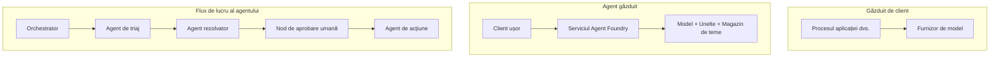
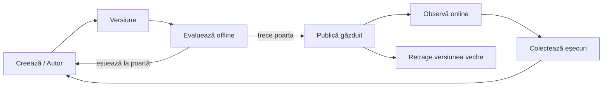
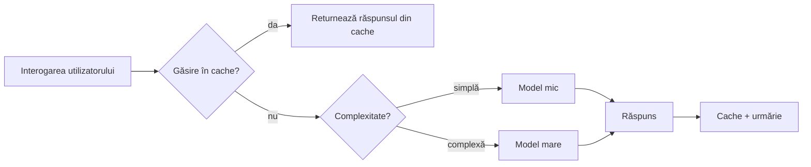
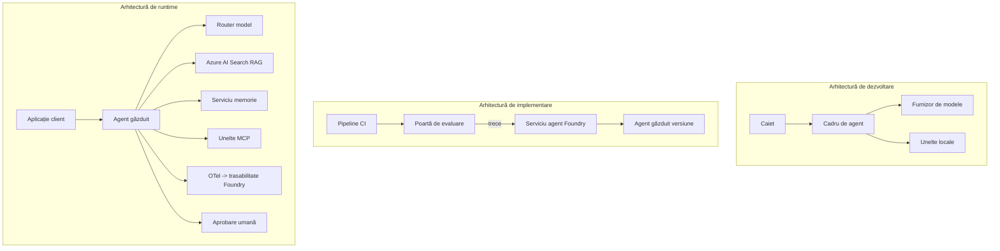

# Implementarea agenților scalabili cu Microsoft Foundry


Până în acest moment al cursului, ați construit agenți care rulează pe laptopul dvs., într-un notebook, controlați prin `az login` și câteva variabile de mediu. Aceasta este exact metoda corectă de a învăța. Nu este însă metoda corectă de a rula un agent de care depind mii de clienți la ora 3 dimineața.

Această lecție este despre diferența dintre „funcționează pe mașina mea” și „funcționează, fiabil și accesibil, în producție”. Această diferență o închidem folosind **Microsoft Foundry** și **Microsoft Foundry Agent Service**, construind un agent real de suport pentru clienți care are unelte, recuperare, memorie, evaluare și monitorizare.

## Introducere

Această lecție va acoperi:

- Diferența între un **agent prototip** și un **agent implementat**, și de ce tranziția este în principal despre tot ce este *în jurul* modelului.
- **Modelele de implementare** pentru agenți: găzduit pe client, găzduit ca serviciu (Hosted Agents), și orchestrat prin fluxuri de lucru.
- **Ciclul de viață al agentului** pe Microsoft Foundry — creare, versiune, implementare, evaluare, observare, retragere.
- **Strategii de scalare**: rutare model, caching, concurență și design fără stare.
- **Observabilitate** cu OpenTelemetry și trasați pe Foundry.
- **Optimizarea costurilor** prin selecția modelului, rutare și filtre de evaluare.
- **Considerații pentru întreprinderi**: guvernanță, aprobare umană și rularea în siguranță a serverelor MCP în producție.

## Obiective de învățare

După finalizarea acestei lecții, veți ști cum să:

- Alegeți modelul de implementare potrivit pentru un anumit tip de încărcare a agentului.
- Implementați un agent în Microsoft Foundry Agent Service astfel încât să fie versiuniat, guvernat și observabil.
- Instrumentați un agent pentru trasare și configurați un pipeline de evaluare care să ruleze înaintea fiecărei lansări.
- Aplicați rutare și caching pentru modele ca să mențineți latența și costurile sub control la scară mare.
- Adăugați o poartă de aprobare umană pentru acțiuni cu risc ridicat și integrați un server MCP într-un mod sigur pentru producție.

## Cerințe prealabile

Această lecție presupune că ați finalizat lecțiile anterioare și sunteți confortabil cu:

- Construirea de agenți cu [Microsoft Agent Framework](../14-microsoft-agent-framework/README.md) (Lecția 14).
- [Utilizarea uneltelor](../04-tool-use/README.md) (Lecția 4) și [Agentic RAG](../05-agentic-rag/README.md) (Lecția 5).
- [Memoria agentului](../13-agent-memory/README.md) (Lecția 13) și [Protocoale agentice / MCP](../11-agentic-protocols/README.md) (Lecția 11).
- [Observabilitate și evaluare](../10-ai-agents-production/README.md) (Lecția 10) — această lecție se bazează direct pe aceasta.

Veți avea nevoie, de asemenea:

- Un **abonament Azure** și un **proiect Microsoft Foundry** cu cel puțin un model de chat implementat.
- CLI-ul **Azure** autentificat (`az login`).
- Python 3.12+ și pachetele din depozitul [`requirements.txt`](../../../requirements.txt).

## De la prototip la producție: ce se schimbă efectiv

Un agent prototip și un agent de producție împart aceeași buclă de bază — raționament, apel unelte, răspuns. Ce se schimbă este tot ce este în jurul acelei bucle. Modelul reprezintă poate 20% dintr-un agent de producție; restul de 80% este scheletul operațional.

| Aspect | Prototip | Producție |
| --- | --- | --- |
| **Găzduire** | Rulează în notebook-ul tău | Rulează ca serviciu găzduit, versiuniat și lansat treptat |
| **Identitate** | Tokenul tău `az login` | Identitate gestionată cu RBAC restricționat |
| **Stare** | În memorie, pierdută la repornire | Externalizată (magazin thread, serviciu de memorie) |
| **Eșec** | Vezi traceback-ul | Retries, fallback-uri, coadă de greșeli, alerte |
| **Cost** | „Câteva cenți” | Urmărit per cerere, rutat, cache-uit, bugetat |
| **Calitate** | Te uiți la rezultat | Evaluat automat înainte de fiecare lansare |
| **Încredere** | Aprobi fiecare acțiune | Politică + om în buclă pentru acțiuni riscante |

Țineți minte acest tabel. Fiecare secțiune de mai jos corespunde uneia dintre aceste linii.

## Modele de implementare pentru agenți

Există trei modele pe care le veți folosi, adesea în combinație.

### 1. Agenți găzduiți pe client

Obiectul agent este în interiorul procesului *aplicației tale*. Codul tău apelează direct furnizorul de model; bucla de raționament rulează în serviciul tău. Aceasta este metoda folosită în toate lecțiile anterioare.

- **Folosește-l când** ai nevoie de control total asupra buclei, middleware custom sau încorporezi agentul într-un backend existent.
- **Compromis**: ești responsabil de scalare, stare și reziliență.

### 2. Agenți găzduiți (Foundry Agent Service)

Agentul este *înrregistrat ca resursă* în Microsoft Foundry. Foundry găzduiește bucla de raționament, stochează firele de execuție, impune siguranța conținutului și RBAC și face agentul vizibil în portalul Foundry. Aplicația dvs. devine un client subțire care creează fire și citește răspunsuri.

- **Folosește-l când** doriți durabilitate, observabilitate încorporată, guvernanță și o suprafață operațională mai mică.
- **Compromis**: mai puțin control de nivel jos în schimbul unui runtime gestionat.

### 3. Fluxuri de lucru ale agenților

Mai mulți agenți (și unelte) sunt compuși într-un graf cu flux explicit de control — pași secvențiali, ramificări, noduri cu aprobare umană și puncte de control durabile care pot pune pe pauză și relua execuția. Aceasta este capabilitatea **Workflows** a Microsoft Agent Framework aplicată la scară de implementare.

- **Folosește-l când** o singură sarcină cuprinde mai mulți agenți specializați sau necesită un pas de aprobare în mijloc.
- **Compromis**: mai multe componente; necesită observabilitate la nivel de orchestrare.



## Ciclul de viață al agentului pe Microsoft Foundry

Implementarea unui agent nu este un „push” făcut o singură dată. Este o buclă, și seamănă mult cu un ciclu de lansare software pentru că exact asta este.



Ideea principală, preluată din [Lecția 10](../10-ai-agents-production/README.md): **evaluarea offline este o poartă, nu un gând ulterior.** O nouă versiune a agentului nu este lansată decât dacă trece pragurile tale de evaluare. Observabilitatea online redirecționează eșecurile din lumea reală înapoi în setul de teste offline. Aceasta este întreaga buclă.

## Strategii de scalare

Scalarea unui agent diferă de scalarea unui API web fără stare, deoarece fiecare cerere poate declanșa multiple apeluri costisitoare către modele și unelte. Patru tehnici suportă cea mai mare parte a încărcării.

**Gestionarea cererilor fără stare.** Nu păstrați stare per utilizator în memoria procesului. Persistă firele conversației în magazinul de fire Foundry sau într-un serviciu de memorie astfel încât orice instanță să poată prelua orice cerere. Aceasta este ceea ce permite scalarea orizontală — adăugarea de instanțe, fără sesiuni lipicioase.

**Rutare model.** Nu fiecare cerere are nevoie de cel mai capabil (și cel mai scump) model. Rutați cererile simple — clasificarea intenției, răspunsuri scurte factuale — către un model mic și rapid și păstrați modelul mare pentru raționamente reale. **Model Router**-ul Foundry o poate face pentru dvs., sau puteți implementa voi înșivă un clasificator ușor. Veți construi versiunea DIY în laborator.

**Caching-ul răspunsurilor.** Multe întrebări din suport sunt aproape duplicate („cum îmi resetez parola?”). Cache-uiți răspunsurile la întrebările comune și serviți-le fără a apela modelul deloc. Chiar și un procent modest de reușite la cache reduce semnificativ costul și latența.

**Concurență și presiune inversă.** Furnizorii de modele au limite de rată. Limitați concurența, folosiți retry cu exponential backoff și eșuați grațios (un răspuns „suntem pe treabă” pus în coadă bate o eroare 500).



## Observabilitate în producție

Nu puteți opera ceva ce nu puteți vedea. După cum s-a acoperit în Lecția 10, Microsoft Agent Framework emite nativ trasări **OpenTelemetry** — fiecare apel de model, invocare de unealtă și pas de orchestrare devine un span. În producție, exportați aceste spans către Microsoft Foundry (sau orice backend compatibil OTel) pentru a putea:

- Trașa o plângere a unui client cap-coadă prin fiecare apel de model și unealtă.
- Monitoriza latența p50/p95 și costul pe cerere în timp.
- Lansa alerte în caz de creșteri bruște ale ratei de erori și anomalii de cost înainte ca utilizatorii dvs. (sau echipa financiară) să observe.

```python
from agent_framework.observability import get_tracer

tracer = get_tracer()

with tracer.start_as_current_span("support_request") as span:
    span.set_attribute("customer.tier", "enterprise")
    span.set_attribute("routed.model", "gpt-5-nano")
    # execuția agentului este urmărită automat în cadrul acestui interval
```

Atribute precum `customer.tier` și `routed.model` transformă un perete de trasări în întrebări la care se poate răspunde („clienții enterprise sunt trimiși prea des către modelul mic?”).

## Optimizarea costurilor

Costul în agenții de producție este dominat de tokeni. Trei pârghii, în ordinea impactului:

1. **Dimensionați corect modelul.** Un model mic care trece poarta ta de evaluare este aproape întotdeauna mai ieftin decât unul mare care trece și el. Folosiți evaluarea pentru a *demonstra* că modelul mic este suficient de bun, nu pentru a alege cel mai mare model prin precauție.
2. **Routează după complexitate.** Ca mai sus — plătește prețul pentru modelul mare doar pentru cererile care necesită raționament pe model mare.
3. **Cache-uiți agresiv.** Cel mai ieftin apel model este cel pe care nu îl faceți niciodată.

Porțile de evaluare și controlul costurilor sunt aceeași disciplină privită din două unghiuri: evaluarea vă spune *nivelul minim de calitate*, rutarea și caching-ul vă mențin cât mai aproape de *costul* acelui nivel.

## Considerații pentru implementarea în întreprinderi

**Guvernanță.** Agenții găzduiți moștenesc RBAC-ul, siguranța conținutului și jurnalizarea auditului din Foundry. Dați fiecărui agent o identitate gestionată cu cel mai mic privilegiu necesar — acces doar în citire la baza de cunoștințe, acces restricționat la API-ul de ticketing, nimic mai mult.

**Om în buclă.** Unele acțiuni sunt prea importante pentru a fi automate complet — emiterea unei rambursări, ștergerea unui cont, escaladarea către o echipă juridică. Microsoft Agent Framework suportă unelte care necesită **aprobarea**: agentul propune acțiunea, execuția se pune pe pauză, un om aprobă sau respinge, iar fluxul de lucru reia execuția. Ați întâlnit această primitivă în [Lecția 6](../06-building-trustworthy-agents/README.md); aici o implementați.

**MCP în producție.** [MCP](../11-agentic-protocols/README.md) permite agentului să consume unelte externe printr-o interfață standard. În producție, tratați fiecare server MCP ca pe o frontieră neîncrezătoare: fixați versiunea serverului, rulați-l cu o identitate restricționată, validați ieșirile și nu expuneți niciodată secrete către el. Un server MCP este o dependență, iar dependențele trebuie patchuite, auditate și limitate pe rată.



Acele trei diagrame — dezvoltare, implementare, timp de rulare — reprezintă același agent în trei stadii ale vieții sale. Laboratorul ce urmează vă ghidează prin construirea acestuia.

## Laborator practic: un agent de suport clienți gata de producție

Deschideți [`code_samples/16-python-agent-framework.ipynb`](./code_samples/16-python-agent-framework.ipynb) și parcurgeți-l complet. Veți asambla un **agent de suport clienți Contoso** cu toate aspectele de producție conectate:

1. **Apel unelte** — căutare stare comandă și deschidere tichete de suport.
2. **RAG** — răspunderi la întrebări despre politici dintr-o bază de cunoștințe (Azure AI Search, cu fallback în memorie astfel încât notebook-ul să funcționeze fără o resursă Search).
3. **Memorie** — reține clientul pe parcursul schimburilor de replici.
4. **Rutare model** — un clasificator de complexitate le trimite pe fiecare cerere către un model mic sau mare.
5. **Cache răspunsuri** — întrebările repetate sunt servite din cache.
6. **Aprobare umană** — rambursările peste un prag se opresc pentru semnătura unui om.
7. **Pipeline de evaluare** — un set mic de teste offline evaluează agentul și servește drept poartă de lansare.
8. **Observabilitate** — trasare OpenTelemetry în jurul fiecărei cereri.

### Parcurgere

Notebook-ul este organizat astfel încât fiecare aspect de producție să fie o secțiune independentă, executabilă. Inima lui este handler-ul de cereri care combină rutarea și caching-ul:

```python
async def handle_support_request(query: str, customer_id: str) -> str:
    # 1. Servește din cache atunci când putem.
    cached = response_cache.get(normalize(query))
    if cached:
        return cached

    # 2. Direcționează în funcție de complexitate pentru a controla costurile.
    model = "gpt-5-nano" if is_simple(query) else "gpt-5-mini"

    # 3. Rulează agentul în interiorul unui interval de urmărire pentru observabilitate.
    with tracer.start_as_current_span("support_request") as span:
        span.set_attribute("routed.model", model)
        span.set_attribute("customer.id", customer_id)
        response = await support_agent.run(query, model=model)

    # 4. Cachează și returnează.
    response_cache.set(normalize(query), response.text)
    return response.text
```

Poarta de evaluare care protejează o lansare arată așa:

```python
async def evaluation_gate(agent, test_cases, threshold: float = 0.8) -> bool:
    passed = 0
    for case in test_cases:
        result = await agent.run(case["input"])
        if score_response(result.text, case["expected"]) >= 0.8:
            passed += 1
    pass_rate = passed / len(test_cases)
    print(f"Evaluation pass rate: {pass_rate:.0%} (gate: {threshold:.0%})")
    return pass_rate >= threshold  # desfășurați doar dacă poarta este trecută
```

Citiți fiecare linie — notebook-ul menține elementele primitive intenționat mici astfel încât nimic să nu fie ascuns în spatele unui apel de framework.

## Validarea unui agent implementat prin teste rapide

Poarta de evaluare de mai sus rulează *offline* împotriva obiectului agent. Odată ce agentul este implementat ca Hosted Agent, aveți nevoie de o verificare suplimentară, chiar mai ieftină: **serverul de implementare răspunde efectiv?**

„Implementarea cu succes” doar dovedește că planul de control a acceptat definiția — nu dovedește că agentul răspunde. O dependență lipsă, o rutare greșită a modelului sau o conexiune expiratã pot lăsa o implementare „verde” care nu returnează nimic. Un **test rapid (smoke test)** prinde asta în câteva secunde, la fiecare implementare, fără costul unei evaluări complete.

Acest depozit livrează un pipeline gata de folosit pentru testul rapid, construit pe acțiunea GitHub [AI Smoke Test](https://github.com/marketplace/actions/ai-smoke-test):

- **Catalog** — [`tests/lesson-16-smoke-tests.json`](../../../tests/lesson-16-smoke-tests.json) conține prompturi și aserțiuni pentru agentul de suport Contoso (răspunsuri bazate pe politici documentate, căutarea stării unei comenzi, menținerea subiectului și continuitatea pe mai multe schimburi). Cataloagele pentru agenții altor lecții sunt alături — vezi [`tests/README.md`](../tests/README.md).
- **Flux de lucru** — [`.github/workflows/smoke-test.yml`](../../../.github/workflows/smoke-test.yml) se autentifică cu Azure OIDC și POST-ează fiecare prompt către endpointul Responses al agentului, eșuând job-ul la orice aserțiune nereușită.

```yaml
- name: Smoke-test hosted agent
  uses: JFolberth/ai-smoketest@v1
  with:
    project_endpoint: ${{ inputs.project_endpoint }}
    agent_name: ContosoSupportAgent
    tests_file: tests/lesson-16-smoke-tests.json
```


Rulați-l din fila **Actions** după ce agentul dvs. este implementat, furnizând endpoint-ul proiectului Foundry și numele agentului. Identitatea federată are nevoie de rolul **Azure AI User** la nivelul proiectului Foundry. Gândiți-vă la straturi ca la o piramidă: testele de fum (este accesibil și răspunde?) se rulează la fiecare implementare, evaluarea offline (este suficient de bun pentru a fi lansat?) se face înainte de promovare, iar evaluarea online (cum se comportă în mediul real?) este continuă.

## Verificarea cunoștințelor

Testați-vă înțelegerea înainte de a trece la temă.

**1. Aproximativ cât de mult dintr-un agent de producție reprezintă „modelul” și ce reprezintă restul?**

<details>
<summary>Răspuns</summary>

Modelul reprezintă o minoritate a sistemului — deseori se estimează în jur de 20%. Restul este scheletul operațional: găzduire și versionare, identitate și RBAC, stare externalizată, gestionarea erorilor, urmărirea costurilor, evaluare și controale umane în buclă. Trecerea la producție este în mare parte despre construirea a tot ce este *în jurul* buclei de raționament.
</details>

**2. Când ați alege un Agent găzduit în locul unui agent găzduit pe client?**

<details>
<summary>Răspuns</summary>

Când doriți un runtime gestionat cu durabilitate integrată (thread-uri care persistă și pot relua execuția), observabilitate, siguranța conținutului și RBAC, și sunteți dispus să renunțați la un control detaliat asupra buclei de raționament în favoarea unei suprafețe operaționale mai mici. Găzduirea pe client este preferabilă când aveți nevoie de control complet asupra buclei sau integrați agentul într-un backend existent.
</details>

**3. De ce trebuie ca un agent scalabil să fie fără stare în memoria procesului său?**

<details>
<summary>Răspuns</summary>

Astfel, orice instanță poate procesa orice cerere, ceea ce permite scalarea orizontală fără sesiuni sticky. Starea conversației per utilizator este externalizată într-un magazin de thread-uri sau un serviciu de memorie. Dacă starea ar fi în memoria procesului, aceasta s-ar pierde la repornire și încărcarea nu s-ar putea distribui liber.
</details>

**4. Ce problemă rezolvă rutarea modelului și cum se leagă de evaluare?**

<details>
<summary>Răspuns</summary>

Rutarea trimite cererile simple unui model mic, ieftin și rapid și păstrează modelul mare pentru raționamentul autentic, controlând atât latenta, cât și costul. Se leagă de evaluare pentru că evaluarea este ceea ce *demonstrează* că modelul mic este suficient de bun pentru o clasă de cereri — rutarea fără evaluare este o presupunere.
</details>

**5. Ce este un „poartă de evaluare” și unde se situează în ciclul de viață?**

<details>
<summary>Răspuns</summary>

O poartă de evaluare rulează un set de teste offline pe o nouă versiune a agentului și blochează implementarea dacă rata de trecere nu depășește un prag. Se situează între „versiune” și „implementare” în ciclul de viață, făcând din calitate o condiție prealabilă lansării, nu ceva ce verifici după lansare.
</details>

**6. De ce trebuie tratat un server MCP ca o limită neîncrezătoare în producție?**

<details>
<summary>Răspuns</summary>

Pentru că este o dependență externă la care apelează agentul dvs. Trebuie să îi fixați versiunea, să îl rulați cu o identitate limitată, să validați ieșirile, să aplicați limitarea ratei și să nu expuneți niciodată secrete acestuia — aceeași disciplină aplicată oricărei dependențe terțe. Ieșirile sale intră în raționamentul agentului, deci încrederea nevalidată este un risc de securitate.
</details>

**7. Care modificare unică are de obicei cel mai mare impact asupra costului unui agent de producție și de ce?**

<details>
<summary>Răspuns</summary>

Dimensiunea corectă a modelului — folosirea celui mai mic model care trece poarta de evaluare. Costul este dominat de tokeni, iar un model mai mic care atinge bara de calitate este aproape întotdeauna mai ieftin decât unul mai mare. Caching-ul și rutarea reduc mai mult costul, dar alegerea modelului de bază are cel mai mare efect de ordinul întâi.
</details>

**8. Ce rol joacă atributele span precum `customer.tier` și `routed.model` în observabilitate?**

<details>
<summary>Răspuns</summary>

Ele transformă urmele brute în întrebări de business la care se poate răspunde. Fără atribute ai un zid de span-uri; cu ele poți întreba „clienții enterprise sunt rutați prea des către modelul mic?” sau „ce model gestionează cele mai lente cereri ale noastre?” Atributele sunt modul în care segmentezi telemetria după dimensiunile care contează pentru operațiunea ta.
</details>

## Temă

Luați agentul de suport clienți din laborator și adaptați-l pentru un scenariu specific: **un agent de suport pentru facturarea abonamentelor pentru o companie SaaS.**

Trimiterea dvs. ar trebui să:

1. **Înlocuiți instrumentele** cu unele relevante pentru facturare: `get_subscription_status`, `get_invoice` și `issue_credit` (creditele de peste 50$ necesită aprobare umană).
2. **Adăugați trei documente RAG** care acoperă politica de rambursare a companiei, ciclul de facturare și politica de anulare.
3. **Extindeți setul de evaluare** la cel puțin opt cazuri, incluzând cel puțin două ce *ar trebui* să declanșeze calea de aprobare umană, și confirmați că poarta de evaluare trece sau eșuează corect.
4. **Adăugați un raport de costuri**: după ce ați rulat zece interogări mixte prin agent, afișați câte au fost direcționate către modelul mic, câte către modelul mare și câte au fost servite din cache.

Scrieți un paragraf scurt (într-o celulă markdown) explicând ce regulă de rutare a modelului ați ales și cum ați valida această alegere cu trafic real. Nu există un singur răspuns corect — evaluarea dvs. va ține cont de coerența asamblării îngrijorărilor de producție.

## Rezumat

În această lecție ați mutat un agent de la prototip la producție cu Microsoft Foundry:

- Saltul către producție este în mare parte despre **scheletul operațional** din jurul modelului — găzduire, identitate, stare, gestionarea erorilor, cost, calitate și încredere.
- Ați învățat cele trei **modele de implementare** — client-hosted, Hosted Agents și Agent Workflows — și când se potrivesc fiecare.
- Ați parcurs **ciclul de viață al agentului**, unde evaluarea offline **acționează ca poartă de lansare**, iar observabilitatea online trimite eșecurile înapoi în setul de teste.
- Ați aplicat **strategii de scalare** — design fără stare, rutarea modelului, caching și concurență limitată — și le-ați conectat la **optimizarea costurilor**.
- Ați implementat **controale enterprise**: RBAC, aprobare umană în buclă și integrare MCP sigură în producție.
- Ați construit un **agent de suport clienți gata pentru producție** care leagă toate aceste preocupări într-un cod executabil.

Lecția următoare face drumul invers: în loc să scalați agenți în cloud, îi veți aduce *jos* pe o singură mașină de dezvoltare și îi veți rula complet local.

## Resurse suplimentare

- <a href="https://learn.microsoft.com/azure/ai-foundry/what-is-azure-ai-foundry" target="_blank">Documentația Microsoft Foundry</a>
- <a href="https://learn.microsoft.com/azure/ai-foundry/agents/overview" target="_blank">Prezentare generală Microsoft Foundry Agent Service</a>
- <a href="https://aka.ms/ai-agents-beginners/agent-framework" target="_blank">Microsoft Agent Framework</a>
- <a href="https://learn.microsoft.com/azure/ai-foundry/concepts/model-router" target="_blank">Model Router în Microsoft Foundry</a>
- <a href="https://learn.microsoft.com/azure/search/search-what-is-azure-search" target="_blank">Azure AI Search</a>
- <a href="https://opentelemetry.io/" target="_blank">OpenTelemetry</a>
- <a href="https://github.com/marketplace/actions/ai-smoke-test" target="_blank">AI Smoke Test GitHub Action</a>
- <a href="https://modelcontextprotocol.io/" target="_blank">Model Context Protocol (MCP)</a>

## Lecția Anterioară

[Construirea agenților de utilizare a calculatorului (CUA)](../15-browser-use/README.md)

## Lecția Următoare

[Crearea agenților AI locali](../17-creating-local-ai-agents/README.md)

---

<!-- CO-OP TRANSLATOR DISCLAIMER START -->
**Declinare a responsabilității**:
Acest document a fost tradus folosind serviciul de traducere AI [Co-op Translator](https://github.com/Azure/co-op-translator). În timp ce ne străduim pentru acuratețe, vă rugăm să rețineți că traducerile automate pot conține erori sau inexactități. Documentul original în limba sa nativă trebuie considerat sursa autorizată. Pentru informații critice, se recomandă traducerea profesională realizată de un om. Nu ne asumăm responsabilitatea pentru eventualele neînțelegeri sau interpretări greșite care decurg din utilizarea acestei traduceri.
<!-- CO-OP TRANSLATOR DISCLAIMER END -->