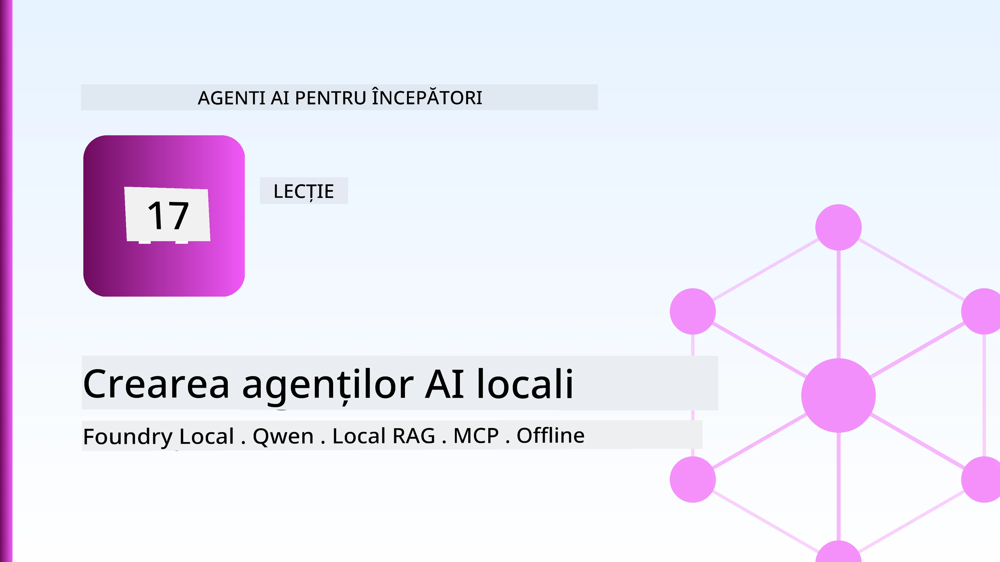
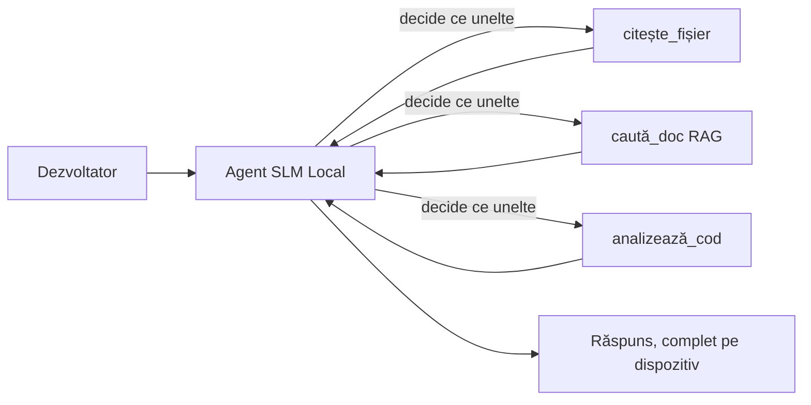
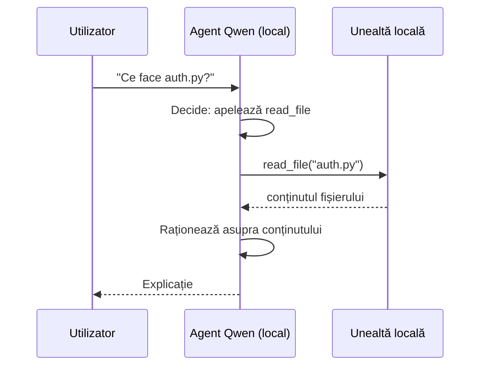
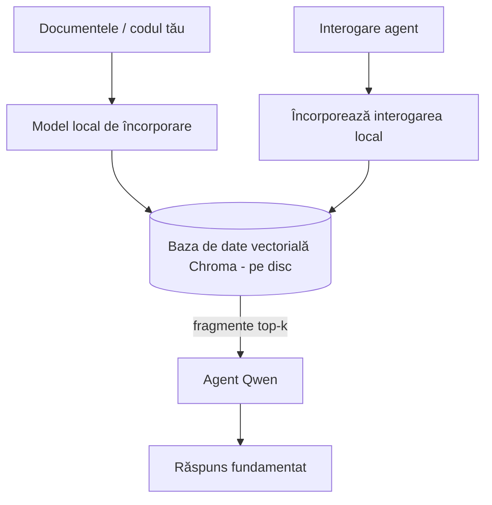
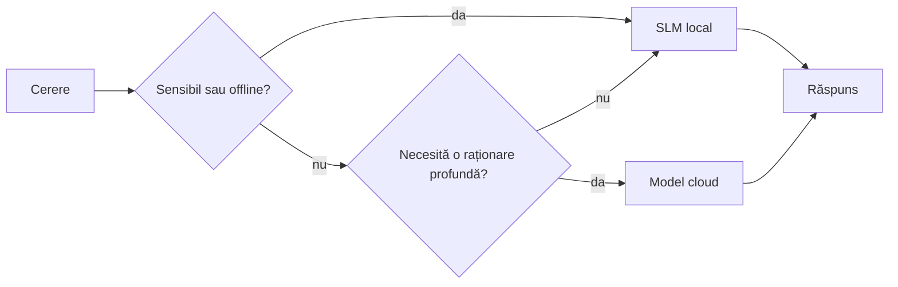

# Crearea de agenți AI locali folosind Microsoft Foundry Local și Qwen



Lecția precedentă a scalat agenții *în sus*, în cloud. Aceasta îi aduce *în jos*, pe o singură mașină. La final veți avea un asistent de inginerie funcțional care raționează, apelează unelte, citește fișierele voastre și caută în documentație — **fără niciun apel de inferență în cloud.**

De ce ați dori asta? Trei motive care apar constant în munca reală de inginerie:

- **Confidențialitate.** Codul și documentele nu părăsesc mașina. Niciun prompt, fragment sau date de client nu tranzitează rețeaua.
- **Cost.** Inferența locală nu are facturare pe tokeni. Puteți itera toată ziua pentru costul electricității.
- **Offline.** Pe avion, în facilități securizate sau în timpul unei pene, agentul funcționează în continuare.

Dezavantajul este că faceți un schimb între un model frontieră în cloud și un **Model de Limbaj Mic (SLM)** care rulează pe CPU, GPU sau NPU. Această lecție este despre construirea agenților care sunt *buni* în această constrângere, în loc să pretindem că nu există.

## Introducere

Această lecție va acoperi:

- **Modelele de Limbaj Mic (SLM)** — ce sunt, unde excelează și unde nu.
- **Microsoft Foundry Local** — un runtime care descarcă și servește modele pe dispozitiv printr-un **API compatibil OpenAI**.
- **Modelele Qwen de apelare a funcțiilor** — SLM-uri care produc fiabil apeluri către unelte, ceea ce face posibili agenți locali (nu doar chat local).
- **Unelte locale, RAG local și MCP local** — oferind agentului capacități fără cloud.
- **Modele hibride** — când să păstrăm local și când să apelăm cloud-ul.

## Obiective de învățare

După finalizarea acestei lecții veți ști cum să:

- Explicați compromisurile SLM-urilor și să alegeți cazuri adecvate pentru agenți locali.
- Serviți un model Qwen local cu Foundry Local și să vă conectați prin endpoint-ul compatibil OpenAI.
- Construiți un agent care apelează unelte, care rulează integral pe stația voastră de lucru.
- Adăugați RAG local peste propriile documente folosind o bază de date vectorială locală (Chroma).
- Conectați agentul la un server MCP local și raționați despre designuri hibride local/cloud.

## Prerrequisite

Această lecție presupune că ați finalizat lecțiile anterioare și sunteți confortabil cu:

- [Utilizarea uneltelor](../04-tool-use/README.md) (Lecția 4) și [Agentic RAG](../05-agentic-rag/README.md) (Lecția 5).
- [Protocoale agentice / MCP](../11-agentic-protocols/README.md) (Lecția 11).
- [Microsoft Agent Framework](../14-microsoft-agent-framework/README.md) (Lecția 14).

Veți avea nevoie și de:

- O stație de lucru pentru dezvoltatori. **8 GB RAM este un minim realist**; 16 GB+ este confortabil. Un GPU sau NPU ajută, dar nu este necesar.
- **Microsoft Foundry Local** instalat (vedeți secțiunea de configurare de mai jos).
- Python 3.12+ și pachetele din fișierul [`requirements.txt`](../../../requirements.txt) al depozitului, plus `foundry-local-sdk`, `openai` și `chromadb` pentru această lecție.

## Modele de Limbaj Mic: Unealta Potrivită pentru Munca Locală

Un model frontieră în cloud are sute de miliarde de parametri și un centru de date în spate. Un SLM are câteva miliarde de parametri și trebuie să încapă în RAM-ul laptopului tău. Această diferență setează așteptări clare.

**SLM-urile sunt bune la:**

- Sarcini structurate, delimitate — clasificare, extragere, sumarizare a unui document cunoscut.
- **Apelarea uneltelor** — decizia ce funcție să apeleze și cu ce argumente.
- Iterație rapidă, ieftină și privată pe propriile date.

**SLM-urile sunt mai slabe la:**

- Raționament deschis, multi-hop peste un context mare.
- Cunoaștere amplă a lumii (au văzut mai puțin și uită mai mult).

Strategia câștigătoare pentru agenții locali este așadar: **lăsați SLM să orchestreze și uneltele să facă treaba grea.** Modelul nu trebuie să *cunoască* codul tău — trebuie să știe când să apeleze `read_file` și `search_docs`. Asta joacă direct pe punctele forte ale unui SLM.



## Microsoft Foundry Local

**Microsoft Foundry Local** este un runtime ușor care descarcă, administrează și servește modele în întregime pe mașina ta. Caracteristica cea mai importantă pentru noi este că expune un **endpoint HTTP compatibil OpenAI** — ceea ce înseamnă că SDK-ul OpenAI și clientul OpenAI din Microsoft Agent Framework funcționează contra lui schimbând doar `base_url`. Tot ce ai învățat despre construirea agenților se transferă direct; doar endpoint-ul se mută din cloud pe `localhost`.

Foundry Local alege de asemenea automat cea mai bună construcție a unui model pentru hardware-ul tău — o construcție CPU, una CUDA/GPU sau una NPU — așa că nu trebuie să optimizezi manual fiecare mașină.

### Configurare

Instalați Foundry Local (vedeți [documentația](https://learn.microsoft.com/azure/ai-foundry/foundry-local/) pentru sistemul vostru de operare), apoi confirmați că funcționează:

```bash
# Instalează (exemplu; urmează documentația pentru platforma ta)
winget install Microsoft.FoundryLocal      # Windows
# brew install microsoft/foundrylocal/foundrylocal   # macOS

# Descarcă și rulează un model Qwen, apoi pornește serviciul local
foundry model run qwen2.5-7b-instruct
foundry service status
```

Odată ce serviciul rulează, aveți un endpoint local, compatibil OpenAI (de obicei `http://localhost:PORT/v1`). Notebook-ul folosește `foundry-local-sdk` pentru a descoperi automat endpoint-ul, deci nu trebuie să hardcodați portul.

## Apelarea funcțiilor Qwen: De ce contează

Un agent este agent doar dacă poate apela unelte. Multe SLM-uri pot discuta, dar produc apeluri către unelte nefiabile, incorecte. Modelele **Qwen** sunt antrenate pentru apelare de funcții și emit structuri bine formate de apeluri către unelte în mod constant — ceea ce transformă un model de chat local într-un *agent* local.

Fluxul este bucla standard de apelare de unelte pe care o cunoașteți deja, doar că rulează pe dispozitiv:



## RAG Local

Căutarea documentației este locul unde agenții locali aduc valoare. În loc să sperăm că SLM-ul a memorat documentația framework-ului vostru, integrați acele documente într-o **bază de date vectorială locală** și lăsați agentul să recupereze bucățile relevante la cerere.

Folosim **Chroma**, un magazin vectorial încorporat care rulează în proces, fără server de administrat. Pipeline-ul este complet local: modelul de embedding local → vectori locali → recuperare locală → SLM local.



Acesta este același tipar Agentic RAG din lecția 5 — singura diferență este că toate componentele rulează pe mașina ta.

## Servere MCP Locale

[MCP](../11-agentic-protocols/README.md) este un transport, nu un serviciu cloud. Un server MCP poate rula ca proces local pe `stdio`, expunând unelte agentului prin protocolul standard. Acest lucru permite reutilizarea ecosistemului MCP în creștere — acces la sistemul de fișiere, operațiuni git, interogări baze de date — complet offline.

Postura de securitate este diferită față de cloud, dar nu absentă: un server MCP local rulează tot cu permisiunile utilizatorului tău, deci limitează lui ce poate accesa (un director de proiect, nu întreg folderul home) și tratează rezultatele lui ca inputuri ce trebuie validate.

## Modele hibride Cloud-și-Local

Local-first nu înseamnă local-doar. Sistemele mature direcționează după sensibilitate și dificultate:

| Situație | Unde rulează |
| --- | --- |
| Cod / date sensibile, sau offline | **SLM local** |
| Sarcină simplă, delimitată | **SLM local** (ieftin, rapid) |
| Raționament multi-hop dificil pe date nesensibile | **Model cloud** |
| Totul, în timpul unei pene | **SLM local** (degradare grațioasă) |

Aceasta oglindește ideea de **rutare a modelului** din Lecția 16 — cu excepția faptului că unul dintre "modele" este acum propria ta mașină. Un design robust cade pe local când cloud-ul nu este disponibil, astfel încât agentul degradează calitatea în loc să eșueze complet.



## Laborator practic: Un Asistent de inginerie local

Deschideți [`code_samples/17-local-agent-foundry-local.ipynb`](./code_samples/17-local-agent-foundry-local.ipynb) și parcurgeți-l. Veți construi un **asistent de inginerie local** care rulează integral pe stația voastră de lucru și poate:

1. **Apela unelte** — prin apelul funcțiilor Qwen prin Foundry Local.
2. **Executa operațiuni locale pe fișiere** — listare și citire fișiere într-un director de proiect.
3. **Analiza codului** — raportarea unor metrici de bază pe un fișier sursă.
4. **Căuta în documentație** — RAG local peste un folder de documente cu Chroma.
5. **Folosi MCP** — conectare la un server MCP local (cu o săritură grațioasă dacă nu este configurat).

Nu se folosește inferență în cloud în niciun punct.

### Parcurgere

Asistentul se conectează la Foundry Local prin endpoint-ul compatibil OpenAI, astfel codul agentului arată aproape identic cu lecțiile din cloud — doar clientul se schimbă:

```python
from foundry_local import FoundryLocalManager
from openai import OpenAI

# Foundry Local descoperă/descarcă modelul și ne oferă un endpoint local.
manager = FoundryLocalManager(\"qwen2.5-7b-instruct\")
client = OpenAI(base_url=manager.endpoint, api_key=manager.api_key)  # api_key este un substituent local
```

Uneltele sunt funcții Python obișnuite, cu scope într-un director de proiect:

```python
def read_file(path: str) -> str:
    \"\"\"Read a file, but only inside the sandboxed project directory.\"\"\"
    full = (PROJECT_ROOT / path).resolve()
    if PROJECT_ROOT not in full.parents and full != PROJECT_ROOT:
        return \"Access denied: path is outside the project directory.\"
    return full.read_text(encoding=\"utf-8\")
```

Observați verificarea sandbox — chiar și local, o unealtă care citește căi arbitrare este o responsabilitate. Notebook-ul păstrează fiecare unealtă limitată la un singur root de proiect.

## Verificare de cunoștințe

Testați-vă înțelegerea înainte de a trece la tema de acasă.

**1. Dați două motive concrete pentru a rula un agent local în loc să folosiți cloud-ul.**

<details>
<summary>Răspuns</summary>

Oricare două dintre: **confidențialitate** (codul și datele nu părăsesc mașina), **cost** (nu există factură pe tokeni pentru inferență) și **capacitatea offline** (funcționează fără rețea — pe avion, în facilități securizate sau în timpul unei pene). Constrângerile de reglementare/compliance care interzic trimiterea datelor în afara dispozitivului sunt un motiv comun de confidențialitate.
</details>

**2. Care este împărțirea recomandată a muncii între un SLM și uneltele sale într-un agent local, și de ce?**

<details>
<summary>Răspuns</summary>

Lăsați SLM să **orchestraeze** (să decidă ce unealtă să apeleze și cu ce argumente) și lăsați uneltele să **facă treaba grea** (citirea fișierelor, recuperarea documentelor, calcularea rezultatelor). SLM-urile sunt bune la decizii delimitate precum selecția uneltei, dar mai slabe la cunoaștere largă și raționament multi-hop lung, deci apelul la unelte le valorifică punctele forte.
</details>

**3. Ce face posibilă reutilizarea codului agentului din cloud cu Foundry Local?**

<details>
<summary>Răspuns</summary>

Foundry Local expune un **endpoint HTTP compatibil OpenAI**. SDK-ul OpenAI și clientul OpenAI al Agent Framework funcționează contra lui schimbând doar `base_url` (și folosind o cheie API locală placeholder). Restul codului agentului rămâne neschimbat.
</details>

**4. De ce folosim în mod specific un model Qwen de apelare a funcțiilor și nu orice SLM?**

<details>
<summary>Răspuns</summary>

Pentru că un agent trebuie să producă apeluri de unelte fiabile și bine formate. Multe SLM-uri pot conversa, dar emit structuri de apeluri către unelte necorespunzătoare sau inconsistentă. Modelele Qwen sunt antrenate pentru apelare de funcții și produc apeluri constante, ceea ce transformă un model de chat local într-un agent local funcțional.
</details>

**5. În pipeline-ul RAG local, ce componente rulează pe mașină?**

<details>
<summary>Răspuns</summary>

Toate: modelul de embedding, baza de date vectorială (Chroma, pe disc), pasul de recuperare și SLM-ul. Documentele sunt integrate local, stocate local, recuperate local și analizate de un model local — nici o componentă nu accesează cloud-ul.
</details>

**6. Un server MCP local rulează pe mașina ta. Îl face asta automat sigur? Ce precauție trebuie totuși să iei?**

<details>
<summary>Răspuns</summary>

Nu. Un server MCP local rulează cu permisiunile user-ului tău, deci poate accesa orice poți accesa și tu. Limitează-i accesul la ce are nevoie (de exemplu, un singur director de proiect, nu întreg folderul home) și tratează ieșirile lui ca inputuri de validat înainte de a le folosi.
</details>

**7. Descrie o regulă de rutare hibridă rezonabilă care include un model local.**

<details>
<summary>Răspuns</summary>

Direcționează cererile sensibile sau offline către SLM local; direcționează sarcinile simple, delimitate către SLM local pentru viteză și cost; direcționează raționamentul multi-hop dificil pe date nesensibile către un model cloud; și revino la SLM local dacă cloud-ul nu este disponibil, astfel agentul degradează grațios în loc să eșueze. Aceasta este rutarea modelului (Lecția 16) cu mașina locală ca unul dintre modele.
</details>

**8. Care este o valoare minimă realistă de RAM pentru a rula agentul local din această lecție și ce îți aduce mai mult RAM?**

<details>
<summary>Răspuns</summary>

În jur de **8 GB** este un minim realist; 16 GB+ este confortabil. Mai mult RAM permite rularea unor modele mai mari și capabile și păstrarea mai multor contexte în memorie. Un GPU sau NPU accelerează inferența, dar nu este necesar — Foundry Local selectează o construcție CPU când nu este disponibil un accelerator.
</details>

## Tema de acasă

Extinde asistentul local de inginerie într-un **recenzor local de documentație** pentru un proiect mic ales de tine (folosește unul din folderele de lecții ale acestui depozit, dacă dorești).

Trimiterea ta trebuie să:

1. **Indexeze un folder real de documentație/cod** în Chroma (cel puțin cinci fișiere).
2. **Adauge o unealtă `find_todos`** care scanează proiectul pentru comentarii `TODO`/`FIXME` și le returnează cu fișier și număr de linie — păstrând aceeași verificare sandbox ca `read_file`.

3. **Puneți agentului trei întrebări** care îl obligă să combine instrumente: una pură RAG, una care necesită citirea unui fișier specific și una care necesită găsirea TODO-urilor.
4. **Măsoară-l**: cronometrează fiecare dintre cele trei răspunsuri și notează-le într-o celulă markdown. Comentează dacă latența este acceptabilă pentru fluxul tău de lucru dorit.

Apoi scrie un paragraf scurt despre **ce ai muta în cloud și ce ai păstra local** pentru acest recenzor și de ce. Ești evaluat pe baza faptului dacă componentele locale sunt conectate corect între ele și dacă raționamentul tău hibrid este solid — nu pe calitatea modelului.

## Rezumat

În această lecție ai construit un agent care rulează integral pe propria ta mașină:

- **SLM-urile** fac schimb de amploare pe intimitate, cost și funcționare offline — și strălucesc când **orchestrază instrumente** în loc să dețină singure toată cunoașterea.
- **Foundry Local** servește modelele pe dispozitiv printr-un **endpoint compatibil cu OpenAI**, astfel încât codul agentului tău de cloud se transferă cu o schimbare de o linie.
- **Modelele Qwen de apelare a funcțiilor** fac apeluri locale fiabile către instrumente — și deci agenți locali — posibile.
- **RAG local** (Chroma) și **MCP local** oferă agentului capacitatea fără să părăsească mașina.
- **Modelele hibride** îți permit să rutezi după sensibilitate și dificultate, cu localul ca o opțiune de rezervă elegantă.

Aceasta încheie arcul de implementare: Lecția 16 a scalat agenții în Microsoft Foundry, iar această lecție i-a redus la o singură stație de lucru. Lecția următoare se concentrează pe menținerea securității agenților implementați.

## Resurse suplimentare

- <a href="https://learn.microsoft.com/azure/ai-foundry/foundry-local/" target="_blank">Documentația Microsoft Foundry Local</a>
- <a href="https://learn.microsoft.com/azure/ai-foundry/what-is-azure-ai-foundry" target="_blank">Documentația Microsoft Foundry</a>
- <a href="https://aka.ms/ai-agents-beginners/agent-framework" target="_blank">Microsoft Agent Framework</a>
- <a href="https://qwen.readthedocs.io/en/latest/framework/function_call.html" target="_blank">Documentația apelării funcțiilor Qwen</a>
- <a href="https://modelcontextprotocol.io/" target="_blank">Model Context Protocol (MCP)</a>
- <a href="https://docs.trychroma.com/" target="_blank">Baza de date vectorială Chroma</a>

## Lecția anterioară

[Implementarea agenților scalabili](../16-deploying-scalable-agents/README.md)

## Lecția următoare

[Asigurarea agenților AI](../18-securing-ai-agents/README.md)

---

<!-- CO-OP TRANSLATOR DISCLAIMER START -->
**Declinare a responsabilității**:
Acest document a fost tradus folosind serviciul de traducere AI [Co-op Translator](https://github.com/Azure/co-op-translator). În timp ce ne străduim pentru acuratețe, vă rugăm să rețineți că traducerile automate pot conține erori sau inexactități. Documentul original în limba sa nativă trebuie considerat sursa autorizată. Pentru informații critice, se recomandă traducerea profesională realizată de un om. Nu ne asumăm responsabilitatea pentru eventualele neînțelegeri sau interpretări greșite care decurg din utilizarea acestei traduceri.
<!-- CO-OP TRANSLATOR DISCLAIMER END -->