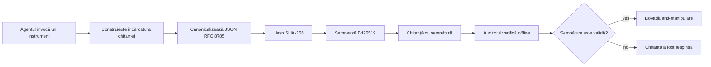
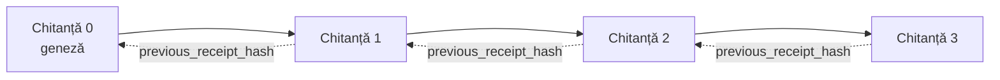

[Vizionați videoclipul lecției: Asigurarea agenților AI cu chitanțe criptografice](https://youtu.be/PLACEHOLDER_VIDEO_ID)

> _(Videoclipul lecției și miniatura vor fi adăugate de echipa de conținut Microsoft după fuziune, urmând modelul lecțiilor 14 / 15.)_

# Asigurarea agenților AI cu chitanțe criptografice

## Introducere

Această lecție va acoperi:

- De ce sunt importante traseele de audit pentru agenții AI în ceea ce privește conformitatea, depanarea și încrederea.
- Ce este o chitanță criptografică și cum diferă de o linie de jurnal nesemnată.
- Cum să produceți o chitanță semnată pentru un apel al unui instrument al agentului în Python simplu.
- Cum să verificați o chitanță offline și să detectați modificările.
- Cum să legați chitanțele astfel încât eliminarea sau reordonarea uneia să rupă lanțul.
- Ce dovedesc chitanțele și ce nu dovedesc în mod explicit.

## Obiectivele de învățare

După finalizarea acestei lecții, veți ști să:

- Identificați modurile de eșec care motivează proveniența criptografică pentru acțiunile agentului.
- Produceți o chitanță semnată Ed25519 peste o încărcătură JSON canonică.
- Verificați o chitanță independent folosind doar cheia publică a semnatarului.
- Detectați modificări reexecutând verificarea pe o chitanță modificată.
- Construiți o secvență de chitanțe legate prin hash și explicați de ce lanțul contează.
- Recunoașteți granița între ceea ce dovedesc chitanțele (atributie, integritate, ordonare) și ceea ce nu dovedesc (corectitudinea acțiunii, valabilitatea politicii).

## Problema: Traseul de audit al agentului dumneavoastră

Imaginați-vă că ați implementat un agent AI pentru Contoso Travel. Agentul citește cererile clienților, apelează un API de zboruri pentru a căuta opțiuni și rezervă locuri în numele clientului. În ultimul trimestru, agentul a procesat 50.000 de rezervări.

Astăzi vine un auditor. El pune o întrebare simplă: „Arată-mi ce a făcut agentul tău.”

Îi înmânați fișierele de jurnal. Auditorul le examinează și pune o întrebare mai dificilă: „Cum știu că aceste jurnale nu au fost editate?”

Aceasta este problema traseului de audit. Cele mai multe implementări ale agenților astăzi se bazează pe:

- **Jurnale de aplicație**: scrise de agent însuși, editabile de oricine are acces la sistemul de fișiere.
- **Servicii de jurnalizare în cloud**: evidente la modificări la nivel de platformă, dar numai dacă auditorul are încredere în operatorul platformei.
- **Jurnale de tranzacții în bazele de date**: potrivite pentru schimbările în baza de date, dar nu pentru apeluri arbitrare de instrumente.

Nici unul dintre acestea nu poate răspunde la întrebarea auditorului fără să impună ca auditorul să aibă încredere în cineva (dumneavoastră, furnizorul de cloud, vânzătorul bazei de date). Pentru uz intern, această încredere este adesea acceptabilă. Pentru sarcinile reglementate (finanțe, sănătate, orice este supus Regulamentului UE AI), nu este.

Chitanțele criptografice rezolvă această problemă făcând fiecare acțiune a agentului verificabilă independent. Auditorul nu trebuie să aibă încredere în dumneavoastră. Are nevoie doar de cheia dumneavoastră publică și de chitanță în sine.

## Ce este o chitanță criptografică?

O chitanță este un obiect JSON care înregistrează ce a făcut un agent, semnat cu o semnătură digitală.



O chitanță minimală arată așa:

```json
{
  "type": "agent.tool_call.v1",
  "agent_id": "contoso-travel-bot",
  "tool_name": "lookup_flights",
  "tool_args_hash": "sha256:a3f9c1...",
  "result_hash": "sha256:7b2e1d...",
  "policy_id": "contoso-travel-policy-v3",
  "timestamp": "2026-04-25T14:30:00Z",
  "sequence": 47,
  "previous_receipt_hash": "sha256:9d4e6a...",
  "signature": {
    "alg": "EdDSA",
    "sig": "c5af83...",
    "public_key": "8f3b2c..."
  }
}
```

Trei proprietăți efectuează treaba:

1. **Semnătura**. Chitanța este semnată de poarta agentului folosind o cheie privată Ed25519. Oricine are cheia publică corespunzătoare poate verifica semnătura offline. Modificarea oricărui câmp face semnătura invalidă.

2. **Codificarea canonică**. Înainte de semnare, chitanța este serializată folosind Schema de Canonalizare JSON (JCS, RFC 8785). Aceasta asigură că două implementări care produc aceeași chitanță logică produc o ieșire identică la nivel de biți. Fără canonizare, diferiți serializatori JSON ar produce semnături diferite pentru același conținut.

3. **Lanțul de hash**. Câmpul `previous_receipt_hash` leagă fiecare chitanță de cea dinainte. Eliminarea sau reordonarea unei chitanțe rupe fiecare chitanță ulterioară din lanț. Modificările devin vizibile la nivelul lanțului chiar dacă semnăturile individuale sunt ocolite.

Împreună, aceste proprietăți oferă trei garanții:

- **Atribuirea**: această cheie a semnat acest conținut.
- **Integritatea**: conținutul nu s-a schimbat de la semnare.
- **Ordonarea**: această chitanță a venit după acea chitanță în lanț.

## Producerea unei chitanțe în Python

Nu aveți nevoie de o bibliotecă specială pentru a produce o chitanță. Primitivele criptografice sunt larg disponibile, iar logica este de câteva zeci de linii de cod Python.

Exercițiile practice din `code_samples/18-signed-receipts.ipynb` parcurg întregul flux. Versiunea sumarizată:

```python
import json
import hashlib
import base64
from nacl import signing
from jcs import canonicalize  # JSON canonic RFC 8785

def b64url_nopad(data: bytes) -> str:
    return base64.urlsafe_b64encode(data).decode("ascii").rstrip("=")

def sha256_canonical(obj) -> str:
    """SHA-256 of a Python object's JCS-canonical JSON form."""
    return f"sha256:{hashlib.sha256(canonicalize(obj)).hexdigest()}"

# Generează sau încarcă o cheie de semnare (în producție, stochează-o într-un seif de chei)
signing_key = signing.SigningKey.generate()
verify_key = signing_key.verify_key

# Construiește payload-ul chitanței (încă fără semnătură)
tool_args = {"origin": "SYD", "destination": "LAX"}
tool_result = [{"flight": "QF11", "price": 1850, "stops": 0}]

payload = {
    "type": "agent.tool_call.v1",
    "agent_id": "contoso-travel-bot",
    "tool_name": "lookup_flights",
    "tool_args_hash": sha256_canonical(tool_args),
    "result_hash": sha256_canonical(tool_result),
    "policy_id": "contoso-travel-policy-v3",
    "timestamp": "2026-04-25T14:30:00Z",
    "sequence": 0,
    "previous_receipt_hash": None,
}

# Canonicalizează, hash-uiește, semnează.
canonical_bytes = canonicalize(payload)
message_hash = hashlib.sha256(canonical_bytes).digest()
signature_bytes = signing_key.sign(message_hash).signature

# Atașează un obiect de semnătură structurat.
receipt = {
    **payload,
    "signature": {
        "alg": "EdDSA",
        "sig": b64url_nopad(signature_bytes),
        "public_key": b64url_nopad(bytes(verify_key)),
    },
}
```

Aceasta este întreaga cale de semnare. Exercițiile din notebook prezintă fiecare pas.

## Verificarea unei chitanțe și detectarea modificărilor

Verificarea este operația inversă:

```python
import base64
import hashlib
from nacl import signing
from nacl.exceptions import BadSignatureError
from jcs import canonicalize

def b64url_decode(s: str) -> bytes:
    padding = "=" * ((4 - len(s) % 4) % 4)
    return base64.urlsafe_b64decode(s + padding)

def verify_receipt(receipt: dict) -> bool:
    # Semnătura este un obiect structurat: {"alg", "sig", "public_key"}.
    sig_obj = receipt.get("signature")
    if not sig_obj or sig_obj.get("alg") != "EdDSA":
        return False

    # Reconstruiește încărcătura care a fost de fapt semnată (totul mai puțin semnătura).
    payload = {k: v for k, v in receipt.items() if k != "signature"}

    canonical_bytes = canonicalize(payload)
    message_hash = hashlib.sha256(canonical_bytes).digest()

    try:
        verify_key = signing.VerifyKey(b64url_decode(sig_obj["public_key"]))
        verify_key.verify(message_hash, b64url_decode(sig_obj["sig"]))
        return True
    except BadSignatureError:
        return False
```

Această funcție primește o chitanță și returnează `True` dacă semnătura este validă, `False` altfel. Fără apeluri de rețea, fără dependență de servicii, fără încredere într-o terță parte.

Pentru a vedea în acțiune detectarea modificărilor, notebook-ul parcurge:

1. Producerea unei chitanțe valide și confirmarea verificării acesteia.
2. Modificarea unui octet al câmpului `tool_args_hash`.
3. Reexecutarea verificării și observarea eșecului.

Aceasta este demonstrația practică că chitanțele sunt evidente la modificare: orice modificare, oricât de mică, rupe semnătura.

## Legarea chitanțelor pentru agenți cu mai mulți pași

O singură chitanță semnată protejează o acțiune. Un lanț de chitanțe protejează o secvență.



Fiecare chitanță înregistrează hash-ul chitanței anterioare. Pentru a elimina silențios chitanța 2, un atacator ar trebui să:

- Modifice câmpul `previous_receipt_hash` al chitanței 3 (rupe semnătura chitanței 3), SAU
- Sape o nouă semnătură pe o chitanță 3 modificată (necesită cheia privată a agentului).

Dacă cheia privată este într-un seif hardware și publicați cheia publică cu fiecare chitanță, niciun atac nu este fezabil fără detectare.

Notebook-ul parcurge:

1. Construirea unui lanț de trei chitanțe.
2. Verificarea că `previous_receipt_hash` al fiecărei chitanțe corespunde cu hash-ul real al chitanței anterioare.
3. Modificarea unei chitanțe din mijloc și observarea ruperii lanțului exact în acel punct.

Așa produceți un traseu de audit pe care un auditor extern îl poate verifica fără să aibă încredere în dumneavoastră.

## Ce dovedesc chitanțele (și ce nu dovedesc)

Aceasta este cea mai importantă secțiune a lecției. Chitanțele sunt puternice, dar puterea lor are limite.

**Chitanțele dovedesc trei lucruri:**

1. **Atribuirea**: o cheie specifică a semnat o anumită încărcătură.
2. **Integritatea**: încărcătura nu s-a schimbat de la semnare.
3. **Ordonarea**: această chitanță a venit după acea chitanță în lanțul de hash-uri.

**Chitanțele NU dovedesc:**

1. **Corectitudinea**: că acțiunea agentului a fost cea corectă. O chitanță poate fi semnată pentru un răspuns greșit la fel de bine ca pentru unul corect.
2. **Conformitatea cu politica**: că politica menționată în `policy_id` a fost de fapt evaluată sau că ar fi permis această acțiune dacă ar fi fost verificată. Chitanța înregistrează ce s-a pretins, nu ce a fost impus.
3. **Identitatea dincolo de cheie**: chitanța spune „această cheie a semnat acest conținut”. Nu spune „această persoană a autorizat acest lucru.” Conectarea unei chei la o persoană sau organizație necesită infrastructură de identitate separată (un director, un registru de chei publice etc.).
4. **Adevărul intrărilor**: dacă agentul primește un prompt manipulat și acționează conform lui, chitanța înregistrează acțiunea fidel. Chitanțele sunt ulterioare validării intrărilor, nu un substitut pentru aceasta.

Această graniță contează din două motive:

- Vă arată pentru ce sunt utile chitanțele: pentru a face comportamentul agentului auditat și evident la modificări, chiar și peste granițe organizaționale.
- Vă arată ce straturi suplimentare aveți nevoie: validarea intrărilor (Lecția 6), aplicarea politicii (acoperită pe scurt mai jos), și infrastructura de identitate (în afara scopului acestei lecții).

O greșeală comună este să presupuneți că „avem chitanțe” înseamnă „suntem guvernați.” Nu înseamnă asta. Chitanțele sunt o fundație. Guvernanța este sistemul pe care îl construiți deasupra.

## Dovezile că o persoană a aprobat acțiunea exactă

Punctul 3 de mai sus merită o secțiune proprie: o chitanță de acțiune spune „această cheie a semnat acest conținut,” niciodată „un om a autorizat asta.” Pentru acțiuni cu risc mare (returnări de bani, ștergeri, transferuri bancare), cadrele de guvernanță cer tot mai des exact acea afirmație lipsă, iar ea poate fi produsă cu aceleași primitive construite deja în această lecție.

Notebook-ul ulterior `code_samples/human-authorization-receipts.ipynb` adaugă un al doilea tip de chitanță, `human.approval.v1`, în aceeași formă de plic ca chitanțele din lecție (o încărcătură tipizată semnată Ed25519 peste suma canonică SHA-256, cu obiectul `signature` în afara datelor semnate). Un autorizator numit semnează **acțiunea canonică completă și digestul ei** înainte de execuție; chitanța acțiunii agentului poartă **același digest de acțiune** și un `parent_approval_ref`, hash-ul chitanței de aprobare, aceeași convenție ca `previous_receipt_hash` din lanțul construit mai sus. O singură funcție `verify_chain` verifică ambele artefacte sub **registrii de chei fixați separați** (cheile autorizatorului versus cheile agentului), deci calea codului este comună, dar autoritățile nu.

Proprietatea câștigată, enunțată cu atenție: *omul a aprobat această acțiune exactă, iar agentul a executat exact acea acțiune aprobată.* Fixture-urile de refuz din notebook sunt ce fac proprietatea reală, nu doar declarată:

- setul clasic: modificări, agent confuz, redare, chei falsificate pe ambele părți, intrări malformate;
- **autoritate expirată**: o semnătură care încă se verifică, respinsă totuși deoarece versiunea politicii s-a schimbat, cheia autorizatorului a fost rotită în afara registrului fixat, sau aprobarea a expirat înainte de execuție;
- **substituirea digestului**: o chitanță de acțiune valid semnată care indică o aprobare *reală* ce leagă o acțiune canonică *diferită*.

Fiecare eșec refuză cu un motiv distinct, astfel încât un auditor care citește un refuz poate spune dacă autoritatea a expirat sau acțiunea executată s-a schimbat. Regula predată în notebook: o aprobare semnată nu este autoritate de una singură. Autoritatea există numai dacă ambele chitanțe încă leagă aceeași acțiune canonică în momentul execuției. Calea co-semnăturii în același Internet-Draft pe care îl urmează această lecție (`draft-farley-acta-signed-receipts`) este forma standard a acestui model.

## Referințe pentru producție

Codul Python din această lecție este intenționat minimal pentru ca dumneavoastră să puteți citi fiecare linie și să înțelegeți exact ce se întâmplă. În producție, aveți două opțiuni:

1. **Construiți direct pe primitivele criptografice.** Cele 50 de linii pe care le-ați văzut mai sus sunt suficiente pentru multe cazuri de utilizare. PyNaCl (Ed25519) și pachetul `jcs` (JSON canonic) sunt biblioteci bine întreținute și auditate.

2. **Folosiți o bibliotecă de chitanțe pentru producție.** Mai multe proiecte open-source implementează același model cu funcții suplimentare (rotația cheilor, verificarea în lot, distribuția setului JWK, integrarea cu motoare de politici):
   - Formatul chitanței folosit în această lecție urmează un Internet-Draft IETF ([`draft-farley-acta-signed-receipts`](https://datatracker.ietf.org/doc/draft-farley-acta-signed-receipts/), revizia 02) aflat în procesul de standardizare, cu un set comun de conformitate ([agent-governance-testvectors](https://github.com/ScopeBlind/agent-governance-testvectors)) pe care implementările independente îl verifică încrucișat pentru ieșire canonică identică pe biți.
   - Microsoft Agent Governance Toolkit compune chitanțele cu decizii politice bazate pe Cedar; vedeți Tutorialul 33 din acel depozit pentru un exemplu de la început la sfârșit.
   - Pachetele `protect-mcp` (npm) și `@veritasacta/verify` (npm) oferă o implementare Node pentru semnarea și verificarea offline a chitanțelor, destinată să înfășoare orice server MCP cu un traseu de audit evident la modificări, inclusiv un flux ținut pentru co-semnare în care o acțiune întreruptă emite o chitanță de aprobare legată de digestul acțiunii (sprijinit de WebAuthn în fluxul desktop), același model de chitanță de aprobare ca notebook-ul de autorizare umană de mai sus.
   - SDK-ul Python **[nobulex](https://github.com/arian-gogani/nobulex)** (`pip install nobulex`) oferă același model de semnare Ed25519 + JCS în Python cu integrări LangChain și CrewAI, inclusiv vectori de testare de validare încrucișată publicați și o mapare pentru conformitate contribuită prin [OWASP PR #2210](https://github.com/OWASP/CheatSheetSeries/pull/2210).

Decizia între a vă construi propriul cod și a folosi o bibliotecă reflectă decizia între a scrie propria bibliotecă JWT și a folosi una testată: ambele sunt rezonabile; biblioteca economisește timp și reduce suprafața de audit; abordarea de la zero vă forțează să înțelegeți fiecare primitiv. Această lecție predă calea de la zero pentru a avea fundația pentru orice alegere.

## Verificare a cunoștințelor

Testați-vă înțelegerea înainte de a trece la exercițiul practic.

**1. O chitanță este semnată cu cheia privată Ed25519 a agentului. Auditorul are doar cheia publică. Poate auditorul să verifice chitanța offline?**

<details>
<summary>Răspuns</summary>

Da. Verificarea Ed25519 necesită doar cheia publică și octeții semnați. Niciun apel de rețea, nicio dependență de serviciu. Aceasta este proprietatea care face chitanțele utile în medii air-gapped, multi-organizație sau cu încredere scăzută.
</details>

**2. Un atacator modifică câmpul `policy_id` al unei chitanțe pentru a pretinde că aceasta a fost guvernată de o politică mai permisivă. Semnătura a fost făcută asupra încărcăturii originale. Ce se întâmplă în timpul verificării?**

<details>
<summary>Răspuns</summary>


Eșec la verificare. Semnătura a fost calculată pe baza octeților canonici ai încărcăturii originale; modificarea oricărui câmp schimbă octeții canonici, ceea ce schimbă hash-ul SHA-256, făcând semnătura invalidă. Atacatorul ar avea nevoie de cheia privată pentru a produce o semnătură valabilă nouă, dar nu o deține.
</details>

**3. De ce chitanța include un `tool_args_hash` și un `result_hash` în locul argumentelor și rezultatelor brute?**

<details>
<summary>Răspuns</summary>

Două motive. În primul rând, chitanța poate avea nevoie să fie arhivată sau transmisă în medii unde dezvăluirea conținutului brut (informații personale, date sensibile de business) este problematică. Hash-ul păstrează chitanța mică și conținutul privat; auditorul verifică că hash-ul corespunde unei copii stocate separat a conținutului real. În al doilea rând, hash-urile au o dimensiune fixă; o chitanță cu hash-uri are o dimensiune limitată, indiferent cât de mari au fost intrările și ieșirile.
</details>

**4. Câmpul `previous_receipt_hash` leagă fiecare chitanță de precedenta sa. Dacă un atacator șterge în mod silențios o chitanță din mijlocul lanțului, ce devine invalid?**

<details>
<summary>Răspuns</summary>

Toate chitanțele care au venit după cea ștearsă. Câmpurile lor `previous_receipt_hash` nu mai corespund lanțului real (pentru că chitanța la care făceau referire nu mai există sau lanțul acum indică un alt predecesor). Pentru a ascunde ștergerea, atacatorul ar trebui să semneze din nou fiecare chitanță ulterioară, ceea ce necesită cheia privată.
</details>

**5. O chitanță este verificată cu succes. Dovedește asta că acțiunea agentului a fost corectă, solidă sau conformă cu politica?**

<details>
<summary>Răspuns</summary>

Nu. O chitanță valabilă dovedește trei lucruri: atribuirea (această cheie a semnat acest conținut), integritatea (conținutul nu a fost modificat) și ordonarea (această chitanță a venit după o altă chitanță). NU dovedește că acțiunea a fost corectă, că politica indicată în `policy_id` a fost evaluată efectiv, sau că agentul a urmat fiecare regulă. Chitanțele fac comportamentul agentului audibil, nu neapărat corect. Aceasta este cea mai importantă limită a lecției.
</details>

## Exercițiu practic

Deschide `code_samples/18-signed-receipts.ipynb` și completează toate cele patru secțiuni:

1. **Secțiunea 1**: Semnează prima ta chitanță și verific-o.
2. **Secțiunea 2**: Modifică chitanța și observă eșecul verificării.
3. **Secțiunea 3**: Construiește un lanț de trei chitanțe și verifică integritatea lanțului.
4. **Secțiunea 4**: Aplică modelul la un agent construit cu Microsoft Agent Framework: înfășoară un apel de unealtă în semnarea chitanțelor, apoi verifică chitanța independent.

**Provocare suplimentară 1:** extinde schema chitanței cu un câmp suplimentar ales de tine (de exemplu, un ID de cerere pentru urmărire), actualizează logica canonică de semnare pentru a-l include și confirmă că chitanța trece verificarea. Apoi modifică câmpul după semnare și confirmă că verificarea eșuează. Acest exercițiu te obligă să înțelegi cum fiecare octet al codificării canonice contribuie la semnătură.

**Provocare suplimentară 2:** hash-uiește SHA-256 două dintre chitanțele tale împreună (concatenează octeții lor canonici într-o ordine deterministă) și încorporează digestul rezultat ca un câmp nou pe a treia chitanță înainte de semnare. Verifică că toate cele trei chitanțe trec încă verificarea. Tocmai ai construit o dovadă de includere într-un pas: oricine deține a treia chitanță poate demonstra că primele două existau la momentul semnării, fără a dezvălui conținutul lor. Acesta este modelul folosit la scară largă de chitanțele cu dezvăluire selectivă (angajamente Merkle, RFC 6962).

## Concluzie

Chitanțele criptografice oferă agenților AI o pistă de audit care este:

- **Verificabilă independent**: orice parte cu cheia publică poate verifica, fără dependență de serviciu.
- **Evidentă la modificare**: orice modificare invalidează semnătura.
- **Portabilă**: o chitanță este un fișier JSON mic; poate fi arhivată, transmisă și verificată oriunde.
- **Aliniată la standarde**: construită pe Ed25519 (RFC 8032), JCS (RFC 8785), și SHA-256, toate primitive larg răspândite.

Ele nu sunt un substitut pentru validarea intrării, aplicarea politicii sau infrastructura de identitate. Sunt o fundație pentru aceste straturi. Când implementezi agenți în medii reglementate, fluxuri multi-organizaționale sau orice situație în care un auditor viitor nu poate presupune că are încredere în tine, chitanțele sunt modul în care faci pista de audit onestă.

Cel mai important mesaj: chitanțele dovedesc cine a spus ce, când. Nu dovedesc că ceea ce s-a spus este adevărat sau corect. Păstrează această distincție clară. Este diferența dintre un sistem de proveniență onest și unul înșelător.

## Lista de verificare pentru producție

Când ești gata să treci de la această lecție la implementarea agenților cu semnături pe chitanțe într-un mediu real:

- [ ] **Mută cheia de semnare de pe laptopul dezvoltatorului.** Folosește Azure Key Vault, AWS KMS, sau un modul hardware de securitate. Cheia privată care semnează chitanțele nu trebuie niciodată să fie în controlul sursei sau stocată în text clar pe mașinile aplicației.
- [ ] **Publică cheia publică de verificare.** Auditorii au nevoie de ea pentru a verifica offline. Modelul standard este un JWK Set la o adresă URL binecunoscută (RFC 7517), ex: `https://your-org.example.com/.well-known/agent-keys.json`.
- [ ] **Ancorează lanțul extern.** Perioadic scrie hash-ul vârfului lanțului într-un jurnal de transparență (Sigstore Rekor, autoritate de înregistrare timp RFC 3161, sau un al doilea sistem intern) ca o parte externă să poată confirma „acest lanț existat la acest timp.”
- [ ] **Stochează chitanțele imuabil.** Stocare cu adăugare numai (Azure Storage cu politici de imuabilitate, AWS S3 Object Lock) previne un insider să rescrie istoricul la nivel de stocare.
- [ ] **Decide păstrarea.** Multe regimuri de conformitate cer păstrare pe ani multipli. Planifică creșterea chitanțelor (fiecare chitanță are ~500 bytes; un agent care face 10K apeluri pe zi produce ~1.8 GB pe an).
- [ ] **Documentează ce nu acoperă chitanțele.** Chitanțele dovedesc atribuirea, integritatea și ordonarea. Manualul tău de operare ar trebui să listeze explicit ce controale suplimentare (validare input, aplicare politică, limitare rată, infrastructură de identitate) sunt alături de chitanțe în postura ta de guvernanță.

### Ai Mai Multe Întrebări despre Securizarea Agenților AI?

Alătură-te [Microsoft Foundry Discord](https://aka.ms/ai-agents/discord) pentru a întâlni alți cursanți, a participa la ore de consultanță și a primi răspunsuri pentru întrebările tale despre Agenții AI.

## Dincolo de această lecție

Această lecție acoperă semnarea unei singure chitanțe și lanțuri hash. Aceleași primitive compun mai multe modele avansate pe care le vei întâlni pe măsură ce postura ta de guvernanță se maturizează:

- **Dezvăluire selectivă.** Când câmpurile unei chitanțe sunt angajate independent (arbore Merkle în stil RFC 6962), poți dezvălui anumite câmpuri unor auditori anume și demonstra că restul nu s-au schimbat fără a le expune. Util când aceeași chitanță trebuie să satisfacă un audit amplu (care vrea completitudine) și reglementări de minimizare a datelor precum GDPR (care doresc ca auditorul să vadă cât mai puțin posibil).
- **Revocarea chitanțelor.** Dacă o cheie de semnare este compromisă, ai nevoie de un mod de a marca toate chitanțele semnate de acea cheie ca nesigure de la un moment dat încolo. Modele standard: chei de semnare cu durată scurtă și o listă publicată de revocare, sau un jurnal de transparență cu intrări de revocare.
- **Chitanțe bilaterale / cu semnătură divizată.** Unele implementări împart încărcătura semnată în jumătăți pre-execuție (`authorization_*`) și post-execuție (`result_*`) cu semnături independente, util când decizia de autorizare și rezultatul observat sunt produse de actori diferiți sau în momente diferite. Aceasta se compune aditiv peste formatul chitanței predat în această lecție.
- **Compoziția încărcăturii.** O chitanță sigilează oricare octeți pui în `result_hash`. Încărcăturile reale sunt adesea mai complexe decât un singur rezultat de apel de unealtă: raționamentul pre-deciție (predicția modelului, opțiunile considerate, dovezile și completitudinea lor, poziția de risc, lanțul de responsabilitate, rezultatul porții) pot locui toate în încărcătură, sigilate de o singură chitanță. Aceasta păstrează formatul chitanței minim, permițând ca schemele încărcăturii să evolueze domeniu cu domeniu.
- **Conformitate între implementări.** Multiple implementări independente ale aceluiași format de chitanță (Python, TypeScript, Rust, Go) verifică încrucișat vectori de test comuni. Dacă construiești propria implementare, validarea cu acești vectori publici confirmă compatibilitatea wire.
- **Migrarea post-cuantică.** Ed25519 este larg folosit azi, dar nu este rezistent la computere cuantice. Formatul chitanței este agil algoritmic: câmpul `signature.alg` poate purta `ML-DSA-65` (standardul NIST post-cuantic de semnătură) când ai nevoie de migrare. Planifică o perioadă de tranziție cu chitanțe semnate dual.

## Resurse suplimentare

- <a href="https://datatracker.ietf.org/doc/draft-farley-acta-signed-receipts/" target="_blank">IETF Internet-Draft: Chitanțe de decizie semnate pentru controlul accesului mașină-la-mașină</a>
- <a href="https://learn.microsoft.com/azure/ai-studio/responsible-use-of-ai-overview" target="_blank">Prezentare generală a AI responsabil (Azure AI)</a>
- <a href="https://datatracker.ietf.org/doc/html/rfc8032" target="_blank">RFC 8032: Algoritmul de semnătură digitală cu curbă Edwards (EdDSA)</a>
- <a href="https://datatracker.ietf.org/doc/html/rfc8785" target="_blank">RFC 8785: Schema de canonicizare JSON (JCS)</a>
- <a href="https://datatracker.ietf.org/doc/html/rfc6962" target="_blank">RFC 6962: Transparența certificatelor</a> (construcție arbore Merkle folosită de chitanțele cu dezvăluire selectivă)
- <a href="https://github.com/microsoft/agent-governance-toolkit/blob/main/docs/tutorials/33-offline-verifiable-receipts.md" target="_blank">Microsoft Agent Governance Toolkit, Tutorial 33: Chitanțe de decizie verificabile offline</a>
- <a href="https://github.com/ScopeBlind/agent-governance-testvectors" target="_blank">Vectori de test pentru conformitatea între implementări</a> pentru formatul de chitanță folosit în această lecție (Apache-2.0)
- <a href="https://pynacl.readthedocs.io/" target="_blank">Documentație PyNaCl</a> (Ed25519 în Python)

## Lecția anterioară

[Crearea agenților AI locali](../17-creating-local-ai-agents/README.md)

---

<!-- CO-OP TRANSLATOR DISCLAIMER START -->
**Declinare a responsabilității**:
Acest document a fost tradus folosind serviciul de traducere AI [Co-op Translator](https://github.com/Azure/co-op-translator). În timp ce ne străduim pentru acuratețe, vă rugăm să rețineți că traducerile automate pot conține erori sau inexactități. Documentul original în limba sa nativă trebuie considerat sursa autorizată. Pentru informații critice, se recomandă traducerea profesională realizată de un om. Nu ne asumăm responsabilitatea pentru eventualele neînțelegeri sau interpretări greșite care decurg din utilizarea acestei traduceri.
<!-- CO-OP TRANSLATOR DISCLAIMER END -->