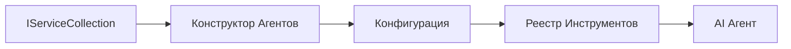

# 🎨 Паттерны агентного проектирования с Azure OpenAI (Responses API) (.NET)

## 📋 Цели обучения

Этот пример демонстрирует корпоративные паттерны проектирования для создания интеллектуальных агентов с использованием Microsoft Agent Framework в .NET с интеграцией Azure OpenAI (Responses API). Вы изучите профессиональные паттерны и архитектурные подходы, которые делают агентов готовыми к промышленному использованию, удобными в сопровождении и масштабируемыми.

### Корпоративные паттерны проектирования

- 🏭 **Фабричный паттерн**: Стандартизированное создание агентов с внедрением зависимостей
- 🔧 **Строитель (Builder)**: Плавная конфигурация и настройка агентов
- 🧵 **Паттерны потокобезопасности**: Управление параллельными разговорами
- 📋 **Репозиторий**: Организованное управление инструментами и возможностями

## 🎯 Архитектурные преимущества для .NET

### Корпоративные возможности

- **Сильная типизация**: Проверка на этапе компиляции и поддержка IntelliSense
- **Внедрение зависимостей**: Встроенная интеграция DI контейнера
- **Управление конфигурацией**: Шаблоны IConfiguration и Options
- **Async/Await**: Полноценная поддержка асинхронного программирования

### Паттерны, готовые к эксплуатации

- **Интеграция логирования**: ILogger и поддержка структурированного логирования
- **Проверки состояния**: Встроенный мониторинг и диагностика
- **Валидация конфигурации**: Сильная типизация с атрибутами данных
- **Обработка ошибок**: Структурированное управление исключениями

## 🔧 Техническая архитектура

### Основные компоненты .NET

- **Microsoft.Extensions.AI**: Унифицированные абстракции AI-сервисов
- **Microsoft.Agents.AI**: Корпоративный фреймворк оркестрации агентов
- **Azure OpenAI (Responses API)**: Высокопроизводительные паттерны клиента API
- **Система конфигурации**: appsettings.json и интеграция с окружением

### Реализация паттернов проектирования



## 🏗️ Демонстрация корпоративных паттернов

### 1. **Порождающие паттерны**

- **Фабрика агентов**: Централизованное создание агентов с единообразной конфигурацией
- **Строитель (Builder)**: Плавный API для сложной настройки агентов
- **Одиночка (Singleton)**: Управление общими ресурсами и конфигурацией
- **Внедрение зависимостей**: Слабосвязанность и тестируемость

### 2. **Поведенческие паттерны**

- **Стратегия (Strategy)**: Взаимозаменяемые стратегии выполнения инструментов
- **Команда (Command)**: Инкапсулированные операции агентов с отменой/повтором
- **Наблюдатель (Observer)**: Событийное управление жизненным циклом агента
- **Шаблонный метод (Template Method)**: Стандартизированные рабочие процессы агента

### 3. **Структурные паттерны**

- **Адаптер (Adapter)**: Слой интеграции с Azure OpenAI (Responses API)
- **Декоратор (Decorator)**: Расширение возможностей агента
- **Фасад (Facade)**: Упрощённые интерфейсы взаимодействия с агентом
- **Прокси (Proxy)**: Ленивое загрузка и кеширование для повышения производительности

## 📚 Принципы проектирования в .NET

### Принципы SOLID

- **Единая ответственность**: Каждый компонент имеет одну четкую задачу
- **Открытость/Закрытость**: Расширяемость без изменения исходного кода
- **Подстановка Барбары Лисков**: Реализация инструментов на основе интерфейсов
- **Сегрегация интерфейсов**: Сфокусированные, когерентные интерфейсы
- **Инверсия зависимостей**: Зависимость от абстракций, а не от конкретики

### Чистая архитектура

- **Доменный слой**: Ядро абстракций агента и инструментов
- **Прикладной слой**: Оркестрация агентов и рабочие процессы
- **Инфраструктурный слой**: Интеграция Azure OpenAI (Responses API) и внешних сервисов
- **Презентационный слой**: Взаимодействие с пользователем и форматирование ответов

## 🔒 Корпоративные аспекты

### Безопасность

- **Управление учетными данными**: Безопасная обработка API-ключей с помощью IConfiguration
- **Валидация ввода**: Сильная типизация и проверка с атрибутами данных
- **Очистка вывода**: Безопасная обработка и фильтрация ответов
- **Аудит логирования**: Полное отслеживание операций

### Производительность

- **Асинхронные паттерны**: Неблокирующие операции ввода-вывода
- **Пулы соединений**: Эффективное управление HTTP-клиентами
- **Кеширование**: Кеширование ответов для повышения производительности
- **Управление ресурсами**: Правильное освобождение и очистка ресурсов

### Масштабируемость

- **Потокобезопасность**: Поддержка параллельного выполнения агентов
- **Пулы ресурсов**: Эффективное использование ресурсов
- **Управление нагрузкой**: Ограничение скорости и обработка обратного давления
- **Мониторинг**: Метрики производительности и проверки состояния

## 🚀 Производственное развертывание

- **Управление конфигурацией**: Настройки, специфичные для среды
- **Стратегия логирования**: Структурированное логирование с идентификаторами корреляции
- **Обработка ошибок**: Глобальная обработка исключений с корректным восстановлением
- **Мониторинг**: Application Insights и счётчики производительности
- **Тестирование**: Модульные, интеграционные и нагрузочные тесты

Готовы создавать интеллектуальных агентов корпоративного уровня с .NET? Давайте спроектируем что-то надёжное! 🏢✨

## 🚀 Начало работы

### Предварительные требования

- [.NET 10 SDK](https://dotnet.microsoft.com/download/dotnet/10.0) или выше
- Подписка [Azure](https://azure.microsoft.com/free/) с ресурсом Azure OpenAI и развертыванием модели
- [Azure CLI](https://learn.microsoft.com/cli/azure/install-azure-cli) — выполните вход с помощью `az login`

### Необходимые переменные окружения

```bash
# zsh/bash
export AZURE_OPENAI_ENDPOINT=https://<your-resource>.openai.azure.com
export AZURE_OPENAI_DEPLOYMENT=gpt-5-mini
# Затем войдите в систему, чтобы AzureCliCredential мог получить токен
az login
```

```powershell
# PowerShell
$env:AZURE_OPENAI_ENDPOINT = "https://<your-resource>.openai.azure.com"
$env:AZURE_OPENAI_DEPLOYMENT = "gpt-5-mini"
# Затем войдите в систему, чтобы AzureCliCredential мог получить токен
az login
```

### Пример кода

Чтобы запустить пример кода,

```bash
# zsh/bash
chmod +x ./03-dotnet-agent-framework.cs
./03-dotnet-agent-framework.cs
```

Или с помощью dotnet CLI:

```bash
dotnet run ./03-dotnet-agent-framework.cs
```

Смотрите полный код в [`03-dotnet-agent-framework.cs`](../../../../03-agentic-design-patterns/code_samples/03-dotnet-agent-framework.cs).

```csharp
#!/usr/bin/dotnet run

#:package Microsoft.Extensions.AI@10.*
#:package Microsoft.Agents.AI.OpenAI@1.*-*
#:package Azure.AI.OpenAI@2.1.0
#:package Azure.Identity@1.13.1

using System.ComponentModel;

using Microsoft.Agents.AI;
using Microsoft.Extensions.AI;

using Azure.AI.OpenAI;
using Azure.Identity;

// Tool Function: Random Destination Generator
// This static method will be available to the agent as a callable tool
// The [Description] attribute helps the AI understand when to use this function
// This demonstrates how to create custom tools for AI agents
[Description("Provides a random vacation destination.")]
static string GetRandomDestination()
{
    // List of popular vacation destinations around the world
    // The agent will randomly select from these options
    var destinations = new List<string>
    {
        "Paris, France",
        "Tokyo, Japan",
        "New York City, USA",
        "Sydney, Australia",
        "Rome, Italy",
        "Barcelona, Spain",
        "Cape Town, South Africa",
        "Rio de Janeiro, Brazil",
        "Bangkok, Thailand",
        "Vancouver, Canada"
    };

    // Generate random index and return selected destination
    // Uses System.Random for simple random selection
    var random = new Random();
    int index = random.Next(destinations.Count);
    return destinations[index];
}

// Azure OpenAI with the Responses API (stable v1 endpoint). Sign in with `az login`.
var azureEndpoint = Environment.GetEnvironmentVariable("AZURE_OPENAI_ENDPOINT")
    ?? throw new InvalidOperationException("AZURE_OPENAI_ENDPOINT is not set.");
var deployment = Environment.GetEnvironmentVariable("AZURE_OPENAI_DEPLOYMENT") ?? "gpt-5-mini";

var azureClient = new AzureOpenAIClient(new Uri(azureEndpoint), new AzureCliCredential());

// Define Agent Identity and Comprehensive Instructions
// Agent name for identification and logging purposes
var AGENT_NAME = "TravelAgent";

// Detailed instructions that define the agent's personality, capabilities, and behavior
// This system prompt shapes how the agent responds and interacts with users
var AGENT_INSTRUCTIONS = """
You are a helpful AI Agent that can help plan vacations for customers.

Important: When users specify a destination, always plan for that location. Only suggest random destinations when the user hasn't specified a preference.

When the conversation begins, introduce yourself with this message:
"Hello! I'm your TravelAgent assistant. I can help plan vacations and suggest interesting destinations for you. Here are some things you can ask me:
1. Plan a day trip to a specific location
2. Suggest a random vacation destination
3. Find destinations with specific features (beaches, mountains, historical sites, etc.)
4. Plan an alternative trip if you don't like my first suggestion

What kind of trip would you like me to help you plan today?"

Always prioritize user preferences. If they mention a specific destination like "Bali" or "Paris," focus your planning on that location rather than suggesting alternatives.
""";

// Create AI Agent with Advanced Travel Planning Capabilities
// Get the Responses client for the deployment and create the AI agent
// Configure agent with name, detailed instructions, and available tools
// This demonstrates the .NET agent creation pattern with full configuration
AIAgent agent = azureClient
    .GetChatClient(deployment)
    .AsAIAgent(
        name: AGENT_NAME,
        instructions: AGENT_INSTRUCTIONS,
        tools: [AIFunctionFactory.Create(GetRandomDestination)]
    );

// Create New Conversation Session for Context Management
// Initialize a new conversation session to maintain context across multiple interactions
// Sessions enable the agent to remember previous exchanges and maintain conversational state
// This is essential for multi-turn conversations and contextual understanding
var session = await agent.CreateSessionAsync();

// Execute Agent: First Travel Planning Request
// Run the agent with an initial request that will likely trigger the random destination tool
// The agent will analyze the request, use the GetRandomDestination tool, and create an itinerary
// Using the session parameter maintains conversation context for subsequent interactions
await foreach (var update in agent.RunStreamingAsync("Plan me a day trip", session))
{
    await Task.Delay(10);
    Console.Write(update);
}

Console.WriteLine();

// Execute Agent: Follow-up Request with Context Awareness
// Demonstrate contextual conversation by referencing the previous response
// The agent remembers the previous destination suggestion and will provide an alternative
// This showcases the power of conversation sessions and contextual understanding in .NET agents
await foreach (var update in agent.RunStreamingAsync("I don't like that destination. Plan me another vacation.", session))
{
    await Task.Delay(10);
    Console.Write(update);
}
```

---

<!-- CO-OP TRANSLATOR DISCLAIMER START -->
**Отказ от ответственности**:
Этот документ был переведен с использованием сервиса машинного перевода [Co-op Translator](https://github.com/Azure/co-op-translator). Несмотря на наши усилия по обеспечению точности, имейте в виду, что автоматический перевод может содержать ошибки или неточности. Оригинальный документ на его исходном языке следует считать авторитетным источником. Для получения критически важной информации рекомендуется обратиться к профессиональному человеческому переводу. Мы не несем ответственности за любые недоразумения или неправильные толкования, возникшие в результате использования этого перевода.
<!-- CO-OP TRANSLATOR DISCLAIMER END -->