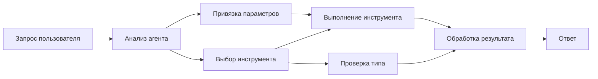

# 🛠️ Продвинутое Использование Инструментов с Azure OpenAI (Responses API) (.NET)

## 📋 Цели Обучения

Этот блокнот демонстрирует паттерны интеграции инструментов корпоративного уровня с использованием Microsoft Agent Framework в .NET с Azure OpenAI (Responses API). Вы научитесь создавать сложных агентов с несколькими специализированными инструментами, используя строгую типизацию C# и возможности .NET для корпоративных решений.

### Продвинутые Возможности Инструментов, Которые Вы Освоите

- 🔧 **Архитектура с Множеством Инструментов**: Создание агентов с несколькими специализированными возможностями
- 🎯 **Безопасное Выполнение Инструментов с Типизацией**: Использование проверки времени компиляции C#
- 📊 **Паттерны Инструментов Корпоративного Уровня**: Проектирование инструментов для промышленного использования и обработка ошибок
- 🔗 **Композиция Инструментов**: Комбинирование инструментов для сложных бизнес-процессов

## 🎯 Преимущества Архитектуры Инструментов .NET

### Корпоративные Особенности Инструментов

- **Проверка Времени Компиляции**: Строгая типизация обеспечивает корректность параметров инструмента
- **Внедрение Зависимостей**: Интеграция с IoC контейнером для управления инструментами
- **Асинхронные Паттерны Async/Await**: Неблокирующее выполнение с правильным управлением ресурсами
- **Структурированное Логирование**: Встроенная интеграция логирования для мониторинга выполнения инструментов

### Паттерны для Промышленного Использования

- **Обработка Исключений**: Всеобъемлющее управление ошибками с типизированными исключениями
- **Управление Ресурсами**: Корректные паттерны освобождения ресурсов и управления памятью
- **Мониторинг Производительности**: Встроенные метрики и счётчики производительности
- **Управление Конфигурацией**: Безопасная типизация конфигурации с проверкой корректности

## 🔧 Техническая Архитектура

### Основные Компоненты Инструментов .NET

- **Microsoft.Extensions.AI**: Унифицированный уровень абстракции инструментов
- **Microsoft.Agents.AI**: Операционная система инструментов корпоративного уровня
- **Azure OpenAI (Responses API)**: Высокопроизводительный клиент API с пулом соединений

### Пайплайн Выполнения Инструментов



## 🛠️ Категории и Паттерны Инструментов

### 1. **Инструменты Обработки Данных**

- **Проверка Входных Данных**: Строгая типизация с использованием аннотаций данных
- **Операции Трансформации**: Безопасное по типам преобразование и форматирование данных
- **Бизнес-Логика**: Инструменты доменно-специфичных вычислений и анализа
- **Форматирование Выходных Данных**: Генерация структурированных ответов

### 2. **Инструменты Интеграции**

- **Коннекторы API**: Интеграция RESTful сервисов с помощью HttpClient
- **Инструменты для Баз Данных**: Интеграция Entity Framework для доступа к данным
- **Операции с Файлами**: Безопасные операции с файловой системой с проверкой корректности
- **Внешние Сервисы**: Паттерны интеграции сторонних сервисов

### 3. **Утилитарные Инструменты**

- **Обработка Текста**: Утилиты для манипуляции и форматирования строк
- **Операции с Датой/Временем**: Культурно-зависимые вычисления дат и времени
- **Математические Инструменты**: Точные вычисления и статистические операции
- **Инструменты Валидации**: Проверка бизнес-правил и верификация данных

Готовы строить корпоративных агентов с мощными, безопасными по типам возможностями инструментов в .NET? Давайте создадим профессиональные решения! 🏢⚡

## 🚀 Начало Работы

### Требования

- [.NET 10 SDK](https://dotnet.microsoft.com/download/dotnet/10.0) или выше
- Подписка [Azure](https://azure.microsoft.com/free/) с ресурсом Azure OpenAI и развертыванием модели
- Установленная [Azure CLI](https://learn.microsoft.com/cli/azure/install-azure-cli) — выполните вход через `az login`

### Необходимые Переменные Окружения

```bash
# zsh/bash
export AZURE_OPENAI_ENDPOINT=https://<your-resource>.openai.azure.com
export AZURE_OPENAI_DEPLOYMENT=gpt-5-mini
# Затем выполните вход, чтобы AzureCliCredential мог получить токен
az login
```

```powershell
# PowerShell
$env:AZURE_OPENAI_ENDPOINT = "https://<your-resource>.openai.azure.com"
$env:AZURE_OPENAI_DEPLOYMENT = "gpt-5-mini"
# Затем войдите в систему, чтобы AzureCliCredential мог получить токен
az login
```

### Пример Кода

Чтобы запустить пример кода,

```bash
# zsh/bash
chmod +x ./04-dotnet-agent-framework.cs
./04-dotnet-agent-framework.cs
```

Или используя dotnet CLI:

```bash
dotnet run ./04-dotnet-agent-framework.cs
```

Полный код смотрите в файле [`04-dotnet-agent-framework.cs`](../../../../04-tool-use/code_samples/04-dotnet-agent-framework.cs).

```csharp
#!/usr/bin/dotnet run

#:package Microsoft.Extensions.AI@10.*
#:package Microsoft.Agents.AI.OpenAI@1.*-*
#:package Azure.AI.OpenAI@2.1.0
#:package Azure.Identity@1.13.1

using System.ComponentModel;

using Microsoft.Agents.AI;
using Microsoft.Extensions.AI;

using Azure.AI.OpenAI;
using Azure.Identity;

// Tool Function: Random Destination Generator
// This static method will be available to the agent as a callable tool
// The [Description] attribute helps the AI understand when to use this function
// This demonstrates how to create custom tools for AI agents
[Description("Provides a random vacation destination.")]
static string GetRandomDestination()
{
    // List of popular vacation destinations around the world
    // The agent will randomly select from these options
    var destinations = new List<string>
    {
        "Paris, France",
        "Tokyo, Japan",
        "New York City, USA",
        "Sydney, Australia",
        "Rome, Italy",
        "Barcelona, Spain",
        "Cape Town, South Africa",
        "Rio de Janeiro, Brazil",
        "Bangkok, Thailand",
        "Vancouver, Canada"
    };

    // Generate random index and return selected destination
    // Uses System.Random for simple random selection
    var random = new Random();
    int index = random.Next(destinations.Count);
    return destinations[index];
}

// Azure OpenAI with the Responses API (stable v1 endpoint). Sign in with `az login`.
var azureEndpoint = Environment.GetEnvironmentVariable("AZURE_OPENAI_ENDPOINT")
    ?? throw new InvalidOperationException("AZURE_OPENAI_ENDPOINT is not set.");
var deployment = Environment.GetEnvironmentVariable("AZURE_OPENAI_DEPLOYMENT") ?? "gpt-5-mini";

var azureClient = new AzureOpenAIClient(new Uri(azureEndpoint), new AzureCliCredential());

// Define Agent Identity and Comprehensive Instructions
// Agent name for identification and logging purposes
var AGENT_NAME = "TravelAgent";

// Detailed instructions that define the agent's personality, capabilities, and behavior
// This system prompt shapes how the agent responds and interacts with users
var AGENT_INSTRUCTIONS = """
You are a helpful AI Agent that can help plan vacations for customers.

Important: When users specify a destination, always plan for that location. Only suggest random destinations when the user hasn't specified a preference.

When the conversation begins, introduce yourself with this message:
"Hello! I'm your TravelAgent assistant. I can help plan vacations and suggest interesting destinations for you. Here are some things you can ask me:
1. Plan a day trip to a specific location
2. Suggest a random vacation destination
3. Find destinations with specific features (beaches, mountains, historical sites, etc.)
4. Plan an alternative trip if you don't like my first suggestion

What kind of trip would you like me to help you plan today?"

Always prioritize user preferences. If they mention a specific destination like "Bali" or "Paris," focus your planning on that location rather than suggesting alternatives.
""";

// Create AI Agent with Advanced Travel Planning Capabilities
// Get the Responses client for the deployment and create the AI agent
// Configure agent with name, detailed instructions, and available tools
// This demonstrates the .NET agent creation pattern with full configuration
AIAgent agent = azureClient
    .GetChatClient(deployment)
    .AsAIAgent(
        name: AGENT_NAME,
        instructions: AGENT_INSTRUCTIONS,
        tools: [AIFunctionFactory.Create(GetRandomDestination)]
    );

// Create New Conversation Session for Context Management
// Initialize a new conversation session to maintain context across multiple interactions
// Sessions enable the agent to remember previous exchanges and maintain conversational state
// This is essential for multi-turn conversations and contextual understanding
await using var session = await agent.CreateSessionAsync();

// Execute Agent: First Travel Planning Request
// Run the agent with an initial request that will likely trigger the random destination tool
// The agent will analyze the request, use the GetRandomDestination tool, and create an itinerary
// Using the session parameter maintains conversation context for subsequent interactions
await foreach (var update in agent.RunStreamingAsync("Plan me a day trip", session))
{
    await Task.Delay(10);
    Console.Write(update);
}

Console.WriteLine();

// Execute Agent: Follow-up Request with Context Awareness
// Demonstrate contextual conversation by referencing the previous response
// The agent remembers the previous destination suggestion and will provide an alternative
// This showcases the power of conversation sessions and contextual understanding in .NET agents
await foreach (var update in agent.RunStreamingAsync("I don't like that destination. Plan me another vacation.", session))
{
    await Task.Delay(10);
    Console.Write(update);
}
```

---

<!-- CO-OP TRANSLATOR DISCLAIMER START -->
**Отказ от ответственности**:
Этот документ был переведен с использованием сервиса машинного перевода [Co-op Translator](https://github.com/Azure/co-op-translator). Несмотря на наши усилия по обеспечению точности, имейте в виду, что автоматический перевод может содержать ошибки или неточности. Оригинальный документ на его исходном языке следует считать авторитетным источником. Для получения критически важной информации рекомендуется обратиться к профессиональному человеческому переводу. Мы не несем ответственности за любые недоразумения или неправильные толкования, возникшие в результате использования этого перевода.
<!-- CO-OP TRANSLATOR DISCLAIMER END -->