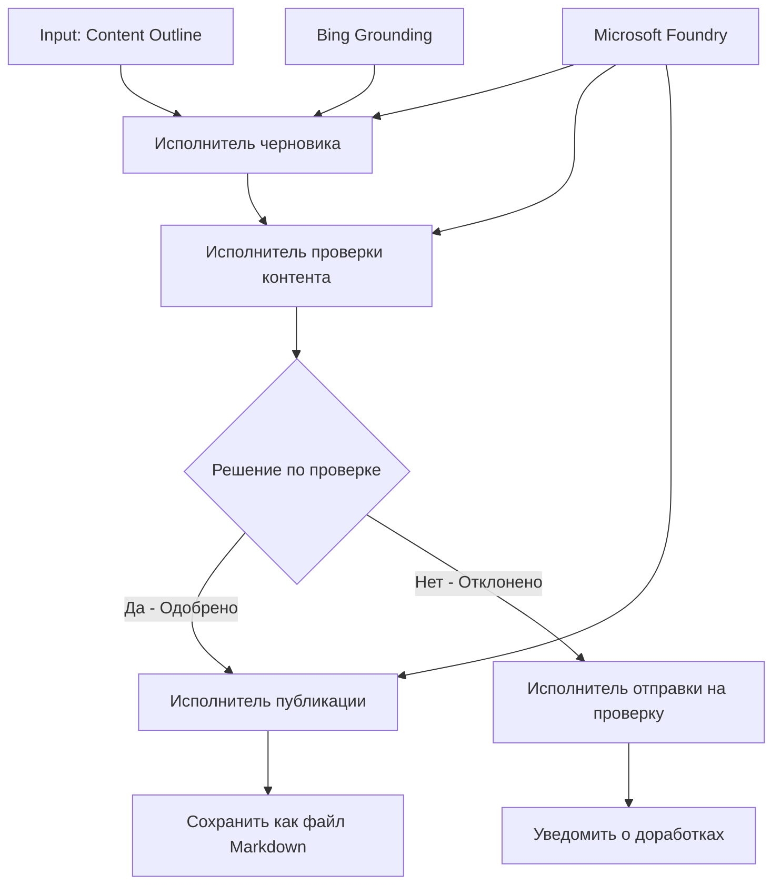

# 🔀 Условные рабочие процессы агентов с Microsoft Foundry (.NET)

## 📋 Учебник по интеллектуальному рабочему процессу на основе решений

В этой тетради демонстрируются **условные шаблоны рабочих процессов** с использованием Microsoft Foundry и Microsoft Agent Framework для .NET. Вы узнаете, как создавать сложные, основанные на решениях рабочие процессы, которые интеллектуально направляют обработку на основе анализа ИИ, бизнес-правил и динамических условий для автоматизации корпоративного уровня.

## 🎯 Цели обучения

### 🧠 **Архитектура интеллектуальных решений**
- **Реализация условной логики**: Создание сложных деревьев решений с несколькими точками ветвления
- **Маршрутизация на основе ИИ**: Использование моделей Microsoft Foundry для принятия интеллектуальных решений о маршрутизации
- **Динамическая адаптация рабочих процессов**: Изменение поведения рабочего процесса на основе анализа и условий во время выполнения
- **Интеграция корпоративных правил**: Внедрение бизнес-логики и требований соответствия в рабочие процессы

### 🔀 **Расширенные условные шаблоны**
- **Многокритериальное принятие решений**: Оценка нескольких факторов для решений о маршрутизации
- **Обработка с учетом контекста**: Принятие решений на основе накопленного контекста и истории рабочего процесса
- **Адаптивное изменение рабочих процессов**: Динамическая корректировка путей обработки на основе условий в реальном времени
- **Интеграция с движком правил**: Внедрение сложных бизнес-правил внутри рабочих процессов

### 🏢 **Корпоративные условные приложения**
- **Классификация и маршрутизация документов**: Автоматическая классификация и маршрутизация документов в соответствующие рабочие процессы
- **Триаж обслуживания клиентов**: Интеллектуальная маршрутизация запросов клиентов специализированным командам
- **Обработка соответствия и рисков**: Применение различных процессов проверки и рецензирования на основе оценки рисков
- **Рабочие процессы контроля качества**: Маршрутизация контента через соответствующие процессы проверки на основе метрик качества

## ⚙️ Требования и настройка

### 📦 **Необходимые пакеты NuGet**

Расширенные пакеты для обработки условных рабочих процессов:

```xml
<!-- Core AI Framework -->
<PackageReference Include="Microsoft.Extensions.AI" Version="9.9.0" />

<!-- Azure AI Agents with Persistent State -->
<PackageReference Include="Azure.AI.Agents.Persistent" Version="1.2.0-beta.5" />

<!-- Azure Identity and Utilities -->
<PackageReference Include="Azure.Identity" Version="1.15.0" />
<PackageReference Include="System.Linq.Async" Version="6.0.3" />
<PackageReference Include="DotNetEnv" Version="3.1.1" />

<!-- Local Workflow Framework References -->
<!-- Microsoft.Agents.Workflows.dll - Advanced workflow orchestration -->
<!-- Microsoft.Agents.AI.AzureAI.dll - Microsoft Foundry integration -->
<!-- Microsoft.Agents.AI.dll - Core agent abstractions -->
```

### 🔑 **Конфигурация Microsoft Foundry**

**Необходимые ресурсы Azure:**
- Рабочее пространство Microsoft Foundry с моделями условной обработки
- Подписка Azure с соответствующими квотами вычислений и разрешениями
- Развернутые модели ИИ для принятия решений и анализа контента
- (Опционально) подключение Bing Search API для возможностей закрепления данных

**Конфигурация окружения (.env файл):**
```env
# Microsoft Foundry Configuration
AZURE_AI_PROJECT_ENDPOINT=https://your-project.cognitiveservices.azure.com/
BING_CONNECTION_ID=your-bing-connection-id
```

**Настройка аутентификации:**
```csharp
// Azure CLI or Managed Identity authentication
using Azure.Identity;
var credential = new AzureCliCredential();

// Load environment configuration
DotNetEnv.Env.Load("../../../.env");
```

### 🏗️ **Архитектура условного рабочего процесса**



**Основные компоненты:**
- **Draft Executor**: AI-агент, который создает первоначальные черновики из планов
- **Content Review Executor**: AI-агент, оценивающий качество и соответствие черновиков
- **Условная маршрутизация**: Логика принятия решений, направляющая на основе результатов проверки
- **Пути публикации/проверки**: Отдельные пути обработки для одобренного и отклоненного контента
- **Управление состоянием**: Поддержка контекста контента и проверки на протяжении рабочего процесса

## 🎨 **Шаблоны проектирования условных рабочих процессов**

### 📋 **Производство контента с качественными воротами**
```
Outline → Draft Creation → Quality Review → {Approve: Publish | Reject: Revise}
```

### 🎯 **Обработка документов на основе оценки рисков**
```
Document → Risk Assessment → {Low: Standard | High: Enhanced Review}
```

### 🔍 **Интеллектуальная маршрутизация обслуживания клиентов**
```
Customer Query → Analysis → {Simple: FAQ Bot | Complex: Human Agent}
```

### 💼 **Рабочие процессы на основе соответствия**
```
Content → Compliance Check → {Pass: Publish | Fail: Legal Review}
```

## 🏢 **Корпоративные преимущества условных рабочих процессов**

### 🎯 **Интеллектуальная автоматизация**
- **Умное принятие решений**: Маршрутизация на основе ИИ с учетом анализа контента и контекста
- **Адаптивная обработка**: Рабочие процессы, автоматически подстраивающиеся под меняющиеся условия
- **Применение бизнес-правил**: Автоматическое применение сложной бизнес-логики и политик
- **Маршрутизация с учетом контекста**: Решения на основе полной истории рабочего процесса и накопленного контекста

### 📈 **Оперативное совершенство**
- **Оптимальное распределение ресурсов**: Направление работы к самым подходящим специалистам и процессам
- **Снижение ручного вмешательства**: Автоматическое принятие решений минимизирует необходимость человеческой маршрутизации
- **Быстрое решение задач**: Прямая маршрутизация к нужным экспертам и возможностям обработки
- **Последовательное применение**: Единообразное применение бизнес-правил и критериев решений

### 🛡️ **Управление рисками и соблюдение требований**
- **Автоматическая оценка рисков**: Оценка уровней риска контента и ситуации с поддержкой ИИ
- **Применение требований соответствия**: Автоматическая маршрутизация через необходимые нормативные процессы
- **Применение протоколов безопасности**: Усиленные меры безопасности на основе оценки рисков
- **Ведение аудита**: Полная документация решений о маршрутизации и их обоснования

### 📊 **Аналитика и непрерывное улучшение**
- **Аналитика решений**: Отслеживание эффективности и точности решений о маршрутизации
- **Распознавание шаблонов**: Выявление трендов и шаблонов в решениях о маршрутизации с течением времени
- **Оптимизация производительности**: Непрерывное совершенствование критериев решений и эффективности маршрутизации
- **Бизнес-аналитика**: Получение инсайтов о характеристиках контента и требованиях к обработке

### 🔧 **Техническое совершенство**
- **Управление сохранением состояния**: Поддержание сложного состояния в ходе выполнения рабочего процесса
- **Масштабируемая архитектура**: Обработка требований к объемной условной обработке
- **Возможности интеграции**: Бесшовная интеграция с существующими бизнес-системами и процессами
- **Мониторинг и наблюдаемость**: Комплексное отслеживание производительности рабочего процесса и решений

Давайте построим интеллектуальные, основанные на решениях корпоративные рабочие процессы с .NET! 🚀

## 💻 Запуск кода

Полная реализация доступна в файле `04.dotnet-agent-framework-workflow-aifoundry-condition.cs`. Она демонстрирует **рабочий процесс по производству контента с качественными воротами**:

### 🏗️ **Архитектура рабочего процесса**

```
Content Outline → Draft Creation → Quality Review → Conditional Routing:
                                                      ├─ Approved (>200 words) → Publish
                                                      └─ Rejected (<200 words) → Review Notification
```

**Агенты в рабочем процессе:**
1. **Evangelist Agent**: Создает учебные черновики из планов с использованием закрепления Bing
2. **Content Reviewer Agent**: Оценивает качество черновиков (количество слов, полнота)
3. **Publisher Agent**: Сохраняет одобренный контент в виде файлов Markdown с отметками времени

**Пользовательские исполнители:**
1. **DraftExecutor**: Организует создание черновиков
2. **ContentReviewExecutor**: Выполняет оценку качества
3. **PublishExecutor**: Обрабатывает публикацию одобренного контента
4. **SendReviewExecutor**: Управляет уведомлениями об отклоненном контенте

### 🚀 Запуск примера

**Требования:**
- Рабочее пространство Microsoft Foundry настроено
- Аутентификация в Azure CLI (`az login`)
- (Опционально) подключение Bing Search для закрепления данных

```bash
# Сделайте скрипт исполняемым (Unix/Linux/macOS)
chmod +x 04.dotnet-agent-framework-workflow-aifoundry-condition.cs

# Запустите условный рабочий процесс
./04.dotnet-agent-framework-workflow-aifoundry-condition.cs
```

Или в Windows:
```powershell
dotnet run 04.dotnet-agent-framework-workflow-aifoundry-condition.cs
```

### 📝 Ожидаемый вывод

Рабочий процесс выполнит:
1. **Создание агентов**: Инициализация трех специализированных агентов Microsoft Foundry
2. **Генерация черновика**: Агент Evangelist создаёт учебный черновик из плана
3. **Проверка контента**: Агент Content Reviewer оценивает качество черновика
4. **Условная маршрутизация**:
   - **Если одобрен (>200 слов)**: Исполнитель публикации сохраняет в файл Markdown
   - **Если отклонен (<200 слов)**: Отправляется уведомление о проверке
5. **Отображение результатов**: Показ итогового результата рабочего процесса

### 🔧 Варианты настройки

**Изменение критериев проверки:**
```csharp
const string ContentReviewerInstructions = @"
You are a content reviewer...
1. Check if content is more than 500 words (instead of 200)
2. Verify technical accuracy
3. Ensure proper formatting
...";
```

**Добавление дополнительных условных путей:**
```csharp
var workflow = new WorkflowBuilder(draftExecutor)
    .AddEdge(draftExecutor, contentReviewerExecutor)
    .AddEdge(contentReviewerExecutor, publishExecutor, condition: GetCondition("Excellent"))
    .AddEdge(contentReviewerExecutor, editExecutor, condition: GetCondition("Good"))
    .AddEdge(contentReviewerExecutor, sendReviewerExecutor, condition: GetCondition("Poor"))
    .Build();
```

**Изменение требований к контенту:**
```csharp
string OUTLINE_Content = @"
# Your Custom Topic
## Section 1
https://your-reference-url
## Section 2
...
";
```

### 🎯 Применение в реальных условиях

Этот шаблон условного рабочего процесса идеально подходит для:
- **Систем управления контентом**: Автоматизированные редакционные рабочие процессы с качественными воротами
- **Обработки документов**: Маршрутизация документов на основе классификации и соответствия требованиям
- **Поддержки клиентов**: Интеллектуальная маршрутизация запросов на основе сложности и срочности
- **Юридической проверки**: Маршрутизация контрактов на основе оценки риска и стоимости
- **HR-процессов**: Маршрутизация заявок через соответствующие процедуры отбора

### 🔍 Понимание условной логики

**Функция условия:**
```csharp
public Func<object?, bool> GetCondition(string expectedResult) =>
    reviewResult => reviewResult is ReviewResult review && review.Result == expectedResult;
```

Эта функция создает предикат, который:
1. Проверяет, что результат имеет тип `ReviewResult`
2. Сравнивает свойство `Result` с ожидаемым значением
3. Возвращает true/false для определения маршрутизации

**Ребра рабочего процесса с условиями:**
```csharp
.AddEdge(contentReviewerExecutor, publishExecutor, condition: GetCondition("Yes"))
.AddEdge(contentReviewerExecutor, sendReviewerExecutor, condition: GetCondition("No"))
```

### 📊 Расширенные возможности

**Валидация JSON Schema:**
Рабочий процесс использует JSON-схемы для обеспечения структурированных ответов:

```csharp
// Define response structure
public class ReviewResult
{
    [JsonPropertyName("review_result")]
    public string Result { get; set; } = string.Empty;
    
    [JsonPropertyName("reason")]
    public string Reason { get; set; } = string.Empty;
    
    [JsonPropertyName("draft_content")]
    public string DraftContent { get; set; } = string.Empty;
}

// Apply to agent
ResponseFormat = ChatResponseFormat.ForJsonSchema(
    AIJsonUtilities.CreateJsonSchema(typeof(ReviewResult)), 
    "ReviewResult", 
    "Review Result From DraftContent"
)
```

**Интеграция закрепления Bing:**
Агент Evangelist использует закрепление Bing для доступа к актуальной информации:

```csharp
var bingGroundingConfig = new BingGroundingSearchConfiguration(bing_conn_id);
BingGroundingToolDefinition bingGroundingTool = new(
    new BingGroundingSearchToolParameters([bingGroundingConfig])
);
```

Это позволяет агенту переходить по URL из плана и извлекать свежую информацию.

### 🛡️ Обработка ошибок

Рабочий процесс включает надежную обработку ошибок для отклоненного контента:
- Ошибки проверки вызывают альтернативный путь
- Уведомления предоставляют четкие причины отклонения
- Контент сохраняется для доработки

### 🔄 Расширение рабочего процесса

**Добавление цикла доработки:**
Создайте цикл обратной связи, который автоматически перерабатывает контент:

```csharp
.AddEdge(contentReviewerExecutor, publishExecutor, condition: GetCondition("Yes"))
.AddEdge(contentReviewerExecutor, draftExecutor, condition: GetCondition("No")) // Loop back
```

**Реализация многоуровневой проверки:**
Добавьте несколько этапов проверки с разными критериями:

```csharp
.AddEdge(draftExecutor, technicalReviewer)
.AddEdge(technicalReviewer, editorialReviewer, condition: GetCondition("TechPass"))
.AddEdge(editorialReviewer, publishExecutor, condition: GetCondition("EditPass"))
```

Этот шаблон условного рабочего процесса обеспечивает основу для создания сложных, интеллектуальных корпоративных систем автоматизации! 🚀

---

<!-- CO-OP TRANSLATOR DISCLAIMER START -->
**Отказ от ответственности**:
Этот документ был переведен с использованием сервиса машинного перевода [Co-op Translator](https://github.com/Azure/co-op-translator). Несмотря на наши усилия по обеспечению точности, имейте в виду, что автоматический перевод может содержать ошибки или неточности. Оригинальный документ на его исходном языке следует считать авторитетным источником. Для получения критически важной информации рекомендуется обратиться к профессиональному человеческому переводу. Мы не несем ответственности за любые недоразумения или неправильные толкования, возникшие в результате использования этого перевода.
<!-- CO-OP TRANSLATOR DISCLAIMER END -->