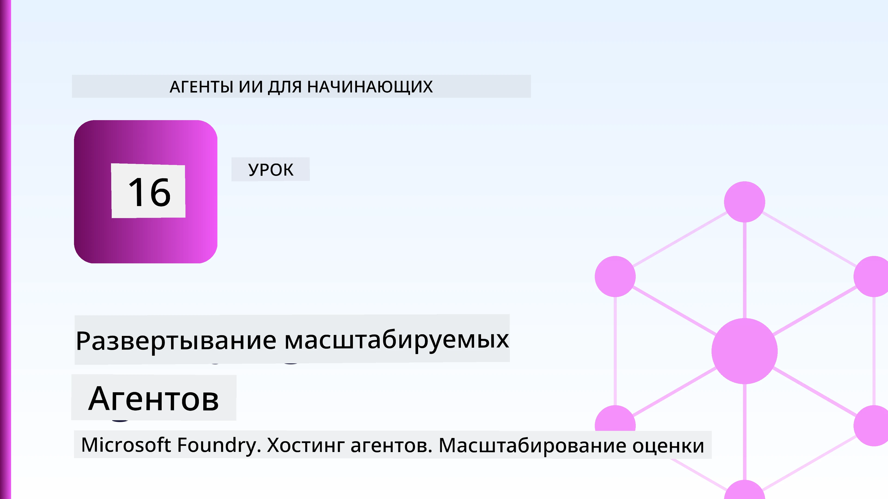
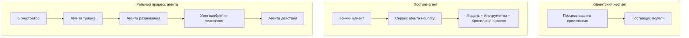
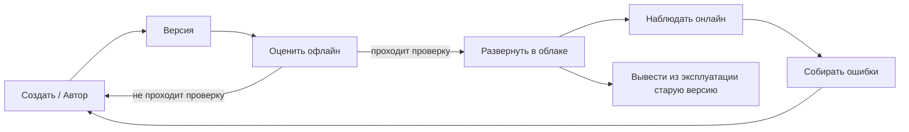
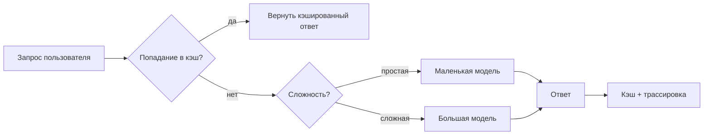
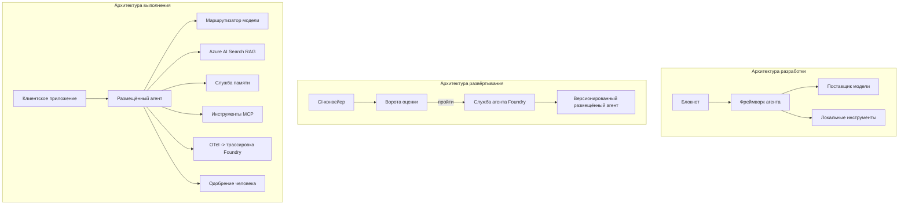

# Развёртывание масштабируемых агентов с Microsoft Foundry



До этого момента в курсе вы создавали агентов, работающих на вашем ноутбуке, внутри блокнота, управляемых `az login` и несколькими переменными окружения. Это именно правильный способ обучения. Но такой способ не подходит для работы агента, от которого зависят тысячи клиентов в 3 часа ночи.

Этот урок посвящён разрыву между "работает на моей машине" и "работает стабильно и экономично в продакшене". Мы закрываем этот разрыв с помощью **Microsoft Foundry** и **Microsoft Foundry Agent Service**, создавая настоящего агента поддержки клиентов с инструментами, поиском, памятью, оценкой и мониторингом.

## Введение

В этом уроке рассматриваются:

- Разница между **прототипом агента** и **развёрнутым агентом**, и почему переход связан в основном со всем, что *окружает* модель.
- **Паттерны развёртывания** агентов: размещённые у клиента, размещённые в сервисе (Hosted Agents) и оркестрируемые рабочими процессами.
- **Жизненный цикл агента** в Microsoft Foundry — создание, версия, развёртывание, оценка, наблюдение, вывод из эксплуатации.
- **Стратегии масштабирования**: маршрутизация моделей, кэширование, параллелизм и безсостоянийная архитектура.
- **Наблюдаемость** с OpenTelemetry и трассировкой Foundry.
- **Оптимизация затрат** через выбор модели, маршрутизацию и проверки оценки.
- **Корпоративные аспекты**: управление, одобрение человеком и безопасный запуск MCP серверов в продакшене.

## Цели обучения

После прохождения урока вы узнаете, как:

- Выбрать правильный паттерн развёртывания для конкретной нагрузки агента.
- Развернуть агента в Microsoft Foundry Agent Service так, чтобы он был версионируемым, управляемым и наблюдаемым.
- Инструментировать агента для трассировки и подключить конвейер оценки, который запускается перед каждым релизом.
- Применять маршрутизацию моделей и кэширование для контроля задержек и затрат в масштабе.
- Добавлять этап одобрения человеком для рискованных действий и интегрировать MCP сервер безопасно для продакшена.

## Требования

Для прохождения урока предполагается, что вы завершили предыдущие уроки и уверенно работаете с:

- Созданием агентов с помощью [Microsoft Agent Framework](../14-microsoft-agent-framework/README.md) (Урок 14).
- [Использованием инструментов](../04-tool-use/README.md) (Урок 4) и [Agentic RAG](../05-agentic-rag/README.md) (Урок 5).
- [Память агента](../13-agent-memory/README.md) (Урок 13) и [Agentic Protocols / MCP](../11-agentic-protocols/README.md) (Урок 11).
- [Наблюдаемостью и оценкой](../10-ai-agents-production/README.md) (Урок 10) — этот урок строится непосредственно на нём.

Также вам понадобится:

- **Подписка Azure** и **проект Microsoft Foundry** с как минимум одной развёрнутой моделью чата.
- Аутентификация в **Azure CLI** (`az login`).
- Python 3.12+ и пакеты из файла репозитория [`requirements.txt`](../../../requirements.txt).

## От прототипа к продакшену: что действительно меняется

Прототип агента и продакшен агент разделяют один и тот же основной цикл — рассуждение, вызов инструментов, ответ. Меняется всё, что оборачивает этот цикл. Модель — это примерно 20% продакшен-агента; остальные 80% — это его операционный каркас.

| Аспект | Прототип | Продакшен |
| --- | --- | --- |
| **Хостинг** | Работает в вашем блокноте | Работает как сервис с версионированием и развёртыванием |
| **Идентичность** | Ваш токен `az login` | Управляемая идентичность с ограниченным RBAC |
| **Состояние** | В памяти, теряется при перезапуске | Внешнее хранение (thread store, memory service) |
| **Ошибки** | Вы видите трассировку стека | Повторы, обходы, dead-letter, оповещения |
| **Стоимость** | "Пара центов" | Отслеживается на запрос, маршрутизируется, кэшируется, планируется бюджет |
| **Качество** | Вы оцениваете визуально | Автоматическая оценка перед каждым релизом |
| **Доверие** | Вы одобряете каждое действие | Политика + человек в цикле для рискованных действий |

Запомните эту таблицу. Каждый следующий раздел связан с одной из этих строк.

## Паттерны развёртывания агентов

Существует три паттерна, которые вы часто будете комбинировать.

### 1. Агенты, размещённые у клиента

Объект агента живёт внутри *вашего* процесса приложения. Ваш код напрямую вызывает провайдера модели; цикл рассуждений работает в вашем сервисе. Это то, что было во всех предыдущих уроках.

- **Используйте, если** вам нужен полный контроль над циклом, кастомный middleware или встроенный агент в существующий бэкенд.
- **Компромисс**: масштабирование, состояние и устойчивость — всё на вашей ответственности.

### 2. Размещённые агенты (Foundry Agent Service)

Агент *регистрируется как ресурс* в Microsoft Foundry. Foundry запускает цикл рассуждений, хранит потоки, обеспечивает безопасность контента и RBAC, делает агента видимым в портале Foundry. Ваше приложение становится тонким клиентом, создающим потоки и читающим ответы.

- **Используйте, если** нужна надёжность, встроенная наблюдаемость, управление и меньшая операционная нагрузка.
- **Компромисс**: меньше низкоуровневого контроля в обмен на управляемое исполнение.

### 3. Рабочие процессы агентов

Несколько агентов (и инструментов) объединяются в граф с явным потоком управления — последовательными шагами, ветвлениями, узлами одобрения человеком и надёжными контрольными точками, которые могут ставить на паузу и возобновлять работу. Это возможность **Workflows** Microsoft Agent Framework, применённая в масштабе развёртывания.

- **Используйте, если** одна задача охватывает несколько специализированных агентов или требует шага с одобрением посередине.
- **Компромисс**: больше движущихся частей; требуется наблюдаемость на уровне оркестрации.



## Жизненный цикл агента в Microsoft Foundry

Развёртывание агента — это не однократная операция `push`. Это цикл, который очень похож на цикл выпуска программного обеспечения, потому что именно так оно и есть.



Ключевая идея, перенесённая из [Урока 10](../10-ai-agents-production/README.md): **оценка офлайн — это ворота, а не после мысли**. Новая версия агента не выпускается, пока не пройдёт ваши пороги оценки. Онлайн-наблюдаемость потом подаёт реальные сбои обратно в ваш офлайн-набор тестов. Вот весь цикл.

## Стратегии масштабирования

Масштабирование агента отличается от масштабирования безсостоятийного веб API, потому что каждый запрос может запустить множество дорогостоящих вызовов моделей и инструментов. Четыре техники несут основную нагрузку.

**Обработка безсостоятийных запросов.** Не храните состояние пользователя в памяти процесса. Сохраняйте потоки разговора в Foundry thread store или memory service, чтобы любой экземпляр мог обработать любой запрос. Это позволяет масштабироваться горизонтально — добавлять экземпляры без привязки сессий.

**Маршрутизация моделей.** Не каждый запрос нуждается в самой мощной (и самой дорогой) модели. Маршрутизируйте простые запросы — классификация намерений, короткие фактические ответы — на небольшую быструю модель, а большую модель оставляйте для настоящих рассуждений. Foundry **Model Router** может сделать это за вас, или вы можете реализовать простой классификатор самостоятельно. В лабораторной работе вы создадите такую версию.

**Кэширование ответов.** Многие запросы поддержки — почти дубликаты ("как сбросить пароль?"). Кэшируйте ответы на частые вопросы и отдавайте их без обращения к модели. Даже умеренный процент попаданий в кэш значительно снижает затраты и задержки.

**Параллелизм и обратное давление.** У провайдеров моделей есть ограничения по количеству вызовов. Ограничьте параллелизм, используйте повторные попытки с экспоненциальным бэкоффом и корректно обрабатывайте ошибки (ответ "мы занимаемся этим" лучше ошибки 500).



## Наблюдаемость в продакшене

Невозможно управлять тем, чего не видно. Как обсуждалось в уроке 10, Microsoft Agent Framework нативно испускает трассы **OpenTelemetry** — каждый вызов модели, вызов инструмента и шаг оркестрации становится спаном. В продакшене вы экспортируете эти спаны в Microsoft Foundry (или в любой OTel-совместимый бекенд), чтобы:

- Отслеживать жалобу клиента от начала до конца, проходя через все вызовы моделей и инструментов.
- Следить за p50/p95 задержками и стоимостью на запрос с течением времени.
- Получать оповещения о всплесках ошибок и аномалиях в стоимости ранее пользователей (или финансовую команду).

```python
from agent_framework.observability import get_tracer

tracer = get_tracer()

with tracer.start_as_current_span("support_request") as span:
    span.set_attribute("customer.tier", "enterprise")
    span.set_attribute("routed.model", "gpt-5-nano")
    # выполнение агента автоматически отслеживается внутри этого интервала
```

Атрибуты как `customer.tier` и `routed.model` превращают поток трасс в вопросы с ответами ("часто ли корпоративных клиентов маршрутизируют на малую модель?").

## Оптимизация затрат

Стоимость продакшен-агентов в основном определяется токенами. Три рычага, в порядке влияния:

1. **Подберите модель по размеру.** Малая модель, проходящая вашу оценку, почти всегда дешевле большой, проходящей тоже. Используйте оценку, чтобы *доказать*, что малая модель достаточно хороша, а не просто брать самую крупную из осторожности.
2. **Маршрутизируйте по сложности.** Как выше — платите за большую модель только за запросы, требующие её способности к рассуждению.
3. **Активно кэшируйте.** Самый дешёвый вызов модели — это тот, который вы не делаете.

Ворота оценки и контроль затрат — это один и тот же навык с двух сторон: оценка даёт *минимально приемлемое качество*, маршрутизация и кэширование помогают держать затраты рядом с этим *минимумом*.

## Корпоративные аспекты развёртывания

**Управление.** Hosted Agents наследуют RBAC, безопасность контента и аудит Foundry. Дайте каждому агенту управляемую идентичность с минимальными правами — только чтение базы знаний, ограниченный доступ к API тикетов, ничего лишнего.

**Человек в цикле.** Некоторые операции слишком важны, чтобы автоматизировать напрямую — возврат денег, удаление аккаунта, эскалация в юридический отдел. Microsoft Agent Framework поддерживает инструменты с требованием одобрения: агент предлагает действие, выполнение ставится на паузу, человек одобряет или отклоняет, и рабочий процесс продолжается. Вы видели примитив в [Уроке 6](../06-building-trustworthy-agents/README.md); здесь вы внедряете его.

**MCP в продакшене.** [MCP](../11-agentic-protocols/README.md) позволяет агенту использовать внешние инструменты через стандартный интерфейс. В продакшене рассматривайте каждый MCP сервер как ненадёжную границу: фиксируйте версию сервера, запускайте с ограниченной идентичностью, проверяйте его выводы и никогда не передавайте ему секреты. MCP сервер — это зависимость, а зависимости патчатся, проверяются и ограничиваются по количеству запросов.



Эти три диаграммы — разработка, развёртывание, выполнение — показывают одного и того же агента на трёх этапах его жизни. Следующая лабораторная работа проведёт вас по его созданию.

## Практическая лабораторная работа: готовый к продакшену агент поддержки клиентов

Откройте [`code_samples/16-python-agent-framework.ipynb`](./code_samples/16-python-agent-framework.ipynb) и пройдитесь по нему целиком. Вы соберёте **агента поддержки клиентов Contoso** со всеми производственными аспектами:

1. **Вызов инструментов** — поиск статуса заказа и открытие тикетов поддержки.
2. **RAG** — ответы на вопросы политики из базы знаний (Azure AI Search, с резервной опцией в памяти, чтобы блокнот работал без сервиса поиска).
3. **Память** — запоминание клиента на разных этапах разговора.
4. **Маршрутизация моделей** — классификатор сложности направляет каждый запрос в маленькую или большую модель.
5. **Кэширование ответов** — повторные вопросы обслуживаются из кэша.
6. **Одобрение человеком** — возвраты выше порога ставятся на паузу для ручного утверждения.
7. **Конвейер оценки** — небольшой офлайн-набор тестов оценивает агента и служит воротами релиза.
8. **Наблюдаемость** — OpenTelemetry трассировка каждого запроса.

### Пошаговое руководство

Блокнот организован так, что каждый производственный аспект — это отдельный, запускаемый раздел. Сердце — обработчик запросов с маршрутизацией и кэшированием:

```python
async def handle_support_request(query: str, customer_id: str) -> str:
    # 1. Обслуживание из кэша, когда это возможно.
    cached = response_cache.get(normalize(query))
    if cached:
        return cached

    # 2. Маршрутизация по сложности для контроля затрат.
    model = "gpt-5-nano" if is_simple(query) else "gpt-5-mini"

    # 3. Запуск агента внутри спана трассировки для наблюдаемости.
    with tracer.start_as_current_span("support_request") as span:
        span.set_attribute("routed.model", model)
        span.set_attribute("customer.id", customer_id)
        response = await support_agent.run(query, model=model)

    # 4. Кэшировать и возвращать.
    response_cache.set(normalize(query), response.text)
    return response.text
```

Ворота оценки, которые защищают релиз, выглядят так:

```python
async def evaluation_gate(agent, test_cases, threshold: float = 0.8) -> bool:
    passed = 0
    for case in test_cases:
        result = await agent.run(case["input"])
        if score_response(result.text, case["expected"]) >= 0.8:
            passed += 1
    pass_rate = passed / len(test_cases)
    print(f"Evaluation pass rate: {pass_rate:.0%} (gate: {threshold:.0%})")
    return pass_rate >= threshold  # развертывать только если ворота пройдены
```

Читайте каждую строку — блокнот сделан с намерением, чтобы примитивы были маленькими, чтобы ничего не скрывалось за вызовом фреймворка.

## Валидация развёрнутого агента с помощью smoketests

Оценка выше запускается *офлайн* против объекта агента. Как только агент развёрнут как Hosted Agent, нужен ещё более дешёвый тест: **отвечает ли развёрнутый эндпоинт вообще?**

Развёртывание "успешно" доказывает лишь, что управляющая плоскость приняла определение — оно не доказывает, что агент отвечает. Отсутствие зависимости, неправильная маршрутизация модели или просроченное соединение могут оставить зелёное развёртывание, которое ничего не возвращает. **Smoketest** выявит это за секунды, при каждом развёртывании, без затрат полной оценки.

В репозитории есть готовый smoketest pipeline на базе GitHub Action [AI Smoke Test](https://github.com/marketplace/actions/ai-smoke-test):

- **Каталог** — [`tests/lesson-16-smoke-tests.json`](../../../tests/lesson-16-smoke-tests.json) содержит подсказки и утверждения для агента поддержки Contoso (ответы на вопросы политики, поиск заказа, соблюдение темы разговора и многотуровая связность потока). Каталоги для агентов других уроков расположены рядом — смотрите [`tests/README.md`](../tests/README.md).
- **Рабочий процесс** — [`.github/workflows/smoke-test.yml`](../../../.github/workflows/smoke-test.yml) входит в Azure OIDC и посылает каждый запрос на эндпоинт Responses агента, прерывая выполнение при любом несоответствии утверждениям.

```yaml
- name: Smoke-test hosted agent
  uses: JFolberth/ai-smoketest@v1
  with:
    project_endpoint: ${{ inputs.project_endpoint }}
    agent_name: ContosoSupportAgent
    tests_file: tests/lesson-16-smoke-tests.json
```


Запустите это во вкладке **Actions**, когда ваш агент будет развернут, указав конечную точку проекта Foundry и имя агента. Федерированная идентичность должна иметь роль **Azure AI User** в области проекта Foundry. Представьте слои как пирамиду: дымовые тесты (доступен и отвечает?) запускаются при каждом развёртывании, офлайн-оценка (достаточно ли хорош, чтобы выпустить?) проводится перед продвижением, а онлайн-оценка (как дела в реальных условиях?) выполняется непрерывно.

## Проверка знаний

Проверьте своё понимание перед тем, как перейти к заданию.

**1. Примерно какую долю боевого агента занимает «модель», а что составляет остальное?**

<details>
<summary>Ответ</summary>

Модель — это меньшинство системы — часто называют примерно 20%. Остальное — это операционный скелет: хостинг и версионирование, идентичность и RBAC, внешний стейт, обработка сбоев, отслеживание расходов, оценка и управление с участием человека. Переход в продакшн — это в основном построение всего *вокруг* цикла рассуждений.
</details>

**2. Когда вы выберете Hosted Agent вместо агента, размещённого на клиенте?**

<details>
<summary>Ответ</summary>

Когда вы хотите управляемое время выполнения с встроенной устойчивостью (потоки, которые сохраняются и могут возобновляться), наблюдаемостью, безопасностью контента и RBAC, и готовы пожертвовать некоторым низкоуровневым контролем цикла рассуждений ради меньшей операционной поверхности. Агент, размещённый на клиенте, предпочтительнее, когда вам нужен полный контроль над циклом или когда вы встраиваете агента в существующий бэкенд.
</details>

**3. Почему масштабируемый агент должен быть безсостоянием в памяти своего процесса?**

<details>
<summary>Ответ</summary>

Чтобы любой экземпляр мог обрабатывать любой запрос, что позволяет горизонтальное масштабирование без привязки к сессиям. Состояние разговора для пользователя выносится в хранилище потоков или сервис памяти. Если бы состояние хранилось в памяти процесса, вы бы теряли его при перезапуске и не могли свободно распределять нагрузку.
</details>

**4. Какую проблему решает маршрутизация модели и как она связана с оценкой?**

<details>
<summary>Ответ</summary>

Маршрутизация отправляет простые запросы к небольшой, дешёвой, быстрой модели и резервирует большую модель для серьёзных рассуждений, контролируя задержки и стоимость. Она связана с оценкой, потому что именно оценка *доказывает*, что маленькая модель достаточно хороша для определённого класса запросов — маршрутизация без оценки — это угадывание.
</details>

**5. Что такое «evaluation gate» (шлюз оценки) и где он находится в жизненном цикле?**

<details>
<summary>Ответ</summary>

Evaluation gate запускает офлайн-набор тестов против новой версии агента и блокирует развертывание, если уровень прохождения не достигает порога. Он находится между «версией» и «развертыванием» в жизненном цикле, делая качество предусловием для релиза, а не чем-то, что проверяется после выпуска.
</details>

**6. Почему MCP-сервер следует рассматривать как ненадёжную границу в продакшне?**

<details>
<summary>Ответ</summary>

Потому что это внешняя зависимость, к которой обращается ваш агент. Вы должны зафиксировать его версию, запускать с ограниченной идентичностью, проверять его выходные данные, ограничивать по скорости запросов и никогда не передавать ему секреты — ту же дисциплину, что и к любой сторонней зависимости. Его выводы вливаются в рассуждения вашего агента, поэтому доверять без проверки — риск безопасности.
</details>

**7. Какое единственное изменение обычно имеет наибольшее влияние на стоимость производства агента и почему?**

<details>
<summary>Ответ</summary>

Правильный выбор размера модели — использование самой маленькой модели, которая при этом проходит ваш evaluation gate. Стоимость определяется токенами, и меньшая модель, соответствующая качественным требованиям, почти всегда дешевле большей. Кэширование и маршрутизация снижают стоимость ещё больше, но выбор правильной базовой модели имеет наибольший первичный эффект.
</details>

**8. Какую роль играют атрибуты спанов, такие как `customer.tier` и `routed.model`, в наблюдаемости?**

<details>
<summary>Ответ</summary>

Они превращают сырые трассы в конкретные бизнес-вопросы. Без атрибутов у вас стена из спанов; с ними вы можете спросить «перенаправляются ли корпоративные клиенты слишком часто на маленькую модель?» или «какая модель обрабатывает наши самые медленные запросы?». Атрибуты позволяют разрезать телеметрию по измерениям, важным для вашей работы.
</details>

## Задание

Возьмите агента поддержки клиентов из лаборатории и подготовьте его для конкретного сценария: **агент поддержки биллинга подписки для SaaS-компании.**

Ваше задание должно:

1. **Заменить инструменты** на релевантные для биллинга: `get_subscription_status`, `get_invoice`, и `issue_credit` (кредиты свыше $50 требуют одобрения человека).
2. **Добавить три RAG документа**, охватывающих политику возвратов компании, цикл биллинга и политику отмены.
3. **Расширить набор оценок** до не менее восьми случаев, включая как минимум два, которые *должны* активировать путь с одобрением человеком, и подтвердить, что ваш evaluation gate правильно их проходит или отклоняет.
4. **Добавить один отчёт о стоимости**: после выполнения десяти смешанных запросов агентом вывести, сколько запросов было направлено на маленькую модель, сколько — на большую, и сколько обслужено из кеша.

Напишите короткий абзац (в markdown ячейке), объясняющий, какое правило маршрутизации модели вы выбрали и как бы вы его проверили на реальном трафике. Правильного единственного ответа нет — вас оценивают по тому, насколько согласованно учитываются производственные вопросы.

## Итог

В этом уроке вы перевели агента из прототипа в продуктив с помощью Microsoft Foundry:

- Переход к продакшну — это в первую очередь **операционный скелет** вокруг модели — хостинг, идентичность, состояние, обработка сбоев, стоимость, качество и доверие.
- Вы изучили три **паттерна деплоя** — размещение на клиенте, Hosted Agents и Agent Workflows — и когда применять каждый.
- Вы прошли через **жизненный цикл агента**, где офлайн **оценка выступает в роли ворот релиза**, а онлайн-наблюдаемость возвращает ошибки обратно в набор тестов.
- Вы применили **стратегии масштабирования** — безсостояние, маршрутизация модели, кеширование и ограниченная конкуренция — и связали их с **оптимизацией стоимости**.
- Вы внедрили **корпоративные контроли**: RBAC, одобрение с участием человека и безопасную для продакшна интеграцию MCP.
- Вы создали **поддерживающего клиента агента, готового к продакшну**, который связывает все эти аспекты вместе в работоспособном коде.

Следующий урок — обратное путешествие: вместо масштабирования агентам в облако вы спустите их *на* одну машину разработчика и запустите полностью локально.

## Дополнительные ресурсы

- <a href="https://learn.microsoft.com/azure/ai-foundry/what-is-azure-ai-foundry" target="_blank">Документация Microsoft Foundry</a>
- <a href="https://learn.microsoft.com/azure/ai-foundry/agents/overview" target="_blank">Обзор службы агентов Microsoft Foundry</a>
- <a href="https://aka.ms/ai-agents-beginners/agent-framework" target="_blank">Microsoft Agent Framework</a>
- <a href="https://learn.microsoft.com/azure/ai-foundry/concepts/model-router" target="_blank">Маршрутизатор модели в Microsoft Foundry</a>
- <a href="https://learn.microsoft.com/azure/search/search-what-is-azure-search" target="_blank">Azure AI Search</a>
- <a href="https://opentelemetry.io/" target="_blank">OpenTelemetry</a>
- <a href="https://github.com/marketplace/actions/ai-smoke-test" target="_blank">GitHub Action AI Smoke Test</a>
- <a href="https://modelcontextprotocol.io/" target="_blank">Model Context Protocol (MCP)</a>

## Предыдущий урок

[Создание агентов для использования компьютера (CUA)](../15-browser-use/README.md)

## Следующий урок

[Создание локальных AI агентов](../17-creating-local-ai-agents/README.md)

---

<!-- CO-OP TRANSLATOR DISCLAIMER START -->
**Отказ от ответственности**:
Этот документ был переведен с использованием сервиса машинного перевода [Co-op Translator](https://github.com/Azure/co-op-translator). Несмотря на наши усилия по обеспечению точности, имейте в виду, что автоматический перевод может содержать ошибки или неточности. Оригинальный документ на его исходном языке следует считать авторитетным источником. Для получения критически важной информации рекомендуется обратиться к профессиональному человеческому переводу. Мы не несем ответственности за любые недоразумения или неправильные толкования, возникшие в результате использования этого перевода.
<!-- CO-OP TRANSLATOR DISCLAIMER END -->