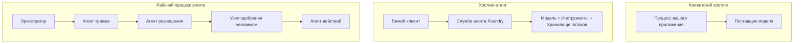
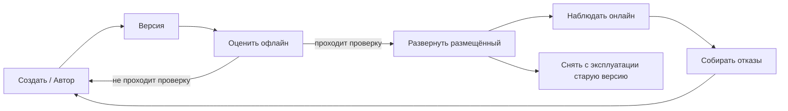
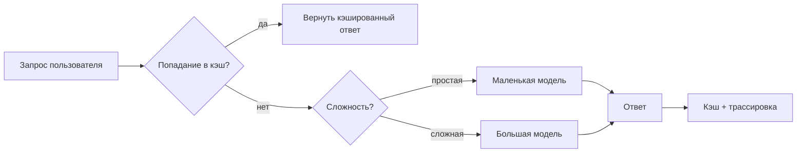
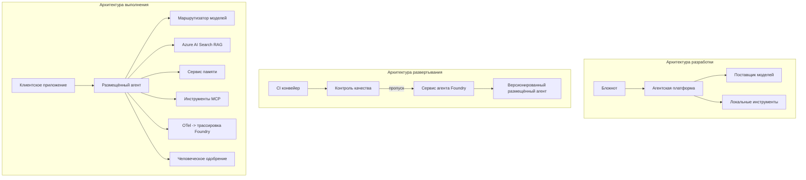

# Развертывание масштабируемых агентов с Microsoft Foundry


До этого момента в курсе вы создавали агентов, которые работают на вашем ноутбуке, внутри блокнота, управляемые с помощью `az login` и нескольких переменных окружения. Это именно тот правильный способ для обучения. Однако это не подходящий способ запуска агента, от которого зависят тысячи клиентов в 3 часа ночи.

Этот урок посвящён разрыву между «работает на моей машине» и «работает надёжно и экономично в производственной среде». Мы закрываем этот разрыв с помощью **Microsoft Foundry** и **Microsoft Foundry Agent Service**, создавая реального агента поддержки клиентов с инструментами, поиском, памятью, оценкой и мониторингом.

## Введение

В этом уроке будут рассмотрены:

- Разница между **прототипным агентом** и **развёрнутым агентом**, и почему переход касается в основном всего, что *вокруг* модели.
- **Шаблоны развертывания** агентов: размещённые на клиенте, размещённые как сервис (Hosted Agents) и оркестрация рабочих процессов.
- **Жизненный цикл агента** в Microsoft Foundry — создание, версия, развертывание, оценка, наблюдение, вывод из эксплуатации.
- **Стратегии масштабирования**: маршрутизация модели, кэширование, параллельность и безгосударственный дизайн.
- **Наблюдаемость** с OpenTelemetry и трассировкой Foundry.
- **Оптимизация затрат** через выбор модели, маршрутизацию и контрольные точки оценки.
- **Корпоративные соображения**: управление, одобрение человека и безопасный запуск MCP серверов в производстве.

## Цели обучения

После прохождения этого урока вы научитесь:

- Выбирать правильный шаблон развертывания для конкретной нагрузки агента.
- Развертывать агента в Microsoft Foundry Agent Service, чтобы он был версиям, управлялся и был наблюдаемым.
- Инструментировать агента для трассировки и настраивать конвейер оценки, который запускается перед каждым выпуском.
- Применять маршрутизацию моделей и кэширование для контроля задержки и стоимости в масштабах.
- Добавлять этап одобрения человеком для действий с высоким риском и интегрировать MCP сервер безопасным образом в производстве.

## Требования

Предполагается, что вы завершили предыдущие уроки и уверенно владеете:

- Созданием агентов с помощью [Microsoft Agent Framework](../14-microsoft-agent-framework/README.md) (Урок 14).
- [Использование инструментов](../04-tool-use/README.md) (Урок 4) и [Agentic RAG](../05-agentic-rag/README.md) (Урок 5).
- [Память агента](../13-agent-memory/README.md) (Урок 13) и [Agentic Protocols / MCP](../11-agentic-protocols/README.md) (Урок 11).
- [Наблюдаемость и оценка](../10-ai-agents-production/README.md) (Урок 10) — этот урок строится непосредственно на нём.

Вам также понадобится:

- **Подписка Azure** и **проект Microsoft Foundry** с хотя бы одной развернутой моделью для чатов.
- **Azure CLI** с аутентификацией (`az login`).
- Python 3.12+ и пакеты из репозитория [`requirements.txt`](../../../requirements.txt).

## От прототипа к производству: что действительно меняется

Прототипный агент и производственный агент имеют одинаковый основной цикл — рассуждение, вызов инструментов, ответ. Меняется всё, что окружает этот цикл. Модель составляет примерно 20% производства агента; остальные 80% — операционный каркас.

| Вопрос | Прототип | Производство |
| --- | --- | --- |
| **Хостинг** | Работает в вашем блокноте | Работает как размещённый сервис, с версиями и выкатыванием |
| **Идентичность** | Ваш токен `az login` | Управляемая идентичность с ограниченным RBAC |
| **Состояние** | В памяти, теряется при перезапуске | Внешнее (хранилище потоков, сервис памяти) |
| **Отказоустойчивость** | Вы видите трассировку ошибки | Повторы, резервные варианты, очередь неудачных, оповещения |
| **Стоимость** | «Это копейки» | Отслеживается по запросу, маршрутизируется, кэшируется, бюджетируется |
| **Качество** | Вы оцениваете результат визуально | Автоматическая оценка перед каждым выпуском |
| **Доверие** | Вы одобряете каждое действие | Политика + человек в цикле для рискованных операций |

Имейте эту таблицу в виду. Каждый из разделов ниже соотносится с одной из её строк.

## Шаблоны развертывания агентов

Существуют три шаблона, которые вы будете использовать, часто в комбинации.

### 1. Агенты, размещённые на клиенте

Объект агента живёт внутри *вашего* процесса приложения. Ваш код вызывает провайдера модели напрямую; цикл рассуждения работает в вашем сервисе. Так делались все предыдущие уроки.

- **Используйте, когда** вам нужен полный контроль над циклом, кастомный промежуточный слой или вы встраиваете агента в существующий бэкенд.
- **Недостаток**: вы сами отвечаете за масштабирование, состояние и устойчивость.

### 2. Hosted Agents (Foundry Agent Service)

Агент *зарегистрирован как ресурс* в Microsoft Foundry. Foundry хостит цикл рассуждения, хранит потоки, обеспечивает безопасность контента и RBAC, а агент виден в портале Foundry. Ваше приложение становится тонким клиентом, который создаёт потоки и читает ответы.

- **Используйте, когда** нужна надёжность, встроенная наблюдаемость, управление и меньше операционных задач.
- **Недостаток**: меньше низкоуровневого контроля ради управляемой среды выполнения.

### 3. Рабочие процессы агента

Несколько агентов (и инструментов) объединяются в граф с явным контролем потока — последовательные шаги, ветвления, узлы с одобрением человеком и устойчивые контрольные точки, которые могут приостанавливать и возобновлять выполнение. Это функционал Microsoft Agent Framework **Workflows** применённый в масштабе развертывания.

- **Используйте, когда** одна задача охватывает несколько специализированных агентов или требует этапа одобрения посредине.
- **Недостаток**: больше движущихся частей; нужна наблюдаемость уровня оркестрации.



## Жизненный цикл агента в Microsoft Foundry

Развертывание агента — это не однократный `push`. Это цикл, который сильно похож на цикл выпуска программного обеспечения, потому что именно это и есть.



Ключевая идея, перенятая из [Урока 10](../10-ai-agents-production/README.md): **оффлайн-оценка — это контрольный шлюз, а не запоздалое размышление.** Новая версия агента не публикуется, пока не пройдёт ваши пороговые оценки. Онлайн-наблюдаемость затем возвращает реальные сбои обратно в оффлайн-набор тестов. Вот весь цикл.

## Стратегии масштабирования

Масштабирование агента отличается от масштабирования безгосударственного веб-API, потому что каждый запрос может вызывать множество дорогих вызовов моделей и инструментов. Четыре метода несут основную нагрузку.

**Обработка без состояния.** Не храните состояние на пользователя в памяти вашего процесса. Сохраняйте потоки разговоров в хранилище Foundry или сервисе памяти, чтобы любой экземпляр мог обработать любой запрос. Это позволяет масштабироваться горизонтально — добавлять экземпляры, без привязки к сессиям.

**Маршрутизация моделей.** Не каждый запрос требует самой мощной (и самой дорогой) модели. Простой запрос — классификация намерения, короткий факт — маршрутизируйте на маленькую быструю модель, а большую модель оставьте для настоящих рассуждений. Foundry имеет **Model Router** для этого, или вы можете реализовать лёгкий классификатор сами. Вы создадите DIY-версию в лабораторной работе.

**Кэширование ответов.** Многие запросы поддержки почти дубликаты («как сбросить пароль?»). Кэшируйте ответы на распространённые вопросы и отдавайте без обращения к модели. Даже умеренный уровень попаданий в кэш заметно снижает стоимость и задержку.

**Параллелизм и обратное давление.** У провайдеров моделей есть лимиты по частоте запросов. Ограничивайте параллелизм, используйте повторные попытки с экспоненциальной задержкой и аккуратно обрабатывайте ошибки (ответ «мы работаем над этим» в очереди лучше ошибки 500).



## Наблюдаемость в производстве

Вы не можете управлять тем, что не видите. Как рассмотрено в Уроке 10, Microsoft Agent Framework нативно выпускает **OpenTelemetry** трассы — каждый вызов модели, инструмент и шаг оркестрации становятся спэнами. В производстве вы экспортируете эти спэны в Microsoft Foundry (или любой совместимый с OTel бэкенд), чтобы:

- Проследить один запрос клиента от начала до конца через все вызовы моделей и инструментов.
- Следить за p50/p95 задержкой и стоимостью за запрос с течением времени.
- Оповещать о всплесках ошибок и аномалиях затрат до того, как об этом узнают пользователи (или ваша финансовая команда).

```python
from agent_framework.observability import get_tracer

tracer = get_tracer()

with tracer.start_as_current_span("support_request") as span:
    span.set_attribute("customer.tier", "enterprise")
    span.set_attribute("routed.model", "gpt-4.1-mini")
    # выполнение агента автоматически отслеживается внутри этого спана
```

Атрибуты, такие как `customer.tier` и `routed.model`, превращают множество трасс в отвечаемые вопросы («слишком ли часто корпоративных клиентов маршрутизируют на маленькую модель?»).

## Оптимизация затрат

Затраты в производственных агентах в основном связаны с токенами. Три рычага по порядку влияния:

1. **Подберите модель по размеру.** Малая модель, проходящая ваш шлюз оценки, почти всегда дешевле большой, которая тоже проходит. Используйте оценку, чтобы *доказать*, что маленькая модель достаточно хороша, вместо того чтобы по умолчанию выбирать самую большую из осторожности.
2. **Маршрутизируйте по сложности.** Как выше — платите за большую модель только для запросов, требующих сложных рассуждений.
3. **Активно используйте кэширование.** Самый дешёвый вызов модели — тот, который вы не сделали.

Контроль оценок и затрат — это одна дисциплина под разными углами: оценка задаёт *нижний порог качества*, маршрутизация и кэширование держат вас как можно ближе к *стоимости* этого порога.

## Корпоративные соображения при развертывании

**Управление.** Hosted Agents наследуют RBAC, безопасность контента и аудит Foundry. Дайте каждому агенту управляемую идентичность с минимальными необходимыми правами — только чтение базы знаний, ограниченный доступ к API тикетов, и ничего лишнего.

**Человек в цикле.** Некоторые действия слишком серьёзны для полной автоматизации — возврат денег, удаление аккаунта, эскалация в юридический отдел. Microsoft Agent Framework поддерживает инструменты с **необходимостью одобрения**: агент предлагает действие, выполнение приостанавливается, человек одобряет или отклоняет, рабочий процесс продолжается. Вы видели примитив в [Уроке 6](../06-building-trustworthy-agents/README.md); здесь вы его развернёте.

**MCP в производстве.** [MCP](../11-agentic-protocols/README.md) позволяет вашему агенту использовать внешние инструменты через стандартный интерфейс. В производстве рассматривайте каждый MCP сервер как ненадёжную границу: фиксируйте версию сервера, запускайте с ограниченной идентичностью, проверяйте его выводы, и никогда не передавайте серверу секреты. MCP сервер — это зависимость, а зависимости подлежат патчам, аудиту и ограничению частоты.



Эти три диаграммы — разработка, развертывание, выполнение — это один и тот же агент на трёх этапах жизни. Лабораторная работа ниже проведёт вас через процесс построения.

## Практическая лабораторная работа: Агент поддержки клиентов, готовый к производству

Откройте [`code_samples/16-python-agent-framework.ipynb`](./code_samples/16-python-agent-framework.ipynb) и пройдите его полностью. Вы соберёте **агента поддержки клиентов Contoso** с учётом всех производственных аспектов:

1. **Вызов инструментов** — поиск статуса заказа и открытие тикетов поддержки.
2. **RAG** — ответы на вопросы из базы знаний о политике (Azure AI Search с резервом в памяти, чтобы блокнот работал без ресурса Search).
3. **Память** — запоминать клиента в ходе разговора.
4. **Маршрутизация модели** — классификатор сложности направляет каждый запрос на маленькую или большую модель.
5. **Кэширование ответов** — повторяющиеся вопросы обслуживаются из кэша.
6. **Одобрение человеком** — возвраты сверх порога приостанавливаются до подписи человеком.
7. **Конвейер оценки** — небольшой оффлайн набор тестов оценивает агента и служит шлюзом релиза.
8. **Наблюдаемость** — OpenTelemetry трассировка каждого запроса.

### Пошаговое руководство

Блокнот организован так, что каждый производственный аспект — это отдельный, исполняемый раздел. Сердце — обработчик запросов с маршрутизацией и кэшированием:

```python
async def handle_support_request(query: str, customer_id: str) -> str:
    # 1. Обслуживать из кэша, когда это возможно.
    cached = response_cache.get(normalize(query))
    if cached:
        return cached

    # 2. Маршрутизировать по сложности для контроля затрат.
    model = "gpt-4.1-mini" if is_simple(query) else "gpt-4.1"

    # 3. Запускать агент внутри span трассировки для наблюдаемости.
    with tracer.start_as_current_span("support_request") as span:
        span.set_attribute("routed.model", model)
        span.set_attribute("customer.id", customer_id)
        response = await support_agent.run(query, model=model)

    # 4. Кэшировать и возвращать.
    response_cache.set(normalize(query), response.text)
    return response.text
```

Контрольный шлюз оценки выпуска выглядит так:

```python
async def evaluation_gate(agent, test_cases, threshold: float = 0.8) -> bool:
    passed = 0
    for case in test_cases:
        result = await agent.run(case["input"])
        if score_response(result.text, case["expected"]) >= 0.8:
            passed += 1
    pass_rate = passed / len(test_cases)
    print(f"Evaluation pass rate: {pass_rate:.0%} (gate: {threshold:.0%})")
    return pass_rate >= threshold  # развертывание только при успешном прохождении проверки
```

Читайте каждую строку — блокнот намеренно держит примитивы маленькими, чтобы ничего не скрывать за вызовом фреймворка.

## Валидация развернутого агента с помощью Smoke тестов

Приведённый выше шлюз оценки работает *оффлайн* с вашим объектом агента. После развертывания агента как Hosted Agent требуется ещё одна, более дешевая проверка: **действительно ли развернутый endpoint отвечает?**

Успешное развертывание лишь доказывает, что управляющая плоскость приняла конфигурацию — это не доказывает, что агент отвечает. Отсутствующая зависимость, неправильная маршрутизация модели или просроченное соединение могут привести к «зелёному» развертыванию, которое ничего не возвращает. Smoke тест ловит это за секунды при каждом деплое, без затрат полноценной оценки.

В этом репозитории поставляется готовый к использованию конвейер smoke тестов, основанный на GitHub Action [AI Smoke Test](https://github.com/marketplace/actions/ai-smoke-test):

- **Каталог** — [`tests/lesson-16-smoke-tests.json`](../../../tests/lesson-16-smoke-tests.json) содержит подсказки и утверждения для агента поддержки Contoso (обоснованные ответы по политике, поиск заказа, сохранение темы и непрерывность многотуровых диалогов). Каталоги других агентов уроков находятся рядом — смотрите [`tests/README.md`](../tests/README.md).
- **Рабочий процесс** — [`.github/workflows/smoke-test.yml`](../../../.github/workflows/smoke-test.yml) аутентифицируется через Azure OIDC и отправляет каждый запрос на endpoint Responses агента, прерывая задачу при любой ошибке утверждения.

```yaml
- name: Smoke-test hosted agent
  uses: JFolberth/ai-smoketest@v1
  with:
    project_endpoint: ${{ inputs.project_endpoint }}
    agent_name: ContosoSupportAgent
    tests_file: tests/lesson-16-smoke-tests.json
```


Запустите это из вкладки **Actions**, когда ваш агент будет развернут, указав конечную точку вашего проекта Foundry и имя агента. Федеративной идентичности нужна роль **Azure AI User** в области проекта Foundry. Представьте слои как пирамиду: smoke-тесты (доступен и отвечает?) выполняются при каждом развертывании, офлайн-оценка (достаточно хорошо для выпуска?) выполняется перед продвижением, а онлайн-оценка (как он работает в реальных условиях?) выполняется непрерывно.

## Проверка знаний

Проверьте своё понимание перед выполнением задания.

**1. Примерно сколько в производственном агенте занимает "модель" и что составляет остальное?**

<details>
<summary>Ответ</summary>

Модель — это меньшинство системы — часто называют примерно 20%. Остальное — это операционный каркас: хостинг и версионирование, управление идентификацией и RBAC, внешний статус, обработка сбоев, учёт затрат, оценка и управление с участием человека. Переход в продакшен в основном заключается в построении всего *вокруг* цикла рассуждений.
</details>

**2. Когда бы вы выбрали Hosted Agent вместо агента, размещённого у клиента?**

<details>
<summary>Ответ</summary>

Когда вам нужен управляемый рантайм с встроенной надёжностью (потоки, которые сохраняются и могут возобновляться), наблюдаемостью, безопасностью контента и RBAC, и вы готовы пожертвовать частью низкоуровневого контроля цикла рассуждений ради уменьшения операционной поверхности. Размещение у клиента предпочтительнее, когда нужен полный контроль над циклом или когда агент интегрируется в существующий бэкенд.
</details>

**3. Почему масштабируемый агент должен быть безсостоянием в памяти собственного процесса?**

<details>
<summary>Ответ</summary>

Чтобы любой экземпляр мог обработать любой запрос, что позволяет горизонтальное масштабирование без привязки к сессиям. Состояние разговора пользователя вынесено во внешний хранилище потоков или сервис памяти. Если бы состояние хранилось в памяти процесса, оно терялось бы при перезапуске и нельзя было бы свободно распределять нагрузку.
</details>

**4. Какую проблему решает маршрутизация моделей и как это связано с оценкой?**

<details>
<summary>Ответ</summary>

Маршрутизация направляет простые запросы к небольшой, дешёвой, быстрой модели и резервирует большую модель для настоящих рассуждений, контролируя задержку и стоимость. Это связано с оценкой, потому что именно оценка *доказывает*, что маленькая модель достаточно хороша для класса запросов — маршрутизация без оценки — это угадывание.
</details>

**5. Что такое "оценочный шлюз" и где он расположен в жизненном цикле?**

<details>
<summary>Ответ</summary>

Оценочный шлюз запускает офлайн-набор тестов для новой версии агента и блокирует развертывание, если процент прохождения ниже порога. Он находится между "версией" и "развёртыванием" в жизненном цикле, делая качество предпосылкой выпуска, а не проверкой уже после релиза.
</details>

**6. Почему сервер MCP в продакшене должен рассматриваться как ненадёжная граница?**

<details>
<summary>Ответ</summary>

Потому что это внешняя зависимость, к которой обращается ваш агент. Вы должны фиксировать его версию, запускать с ограниченной идентичностью, валидировать его выходные данные, ограничивать частоту запросов и никогда не разглашать ему секреты — та же дисциплина, что и для любой сторонней зависимости. Его выходные данные вливаются в рассуждения вашего агента, поэтому непроверенное доверие — это риск безопасности.
</details>

**7. Какое единственное изменение обычно имеет наибольшее влияние на стоимость производственного агента и почему?**

<details>
<summary>Ответ</summary>

Правильный подбор модели — использование самой маленькой модели, которая всё ещё проходит ваш оценочный шлюз. Стоимость доминируется токенами, и меньшая модель при удовлетворительном качестве почти всегда дешевле большой. Кеширование и маршрутизация дополнительно снижают стоимость, но выбор базовой модели оказывает наибольший эффект первого порядка.
</details>

**8. Какую роль играют атрибуты спанов, такие как `customer.tier` и `routed.model`, в наблюдаемости?**

<details>
<summary>Ответ</summary>

Они превращают сырые трассировки в ответ на бизнес-вопросы. Без атрибутов у вас стена спанов; с ними можно спросить: «слишком часто ли корпоративных клиентов направляют к маленькой модели?» или «какая модель обрабатывает самые медленные запросы?» Атрибуты — это способ нарезать телеметрию по измерениям, важным для вашей работы.
</details>

## Задание

Возьмите агента поддержки клиентов из лабораторной работы и адаптируйте его для конкретного сценария: **агент поддержки подписок для SaaS-компании.**

Ваше задание должно:

1. **Заменить инструменты** на релевантные для биллинга: `get_subscription_status`, `get_invoice` и `issue_credit` (кредиты свыше 50$ требуют одобрения человеком).
2. **Добавить три RAG-документа**, охватывающих политику возвратов компании, цикл выставления счетов и политику отмены.
3. **Расширить набор оценки** минимум до восьми кейсов, включая по крайней мере два, которые *должны* вызвать путь с одобрением человеком, и подтвердить, что ваш оценочный шлюз правильно пропускает или блокирует.
4. **Добавить один отчёт о затратах**: после обработки десяти смешанных запросов через агента вывести, сколько запросов ушло на маленькую модель, сколько на большую и сколько было обслужено из кеша.

Напишите короткий параграф (в markdown-ячейке), объясняющий, какое правило маршрутизации моделей вы выбрали и как бы вы его валидаировали на реальном трафике. Одного правильного ответа нет — оценивается, насколько связаны продакшн-задачи.

## Резюме

В этом уроке вы переместили агента с прототипа в продакшен с помощью Microsoft Foundry:

- Переход в продакшен — это в основном про **операционный каркас** вокруг модели — хостинг, идентичность, состояние, обработка сбоев, затраты, качество и доверие.
- Вы узнали три **паттерна развертывания** — размещение у клиента, Hosted Agents и Agent Workflows — и когда каждый из них применим.
- Вы прошли через **жизненный цикл агента**, где офлайн-оценка работает как шлюз релиза, а онлайн-наблюдаемость возвращает ошибки в тестовый набор.
- Вы применили **стратегии масштабирования** — безсостояние, маршрутизация моделей, кеширование и ограниченный параллелизм — и связали их с **оптимизацией затрат**.
- Вы внедрили **корпоративные механизмы управления**: RBAC, одобрение с участием человека и безопасная интеграция MCP в продакшен.
- Вы построили **агента поддержки клиентов, готового к продакшену**, который объединяет все эти аспекты в работающем коде.

Следующий урок совершит обратное путешествие: вместо масштабирования агентов в облако вы перенесёте их *на* одну машину разработчика и запустите полностью локально.

## Дополнительные ресурсы

- <a href="https://learn.microsoft.com/azure/ai-foundry/what-is-azure-ai-foundry" target="_blank">Документация Microsoft Foundry</a>
- <a href="https://learn.microsoft.com/azure/ai-foundry/agents/overview" target="_blank">Обзор службы агентов Microsoft Foundry</a>
- <a href="https://aka.ms/ai-agents-beginners/agent-framework" target="_blank">Microsoft Agent Framework</a>
- <a href="https://learn.microsoft.com/azure/ai-foundry/concepts/model-router" target="_blank">Маршрутизатор моделей в Microsoft Foundry</a>
- <a href="https://learn.microsoft.com/azure/search/search-what-is-azure-search" target="_blank">Azure AI Search</a>
- <a href="https://opentelemetry.io/" target="_blank">OpenTelemetry</a>
- <a href="https://github.com/marketplace/actions/ai-smoke-test" target="_blank">GitHub Action AI Smoke Test</a>
- <a href="https://modelcontextprotocol.io/" target="_blank">Model Context Protocol (MCP)</a>

## Предыдущий урок

[Построение агентов для использования компьютера (CUA)](../15-browser-use/README.md)

## Следующий урок

[Создание локальных AI-агентов](../17-creating-local-ai-agents/README.md)

---

<!-- CO-OP TRANSLATOR DISCLAIMER START -->
**Отказ от ответственности**:
Этот документ был переведен с использованием сервиса машинного перевода [Co-op Translator](https://github.com/Azure/co-op-translator). Несмотря на наши усилия по обеспечению точности, имейте в виду, что автоматический перевод может содержать ошибки или неточности. Оригинальный документ на его исходном языке следует считать авторитетным источником. Для получения критически важной информации рекомендуется обратиться к профессиональному человеческому переводу. Мы не несем ответственности за любые недоразумения или неправильные толкования, возникшие в результате использования этого перевода.
<!-- CO-OP TRANSLATOR DISCLAIMER END -->