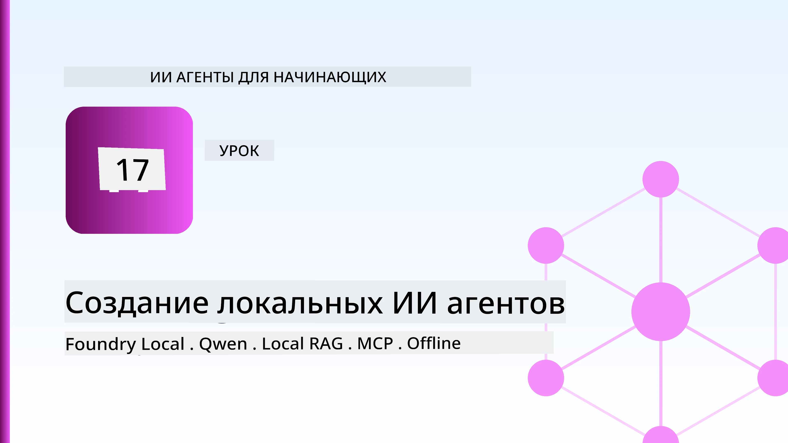
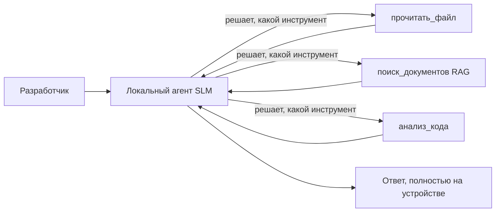
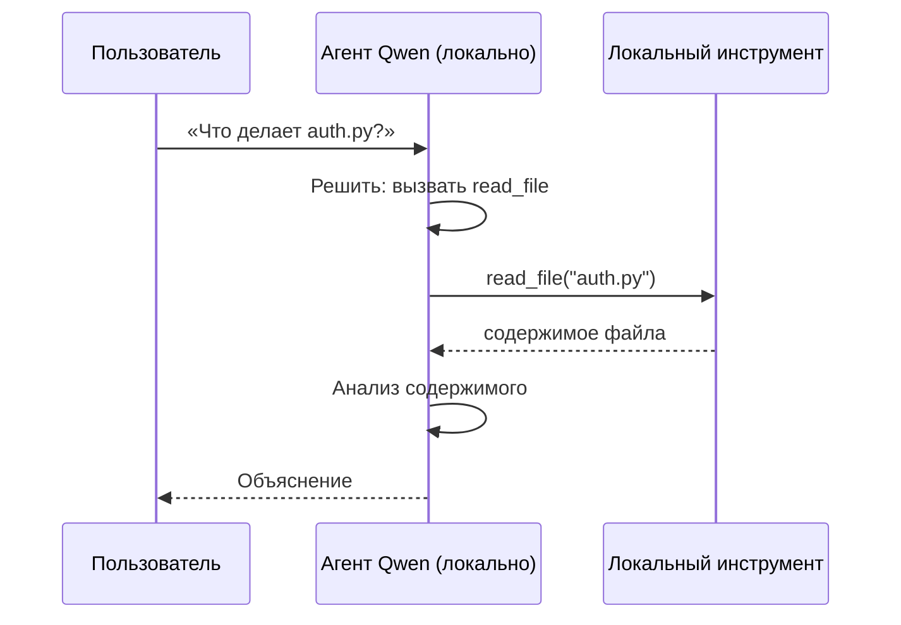
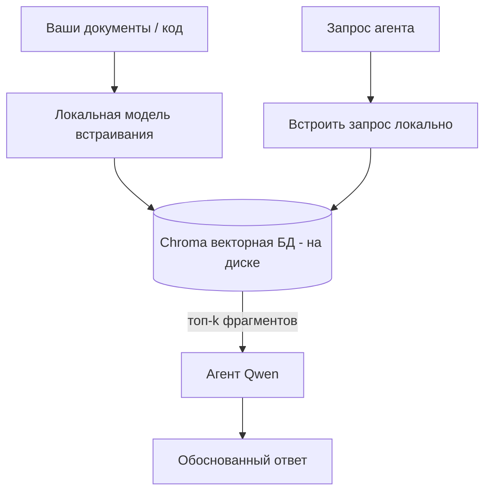
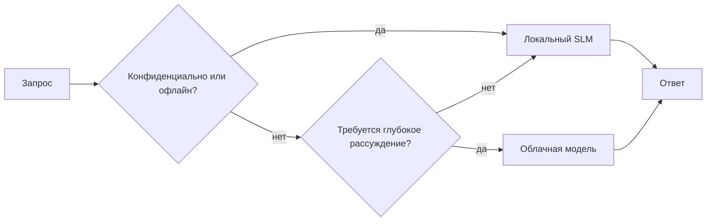

# Создание локальных AI-агентов с использованием Microsoft Foundry Local и Qwen



В предыдущем уроке агенты масштабировались *в облако*. В этом — они *опускаются* на одну машину. К концу у вас будет рабочий инженерный ассистент, который размышляет, вызывает инструменты, читает ваши файлы и ищет в вашей документации — **без единого обращения к облачному выводу.**

Зачем это нужно? Три причины, которые постоянно всплывают в реальной инженерной работе:

- **Конфиденциальность.** Код и документы никогда не покидают машину. Ни один запрос, ни один фрагмент, ни одни данные клиента не пересекают сетевую границу.
- **Стоимость.** Локальный вывод не тарифицируется за токен. Вы можете итеративно работать весь день, платя лишь за электроэнергию.
- **Офлайн.** В самолете, в безопасном объекте или при отключении сети агент продолжает работать.

Но вы меняете передовую облачную модель на **Малую Языковую Модель (SLM)**, работающую на вашем CPU, GPU или NPU. Этот урок посвящен созданию агентов, которые *хороши* в рамках этого ограничения, а не притворяются, что его нет.

## Введение

В этом уроке вы узнаете:

- Что такое **Малые Языковые Модели (SLM)**, где они эффективны и где нет.
- Что такое **Microsoft Foundry Local** — среда выполнения, загружающая и обслуживающая модели на устройстве через **OpenAI-совместимый API**.
- Какие есть **модели Qwen с вызовом функций** — SLM, надёжно генерирующие вызовы инструментов, что делает возможными локальных *агентов* (а не просто локальный чат).
- Что такое **локальные инструменты, локальный RAG и локальный MCP** — которые дают агенту функциональность без облака.
- Какие существуют **гибридные паттерны** — когда оставлять задачи локальными, а когда обращаться к облаку.

## Цели обучения

После этого урока вы сможете:

- Объяснять компромиссы SLM и выбирать подходящие сценарии для локальных агентов.
- Запускать модель Qwen локально через Foundry Local и подключаться к ней через OpenAI-совместимый эндпоинт.
- Создавать агента с вызовом инструментов, работающего полностью на вашей рабочей станции.
- Добавлять локальный RAG по вашим документам с использованием локальной векторной базы (Chroma).
- Подключать агента к локальному серверу MCP и размышлять о гибридных локально/облачных решениях.

## Необходимые знания

Предполагается, что вы прошли предыдущие уроки и уверенно работаете с:

- [Использование инструментов](../04-tool-use/README.md) (Урок 4) и [Агентный RAG](../05-agentic-rag/README.md) (Урок 5).
- [Агентные протоколы / MCP](../11-agentic-protocols/README.md) (Урок 11).
- [Microsoft Agent Framework](../14-microsoft-agent-framework/README.md) (Урок 14).

Вам также понадобится:

- Рабочая станция для разработки. **Реалистичный минимум — 8 ГБ ОЗУ**; 16 ГБ и более — комфортно. GPU или NPU помогают, но не обязательны.
- Установленный **Microsoft Foundry Local** (см. раздел установки ниже).
- Python 3.12+ и пакеты из файла [`requirements.txt`](../../../requirements.txt), а также `foundry-local-sdk`, `openai` и `chromadb` для этого урока.

## Малые языковые модели: правильный инструмент для локальной работы

Передовая облачная модель имеет сотни миллиардов параметров и дата-центр за спиной. SLM содержит несколько миллиардов параметров и должна помещаться в оперативной памяти вашего ноутбука. Эта разница задаёт чёткие ожидания.

**SLM хорошо справляются с:**

- Структурированными, ограниченными задачами — классификация, извлечение, суммирование известного документа.
- **Вызовом инструментов** — решением, какую функцию вызвать и с какими аргументами.
- Быстрой, дешёвой и приватной итерацией над собственными данными.

**SLM уступают в:**

- Открытом, многошаговом рассуждении на большой контекст.
- Обширных знаниях о мире (видели меньше и быстрее забывают).

Победная стратегия для локальных агентов: **пускай SLM оркеструет, а инструменты делают тяжёлую работу.** Модель не обязана *знать* ваш код — ей нужно знать, когда вызывать `read_file` и `search_docs`. Это отлично подходит сильным сторонам SLM.



## Microsoft Foundry Local

**Microsoft Foundry Local** — это лёгкая среда выполнения, которая загружает, управляет и обслуживает модели полностью на вашем устройстве. Самая важная для нас функция — это открытие **OpenAI-совместимого HTTP эндпоинта** — потому OpenAI SDK и клиент OpenAI из Microsoft Agent Framework работают с ним, меняя только `base_url`. Всё, что вы узнали о создании агентов, переносится напрямую; меняется только местоположение сервера на `localhost`.

Foundry Local также автоматически выбирает лучший билд модели под ваше оборудование — для CPU, CUDA/GPU или NPU — так что вам не нужно оптимизировать вручную под каждую машину.

### Установка

Установите Foundry Local (см. [документацию](https://learn.microsoft.com/azure/ai-foundry/foundry-local/) для вашей ОС), затем убедитесь, что он работает:

```bash
# Установите (пример; следуйте документации для вашей платформы)
winget install Microsoft.FoundryLocal      # Windows
# brew install microsoft/foundrylocal/foundrylocal   # macOS

# Скачайте и запустите модель Qwen, затем запустите локальный сервис
foundry model run qwen2.5-7b-instruct
foundry service status
```

После запуска сервиса у вас есть локальный, OpenAI-совместимый эндпоинт (обычно `http://localhost:PORT/v1`). Ноутбук использует `foundry-local-sdk` для автоматического обнаружения эндпоинта, так что порт вводить вручную не нужно.

## Вызов функций Qwen: почему это важно

Агентом можно считать лишь того, кто умеет вызывать инструменты. Многие SLM умеют вести чат, но формируют ненадёжные, некорректные вызовы функций. **Qwen** модели обучены именно для правильного вызова функций и стабильно выдают корректные структуры вызова — именно это превращает локальную чат-модель в локального *агента*.

Поток — стандартный цикл вызова инструментов, который вы уже знаете, только выполняется на устройстве:



## Локальный RAG

Поиск по документации — это то, где локальные агенты особенно полезны. Вместо того, чтобы надеяться, что SLM запомнила вашу документацию по фреймворку, вы встраиваете эти документы в **локальную векторную базу данных** и позволяете агенту извлекать релевантные фрагменты по запросу.

Мы используем **Chroma** — встроенное векторное хранилище, работающее в процессе без отдельного сервера. Конвейер полностью локальный: локальная модель эмбеддинга → локальные векторы → локальный поиск → локальная SLM.



Это тот же паттерн Agentic RAG из урока 5 — единственное отличие в том, что все компоненты теперь работают на вашей машине.

## Локальные MCP-серверы

[MCP](../11-agentic-protocols/README.md) — это транспорт, а не облачный сервис. MCP-сервер может работать как локальный процесс на `stdio`, предоставляя агенту доступ к инструментам по стандартному протоколу. Это позволяет использовать растущую экосистему MCP-серверов — доступ к файловой системе, операции git, запросы к базе данных — полностью офлайн.

Положение с безопасностью отличается от облака, но не отсутствует: локальный MCP-сервер работает с правами вашего пользователя, поэтому ограничьте область его доступа (папка проекта, а не весь домашний каталог) и проверяйте его выводы как входные данные перед использованием.

## Гибридные модели облака и локальной работы

Локальный режим не значит исключительно локальный. Зрелые системы маршрутизируют согласно чувствительности и сложности:

| Ситуация | Где выполняется |
| --- | --- |
| Чувствительный код / данные или офлайн | **Локальная SLM** |
| Простая ограниченная задача | **Локальная SLM** (дешево, быстро) |
| Сложное многошаговое рассуждение на не чувствительных данных | **Облачная модель** |
| Всё во время отключения сети | **Локальная SLM** (плавное ухудшение) |

Это отражает идею **маршрутизации моделей** из урока 16 — только теперь одна из "моделей" — это ваша машина. Надёжный дизайн переключается на локальную модель, если облако недоступно, так что качество агента падает постепенно, а не полностью прекращается.



## Практическая часть: локальный инженерный ассистент

Откройте [`code_samples/17-local-agent-foundry-local.ipynb`](./code_samples/17-local-agent-foundry-local.ipynb) и выполните его шаги. Вы создадите **локального инженерного ассистента**, который работает полностью на вашей рабочей станции и умеет:

1. **Вызывать инструменты** — посредством вызова функций Qwen через Foundry Local.
2. **Выполнять локальные операции с файлами** — перечислять и читать файлы в папке проекта.
3. **Анализировать код** — выдавать базовые метрики по исходному файлу.
4. **Искать в документации** — локальный RAG по папке с документацией с помощью Chroma.
5. **Использовать MCP** — подключаться к локальному MCP-серверу (с аккуратным пропуском, если он не настроен).

В процессе никакие облачные выводы не производятся.

### Прохождение

Ассистент подключается к Foundry Local через OpenAI-совместимый эндпоинт, так что код агента почти такой же, как в облачных уроках — меняется только клиент:

```python
from foundry_local import FoundryLocalManager
from openai import OpenAI

# Foundry Local обнаруживает/загружает модель и предоставляет нам локальную конечную точку.
manager = FoundryLocalManager(\"qwen2.5-7b-instruct\")
client = OpenAI(base_url=manager.endpoint, api_key=manager.api_key)  # api_key - это локальный заполнитель
```

Инструменты — это обычные функции Python, ограниченные корнем проекта:

```python
def read_file(path: str) -> str:
    \"\"\"Read a file, but only inside the sandboxed project directory.\"\"\"
    full = (PROJECT_ROOT / path).resolve()
    if PROJECT_ROOT not in full.parents and full != PROJECT_ROOT:
        return \"Access denied: path is outside the project directory.\"
    return full.read_text(encoding=\"utf-8\")
```

Обратите внимание на проверку песочницы — даже локально инструмент, который читает произвольные пути, является риском. Ноутбук ограничивает каждый инструмент только одним корнем проекта.

## Проверка знаний

Проверьте понимание перед выполнением задания.

**1. Назовите две конкретные причины запускать агента локально, а не в облаке.**

<details>
<summary>Ответ</summary>

Любые две из: **конфиденциальность** (код и данные не покидают машину), **стоимость** (нет оплаты за каждый токен вывода), и **возможность офлайн** (работает без сети — в самолёте, в защищённом объекте или при отключении связи). Регуляторные/соответствующие требования, запрещающие отправку данных вне устройства, часто мотивируют причину с конфиденциальностью.
</details>

**2. Какое рекомендуемое разделение обязанностей между SLM и её инструментами в локальном агенте и почему?**

<details>
<summary>Ответ</summary>

Пусть SLM **оркестрирует** (решает, какой инструмент и с какими аргументами вызвать), а **инструменты выполняют тяжёлую работу** (чтение файлов, поиск в документации, вычисления). SLM хорошо справляется с ограниченными решениями, такими как выбор инструмента, но слабее в обширных знаниях и длинных многошаговых рассуждениях, поэтому упор на инструменты соответствует её сильным сторонам.
</details>

**3. Что делает возможным повторное использование облачного кода агента с Foundry Local?**

<details>
<summary>Ответ</summary>

Foundry Local предоставляет **OpenAI-совместимый HTTP эндпоинт**. OpenAI SDK и OpenAI-клиент Agent Framework работают с ним, изменяя только `base_url` (и используя локальный фиктивный API-ключ). Весь остальной код агента остаётся без изменений.
</details>

**4. Почему именно модель вызова функций Qwen используется вместо любой другой SLM?**

<details>
<summary>Ответ</summary>

Потому что агент должен создавать надёжные, корректные **вызовы инструментов**. Многие SLM умеют вести чат, но выдают некорректные или непоследовательные структуры вызова функций. Модели Qwen обучены вызову функций и стабильно генерируют правильные вызовы, что и делает локального чат-бота полноценным локальным агентом.
</details>

**5. Какие компоненты локального RAG-конвейера работают на машине?**

<details>
<summary>Ответ</summary>

Все: модель эмбеддинга, векторная база данных (Chroma, на диске), шаг извлечения и SLM. Документы встраиваются локально, хранятся локально, извлекаются локально и анализируются локальной моделью — ни один компонент не обращается к облаку.
</details>

**6. Локальный MCP-сервер работает на вашей машине. Значит ли это, что он автоматически безопасен? Какие меры предосторожности всё же нужно соблюдать?**

<details>
<summary>Ответ</summary>

Нет. Локальный MCP-сервер работает с вашими пользовательскими правами, значит он имеет доступ ко всему, что доступны вам. Ограничьте его область доступа (например, корень одного проекта, а не весь домашний каталог) и проверяйте его выходные данные, относя их к входным, перед выполнением действий.
</details>

**7. Опишите разумное правило гибридной маршрутизации, включающее локальную модель.**

<details>
<summary>Ответ</summary>

Маршрутизируйте чувствительные или офлайн-запросы к локальной SLM; простые ограниченные задачи — тоже к локальной SLM для скорости и экономии; сложные многошаговые рассуждения на не чувствительных данных — к облачной модели; и переключайтесь на локальную SLM, если облако недоступно, чтобы агент деградировал плавно, а не падал. Это модель маршрутизации (Урок 16) с вашей машиной как одной из моделей.
</details>

**8. Какое реалистичное минимальное количество RAM для запуска локального агента из этого урока и что дает больше RAM?**

<details>
<summary>Ответ</summary>

Около **8 ГБ** — реалистичный минимум; 16 ГБ и более — комфортно. Больше RAM позволяет запускать более крупные и мощные модели и держать больше контекста в памяти. GPU или NPU ускоряет вывод, но не обязательны — Foundry Local выбирает сборку для CPU, если ускоритель отсутствует.
</details>

## Задание

Расширьте локального инженерного ассистента, создав **локального рецензента документации** для небольшого проекта по вашему выбору (можете использовать одну из папок уроков этого репозитория).

Ваша работа должна:

1. **Проиндексировать реальную папку с документацией/кодом** в Chroma (не менее пяти файлов).
2. **Добавить инструмент `find_todos`**, который сканирует проект на наличие комментариев `TODO`/`FIXME` и возвращает их с указанием файла и номера строки — сохраняя ту же проверку песочницы, что и в `read_file`.

3. **Задайте агенту три вопроса**, которые заставят его комбинировать инструменты: один чисто RAG-вопрос, один, требующий прочтения конкретного файла, и один, требующий поиска TODO.
4. **Измерьте их**: засеките время каждого из трёх ответов и запишите его в ячейку markdown. Прокомментируйте, приемлема ли задержка для вашего предполагаемого рабочего процесса.

Затем напишите короткий абзац о **том, что бы вы переместили в облако, а что оставили локально** для этого рецензента и почему. Ваша оценка будет зависеть от того, насколько правильно связаны локальные компоненты и насколько обоснована ваша гибридная логика — а не от качества модели.

## Итог

В этом уроке вы создали агента, который полностью работает на вашем собственном компьютере:

- **SLM** жертвуют охватом ради конфиденциальности, стоимости и автономной работы — и демонстрируют лучшие результаты, когда они **организуют инструменты**, а не хранят все знания самостоятельно.
- **Foundry Local** обслуживает модели на устройстве через **совместимый с OpenAI конечный пункт**, так что ваш код облачного агента переносится с изменением в одну строку.
- **Qwen-модели с функцией вызова** делают надежный локальный вызов инструментов — а значит, и локальных *агентов* — возможными.
- **Локальный RAG** (Chroma) и **локальный MCP** дают агенту возможности, не покидая машину.
- **Гибридные схемы** позволяют маршрутизировать запросы по чувствительности и сложности, используя локальные решения как плавную альтернативу.

Это завершает цикл деплоя: урок 16 масштабировал агентов в Microsoft Foundry, а этот урок масштабирует их вниз на одну рабочую станцию. Следующий урок посвящён обеспечению безопасности развернутых агентов.

## Дополнительные ресурсы

- <a href="https://learn.microsoft.com/azure/ai-foundry/foundry-local/" target="_blank">Документация Microsoft Foundry Local</a>
- <a href="https://learn.microsoft.com/azure/ai-foundry/what-is-azure-ai-foundry" target="_blank">Документация Microsoft Foundry</a>
- <a href="https://aka.ms/ai-agents-beginners/agent-framework" target="_blank">Microsoft Agent Framework</a>
- <a href="https://qwen.readthedocs.io/en/latest/framework/function_call.html" target="_blank">Документация по вызову функций Qwen</a>
- <a href="https://modelcontextprotocol.io/" target="_blank">Model Context Protocol (MCP)</a>
- <a href="https://docs.trychroma.com/" target="_blank">Векторная база данных Chroma</a>

## Предыдущий урок

[Деплой масштабируемых агентов](../16-deploying-scalable-agents/README.md)

## Следующий урок

[Обеспечение безопасности AI-агентов](../18-securing-ai-agents/README.md)

---

<!-- CO-OP TRANSLATOR DISCLAIMER START -->
**Отказ от ответственности**:
Этот документ был переведен с использованием сервиса машинного перевода [Co-op Translator](https://github.com/Azure/co-op-translator). Несмотря на наши усилия по обеспечению точности, имейте в виду, что автоматический перевод может содержать ошибки или неточности. Оригинальный документ на его исходном языке следует считать авторитетным источником. Для получения критически важной информации рекомендуется обратиться к профессиональному человеческому переводу. Мы не несем ответственности за любые недоразумения или неправильные толкования, возникшие в результате использования этого перевода.
<!-- CO-OP TRANSLATOR DISCLAIMER END -->