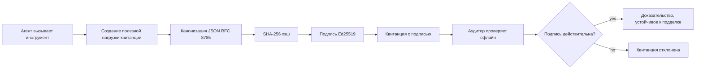
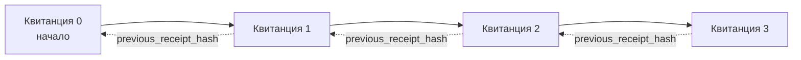

[Смотрите видео урок: Защита AI-агентов с помощью криптографических квитанций](https://youtu.be/PLACEHOLDER_VIDEO_ID)

> _(Видео урока и миниатюра будут добавлены командой Microsoft по контенту после слияния, в соответствии с шаблоном уроков 14 / 15.)_

# Защита AI-агентов с помощью криптографических квитанций

## Введение

В этом уроке вы узнаете:

- Почему аудиторские следы для AI-агентов важны для соответствия требованиям, отладки и доверия.
- Что такое криптографическая квитанция и чем она отличается от неподписанной записи логов.
- Как создать подписанную квитанцию для вызова инструмента агента на чистом Python.
- Как проверить квитанцию офлайн и обнаружить подделку.
- Как связать квитанции в цепочку так, чтобы удаление или изменение порядка одной ломало всю цепочку.
- Что доказывают квитанции и чего они явно не доказывают.

## Цели обучения

После завершения этого урока вы будете уметь:

- Определять режимы сбоев, которые мотивируют криптографическое происхождение действий агента.
- Создавать подписанную с Ed25519 квитанцию с каноническим JSON-пayload.
- Проверять квитанцию независимо, используя только открытый ключ подписавшего.
- Обнаруживать подделку, повторно выполняя верификацию изменённой квитанции.
- Построить цепочку квитанций с хэшированием и объяснить, почему цепочка важна.
- Распознавать границу между тем, что квитанции доказывают (принадлежность, целостность, порядок), и тем, чего они не доказывают (корректность действия, обоснованность политики).

## Проблема: аудиторский след вашего агента

Представьте, что вы запустили AI-агента для Contoso Travel. Агент читает запросы клиентов, обращается к API авиабилетов для поиска вариантов и бронирует места от имени клиента. В прошлом квартале агент обработал 50 000 бронирований.

Сегодня приходит аудитор. Он задает простой вопрос: «Покажите, что сделал ваш агент».

Вы передаете свои лог-файлы. Аудитор смотрит на них и задает сложный вопрос: «Откуда я знаю, что эти логи не были отредактированы?»

Это и есть проблема аудиторского следа. Большинство сегодняшних развертываний агентов полагаются на:

- **Логи приложений**: пишет сам агент, редактируемые кем угодно с доступом к файловой системе.
- **Облачные сервисы логирования**: защита от подделки на уровне платформы, но только если аудитор доверяет оператору платформы.
- **Логи транзакций баз данных**: хорошо подходят для изменений базы данных, но не для произвольных вызовов инструментов.

Ни один из этих вариантов не отвечает на вопрос аудитора без необходимости доверять кому-то (вам, вашему облачному провайдеру, поставщику базы данных). Для внутреннего использования такое доверие зачастую приемлемо. Для регулируемых задач (финансы, здравоохранение, все, что подпадает под действие Регламента ЕС по ИИ) — нет.

Криптографические квитанции решают эту проблему, делая каждое действие агента независимым для проверки. Аудитору не нужно доверять вам. Ему достаточно только вашего публичного ключа и самой квитанции.

## Что такое криптографическая квитанция?

Квитанция — это JSON-объект, в котором зафиксировано, что сделал агент, подписанный цифровой подписью.



Минимальная квитанция выглядит так:

```json
{
  "type": "agent.tool_call.v1",
  "agent_id": "contoso-travel-bot",
  "tool_name": "lookup_flights",
  "tool_args_hash": "sha256:a3f9c1...",
  "result_hash": "sha256:7b2e1d...",
  "policy_id": "contoso-travel-policy-v3",
  "timestamp": "2026-04-25T14:30:00Z",
  "sequence": 47,
  "previous_receipt_hash": "sha256:9d4e6a...",
  "signature": {
    "alg": "EdDSA",
    "sig": "c5af83...",
    "public_key": "8f3b2c..."
  }
}
```

В работе задействованы три свойства:

1. **Подпись**. Квитанция подписывается шлюзом агента, используя Ed25519 приватный ключ. Любой, у кого есть соответствующий публичный ключ, может проверить подпись офлайн. Подделка любого поля аннулирует подпись.

2. **Каноническое кодирование**. Перед подписанием квитанция сериализуется с использованием JSON Canonicalization Scheme (JCS, RFC 8785). Это гарантирует, что два разных исполнителя, создающих одинаковую логическую квитанцию, получат идентичный по байтам вывод. Без канонизации разные сериализаторы JSON давали бы разные подписи для одного и того же содержимого.

3. **Хэш-цепочка**. Поле `previous_receipt_hash` связывает каждую квитанцию с предыдущей. Удаление или изменение порядка квитанций ломает подпись у каждой последующей. Подделка становится видимой на уровне всей цепочки, даже если отдельные подписи были обойдены.

Вместе эти свойства обеспечивают три гарантии:

- **Принадлежность**: этот ключ подписал этот контент.
- **Целостность**: содержимое не изменялось с момента подписи.
- **Порядок**: эта квитанция идет после той в цепочке.

## Создание квитанции на Python

Для создания квитанции не нужна специальная библиотека. Криптографические примитивы широко доступны, а логика занимает несколько десятков строк на Python.

Практические упражнения в `code_samples/18-signed-receipts.ipynb` подробно показывают весь процесс. Кратко:

```python
import json
import hashlib
import base64
from nacl import signing
from jcs import canonicalize  # RFC 8785 канонический JSON

def b64url_nopad(data: bytes) -> str:
    return base64.urlsafe_b64encode(data).decode("ascii").rstrip("=")

def sha256_canonical(obj) -> str:
    """SHA-256 of a Python object's JCS-canonical JSON form."""
    return f"sha256:{hashlib.sha256(canonicalize(obj)).hexdigest()}"

# Сгенерировать или загрузить ключ для подписи (в производстве хранить в хранилище ключей)
signing_key = signing.SigningKey.generate()
verify_key = signing_key.verify_key

# Сформировать данные квитанции (пока без подписи)
tool_args = {"origin": "SYD", "destination": "LAX"}
tool_result = [{"flight": "QF11", "price": 1850, "stops": 0}]

payload = {
    "type": "agent.tool_call.v1",
    "agent_id": "contoso-travel-bot",
    "tool_name": "lookup_flights",
    "tool_args_hash": sha256_canonical(tool_args),
    "result_hash": sha256_canonical(tool_result),
    "policy_id": "contoso-travel-policy-v3",
    "timestamp": "2026-04-25T14:30:00Z",
    "sequence": 0,
    "previous_receipt_hash": None,
}

# Канонизировать, хешировать, подписать.
canonical_bytes = canonicalize(payload)
message_hash = hashlib.sha256(canonical_bytes).digest()
signature_bytes = signing_key.sign(message_hash).signature

# Добавить структурированный объект подписи.
receipt = {
    **payload,
    "signature": {
        "alg": "EdDSA",
        "sig": b64url_nopad(signature_bytes),
        "public_key": b64url_nopad(bytes(verify_key)),
    },
}
```

Это вся цепочка подписания. Упражнения в ноутбуке проходят каждый шаг.

## Проверка квитанции и обнаружение подделки

Проверка — обратная операция:

```python
import base64
import hashlib
from nacl import signing
from nacl.exceptions import BadSignatureError
from jcs import canonicalize

def b64url_decode(s: str) -> bytes:
    padding = "=" * ((4 - len(s) % 4) % 4)
    return base64.urlsafe_b64decode(s + padding)

def verify_receipt(receipt: dict) -> bool:
    # Подпись — это структурированный объект: {"alg", "sig", "public_key"}.
    sig_obj = receipt.get("signature")
    if not sig_obj or sig_obj.get("alg") != "EdDSA":
        return False

    # Восстановите полезную нагрузку, которая была фактически подписана (всё, кроме подписи).
    payload = {k: v for k, v in receipt.items() if k != "signature"}

    canonical_bytes = canonicalize(payload)
    message_hash = hashlib.sha256(canonical_bytes).digest()

    try:
        verify_key = signing.VerifyKey(b64url_decode(sig_obj["public_key"]))
        verify_key.verify(message_hash, b64url_decode(sig_obj["sig"]))
        return True
    except BadSignatureError:
        return False
```

Эта функция принимает квитанцию и возвращает `True`, если подпись валидна, иначе `False`. Нет вызовов сети, нет зависимости от сервиса, не требуется доверия третьим сторонам.

Чтобы увидеть обнаружение подделки на практике, ноутбук пройдет через:

1. Создание валидной квитанции и подтверждение её проверки.
2. Изменение одного байта в поле `tool_args_hash`.
3. Повторная проверка и обнаружение ошибки.

Это практическая демонстрация того, что квитанции защищены от подделки: любое изменение, даже малейшее, ломает подпись.

## Цепочка квитанций для многошаговых агентов

Одна подписанная квитанция защищает одно действие. Цепочка квитанций защищает последовательность.



Каждая квитанция содержит хэш предыдущей. Чтобы тихо удалить квитанцию 2, злоумышленнику нужно либо:

- Изменить поле `previous_receipt_hash` в квитанции 3 (это нарушит подпись квитанции 3), ИЛИ
- Подделать подпись на изменённой квитанции 3 (требуется приватный ключ агента).

Если приватный ключ хранится в аппаратном хранилище, а вы публикуете публичный ключ с каждой квитанцией, ни одна атака невозможна без обнаружения.

Ноутбук проходит:

1. Построение цепочки из трёх квитанций.
2. Проверку, что `previous_receipt_hash` каждой квитанции соответствует фактическому хэшу предыдущей.
3. Подделку одной из квитанций в середине и срыв цепочки именно в этом месте.

Так вы создаёте аудиторский след, который внешний аудитор сможет проверить без необходимости доверять вам.

## Что доказывают квитанции (и чего не доказывают)

Это самый важный раздел урока. Квитанции мощные, но их сила ограничена.

**Квитанции доказывают три вещи:**

1. **Принадлежность**: конкретный ключ подписал конкретный payload.
2. **Целостность**: содержимое не изменялось с момента подписи.
3. **Порядок**: эта квитанция идет после той в хэш-цепочке.

**Квитанции НЕ доказывают:**

1. **Корректность**: что действие агента было правильным. Квитанцию можно подписать как за правильный, так и за неправильный ответ.
2. **Соответствие политике**: что политика из `policy_id` действительно была использована или разрешила это действие. Квитанция фиксирует заявленное, а не применённое.
3. **Идентичность сверх ключа**: квитанция говорит «этот ключ подписал это содержимое», но не говорит «этот человек дал разрешение». Связывание ключа с человеком или организацией требует отдельной инфраструктуры идентификации (каталог, реестр открытых ключей и т.п.).
4. **Правдивость входных данных**: если агент получил искаженную подсказку и среагировал на неё, квитанция честно фиксирует действие. Квитанции следуют после валидации входных данных и не заменяют её.

Эта граница важна по двум причинам:

- Она показывает, для чего полезны квитанции: они делают поведение агента аудиторским и защищённым от подделки, даже через организационные границы.
- Она показывает, какие дополнительные уровни вам всё ещё нужны: валидация ввода (Урок 6), проверка политики (кратко ниже) и инфраструктура идентификации (вне рамок этого урока).

Частая ошибка — думать, что «у нас есть квитанции» значит «над нами есть контроль». Это не так. Квитанции — основа. Контроль — это система, которую вы строите сверху.

## Как доказать, что человек утвердил конкретное действие

Пункт 3 выше заслуживает отдельного раздела: квитанция о действии говорит «этот ключ подписал это содержимое», но никогда не говорит «человек утвердил это». Для рискованных действий (возвраты, удаления, денежные переводы) системы управления всё чаще требуют как раз этого утверждения, которое можно произвести с теми же примитивами, что вы уже построили в этом уроке.

Следующий ноутбук `code_samples/human-authorization-receipts.ipynb` добавляет второй тип квитанций, `human.approval.v1`, в том же формате конверта, что и квитанции урока (типизированный payload, подписанный Ed25519 на каноническом SHA-256, с объектом `signature` вне подписанных байт). Названный утверждающий подписывает **полное каноническое действие и его дайджест** перед выполнением; квитанция действия агента содержит **тот же дайджест действия** и `parent_approval_ref` — `receipt_hash` утверждения, по аналогии с `previous_receipt_hash` в цепочке выше. Один `verify_chain` проверяет оба объекта в **разных закрепленных реестрах ключей** (ключи утвердителей vs ключи агентов), путь кода общий, но полномочия не пересекаются.

Этим достигается свойство, сформулированное аккуратно: *человек утвердил это конкретное действие, и агент выполнил именно это утвержденное действие.* В ноутбуке реализованы отказоустойчивые проверки, которые делают свойство реальным, а не декларативным:

- классический набор: подделка, ошибка заместителя, повтор, поддельные ключи с обеих сторон, некорректные входные данные;
- **устаревшие полномочия**: подпись, которая все еще проходит проверку, но игнорируется, потому что версия политики изменилась, ключ утверждающего удалён из закрепленного реестра или утверждение истекло до выполнения;
- **замена дайджеста**: валидная подписанная квитанция действия, указывающая на *реальное* утверждение, связанное с *другим* каноническим действием.

Каждая ошибка возвращает уникальную причину, так что аудитор при чтении отказа видит, устарели ли полномочия или изменилось выполненное действие. Правило ноутбука: подписанное утверждение само по себе не является полномочиями. Полномочия существуют только, если обе квитанции по-прежнему связываются с одним и тем же каноническим действием во время выполнения. Путь со-сигнатуры в том же Internet-Draft, который используется в этом уроке (`draft-farley-acta-signed-receipts`), — это стандартный вариант этого шаблона.

## Ссылки на продуктивные решения

Код Python в этом уроке преднамеренно минимален, чтобы вы могли прочитать каждую строку и точно понимать, что происходит. В продакшене есть два варианта:

1. **Строить напрямую на криптографических примитивах.** Те 50 строк, что вы видели выше, подходят для многих кейсов. PyNaCl (Ed25519) и пакет `jcs` (канонический JSON) — это хорошо поддерживаемые и проверенные библиотеки.

2. **Использовать продакшн-библиотеку квитанций.** Несколько открытых проектов реализуют тот же шаблон с дополнительными функциями (ротация ключей, пакетная проверка, распространение набора JWK, интеграция с движками политик):
   - Формат квитанций этого урока соответствует IETF Internet-Draft ([`draft-farley-acta-signed-receipts`](https://datatracker.ietf.org/doc/draft-farley-acta-signed-receipts/), редакция 02), находящемуся в процессе стандартизации, с общим набором тестов на согласованность ([agent-governance-testvectors](https://github.com/ScopeBlind/agent-governance-testvectors)), которые независимые реализации взаимно сверяют для получения идентичных по байтам канонических выводов.
   - Microsoft Agent Governance Toolkit композирует квитанции с решениями на основе Cedar; смотрите Руководство 33 в этом репозитории для примера от начала до конца.
   - Пакеты `protect-mcp` (npm) и `@veritasacta/verify` (npm) предоставляют Node-реализацию подписи квитанций и офлайн проверки, предназначенную для обёртывания любого MCP-сервера в защищённый от подделок аудиторский след, включая поток удержания для со-сигнатуры, где приостановленное действие выдает квитанцию утверждения, связанную с дайджестом действия (с поддержкой WebAuthn в десктопной схеме), тот же шаблон утверждения, что и в ноутбуке с авторизацией человеком выше.
   - **[nobulex](https://github.com/arian-gogani/nobulex)** Python SDK (`pip install nobulex`) реализует тот же паттерн подписания Ed25519 + JCS в Python с интеграциями LangChain и CrewAI, включая опубликованные валидационные тестовые векторы и соответствие требованиям, внесённые через [OWASP PR #2210](https://github.com/OWASP/CheatSheetSeries/pull/2210).

Выбор между самостоятельной реализацией и использованием библиотеки похож на выбор между написанием собственной JWT-библиотеки и использованием проверенной: оба варианта разумны; библиотека экономит время и снижает площадь аудита; самописный путь заставляет понять каждый примитив. Этот урок учит пути с нуля, чтобы у вас была база для любого выбора.

## Проверка знаний

Проверьте своё понимание перед переходом к практическому заданию.

**1. Квитанция подписана приватным ключом Ed25519 агента. У аудитора есть только публичный ключ. Может ли аудитор проверить квитанцию офлайн?**

<details>
<summary>Ответ</summary>

Да. Верификация Ed25519 требует только публичный ключ и подписанные байты. Нет вызовов сети, нет зависимости от сервиса. Это качество делает квитанции полезными в изолированных, мультиорганизационных или низко-доверительных аудитах.
</details>

**2. Злоумышленник изменяет поле `policy_id` квитанции, чтобы утверждать, что к действию применялась более либеральная политика. Подпись была сделана по исходному payload. Что произойдет при проверке?**

<details>
<summary>Ответ</summary>


Проверка не прошла. Подпись была вычислена по каноническим байтам исходного полезного содержимого; изменение любого поля изменяет канонические байты, что меняет хеш SHA-256, из-за чего подпись становится недействительной. Злоумышленнику понадобился бы приватный ключ, чтобы создать новую действительную подпись, которого у него нет.
</details>

**3. Почему квитанция содержит `tool_args_hash` и `result_hash`, а не исходные аргументы и результат?**

<details>
<summary>Ответ</summary>

Две причины. Во-первых, квитанция может потребоваться для архивирования или передачи в средах, где утечка исходного содержимого (PII, бизнес-данные) нежелательна. Хеширование позволяет сохранить квитанцию небольшой и содержимое конфиденциальным; аудитор проверяет, что хеш совпадает с отдельно хранящейся копией фактического содержимого. Во-вторых, хеши имеют фиксированный размер; квитанция с хешами ограничена по размеру независимо от того, насколько велики были входные и выходные данные.
</details>

**4. Поле `previous_receipt_hash` связывает каждую квитанцию с предыдущей. Если злоумышленник тайно удалит одну квитанцию из середины цепочки, что станет недействительным?**

<details>
<summary>Ответ</summary>

Все квитанции, идущие после удалённой. Их поля `previous_receipt_hash` больше не соответствуют фактической цепочке (поскольку квитанция, на которую они ссылались, больше не существует, или цепочка теперь указывает на другого предшественника). Чтобы скрыть удаление, злоумышленнику пришлось бы заново подписать каждую последующую квитанцию, что требует наличия приватного ключа.
</details>

**5. Квитанция успешно проверена. Доказывает ли это корректность, обоснованность или соответствие политике действия агента?**

<details>
<summary>Ответ</summary>

Нет. Действительная квитанция доказывает три вещи: приписываемость (этот ключ подписал это содержимое), целостность (содержимое не изменялось) и порядок (эта квитанция появилась после той квитанции). Она НЕ доказывает, что действие было правильным, что политика, указанная в `policy_id`, была действительно оценена, или что агент следовал всем правилам. Квитанции делают поведение агента аудируемым, но не обязательно правильным. Это самая важная граница в уроке.
</details>

## Практическое задание

Откройте `code_samples/18-signed-receipts.ipynb` и выполните все четыре раздела:

1. **Раздел 1**: Подпишите вашу первую квитанцию и проверьте её.
2. **Раздел 2**: Подделайте квитанцию и убедитесь, что проверка проваливается.
3. **Раздел 3**: Постройте цепочку из трёх квитанций и проверьте целостность цепочки.
4. **Раздел 4**: Примените паттерн к агенту, построенному с помощью Microsoft Agent Framework: оберните вызов инструмента в подпись квитанции, затем проверьте квитанцию независимо.

**Дополнительное задание 1:** расширьте схему квитанции дополнительным полем на ваш выбор (например, идентификатор запроса для трассировки), обновите логику канонической подписи, чтобы включать его, и подтвердите, что квитанция успешно проходит проверку. Затем измените поле после подписи и подтвердите, что проверка не проходит. Это заставит вас понять, как каждый байт канонического кодирования влияет на подпись.

**Дополнительное задание 2:** хешируйте SHA-256 две ваши квитанции вместе (конкатенируя их канонические байты в детерминированном порядке) и вставьте полученный дайджест как новое поле в третью квитанцию перед подписанием. Проверьте, что все три квитанции успешно проходят проверку. Вы только что создали доказательство включения в один шаг: любой, у кого есть третья квитанция, может доказать, что первые две существовали во время её подписи, не раскрывая их содержимое. Это паттерн, используемый в масштабируемых квитанциях с выборочным раскрытием (Merkle commitments, RFC 6962).

## Заключение

Криптографические квитанции обеспечивают агенты ИИ аудиторским следом, который является:

- **Независимо проверяемым**: любая сторона с публичным ключом может проверить, нет зависимости от сервиса.
- **Обнаруживающим подделку**: любое изменение делает подпись недействительной.
- **Портативным**: квитанция — это небольшой JSON-файл; его можно архивировать, передавать и проверять в любом месте.
- **Соответствующим стандартам**: построены на Ed25519 (RFC 8032), JCS (RFC 8785) и SHA-256 — все широко распространённые примитивы.

Они не заменяют проверку вводимых данных, соблюдение политики или инфраструктуру идентификации. Они являются фундаментом для этих уровней. При развертывании агентов в регулируемых нагрузках, многорганизационных рабочих процессах или любой среде, где нельзя предположить доверие аудитором, квитанции — это способ сделать аудиторский след честным.

Самое важное: квитанции доказывают, кто, что и когда сказал. Они не доказывают, что сказанное было истинным или правильным. Жёстко придерживайтесь этого различия. Это разница между честной системой происхождения и вводящей в заблуждение.

## Контрольный список для продакшена

Когда будете готовы перейти от этого урока к развертыванию агентов с подписанными квитанциями в рабочей среде:

- [ ] **Переместите ключ подписи с ноутбука разработчика.** Используйте Azure Key Vault, AWS KMS или аппаратный модуль безопасности. Приватный ключ, подписывающий квитанции, никогда не должен храниться в системе управления исходным кодом или в открытом виде на машинах приложений.
- [ ] **Опубликуйте публичный ключ проверки.** Аудиторам он нужен для офлайн-проверки. Стандартный паттерн — JWK Set по известному URL (RFC 7517), например, `https://your-org.example.com/.well-known/agent-keys.json`.
- [ ] **Закрепляйте цепочку внешне.** Периодически записывайте хеш текущей головной квитанции в журнал прозрачности (Sigstore Rekor, RFC 3161 timestamp authority или вторую внутреннюю систему), чтобы внешняя сторона могла подтвердить «эта цепочка существовала в это время».
- [ ] **Храните квитанции неизменяемо.** Хранилище с добавлением только append-only (Azure Storage с политиками неизменности, AWS S3 Object Lock) предотвращает переписывание истории инсайдерами на уровне хранения.
- [ ] **Определитесь с хранением.** Многие нормы требуют хранения на протяжении нескольких лет. Планируйте рост квитанций (каждая квитанция ~500 байт; агент, делающий 10 тыс. вызовов в день, генерирует ~1.8 ГБ в год).
- [ ] **Документируйте, что квитанции не покрывают.** Квитанции доказывают приписываемость, целостность и порядок. Ваш регламент должен явно перечислять дополнительные меры контроля (валидация ввода, соблюдение политики, ограничение скорости, инфраструктура идентичности), которые работают вместе с квитанциями в вашей позиции управления.

### Есть ещё вопросы по безопасности агентов ИИ?

Присоединяйтесь к [Microsoft Foundry Discord](https://aka.ms/ai-agents/discord), чтобы общаться с другими учащимися, посещать часы консультаций и получать ответы на вопросы по агентам ИИ.

## За пределами этого урока

Этот урок охватывает подпись одиночной квитанции и последовательности с хеш-цепочкой. Те же примитивы составляют несколько более продвинутых паттернов, с которыми вы можете столкнуться по мере развития вашей позиции управления:

- **Выборочное раскрытие.** Когда поля квитанции независимо зафиксированы (Merkle-дерево по стилю RFC 6962), вы можете раскрывать определённые поля определённым аудиторам и доказывать неизменность остальных без их раскрытия. Полезно, когда одна квитанция должна удовлетворять как комплексный аудит (требующий полноты), так и требованиям минимизации данных, например GDPR (хотя аудитору нужно видеть только минимум).
- **Отзыв квитанций.** Если ключ подписи скомпрометирован, вам нужен способ помечать все квитанции, подписанные этим ключом, как недоверенные с определённого момента. Стандартные паттерны: краткоживущие ключи подписи плюс опубликованный список отзывов, или журнал прозрачности с записями об отзыве.
- **Двусторонние / раздельные подписи.** Некоторые реализации делят подписываемый полезный груз на две части — до исполнения (`authorization_*`) и после исполнения (`result_*`) — с независимыми подписями, полезно, когда решение об авторизации и наблюдаемый результат создаются разными участниками или в разное время. Это дополнение к формату квитанций из урока.
- **Состав полезного содержимого.** Квитанция защищает любые байты, которые вы положите в `result_hash`. В реальных сценариях полезное содержимое часто богаче одного результата вызова инструмента: предрешение (предсказание модели, рассмотренные варианты, доказательства и их полнота, риск, цепочка ответственности, исход проверки) может всё жить в полезном содержимом, защищённом одной квитанцией. Это сохраняет минимальный формат квитанции при эволюции схем для разных доменов.
- **Согласованность между реализациями.** Несколько независимых реализаций одного формата квитанций (Python, TypeScript, Rust, Go) перекрёстно проверяют себя на общих тестовых данных. Если вы разрабатываете собственную реализацию, проверка на опубликованных векторах подтверждает совместимость формата.
- **Миграция к постквантовой безопасности.** Ed25519 широко используется сегодня, но не является квантово-устойчивым. Формат квитанций алгоритмически гибкий: поле `signature.alg` может содержать `ML-DSA-65` (стандарт постквантовой подписи NIST) для необходимости миграции. Планируйте переходный период с двойной подписью квитанций.

## Дополнительные ресурсы

- <a href="https://datatracker.ietf.org/doc/draft-farley-acta-signed-receipts/" target="_blank">IETF Internet-Draft: Подписанные квитанции о решениях для контроля доступа между машинами</a>
- <a href="https://learn.microsoft.com/azure/ai-studio/responsible-use-of-ai-overview" target="_blank">Обзор ответственного ИИ (Azure AI)</a>
- <a href="https://datatracker.ietf.org/doc/html/rfc8032" target="_blank">RFC 8032: Алгоритм цифровой подписи на основе кривой Эдвардса (EdDSA)</a>
- <a href="https://datatracker.ietf.org/doc/html/rfc8785" target="_blank">RFC 8785: Схема каноникализации JSON (JCS)</a>
- <a href="https://datatracker.ietf.org/doc/html/rfc6962" target="_blank">RFC 6962: Прозрачность сертификатов</a> (построение Merkle-дерева, используемое в квитанциях с выборочным раскрытием)
- <a href="https://github.com/microsoft/agent-governance-toolkit/blob/main/docs/tutorials/33-offline-verifiable-receipts.md" target="_blank">Microsoft Agent Governance Toolkit, Учебник 33: Квитанции решений с офлайн-проверкой</a>
- <a href="https://github.com/ScopeBlind/agent-governance-testvectors" target="_blank">Тестовые векторы для проверки соответствия формата квитанций из урока (Apache-2.0)</a>
- <a href="https://pynacl.readthedocs.io/" target="_blank">Документация PyNaCl</a> (Ed25519 для Python)

## Предыдущий урок

[Создание локальных агентов ИИ](../17-creating-local-ai-agents/README.md)

---

<!-- CO-OP TRANSLATOR DISCLAIMER START -->
**Отказ от ответственности**:
Этот документ был переведен с использованием сервиса машинного перевода [Co-op Translator](https://github.com/Azure/co-op-translator). Несмотря на наши усилия по обеспечению точности, имейте в виду, что автоматический перевод может содержать ошибки или неточности. Оригинальный документ на его исходном языке следует считать авторитетным источником. Для получения критически важной информации рекомендуется обратиться к профессиональному человеческому переводу. Мы не несем ответственности за любые недоразумения или неправильные толкования, возникшие в результате использования этого перевода.
<!-- CO-OP TRANSLATOR DISCLAIMER END -->