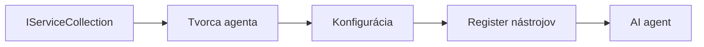

# 🎨 Agentné dizajnové vzory s Azure OpenAI (Responses API) (.NET)

## 📋 Výučbové ciele

Tento príklad demonštruje dizajnové vzory úrovne enterprise na tvorbu inteligentných agentov pomocou Microsoft Agent Framework v .NET s integráciou Azure OpenAI (Responses API). Naučíte sa profesionálne vzory a architektonické prístupy, ktoré robia agentov pripravenými na produkciu, udržiavateľnými a škálovateľnými.

### Dizajnové vzory pre podniky

- 🏭 **Factory Pattern**: Štandardizované vytváranie agentov s dependency injection
- 🔧 **Builder Pattern**: Plynulá konfigurácia a nastavenie agentov
- 🧵 **Thread-Safe Patterns**: Súbežné riadenie konverzácií
- 📋 **Repository Pattern**: Organizované spravovanie nástrojov a schopností

## 🎯 Architektonické výhody špecifické pre .NET

### Funkcie pre podniky

- **Silné typovanie**: Overenie pri kompilácii a podpora IntelliSense
- **Dependency Injection**: Integrácia vstavaného DI kontajnera
- **Správa konfigurácie**: Vzory IConfiguration a Options
- **Async/Await**: Prvá trieda podpory asynchrónneho programovania

### Vzory pripravené na produkciu

- **Integrácia logovania**: Podpora ILogger a štruktúrovaného logovania
- **Kontroly zdravia**: Vstavané monitorovanie a diagnostika
- **Validácia konfigurácie**: Silné typovanie s dátovými anotáciami
- **Spracovanie chýb**: Štruktúrované riadenie výnimiek

## 🔧 Technická architektúra

### Hlavné .NET komponenty

- **Microsoft.Extensions.AI**: Zjednotené abstrakcie služieb AI
- **Microsoft.Agents.AI**: Podnikový rámec na orchestráciu agentov
- **Azure OpenAI (Responses API)**: Vysokovýkonné vzory API klientov
- **Konfiguračný systém**: appsettings.json a integrácia prostredia

### Implementácia dizajnových vzorov



## 🏗️ Predvedené podnikové vzory

### 1. **Tvorivé vzory**

- **Agent Factory**: Centralizované vytváranie agentov so konzistentnou konfiguráciou
- **Builder Pattern**: Fluent API pre komplexnú konfiguráciu agentov
- **Singleton Pattern**: Zdieľané zdroje a správa konfigurácie
- **Dependency Injection**: Voľné prepojenie a testovateľnosť

### 2. **Behaviorálne vzory**

- **Strategy Pattern**: Vymeniteľné stratégie vykonávania nástrojov
- **Command Pattern**: Zabalené operácie agenta s undo/redo
- **Observer Pattern**: Riadenie životného cyklu agenta na základe udalostí
- **Template Method**: Štandardizované pracovné postupy vykonávania agentov

### 3. **Štrukturálne vzory**

- **Adapter Pattern**: Vrstva integrácie Azure OpenAI (Responses API)
- **Decorator Pattern**: Zlepšenie schopností agenta
- **Facade Pattern**: Zjednodušené rozhrania pre interakciu s agentom
- **Proxy Pattern**: Lenivé načítanie a cache pre výkon

## 📚 Zásady návrhu v .NET

### SOLID zásady

- **Single Responsibility**: Každá komponenta má jeden jasný účel
- **Open/Closed**: Rozšíriteľné bez modifikácie
- **Liskov Substitution**: Implementácie nástrojov založené na rozhraní
- **Interface Segregation**: Zamerané, kohézne rozhrania
- **Dependency Inversion**: Závislosť od abstrakcií, nie od konkrétnych tried

### Čistá architektúra

- **Doménová vrstva**: Hlavné abstrakcie agentov a nástrojov
- **Aplikačná vrstva**: Orchestrácia agentov a pracovné toky
- **Infrastrukturná vrstva**: Integrácia Azure OpenAI (Responses API) a externých služieb
- **Prezentačná vrstva**: Interakcia používateľa a formátovanie odpovedí

## 🔒 Podnikové úvahy

### Bezpečnosť

- **Správa poverení**: Bezpečné spracovanie API kľúčov s IConfiguration
- **Validácia vstupu**: Silné typovanie a validácia dátovými anotáciami
- **Sanitácia výstupu**: Bezpečné spracovanie a filtrovanie odpovedí
- **Auditné logovanie**: Komplexné sledovanie operácií

### Výkon

- **Async vzory**: Neblokujúce I/O operácie
- **Pooling pripojení**: Efektívna správa HTTP klienta
- **Caching**: Cache odpovedí pre lepší výkon
- **Správa zdrojov**: Správna likvidácia a čistiace vzory

### Škálovateľnosť

- **Vlákno bezpečné**: Podpora súbežného vykonávania agentov
- **Pooling zdrojov**: Efektívne využívanie zdrojov
- **Riadenie zaťaženia**: Limitácia rýchlosti a zvládanie spätného tlaku
- **Monitorovanie**: Metriky výkonu a kontroly zdravia

## 🚀 Nasadenie do produkcie

- **Správa konfigurácie**: Prostrediu špecifické nastavenia
- **Stratégia logovania**: Štruktúrované logovanie s korelačnými ID
- **Spracovanie chýb**: Globálne spracovanie výnimiek s riadnym zotavením
- **Monitorovanie**: Sledovanie aplikácií a výkonnostné ukazovatele
- **Testovanie**: Jednotkové testy, integračné testy a vzory testovania zaťaženia

Pripravení vytvárať inteligentných agentov úrovne enterprise s .NET? Poďme navrhnúť niečo robustné! 🏢✨

## 🚀 Začíname

### Predpoklady

- [.NET 10 SDK](https://dotnet.microsoft.com/download/dotnet/10.0) alebo vyšší
- Predplatné [Azure](https://azure.microsoft.com/free/) s Azure OpenAI zdrojom a nasadením modelu
- [Azure CLI](https://learn.microsoft.com/cli/azure/install-azure-cli) — prihláste sa cez `az login`

### Požadované premenné prostredia

```bash
# zsh/bash
export AZURE_OPENAI_ENDPOINT=https://<your-resource>.openai.azure.com
export AZURE_OPENAI_DEPLOYMENT=gpt-4.1-mini
# Potom sa prihláste, aby AzureCliCredential mohol získať token
az login
```

```powershell
# PowerShell
$env:AZURE_OPENAI_ENDPOINT = "https://<your-resource>.openai.azure.com"
$env:AZURE_OPENAI_DEPLOYMENT = "gpt-4.1-mini"
# Potom sa prihláste, aby AzureCliCredential mohol získať token
az login
```

### Ukážkový kód

Na spustenie príkladu kódu,

```bash
# zsh/bash
chmod +x ./03-dotnet-agent-framework.cs
./03-dotnet-agent-framework.cs
```

Alebo pomocou dotnet CLI:

```bash
dotnet run ./03-dotnet-agent-framework.cs
```

Pozrite si [`03-dotnet-agent-framework.cs`](../../../../03-agentic-design-patterns/code_samples/03-dotnet-agent-framework.cs) pre kompletný kód.

```csharp
#!/usr/bin/dotnet run

#:package Microsoft.Extensions.AI@10.*
#:package Microsoft.Agents.AI.OpenAI@1.*-*
#:package Azure.AI.OpenAI@2.1.0
#:package Azure.Identity@1.13.1

using System.ComponentModel;

using Microsoft.Agents.AI;
using Microsoft.Extensions.AI;

using Azure.AI.OpenAI;
using Azure.Identity;

// Tool Function: Random Destination Generator
// This static method will be available to the agent as a callable tool
// The [Description] attribute helps the AI understand when to use this function
// This demonstrates how to create custom tools for AI agents
[Description("Provides a random vacation destination.")]
static string GetRandomDestination()
{
    // List of popular vacation destinations around the world
    // The agent will randomly select from these options
    var destinations = new List<string>
    {
        "Paris, France",
        "Tokyo, Japan",
        "New York City, USA",
        "Sydney, Australia",
        "Rome, Italy",
        "Barcelona, Spain",
        "Cape Town, South Africa",
        "Rio de Janeiro, Brazil",
        "Bangkok, Thailand",
        "Vancouver, Canada"
    };

    // Generate random index and return selected destination
    // Uses System.Random for simple random selection
    var random = new Random();
    int index = random.Next(destinations.Count);
    return destinations[index];
}

// Azure OpenAI with the Responses API (stable v1 endpoint). Sign in with `az login`.
var azureEndpoint = Environment.GetEnvironmentVariable("AZURE_OPENAI_ENDPOINT")
    ?? throw new InvalidOperationException("AZURE_OPENAI_ENDPOINT is not set.");
var deployment = Environment.GetEnvironmentVariable("AZURE_OPENAI_DEPLOYMENT") ?? "gpt-4.1-mini";

var azureClient = new AzureOpenAIClient(new Uri(azureEndpoint), new AzureCliCredential());

// Define Agent Identity and Comprehensive Instructions
// Agent name for identification and logging purposes
var AGENT_NAME = "TravelAgent";

// Detailed instructions that define the agent's personality, capabilities, and behavior
// This system prompt shapes how the agent responds and interacts with users
var AGENT_INSTRUCTIONS = """
You are a helpful AI Agent that can help plan vacations for customers.

Important: When users specify a destination, always plan for that location. Only suggest random destinations when the user hasn't specified a preference.

When the conversation begins, introduce yourself with this message:
"Hello! I'm your TravelAgent assistant. I can help plan vacations and suggest interesting destinations for you. Here are some things you can ask me:
1. Plan a day trip to a specific location
2. Suggest a random vacation destination
3. Find destinations with specific features (beaches, mountains, historical sites, etc.)
4. Plan an alternative trip if you don't like my first suggestion

What kind of trip would you like me to help you plan today?"

Always prioritize user preferences. If they mention a specific destination like "Bali" or "Paris," focus your planning on that location rather than suggesting alternatives.
""";

// Create AI Agent with Advanced Travel Planning Capabilities
// Get the Responses client for the deployment and create the AI agent
// Configure agent with name, detailed instructions, and available tools
// This demonstrates the .NET agent creation pattern with full configuration
AIAgent agent = azureClient
    .GetChatClient(deployment)
    .AsAIAgent(
        name: AGENT_NAME,
        instructions: AGENT_INSTRUCTIONS,
        tools: [AIFunctionFactory.Create(GetRandomDestination)]
    );

// Create New Conversation Session for Context Management
// Initialize a new conversation session to maintain context across multiple interactions
// Sessions enable the agent to remember previous exchanges and maintain conversational state
// This is essential for multi-turn conversations and contextual understanding
var session = await agent.CreateSessionAsync();

// Execute Agent: First Travel Planning Request
// Run the agent with an initial request that will likely trigger the random destination tool
// The agent will analyze the request, use the GetRandomDestination tool, and create an itinerary
// Using the session parameter maintains conversation context for subsequent interactions
await foreach (var update in agent.RunStreamingAsync("Plan me a day trip", session))
{
    await Task.Delay(10);
    Console.Write(update);
}

Console.WriteLine();

// Execute Agent: Follow-up Request with Context Awareness
// Demonstrate contextual conversation by referencing the previous response
// The agent remembers the previous destination suggestion and will provide an alternative
// This showcases the power of conversation sessions and contextual understanding in .NET agents
await foreach (var update in agent.RunStreamingAsync("I don't like that destination. Plan me another vacation.", session))
{
    await Task.Delay(10);
    Console.Write(update);
}
```

---

<!-- CO-OP TRANSLATOR DISCLAIMER START -->
**Vyhlásenie o zodpovednosti**:
Tento dokument bol preložený pomocou AI prekladateľskej služby [Co-op Translator](https://github.com/Azure/co-op-translator). Hoci sa snažíme o presnosť, vezmite prosím na vedomie, že automatické preklady môžu obsahovať chyby alebo nepresnosti. Pôvodný dokument v jeho natívnom jazyku by mal byť považovaný za autoritatívny zdroj. Pre kritické informácie sa odporúča profesionálny ľudský preklad. Nie sme zodpovední za žiadne nedorozumenia alebo nesprávne interpretácie vyplývajúce z použitia tohto prekladu.
<!-- CO-OP TRANSLATOR DISCLAIMER END -->