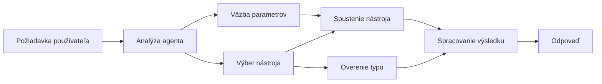

# 🛠️ Pokročilé používanie nástrojov s Azure OpenAI (Responses API) (.NET)

## 📋 Učebné ciele

Tento notebook demonštruje vzory integrácie nástrojov na úrovni podniku pomocou Microsoft Agent Framework v .NET s Azure OpenAI (Responses API). Naučíte sa vytvárať sofistikovaných agentov s viacerými špecializovanými nástrojmi, využívajúc silné typovanie C# a podnikové funkcie .NET.

### Pokročilé schopnosti nástrojov, ktoré zvládnete

- 🔧 **Viac-nástrojová architektúra**: Budovanie agentov s viacerými špecializovanými schopnosťami
- 🎯 **Typovo bezpečné vykonávanie nástrojov**: Využitie kontroly pri kompilácii v C#
- 📊 **Podnikové vzory nástrojov**: Návrh nástrojov pripravených na výrobu a správa chýb
- 🔗 **Kompozícia nástrojov**: Kombinovanie nástrojov pre zložité obchodné pracovné postupy

## 🎯 Výhody architektúry .NET nástrojov

### Podnikové vlastnosti nástrojov

- **Kontrola pri kompilácii**: Silné typovanie zaručuje správnosť parametrov nástrojov
- **Injektáž závislostí**: Integrácia IoC kontajnera na správu nástrojov
- **Async/Await vzory**: Nezablokujúce vykonávanie nástrojov s riadnym manažmentom zdrojov
- **Štruktúrované logovanie**: Zabudovaná integrácia logovania pre sledovanie vykonávania nástrojov

### Vzory pripravené na nasadenie

- **Správa výnimiek**: Komplexné riadenie chýb s typovanými výnimkami
- **Správa zdrojov**: Správne vzory uvoľňovania a správy pamäte
- **Sledovanie výkonu**: Zabudované metriky a ukazovatele výkonu
- **Správa konfigurácie**: Typovo bezpečná konfigurácia s validáciou

## 🔧 Technická architektúra

### Kľúčové komponenty .NET nástrojov

- **Microsoft.Extensions.AI**: Zjednotená abstrakčná vrstva nástrojov
- **Microsoft.Agents.AI**: Orchestrácia nástrojov na úrovni podniku
- **Azure OpenAI (Responses API)**: Vysoko výkonný API klient s poolingom pripojení

### Potrubie vykonávania nástrojov



## 🛠️ Kategórie a vzory nástrojov

### 1. **Nástroje na spracovanie dát**

- **Validácia vstupu**: Silné typovanie s dátovými anotáciami
- **Transformačné operácie**: Typovo bezpečná konverzia a formátovanie dát
- **Obchodná logika**: Nástroje na doménovo špecifické výpočty a analýzy
- **Formátovanie výstupu**: Štruktúrovaná generácia odpovedí

### 2. **Integračné nástroje** 

- **API konektory**: Integrácia RESTful služieb pomocou HttpClient
- **Databázové nástroje**: Integrácia Entity Framework na prístup k dátam
- **Súborové operácie**: Bezpečné operácie so súborovým systémom s validáciou
- **Externé služby**: Vzory integrácie tretích strán

### 3. **Pomocné nástroje**

- **Spracovanie textu**: Manipulácia a formátovanie reťazcov
- **Operácie s dátumom/časom**: Výpočty dátumu/času s ohľadom na kultúru
- **Matematické nástroje**: Presné výpočty a štatistické operácie
- **Validácia nástrojov**: Overovanie obchodných pravidiel a dát

Ste pripravení vytvárať agentov na podnikovej úrovni s výkonnými, typovo bezpečnými schopnosťami nástrojov v .NET? Poďme navrhnúť profesionálne riešenia! 🏢⚡

## 🚀 Začíname

### Požiadavky

- [.NET 10 SDK](https://dotnet.microsoft.com/download/dotnet/10.0) alebo novší
- Predplatné [Azure](https://azure.microsoft.com/free/) s Azure OpenAI zdrojom a nasadením modelu
- [Azure CLI](https://learn.microsoft.com/cli/azure/install-azure-cli) — prihlásenie cez `az login`

### Povinné premenné prostredia

```bash
# zsh/bash
export AZURE_OPENAI_ENDPOINT=https://<your-resource>.openai.azure.com
export AZURE_OPENAI_DEPLOYMENT=gpt-4.1-mini
# Potom sa prihláste, aby AzureCliCredential mohol získať token
az login
```

```powershell
# PowerShell
$env:AZURE_OPENAI_ENDPOINT = "https://<your-resource>.openai.azure.com"
$env:AZURE_OPENAI_DEPLOYMENT = "gpt-4.1-mini"
# Potom sa prihláste, aby AzureCliCredential mohol získať token
az login
```

### Ukážkový kód

Pre spustenie príkladu kódu,

```bash
# zsh/bash
chmod +x ./04-dotnet-agent-framework.cs
./04-dotnet-agent-framework.cs
```

Alebo použite dotnet CLI:

```bash
dotnet run ./04-dotnet-agent-framework.cs
```

Pozrite si [`04-dotnet-agent-framework.cs`](../../../../04-tool-use/code_samples/04-dotnet-agent-framework.cs) pre kompletný kód.

```csharp
#!/usr/bin/dotnet run

#:package Microsoft.Extensions.AI@10.*
#:package Microsoft.Agents.AI.OpenAI@1.*-*
#:package Azure.AI.OpenAI@2.1.0
#:package Azure.Identity@1.13.1

using System.ComponentModel;

using Microsoft.Agents.AI;
using Microsoft.Extensions.AI;

using Azure.AI.OpenAI;
using Azure.Identity;

// Tool Function: Random Destination Generator
// This static method will be available to the agent as a callable tool
// The [Description] attribute helps the AI understand when to use this function
// This demonstrates how to create custom tools for AI agents
[Description("Provides a random vacation destination.")]
static string GetRandomDestination()
{
    // List of popular vacation destinations around the world
    // The agent will randomly select from these options
    var destinations = new List<string>
    {
        "Paris, France",
        "Tokyo, Japan",
        "New York City, USA",
        "Sydney, Australia",
        "Rome, Italy",
        "Barcelona, Spain",
        "Cape Town, South Africa",
        "Rio de Janeiro, Brazil",
        "Bangkok, Thailand",
        "Vancouver, Canada"
    };

    // Generate random index and return selected destination
    // Uses System.Random for simple random selection
    var random = new Random();
    int index = random.Next(destinations.Count);
    return destinations[index];
}

// Azure OpenAI with the Responses API (stable v1 endpoint). Sign in with `az login`.
var azureEndpoint = Environment.GetEnvironmentVariable("AZURE_OPENAI_ENDPOINT")
    ?? throw new InvalidOperationException("AZURE_OPENAI_ENDPOINT is not set.");
var deployment = Environment.GetEnvironmentVariable("AZURE_OPENAI_DEPLOYMENT") ?? "gpt-4.1-mini";

var azureClient = new AzureOpenAIClient(new Uri(azureEndpoint), new AzureCliCredential());

// Define Agent Identity and Comprehensive Instructions
// Agent name for identification and logging purposes
var AGENT_NAME = "TravelAgent";

// Detailed instructions that define the agent's personality, capabilities, and behavior
// This system prompt shapes how the agent responds and interacts with users
var AGENT_INSTRUCTIONS = """
You are a helpful AI Agent that can help plan vacations for customers.

Important: When users specify a destination, always plan for that location. Only suggest random destinations when the user hasn't specified a preference.

When the conversation begins, introduce yourself with this message:
"Hello! I'm your TravelAgent assistant. I can help plan vacations and suggest interesting destinations for you. Here are some things you can ask me:
1. Plan a day trip to a specific location
2. Suggest a random vacation destination
3. Find destinations with specific features (beaches, mountains, historical sites, etc.)
4. Plan an alternative trip if you don't like my first suggestion

What kind of trip would you like me to help you plan today?"

Always prioritize user preferences. If they mention a specific destination like "Bali" or "Paris," focus your planning on that location rather than suggesting alternatives.
""";

// Create AI Agent with Advanced Travel Planning Capabilities
// Get the Responses client for the deployment and create the AI agent
// Configure agent with name, detailed instructions, and available tools
// This demonstrates the .NET agent creation pattern with full configuration
AIAgent agent = azureClient
    .GetChatClient(deployment)
    .AsAIAgent(
        name: AGENT_NAME,
        instructions: AGENT_INSTRUCTIONS,
        tools: [AIFunctionFactory.Create(GetRandomDestination)]
    );

// Create New Conversation Session for Context Management
// Initialize a new conversation session to maintain context across multiple interactions
// Sessions enable the agent to remember previous exchanges and maintain conversational state
// This is essential for multi-turn conversations and contextual understanding
await using var session = await agent.CreateSessionAsync();

// Execute Agent: First Travel Planning Request
// Run the agent with an initial request that will likely trigger the random destination tool
// The agent will analyze the request, use the GetRandomDestination tool, and create an itinerary
// Using the session parameter maintains conversation context for subsequent interactions
await foreach (var update in agent.RunStreamingAsync("Plan me a day trip", session))
{
    await Task.Delay(10);
    Console.Write(update);
}

Console.WriteLine();

// Execute Agent: Follow-up Request with Context Awareness
// Demonstrate contextual conversation by referencing the previous response
// The agent remembers the previous destination suggestion and will provide an alternative
// This showcases the power of conversation sessions and contextual understanding in .NET agents
await foreach (var update in agent.RunStreamingAsync("I don't like that destination. Plan me another vacation.", session))
{
    await Task.Delay(10);
    Console.Write(update);
}
```

---

<!-- CO-OP TRANSLATOR DISCLAIMER START -->
**Vyhlásenie o zodpovednosti**:
Tento dokument bol preložený pomocou AI prekladateľskej služby [Co-op Translator](https://github.com/Azure/co-op-translator). Hoci sa snažíme o presnosť, vezmite prosím na vedomie, že automatické preklady môžu obsahovať chyby alebo nepresnosti. Pôvodný dokument v jeho natívnom jazyku by mal byť považovaný za autoritatívny zdroj. Pre kritické informácie sa odporúča profesionálny ľudský preklad. Nie sme zodpovední za žiadne nedorozumenia alebo nesprávne interpretácie vyplývajúce z použitia tohto prekladu.
<!-- CO-OP TRANSLATOR DISCLAIMER END -->