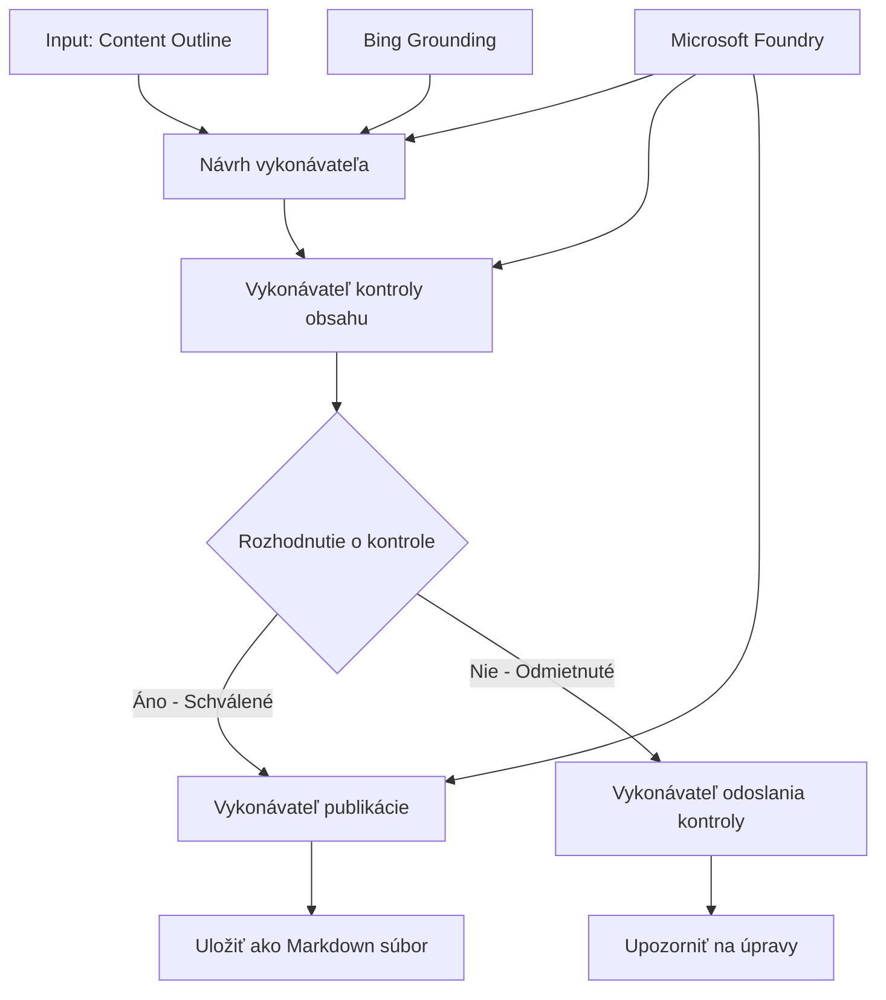

# 🔀 Podmienkové pracovné toky agentov s Microsoft Foundry (.NET)

## 📋 Návod na inteligentné rozhodovacie pracovné toky

Tento zošit demonštruje **podmienkové vzory pracovných tokov** pomocou Microsoft Foundry a Microsoft Agent Framework pre .NET. Naučíte sa, ako vytvárať sofistikované, rozhodovaním riadené pracovné toky, ktoré inteligentne smerujú spracovanie na základe AI analýzy, obchodných pravidiel a dynamických podmienok pre automatizáciu na úrovni podniku.

## 🎯 Ciele učenia

### 🧠 **Architektúra inteligentného rozhodovania**
- **Implementácia podmienkovej logiky**: Vytvárajte komplexné rozhodovacie stromy s viacerými rozvetveniami
- **Smerovanie s podporou AI**: Použite modely Microsoft Foundry na inteligentné rozhodovanie o smerovaní
- **Dynamická adaptácia pracovných tokov**: Meniť správanie pracovného toku na základe analýzy a podmienok za behu
- **Integrácia podnikového pravidelníka**: Včleňte obchodnú logiku a požiadavky na súlad do pracovných tokov

### 🔀 **Pokročilé podmienkové vzory**
- **Viackritériové rozhodovanie**: Vyhodnoťte viacero faktorov pre rozhodnutia o smerovaní
- **Spracovanie s ohľadom na kontext**: Robte rozhodnutia na základe nahromadeného kontextu a histórie pracovného toku
- **Adaptívna modifikácia pracovných tokov**: Dynamicky prispôsobujte spracovateľské cesty na základe reálnych podmienok
- **Integrácia pravidelného enginu**: Implementujte sofistikované obchodné pravidelné enginy v pracovných tokoch

### 🏢 **Podnikové podmienkové aplikácie**
- **Klasifikácia a smerovanie dokumentov**: Automaticky klasifikujte a smerujte dokumenty do príslušných pracovných tokov
- **Triedenie zákazníckeho servisu**: Inteligentné smerovanie zákazníckych dopytov na špecializované tímy
- **Spracovanie súladu a rizík**: Používajte rôzne validačné a kontrolné procesy na základe hodnotenia rizika
- **Pracovné toky zaručujúce kvalitu**: Smerujte obsah cez príslušné kontrolné procesy na základe metrík kvality

## ⚙️ Predpoklady a nastavenie

### 📦 **Požadované NuGet balíky**

Pokročilé balíky na spracovanie podmienkových pracovných tokov:

```xml
<!-- Core AI Framework -->
<PackageReference Include="Microsoft.Extensions.AI" Version="9.9.0" />

<!-- Azure AI Agents with Persistent State -->
<PackageReference Include="Azure.AI.Agents.Persistent" Version="1.2.0-beta.5" />

<!-- Azure Identity and Utilities -->
<PackageReference Include="Azure.Identity" Version="1.15.0" />
<PackageReference Include="System.Linq.Async" Version="6.0.3" />
<PackageReference Include="DotNetEnv" Version="3.1.1" />

<!-- Local Workflow Framework References -->
<!-- Microsoft.Agents.Workflows.dll - Advanced workflow orchestration -->
<!-- Microsoft.Agents.AI.AzureAI.dll - Microsoft Foundry integration -->
<!-- Microsoft.Agents.AI.dll - Core agent abstractions -->
```

### 🔑 **Konfigurácia Microsoft Foundry**

**Požadované Azure zdroje:**
- Pracovný priestor Microsoft Foundry s modelmi pre podmienkové spracovanie
- Azure predplatné s príslušnými kvótami výpočtovej kapacity a povoleniami
- Nasadené AI modely na rozhodovanie a analýzu obsahu
- (Voliteľné) Pripojenie k Bing Search API pre schopnosti podkladania informácií

**Konfigurácia prostredia (súbor .env):**
```env
# Microsoft Foundry Configuration
AZURE_AI_PROJECT_ENDPOINT=https://your-project.cognitiveservices.azure.com/
BING_CONNECTION_ID=your-bing-connection-id
```

**Nastavenie autentifikácie:**
```csharp
// Azure CLI or Managed Identity authentication
using Azure.Identity;
var credential = new AzureCliCredential();

// Load environment configuration
DotNetEnv.Env.Load("../../../.env");
```

### 🏗️ **Architektúra podmienkového pracovného toku**



**Kľúčové komponenty:**
- **Draft Executor**: AI agent, ktorý vytvára počiatočné koncepty obsahu z osnov
- **Content Review Executor**: AI agent, ktorý hodnotí kvalitu a súlad konceptov
- **Podmienkové smerovanie**: Rozhodovacia logika, ktorá smeruje na základe výsledkov hodnotenia
- **Cesty publikovania/skladovania**: Oddelené spracovateľské cesty pre schválený vs zamietnutý obsah
- **Správa stavu**: Udržiava kontext obsahu a hodnotenia počas celého pracovného toku

## 🎨 **Dizajnové vzory podmienkových pracovných tokov**

### 📋 **Výroba obsahu s kvalitatívnymi bránami**
```
Outline → Draft Creation → Quality Review → {Approve: Publish | Reject: Revise}
```

### 🎯 **Spracovanie dokumentov na základe rizika**
```
Document → Risk Assessment → {Low: Standard | High: Enhanced Review}
```

### 🔍 **Inteligentné smerovanie zákazníckeho servisu**
```
Customer Query → Analysis → {Simple: FAQ Bot | Complex: Human Agent}
```

### 💼 **Pracovné toky riadené súladom**
```
Content → Compliance Check → {Pass: Publish | Fail: Legal Review}
```

## 🏢 **Výhody podnikového podmienkového spracovania**

### 🎯 **Inteligentná automatizácia**
- **Chytré rozhodovanie**: Rozhodnutia o smerovaní poháňané AI na základe analýzy obsahu a kontextu
- **Adaptívne spracovanie**: Pracovné toky, ktoré sa automaticky prispôsobujú meniacim sa podmienkam
- **Uplatňovanie obchodných pravidiel**: Automatická aplikácia komplexnej obchodnej logiky a pravidiel
- **Smerovanie s ohľadom na kontext**: Rozhodnutia na základe celej histórie pracovného toku a nahromadeného kontextu

### 📈 **Prevádzková dokonalosť**
- **Optimalizované prideľovanie zdrojov**: Smerovanie práce k najvhodnejším špecialistom a procesom
- **Znížená manuálna intervencia**: Automatizované rozhodovanie minimalizuje potrebu ľudského smerovania
- **Rýchlejšie vyriešenie**: Priame smerovanie k príslušnej expertíze a spracovateľským kapacitám
- **Konzistentná aplikácia**: Jednotné uplatňovanie obchodných pravidiel a rozhodovacích kritérií

### 🛡️ **Rizikový manažment a súlad**
- **Automatizované hodnotenie rizika**: AI riadené hodnotenie úrovne rizika obsahu a situácie
- **Vynucovanie súladu**: Automatické smerovanie cez požadované regulačné procesy
- **Aplikácia bezpečnostných protokolov**: Zvýšené bezpečnostné opatrenia podľa hodnotenia rizika
- **Udržiavanie auditného záznamu**: Kompletná dokumentácia rozhodnutí o smerovaní a ich odôvodnení

### 📊 **Analytika a neustále zlepšovanie**
- **Analýza rozhodnutí**: Sledovanie účinnosti a presnosti rozhodnutí o smerovaní
- **Rozpoznávanie vzorov**: Identifikácia trendov a vzorov v rozhodnutiach počas času
- **Optimalizácia výkonnosti**: Neustále zdokonaľovanie rozhodovacích kritérií a efektivity smerovania
- **Business Intelligence**: Prehľady o charakteristikách obsahu a požiadavkách na spracovanie

### 🔧 **Technická dokonalosť**
- **Trvalá správa stavu**: Udržiavanie komplexného stavu počas vykonávania pracovného toku
- **Škálovateľná architektúra**: Zvládanie vysokootáčkových požiadaviek na podmienkové spracovanie
- **Integrácia**: Bezproblémová integrácia s existujúcimi obchodnými systémami a procesmi
- **Monitorovanie a observabilita**: Komplexné sledovanie výkonnosti pracovného toku a rozhodnutí

Poďme vytvoriť inteligentné, rozhodovaním riadené podnikové pracovné toky v .NET! 🚀

## 💻 Spustenie kódu

Kompletná implementácia je dostupná v `04.dotnet-agent-framework-workflow-aifoundry-condition.cs`. Táto ukazuje **pracovný tok výroby obsahu s kvalitatívnymi bránami**:

### 🏗️ **Architektúra pracovného toku**

```
Content Outline → Draft Creation → Quality Review → Conditional Routing:
                                                      ├─ Approved (>200 words) → Publish
                                                      └─ Rejected (<200 words) → Review Notification
```

**Agent v pracovnom toku:**
1. **Evangelist Agent**: Vytvára koncepty návodov z osnov s Bing podkladom
2. **Content Reviewer Agent**: Hodnotí kvalitu konceptov (počet slov, úplnosť)
3. **Publisher Agent**: Ukladá schválený obsah ako timestampované Markdown súbory

**Vlastní vykonávateľia:**
1. **DraftExecutor**: Orchestru spracovania tvorby konceptov
2. **ContentReviewExecutor**: Vykonáva hodnotenie kvality
3. **PublishExecutor**: Rieši publikovanie schváleného obsahu
4. **SendReviewExecutor**: Spravuje oznámenia o zamietnutí obsahu

### 🚀 Spustenie príkladu

**Predpoklady:**
- Konfigurovaný pracovný priestor Microsoft Foundry
- Autentifikácia cez Azure CLI (`az login`)
- (Voliteľné) Pripojenie k vyhľadávaniu Bing pre podkladové informácie

```bash
# Urobiť skript spustiteľným (Unix/Linux/macOS)
chmod +x 04.dotnet-agent-framework-workflow-aifoundry-condition.cs

# Spustiť podmienený pracovný tok
./04.dotnet-agent-framework-workflow-aifoundry-condition.cs
```

Alebo na systéme Windows:
```powershell
dotnet run 04.dotnet-agent-framework-workflow-aifoundry-condition.cs
```

### 📝 Očakávaný výstup

Pracovný tok:
1. **Vytvorí agentov**: Inicializuje troch špecializovaných agentov Microsoft Foundry
2. **Vygeneruje koncept**: Evangelist agent vytvorí koncept návodu z osnov
3. **Skontroluje obsah**: Content Reviewer hodnotí kvalitu konceptu
4. **Podmienkové smerovanie**:
   - **Ak schválený (>200 slov)**: Publish executor uloží ako Markdown súbor
   - **Ak zamietnutý (<200 slov)**: Pošle oznámenie o revízii
5. **Zobrazí výsledky**: Ukáže finálny výsledok pracovného toku

### 🔧 Možnosti prispôsobenia

**Upravte kritériá hodnotenia:**
```csharp
const string ContentReviewerInstructions = @"
You are a content reviewer...
1. Check if content is more than 500 words (instead of 200)
2. Verify technical accuracy
3. Ensure proper formatting
...";
```

**Pridajte viac podmienkových ciest:**
```csharp
var workflow = new WorkflowBuilder(draftExecutor)
    .AddEdge(draftExecutor, contentReviewerExecutor)
    .AddEdge(contentReviewerExecutor, publishExecutor, condition: GetCondition("Excellent"))
    .AddEdge(contentReviewerExecutor, editExecutor, condition: GetCondition("Good"))
    .AddEdge(contentReviewerExecutor, sendReviewerExecutor, condition: GetCondition("Poor"))
    .Build();
```

**Zmeňte požiadavky na obsah:**
```csharp
string OUTLINE_Content = @"
# Your Custom Topic
## Section 1
https://your-reference-url
## Section 2
...
";
```

### 🎯 Reálne použitia

Tento podmienkový vzor pracovného toku je ideálny pre:
- **Systémy správy obsahu**: Automatizované redakčné pracovné toky s kvalitatívnymi bránami
- **Spracovanie dokumentov**: Smerovanie dokumentov na základe klasifikácie a súladu
- **Zákaznícka podpora**: Inteligentné smerovanie tiketov podľa zložitosti a naliehavosti
- **Právna kontrola**: Smerovanie zmlúv podľa hodnotenia rizika a hodnoty
- **Personálne procesy**: Smerovanie žiadostí cez príslušné skríningové pracovné toky

### 🔍 Pochopenie podmienkovej logiky

**Funkcia podmienky:**
```csharp
public Func<object?, bool> GetCondition(string expectedResult) =>
    reviewResult => reviewResult is ReviewResult review && review.Result == expectedResult;
```

Táto funkcia vytvára predikát, ktorý:
1. Kontroluje, či je výsledok typu `ReviewResult`
2. Porovnáva vlastnosť `Result` s očakávanou hodnotou
3. Vracia true/false pre určenie smerovania

**Hrany pracovného toku s podmienkami:**
```csharp
.AddEdge(contentReviewerExecutor, publishExecutor, condition: GetCondition("Yes"))
.AddEdge(contentReviewerExecutor, sendReviewerExecutor, condition: GetCondition("No"))
```

### 📊 Pokročilé funkcie

**Validácia JSON schémy:**
Pracovný tok používa JSON schémy na zabezpečenie štruktúrovaných odpovedí:

```csharp
// Define response structure
public class ReviewResult
{
    [JsonPropertyName("review_result")]
    public string Result { get; set; } = string.Empty;
    
    [JsonPropertyName("reason")]
    public string Reason { get; set; } = string.Empty;
    
    [JsonPropertyName("draft_content")]
    public string DraftContent { get; set; } = string.Empty;
}

// Apply to agent
ResponseFormat = ChatResponseFormat.ForJsonSchema(
    AIJsonUtilities.CreateJsonSchema(typeof(ReviewResult)), 
    "ReviewResult", 
    "Review Result From DraftContent"
)
```

**Integrácia Bing podkladania:**
Evangelist agent používa Bing podkladanie na prístup k aktuálnym informáciám v reálnom čase:

```csharp
var bingGroundingConfig = new BingGroundingSearchConfiguration(bing_conn_id);
BingGroundingToolDefinition bingGroundingTool = new(
    new BingGroundingSearchToolParameters([bingGroundingConfig])
);
```

To umožňuje agentovi sledovať URL adresy v osnove a extrahovať aktuálne informácie.

### 🛡️ Riešenie chýb

Pracovný tok obsahuje robustné riešenie chýb pre zamietnutý obsah:
- Neúspechy hodnotenia spúšťajú alternatívnu cestu
- Oznámenia poskytujú jasné dôvody zamietnutia
- Obsah sa zachováva na úpravu

### 🔄 Rozšírenie pracovného toku

**Pridajte slučku revízie:**
Vytvorte spätnú väzbu na automatickú novú tvorbu obsahu:

```csharp
.AddEdge(contentReviewerExecutor, publishExecutor, condition: GetCondition("Yes"))
.AddEdge(contentReviewerExecutor, draftExecutor, condition: GetCondition("No")) // Loop back
```

**Implementujte viacúrovňové hodnotenie:**
Pridajte viacero hodnotiacich faziet s rôznymi kritériami:

```csharp
.AddEdge(draftExecutor, technicalReviewer)
.AddEdge(technicalReviewer, editorialReviewer, condition: GetCondition("TechPass"))
.AddEdge(editorialReviewer, publishExecutor, condition: GetCondition("EditPass"))
```

Tento podmienkový vzor pracovného toku poskytuje základy pre budovanie sofistikovaných, inteligentných podnikových automatizačných systémov! 🚀

---

<!-- CO-OP TRANSLATOR DISCLAIMER START -->
**Vyhlásenie o zodpovednosti**:
Tento dokument bol preložený pomocou AI prekladateľskej služby [Co-op Translator](https://github.com/Azure/co-op-translator). Hoci sa snažíme o presnosť, vezmite prosím na vedomie, že automatické preklady môžu obsahovať chyby alebo nepresnosti. Pôvodný dokument v jeho natívnom jazyku by mal byť považovaný za autoritatívny zdroj. Pre kritické informácie sa odporúča profesionálny ľudský preklad. Nie sme zodpovední za žiadne nedorozumenia alebo nesprávne interpretácie vyplývajúce z použitia tohto prekladu.
<!-- CO-OP TRANSLATOR DISCLAIMER END -->