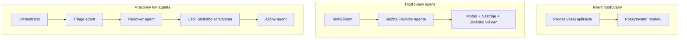
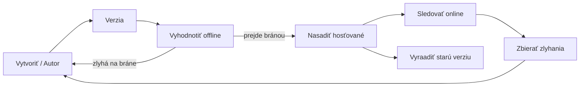
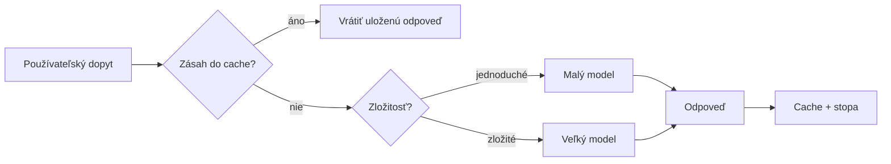
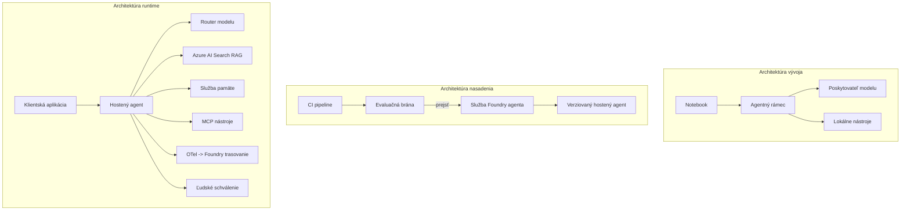

# Nasadenie škálovateľných agentov s Microsoft Foundry


Doposiaľ v kurze ste vytvorili agentov, ktorí bežia na vašom notebooku, v poznámkovom bloku, riadení príkazom `az login` a niekoľkými premennými prostredia. To je presne správny spôsob, ako sa učiť. Nie je to však správny spôsob, ako prevádzkovať agenta, na ktorého spoľahlivosť spolieha tisíce zákazníkov o tretej ráno.

Táto lekcia je o priekope medzi "funguje to na mojom stroji" a "funguje to spoľahlivo a cenovo efektívne v produkcii." Túto priepasť uzatvárame pomocou **Microsoft Foundry** a **Microsoft Foundry Agent Service**, a robíme to vytvorením skutočného zákazníckeho podpory agenta, ktorý má nástroje, vyhľadávanie, pamäť, hodnotenie a monitorovanie.

## Úvod

Táto lekcia pokryje:

- Rozdiel medzi **prototypovým agentom** a **nasadeným agentom** a prečo je prechod väčšinou o všetkom, čo je *okolo* modelu.
- **Vzory nasadenia** agentov: hosťované u klienta, hosťované službou (Hosted Agents) a orchestrácia pracovného toku.
- **Životný cyklus agenta** na Microsoft Foundry — vytvorenie, verzovanie, nasadenie, hodnotenie, sledovanie, vyradenie z prevádzky.
- **Strategie škálovania**: smerovanie modelu, cacheovanie, súbežnosť a bezstavový dizajn.
- **Viditeľnosť** s OpenTelemetry a Foundry trasovaním.
- **Optimalizácia nákladov** prostredníctvom výberu modelu, smerovania a hodnotiacich brán.
- **Podnikové aspekty**: správa, schválenie človekom a bezpečný beh MCP serverov v produkcii.

## Ciele učenia

Po dokončení tejto lekcie budete vedieť:

- Vybrať správny vzor nasadenia pre dané pracovné zaťaženie agenta.
- Nasadiť agenta do Microsoft Foundry Agent Service, aby bol verzovaný, spravovaný a sledovateľný.
- Instrumentovať agenta pre trasovanie a prepojiť hodnotiacu sekvenciu, ktorá beží pred každým vydaním.
- Použiť smerovanie modelu a cacheovanie na udržanie latencie a nákladov pod kontrolou v škálovaní.
- Pridať schvaľovaciu bránu s ľudským zásahom pre rizikové akcie a integrovať MCP server bezpečne v produkcii.

## Predpoklady

Táto lekcia predpokladá, že ste dokončili predchádzajúce lekcie a ste oboznámení s:

- Vytváraním agentov pomocou [Microsoft Agent Framework](../14-microsoft-agent-framework/README.md) (Lekcia 14).
- [Používaním nástrojov](../04-tool-use/README.md) (Lekcia 4) a [Agentic RAG](../05-agentic-rag/README.md) (Lekcia 5).
- [Pamäťou agenta](../13-agent-memory/README.md) (Lekcia 13) a [Agentic protokolmi / MCP](../11-agentic-protocols/README.md) (Lekcia 11).
- [Viditeľnosťou a hodnotením](../10-ai-agents-production/README.md) (Lekcia 10) — táto lekcia na tom priamo stavia.

Budete tiež potrebovať:

- **Predplatné Azure** a **projekt Microsoft Foundry** s aspoň jedným nasadeným chat modelom.
- **Autentifikovanú Azure CLI** (`az login`).
- Python 3.12+ a balíčky uložené v repozitári [`requirements.txt`](../../../requirements.txt).

## Od prototypu k produkcii: čo sa vlastne mení

Prototypový agent a produkčný agent zdieľajú rovnakú základnú slučku — uvažovanie, volanie nástrojov, odpoveď. Mení sa všetko, čo je zabalené okolo tejto slučky. Model je možno 20 % produkčného agenta; zvyšných 80 % tvorí operačný skelet.

| Oblasť | Prototyp | Produkcia |
| --- | --- | --- |
| **Hosťovanie** | Beží vo vašom poznámkovom bloku | Beží ako hosťovaná služba, verzovaná a rozširovaná |
| **Identita** | Váš token `az login` | Spravovaná identita s cieľovým RBAC |
| **Stav** | V pamäti, stratí sa pri reštarte | Externý (uložisko vlákien, služba pamäte) |
| **Zlyhanie** | Vidíte sledovanie chýb | Opakovania, záložné plány, dead-letter, upozornenia |
| **Náklady** | „Je to pár centov“ | Evidované na požiadavku, smerované, cacheované, vnorené do rozpočtu |
| **Kvalita** | Posudzuje sa vizuálne | Automaticky hodnotené pred každým vydaním |
| **Dôvera** | Schvaľujete každú akciu | Politika + človek v slučke pre rizikové akcie |

Majte túto tabuľku na pamäti. Každá sekcia nižšie zodpovedá jednému riadku tejto tabuľky.

## Vzory nasadenia agentov

Existujú tri vzory, ktoré budete používať, často v kombinácii.

### 1. Agentov hosťovaných u klienta

Agent objekt žije vo vnútri *vášho* aplikačného procesu. Váš kód volá modelového poskytovateľa priamo; uvažovacia slučka beží vo vašej službe. To je to, čo robila každá predchádzajúca lekcia.

- **Používajte ho, keď** potrebujete plnú kontrolu nad slučkou, vlastný middleware alebo keď vkladáte agenta do existujúceho backendu.
- **Nevýhoda**: sami spravujete škálovanie, stav a odolnosť.

### 2. Hosťovaní agenti (Foundry Agent Service)

Agent je *zaregistrovaný ako zdroj* v Microsoft Foundry. Foundry hosťuje uvažovaciu slučku, ukladá vlákna, presadzuje bezpečnosť obsahu a RBAC a robí agenta viditeľným v Foundry portáli. Vaša aplikácia sa stáva ľahkým klientom, ktorý vytvára vlákna a číta odpovede.

- **Používajte ho, keď** chcete trvácnosť, vstavanú viditeľnosť, správu a menšiu operačnú záťaž.
- **Nevýhoda**: menej nízkoúrovňovej kontroly výmenou za spravované runtime prostredie.

### 3. Pracovné toky agentov

Viacero agentov (a nástrojov) je zložených do grafu s explicitným riadeným tokom — sekvenčné kroky, vetvenie, uzly schvaľovania človekom a trvácne kontrolné body, ktoré môžu pozastaviť a obnoviť proces. Toto je schopnosť Microsoft Agent Framework **Workflows** aplikovaná na škálovanie nasadenia.

- **Používajte ho, keď** jedna úloha zahŕňa niekoľko špecializovaných agentov alebo vyžaduje schvaľovací krok uprostred.
- **Nevýhoda**: viac pohyblivých častí; vyžaduje viditeľnosť na úrovni orchestrácie.



## Životný cyklus agenta na Microsoft Foundry

Nasadenie agenta nie je jednorazový `push`. Je to slučka, ktorá veľmi pripomína cyklus vydávania softvéru, pretože presne o to ide.



Kľúčová myšlienka, prevzatá z [Lekcie 10](../10-ai-agents-production/README.md): **offline hodnotenie je brána, nie dodatočný krok.** Nová verzia agenta sa nevydá, pokiaľ neprejde vašimi hodnotiacimi prahmi. Online viditeľnosť potom spätné vstupy z reálnych zlyhaní vracia do offline testovacej súpravy. To je celá slučka.

## Strategie škálovania

Škálovanie agenta sa líši od škálovania bezstavového webového API, pretože každá požiadavka môže spustiť viacero nákladných volaní modelu a nástrojov. Štyri techniky prenesú väčšinu záťaže.

**Bezstavná správa požiadaviek.** Neuchovávajte stav pre používateľa v pamäti vášho procesu. Ukladajte konverzačné vlákna v Foundry úložisku vlákien alebo službe pamäte, aby ktorákolvek inštancia mohla spracovať ktorúkoľvek požiadavku. To vám umožňuje horizontálne škálovanie — pridajte inštancie, bez viazaných relácií.

**Smerovanie modelu.** Nie každá požiadavka potrebuje váš najvýkonnejší (a najdrahší) model. Smerujte jednoduché požiadavky – klasifikáciu zámeru, krátke faktické odpovede – na malý, rýchly model a vyhradzujte veľký model pre skutočné uvažovanie. Foundry **Model Router** to môže urobiť za vás, alebo si môžete implementovať ľahký klasifikátor sami. DIY verziu vybudujete v labáku.

**Cacheovanie odpovedí.** Mnohé podporné otázky sú takmer duplikáty ("ako si resetujem heslo?"). Ukladajte odpovede na časté otázky do cache a podávajte ich bez potreby volania modelu. Aj skromný podiel zásahov do cache významne znižuje náklady a latenciu.

**Súbežnosť a spätný tlak.** Poskytovatelia modelov majú obmedzenia rýchlosti. Obmedzte svoju súbežnosť, používajte opakovania s exponenciálnym časovým odstupom a zlyhajte elegantne (zaradená odpoveď „pracujeme na tom“ prevažuje nad chybou 500).



## Viditeľnosť v produkcii

Nemôžete prevádzkovať to, čo nevidíte. Ako bolo pokryté v Lekcii 10, Microsoft Agent Framework nativne emituje **OpenTelemetry** stopy — každé volanie modelu, nástroja a orchestrácie sa stáva spanom. V produkcii exportujete tie span-y do Microsoft Foundry (alebo akéhokoľvek OTel-kompatibilného backendu), aby ste mohli:

- Trace-ovať jednu zákaznícku sťažnosť end-to-end cez každé volanie modelu a nástroja.
- Sledovať latenciu p50/p95 a náklady na požiadavku v čase.
- Upozorňovať na nárasty chybovosti a anomálie v nákladoch skôr, než si ich všimnú vaši používatelia (alebo váš finančný tím).

```python
from agent_framework.observability import get_tracer

tracer = get_tracer()

with tracer.start_as_current_span("support_request") as span:
    span.set_attribute("customer.tier", "enterprise")
    span.set_attribute("routed.model", "gpt-5-nano")
    # vykonávanie agenta je automaticky sledované v rámci tohto rozsahu
```

Atribúty ako `customer.tier` a `routed.model` sú tým, čo mení množinu stôp na zodpovedateľné otázky („smerujú sa podnikový zákazníci príliš často na malý model?“).

## Optimalizácia nákladov

Náklady v produkčných agentoch dominujú tokeny. Tri páky, podľa vplyvu:

1. **Správna veľkosť modelu.** Malý model, ktorý prejde vašou hodnotiacou bránou, je takmer vždy lacnejší než veľký, ktorý tiež prejde. Použite hodnotenie na *dokázanie*, že malý model je dostatočný namiesto prednastavenia najväčšieho modelu z obavy.
2. **Smerujte podľa komplexnosti.** Ako bolo uvedené — platíte cenu veľkého modelu iba za požiadavky, ktoré vyžadujú uvažovanie veľkým modelom.
3. **Agresívne cacheovanie.** Najlacnejšie volanie modelu je to, ktoré nikdy neurobíte.

Hodnotiace brány a kontrola nákladov sú tá istá disciplína pozeraná z dvoch uhlov: hodnotenie vám určuje *kvalitatívne minimum*, smerovanie a cacheovanie vás udržujú čo najbližšie k *nákladovému* minimu.

## Podnikové nasadzovacie úvahy

**Správa.** Hosťovaní agenti zdedia Foundry RBAC, bezpečnosť obsahu a auditovanie. Každému agentovi dajte spravovanú identitu s najmenším možným oprávnením — iba na čítanie znalostnej databázy, cieľový prístup k API na ticketovanie, nič viac.

**Človek v slučke.** Niektoré akcie sú príliš závažné na úplnú automatizáciu — vystavenie refundácie, vymazanie účtu, eskalácia právnemu tímu. Microsoft Agent Framework podporuje **nástroje vyžadujúce schválenie**: agent navrhne akciu, vykonávanie sa pozastaví, človek schváli alebo zamietne a pracovný tok pokračuje. Túto primitívnu funkcionalitu ste videli v [Lekcii 6](../06-building-trustworthy-agents/README.md); tu ju nasadíte.

**MCP v produkcii.** [MCP](../11-agentic-protocols/README.md) umožňuje vášmu agentovi využívať externé nástroje cez štandardné rozhranie. V produkcii pristupujte ku každému MCP serveru ako k nedôveryhodnej hranici: pripevnite verziu servera, spúšťajte ho so scoped identitou, overujte jeho výstupy a nikdy mu nesprístupňujte tajomstvá. MCP server je závislosť, a závislosti sa záplatujú, auditujú a majú limit rýchlosti.



Tieto tri diagramy — vývoj, nasadenie, runtime — sú ten istý agent v troch štádiách svojho života. Lab, ktorý nasleduje, vás prevedie jeho zostavením.

## Praktický lab: Produkčne pripravený zákaznícky podporný agent

Otvorte [`code_samples/16-python-agent-framework.ipynb`](./code_samples/16-python-agent-framework.ipynb) a prejdite si ho celý. Zostavíte **Contoso zákazníckeho podporného agenta** so všetkými produkčnými záležitosťami zapracovanými:

1. **Volanie nástrojov** — vyhľadajte stav objednávky a otvorte podporné tikety.
2. **RAG** — odpovedajte na otázky o politike zo znalostnej databázy (Azure AI Search, s in-memory fallback pre beh poznámkového bloku bez Search zdroja).
3. **Pamäť** — pamätajte si zákazníka počas celej konverzácie.
4. **Smerovanie modelu** — klasifikátor komplexnosti nasmeruje každú požiadavku na malý alebo veľký model.
5. **Cacheovanie odpovedí** — opakované otázky sa podávajú z cache.
6. **Schvaľovanie človekom** — refundácie nad určitú hranicu sa pozastavia na ľudské schválenie.
7. **Hodnotiaci pipeline** — malá offline testovacia sada hodnotí agenta a slúži ako brána pre vydanie.
8. **Viditeľnosť** — OpenTelemetry tracing okolo každej požiadavky.

### Prechádzka

Poznámkový blok je organizovaný tak, že každá produkčná záležitosť je samostatná, spustiteľná časť. Srdcom je request handler, ktorý spája smerovanie s cacheovaním:

```python
async def handle_support_request(query: str, customer_id: str) -> str:
    # 1. Podávajte z cache, keď to je možné.
    cached = response_cache.get(normalize(query))
    if cached:
        return cached

    # 2. Smerujte podľa zložitosti na kontrolu nákladov.
    model = "gpt-5-nano" if is_simple(query) else "gpt-5-mini"

    # 3. Spúšťajte agenta vo vnútri sledovacieho rozsahu pre pozorovateľnosť.
    with tracer.start_as_current_span("support_request") as span:
        span.set_attribute("routed.model", model)
        span.set_attribute("customer.id", customer_id)
        response = await support_agent.run(query, model=model)

    # 4. Uložte do cache a vráťte.
    response_cache.set(normalize(query), response.text)
    return response.text
```

Hodnotiaca brána, ktorá stráži vydanie, vyzerá takto:

```python
async def evaluation_gate(agent, test_cases, threshold: float = 0.8) -> bool:
    passed = 0
    for case in test_cases:
        result = await agent.run(case["input"])
        if score_response(result.text, case["expected"]) >= 0.8:
            passed += 1
    pass_rate = passed / len(test_cases)
    print(f"Evaluation pass rate: {pass_rate:.0%} (gate: {threshold:.0%})")
    return pass_rate >= threshold  # nasadiť iba ak brána prejde
```

Prečítajte si každý riadok — poznámkový blok ponecháva primitíva úmyselne malé, aby nič nebolo skryté za volaním frameworku.

## Validácia nasadeného agenta pomocou Smoke Testov

Vyššie uvedená hodnotiaca brána beží *offline* voči vášmu agentovi objektu. Keď je agent nasadený ako Hosted Agent, potrebujete ešte jednu, ešte lacnejšiu kontrolu: **odpovedá nasadený endpoint vôbec?**

Nasadenie „úspešne“ len dokazuje, že riadiaca rovina akceptovala definíciu — nedokazuje, že agent odpovedá. Chýbajúca závislosť, nesprávne smerovanie modelu alebo vypršané pripojenie môžu spôsobiť zelené nasadenie, ktoré nič nevracia. **Smoke test** to zachytí za pár sekúnd, pri každom nasadení, bez nákladov na plné hodnotenie.

Tento repozitár obsahuje pripravený smoke-test pipeline založený na [AI Smoke Test](https://github.com/marketplace/actions/ai-smoke-test) GitHub Action:

- **Katalóg** — [`tests/lesson-16-smoke-tests.json`](../../../tests/lesson-16-smoke-tests.json) obsahuje podnety a overenia pre Contoso podporného agenta (odpovede založené na politike, vyhľadávanie objednávok, zostávanie v téme a kontinuita viacoturnovej konverzácie). Katalógy pre agentov iných lekcií sú vedľa neho — pozri [`tests/README.md`](../tests/README.md).
- **Workflow** — [`.github/workflows/smoke-test.yml`](../../../.github/workflows/smoke-test.yml) sa prihlási pomocou Azure OIDC a pošle každú výzvu na endpoint Responses agenta, neúspech úlohy pri akomkoľvek nezhodnom overení.

```yaml
- name: Smoke-test hosted agent
  uses: JFolberth/ai-smoketest@v1
  with:
    project_endpoint: ${{ inputs.project_endpoint }}
    agent_name: ContosoSupportAgent
    tests_file: tests/lesson-16-smoke-tests.json
```


Spustite to z karty **Actions** po nasadení svojho agenta a zadajte koncový bod projektu Foundry a meno agenta. Federovaná identita potrebuje na úrovni projektu Foundry rolu **Azure AI User**. Predstavte si vrstvy ako pyramídu: testy dymu (dostupné a reagujúce?) sa spúšťajú pri každom nasadení, offline hodnotenie (dostatočne dobré na vydanie?) sa spúšťa pred propagáciou a online hodnotenie (ako si vedie v reálnom prostredí?) beží neustále.

## Overenie vedomostí

Otestujte svoje porozumenie pred pokračovaním k zadaniu.

**1. Približne koľko z produkčného agenta tvorí „model“ a čo je zvyšok?**

<details>
<summary>Odpoveď</summary>

Model tvorí menšinu systému — často sa uvádza okolo 20 %. Zvyšok je operačný skelet: hostovanie a verzovanie, identita a RBAC, externý stav, spracovanie chýb, sledovanie nákladov, hodnotenie a kontroly s ľudským zapojením. Presun do produkcie je väčšinou o vybudovaní všetkého *okolo* cyklu uvažovania.
</details>

**2. Kedy by ste zvolili Hosted Agent namiesto klientom hosťovaného agenta?**

<details>
<summary>Odpoveď</summary>

Keď chcete spravované prostredie s zabudovanou odolnosťou (vlákna, ktoré pretrvávajú a môžu pokračovať), pozorovateľnosť, bezpečnosť obsahu a RBAC a ste ochotní obetovať čiastočnú nízkoúrovňovú kontrolu cyklu uvažovania za menšiu prevádzkovú plochu. Klientom hosťované je vhodné, keď potrebujete plnú kontrolu nad cyklom alebo osádzate agenta do existujúceho backendu.
</details>

**3. Prečo musí byť škálovateľný agent bezstavový vo vlastnej pamäti procesu?**

<details>
<summary>Odpoveď</summary>

Aby ktorákoľvek inštancia mohla spracovať akýkoľvek požiadavok, čo umožňuje horizontálne škálovanie bez viazaných relácií. Stav konverzácie na používateľa je externý v úložisku vláken alebo pamäťovej službe. Ak by bol stav v procesnej pamäti, pri reštarte by sa stratil a záťaž by sa nedala voľne distribuovať.
</details>

**4. Aký problém rieši smerovanie modelov a ako súvisí s hodnotením?**

<details>
<summary>Odpoveď</summary>

Smerovanie posiela jednoduché požiadavky malému, lacnému a rýchlemu modelu a vyhradzuje veľký model pre skutočné uvažovanie, čím kontroluje latenciu aj náklady. Súvisí to s hodnotením, lebo hodnotenie *dokazuje*, že malý model je dostatočný pre danú triedu požiadaviek — smerovanie bez hodnotenia je len odhadovanie.
</details>

**5. Čo je „evaluačná brána“ a kde sa nachádza v životnom cykle?**

<details>
<summary>Odpoveď</summary>

Evaluačná brána spúšťa offline testy na novej verzii agenta a blokuje nasadenie, pokiaľ miera úspešnosti neprekročí prah. Nachádza sa medzi "verziou" a "nasadením" v životnom cykle, čím robí kvalitu podmienkou vydania namiesto kontroly po uvoľnení.
</details>

**6. Prečo by mal byť MCP server považovaný za nedôveryhodnú hranicu v produkcii?**

<details>
<summary>Odpoveď</summary>

Pretože je to externá závislosť, do ktorej váš agent volá. Mali by ste pripnúť jeho verziu, spúšťať ho s obmedzenou identitou, overovať jeho výstupy, obmedzovať počet volaní a nikdy mu nesmiete odhaliť tajomstvá — rovnaká disciplína ako pri akejkoľvek závislosti tretích strán. Jeho výstupy vstupujú do uvažovania agenta, takže neoverená dôvera predstavuje bezpečnostné riziko.
</details>

**7. Ktorá jedna zmena obvykle najviac ovplyvňuje náklady produkčného agenta a prečo?**

<details>
<summary>Odpoveď</summary>

Správna veľkosť modelu — použiť najmenší model, ktorý stále prejde evaluačnou bránou. Náklady dominujú tokeny a menší model, ktorý spĺňa kvalitatívny štandard, je takmer vždy lacnejší než väčší. Keďže cachovanie a smerovanie ďalej znižujú náklady, výber správneho základného modelu má najväčší prvotný dopad.
</details>

**8. Akú úlohu majú atribúty spanov ako `customer.tier` a `routed.model` v pozorovateľnosti?**

<details>
<summary>Odpoveď</summary>

Premieňajú surové trace na zodpovedateľné obchodné otázky. Bez atribútov máte len kopu spanov; s atribútmi môžete položiť otázky ako „sú podnikový zákazníci príliš často nasmerovaní na malý model?“ alebo „ktorý model spracováva naše najpomalšie požiadavky?“ Atribúty slúžia na delenie telemetrie podľa dimenzií dôležitých pre vašu prevádzku.
</details>

## Zadanie

Vezmite zákazníckeho support agenta z laboratória a zabezpečte ho pre konkrétny scenár: **agent podpory predplatného pre SaaS spoločnosť.**

Vaša odovzdaná práca by mala:

1. **Nahradiť nástroje** nástrojmi relevantnými pre fakturáciu: `get_subscription_status`, `get_invoice` a `issue_credit` (kredity nad $50 vyžadujú schválenie človekom).
2. **Pridať tri RAG dokumenty** pokrývajúce firemnú politiku vrátenia peňazí, fakturačný cyklus a politiku zrušenia.
3. **Rozšíriť evaluačný súbor** aspoň na osem prípadov, vrátane aspoň dvoch, ktoré *by mali* viesť k schváleniu človekom, a potvrdiť, že evaluačná brána správne prechádza alebo zlyháva.
4. **Pridať jednu správu o nákladoch**: po spracovaní desiatich zmiešaných požiadaviek agentom vypísať, koľko ich šlo na malý model, koľko na veľký model a koľko sa podarilo obslúžiť z cache.

Napíšte krátky odsek (v markdown bunke) vysvetľujúci, ktoré pravidlo smerovania modelu ste zvolili a ako by ste ho overili na reálnej prevádzke. Neexistuje jedna správna odpoveď — hodnotí sa, či ste produkčné záležitosti zosúladili koherentne.

## Zhrnutie

V tejto lekcii ste presunuli agenta z prototypu do produkcie s Microsoft Foundry:

- Skok do produkcie je väčšinou o **operačnom skelete** okolo modelu — hostovanie, identita, stav, spracovanie chýb, náklady, kvalita a dôvera.
- Naučili ste sa tri **vzory nasadenia** — klientom hosťované, Hosted Agents a Agent Workflows — a kedy ktorý používať.
- Prešli ste **životným cyklom agenta**, kde offline **hodnotenie funguje ako brána uvoľnenia** a online pozorovateľnosť vkladá zlyhania späť do testovacieho súboru.
- Aplikovali ste **škálovacie stratégie** — bezstavový dizajn, smerovanie modelu, cachovanie a obmedzenú súbežnosť — a spojili ich so **zoptimalizovaním nákladov**.
- Zaviedli ste **podnikové kontroly**: RBAC, schválenie ľudským operátorom a produkčne bezpečnú integráciu MCP.
- Vytvorili ste **produkčne pripraveného zákazníckeho support agenta**, ktorý spája všetky tieto záležitosti do spustiteľného kódu.

Nasledujúca lekcia ide opačným smerom: namiesto škálovania agentov do cloudu ich prenesiete *dole* na jeden vývojársky počítač a budete ich spúšťať úplne lokálne.

## Dodatočné zdroje

- <a href="https://learn.microsoft.com/azure/ai-foundry/what-is-azure-ai-foundry" target="_blank">Dokumentácia Microsoft Foundry</a>
- <a href="https://learn.microsoft.com/azure/ai-foundry/agents/overview" target="_blank">Prehľad služby Microsoft Foundry Agent</a>
- <a href="https://aka.ms/ai-agents-beginners/agent-framework" target="_blank">Microsoft Agent Framework</a>
- <a href="https://learn.microsoft.com/azure/ai-foundry/concepts/model-router" target="_blank">Model Router v Microsoft Foundry</a>
- <a href="https://learn.microsoft.com/azure/search/search-what-is-azure-search" target="_blank">Azure AI Search</a>
- <a href="https://opentelemetry.io/" target="_blank">OpenTelemetry</a>
- <a href="https://github.com/marketplace/actions/ai-smoke-test" target="_blank">AI Smoke Test GitHub Action</a>
- <a href="https://modelcontextprotocol.io/" target="_blank">Model Context Protocol (MCP)</a>

## Predošlá lekcia

[Vytváranie agentov na používanie počítača (CUA)](../15-browser-use/README.md)

## Nasledujúca lekcia

[Vytváranie lokálnych AI agentov](../17-creating-local-ai-agents/README.md)

---

<!-- CO-OP TRANSLATOR DISCLAIMER START -->
**Vyhlásenie o zodpovednosti**:
Tento dokument bol preložený pomocou AI prekladateľskej služby [Co-op Translator](https://github.com/Azure/co-op-translator). Hoci sa snažíme o presnosť, vezmite prosím na vedomie, že automatické preklady môžu obsahovať chyby alebo nepresnosti. Pôvodný dokument v jeho natívnom jazyku by mal byť považovaný za autoritatívny zdroj. Pre kritické informácie sa odporúča profesionálny ľudský preklad. Nie sme zodpovední za žiadne nedorozumenia alebo nesprávne interpretácie vyplývajúce z použitia tohto prekladu.
<!-- CO-OP TRANSLATOR DISCLAIMER END -->