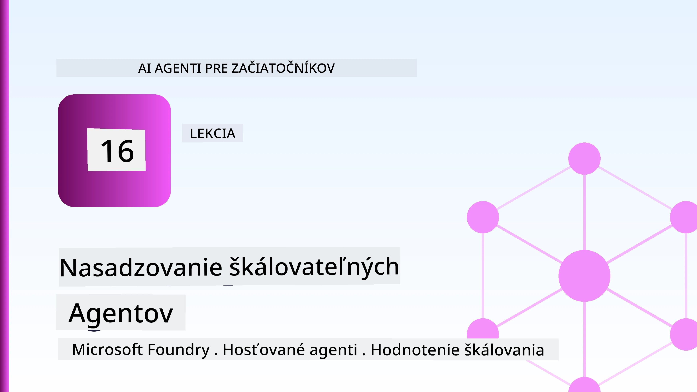
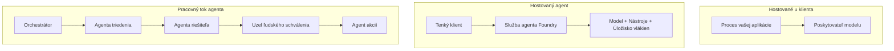
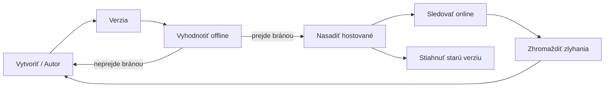
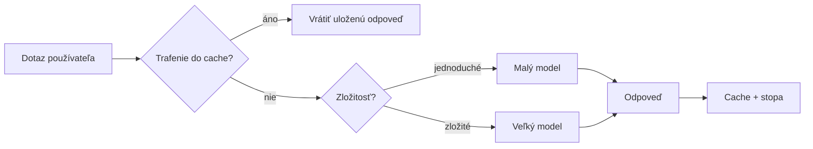
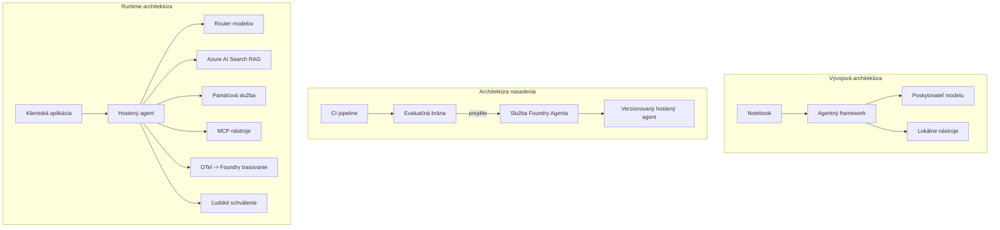

# Nasadzovanie škálovateľných agentov s Microsoft Foundry



Doteraz v kurze ste vytvárali agentov, ktorí bežia na vašom notebooku, vnútri poznámkového bloku, poháňaní `az login` a niekoľkými premennými prostredia. To je presne tá správna cesta na učenie. Nie je to však správny spôsob, ako prevádzkovať agenta, na ktorom závisia tisíce zákazníkov o 3 ráno.

Táto lekcia sa týka medzery medzi „funguje to na mojej mašine“ a „funguje to spoľahlivo a dostupne v produkcii“. Túto medzeru uzatvárame pomocou **Microsoft Foundry** a **Microsoft Foundry Agent Service**, pričom vytvárame reálneho agenta zákazníckej podpory, ktorý má nástroje, vyhľadávanie, pamäť, hodnotenie a monitorovanie.

## Úvod

Táto lekcia pokryje:

- Rozdiel medzi **prototypovým agentom** a **nasadeným agentom**, a prečo prechod spočíva hlavne vo všetkom *okolo* modelu.
- **Vzory nasadenia** pre agentov: klientom hostované, službou hostované (Hosted Agents) a orkestrované pracovné postupy.
- **Životný cyklus agenta** v Microsoft Foundry — vytvoriť, verzovať, nasadiť, vyhodnotiť, sledovať, vyradiť.
- **Stratégie škálovania**: smerovanie modelu, kešovanie, súbežnosť a bezstavový dizajn.
- **Sledovateľnosť** s OpenTelemetry a Foundry trasovaním.
- **Optimalizácia nákladov** cez výber modelu, smerovanie a hodnotiace brány.
- **Podnikové úvahy**: správa, schvaľovanie človekom a bezpečný chod MCP serverov v produkcii.

## Ciele učenia

Po dokončení tejto lekcie budete vedieť:

- Vybrať správny vzor nasadenia pre danú záťaž agenta.
- Nasadiť agenta do Microsoft Foundry Agent Service tak, aby bol verzovaný, spravovaný a sledovateľný.
- Instrumentovať agenta na trasovanie a prepojiť hodnotiaci pipeline, ktorý beží pred každým vydaním.
- Použiť smerovanie modelu a kešovanie na udržanie latencie a nákladov pod kontrolou v škálovateľnej prevádzke.
- Pridať bránu na schválenie človekom pre rizikové akcie a integrovať MCP server bezpečne v produkcii.

## Predpoklady

Táto lekcia predpokladá, že ste absolvovali predchádzajúce lekcie a ste oboznámení s:

- Vytváraním agentov pomocou [Microsoft Agent Framework](../14-microsoft-agent-framework/README.md) (Lekcia 14).
- [Používanie nástrojov](../04-tool-use/README.md) (Lekcia 4) a [Agentic RAG](../05-agentic-rag/README.md) (Lekcia 5).
- [Pamäť agenta](../13-agent-memory/README.md) (Lekcia 13) a [Agentic protokoly / MCP](../11-agentic-protocols/README.md) (Lekcia 11).
- [Sledovateľnosť a hodnotenie](../10-ai-agents-production/README.md) (Lekcia 10) — táto lekcia na to priamo nadväzuje.

Tiež budete potrebovať:

- **Azure predplatné** a **Microsoft Foundry projekt** s aspoň jedným nasadeným modelom chatu.
- Overený **Azure CLI** (`az login`).
- Python 3.12+ a balíky v repozitári [`requirements.txt`](../../../requirements.txt).

## Od prototypu k produkcii: Čo sa vlastne mení

Prototypový agent a produkčný agent zdieľajú rovnaký základný cyklus — rozmýšľať, volať nástroje, odpovedať. Mení sa všetko okolo tohto cyklu. Model tvorí zrejme 20 % produkčného agenta; zvyšných 80 % je operačný základ.

| Oblasť | Prototyp | Produkcia |
| --- | --- | --- |
| **Hostovanie** | Beží vo vašom poznámkovom bloku | Beží ako hostovaná služba, verzovaná a nasadzovaná |
| **Identita** | Váš token z `az login` | Spravovaná identita s obmedzeným RBAC |
| **Stav** | V pamäti, stratí sa pri reštarte | Externý (thread store, memory service) |
| **Zlyhanie** | Vidíte spätnú trasu chýb | Pokusy o opakovanie, záložné plány, dead-letter, upozornenia |
| **Náklady** | „Niečo málo centov“ | Sledované na požiadavku, smerované, kešované, rozpočtované |
| **Kvalita** | Pozriete si výstup | Automaticky hodnotené pred každým vydaním |
| **Dôvera** | Schvaľujete každú akciu | Politiky + schvaľovanie človekom pre rizikové akcie |

Majte túto tabuľku na pamäti. Každá sekcia nižšie zodpovedá jednému riadku.

## Vzory nasadenia agentov

Existujú tri vzory, ktoré budete často používať v kombinácii.

### 1. Klientom hostovaní agenti

Agent objekt žije v *vášom* aplikačnom procese. Váš kód volá priamo poskytovateľa modelu; cyklus uvažovania beží vo vašej službe. To je to, čo ste robili v každej predošlej lekcii.

- **Použite, keď** potrebujete plnú kontrolu nad cyklom, vlastný middleware, alebo vkladáte agenta do existujúceho backendu.
- **Kompenzácia**: sami zodpovedáte za škálovanie, stav a odolnosť.

### 2. Hostovaní agenti (Foundry Agent Service)

Agent je *registrovaný ako zdroj* v Microsoft Foundry. Foundry hostuje cyklus uvažovania, uchováva vlákna, zabezpečuje bezpečnosť obsahu a RBAC, a sprístupňuje agenta v portáli Foundry. Vaša aplikácia sa stáva tenkým klientom, ktorý vytvára vlákna a číta odpovede.

- **Použite, keď** chcete trvácnosť, zabudovanú sledovateľnosť, správu a menšiu operačnú záťaž.
- **Kompenzácia**: menej nízkoúrovňovej kontroly výmenou za riadené runtime.

### 3. Pracovné postupy agentov

Viacerí agenti (a nástroje) sa skladajú do grafu s explicitným riadením toku — sekvenčné kroky, rozvetvenie, uzly na schválenie človekom a trvácne kontrolné body, ktoré môžu pozastaviť a pokračovať. Toto je schopnosť **Workflows** Microsoft Agent Frameworku použitá na škálovanie produkcie.

- **Použite, keď** jedna úloha pokrýva viacerých špecializovaných agentov alebo vyžaduje krok schválenia v strede.
- **Kompenzácia**: viac pohyblivých častí; potrebuje sledovateľnosť na úrovni orkestrácie.



## Životný cyklus agenta v Microsoft Foundry

Nasadzovanie agenta nie je jednorazový `push`. Je to cyklus a veľmi pripomína životný cyklus vydávania softvéru, pretože presne to aj je.



Kľúčová myšlienka, prevzatá z [Lekcie 10](../10-ai-agents-production/README.md): **offline hodnotenie je bránou, nie druhoradý krok.** Nová verzia agenta nie je vydaná, pokiaľ neprejde hodnotiacimi prahmi. Online sledovateľnosť potom spätne privádza reálne chyby do offline testovacej sady. Toto je celý cyklus.

## Stratégie škálovania

Škálovanie agenta sa líši od škálovania bezstavového web API, pretože každá požiadavka môže vyvolať viacero nákladných volaní modelov a nástrojov. Štyri techniky nesú väčšinu zaťaženia.

**Bezstavové spracovanie požiadaviek.** V procese si neuchovávajte stav pre používateľa v pamäti. Ukladajte vlákna konverzácií do Foundry thread store alebo pamäťovej služby tak, aby ktorákoľvek inštancia zvládla ktorúkoľvek požiadavku. To vám umožňuje horizontálne škálovanie — pridávajte inštancie, bez pripútaných relácií.

**Smerovanie modelu.** Nie každá požiadavka potrebuje váš najvýkonnejší (a najdrahší) model. Pre jednoduche požiadavky — klasifikáciu zámeru, krátke faktické odpovede — použite malý, rýchly model, a veľký model si rezervujte na skutočné uvažovanie. Foundry **Model Router** to môže robiť za vás alebo si môžete implementovať vlastný ľahký klasifikátor. V laboratóriu postavíte vlastnú verziu.

**Kešovanie odpovedí.** Mnohé podporné dotazy sú takmer duplikáty („Ako si nastavím heslo?“). Kešujte odpovede na bežné otázky a odpovedajte bez volania modelu vôbec. Aj mierna miera zásahu do kešky výrazne znižuje náklady a latenciu.

**Súbežnosť a spätný tlak.** Poskytovatelia modelov majú limity na počet požiadaviek. Obmedzte svoju súbežnosť, používajte opakovanie s exponenciálnym odstupom a chybujte milosrdne (odpoveď „pracujeme na tom“ v poradí je lepšia než 500).



## Sledovateľnosť v produkcii

Nemôžete prevádzkovať to, čo nevidíte. Ako bolo pokryté v Lekcii 10, Microsoft Agent Framework natívne vydáva **OpenTelemetry** trasovanie — každé volanie modelu, nástroja a krok orkestrácie sa stane spanom. V produkcii tieto span exportujete do Microsoft Foundry (alebo akéhokoľvek backendu kompatibilného s OTel), aby ste mohli:

- Sledovať jedinú zákaznícku sťažnosť od začiatku až do konca cez všetky volania modelu a nástrojov.
- Sledovať p50/p95 latenciu a náklady na požiadavku v čase.
- Upozorniť na náhle nárasty chýb a anomálie nákladov skôr, než si to všimnú vaši používatelia (alebo váš finančný tím).

```python
from agent_framework.observability import get_tracer

tracer = get_tracer()

with tracer.start_as_current_span("support_request") as span:
    span.set_attribute("customer.tier", "enterprise")
    span.set_attribute("routed.model", "gpt-4.1-mini")
    # vykonávanie agenta je automaticky sledované v rámci tohto rozsahu
```

Atribúty ako `customer.tier` a `routed.model` premieňajú koncentrovanú masu tras na zodpovedateľné otázky („sú podnikový zákazníci príliš často smerovaní na malý model?“).

## Optimalizácia nákladov

Náklady v produkčných agentoch dominujú tokeny. Tri páky, zoradené podľa vplyvu:

1. **Správne veľkosť modelu.** Malý model, ktorý prejde hodnotiacou bránou, je takmer vždy lacnejší než veľký, ktorý tiež prejde. Použite hodnotenie, aby ste *preukázali*, že malý model je dostatočný, namiesto toho, aby ste z opatrnosti volili najväčší model.
2. **Smerujte podľa zložitosti.** Ako vyššie — platíte cenu veľkého modelu iba za požiadavky, ktoré potrebujú jeho uvažovanie.
3. **Kešujte agresívne.** Najlacnejšie volanie modelu je také, ktoré vôbec neurobíte.

Hodnotiace brány a kontrola nákladov sú rovnaká disciplína pozretá z dvoch uhlov: hodnotenie vám hovorí o *kvalitnej spodnej hranici*, smerovanie a kešovanie vás udrží čo najbližšie k jej *nákladom*.

## Podnikové úvahy pri nasadení

**Správa.** Hosted Agents dedí RBAC, bezpečnosť obsahu a auditné logovanie Foundry. Každému agentovi dajte spravovanú identitu s minimálnym oprávnením, ktoré potrebuje — prístup iba na čítanie do znalostnej bázy, obmedzený prístup k API ticketovaniu, nič viac.

**Človek v slučke.** Niektoré akcie sú príliš závažné na úplnú automatizáciu — vrátenie peňazí, odstránenie účtu, eskalácia na právne oddelenie. Microsoft Agent Framework podporuje nástroje vyžadujúce **schválenie**: agent navrhne akciu, vykonanie sa pozastaví, človek ju schváli alebo odmietne a pracovný postup pokračuje. Tento primitív ste videli v [Lekcii 6](../06-building-trustworthy-agents/README.md); tu ho nasadíte.

**MCP v produkcii.** [MCP](../11-agentic-protocols/README.md) umožňuje agentovi využívať externé nástroje cez štandardné rozhranie. V produkcii zaobchádzajte s každým MCP serverom ako s nedôveryhodnou hranicou: pridržte verziu servera, spúšťajte ho so spravovanou identitou, overujte jeho výstupy a nikdy mu nezverujte tajomstvá. MCP server je závislosť a závislosti sa patchujú, auditujú a nastavujú limity.



Tieto tri diagramy — vývoj, nasadenie, runtime — sú ten istý agent v troch štádiách života. Laboratórium, ktoré nasleduje, vás prevedie jeho stavbou.

## Praktické laboratórium: Agent zákazníckej podpory pripravený na produkciu

Otvorte [`code_samples/16-python-agent-framework.ipynb`](./code_samples/16-python-agent-framework.ipynb) a prejdite si ho celý. Zostavíte **agenta zákazníckej podpory Contoso** so všetkými produkčnými aspektmi:

1. **Volanie nástrojov** — vyhľadávanie stavu objednávky a otváranie tiketov podpory.
2. **RAG** — odpovede na otázky politiky zo znalostnej bázy (Azure AI Search, s pamäťovou zálohou, aby poznámkový blok bežal bez Search zdroja).
3. **Pamäť** — zapamätanie si zákazníka v priebehu konverzácie.
4. **Smerovanie modelu** — klasifikátor zložitosti smeruje každú požiadavku na malý alebo veľký model.
5. **Kešovanie odpovedí** — opakované otázky sa servírujú z keše.
6. **Schválenie človekom** — vrátenia nad prahom čakajú na ľudské potvrdenie.
7. **Hodnotiaci pipeline** — malá offline testovacia sada hodnotí agenta a slúži ako brána pre vydanie.
8. **Sledovateľnosť** — OpenTelemetry trasovanie okolo každej požiadavky.

### Prehľad

Poznámkový blok je usporiadaný tak, aby každý produkčný aspekt bol samostatná, spustiteľná časť. Jadro tvorí spracovateľ požiadaviek spájajúci smerovanie a kešovanie:

```python
async def handle_support_request(query: str, customer_id: str) -> str:
    # 1. Podávajte z pamäte cache, keď je to možné.
    cached = response_cache.get(normalize(query))
    if cached:
        return cached

    # 2. Smerujte podľa zložitosti na kontrolu nákladov.
    model = "gpt-4.1-mini" if is_simple(query) else "gpt-4.1"

    # 3. Spustite agenta v rámci trace span pre pozorovateľnosť.
    with tracer.start_as_current_span("support_request") as span:
        span.set_attribute("routed.model", model)
        span.set_attribute("customer.id", customer_id)
        response = await support_agent.run(query, model=model)

    # 4. Uložte do cache a vráťte.
    response_cache.set(normalize(query), response.text)
    return response.text
```

Brána hodnotenia, ktorá stráži vydanie, vyzerá takto:

```python
async def evaluation_gate(agent, test_cases, threshold: float = 0.8) -> bool:
    passed = 0
    for case in test_cases:
        result = await agent.run(case["input"])
        if score_response(result.text, case["expected"]) >= 0.8:
            passed += 1
    pass_rate = passed / len(test_cases)
    print(f"Evaluation pass rate: {pass_rate:.0%} (gate: {threshold:.0%})")
    return pass_rate >= threshold  # nasadiť iba ak brána prejde
```

Prečítajte všetky riadky — poznámkový blok drží primitívy úmyselne malé, aby nič nebolo schované za volaním rámca.

## Overovanie nasadeného agenta pomocou testov dymu

Vyššie uvedená brána hodnotenia beží *offline* voči vášmu agentovi. Akonáhle je agent nasadený ako Hosted Agent, potrebujete ešte jednu, ešte lacnejšiu kontrolu: **odpovedá nasadené rozhranie naozaj?**

„Úspešné“ nasadenie iba preukazuje, že riadiaca rovina akceptovala definíciu — nepreukazuje, že agent odpovedá. Chýbajúca závislosť, zlé smerovanie modelu alebo vypršané pripojenie môžu spôsobiť zelené nasadenie, ktoré nič nevracia. **Smoke test** to zachytí za sekundy, pri každom nasadení, bez nákladov na plné hodnotenie.

Tento repozitár obsahuje pripravený smoke-test pipeline postavený na GitHub Action [AI Smoke Test](https://github.com/marketplace/actions/ai-smoke-test):

- **Katalóg** — [`tests/lesson-16-smoke-tests.json`](../../../tests/lesson-16-smoke-tests.json) obsahuje výzvy a tvrdenia pre agenta podpory Contoso (overené odpovede z politiky, vyhľadávanie objednávky, držanie sa témy a kontinuálnosť vlákna viacerých kôl). Katalógy pre agentov z iných lekcií sú vedľa neho — pozrite [`tests/README.md`](../tests/README.md).
- **Pracovný tok** — [`.github/workflows/smoke-test.yml`](../../../.github/workflows/smoke-test.yml) sa prihlasuje cez Azure OIDC a POSTuje každú výzvu na agentov endpoint Responses, pričom zlyhaním akejkoľvek nezhody zlyháva celá úloha.

```yaml
- name: Smoke-test hosted agent
  uses: JFolberth/ai-smoketest@v1
  with:
    project_endpoint: ${{ inputs.project_endpoint }}
    agent_name: ContosoSupportAgent
    tests_file: tests/lesson-16-smoke-tests.json
```


Spustite to z karty **Actions** po nasadení vášho agenta, pričom zadáte koncový bod projektu Foundry a meno agenta. Fedrovaná identita potrebuje vo Foundry projekte rolu **Azure AI User**. Predstavte si vrstvy ako pyramídu: základné testy dymu (dostupný a reaguje?) sa spúšťajú pri každom nasadení, offline hodnotenie (dostatočne dobrý na odoslanie?) pred postupom a online hodnotenie (ako sa darí v reálnom svete?) beží nepretržite.

## Kontrola znalostí

Otestujte svoje znalosti pred prechodom na zadanie.

**1. Ako približne veľká časť produkčného agenta je "model" a čo tvorí zvyšok?**

<details>
<summary>Odpoveď</summary>

Model je menšina systému — často sa uvádza okolo 20 %. Zvyšok tvorí operačný skelet: hostovanie a verzovanie, identita a RBAC, externalizovaný stav, riešenie zlyhaní, sledovanie nákladov, hodnotenie a kontroly s ľudským zapojením. Prechod do produkcie je väčšinou o budovaní všetkého *okolo* slučky uvažovania.
</details>

**2. Kedy by ste si vybrali Hosted Agenta namiesto agenta hostovaného na klientskej strane?**

<details>
<summary>Odpoveď</summary>

Keď chcete spravovaný runtime s vnútornou odolnosťou (vlákna, ktoré pretrvávajú a môžu pokračovať), pozorovateľnosť, bezpečnosť obsahu a RBAC, a ste ochotní obetovať trochu nízkoúrovňovej kontroly slučky uvažovania za menej prevádzkovej zložitosti. Agent hostovaný na klientskej strane je vhodnejší, keď potrebujete plnú kontrolu nad slučkou alebo vkladáte agenta do existujúceho backendu.
</details>

**3. Prečo musí byť škálovateľný agent bezstavový vo svojej vlastnej procesnej pamäti?**

<details>
<summary>Odpoveď</summary>

Aby ktorýkoľvek inštancie mohla spracovať akýkoľvek požiadavok, čo umožňuje horizontálne škálovanie bez viazaných relácií. Stav konverzácie pre používateľa je externalizovaný do úložiska vlákien alebo pamäťovej služby. Ak by stav žil v procesnej pamäti, stratili by ste ho pri reštarte a nemohli by ste voľne distribuovať zaťaženie.
</details>

**4. Aký problém rieši smerovanie modelu a ako súvisí s hodnotením?**

<details>
<summary>Odpoveď</summary>

Smerovanie posiela jednoduché požiadavky malému, lacnému, rýchlemu modelu a ponecháva veľký model pre skutočné uvažovanie, čím riadi latenciu a náklady. Súvisí to s hodnotením, pretože hodnotenie *dokazuje*, že malý model je dostatočný pre určitú triedu požiadaviek — smerovanie bez hodnotenia je tipovanie.
</details>

**5. Čo je to „evaluačná brána“ a kde v životnom cykle sa nachádza?**

<details>
<summary>Odpoveď</summary>

Evaluačná brána spúšťa offline testovací súbor proti novej verzii agenta a blokuje nasadenie, pokiaľ miera úspešnosti neprekročí prah. Nachádza sa medzi „verziou“ a „nasadením“ v životnom cykle, čím robí kvalitu predpokladom pre vydanie namiesto niečoho, čo kontrolujete po nasadení.
</details>

**6. Prečo by mal byť MCP server považovaný za nedôveryhodnú hranicu v produkcii?**

<details>
<summary>Odpoveď</summary>

Pretože je to externá závislosť, na ktorú váš agent volá. Mali by ste pripnúť jeho verziu, spúšťať ho s obmedzenou identitou, validať jeho výstupy, obmedzovať rýchlosť volaní a nikdy mu nezverovať tajomstvá — rovnaká disciplína ako pri každej externej závislosti. Jeho výstupy vstupujú do uvažovania agenta, takže neoverená dôvera predstavuje bezpečnostné riziko.
</details>

**7. Ktorá jediná zmena má zvyčajne najväčší dopad na náklady produkčného agenta a prečo?**

<details>
<summary>Odpoveď</summary>

Správna veľkosť modelu — používanie najmenšieho modelu, ktorý stále prejde vašou evaluačnou bránou. Náklady sú dominované tokenmi a menší model, ktorý spĺňa kvalitatívnu hranicu, je takmer vždy lacnejší než väčší. Keďže potom kešovanie a smerovanie ešte viac znižujú náklady, výber správneho základného modelu má najväčší prvotný efekt.
</details>

**8. Akú úlohu zohrávajú atribúty spanov ako `customer.tier` a `routed.model` v pozorovateľnosti?**

<details>
<summary>Odpoveď</summary>

Premieňajú surové stopy na zodpovedateľné obchodné otázky. Bez atribútov máte hromadu spanov; s nimi môžete položiť otázku „sú zákazníci enterprise príliš často smerovaní na malý model?“ alebo „ktorý model spracováva naše najpomalšie požiadavky?“ Atribúty sú spôsob, ako triediť telemetriu podľa rozmerov dôležitých pre vašu prevádzku.
</details>

## Zadanie

Vezmite zákazníckeho podporného agenta z laboratória a prispôsobte ho pre konkrétny scenár: **agent pre podporu fakturácie predplatného pre SaaS spoločnosť.**

Vaša odovzdaná práca by mala:

1. **Nahradiť nástroje** nástrojmi relevantnými pre fakturáciu: `get_subscription_status`, `get_invoice` a `issue_credit` (kredity nad 50 dolárov vyžadujú schválenie človekom).
2. **Pridať tri RAG dokumenty** pokrývajúce politiku vrátenia peňazí firmy, fakturačný cyklus a politiku zrušenia.
3. **Rozšíriť evaluačný set** na aspoň osem prípadov, vrátane minimálne dvoch, ktoré *by mali* spustiť cestu so schválením človekom, a potvrdiť, že vaša evaluačná brána správne prejde alebo zlyhá.
4. **Pridať jednu správu o nákladoch**: po spracovaní desiatich zmiešaných dopytov agentom vytlačte, koľko išlo na malý model, koľko na veľký a koľko bolo obslúžených z keša.

Napíšte krátky odsek (v markdown bunke) vysvetľujúci, ktoré pravidlo smerovania modelu ste zvolili a ako by ste ho overili s reálnou prevádzkou. Neexistuje jediná správna odpoveď — hodnotí sa, či máte koherentne previazané produkčné podmienky.

## Zhrnutie

V tejto lekcii ste presunuli agenta z prototypu do produkcie s Microsoft Foundry:

- Prechod do produkcie je väčšinou o **operačnom skelete** okolo modelu — hostovaní, identite, stave, riešení zlyhaní, nákladoch, kvalite a dôvere.
- Naučili ste sa tri **vzory nasadzovania** — hostovaný klientom, Hosted Agenti a Agent Workflowy — a kedy ktoré použiť.
- Prešli ste **životným cyklom agenta**, kde offline **hodnotenie funguje ako prepúšťacia brána** a online pozorovateľnosť vracia zlyhania späť do testovacieho setu.
- Použili ste **škálovacie stratégie** — bezstavový dizajn, smerovanie modelu, kešovanie a obmedzenú paralelnosť — a spojili ich s **optimalizáciou nákladov**.
- Zapojili ste **firemné kontroly**: RBAC, schvaľovanie s ľudským zapojením a bezpečnú produkčnú integráciu MCP.
- Postavili ste **produkčne pripraveného zákazníckeho podporného agenta**, ktorý spája všetky tieto aspekty v spustiteľnom kóde.

Nasledujúca lekcia vás zavedie opačným smerom: namiesto škálovania agentov do cloudu ich presuniete *dole* na jeden vývojársky počítač a budete ich spúšťať kompletne lokálne.

## Ďalšie zdroje

- <a href="https://learn.microsoft.com/azure/ai-foundry/what-is-azure-ai-foundry" target="_blank">Dokumentácia Microsoft Foundry</a>
- <a href="https://learn.microsoft.com/azure/ai-foundry/agents/overview" target="_blank">Prehľad služby agentov Microsoft Foundry</a>
- <a href="https://aka.ms/ai-agents-beginners/agent-framework" target="_blank">Microsoft Agent Framework</a>
- <a href="https://learn.microsoft.com/azure/ai-foundry/concepts/model-router" target="_blank">Model Router v Microsoft Foundry</a>
- <a href="https://learn.microsoft.com/azure/search/search-what-is-azure-search" target="_blank">Azure AI Search</a>
- <a href="https://opentelemetry.io/" target="_blank">OpenTelemetry</a>
- <a href="https://github.com/marketplace/actions/ai-smoke-test" target="_blank">AI Smoke Test GitHub Action</a>
- <a href="https://modelcontextprotocol.io/" target="_blank">Model Context Protocol (MCP)</a>

## Predchádzajúca lekcia

[Stavba agentov na použitie s počítačom (CUA)](../15-browser-use/README.md)

## Nasledujúca lekcia

[Vytváranie lokálnych AI agentov](../17-creating-local-ai-agents/README.md)

---

<!-- CO-OP TRANSLATOR DISCLAIMER START -->
**Vyhlásenie o zodpovednosti**:
Tento dokument bol preložený pomocou AI prekladateľskej služby [Co-op Translator](https://github.com/Azure/co-op-translator). Hoci sa snažíme o presnosť, vezmite prosím na vedomie, že automatické preklady môžu obsahovať chyby alebo nepresnosti. Pôvodný dokument v jeho natívnom jazyku by mal byť považovaný za autoritatívny zdroj. Pre kritické informácie sa odporúča profesionálny ľudský preklad. Nie sme zodpovední za žiadne nedorozumenia alebo nesprávne interpretácie vyplývajúce z použitia tohto prekladu.
<!-- CO-OP TRANSLATOR DISCLAIMER END -->