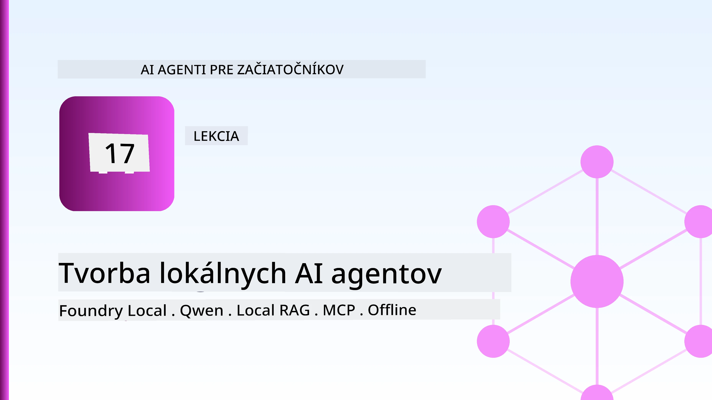
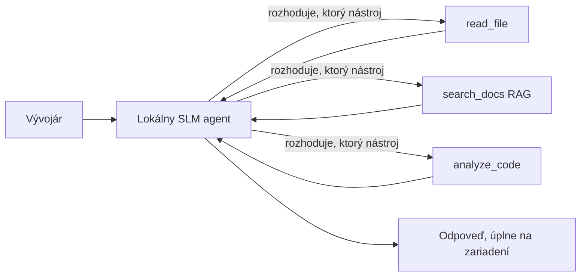
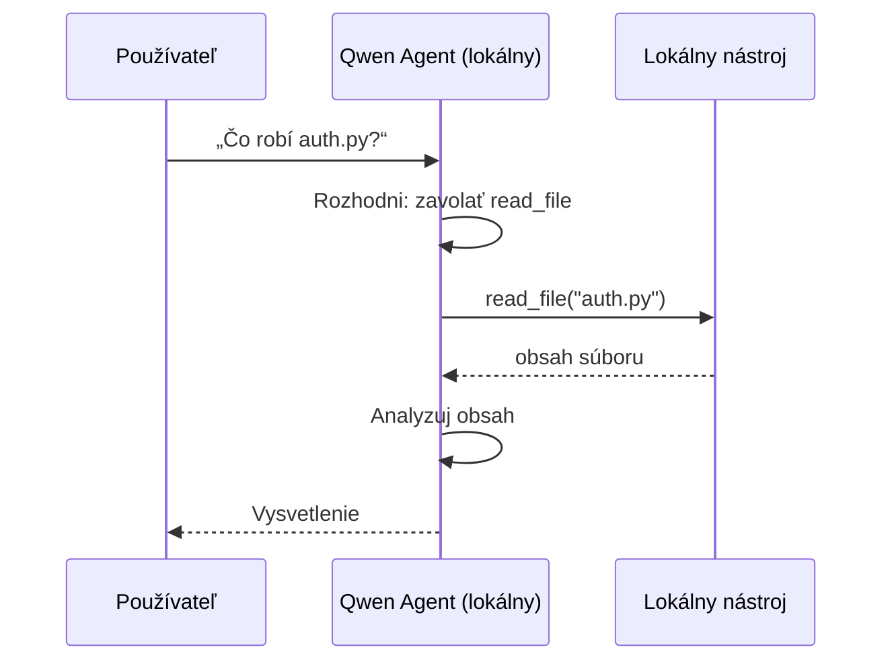
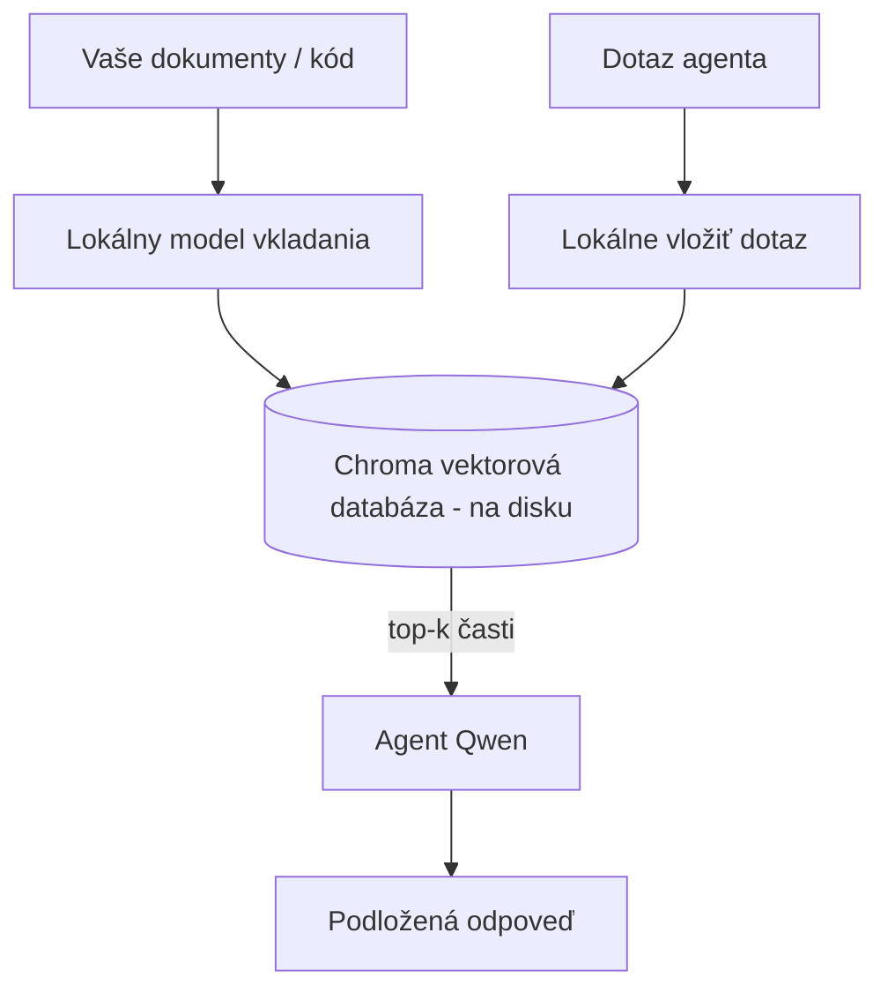
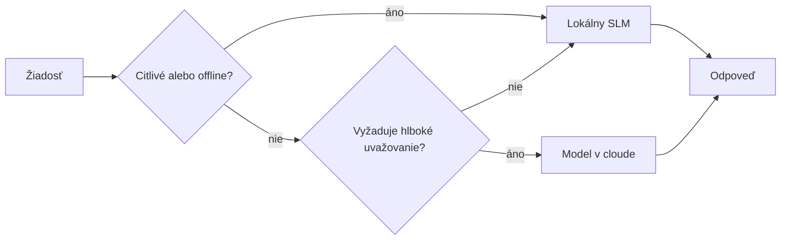

# Vytváranie lokálnych AI agentov pomocou Microsoft Foundry Local a Qwen



Predchádzajúca lekcia škálovala agentov *dole* do cloudu. Táto ich prináša *hore* na jedno zariadenie. Na konci budete mať fungujúceho inžinierskeho asistenta, ktorý rozumuje, volá nástroje, číta vaše súbory a vyhľadáva vo vašej dokumentácii — **bez jediného volania do cloudu na inferenciu.**

Prečo by ste to chceli? Tri dôvody, ktoré sa často objavujú v skutočnej inžinierskej práci:

- **Súkromie.** Kód a dokumenty nikdy neopustia zariadenie. Žiadny prompt, žiadny úryvok, žiadne zákaznícke dáta neprechádzajú cez sieťovú hranicu.
- **Náklady.** Lokálna inferencia nemá žiadny poplatok za token. Môžete iterovať celý deň za cenu elektriny.
- **Offline.** Na lietadle, v bezpečnej oblasti alebo počas výpadku agent stále funguje.

Podmienkou je, že vymieňate frontier cloudový model za **malý jazykový model (SLM)** bežiaci na vašom CPU, GPU alebo NPU. Táto lekcia je o budovaní agentov, ktorí sú *dobrí* v rámci týchto obmedzení, namiesto predstierania, že obmedzenia neexistujú.

## Úvod

Táto lekcia pokrýva:

- **Malé jazykové modely (SLM)** — čo sú zač, kde vynikajú a kde nie.
- **Microsoft Foundry Local** — runtime, ktorý sťahuje a obsluhuje modely lokálne cez **API kompatibilné s OpenAI**.
- **Qwen modely na volanie funkcií** — SLM, ktoré spoľahlivo generujú volania nástrojov, čo umožňuje lokálnym *agentom* (nielen chatom) fungovať.
- **Lokálne nástroje, lokálny RAG a lokálne MCP** — umožnenie schopností agenta bez cloudu.
- **Hybridné vzory** — kedy zanechať veci lokálne a kedy siahnuť do cloudu.

## Výukové ciele

Po dokončení tejto lekcie budete vedieť:

- Vysvetliť kompromisy SLM a vybrať vhodné prípady použitia lokálnych agentov.
- Lokálne nasadiť Qwen model pomocou Foundry Local a pripojiť sa k nemu cez API kompatibilné s OpenAI.
- Vybudovať agenta volajúceho nástroje, ktorý beží úplne na vašom pracovisku.
- Pridať lokálny RAG nad vlastnými dokumentmi použitím lokálnej vektorovej databázy (Chroma).
- Pripojiť agenta k lokálnemu MCP serveru a rozumieť hybridným lokálnym/cloudovým návrhom.

## Predpoklady

Táto lekcia predpokladá, že ste dokončili predchádzajúce lekcie a ste oboznámení s:

- [Použitie nástrojov](../04-tool-use/README.md) (lekcia 4) a [Agentic RAG](../05-agentic-rag/README.md) (lekcia 5).
- [Agentic Protokoly / MCP](../11-agentic-protocols/README.md) (lekcia 11).
- [Microsoft Agent Framework](../14-microsoft-agent-framework/README.md) (lekcia 14).

Tiež budete potrebovať:

- Vývojársku pracovnú stanicu. **8 GB RAM je realistický minimál**, 16 GB+ je komfortné. GPU alebo NPU pomáha, ale nie je povinné.
- Nainštalovaný **Microsoft Foundry Local** (pozrite si časť inštalácie nižšie).
- Python 3.12+ a balíčky z repozitára [`requirements.txt`](../../../requirements.txt), plus `foundry-local-sdk`, `openai` a `chromadb` pre túto lekciu.

## Malé jazykové modely: správny nástroj pre lokálnu prácu

Frontier cloudový model má stovky miliárd parametrov a dátové centrum za sebou. SLM má pár miliárd parametrov a musí sa zmestiť do RAM vášho laptopu. Tento rozdiel nastavuje jasné očakávania.

**SLMy sú dobré v:**

- Štruktúrovaných, ohraničených úlohách — klasifikácia, extrakcia, sumarizácia známeho dokumentu.
- **Volanie nástrojov** — rozhodovanie, ktorú funkciu volať a s akými argumentmi.
- Rýchlej, lacnej, súkromnej iterácii na vlastných dátach.

**SLMy sú slabšie v:**

- Otvorených, viacnásobných deduktívnych krokoch na veľkom kontekte.
- Širokej všeobecnej znalosti sveta (videli menej a viac zabúdajú).

Víťazná stratégia pre lokálnych agentov je teda: **nechajte SLM orchestráciu a ťažké úlohy prenechajte nástrojom.** Model nemusí *poznať* váš kód — musí vedieť, kedy volať `read_file` a `search_docs`. To priamo využíva silné stránky SLM.



## Microsoft Foundry Local

**Microsoft Foundry Local** je ľahký runtime, ktorý sťahuje, spravuje a obsluhuje modely úplne lokálne na vašom zariadení. Jeho najdôležitejšou funkciou pre nás je, že vystavuje **HTTP endpoint kompatibilný s OpenAI** — čo znamená, že OpenAI SDK a klient OpenAI v Microsoft Agent Framework fungujú s ním zmenou len `base_url`. Všetko, čo ste sa naučili o tvorbe agentov, sa prenáša priamo; len endpoint sa presúva z cloudu na `localhost`.

Foundry Local tiež automaticky vyberie najvhodnejšiu verziu modelu pre váš hardvér — zostavu pre CPU, CUDA/GPU alebo NPU — takže nemusíte ručne optimalizovať pre každé zariadenie.

### Inštalácia

Nainštalujte Foundry Local (pozrite si [dokumentáciu](https://learn.microsoft.com/azure/ai-foundry/foundry-local/) pre váš OS) a potom overte jeho funkčnosť:

```bash
# Inštalovať (napríklad; postupujte podľa dokumentácie pre vašu platformu)
winget install Microsoft.FoundryLocal      # Windows
# brew install microsoft/foundrylocal/foundrylocal   # macOS

# Stiahnite a spustite model Qwen, potom spustite lokálnu službu
foundry model run qwen2.5-7b-instruct
foundry service status
```

Keď je služba spustená, máte lokálny endpoint kompatibilný s OpenAI (typicky `http://localhost:PORT/v1`). Notebook používa `foundry-local-sdk` na automatické zistenie endpointu, takže nemusíte manuálne zadávať port.

## Qwen volanie funkcií: prečo je to dôležité

Agent je agent iba vtedy, ak môže volať nástroje. Mnoho SLM dokáže chatovať, ale produkuje nespoľahlivé, chybné volania nástrojov. **Qwen** modely sú trénované na volanie funkcií a konzistentne generujú správne štruktúry volaní nástrojov — čo presne robí lokálny chat model lokálnym *agentom*.

Priebeh je štandardný nástrojový cyklus, ktorý už poznáte, len beží lokálne:



## Lokálny RAG

Vyhľadávanie v dokumentácii je miesto, kde lokálni agenti dokazujú svoju hodnotu. Namiesto toho, aby ste dúfali, že SLM si zapamätal dokumentáciu vášho rámca, vložíte ju do **lokálnej vektorovej databázy** a necháte agenta vybrať relevantné časti na požiadanie.

Používame **Chroma**, vstavnú vektorovú databázu, ktorá beží v procese bez potreby servera. Rúrka je úplne lokálna: lokálny model na vkladanie → lokálne vektory → lokálne vyhľadávanie → lokálny SLM.



Toto je rovnaký vzor Agentic RAG z Lekcie 5 — jediná zmena je, že všetky komponenty bežia na vašom zariadení.

## Lokálne MCP servery

[MCP](../11-agentic-protocols/README.md) je transport, nie cloudová služba. MCP server môže bežať ako lokálny proces na `stdio`, vystavujúc nástroje agentovi podľa štandardného protokolu. To vám umožňuje opätovne používať rastúci ekosystém MCP serverov — prístup k súborovému systému, git operácie, databázové dopyty — úplne offline.

Bezpečnostný prístup je odlišný od cloudu, ale nie absentný: lokálny MCP server beží s právami vášho používateľa, preto mu obmedzte prístup (napríklad na adresár projektu, nie celý domovský priečinok) a považujte jeho výstupy za vstupy na overenie.

## Hybridné cloudové a lokálne vzory

Lokálny prístup neznamená iba lokálny. Zrelé systémy smerujú podľa citlivosti a náročnosti:

| Situácia | Kde beží |
| --- | --- |
| Citlivý kód / dáta alebo offline | **Lokálny SLM** |
| Jednoduchá, ohraničená úloha | **Lokálny SLM** (lacný, rýchly) |
| Náročné viackrokové dedukcie na necitlivých dátach | **Cloud model** |
| Všetko počas výpadku | **Lokálny SLM** (pohotové zníženie kvality) |

Toto odzrkadľuje myšlienku **smerovania modelov** z Lekcie 16 — okrem toho, že jeden z „modelov“ je teraz vaše zariadenie. Robustný návrh sa v prípade nedostupnosti cloudu vráti k lokálnemu modelu, takže agent znižuje kvalitu namiesto úplnej poruchy.



## Praktická časť: Lokálny inžiniersky asistent

Otvorte [`code_samples/17-local-agent-foundry-local.ipynb`](./code_samples/17-local-agent-foundry-local.ipynb) a prejdite si ju. Postavíte **lokálneho inžinierskeho asistenta**, ktorý beží úplne na vašom zariadení a dokáže:

1. **Volanie nástrojov** — cez Qwen volanie funkcií cez Foundry Local.
2. **Práca so súbormi lokálne** — vypísať a prečítať súbory v adresári projektu.
3. **Analýza kódu** — hlásiť základné metriky zdrojového súboru.
4. **Vyhľadávanie v dokumentácii** — lokálny RAG nad priečinkom s dokumentáciou pomocou Chroma.
5. **Použitie MCP** — pripojiť sa k lokálnemu MCP serveru (s jemným vynechaním, ak nie je nakonfigurovaný).

V žiadnom okamihu sa nevyužíva cloudová inferencia.

### Prechádzka

Asistent sa pripojí k Foundry Local cez endpoint kompatibilný s OpenAI, takže kód agenta vyzerá takmer rovnako ako v cloudových lekciách — mení sa iba klient:

```python
from foundry_local import FoundryLocalManager
from openai import OpenAI

# Foundry Local nájde/stiahne model a poskytne nám lokálny endpoint.
manager = FoundryLocalManager(\"qwen2.5-7b-instruct\")
client = OpenAI(base_url=manager.endpoint, api_key=manager.api_key)  # api_key je lokálny zástupný symbol
```

Nástroje sú bežné Python funkcie obmedzené na adresár projektu:

```python
def read_file(path: str) -> str:
    \"\"\"Read a file, but only inside the sandboxed project directory.\"\"\"
    full = (PROJECT_ROOT / path).resolve()
    if PROJECT_ROOT not in full.parents and full != PROJECT_ROOT:
        return \"Access denied: path is outside the project directory.\"
    return full.read_text(encoding=\"utf-8\")
```

Všimnite si kontrolu pieskoviska — aj lokálne je nástroj, ktorý číta ľubovoľné cesty, zraniteľnosťou. Notebook udržiava všetky nástroje obmedzené na jeden koreňový priečinok projektu.

## Kontrola vedomostí

Otestujte svoje pochopenie predtým, než prejdete na zadanie.

**1. Uveďte dva konkrétne dôvody, prečo spustiť agenta lokálne namiesto v cloude.**

<details>
<summary>Odpoveď</summary>

Ktorékoľvek dva z: **súkromie** (kód a dáta nikdy neopustia zariadenie), **náklady** (žiadny poplatok za token pri inferencii) a **offline schopnosť** (funguje bez siete — v lietadle, v bezpečnej oblasti alebo pri výpadku). Regulačné a súladové obmedzenia často vyžadujú, aby sa dáta nevysielali mimo zariadenia, čo je bežný dôvod súkromia.
</details>

**2. Aké je odporúčané rozdelenie práce medzi SLM a jeho nástrojmi v lokálnom agentovi a prečo?**

<details>
<summary>Odpoveď</summary>

Nechajte SLM **orchestráciu** (rozhodovať, ktorý nástroj volať a s akými argumentmi) a nechajte **nástroje robiť ťažkú prácu** (čítanie súborov, vyhľadávanie dokumentov, výpočty výsledkov). SLM sú silné v ohraničených rozhodnutiach ako výber nástroja, ale slabšie vo všeobecných znalostiach a dlhých viackrokových dedukciách, preto použitie nástrojov podporuje ich silné stránky.
</details>

**3. Čo umožňuje opätovné použitie cloudového agent kódu s Foundry Local?**

<details>
<summary>Odpoveď</summary>

Foundry Local vystavuje **HTTP endpoint kompatibilný s OpenAI**. OpenAI SDK a OpenAI klient z Agent Framework s ním spolupracujú zmenou len `base_url` (a použitím lokálneho dočasného API kľúča). Všetko ostatné v kóde agenta zostáva rovnaké.
</details>

**4. Prečo špeciálne používame Qwen model na volanie funkcií namiesto hocijakého SLM?**

<details>
<summary>Odpoveď</summary>

Pretože agent musí produkovať spoľahlivé, správne **volania nástrojov**. Mnoho SLM vie chatovať, ale generuje nesprávne alebo nekonzistentné štruktúry volaní nástrojov. Qwen modely sú trénované na volanie funkcií a generujú konzistentné volania nástrojov, čo robí z lokálneho chat modelu fungujúceho lokálneho agenta.
</details>

**5. Ktoré komponenty v lokálnom RAG pipeline bežia na zariadení?**

<details>
<summary>Odpoveď</summary>

Všetky: model na vkladanie, vektorová databáza (Chroma, uložená na disku), krok vyhľadávania a SLM. Dokumenty sa vkladajú lokálne, ukladajú lokálne, vyhľadávajú lokálne a spracovávajú lokálnym modelom — žiadny komponent sa nedotýka cloudu.
</details>

**6. Lokálny MCP server beží na vašom zariadení. Znamená to automaticky, že je bezpečný? Aké opatrenia by ste mali urobiť?**

<details>
<summary>Odpoveď</summary>

Nie. Lokálny MCP server beží s oprávneniami vášho používateľa, takže má prístup k čomukoľvek, ku čomu máte prístup vy. Obmedzte ho na to, čo potrebuje (napríklad na jeden projektový adresár namiesto celého domovského priečinka) a považujte jeho výstupy za vstupy na overenie skôr, než na ne reagujete.
</details>

**7. Popíšte rozumné pravidlo hybridného smerovania, ktoré zahŕňa lokálny model.**

<details>
<summary>Odpoveď</summary>

Smerujte citlivé alebo offline požiadavky na lokálny SLM; jednoduché ohraničené úlohy nasmerujte na lokálny SLM kvôli rýchlosti a nákladom; náročné viackrokové dedukcie na necitlivých dátach nechajte na cloudový model; a pri nedostupnosti cloudu sa vráťte k lokálnemu SLM, aby agent plynulo znižoval kvalitu namiesto zlyhania. Toto je smerovanie modelov (lekcia 16) s vaším zariadením ako jedným z modelov.
</details>

**8. Aká je realistická minimálna hodnota RAM pre spustenie lokálneho agenta v tejto lekcii a čo získate s väčšou RAM?**

<details>
<summary>Odpoveď</summary>

Okolo **8 GB** je realistický minimál; 16 GB+ je komfortné. Viac RAM umožňuje používať väčšie a schopnejšie modely a uchovávať viac kontextu v pamäti. GPU alebo NPU zrýchľuje inferenciu, ale nie je povinné — Foundry Local vyberá verziu pre CPU, keď nie je k dispozícii akcelerátor.
</details>

## Zadanie

Rozšírte lokálneho inžinierskeho asistenta do **lokálneho recenzenta dokumentácie** pre malý projekt podľa vašej voľby (ak chcete, použite niektorý z priečinkov lekcií tohto repozitára).

Vaša odovzdávka by mala:

1. **Indexovať skutočný priečinok s dokumentáciou/kódom** do Chromy (aspoň päť súborov).
2. **Pridať nástroj `find_todos`**, ktorý prehľadá projekt a vráti komentáre `TODO`/`FIXME` spolu s názvom súboru a číslom riadku — s rovnakou kontrolou pieskoviska ako `read_file`.

3. **Pýtajte sa agenta tri otázky**, ktoré ho prinútia kombinovať nástroje: jednu čistú RAG otázku, jednu, ktorá vyžaduje čítanie konkrétneho súboru, a jednu, ktorá vyžaduje nájdenie TODO.
4. **Zmerajte to**: zaznamenajte čas každej z troch odpovedí v markdown bunke. Komentujte, či je latencia prijateľná pre váš zamýšľaný pracovný postup.

Potom napíšte krátky odsek o tom, **čo by ste presunuli do cloudu a čo by ste ponechali lokálne** pre tohto recenzenta a prečo. Hodnotí sa, či sú lokálne komponenty správne prepojené a či je vaša hybridná úvaha správna — nie kvalita modelu.

## Zhrnutie

V tejto lekcii ste vytvorili agenta, ktorý beží úplne na vašom vlastnom zariadení:

- **SLM** sa obetuje šírka záberu kvôli súkromiu, nákladom a offline prevádzke — a vynikajú, keď **orchestruju nástroje** namiesto toho, aby niesli všetky vedomosti sami.
- **Foundry Local** poskytuje modely na zariadení za **OpenAI-kompatibilným endpointom**, takže váš kód pre cloudového agenta sa prevezme jednoradkovou zmenou.
- **Qwen modely s volaním funkcií** umožňujú spoľahlivé lokálne volanie nástrojov — a teda lokálnych *agentov*.
- **Lokálny RAG** (Chroma) a **lokálny MCP** dávajú agentovi schopnosť bez opustenia zariadenia.
- **Hybridné vzory** umožňujú smerovať podľa citlivosti a náročnosti, kde lokálne je elegantnou náhradou.

Týmto sa dokončuje implementačná cesta: Lekcia 16 rozširovala agentov do Microsoft Foundry, a táto lekcia ich zmenšila na jedno pracovné stanovište. Nasledujúca lekcia sa zameriava na zabezpečenie nasadených agentov.

## Dodatočné zdroje

- <a href="https://learn.microsoft.com/azure/ai-foundry/foundry-local/" target="_blank">Dokumentácia Microsoft Foundry Local</a>
- <a href="https://learn.microsoft.com/azure/ai-foundry/what-is-azure-ai-foundry" target="_blank">Dokumentácia Microsoft Foundry</a>
- <a href="https://aka.ms/ai-agents-beginners/agent-framework" target="_blank">Microsoft Agent Framework</a>
- <a href="https://qwen.readthedocs.io/en/latest/framework/function_call.html" target="_blank">Dokumentácia Qwen volania funkcií</a>
- <a href="https://modelcontextprotocol.io/" target="_blank">Model Context Protocol (MCP)</a>
- <a href="https://docs.trychroma.com/" target="_blank">Chroma vektorová databáza</a>

## Predchádzajúca lekcia

[Nasadenie rozšíriteľných agentov](../16-deploying-scalable-agents/README.md)

## Nasledujúca lekcia

[Zabezpečenie AI agentov](../18-securing-ai-agents/README.md)

---

<!-- CO-OP TRANSLATOR DISCLAIMER START -->
**Vyhlásenie o zodpovednosti**:
Tento dokument bol preložený pomocou AI prekladateľskej služby [Co-op Translator](https://github.com/Azure/co-op-translator). Hoci sa snažíme o presnosť, vezmite prosím na vedomie, že automatické preklady môžu obsahovať chyby alebo nepresnosti. Pôvodný dokument v jeho natívnom jazyku by mal byť považovaný za autoritatívny zdroj. Pre kritické informácie sa odporúča profesionálny ľudský preklad. Nie sme zodpovední za žiadne nedorozumenia alebo nesprávne interpretácie vyplývajúce z použitia tohto prekladu.
<!-- CO-OP TRANSLATOR DISCLAIMER END -->