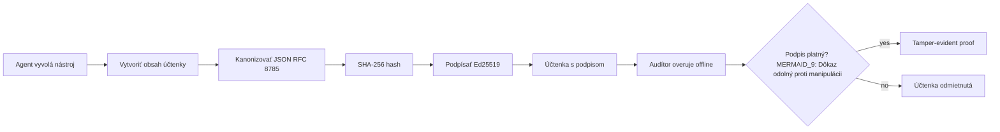
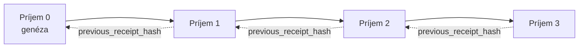

[Pozrite si video lekcie: Zabezpečenie AI agentov pomocou kryptografických dokladov](https://youtu.be/PLACEHOLDER_VIDEO_ID)

> _(Video lekcie a náhľadový obrázok doplní tím Microsoft obsahového tímu po zlúčení, v súlade so vzorom lekcie 14 / 15.)_

# Zabezpečenie AI agentov pomocou kryptografických dokladov

## Úvod

Táto lekcia pokryje:

- Prečo sú sledovacie stopy pre AI agentov dôležité pre dodržiavanie predpisov, ladenie a dôveru.
- Čo je to kryptografický doklad a ako sa líši od nepodpísaného riadka denníka.
- Ako vyrobiť podpísaný doklad pre volanie nástroja agenta v obyčajnom Pythone.
- Ako overiť doklad offline a odhaliť manipuláciu.
- Ako reťaziť doklady tak, aby odstránenie alebo preusporiadanie jedného rozbilo celý reťazec.
- Čo doklady dokazujú a čo výslovne nedokazujú.

## Ciele učenia

Po dokončení tejto lekcie budete vedieť:

- Identifikovať režimy zlyhania, ktoré motivujú kryptografický pôvod akcií agenta.
- Vytvoriť podpísaný doklad Ed25519 nad kanonickým JSON údajom.
- Nezávisle overiť doklad iba pomocou verejného kľúča podpisovateľa.
- Zistiť manipuláciu opakovaným overením upraveného dokladu.
- Postaviť hash-reťazený sled dokladov a vysvetliť, prečo je reťazec dôležitý.
- Rozpoznať hranicu medzi tým, čo doklady dokazujú (pripísanie, integrita, zoradenie) a čo nedokazujú (správnosť akcie, správnosť politiky).

## Problém: Auditná stopa vášho agenta

Predstavte si, že ste nasadili AI agenta pre Contoso Travel. Agent číta požiadavky zákazníkov, volá API letov na vyhľadanie možností a rezervuje miesta v mene zákazníka. Minulý štvrťrok agent spracoval 50 000 rezervácií.

Dnes prichádza audítor. Položí jednoduchú otázku: „Ukážte mi, čo váš agent urobil.“

Odovzdáte im svoje súbory s protokolmi. Audítor sa na ne pozrie a položí ťažšiu otázku: „Ako viem, že tieto záznamy neboli upravované?“

Toto je problém auditnej stopy. Väčšina dnešných implementácií agentov sa spolieha na:

- **Aplikačné protokoly**: zapisované samotným agentom, upraviteľné kýmkoľvek s prístupom k súborovému systému.
- **Cloudové služby protokolovania**: odolné proti manipulácii na úrovni platformy, ale len ak audítor dôveruje prevádzkovateľovi platformy.
- **Protokoly databázových transakcií**: vhodné na zmeny databázy, ale nie na ľubovoľné volania nástrojov.

Žiadna z týchto možností nedokáže odpovedať audítorovi bez toho, aby audítor musel dôverovať niekomu (vám, vášmu poskytovateľovi cloudu, dodávateľovi databázy). Pre interné použitie je táto dôvera často prijateľná. Pre regulované úlohy (financie, zdravotníctvo, všetko podliehajúce EU AI aktu) nie je.

Kryptografické doklady tento problém riešia tým, že každá akcia agenta je nezávisle overiteľná. Audítor nemusí dôverovať vám. Potrebuje len váš verejný kľúč a samotný doklad.

## Čo je kryptografický doklad?

Doklad je JSON objekt, ktorý zaznamenáva, čo agent urobil, podpísaný digitálnym podpisom.



Minimálny doklad vyzerá takto:

```json
{
  "type": "agent.tool_call.v1",
  "agent_id": "contoso-travel-bot",
  "tool_name": "lookup_flights",
  "tool_args_hash": "sha256:a3f9c1...",
  "result_hash": "sha256:7b2e1d...",
  "policy_id": "contoso-travel-policy-v3",
  "timestamp": "2026-04-25T14:30:00Z",
  "sequence": 47,
  "previous_receipt_hash": "sha256:9d4e6a...",
  "signature": {
    "alg": "EdDSA",
    "sig": "c5af83...",
    "public_key": "8f3b2c..."
  }
}
```

Tri vlastnosti robia túto prácu:

1. **Podpis**. Doklad je podpísaný bránou agenta pomocou súkromného kľúča Ed25519. Každý, kto má príslušný verejný kľúč, môže podpis overiť offline. Akákoľvek manipulácia s ktorýmkoľvek poľom podpis neplatí.

2. **Kanonické kódovanie**. Pred podpisom je doklad serializovaný podľa schémy JSON Canonicalization Scheme (JCS, RFC 8785). To zaručuje, že dve implementácie, ktoré vyprodukujú rovnaký logický doklad, vygenerujú identický bajtový výstup. Bez kanonizácie by rozdielne JSON serializátory vytvorili rôzne podpisy pre rovnaký obsah.

3. **Hashové reťazenie**. Pole `previous_receipt_hash` spája každý doklad s tým predchádzajúcim. Odstránenie alebo preusporiadanie dokladu rozbije všetky doklady nasledujúce za ním. Manipulácia je viditeľná na úrovni reťazca aj keď sa obejdú jednotlivé podpisy.

Spoločne tieto vlastnosti poskytujú tri záruky:

- **Pripísanie**: tento kľúč podpísal tento obsah.
- **Integrita**: obsah sa od podpísania nezmenil.
- **Zoradenie**: tento doklad nasledoval za tým dokladom v reťazci.

## Vytvorenie dokladu v Pythone

Na vytvorenie dokladu nepotrebujete špeciálnu knižnicu. Kryptografické primitívy sú široko dostupné a logika je len niekoľko desiatok riadkov Pythonu.

Praktické cvičenia v `code_samples/18-signed-receipts.ipynb` vás prevedú celým procesom. Zhrnutie:

```python
import json
import hashlib
import base64
from nacl import signing
from jcs import canonicalize  # Kanonický JSON podľa RFC 8785

def b64url_nopad(data: bytes) -> str:
    return base64.urlsafe_b64encode(data).decode("ascii").rstrip("=")

def sha256_canonical(obj) -> str:
    """SHA-256 of a Python object's JCS-canonical JSON form."""
    return f"sha256:{hashlib.sha256(canonicalize(obj)).hexdigest()}"

# Vygenerujte alebo načítajte podpisovací kľúč (v produkcii ho uložte do trezoru kľúčov)
signing_key = signing.SigningKey.generate()
verify_key = signing_key.verify_key

# Vytvorte platobný obsah potvrdenia (ešte bez podpisu)
tool_args = {"origin": "SYD", "destination": "LAX"}
tool_result = [{"flight": "QF11", "price": 1850, "stops": 0}]

payload = {
    "type": "agent.tool_call.v1",
    "agent_id": "contoso-travel-bot",
    "tool_name": "lookup_flights",
    "tool_args_hash": sha256_canonical(tool_args),
    "result_hash": sha256_canonical(tool_result),
    "policy_id": "contoso-travel-policy-v3",
    "timestamp": "2026-04-25T14:30:00Z",
    "sequence": 0,
    "previous_receipt_hash": None,
}

# Kanonizujte, zahashujte, podpíšte.
canonical_bytes = canonicalize(payload)
message_hash = hashlib.sha256(canonical_bytes).digest()
signature_bytes = signing_key.sign(message_hash).signature

# Pripojte štruktúrovaný podpisový objekt.
receipt = {
    **payload,
    "signature": {
        "alg": "EdDSA",
        "sig": b64url_nopad(signature_bytes),
        "public_key": b64url_nopad(bytes(verify_key)),
    },
}
```

To je celý podpisovací postup. Cvičenia v notebooku prechádzajú každý krok.

## Overenie dokladu a detekcia manipulácie

Overenie je opačná operácia:

```python
import base64
import hashlib
from nacl import signing
from nacl.exceptions import BadSignatureError
from jcs import canonicalize

def b64url_decode(s: str) -> bytes:
    padding = "=" * ((4 - len(s) % 4) % 4)
    return base64.urlsafe_b64decode(s + padding)

def verify_receipt(receipt: dict) -> bool:
    # Podpis je štruktúrovaný objekt: {"alg", "sig", "public_key"}.
    sig_obj = receipt.get("signature")
    if not sig_obj or sig_obj.get("alg") != "EdDSA":
        return False

    # Zrekonštruujte zaťaženie, ktoré bolo skutočne podpísané (všetko okrem podpisu).
    payload = {k: v for k, v in receipt.items() if k != "signature"}

    canonical_bytes = canonicalize(payload)
    message_hash = hashlib.sha256(canonical_bytes).digest()

    try:
        verify_key = signing.VerifyKey(b64url_decode(sig_obj["public_key"]))
        verify_key.verify(message_hash, b64url_decode(sig_obj["sig"]))
        return True
    except BadSignatureError:
        return False
```

Táto funkcia vezme doklad a vráti `True`, ak je podpis platný, inak `False`. Žiadne sieťové volanie, žiadna závislosť na službe, žiadna dôvera v tretiu stranu.

Aby ste videli, ako detekcia manipulácie funguje, notebook prejde:

1. Výrobu platného dokladu a potvrdenie, že overenie prejde.
2. Úpravu jedného bytu poľa `tool_args_hash`.
3. Opätovné spustenie overovania a zistenie jeho zlyhania.

Toto je praktický dôkaz, že doklady sú manipulačne evidentné: akákoľvek úprava, akokoľvek malá, rozbije podpis.

## Reťazenie dokladov pre viacstupňových agentov

Jeden podpísaný doklad chráni jednu akciu. Reťazec dokladov chráni sled akcií.



Každý doklad zaznamenáva hash predchádzajúceho dokladu. Na tiché odstránenie dokladu 2 by útočník potreboval:

- Upraviť pole `previous_receipt_hash` dokladu 3 (čo rozbije podpis dokladu 3), ALEBO
- Zfalšovať podpis na upravenom doklade 3 (vyžaduje súkromný kľúč agenta).

Ak je súkromný kľúč v hardvérovom trezore a verejný kľúč zverejňujete s každým dokladom, ani jeden z týchto útokov nie je bez odhalenia možný.

Notebook prejde:

1. Vytvorenie reťazca troch dokladov.
2. Overenie, že `previous_receipt_hash` každého dokladu odpovedá skutočnému hashu predchádzajúceho dokladu.
3. Manipuláciu so stredným dokladom a zistenie rozbitia reťazca práve v tomto bode.

Takto vytvoríte auditnú stopu, ktorú môže vonkajší audítor overiť bez toho, aby musel dôverovať vám.

## Čo doklady dokazujú (a čo nie)

Toto je najdôležitejšia časť tejto lekcie. Doklady sú mocné, ale ich moc má hranice.

**Doklady dokazujú tri veci:**

1. **Pripísanie**: konkrétny kľúč podpísal konkrétny obsah.
2. **Integrita**: obsah sa od podpísania nezmenil.
3. **Zoradenie**: tento doklad nasledoval za tým dokladom v hash reťazci.

**Doklady NEdokazujú:**

1. **Správnosť**: že akcia agenta bola správna. Doklad môže byť podpísaný pre nesprávnu odpoveď rovnako čisto ako pre správnu.
2. **Dodržiavanie politiky**: že politika uvedená v `policy_id` bola skutočne vyhodnotená, alebo že by túto akciu povolila, keby bola overená. Doklad zaznamenáva to, čo bolo deklarované, nie to, čo bolo vynútené.
3. **Identita nad rámec kľúča**: doklad hovorí „tento kľúč podpísal tento obsah.“ Nehovorí „tento človek to autorizoval.“ Prepojenie kľúča s osobou alebo organizáciou vyžaduje samostatnú infraštruktúru identít (adresár, registr verejných kľúčov atď.).
4. **Pravdivosť vstupov**: ak agent dostane zmanipulovanú výzvu a jedná podľa nej, doklad verne zaznamenáva akciu. Doklady sú následné po overení vstupov, nie ich náhradou.

Táto hranica je dôležitá z dvoch dôvodov:

- Povedia vám, na čo sú doklady užitočné: spravujú správanie agenta a robia ho manipulačne evidentným, dokonca aj cez organizačné hranice.
- Povedia vám, aké ďalšie vrstvy ešte potrebujete: overenie vstupov (Lekcia 6), vynucovanie politiky (stručne nižšie) a infraštruktúru identít (mimo rozsah tejto lekcie).

Bežná chyba je predpokladať, že „máme doklady“ znamená „sme riadení.“ Nie je to tak. Doklady sú základom. Riadenie je systém, ktorý na nich postavíte.

## Dokázanie, že človek schválil presnú akciu

Bod 3 vyššie stojí za samostatnú časť: doklad o akcii hovorí „tento kľúč podpísal tento obsah,“ nikdy „človek to autorizoval.“ Pre vysokorizikové akcie (refundácie, vymazania, platobné prevody) riadiace rámce čoraz častejšie vyžadujú práve túto chýbajúcu vetu, ktorú je možné vyprodukovať rovnakými primitivami, ktoré ste už v tejto lekcii vybudovali.

Následný notebook `code_samples/human-authorization-receipts.ipynb` pridáva druhý druh dokladu, `human.approval.v1`, v rovnakom obale ako lekčné doklady (typovaný náklad podpísaný Ed25519 nad jeho kanonickým SHA-256, s objektom `signature` mimo podpísaných bajtov). Menovaný schvaľovateľ podpíše **celú kanonickú akciu a jej digest** pred vykonaním; akčný doklad agenta nesie **rovnaký digest akcie** a `parent_approval_ref`, čo je `receipt_hash` schválenia podľa rovnakého konvencie ako `previous_receipt_hash` vo vyššie postavenom reťazci. Jedno volanie `verify_chain` spracuje oba artefakty pod **samostatnými evidenciami pripnutých kľúčov** (schvaľovacie kľúče vs kľúče agentov), takže cieľová cesta je zdieľaná, ale orgány nie.

Výsledná vlastnosť, uvedená dôkladne: *človek schválil presne túto akciu a agent vykonal práve tú schválenú akciu.* Odmietacie testy notebooku sú to, čo robí túto vlastnosť reálnou, nie len tvrdenou:

- klasická sada: manipulácia, zmätok zástupcu, prehrávanie, falšované kľúče na každej strane, chybný vstup;
- **neaktuálna autorita**: podpis, ktorý stále prechádza overením, ale je odmietnutý, pretože sa zmenila verzia politiky, kľúč schvaľovateľa bol odstránený z pripnutého registra alebo schválenie vypršalo pred vykonaním;
- **nahradenie digestu**: platne podpísaný akčný doklad, ktorý odkazuje na *skutočné* schválenie viažuce *inú* kanonickú akciu.

Každé zlyhanie je odmietnuté s konkrétnym dôvodom, takže audítor čítajúci odmietnutie vie, či autorita zastarala alebo sa vykonaná akcia zmenila. Pravidlo, ktoré notebook učí: podpísané schválenie nie je samo osebe autoritou. Autorita existuje iba ak oba doklady stále viažu tú istú kanonickú akciu v čase vykonávania. Cesta spolupodpísania v tom istom Internet-Drafte, ktorý táto lekcia sleduje (`draft-farley-acta-signed-receipts`) je podobou tohto vzoru smerujúcou do štandardu.

## Produkčné referencie

Python kód v tejto lekcii je zámerne minimalistický, aby ste mohli čítať každý riadok a presne pochopiť, čo sa deje. V produkcii máte dve možnosti:

1. **Priamo stavať na kryptografických primitívoch.** Tie 50 riadkov, ktoré ste videli vyššie, stačí pre mnohé použitia. PyNaCl (Ed25519) a balík `jcs` (kanonický JSON) sú dobre udržiavané a auditované knižnice.

2. **Použiť produkčnú knižnicu na doklady.** Niekoľko open-source projektov implementuje ten istý vzor s ďalšími funkciami (rotačná výmena kľúčov, hromadné overovanie, distribúcia sady JWK, integrácia s politickými strojmi):
   - Formát dokladov použitý v tejto lekcii nasleduje IETF Internet-Draft ([`draft-farley-acta-signed-receipts`](https://datatracker.ietf.org/doc/draft-farley-acta-signed-receipts/), revízia 02) momentálne v štandardizačnom procese, s zdieľanou súpravou súladu ([agent-governance-testvectors](https://github.com/ScopeBlind/agent-governance-testvectors)) na nezávislé overovanie implementácií, aby produkovali bajtovo identický kanonický výstup.
   - Microsoft Agent Governance Toolkit kombinuje doklady s rozhodnutiami politiky vychádzajúcimi z Cedar; pozrite sa na Tutorial 33 v tom repozitári pre príklad end-to-end.
   - Balíky `protect-mcp` (npm) a `@veritasacta/verify` (npm) poskytujú Node implementáciu podpisovania a offline overovania dokladov, určenú na zabalenie akéhokoľvek MCP servera s manipulačne evidentnou auditnou stopou, vrátane „držaného na spolupodpis“ toku, kde pozastavená akcia vydá schvaľovací doklad viazaný na digest akcie (WebAuthn-podložené v desktopovom toku), ten istý vzor schvaľovacieho dokladu ako v notebooku o autorizácii človeka vyššie.
   - **[nobulex](https://github.com/arian-gogani/nobulex)** Python SDK (`pip install nobulex`) poskytuje rovnaký Ed25519 + JCS podpisovací vzor v Pythone s integráciami LangChain a CrewAI, vrátane zverejnených testovacích vektorov na krížové overovanie a mapovania súladu prispelých cez [OWASP PR #2210](https://github.com/OWASP/CheatSheetSeries/pull/2210).

Rozhodnutie medzi vlastným riešením a použitím knižnice pripomína rozhodnutie medzi písaním vlastnej JWT knižnice a použitím otestovanej: obe možnosti sú rozumné; knižnica šetrí čas a znižuje povrch na audit; od nuly vás núti pochopiť každý primitiv. Táto lekcia učí cestu od nuly, aby ste mali základ pre obe voľby.

## Kontrola znalostí

Otestujte svoje pochopenie pred prechodom na praktické cvičenie.

**1. Doklad je podpísaný súkromným Ed25519 kľúčom agenta. Audítor má iba verejný kľúč. Môže audítor overiť doklad offline?**

<details>
<summary>Odpoveď</summary>

Áno. Overovanie Ed25519 vyžaduje len verejný kľúč a podpísané bajty. Žiadne sieťové volanie, žiadna závislosť na službe. Táto vlastnosť robí doklady použiteľnými v prostrediach bez prístupu k sieti, s viacerými organizáciami alebo s nízkou dôverou.
</details>

**2. Útočník upraví pole `policy_id` v doklade, aby tvrdil, že podliehal voľnejšej politike. Podpis bol vytvorený nad pôvodným údajom. Čo sa stane počas overenia?**

<details>
<summary>Odpoveď</summary>


Overenie zlyhá. Podpis bol vypočítaný nad kanonickými bajtmi pôvodného obsahu; zmena akéhokoľvek poľa mení kanonické bajty, čo mení SHA-256 haš a spôsobuje neplatnosť podpisu. Útočník by potreboval súkromný kľúč na vytvorenie nového platného podpisu, ktorý však nemá.
</details>

**3. Prečo potvrdenie obsahuje `tool_args_hash` a `result_hash` namiesto surových argumentov a výsledku?**

<details>
<summary>Odpoveď</summary>

Dva dôvody. Po prvé, potvrdenie môže potrebovať archiváciu alebo prenos v prostrediach, kde je problémom únik surového obsahu (osobné údaje, obchodné dáta). Hašovanie udržuje potvrdenie malé a obsah súkromný; audítor overuje, že haš zodpovedá samostatne uloženému kópii skutočného obsahu. Po druhé, haše majú pevnú veľkosť; potvrdenie s hašmi má veľkosť ohraničenú nezávisle od veľkosti vstupov a výstupov.
</details>

**4. Pole `previous_receipt_hash` prepája každé potvrdenie s jeho predchodcom. Ak útočník potichu vymaže jedno potvrdenie zo stredu reťazca, čo sa stane neplatným?**

<details>
<summary>Odpoveď</summary>

Každé potvrdenie, ktoré za tým vymazaným nasledovalo. Ich polia `previous_receipt_hash` už nezodpovedajú skutočnému reťazcu (pretože potvrdenie, na ktoré odkazovali, už neexistuje, alebo reťazec teraz ukazuje na iného predchodcu). Na skrytie vymazania by útočník musel opätovne podpísať každé neskoršie potvrdenie, čo vyžaduje súkromný kľúč.
</details>

**5. Potvrdenie sa úspešne overí. Znamená to, že agentovo konanie bolo správne, korektné alebo v súlade s politikou?**

<details>
<summary>Odpoveď</summary>

Nie. Platné potvrdenie dokazuje tri veci: priradenie (tento kľúč podpísal tento obsah), integritu (obsah sa nezmenil) a zoradenie (toto potvrdenie prišlo po tom potvrdení). NEdokazuje, že akcia bola správna, že politika špecifikovaná v `policy_id` bola skutočne vyhodnotená, alebo že agent dodržal všetky pravidlá. Potvrdenia robia správanie agenta auditovateľným, nie nevyhnutne správnym. Toto je najdôležitejšia hranica v lekcii.
</details>

## Cvičenie na precvičenie

Otvorte `code_samples/18-signed-receipts.ipynb` a dokončite všetky štyri sekcie:

1. **Sekcia 1**: Podpíšte svoje prvé potvrdenie a overte ho.
2. **Sekcia 2**: Zmeňte potvrdenie a pozorujte zlyhanie overenia.
3. **Sekcia 3**: Vytvorte trojpotvrdený reťazec a overte integritu reťazca.
4. **Sekcia 4**: Použite tento vzor na agenta vytvoreného pomocou Microsoft Agent Framework: zabaľte volanie nástroja do podpisovania potvrdenia a potom potvrdenie nezávisle overte.

**Rozšírená výzva 1:** Rozšírte schému potvrdenia o ďalšie pole podľa vlastného výberu (napríklad ID požiadavky na sledovanie), aktualizujte kanonickú logiku podpisovania tak, aby ho zahrnula, a overte, že potvrdenie stále prechádza overením. Potom pole po podpise zmeňte a potvrďte, že overenie zlyhá. Toto vás donúti pochopiť, ako každý bajt kanonického kódovania prispieva k podpisu.

**Rozšírená výzva 2:** Spojte SHA-256 haše dvoch potvrdení dohromady (konkatenácia ich kanonických bajtov v deterministickom poradí) a vložte výsledný digest ako nové pole tretieho potvrdenia pred jeho podpisom. Overte, že všetky tri potvrdenia stále prechádzajú okolo. Práve ste vytvorili jednorazový dôkaz zahrnutia: každý držiteľ tretieho potvrdenia môže dokázať, že prvé dve existovali v čase jeho podpísania, bez potreby zverejňovať ich obsah. Toto je vzor, ktorý používajú potvrdenia selektívneho zverejnenia vo veľkom meradle (Merkleove záväzky, RFC 6962).

## Záver

Kryptografické potvrdenia poskytujú AI agentom auditnú stopu, ktorá je:

- **Nezávisle overiteľná**: každý subjekt s verejným kľúčom môže overiť, bez závislosti na službách.
- **Zmena-viditeľná**: akákoľvek modifikácia spôsobuje neplatnosť podpisu.
- **Prenositeľná**: potvrdenie je malý JSON súbor; môže byť archivovaný, prenášaný a overovaný kdekoľvek.
- **Štandardmi zosúladená**: postavená na Ed25519 (RFC 8032), JCS (RFC 8785) a SHA-256, všetky široko rozšírené primitíva.

Nie sú náhradou za kontrolu vstupu, vynucovanie pravidiel alebo identitnú infraštruktúru. Sú základom pre tieto vrstvy. Keď nasadzujete agentov do regulovaných pracovných záťaží, medziorganizovaných pracovných postupov alebo kdekoľvek, kde sa nedá predpokladať dôvera budúceho audítora, potvrdenia zabezpečujú čestnú auditnú stopu.

Najdôležitejšie posolstvo: potvrdenia dokazujú, kto čo povedal a kedy. Nedokazujú, že to, čo bolo povedané, je pravda alebo správne. Túto rozlíšujúcu hranicu si pevne držte. Je to rozdiel medzi čestným systémom pôvodu a zavádzajúcim.

## Produkčný kontrolný zoznam

Keď ste pripravení ukončiť túto lekciu a nasadiť agentov podpisujúcich potvrdenia v reálnom prostredí:

- [ ] **Presuňte podpisovací kľúč mimo vývojárskeho laptopu.** Použite Azure Key Vault, AWS KMS alebo hardvérový bezpečnostný modul. Súkromný kľúč podpisujúci vaše potvrdenia nikdy nesmie byť v zdrojovej kontrole alebo v čitateľnej podobe na aplikačných strojoch.
- [ ] **Zverejnite verejný kľúč na overovanie.** Audítori ho potrebujú na offline overovanie. Štandardný vzor je JWK Set na dobre známom URL (RFC 7517), napríklad `https://your-org.example.com/.well-known/agent-keys.json`.
- [ ] **Externé upevnenie reťazca.** Pravidelne zapisujte najnovší hash hlavy reťazca do transparentného logu (Sigstore Rekor, RFC 3161 časová autorita alebo druhý interný systém), aby externá strana mohla potvrdiť „tento reťazec existoval v tomto čase“.
- [ ] **Ukladajte potvrdenia nemenným spôsobom.** Append-only blob storage (Azure Storage s politikou nemennosti, AWS S3 Object Lock) zabraňuje vnútornej osobe prepísať históriu na úložiskovej vrstve.
- [ ] **Rozhodnite o dobe uchovávania.** Mnohé režimy súladu vyžadujú viacročné uchovávanie. Plánujte rast počtu potvrdení (každé má ~500 bajtov; agent s 10 000 volaniami denne vyprodukuje ~1,8 GB ročne).
- [ ] **Zdokumentujte, čo potvrdenia nepokrývajú.** Potvrdenia dokazujú priradenie, integritu a zoradenie. Váš prevádzkový manuál by mal explicitne uviesť, aké ďalšie kontroly (validácia vstupu, vynucovanie politiky, obmedzenie rýchlosti, identitná infraštruktúra) sú súčasťou vašej riadiacej politiky vedľa potvrdení.

### Máte ďalšie otázky o zabezpečení AI agentov?

Pridajte sa do [Microsoft Foundry Discord](https://aka.ms/ai-agents/discord), kde sa stretnete s ostatnými študentmi, absolvujete konzultačné hodiny a získate odpovede na otázky o AI agentoch.

## Za touto lekciou

Táto lekcia pokrýva podpisovanie jedného potvrdenia a hašovo reťazené sekvencie. Rovnaké primitíva tvoria niekoľko zložitejších vzorov, s ktorými sa môžete stretnúť, keď sa vaša riadiaca politika vyvíja:

- **Selektívne zverejnenie.** Keď sú polia potvrdenia nezávisle záväzné (Merkleov strom podľa RFC 6962), môžete konkrétne polia ukázať konkrétnym audítorom a dokázať, že ostatné sa nezmenili bez ich zverejnenia. Užitečné, keď jedno potvrdenie musí splniť rozsiahly audit (žiadame kompletnosť) a zároveň regulácie minimalizácie dát ako GDPR (ktoré chcú, aby audítor videl iba nevyhnutné minimum).
- **Zrušenie platnosti potvrdení.** Ak je príslušný podpisovací kľúč kompromitovaný, potrebujete spôsob, ako označiť všetky potvrdenia podpísané daným kľúčom za nedôveryhodné od určitého bodu v čase. Štandardné vzory: krátkodobé podpisovacie kľúče plus zverejnený zoznam zrušených kľúčov alebo transparentný log so záznamami o zrušení.
- **Obojstranné / rozdelené podpisovanie potvrdení.** Niektoré implementácie rozdelia podpísaný obsah na pred-vykonávaciu časť (`authorization_*`) a po-vykonávaciu časť (`result_*`) s nezávislými podpismi, čo je užitočné, keď rozhodnutie o autorizácii a pozorovaný výsledok sú produkované rôznymi aktérmi alebo v rôznom čase. Tento vzor sa additívne vrstí na formát potvrdení, ktorý sa učíme v tejto lekcii.
- **Kompozícia obsahu.** Potvrdenie zapuzdruje akékoľvek bajty vložené do `result_hash`. Reálne obsahy sú často bohatšie ako jediný výsledok volania nástroja: predbežné uvažovanie (predikcia modelu, zvážené možnosti, dôkazy a ich úplnosť, riziková pozícia, zodpovednosť, výsledok brány) môžu všetky existovať v obsahu, zapuzdrené jedným potvrdením. To udržuje formát potvrdenia minimálny a zároveň umožňuje vývoj schém doména po doméne.
- **Kompatibilita medzi implementáciami.** Viaceré nezávislé implementácie rovnakého formátu potvrdení (Python, TypeScript, Rust, Go) si navzájom overujú pomocou spoločných testovacích vektorov. Ak vytvoríte vlastnú implementáciu, overenie podľa publikovaných vektorov potvrdzuje kompatibilitu vo vysielaní.
- **Migrácia po kvantovú éru.** Ed25519 je dnes bežne používaný, ale nie je odolný voči kvantovým počítačom. Formát potvrdenia je algoritmicky flexibilný: pole `signature.alg` môže niesť `ML-DSA-65` (štandard postkvantových podpisov NIST) na potrebu migrácie. Plánujte prechodné obdobie s dvojitým podpisovaním potvrdení.

## Dodatočné zdroje

- <a href="https://datatracker.ietf.org/doc/draft-farley-acta-signed-receipts/" target="_blank">IETF Internet-Draft: Podpísané potvrdenia rozhodnutí pre strojový prístupový manažment</a>
- <a href="https://learn.microsoft.com/azure/ai-studio/responsible-use-of-ai-overview" target="_blank">Prehľad zodpovedného využívania AI (Azure AI)</a>
- <a href="https://datatracker.ietf.org/doc/html/rfc8032" target="_blank">RFC 8032: Digitálny podpis Edwardsovej krivky (EdDSA)</a>
- <a href="https://datatracker.ietf.org/doc/html/rfc8785" target="_blank">RFC 8785: Schéma kanonizácie JSON (JCS)</a>
- <a href="https://datatracker.ietf.org/doc/html/rfc6962" target="_blank">RFC 6962: Transparentnosť certifikátov</a> (Merkleova stromová konštrukcia používaná potvrdeniami selektívneho zverejnenia)
- <a href="https://github.com/microsoft/agent-governance-toolkit/blob/main/docs/tutorials/33-offline-verifiable-receipts.md" target="_blank">Microsoft Agent Governance Toolkit, Tutorial 33: Offline-overiteľné potvrdenia rozhodnutí</a>
- <a href="https://github.com/ScopeBlind/agent-governance-testvectors" target="_blank">Testovacie vektory pre kompatibilitu medzi implementáciami</a> formátu potvrdení použitom v tejto lekcii (Apache-2.0)
- <a href="https://pynacl.readthedocs.io/" target="_blank">PyNaCl dokumentácia</a> (Ed25519 v Pythone)

## Predchádzajúca lekcia

[Vytváranie lokálnych AI agentov](../17-creating-local-ai-agents/README.md)

---

<!-- CO-OP TRANSLATOR DISCLAIMER START -->
**Vyhlásenie o zodpovednosti**:
Tento dokument bol preložený pomocou AI prekladateľskej služby [Co-op Translator](https://github.com/Azure/co-op-translator). Hoci sa snažíme o presnosť, vezmite prosím na vedomie, že automatické preklady môžu obsahovať chyby alebo nepresnosti. Pôvodný dokument v jeho natívnom jazyku by mal byť považovaný za autoritatívny zdroj. Pre kritické informácie sa odporúča profesionálny ľudský preklad. Nie sme zodpovední za žiadne nedorozumenia alebo nesprávne interpretácie vyplývajúce z použitia tohto prekladu.
<!-- CO-OP TRANSLATOR DISCLAIMER END -->