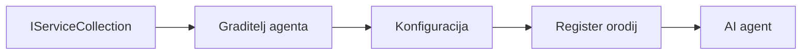

# 🎨 Vzorce Agentnega Oblikovanja z Azure OpenAI (Responses API) (.NET)

## 📋 Cilji učenja

Ta primer prikazuje zasnove na ravni podjetja za gradnjo inteligentnih agentov z uporabo Microsoft Agent Framework v .NET z integracijo Azure OpenAI (Responses API). Naučili se boste strokovne vzorce in arhitekturne pristope, ki agentom omogočajo pripravo za produkcijo, vzdrževanje in skalabilnost.

### Vzorci podjetja

- 🏭 **Factory Pattern**: Standardizirano ustvarjanje agentov z injekcijo odvisnosti
- 🔧 **Builder Pattern**: Fluent nastavitev in konfiguracija agentov
- 🧵 **Vzorci za varnost niti**: Vzporedno upravljanje pogovorov
- 📋 **Repository Pattern**: Organizirano upravljanje orodij in zmožnosti

## 🎯 Arhitekturne prednosti specifične za .NET

### Podjetniške funkcije

- **Močna tipizacija**: Validacija med prevajanjem in podpora IntelliSense
- **Injekcija odvisnosti**: Vgrajena integracija DI kontejnerja
- **Upravljanje konfiguracije**: Vzorci IConfiguration in Options
- **Async/Await**: Podpora asinhronemu programiranju prve vrste

### Vzorci pripravljeni za produkcijo

- **Integracija beleženja**: Podpora ILogger in strukturiranemu beleženju
- **Preverjanje stanja zdravja**: Vgrajeno spremljanje in diagnostika
- **Validacija konfiguracije**: Močna tipizacija z oznakami podatkov
- **Upravljanje napak**: Strukturirano upravljanje izjemo

## 🔧 Tehnična arhitektura

### Glavne .NET komponente

- **Microsoft.Extensions.AI**: Združene abstrakcije AI storitev
- **Microsoft.Agents.AI**: Okvir za orkestracijo agentov na ravni podjetja
- **Azure OpenAI (Responses API)**: Vzorci odjemalcev API za visoko zmogljivost
- **Sistem konfiguracije**: appsettings.json in integracija okolja

### Implementacija vzorcev oblikovanja



## 🏗️ Demonstrirani vzorci podjetja

### 1. **Vzročni vzorci**

- **Agentna tovarna**: Centralizirana izdelava agentov z dosledno konfiguracijo
- **Builder Pattern**: Fluent API za kompleksno konfiguracijo agentov
- **Singleton Pattern**: Skupno upravljanje virov in konfiguracije
- **Injekcija odvisnosti**: Rahla povezanost in testabilnost

### 2. **Vedenjski vzorci**

- **Strategy Pattern**: Zamenljive strategije izvajanja orodij
- **Command Pattern**: Zakodirane operacije agenta z možnostjo razveljavitve/ponovitve
- **Observer Pattern**: Upravljanje življenjskega cikla agenta, sproženega z dogodki
- **Template Method**: Standardizirani delovni tokovi izvajanja agenta

### 3. **Strukturni vzorci**

- **Adapter Pattern**: Plast integracije Azure OpenAI (Responses API)
- **Decorator Pattern**: Izboljšanje zmogljivosti agenta
- **Facade Pattern**: Poenostavljeni vmesniki za interakcijo z agentom
- **Proxy Pattern**: Lenobno nalaganje in predpomnjenje za zmogljivost

## 📚 .NET oblikovne smernice

### SOLID načela

- **Enotna odgovornost**: Vsak sestavni del ima jasno nalogo
- **Odprt/Zaprt**: Razširljiv brez spreminjanja izvorne kode
- **Liskovova substitucija**: Izvajanja orodij na osnovi vmesnikov
- **Ločevanje vmesnikov**: Osredotočeni, kohezivni vmesniki
- **Inverzija odvisnosti**: Odvisnost od abstrakcij, ne od konkretnih implementacij

### Čista arhitektura

- **Plast domen**: Osnovne abstrakcije agentov in orodij
- **Plast aplikacije**: Orkestracija agentov in delovni tokovi
- **Plast infrastrukture**: Integracija Azure OpenAI (Responses API) in zunanje storitve
- **Plast predstavitve**: Uporabniška interakcija in oblikovanje odgovorov

## 🔒 Podjetniške premisleke

### Varnost

- **Upravljanje poverilnic**: Varno upravljanje API ključev z IConfiguration
- **Validacija vnosa**: Močna tipizacija in preverjanje z oznakami podatkov
- **Čiščenje izhoda**: Varna obdelava in filtriranje odgovorov
- **Beleženje revizije**: Celovito sledenje operacijam

### Zmogljivost

- **Asinhroni vzorci**: Neblokirajoče I/O operacije
- **Grozd povezav**: Učinkovito upravljanje HTTP odjemalcev
- **Predpomnjenje**: Predpomnjenje odgovorov za izboljšano zmogljivost
- **Upravljanje virov**: Pravilno sproščanje in vzorci čiščenja

### Skalabilnost

- **Varnost niti**: Podpora vzporednemu izvajanju agentov
- **Grozd virov**: Učinkovita poraba virov
- **Upravljanje obremenitve**: Omejevanje hitrosti in upravljanje povratnega tlaka
- **Spremljanje**: Meritve zmogljivosti in kontrole stanja zdravja

## 🚀 Produkcijska namestitev

- **Upravljanje konfiguracije**: Nastavitve specifične za okolje
- **Strategija beleženja**: Strukturirano beleženje s korelacijskimi ID-ji
- **Upravljanje napak**: Globalno upravljanje izjem z ustreznim okrevanjem
- **Spremljanje**: Application Insights in merilci zmogljivosti
- **Testiranje**: Enotski testi, integracijski testi in vzorci za testiranje obremenitve

Ste pripravljeni zgraditi inteligentne agente na ravni podjetja z .NET? Zasnovimo nekaj robustnega! 🏢✨

## 🚀 Začetek

### Predpogoji

- [.NET 10 SDK](https://dotnet.microsoft.com/download/dotnet/10.0) ali novejši
- [Azure naročnina](https://azure.microsoft.com/free/) z virom Azure OpenAI in nameščeno različico modela
- [Azure CLI](https://learn.microsoft.com/cli/azure/install-azure-cli) — prijavite se z `az login`

### Zahtevane spremenljivke okolja

```bash
# zsh/bash
export AZURE_OPENAI_ENDPOINT=https://<your-resource>.openai.azure.com
export AZURE_OPENAI_DEPLOYMENT=gpt-5-mini
# Nato se prijavite, da lahko AzureCliCredential pridobi žeton
az login
```

```powershell
# PowerShell
$env:AZURE_OPENAI_ENDPOINT = "https://<your-resource>.openai.azure.com"
$env:AZURE_OPENAI_DEPLOYMENT = "gpt-5-mini"
# Nato se prijavite, da lahko AzureCliCredential pridobi žeton
az login
```

### Primer kode

Za zagon primera kode,

```bash
# zsh/bash
chmod +x ./03-dotnet-agent-framework.cs
./03-dotnet-agent-framework.cs
```

Ali z uporabo dotnet CLI:

```bash
dotnet run ./03-dotnet-agent-framework.cs
```

Oglejte si [`03-dotnet-agent-framework.cs`](../../../../03-agentic-design-patterns/code_samples/03-dotnet-agent-framework.cs) za celotno kodo.

```csharp
#!/usr/bin/dotnet run

#:package Microsoft.Extensions.AI@10.*
#:package Microsoft.Agents.AI.OpenAI@1.*-*
#:package Azure.AI.OpenAI@2.1.0
#:package Azure.Identity@1.13.1

using System.ComponentModel;

using Microsoft.Agents.AI;
using Microsoft.Extensions.AI;

using Azure.AI.OpenAI;
using Azure.Identity;

// Tool Function: Random Destination Generator
// This static method will be available to the agent as a callable tool
// The [Description] attribute helps the AI understand when to use this function
// This demonstrates how to create custom tools for AI agents
[Description("Provides a random vacation destination.")]
static string GetRandomDestination()
{
    // List of popular vacation destinations around the world
    // The agent will randomly select from these options
    var destinations = new List<string>
    {
        "Paris, France",
        "Tokyo, Japan",
        "New York City, USA",
        "Sydney, Australia",
        "Rome, Italy",
        "Barcelona, Spain",
        "Cape Town, South Africa",
        "Rio de Janeiro, Brazil",
        "Bangkok, Thailand",
        "Vancouver, Canada"
    };

    // Generate random index and return selected destination
    // Uses System.Random for simple random selection
    var random = new Random();
    int index = random.Next(destinations.Count);
    return destinations[index];
}

// Azure OpenAI with the Responses API (stable v1 endpoint). Sign in with `az login`.
var azureEndpoint = Environment.GetEnvironmentVariable("AZURE_OPENAI_ENDPOINT")
    ?? throw new InvalidOperationException("AZURE_OPENAI_ENDPOINT is not set.");
var deployment = Environment.GetEnvironmentVariable("AZURE_OPENAI_DEPLOYMENT") ?? "gpt-5-mini";

var azureClient = new AzureOpenAIClient(new Uri(azureEndpoint), new AzureCliCredential());

// Define Agent Identity and Comprehensive Instructions
// Agent name for identification and logging purposes
var AGENT_NAME = "TravelAgent";

// Detailed instructions that define the agent's personality, capabilities, and behavior
// This system prompt shapes how the agent responds and interacts with users
var AGENT_INSTRUCTIONS = """
You are a helpful AI Agent that can help plan vacations for customers.

Important: When users specify a destination, always plan for that location. Only suggest random destinations when the user hasn't specified a preference.

When the conversation begins, introduce yourself with this message:
"Hello! I'm your TravelAgent assistant. I can help plan vacations and suggest interesting destinations for you. Here are some things you can ask me:
1. Plan a day trip to a specific location
2. Suggest a random vacation destination
3. Find destinations with specific features (beaches, mountains, historical sites, etc.)
4. Plan an alternative trip if you don't like my first suggestion

What kind of trip would you like me to help you plan today?"

Always prioritize user preferences. If they mention a specific destination like "Bali" or "Paris," focus your planning on that location rather than suggesting alternatives.
""";

// Create AI Agent with Advanced Travel Planning Capabilities
// Get the Responses client for the deployment and create the AI agent
// Configure agent with name, detailed instructions, and available tools
// This demonstrates the .NET agent creation pattern with full configuration
AIAgent agent = azureClient
    .GetChatClient(deployment)
    .AsAIAgent(
        name: AGENT_NAME,
        instructions: AGENT_INSTRUCTIONS,
        tools: [AIFunctionFactory.Create(GetRandomDestination)]
    );

// Create New Conversation Session for Context Management
// Initialize a new conversation session to maintain context across multiple interactions
// Sessions enable the agent to remember previous exchanges and maintain conversational state
// This is essential for multi-turn conversations and contextual understanding
var session = await agent.CreateSessionAsync();

// Execute Agent: First Travel Planning Request
// Run the agent with an initial request that will likely trigger the random destination tool
// The agent will analyze the request, use the GetRandomDestination tool, and create an itinerary
// Using the session parameter maintains conversation context for subsequent interactions
await foreach (var update in agent.RunStreamingAsync("Plan me a day trip", session))
{
    await Task.Delay(10);
    Console.Write(update);
}

Console.WriteLine();

// Execute Agent: Follow-up Request with Context Awareness
// Demonstrate contextual conversation by referencing the previous response
// The agent remembers the previous destination suggestion and will provide an alternative
// This showcases the power of conversation sessions and contextual understanding in .NET agents
await foreach (var update in agent.RunStreamingAsync("I don't like that destination. Plan me another vacation.", session))
{
    await Task.Delay(10);
    Console.Write(update);
}
```

---

<!-- CO-OP TRANSLATOR DISCLAIMER START -->
**Omejitev odgovornosti**:
Ta dokument je bil preveden z uporabo AI prevajalske storitve [Co-op Translator](https://github.com/Azure/co-op-translator). Čeprav si prizadevamo za natančnost, vas prosimo, da upoštevate, da avtomatizirani prevodi lahko vsebujejo napake ali netočnosti. Izvirni dokument v njegovem izvirnem jeziku je treba obravnavati kot avtoritativni vir. Za kritične informacije je priporočljiv strokovni človeški prevod. Ne odgovarjamo za morebitna nesporazume ali napačne interpretacije, ki izhajajo iz uporabe tega prevoda.
<!-- CO-OP TRANSLATOR DISCLAIMER END -->