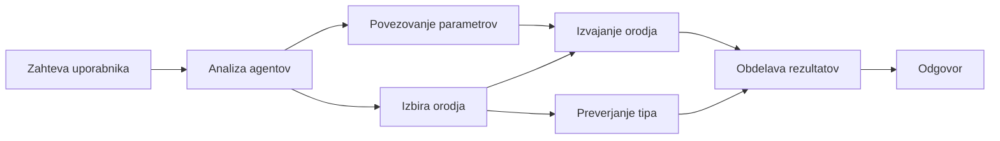

# 🛠️ Napredna uporaba orodij z Azure OpenAI (Responses API) (.NET)

## 📋 Cilji učenja

Ta zvezek prikazuje vzorce integracije orodij na ravni podjetja z uporabo Microsoft Agent Framework v .NET z Azure OpenAI (Responses API). Naučili se boste graditi sofisticirane agente z več specializiranimi orodji, pri čemer boste izkoristili močno tipizacijo C# in podjetniške funkcije .NET.

### Napredne zmogljivosti orodij, ki jih boste osvojili

- 🔧 **Arhitektura z več orodji**: Gradnja agentov z več specializiranimi zmogljivostmi
- 🎯 **Varno izvajanje orodij s tipizacijo**: Izraba preverjanja med prevajanjem v C#
- 📊 **Vzorce orodij za podjetja**: Oblikovanje orodij pripravljeno za proizvodnjo in upravljanje napak
- 🔗 **Sestava orodij**: Združevanje orodij za zapletene poslovne delovne tokove

## 🎯 Prednosti arhitekture orodij .NET

### Podjetniške funkcije orodij

- **Preverjanje med prevajanjem**: Močna tipizacija zagotavlja pravilnost parametrov orodij
- **Injektiranje odvisnosti**: Integracija IoC kontejnerja za upravljanje orodij
- **Vzorec Async/Await**: Neblokirajoče izvajanje orodij z ustreznim upravljanjem virov
- **Strukturirano beleženje**: Vgrajena integracija beleženja za spremljanje izvajanja orodij

### Vzorce pripravljeni za proizvodnjo

- **Upravljanje izjemo**: Celovito upravljanje napak s tipiziranimi izjemami
- **Upravljanje virov**: Ustrezni vzorci odstranjevanja in upravljanje pomnilnika
- **Spremljanje zmogljivosti**: Vgrajene metrike in števec zmogljivosti
- **Upravljanje konfiguracije**: Varna konfiguracija s tipizacijo in preverjanjem

## 🔧 Tehnična arhitektura

### Osnovni .NET komponenti orodij

- **Microsoft.Extensions.AI**: Združena plast abstrakcije orodij
- **Microsoft.Agents.AI**: Orkestracija orodij na ravni podjetja
- **Azure OpenAI (Responses API)**: Visokozmogljiv API klient z združevanjem povezav

### Cevovod izvajanja orodij



## 🛠️ Kategorije in vzorci orodij

### 1. **Orodja za obdelavo podatkov**

- **Preverjanje vhodnih podatkov**: Močna tipizacija z označevalci podatkov
- **Operacije transformacije**: Varna pretvorba in oblikovanje podatkov
- **Poslovna logika**: Orodja za izračune in analize, značilne za domeno
- **Oblikovanje izhodov**: Generiranje strukturiranih odgovorov

### 2. **Integracijska orodja**

- **API povezovalci**: Integracija RESTful storitev s HttpClient
- **Orodja za baze podatkov**: Integracija Entity Framework za dostop do podatkov
- **Datotečne operacije**: Varnostne datotečne operacije z validacijo
- **Zunanje storitve**: Vzorci integracije storitev tretjih oseb

### 3. **Uporabniška orodja**

- **Obdelava besedila**: Pripomočki za manipulacijo in oblikovanje nizi
- **Operacije datuma/časa**: Izračuni datuma/časa z upoštevanjem kulture
- **Matematična orodja**: Natančni izračuni in statistične operacije
- **Orodja za preverjanje**: Preverjanje poslovnih pravil in verifikacija podatkov

Ste pripravljeni zgraditi agente na ravni podjetja z zmogljivimi, varnimi orodji tipov v .NET? Zasnujmo nekaj profesionalnih rešitev! 🏢⚡

## 🚀 Začetek

### Predpogoji

- [.NET 10 SDK](https://dotnet.microsoft.com/download/dotnet/10.0) ali novejši
- [Azure naročnina](https://azure.microsoft.com/free/) z Azure OpenAI virom in nameščeno modelno storitvijo
- [Azure CLI](https://learn.microsoft.com/cli/azure/install-azure-cli) — prijavite se z `az login`

### Potrebne okoljske spremenljivke

```bash
# zsh/bash
export AZURE_OPENAI_ENDPOINT=https://<your-resource>.openai.azure.com
export AZURE_OPENAI_DEPLOYMENT=gpt-5-mini
# Nato se prijavite, da lahko AzureCliCredential pridobi žeton
az login
```

```powershell
# PowerShell
$env:AZURE_OPENAI_ENDPOINT = "https://<your-resource>.openai.azure.com"
$env:AZURE_OPENAI_DEPLOYMENT = "gpt-5-mini"
# Nato se prijavite, da lahko AzureCliCredential pridobi žeton
az login
```

### Primer kode

Za zagon primer kode,

```bash
# zsh/bash
chmod +x ./04-dotnet-agent-framework.cs
./04-dotnet-agent-framework.cs
```

Ali z uporabo dotnet CLI:

```bash
dotnet run ./04-dotnet-agent-framework.cs
```

Oglejte si [`04-dotnet-agent-framework.cs`](../../../../04-tool-use/code_samples/04-dotnet-agent-framework.cs) za celotno kodo.

```csharp
#!/usr/bin/dotnet run

#:package Microsoft.Extensions.AI@10.*
#:package Microsoft.Agents.AI.OpenAI@1.*-*
#:package Azure.AI.OpenAI@2.1.0
#:package Azure.Identity@1.13.1

using System.ComponentModel;

using Microsoft.Agents.AI;
using Microsoft.Extensions.AI;

using Azure.AI.OpenAI;
using Azure.Identity;

// Tool Function: Random Destination Generator
// This static method will be available to the agent as a callable tool
// The [Description] attribute helps the AI understand when to use this function
// This demonstrates how to create custom tools for AI agents
[Description("Provides a random vacation destination.")]
static string GetRandomDestination()
{
    // List of popular vacation destinations around the world
    // The agent will randomly select from these options
    var destinations = new List<string>
    {
        "Paris, France",
        "Tokyo, Japan",
        "New York City, USA",
        "Sydney, Australia",
        "Rome, Italy",
        "Barcelona, Spain",
        "Cape Town, South Africa",
        "Rio de Janeiro, Brazil",
        "Bangkok, Thailand",
        "Vancouver, Canada"
    };

    // Generate random index and return selected destination
    // Uses System.Random for simple random selection
    var random = new Random();
    int index = random.Next(destinations.Count);
    return destinations[index];
}

// Azure OpenAI with the Responses API (stable v1 endpoint). Sign in with `az login`.
var azureEndpoint = Environment.GetEnvironmentVariable("AZURE_OPENAI_ENDPOINT")
    ?? throw new InvalidOperationException("AZURE_OPENAI_ENDPOINT is not set.");
var deployment = Environment.GetEnvironmentVariable("AZURE_OPENAI_DEPLOYMENT") ?? "gpt-5-mini";

var azureClient = new AzureOpenAIClient(new Uri(azureEndpoint), new AzureCliCredential());

// Define Agent Identity and Comprehensive Instructions
// Agent name for identification and logging purposes
var AGENT_NAME = "TravelAgent";

// Detailed instructions that define the agent's personality, capabilities, and behavior
// This system prompt shapes how the agent responds and interacts with users
var AGENT_INSTRUCTIONS = """
You are a helpful AI Agent that can help plan vacations for customers.

Important: When users specify a destination, always plan for that location. Only suggest random destinations when the user hasn't specified a preference.

When the conversation begins, introduce yourself with this message:
"Hello! I'm your TravelAgent assistant. I can help plan vacations and suggest interesting destinations for you. Here are some things you can ask me:
1. Plan a day trip to a specific location
2. Suggest a random vacation destination
3. Find destinations with specific features (beaches, mountains, historical sites, etc.)
4. Plan an alternative trip if you don't like my first suggestion

What kind of trip would you like me to help you plan today?"

Always prioritize user preferences. If they mention a specific destination like "Bali" or "Paris," focus your planning on that location rather than suggesting alternatives.
""";

// Create AI Agent with Advanced Travel Planning Capabilities
// Get the Responses client for the deployment and create the AI agent
// Configure agent with name, detailed instructions, and available tools
// This demonstrates the .NET agent creation pattern with full configuration
AIAgent agent = azureClient
    .GetChatClient(deployment)
    .AsAIAgent(
        name: AGENT_NAME,
        instructions: AGENT_INSTRUCTIONS,
        tools: [AIFunctionFactory.Create(GetRandomDestination)]
    );

// Create New Conversation Session for Context Management
// Initialize a new conversation session to maintain context across multiple interactions
// Sessions enable the agent to remember previous exchanges and maintain conversational state
// This is essential for multi-turn conversations and contextual understanding
await using var session = await agent.CreateSessionAsync();

// Execute Agent: First Travel Planning Request
// Run the agent with an initial request that will likely trigger the random destination tool
// The agent will analyze the request, use the GetRandomDestination tool, and create an itinerary
// Using the session parameter maintains conversation context for subsequent interactions
await foreach (var update in agent.RunStreamingAsync("Plan me a day trip", session))
{
    await Task.Delay(10);
    Console.Write(update);
}

Console.WriteLine();

// Execute Agent: Follow-up Request with Context Awareness
// Demonstrate contextual conversation by referencing the previous response
// The agent remembers the previous destination suggestion and will provide an alternative
// This showcases the power of conversation sessions and contextual understanding in .NET agents
await foreach (var update in agent.RunStreamingAsync("I don't like that destination. Plan me another vacation.", session))
{
    await Task.Delay(10);
    Console.Write(update);
}
```

---

<!-- CO-OP TRANSLATOR DISCLAIMER START -->
**Omejitev odgovornosti**:
Ta dokument je bil preveden z uporabo AI prevajalske storitve [Co-op Translator](https://github.com/Azure/co-op-translator). Čeprav si prizadevamo za natančnost, vas prosimo, da upoštevate, da avtomatizirani prevodi lahko vsebujejo napake ali netočnosti. Izvirni dokument v njegovem izvirnem jeziku je treba obravnavati kot avtoritativni vir. Za kritične informacije je priporočljiv strokovni človeški prevod. Ne odgovarjamo za morebitna nesporazume ali napačne interpretacije, ki izhajajo iz uporabe tega prevoda.
<!-- CO-OP TRANSLATOR DISCLAIMER END -->