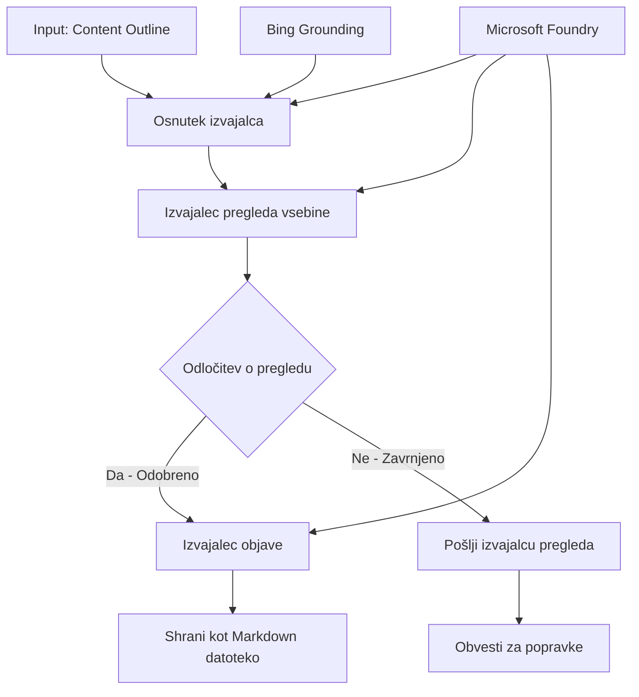

# 🔀 Pogoji delovni tok agentov z Microsoft Foundry (.NET)

## 📋 Vadnica o inteligentno odločanju na podlagi delovnega toka

Ta zvezek prikazuje **pogoje delovnih tokov** z uporabo Microsoft Foundry in Microsoft Agent Framework za .NET. Naučili se boste, kako zgraditi sofisticirane, odločitvam usmerjene delovne tokove, ki inteligentno usmerjajo obdelavo na podlagi analize AI, poslovnih pravil in dinamičnih pogojev za avtomatizacijo na ravni podjetja.

## 🎯 Cilji učenja

### 🧠 **Inteligentna arhitektura odločanja**
- **Implementacija pogojevne logike**: Zgradite kompleksna drevesa odločitev z več točkami razvejanja
- **Usmerjanje na podlagi AI**: Uporabite modele Microsoft Foundry za inteligentne odločitve o usmerjanju
- **Dinamična prilagoditev delovnega toka**: Spremeni vedenje delovnega toka na podlagi analize in pogojev v času izvajanja
- **Integracija poslovnih pravil**: Vdelajte poslovno logiko in zahteve skladnosti v delovne tokove

### 🔀 **Napredni pogoji vzorec**
- **Odločanje na podlagi več kriterijev**: Ocenjujte več dejavnikov za odločitve o usmerjanju
- **Obdelava z zavedanjem konteksta**: Sprejmite odločitve na podlagi zbranega konteksta in zgodovine delovnega toka
- **Adaptivna sprememba delovnega toka**: Dinamično prilagodite poti obdelave glede na realne pogoje
- **Integracija pogonskih pravil**: Implementirajte sofisticirane pogonske mehanizme poslovnih pravil znotraj delovnih tokov

### 🏢 **Pogoji uporabe v podjetjih**
- **Klasifikacija dokumentov in usmerjanje**: Samodejno razvrščanje in usmerjanje dokumentov v ustrezne delovne tokove
- **Triaža storitev za stranke**: Inteligentno usmerjanje poizvedb strank do specializiranih ekip za obravnavo
- **Obdelava skladnosti in tveganj**: Uporabite različne postopke preverjanja in pregleda glede na oceno tveganja
- **Delovni tok kakovostnega zagotavljanja**: Usmerjanje vsebine skozi ustrezne postopke pregleda na podlagi meril kakovosti

## ⚙️ Zahteve in nastavitve

### 📦 **Zahtevani NuGet paketi**

Napredni paketi za obdelavo pogojevanja delovnih tokov:

```xml
<!-- Core AI Framework -->
<PackageReference Include="Microsoft.Extensions.AI" Version="9.9.0" />

<!-- Azure AI Agents with Persistent State -->
<PackageReference Include="Azure.AI.Agents.Persistent" Version="1.2.0-beta.5" />

<!-- Azure Identity and Utilities -->
<PackageReference Include="Azure.Identity" Version="1.15.0" />
<PackageReference Include="System.Linq.Async" Version="6.0.3" />
<PackageReference Include="DotNetEnv" Version="3.1.1" />

<!-- Local Workflow Framework References -->
<!-- Microsoft.Agents.Workflows.dll - Advanced workflow orchestration -->
<!-- Microsoft.Agents.AI.AzureAI.dll - Microsoft Foundry integration -->
<!-- Microsoft.Agents.AI.dll - Core agent abstractions -->
```

### 🔑 **Konfiguracija Microsoft Foundry**

**Zahtevani Azure viri:**
- Delovno okolje Microsoft Foundry z modeli za pogojno obdelavo
- Azure naročnina z ustreznimi kvotami in dovoljenji za računalniške vire
- Nameščeni AI modeli za odločanje in analizo vsebine
- (Neobvezno) povezava z Bing Search API za možnosti temeljenja na resničnih podatkih

**Konfiguracija okolja (datoteka .env):**
```env
# Microsoft Foundry Configuration
AZURE_AI_PROJECT_ENDPOINT=https://your-project.cognitiveservices.azure.com/
BING_CONNECTION_ID=your-bing-connection-id
```

**Nastavitve overjanja:**
```csharp
// Azure CLI or Managed Identity authentication
using Azure.Identity;
var credential = new AzureCliCredential();

// Load environment configuration
DotNetEnv.Env.Load("../../../.env");
```

### 🏗️ **Arhitektura pogojevnega delovnega toka**



**Ključne komponente:**
- **Executor osnutkov**: AI agent, ki ustvarja začetne osnutke vsebine iz okvirjev
- **Executor pregleda vsebine**: AI agent, ki ocenjuje kakovost in skladnost osnutkov
- **Pogoji usmerjanja**: Logika odločanja, ki usmerja na podlagi rezultatov pregleda
- **Poti objave/pregleda**: Ločene poti obdelave za odobrene in zavrnjene vsebine
- **Upravljanje stanja**: Ohranja kontekst vsebine in pregleda skozi delovni tok

## 🎨 **Vzorci oblikovanja pogojevnih delovnih tokov**

### 📋 **Produkcija vsebine z vratci kakovosti**
```
Outline → Draft Creation → Quality Review → {Approve: Publish | Reject: Revise}
```

### 🎯 **Obdelava dokumentov na podlagi tveganj**
```
Document → Risk Assessment → {Low: Standard | High: Enhanced Review}
```

### 🔍 **Inteligentno usmerjanje storitev za stranke**
```
Customer Query → Analysis → {Simple: FAQ Bot | Complex: Human Agent}
```

### 💼 **Delovni tok skladnosti**
```
Content → Compliance Check → {Pass: Publish | Fail: Legal Review}
```

## 🏢 **Prednosti pogojevnih delovnih tokov za podjetja**

### 🎯 **Inteligentna avtomatizacija**
- **Pametno odločanje**: Odločitve o usmerjanju z podporo AI na podlagi analize vsebine in konteksta
- **Adaptivna obdelava**: Delovni tokovi, ki se samodejno prilagajajo spreminjajočim se pogojem
- **Izvajanje poslovnih pravil**: Samodejna uporaba kompleksne poslovne logike in politik
- **Usmerjanje s kontekstom**: Odločitve z upoštevanjem celotne zgodovine in zbranega konteksta delovnega toka

### 📈 **Operativna odličnost**
- **Optimizirana dodelitev virov**: Usmerjanje dela do najbolj primernih strokovnjakov in postopkov
- **Zmanjšano ročno posredovanje**: Avtomatizirano odločanje zmanjšuje potrebo po ročnem usmerjanju
- **Hitrejši čas reševanja**: Neposredno usmerjanje do ustrezne strokovnosti in zmogljivosti obdelave
- **Dosledna uporaba**: Enotna uporaba poslovnih pravil in kriterijev odločanja

### 🛡️ **Upravljanje tveganj in skladnost**
- **Samodejna ocena tveganj**: AI-podprta ocena nivojev tveganja vsebine in situacije
- **Izvajanje skladnosti**: Samodejeno usmerjanje skozi zahtevane regulativne postopke
- **Uporaba varnostnih protokolov**: Izboljšane varnostne ukrepe uporabi glede na oceno tveganja
- **Vodenje revizijske sledi**: Popolna dokumentacija odločitev o usmerjanju in utemeljitev

### 📊 **Analitika in stalno izboljševanje**
- **Analitika odločitev**: Spremljanje učinkovitosti in točnosti odločitev o usmerjanju
- **Prepoznavanje vzorcev**: Prepoznajte trende in vzorce v odločitvah o usmerjanju skozi čas
- **Optimizacija zmogljivosti**: Stalno izboljševanje kriterijev odločanja in učinkovitosti usmerjanja
- **Poslovna inteligenca**: Vpogledi v značilnosti vsebine in zahteve obdelave

### 🔧 **Tehnična odličnost**
- **Vztrajno upravljanje stanja**: Ohranjanje kompleksnega stanja skozi izvajanje delovnega toka
- **Razširljiva arhitektura**: Obvladovanje zahtev po obdelavi pogojev v velikem obsegu
- **Integracijske zmogljivosti**: Brezšivna integracija z obstoječimi poslovnimi sistemi in procesi
- **Nadzor in opazovanje**: Celovito spremljanje zmogljivosti in odločitev delovnega toka

Zgradimo inteligentne, odločitvam usmerjene delovne tokove podjetja z .NET! 🚀

## 💻 Zagon kode

Celotna implementacija je na voljo v `04.dotnet-agent-framework-workflow-aifoundry-condition.cs`. Prikazuje **delovni tok produkcije vsebine z vratci kakovosti**:

### 🏗️ **Arhitektura delovnega toka**

```
Content Outline → Draft Creation → Quality Review → Conditional Routing:
                                                      ├─ Approved (>200 words) → Publish
                                                      └─ Rejected (<200 words) → Review Notification
```

**Agenti v delovnem toku:**
1. **Evangelist Agent**: Ustvari osnutke vadnice iz obrisov z Bing temeljenjem
2. **Content Reviewer Agent**: Ocenjuje kakovost osnutka (število besed, popolnost)
3. **Publisher Agent**: Shrani odobreno vsebino kot časovno označene Markdown datoteke

**Custom Executors:**
1. **DraftExecutor**: Koordinira ustvarjanje osnutkov
2. **ContentReviewExecutor**: Izvaja oceno kakovosti
3. **PublishExecutor**: Obravnava objavo odobrene vsebine
4. **SendReviewExecutor**: Upravljanje obvestil o zavrnjeni vsebini

### 🚀 Zagon primera

**Predpogoji:**
- Konfigurirano delovno okolje Microsoft Foundry
- Overjanje preko Azure CLI (`az login`)
- (Neobvezno) povezava Bing Search za temeljenje

```bash
# Naredite skripto izvršljivo (Unix/Linux/macOS)
chmod +x 04.dotnet-agent-framework-workflow-aifoundry-condition.cs

# Zaženite pogojni potek dela
./04.dotnet-agent-framework-workflow-aifoundry-condition.cs
```

Ali na Windows:
```powershell
dotnet run 04.dotnet-agent-framework-workflow-aifoundry-condition.cs
```

### 📝 Pričakovan izhod

Delovni tok bo:
1. **Ustvaril agente**: Inicializira tri specializirane agente Microsoft Foundry
2. **Generiral osnutek**: Evangelist agent ustvari osnutek vadnice iz obrise
3. **Pregledal vsebino**: Content Reviewer oceni kakovost osnutka
4. **Pogoji usmerjanja**:
   - **Če odobreno (>200 besed)**: Publish executor shrani kot Markdown datoteko
   - **Če zavrnjeno (<200 besed)**: Pošlje obvestilo o pregledu
5. **Prikaže rezultate**: Pokaže končni izid delovnega toka

### 🔧 Možnosti prilagoditve

**Spremeni kriterije pregleda:**
```csharp
const string ContentReviewerInstructions = @"
You are a content reviewer...
1. Check if content is more than 500 words (instead of 200)
2. Verify technical accuracy
3. Ensure proper formatting
...";
```

**Dodaj več pogojevalnih poti:**
```csharp
var workflow = new WorkflowBuilder(draftExecutor)
    .AddEdge(draftExecutor, contentReviewerExecutor)
    .AddEdge(contentReviewerExecutor, publishExecutor, condition: GetCondition("Excellent"))
    .AddEdge(contentReviewerExecutor, editExecutor, condition: GetCondition("Good"))
    .AddEdge(contentReviewerExecutor, sendReviewerExecutor, condition: GetCondition("Poor"))
    .Build();
```

**Spremeni zahteve glede vsebine:**
```csharp
string OUTLINE_Content = @"
# Your Custom Topic
## Section 1
https://your-reference-url
## Section 2
...
";
```

### 🎯 Praktične uporabe

Ta vzorec pogojevalnega delovnega toka je idealen za:
- **Sistemi upravljanja vsebin**: Avtomatizirani uredniški delovni tokovi z vratci kakovosti
- **Obdelava dokumentov**: Usmerjanje dokumentov glede na klasifikacijo in skladnost
- **Podpora strankam**: Inteligentno usmerjanje zahtevkov glede na kompleksnost in nujnost
- **Pravni pregledi**: Usmerjanje pogodb glede na oceno tveganja in vrednost
- **Procesi kadrovanja**: Usmerjanje prijav skozi ustrezne presejalne delovne tokove

### 🔍 Razumevanje pogojevne logike

**Funkcija pogoja:**
```csharp
public Func<object?, bool> GetCondition(string expectedResult) =>
    reviewResult => reviewResult is ReviewResult review && review.Result == expectedResult;
```

Ta funkcija ustvari predikat, ki:
1. Preveri, ali je rezultat tipa `ReviewResult`
2. Primerja lastnost `Result` s pričakovano vrednostjo
3. Vrne true/false za določitev poti usmerjanja

**Robovi delovnega toka s pogoji:**
```csharp
.AddEdge(contentReviewerExecutor, publishExecutor, condition: GetCondition("Yes"))
.AddEdge(contentReviewerExecutor, sendReviewerExecutor, condition: GetCondition("No"))
```

### 📊 Napredne funkcije

**Validacija JSON sheme:**
Delovni tok uporablja JSON sheme za zagotavljanje strukturiranih odzivov:

```csharp
// Define response structure
public class ReviewResult
{
    [JsonPropertyName("review_result")]
    public string Result { get; set; } = string.Empty;
    
    [JsonPropertyName("reason")]
    public string Reason { get; set; } = string.Empty;
    
    [JsonPropertyName("draft_content")]
    public string DraftContent { get; set; } = string.Empty;
}

// Apply to agent
ResponseFormat = ChatResponseFormat.ForJsonSchema(
    AIJsonUtilities.CreateJsonSchema(typeof(ReviewResult)), 
    "ReviewResult", 
    "Review Result From DraftContent"
)
```

**Integracija Bing temeljenja:**
Evangelist agent uporablja Bing temeljenje za dostop do informacij v realnem času:

```csharp
var bingGroundingConfig = new BingGroundingSearchConfiguration(bing_conn_id);
BingGroundingToolDefinition bingGroundingTool = new(
    new BingGroundingSearchToolParameters([bingGroundingConfig])
);
```

To omogoča agentu sledenje URL-jem v obrisu in pridobivanje aktualnih informacij.

### 🛡️ Ravnanje z napakami

Delovni tok vključuje robustno obravnavo napak za zavrnjeno vsebino:
- Napake pregleda sprožijo alternativno pot
- Obvestila nudijo jasne razloge za zavrnitev
- Vsebina je ohranjena za revizijo

### 🔄 Razširitev delovnega toka

**Dodaj zanko pregleda:**
Ustvari povratno zanko, ki samodejno ponovno ustvari osnutke:

```csharp
.AddEdge(contentReviewerExecutor, publishExecutor, condition: GetCondition("Yes"))
.AddEdge(contentReviewerExecutor, draftExecutor, condition: GetCondition("No")) // Loop back
```

**Implementiraj večstopenjski pregled:**
Dodaj več stopenj pregleda z različnimi kriteriji:

```csharp
.AddEdge(draftExecutor, technicalReviewer)
.AddEdge(technicalReviewer, editorialReviewer, condition: GetCondition("TechPass"))
.AddEdge(editorialReviewer, publishExecutor, condition: GetCondition("EditPass"))
```

Ta pogojevalni vzorec delovnega toka omogoča gradnjo sofisticiranih, inteligentnih sistemov avtomatizacije podjetja! 🚀

---

<!-- CO-OP TRANSLATOR DISCLAIMER START -->
**Omejitev odgovornosti**:
Ta dokument je bil preveden z uporabo AI prevajalske storitve [Co-op Translator](https://github.com/Azure/co-op-translator). Čeprav si prizadevamo za natančnost, vas prosimo, da upoštevate, da avtomatizirani prevodi lahko vsebujejo napake ali netočnosti. Izvirni dokument v njegovem izvirnem jeziku je treba obravnavati kot avtoritativni vir. Za kritične informacije je priporočljiv strokovni človeški prevod. Ne odgovarjamo za morebitna nesporazume ali napačne interpretacije, ki izhajajo iz uporabe tega prevoda.
<!-- CO-OP TRANSLATOR DISCLAIMER END -->