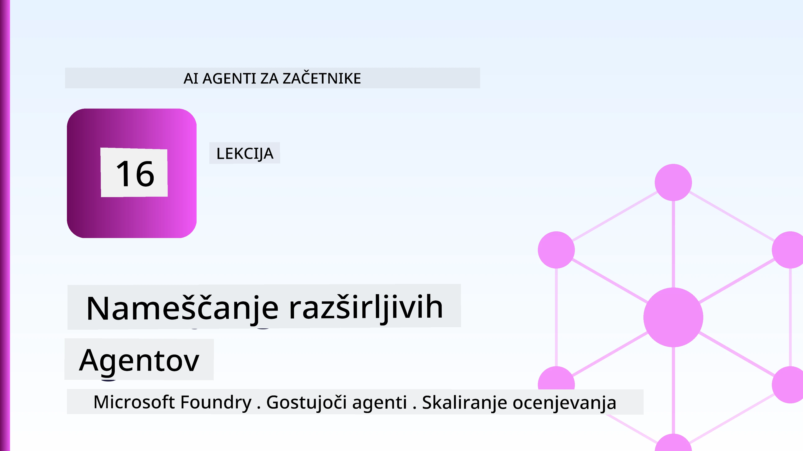
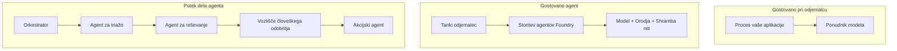
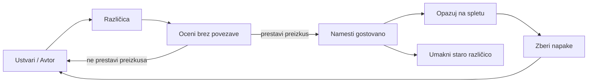
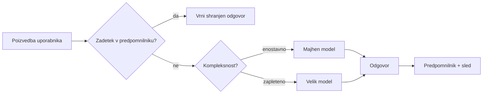
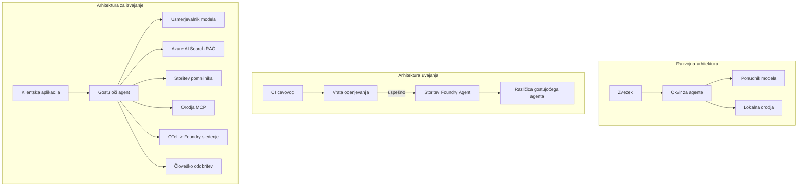

# Uvajanje skalabilnih agentov z Microsoft Foundry



Do te točke v tečaju ste zgradili agente, ki tečejo na vašem prenosniku, znotraj zvezka, vodeni z `az login` in nekaj spremenljivkami okolja. To je natanko pravi način za učenje. Ni pa pravi način za zagon agenta, na katerega se zanaša tisoče strank ob 3. uri zjutraj.

Ta lekcija govori o vrzeli med "deluje na mojem računalniku" in "deluje zanesljivo in poceni v produkciji." To vrzel zapremo s pomočjo **Microsoft Foundry** in **Microsoft Foundry Agent Service**, in to storimo tako, da zgradimo resničnega agenta za podporo strankam, ki ima orodja, iskanje, pomnilnik, ocenjevanje in nadzor.

## Uvod

Ta lekcija obravnava:

- Razliko med **prototipnim agentom** in **uvajanjem agenta**, in zakaj je prehod večinoma povezan z vsem, kar je *okoli* modela.
- **Vzorce uvajanja** za agente: gostovani na odjemalcu, gostovani kot storitev (Hosted Agents) in orkestrirani s potekom dela.
- **Življenjski cikel agenta** na Microsoft Foundry — ustvarjanje, verzioniranje, uvajanje, ocenjevanje, opazovanje, upokojitev.
- **Strategije skaliranja**: usmerjanje modela, predpomnjenje, sočasnost in brezstaten dizajn.
- **Opazljivost** z OpenTelemetry in sledenjem v Foundry.
- **Optimizacija stroškov** preko izbire modela, usmerjanja in ocenjevalnih vrat.
- **Podjetniški premisleki**: upravljanje, človek v zanki in varno zagon MCP strežnikov v produkciji.

## Cilji učenja

Po končani tej lekciji boste znali:

- Izbrati pravi vzorec uvajanja za dano delovno obremenitev agenta.
- Uvajati agenta v Microsoft Foundry Agent Service tako, da je versioniran, upravljan in opazen.
- Oroditi agenta za sledenje in povezati ocenjevalni cevovod, ki teče pred vsako objavo.
- Uporabiti usmerjanje modela in predpomnjenje za nadzor latence in stroškov pri večjih obremenitvah.
- Dodati človeško potrditev za visokorizične akcije in integrirati MCP strežnik na varen način za produkcijo.

## Predpogoji

Ta lekcija predvideva, da ste zaključili prejšnje lekcije in se udobno spoznate z:

- Gradnjo agentov z [Microsoft Agent Framework](../14-microsoft-agent-framework/README.md) (Lekcija 14).
- [Uporaba orodij](../04-tool-use/README.md) (Lekcija 4) in [Agentic RAG](../05-agentic-rag/README.md) (Lekcija 5).
- [Agentov spomin](../13-agent-memory/README.md) (Lekcija 13) in [Agentic protokoli / MCP](../11-agentic-protocols/README.md) (Lekcija 11).
- [Opazljivost in ocenjevanje](../10-ai-agents-production/README.md) (Lekcija 10) — ta lekcija neposredno gradi na njej.

Prav tako boste potrebovali:

- **Azure naročnino** in **Microsoft Foundry projekt**, ki ima vsaj en uvajan klepetalni model.
- Avtenticirano **Azure CLI** (`az login`).
- Python 3.12+ in pakete iz repozitorija [`requirements.txt`](../../../requirements.txt).

## Od prototipa do produkcije: kaj se dejansko spremeni

Prototipni agent in produkcijski agent imata skupno jedro zanke — sklepanje, klic orodij, odziv. Spremeni se vse, kar je zavito okoli te zanke. Model predstavlja morda 20 % produkcijskega agenta; preostalih 80 % je operativni okvir.

| Skrb | Prototip | Produkcija |
| --- | --- | --- |
| **Gostovanje** | Teče v vašem zvezku | Teče kot gostovana storitev, verzionirana in razširjena |
| **Identiteta** | Vaš `az login` žeton | Upravljana identiteta z omejenim RBAC-om |
| **Stanje** | V pomnilniku, izgubljeno ob ponovnem zagonu | Eksternalizirano (shranjevanje nitk, servis pomnilnika) |
| **Napaka** | Vidite sled napake | Poskusi, rezervne poti, mrtve črke, opozorila |
| **Stroški** | "To je nekaj centov" | Spremljano na zahtevo, usmerjeno, predpomnjeno, proračunano |
| **Kakovost** | Ocena po občutku | Samodejno ocenjevano pred vsako izdajo |
| **Zaupanje** | Potrjujete vsak ukrep | Politika + človek v zanki za tvegane akcije |

Zadržite ta tabelo v mislih. Vsak spodnji razdelek ustreza enemu od teh vrstic.

## Vzorec uvajanja agenta

Obstajajo trije vzorci, ki jih boste uporabljali, pogosto v kombinaciji.

### 1. Agenti gostovani na odjemalcu

Agent objekt prebiva znotraj *vašega* procesa aplikacije. Vaša koda kliče model neposredno; zanka sklepov teče v vaši storitvi. To je tisto, kar so naredile vse prejšnje lekcije.

- **Uporabite ga, kadar** potrebujete popoln nadzor nad zanko, lastno vmesno programsko opremo ali če vgrajujete agenta znotraj obstoječega backend sistema.
- **Kompenzacija**: sami skrbite za skaliranje, stanje in odpornost.

### 2. Gostovani agenti (Foundry Agent Service)

Agent je *registriran kot sredstvo* v Microsoft Foundry. Foundry gostuje zanko sklepov, shranjuje nitke, izvaja varnost vsebine in RBAC, ter omogoča, da je agent viden v portalu Foundry. Vaša aplikacija postane tanek odjemalec, ki ustvarja nitke in bere odgovore.

- **Uporabite ga, kadar** želite vzdržljivost, vgrajeno opazljivost, upravljanje in manj operativne površine.
- **Kompenzacija**: manj nizkonivojskega nadzora v zameno za upravljano izvajanje.

### 3. Poteki dela agentov

Več agentov (in orodij) je sestavljeno v graf z eksplicitnim tokom kontrole — zaporedni koraki, vejitve, vozlišča človeške potrditve in vzdržljivi kontrolni točki, ki lahko premorijo in nadaljujejo. To je zmožnost Microsoft Agent Framework **Workflows** uporabljena na skali uvajanja.

- **Uporabite ga, kadar** ena naloga zajema več specializiranih agentov ali zahteva korak potrditve vmes.
- **Kompenzacija**: več premikajočih se delov; zahteva opazljivost na ravni orkestracije.



## Življenjski cikel agenta na Microsoft Foundry

Uvajanje agenta ni enkraten `push`. Je zanka in zelo spominja na cikel izdaje programske opreme, ker je to natanko to.



Ključna ideja, prevzeta iz [Lekcije 10](../10-ai-agents-production/README.md): **ocenjevanje brez povezave je vrata, ne stranski produkt.** Nova verzija agenta ne izide, če ne prestane vaših ocenjevalnih pragov. Opazljivost v spletu nato vrača resnične napake nazaj v vaš offline testni nabor. To je celotna zanka.

## Strategije skaliranja

Skaliranje agenta se razlikuje od skaliranja brezstatenega spletnega API-ja, ker vsak zahtevek lahko sproži več dragih klicev modela in orodij. Štiri tehnike nosijo največ obremenitve.

**Obdelava brezstatenih zahtev.** V svojem pomnilniku procesa ne hranite stanja posameznega uporabnika. Shranite niti pogovorov v Foundry threadstore ali memorijski servis, tako da lahko katerakoli instanca obdela katerokoli zahtevo. To vam omogoča horizontalno skaliranje — dodajte instance, brez lepljivih sej.

**Usmerjanje modela.** Ne vsaka zahteva potrebuje vaš najbolj zmogljiv (in najdražji) model. Preproste zahteve — klasifikacija namena, kratki dejanski odgovori — usmerite na majhen, hiter model, velikega pa rezervirajte za pravo sklepanje. Foundryjev **Model Router** to lahko stori namesto vas, ali pa sami implementirate lahkoten klasifikator. Ta različica bo relativno enostavna in jo boste zgradili v laboratoriju.

**Predpomnjenje odzivov.** Veliko poizvedb podpore je skoraj enakih ("kako ponastavim geslo?"). Predpomnite odgovore na pogosta vprašanja in jih strežite brez klica modela. Tudi zmerna stopnja udarcev v predpomnilnik znatno zniža stroške in latenco.

**Sočasnost in povratni tlak.** Ponudniki modelov imajo omejitve hitrosti. Omejite svojo sočasnost, uporabite poskuse z eksponentnim vračanjem nazaj, in neuspeli pokušaji naj prijazno odpovejo (vrstni odgovor "ukvarjamo se s tem" je boljši kot 500 napaka).



## Opazljivost v produkciji

Ne morete upravljati tistega, česar ne vidite. Kot je razloženo v Lekciji 10, Microsoft Agent Framework zadrži **OpenTelemetry** sledi nativno — vsak klic modela, orodja in korak orkestracije postane sledi. V produkciji izvažate te sledi v Microsoft Foundry (ali katerokoli OTel-kompatibilno ozadje), da lahko:

- Sledite enemu pritožbi stranke od začetka do konca čez vsak klic modela in orodja.
- Spremljate p50/p95 latenco in stroške na zahtevo skozi čas.
- Opozorite ob zvišanju stopnje napak in nepravilnostih stroškov preden jih uporabniki (ali vaša finančna ekipa) opazijo.

```python
from agent_framework.observability import get_tracer

tracer = get_tracer()

with tracer.start_as_current_span("support_request") as span:
    span.set_attribute("customer.tier", "enterprise")
    span.set_attribute("routed.model", "gpt-4.1-mini")
    # izvajanje agenta se samodejno sledi znotraj tega obsega
```

Atributi kot `customer.tier` in `routed.model` so tisti, ki spremenijo zid sledi v vprašanja z odgovori ("ali podjetniške stranke preveč pogosto usmerjamo v majhen model?").

## Optimizacija stroškov

Stroški v produkcijskih agentih so dominirani s tokeni. Tri ročice, po vplivu:

1. **Pravi obseg modela.** Majhen model, ki prestane vaša ocenjevalna vrata, je skoraj vedno cenejši od velikega, ki prav tako uspe. Uporabite ocenjevanje, da *dokažete*, da je majhen model dovolj dober, namesto da iz previdnosti izberete največjega.
2. **Usmerjanje glede na kompleksnost.** Kot zgoraj — plačajte model velikega formata le za zahteve, ki potrebujejo sklepanje velikega modela.
3. **Agresivno predpomnjenje.** Najcenejši klic modela je tisti, ki ga nikoli ne opravite.

Ocenjevalna vrata in nadzor stroškov sta ista disciplina iz dveh vidikov: ocenjevanje vam pove *kakovostno spodnjo mejo*, usmerjanje in predpomnjenje pa vas držijo čim bližje *stroškovni* meji te spodnje meje.

## Podjetniški premisleki uvajanja

**Upravljanje.** Gostovani agenti dedujejo Foundryjev RBAC, varnost vsebine in revizijske zapise. Vsakemu agentu dajte upravljano identiteto z najmanj pravicami, ki jih potrebuje — samo za branje baze znanja, omejen dostop do vmesnika za prijavo vozovnic, nič več.

**Človek v zanki.** Nekateri ukrepi so preveč pomembni, da bi jih avtomatizirali brez nadzora — vračilo denarja, brisanje računa, eskalacija pravni ekipi. Microsoft Agent Framework podpira **orodja, ki zahtevajo odobritev**: agent predlaga ukrep, izvedba se začasno ustavi, človek potrdi ali zavrne, potek dela se nadaljuje. Primitiv ste videli v [Lekciji 6](../06-building-trustworthy-agents/README.md); tukaj jo uvajate.

**MCP v produkciji.** [MCP](../11-agentic-protocols/README.md) omogoča vašemu agentu uporabo zunanjih orodij preko standardnega vmesnika. V produkciji ravnajte z vsakim MCP strežnikom kot z neizkušenim prehodom: določite verzijo strežnika, ga poganjajte z omejeno identiteto, preverite njegove izhode in nikoli mu ne razkrivajte skrivnosti. MCP strežnik je odvisnost, odvisnosti pa je treba popraviti, pregledati in omejiti hitrost.



Ti trije diagrami — razvoj, uvajanje, izvajanje — predstavljajo istega agenta v treh življenjskih fazah. Sledijoča vaja vas vodi skozi njegovo izdelavo.

## Praktični laboratorij: Agent za podporo strankam, pripravljen za produkcijo

Odprite [`code_samples/16-python-agent-framework.ipynb`](./code_samples/16-python-agent-framework.ipynb) in ga preizkusite od začetka do konca. Sestavili boste **agenta za podporo strankam Contoso**, ki vključuje vse produkcijske skrbi:

1. **Klic orodij** — preverjajte stanje naročila in odpirajte podporne vozovnice.
2. **RAG** — odgovarjajte na vprašanja o politiki iz baze znanja (Azure AI Search, z varnostno rezervno kopijo v pomnilniku, da zvezek teče brez vira Search).
3. **Pomnilnik** — zapomnite si stranko med pogovorom.
4. **Usmerjanje modela** — klasifikator kompleksnosti usmerja vsako zahtevo na majhen ali velik model.
5. **Predpomnjenje odgovorov** — ponovljena vprašanja se strežejo iz predpomnilnika.
6. **Človeški odobritveni korak** — vračila nad pragom čakajo na človeško odobritev.
7. **Ocenjevalni cevovod** — majhen offline testni niz oceni agenta in deluje kot vrata za izdajo.
8. **Opazljivost** — OpenTelemetry sledenje okoli vsake zahteve.

### Pregled

Zvezek je organiziran tako, da je vsaka produkcijska skrb samostojni, izvajalni odsek. Središče je obdelovalec zahtevka z usmerjanjem in predpomnjenjem:

```python
async def handle_support_request(query: str, customer_id: str) -> str:
    # 1. Postrezi iz predpomnilnika, kadar je mogoče.
    cached = response_cache.get(normalize(query))
    if cached:
        return cached

    # 2. Usmeri glede na kompleksnost za nadzor stroškov.
    model = "gpt-4.1-mini" if is_simple(query) else "gpt-4.1"

    # 3. Za opazovanje poženi agenta znotraj sledi.
    with tracer.start_as_current_span("support_request") as span:
        span.set_attribute("routed.model", model)
        span.set_attribute("customer.id", customer_id)
        response = await support_agent.run(query, model=model)

    # 4. Predpomni in vrni.
    response_cache.set(normalize(query), response.text)
    return response.text
```

Ocenjevalna vrata, ki varujejo izdajo, izgledajo tako:

```python
async def evaluation_gate(agent, test_cases, threshold: float = 0.8) -> bool:
    passed = 0
    for case in test_cases:
        result = await agent.run(case["input"])
        if score_response(result.text, case["expected"]) >= 0.8:
            passed += 1
    pass_rate = passed / len(test_cases)
    print(f"Evaluation pass rate: {pass_rate:.0%} (gate: {threshold:.0%})")
    return pass_rate >= threshold  # namesti samo, če vrata prestanejo preverjanje
```

Preberite vsako vrstico — zvezek ohranja primitivne dele namensko majhne, da ne ostane nič skrito za klicem okvirja.

## Preverjanje delujočega agenta z "smoke test" testi

Ocenjevalna vrata zgoraj delujejo *offline* na vašem agentu. Ko je agent uveden kot Hosted Agent, potrebujete še en, še cenejši test: **ali dejanski konec odgovarja?**

Uspešno uvajanje dokazuje le, da je kontrolna ravnina sprejela definicijo — ne dokazuje, da agent odgovarja. Manjkajoča odvisnost, napačno usmerjanje modela ali potekla povezava lahko pustijo zeleno uvajanje, ki ne vrne nič. **Smoke test** to ujame v nekaj sekundah, pri vsakem uvajanju, brez stroškov popolnega ocenjevanja.

Ta repozitorij vsebuje pripravljeno pipelines za smoke test, zgrajeno na osnovi GitHub akcije [AI Smoke Test](https://github.com/marketplace/actions/ai-smoke-test):

- **Katalog** — [`tests/lesson-16-smoke-tests.json`](../../../tests/lesson-16-smoke-tests.json) vsebuje pozive in trditve za podpornega agenta Contoso (zadržani odgovori o politiki, iskanje po naročilu, ostajanje v temi in večvstranska koherenca pogovora). Katalogi za agente drugih lekcij so shranjeni zraven — glejte [`tests/README.md`](../tests/README.md).
- **Potek dela** — [`.github/workflows/smoke-test.yml`](../../../.github/workflows/smoke-test.yml) se prijavi z Azure OIDC in vsakega poziva pošlje v agentov konec "Responses", ter prekine nalogo, če katera koli trditev ni izpolnjena.

```yaml
- name: Smoke-test hosted agent
  uses: JFolberth/ai-smoketest@v1
  with:
    project_endpoint: ${{ inputs.project_endpoint }}
    agent_name: ContosoSupportAgent
    tests_file: tests/lesson-16-smoke-tests.json
```


Zaženite ga z zavihka **Dejanja** (Actions), ko je vaš agent nameščen, in posredujte končno točko projekta Foundry ter ime agenta. Federirana identiteta potrebuje vlogo **Azure AI User** na obsegu projekta Foundry. Pomislite na plasti kot na piramido: dimni testi (dosegljiv in odziven?) se izvajajo ob vsakem uvajanju, offline ocenjevanje (dovolj dobro za pošiljanje?) pred promocijo, in spletno ocenjevanje (kako deluje v naravi?) poteka neprekinjeno.

## Preverjanje znanja

Preizkusite svoje razumevanje, preden preidete na nalogo.

**1. Približno koliko produkcijskega agenta je "model," in kaj je ostalo?**

<details>
<summary>Odgovor</summary>

Model predstavlja manjšino sistema — pogosto se navaja okoli 20 %. Ostalo je operativni skelet: gostovanje in verzioniranje, identiteta in RBAC, externalizirano stanje, obravnava napak, spremljanje stroškov, ocenjevanje in nadzor s človeškim posegom. Prehod v produkcijo pomeni predvsem izgradnjo vsega *okoli* zanke sklepanja.
</details>

**2. Kdaj bi izbrali gostovanega agenta namesto agenta, gostovanega pri odjemalcu?**

<details>
<summary>Odgovor</summary>

Ko želite upravljano okolje z vgrajeno vzdržljivostjo (zanke, ki vztrajajo in lahko nadaljujejo), opazljivost, varnost vsebine in RBAC, ter ste pripravljeni zamenjati nekaj nizkonivojskega nadzora nad zanko sklepanja za manjšo operativno površino. Po gostovanju pri odjemalcu je bolj priporočljivo, kadar potrebujete popoln nadzor nad zanko ali vgrajujete agenta v obstoječi zadnji del.
</details>

**3. Zakaj mora biti skalabilni agent brezstanjenski v svojem procesnem pomnilniku?**

<details>
<summary>Odgovor</summary>

Da lahko katera koli instanca obdela katerikoli zahtevek, kar omogoča horizontalno skaliranje brez »lepljivih« sej. Stanje pogovora na uporabnika je externalizirano v skladišče niti ali pomnilniško storitev. Če bi bilo stanje v procesnem pomnilniku, bi ga ob ponovnem zagonu izgubili in ne bi mogli prosto razdeljevati obremenitev.
</details>

**4. Kateri problem rešuje usmerjanje modela in kako je povezano z ocenjevanjem?**

<details>
<summary>Odgovor</summary>

Usmerjanje pošlje enostavne zahteve majhnemu, poceni in hitremu modelu ter rezervira velika model za resnično sklepanje, s čimer nadzoruje tako latenco kot stroške. Povezano je z ocenjevanjem, ker ocenjevanje *dokazuje*, da je majhen model dovolj dober za določen razred zahtev — usmerjanje brez ocenjevanja je ugibanje.
</details>

**5. Kaj je "evalvacijski prehod" in kje v življenjskem ciklu se nahaja?**

<details>
<summary>Odgovor</summary>

Evalvacijski prehod izvede offline testni nabor na novi različici agenta in blokira uvajanje, če stopnja uspeha ne preseže praga. Nahaja se med »različico« in »uvajanjem« v življenjskem ciklu, s tem da kakovost naredi predpogoj za izdajo, ne pa nekaj, kar se preverja po pošiljanju.
</details>

**6. Zakaj je treba v produkciji MCP strežnik obravnavati kot nezaupanja vreden mejnik?**

<details>
<summary>Odgovor</summary>

Ker gre za zunanjo odvisnost, v katero klice vaš agent izvaja. Njegovo različico morate pritrditi, zagnati z omejeno identiteto, validirati njegove izhode, omejiti število klicev in nikoli ne smete izpostavljati skrivnosti — isto disciplino kot veljate za katerokoli tretjo odvisnost. Njegovi izhodi vplivajo na sklepanja vašega agenta, zato je nevalidirano zaupanje varnostno tveganje.
</details>

**7. Katera posamezna sprememba običajno najbolj vpliva na stroške produkcijskega agenta in zakaj?**

<details>
<summary>Odgovor</summary>

Pravilna velikost modela — uporaba najmanjšega modela, ki še vedno prestane vaš evalvacijski prehod. Stroški so prevladujoče odvisni od tokenov, in manjši model, ki dosega kakovostni standard, je skoraj vedno cenejši kot večji. Predpomnjenje in usmerjanje nato nadalje znižata stroške, vendar ima izbira pravega osnovnega modela največji prvi redni učinek.
</details>

**8. Kakšno vlogo imajo atributi obsega, kot so `customer.tier` in `routed.model` v opazljivosti?**

<details>
<summary>Odgovor</summary>

Pretvorijo surove sledi v odgovorne poslovne vprašanja. Brez atributov imate zid obsegov; z njimi lahko vprašate »ali se podjetniški uporabniki prepogosto usmerjajo na majhen model?« ali »kateri model obravnava naše najpočasnejše zahteve?« Atributi so način za rezanje telemetrije po dimenzijah, ki so pomembne za vaše delovanje.
</details>

## Naloga

Vzemite agenta za podporo strankam iz laboratorija in ga utrdite za določen scenarij: **agent za podporo naročninam pri SaaS podjetju.**

Vaša oddaja mora:

1. **Zamenjati orodja** z orodji, relevantnimi za obračunavanje: `get_subscription_status`, `get_invoice` in `issue_credit` (dobropisi nad 50 USD zahtevajo človeško odobritev).
2. **Dodati tri RAG dokumente** o politiki vračila denarja, obračunskem ciklu in politiki preklica podjetja.
3. **Razširiti evalvacijski nabor** na vsaj osem primerov, vključno z vsaj dvema, ki *morata* sprožiti pot človeške odobritve ter potrditi, da vaš evalvacijski prehod pravilno uspe ali pade.
4. **Dodati en stroškovni pregled**: po izvajanju desetih mešanih poizvedb pri agentu izpisati, koliko jih je šlo v majhen model, koliko v velik model in koliko je bilo postreženih iz predpomnilnika.

Napišite kratek odstavek (v markdown celici), ki pojasnjuje, katero pravilo usmerjanja modela ste izbrali in kako bi ga validirali z realnim prometom. Obstaja več pravih odgovorov — ocenjevali vas bodo glede koherentnosti povezanosti produkcijskih skrbi.

## Povzetek

V tej lekciji ste premaknili agenta iz prototipa v produkcijo z Microsoft Foundry:

- Prehod v produkcijo pomeni predvsem **operativni skelet** okoli modela — gostovanje, identiteta, stanje, obravnava napak, stroški, kakovost in zaupanje.
- Spoznali ste tri **vzorce uvajanja** — gostovanje pri odjemalcu, Gostovani Agenti in Agentni Tokovi dela — in kdaj je kateri primeren.
- Sprehodili ste se skozi **življenjski cikel agenta**, kjer offline **ocenjevanje deluje kot prehod za izdajo** in spletna opazljivost vrača napake nazaj v testni nabor.
- Uporabili ste **strategije skaliranja** — brezstanjenski dizajn, usmerjanje modela, predpomnjenje in omejena vzporednost — ter jih povezali z **optimizacijo stroškov**.
- Vključili ste **podjetniške kontrole**: RBAC, odobritev s človeškim posegom in produkcijsko varno integracijo MCP.
- Zgradili ste **agent za podporo strankam pripravljen za produkcijo**, ki vse te skrbi poveže z izvajanjem kode.

Naslednja lekcija gre v nasprotno smer: namesto razširitve agentov v oblak jih boste *zmanjšali* na en sam razvijalski računalnik in jih poganjali povsem lokalno.

## Dodani viri

- <a href="https://learn.microsoft.com/azure/ai-foundry/what-is-azure-ai-foundry" target="_blank">Dokumentacija Microsoft Foundry</a>
- <a href="https://learn.microsoft.com/azure/ai-foundry/agents/overview" target="_blank">Pregled storitve Microsoft Foundry Agent</a>
- <a href="https://aka.ms/ai-agents-beginners/agent-framework" target="_blank">Microsoft Agent Framework</a>
- <a href="https://learn.microsoft.com/azure/ai-foundry/concepts/model-router" target="_blank">Model Router v Microsoft Foundry</a>
- <a href="https://learn.microsoft.com/azure/search/search-what-is-azure-search" target="_blank">Azure AI Search</a>
- <a href="https://opentelemetry.io/" target="_blank">OpenTelemetry</a>
- <a href="https://github.com/marketplace/actions/ai-smoke-test" target="_blank">AI Smoke Test GitHub Action</a>
- <a href="https://modelcontextprotocol.io/" target="_blank">Model Context Protocol (MCP)</a>

## Prejšnja lekcija

[Izgradnja agentov za uporabo računalnika (CUA)](../15-browser-use/README.md)

## Naslednja lekcija

[Ustvarjanje lokalnih AI agentov](../17-creating-local-ai-agents/README.md)

---

<!-- CO-OP TRANSLATOR DISCLAIMER START -->
**Omejitev odgovornosti**:
Ta dokument je bil preveden z uporabo AI prevajalske storitve [Co-op Translator](https://github.com/Azure/co-op-translator). Čeprav si prizadevamo za natančnost, vas prosimo, da upoštevate, da avtomatizirani prevodi lahko vsebujejo napake ali netočnosti. Izvirni dokument v njegovem izvirnem jeziku je treba obravnavati kot avtoritativni vir. Za kritične informacije je priporočljiv strokovni človeški prevod. Ne odgovarjamo za morebitna nesporazume ali napačne interpretacije, ki izhajajo iz uporabe tega prevoda.
<!-- CO-OP TRANSLATOR DISCLAIMER END -->